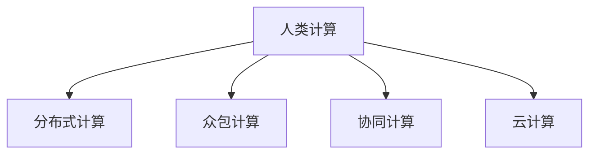

                 

# 人类计算的应用案例分析

> 关键词：人类计算, 并行计算, 分布式计算, 云计算, 数据密集型计算, 人工智能, 机器学习

## 1. 背景介绍

### 1.1 问题由来
随着信息技术的飞速发展，计算能力已经成为推动科技进步和社会进步的重要引擎。然而，传统计算范式面临着巨大的挑战：
- **计算效率瓶颈**：摩尔定律已经放缓，CPU和内存的扩展不再线性加速。
- **数据量爆炸**：社交媒体、物联网、基因组学等产生的海量数据需要高效处理。
- **计算复杂度增加**：深度学习、人工智能等复杂算法对计算能力提出更高要求。
- **资源成本高**：高性能计算设施建设和运维成本高昂，一般企业和科研机构难以承受。

人类计算（Human Computation）应运而生，它利用人类的智慧和协作，解决计算效率和资源成本等问题，提升科学研究和产业创新的效率。

### 1.2 问题核心关键点
人类计算的核心在于将人类智慧与计算资源相结合，通过分布式、众包、协同等策略，实现复杂问题的快速求解。具体包括：
- **分布式计算**：将任务分配到多个计算节点，并行执行，加速计算速度。
- **众包计算**：利用社交网络平台，通过众包任务的方式，调动大众力量完成计算。
- **协同计算**：通过社交协作，实现计算任务的动态分配和协作。
- **云计算和存储**：利用云平台强大的资源和存储能力，实现计算任务的弹性伸缩和存储管理。

### 1.3 问题研究意义
研究人类计算的应用案例，有助于深入理解其在科学研究和产业创新中的作用，挖掘其潜力和局限，促进其更广泛的应用。

## 2. 核心概念与联系

### 2.1 核心概念概述

为更好地理解人类计算的原理和应用，本节将介绍几个关键概念：

- **人类计算(Human Computation)**：利用人类的智慧和协作，解决计算效率和资源成本问题，提升科学研究和产业创新的效率。
- **分布式计算(Distributed Computing)**：将任务分配到多个计算节点，并行执行，加速计算速度。
- **众包计算(Crowdsourcing)**：利用社交网络平台，通过众包任务的方式，调动大众力量完成计算。
- **协同计算(Collaborative Computing)**：通过社交协作，实现计算任务的动态分配和协作。
- **云计算(Cloud Computing)**：利用云平台强大的资源和存储能力，实现计算任务的弹性伸缩和存储管理。

这些核心概念之间的逻辑关系可以通过以下Mermaid流程图来展示：



这个流程图展示了一体化的人类计算框架：

1. 人类计算通过分布式、众包、协同等策略，将计算任务高效分配和执行。
2. 分布式计算通过并行执行任务，提高计算效率。
3. 众包计算利用社交网络平台，调动大众力量完成计算。
4. 协同计算通过社交协作，动态分配和协作计算任务。
5. 云计算通过弹性资源管理和存储管理，提供强大的计算平台。

## 3. 核心算法原理 & 具体操作步骤
### 3.1 算法原理概述

人类计算的核心算法原理基于并行计算和分布式计算，将复杂的计算任务分解为多个子任务，并行执行。其中，常用的算法包括：

- **MapReduce**：谷歌提出的分布式计算框架，用于处理大规模数据集。
- **Spark**：基于内存计算的分布式计算框架，用于实时数据处理和机器学习任务。
- **P2P网络**：通过点对点方式，实现计算任务的无中心化分配和执行。

这些算法的共同点在于，它们都利用了并行计算和分布式计算的原理，将复杂的计算任务分解为多个子任务，通过多个计算节点并行执行，提高计算效率。

### 3.2 算法步骤详解

基于人类计算的分布式计算算法主要包括以下几个关键步骤：

**Step 1: 任务分解**
- 将复杂的计算任务分解为多个子任务，并根据任务特点选择合适的计算策略。

**Step 2: 任务分配**
- 将子任务分配到多个计算节点，并行执行。

**Step 3: 任务执行**
- 每个计算节点执行分配的子任务，生成中间结果。

**Step 4: 结果合并**
- 将各节点生成的中间结果进行合并，得到最终的计算结果。

### 3.3 算法优缺点

基于人类计算的分布式计算算法具有以下优点：
- **高效性**：通过并行计算和分布式计算，加速计算速度。
- **可扩展性**：根据任务规模动态分配和调整计算节点，灵活应对计算需求。
- **弹性资源管理**：利用云平台弹性资源，提升资源利用率。

同时，这些算法也存在一些局限性：
- **通信开销**：任务在计算节点间的通信和数据传输可能带来额外的开销。
- **任务分配复杂度**：需要根据任务特点设计合理的数据划分和任务分配策略。
- **节点一致性**：多个节点协同工作时，需要保证任务一致性和数据同步。

尽管存在这些局限性，但基于人类计算的分布式算法在处理大规模数据和复杂任务时表现出色，已经成为科学研究和产业应用的重要工具。

### 3.4 算法应用领域

基于人类计算的分布式计算算法在多个领域得到了广泛应用，例如：

- **大规模数据处理**：如Google的BigQuery、Amazon的S3、Hadoop等，用于处理海量数据。
- **人工智能和机器学习**：如TensorFlow、PyTorch、Keras等，用于训练复杂模型。
- **科学研究和工程计算**：如NASA的NASA WorldWind、NSLCS等，用于进行气候模拟、天文观测等复杂计算。
- **金融分析**：如Quandl、Zenni等，用于进行金融数据的分析和预测。

除了上述这些经典应用领域，人类计算还将在更多场景中发挥重要作用，如医疗、教育、智能制造等，为各行业带来变革性影响。

## 4. 数学模型和公式 & 详细讲解  
### 4.1 数学模型构建

在分布式计算中，通常使用MapReduce算法来处理大规模数据集。MapReduce的核心思想是：
- **Map**：将输入数据集分解为多个子集，在多个计算节点上并行处理。
- **Reduce**：将各节点处理后的结果进行合并，得到最终结果。

以一个简单的WordCount任务为例，数学模型可以表示为：
$$
Output = \bigcup_{i=1}^N Map(i)(Input_i) \bigcup Reduce(\{Map(i)(Input_i)\}_{i=1}^N)
$$

其中：
- $Output$ 表示最终输出结果。
- $Input$ 表示原始输入数据集。
- $Map$ 表示Map函数，将输入数据集分解为多个子集并计算每个子集。
- $Reduce$ 表示Reduce函数，将各子集的结果进行合并。
- $N$ 表示计算节点的数量。

### 4.2 公式推导过程

假设输入数据集 $Input$ 为 $[n_1, n_2, ..., n_m]$，Map函数将每个元素 $n_i$ 映射为 $(n_i, count(n_i))$，Reduce函数将每个Map函数的结果 $(n_i, count(n_i))$ 进行合并，生成最终结果 $(\{n_i\}, \{count(n_i)\})$。

具体计算步骤如下：
1. **Map阶段**：将输入数据集 $Input$ 分解为多个子集 $Input_1, Input_2, ..., Input_N$，并行计算每个子集。
2. **Reduce阶段**：将各节点生成的结果进行合并，得到最终结果。

### 4.3 案例分析与讲解

以一个简单的WordCount任务为例，假设输入数据集为 $[apple, orange, apple, banana, banana, banana, apple, orange]$，计算每个单词的出现次数。

1. **Map阶段**：将输入数据集分解为多个子集，并行计算每个子集。
   - $Map(1)$：将 $[apple, orange, apple, banana, banana, banana, apple, orange]$ 分解为 $[apple, orange, apple, banana]$ 和 $[banana, banana, banana, apple, orange]$。
   - $Map(2)$：将 $[apple, orange, apple, banana]$ 映射为 $[(apple, 2), (orange, 1), (apple, 2), (banana, 1)]$。
   - $Map(3)$：将 $[banana, banana, banana, apple, orange]$ 映射为 $[(banana, 3), (banana, 2), (banana, 1), (apple, 1), (orange, 1)]$。

2. **Reduce阶段**：将各节点生成的结果进行合并，得到最终结果。
   - $Reduce((apple, 2), (orange, 1), (apple, 2), (banana, 1))$ 生成 $(apple, 4)$。
   - $Reduce((banana, 3), (banana, 2), (banana, 1), (apple, 1), (orange, 1))$ 生成 $(banana, 6)$。

最终输出结果为 $(apple, 4), (banana, 6)$。

## 5. 项目实践：代码实例和详细解释说明
### 5.1 开发环境搭建

在进行分布式计算实践前，我们需要准备好开发环境。以下是使用Python进行Apache Hadoop开发的环境配置流程：

1. 安装Apache Hadoop：从官网下载并安装Hadoop，配置环境变量和启动服务。

2. 安装Python的Hadoop客户端库：
```bash
pip install hadoop
```

3. 编写Python脚本：使用Python脚本执行MapReduce任务。

4. 提交任务：使用Hadoop的Command Line Interface（CLI）提交任务。

完成上述步骤后，即可在本地或集群上执行MapReduce任务。

### 5.2 源代码详细实现

以下是使用Python编写WordCount任务的代码实现：

```python
from hadoop.io import Text
from hadoop.mapreduce import Job
from hadoop.mapreduce.lib.python.text import Text

# 定义Map函数
def mapper(record):
    key = record[0]
    value = record[1]
    yield Text(key), Text(value)

# 定义Reduce函数
def reducer(key, values):
    count = sum(1 for value in values)
    yield Text(key, str(count))

# 创建Job对象，设置任务入口和输出路径
job = Job('wordcount', mapper=mapper, reducer=reducer, output='output')
job.set_input_paths('/input')
job.set_output_path('/output')
job.run()
```

以上代码实现了WordCount任务的基本逻辑，包括Map函数和Reduce函数。

### 5.3 代码解读与分析

**Mapper函数**：
- 输入为一个二元组 $(record[0], record[1])$，其中 $record[0]$ 表示单词，$record[1]$ 表示计数。
- 将每个单词和计数作为键值对输出。

**Reducer函数**：
- 将相同单词的计数进行累加，生成最终的输出结果。

**Job对象创建**：
- 使用Job类创建Job对象，设置任务入口函数和输出路径。
- 调用Job对象的run方法启动任务。

**任务提交**：
- 使用Hadoop的CLI工具提交任务，将输入路径和输出路径传递给Job对象。
- 等待任务完成后，从输出路径读取结果。

## 6. 实际应用场景
### 6.1 大规模数据处理

分布式计算在处理大规模数据时表现出色，广泛应用于各类数据密集型计算任务。例如：
- **数据清洗和预处理**：如数据去重、缺失值填充等。
- **数据聚合和统计**：如计算平均值、中位数、最大值等。
- **数据挖掘和分析**：如关联规则挖掘、分类和聚类等。

### 6.2 人工智能和机器学习

分布式计算在训练大规模模型和进行复杂的机器学习任务时同样重要，可以加速训练速度，提高模型的精度。例如：
- **大规模深度学习模型训练**：如卷积神经网络（CNN）、循环神经网络（RNN）等。
- **强化学习训练**：如AlphaGo、AlphaZero等。

### 6.3 科学研究和工程计算

分布式计算在科学研究和工程计算中也有广泛应用，可以高效处理复杂的计算任务。例如：
- **气候模拟和天文观测**：如NASA的NASA WorldWind、NSLCS等。
- **化学模拟和分子建模**：如GROMACS、AMBER等。

### 6.4 金融分析

分布式计算在金融分析中也发挥了重要作用，可以处理大量的金融数据和复杂的计算任务。例如：
- **高频交易**：如Quandl、Zenni等。
- **风险管理**：如风险评估、违约预测等。

## 7. 工具和资源推荐
### 7.1 学习资源推荐

为了帮助开发者掌握分布式计算的理论基础和实践技巧，这里推荐一些优质的学习资源：

1. 《Hadoop权威指南》：详细介绍了Hadoop的原理、配置、使用和优化。
2. 《Spark权威指南》：介绍了Spark的核心原理、API使用和优化。
3. 《分布式计算与MapReduce》：深入浅出地讲解了分布式计算的原理和MapReduce算法的应用。
4. Coursera的分布式系统课程：由斯坦福大学教授讲授，全面介绍分布式系统的原理和实现。
5. Udacity的Spark工程师纳米学位：涵盖Spark的原理、配置和优化，实战性强。

通过对这些资源的学习实践，相信你一定能够快速掌握分布式计算的理论基础和实践技巧，并用于解决实际的计算问题。

### 7.2 开发工具推荐

高效的开发离不开优秀的工具支持。以下是几款用于分布式计算开发的常用工具：

1. Apache Hadoop：Apache基金会开源的分布式计算框架，支持大规模数据处理和存储。
2. Apache Spark：Apache基金会开源的快速迭代分布式计算框架，支持内存计算和流式处理。
3. Apache Flink：Apache基金会开源的分布式流处理和批处理框架，支持低延迟和高效处理。
4. PySpark：Python的Spark客户端库，提供简单易用的API和丰富的数据分析工具。
5. Hive：基于Hadoop的数据仓库解决方案，支持SQL查询和数据处理。

合理利用这些工具，可以显著提升分布式计算任务的开发效率，加快创新迭代的步伐。

### 7.3 相关论文推荐

分布式计算的发展源于学界的持续研究。以下是几篇奠基性的相关论文，推荐阅读：

1. Google的MapReduce论文：提出了MapReduce分布式计算框架，奠定了分布式计算的基础。
2. Apache Spark的论文：介绍了Spark的原理、API和优化，推动了内存计算的发展。
3. Facebook的Tera：介绍了Tera分布式存储系统，支持大规模数据的高效存储和管理。
4. Stanford的NoSQL：介绍了NoSQL数据库的原理和应用，推动了非关系型数据库的发展。
5. Microsoft的Azure Data Lake：介绍了Azure Data Lake的架构和应用，推动了云数据湖的发展。

这些论文代表了大规模分布式计算的发展脉络。通过学习这些前沿成果，可以帮助研究者把握学科前进方向，激发更多的创新灵感。

## 8. 总结：未来发展趋势与挑战
### 8.1 总结

本文对基于人类计算的分布式计算方法进行了全面系统的介绍。首先阐述了人类计算的背景和意义，明确了分布式计算在科学研究和产业创新中的重要作用。其次，从原理到实践，详细讲解了分布式计算的数学模型和操作步骤，给出了分布式计算任务开发的完整代码实例。同时，本文还广泛探讨了分布式计算在各类实际应用中的广泛应用，展示了其巨大的潜力。

通过本文的系统梳理，可以看到，分布式计算已经成为科学研究和产业应用的重要工具，极大地提升了计算效率和资源利用率。未来，伴随分布式计算技术的不断演进，相信其在更多领域的应用将更为广泛，为各行业的创新发展提供新的动力。

### 8.2 未来发展趋势

展望未来，分布式计算的发展趋势将呈现以下几个方向：

1. **云原生分布式计算**：利用云计算平台提供弹性资源和存储管理，实现分布式计算的自动化和高效化。
2. **边缘计算**：将计算任务分布到边缘设备，减少数据传输，提高计算效率。
3. **混合计算模型**：结合集中式和分布式计算的优点，实现复杂任务的灵活调度。
4. **区块链分布式计算**：利用区块链技术，实现分布式计算任务的透明、安全和可控。
5. **智能分布式计算**：结合人工智能技术，实现任务的自动调度和优化。

以上趋势凸显了分布式计算的广阔前景，其与云计算、物联网、人工智能等技术相结合，将为各行业带来更高效、更灵活、更安全的计算环境。

### 8.3 面临的挑战

尽管分布式计算已经取得了显著的进展，但在迈向更加智能化、普适化应用的过程中，它仍面临诸多挑战：

1. **通信开销**：数据在节点间的传输和同步可能带来额外的开销。
2. **节点一致性**：多个节点协同工作时，需要保证任务一致性和数据同步。
3. **资源管理**：需要设计合理的数据划分和任务分配策略，提升资源利用率。
4. **算法复杂度**：分布式算法的实现和优化需要考虑多节点协作和任务调度的复杂性。
5. **系统鲁棒性**：系统需要在高并发和故障情况下保持稳定性和可靠性。

尽管存在这些挑战，但随着分布式计算技术的不断演进和优化，其将在更广泛的领域得到应用，成为未来计算的基础设施。

### 8.4 研究展望

面对分布式计算所面临的种种挑战，未来的研究需要在以下几个方面寻求新的突破：

1. **优化通信开销**：通过数据压缩、异步通信等技术，减少数据传输的开销。
2. **提升任务一致性**：引入一致性协议，保证节点间的数据同步和任务一致性。
3. **优化资源管理**：设计自适应资源管理策略，根据任务特点动态调整计算资源。
4. **简化算法复杂度**：引入智能调度算法，简化分布式计算的实现和优化。
5. **增强系统鲁棒性**：通过冗余设计和容错机制，增强系统的稳定性和可靠性。

这些研究方向和突破，将引领分布式计算技术迈向更高的台阶，为各行业带来更高效、更灵活、更安全的计算环境。总之，分布式计算需要从理论到实践的不断探索和创新，才能真正实现其在各领域的广泛应用。

## 9. 附录：常见问题与解答

**Q1：分布式计算适用于哪些类型的数据处理任务？**

A: 分布式计算适用于各类数据密集型计算任务，主要包括以下类型：
1. 大规模数据清洗和预处理：如数据去重、缺失值填充等。
2. 大规模数据聚合和统计：如计算平均值、中位数、最大值等。
3. 大规模数据挖掘和分析：如关联规则挖掘、分类和聚类等。
4. 大规模机器学习和深度学习：如卷积神经网络（CNN）、循环神经网络（RNN）等。
5. 大规模科学研究和工程计算：如气候模拟、天文观测等。

**Q2：分布式计算和集中式计算有何区别？**

A: 分布式计算和集中式计算的主要区别在于数据处理的方式：
1. 集中式计算：所有计算任务由单个计算节点处理，适用于数据量较小、计算任务简单的场景。
2. 分布式计算：将计算任务分配到多个计算节点，并行执行，适用于数据量较大、计算任务复杂的场景。

**Q3：分布式计算需要考虑哪些性能指标？**

A: 分布式计算需要考虑以下性能指标：
1. 计算效率：单位时间内处理的计算任务数量。
2. 通信开销：数据在节点间的传输和同步开销。
3. 任务一致性：多个节点协同工作时，需要保证任务一致性和数据同步。
4. 资源利用率：计算资源的分配和利用情况。
5. 系统鲁棒性：系统在高并发和故障情况下的稳定性和可靠性。

**Q4：如何优化分布式计算任务的性能？**

A: 优化分布式计算任务的性能可以从以下几个方面入手：
1. 数据划分策略：设计合理的数据划分策略，减少通信开销和计算负载。
2. 任务调度算法：设计高效的调度算法，提升计算资源的利用率。
3. 通信优化技术：使用数据压缩、异步通信等技术，减少数据传输的开销。
4. 系统冗余设计：通过冗余设计和容错机制，增强系统的稳定性和可靠性。
5. 智能调度算法：引入智能调度算法，实现任务的自动调度和优化。

这些优化策略需要根据具体任务和系统特点，灵活应用和组合。只有在数据、算法、工程、业务等多个维度进行全面优化，才能最大限度地提升分布式计算任务的性能。

**Q5：分布式计算在实际应用中需要注意哪些问题？**

A: 在分布式计算的实际应用中，需要注意以下问题：
1. 数据传输安全性：确保数据在节点间的传输安全，防止数据泄露和篡改。
2. 任务调度公平性：确保所有节点都能够公平地获取计算任务，避免资源浪费。
3. 任务执行效率：确保任务在各个节点上的执行效率，避免瓶颈影响整体性能。
4. 系统可扩展性：确保系统能够动态扩展和调整计算资源，应对不同的计算需求。
5. 系统监控和调优：实时监控系统性能，及时发现和解决性能瓶颈。

合理规避和处理这些问题，可以确保分布式计算系统在实际应用中的稳定性和高效性。

---

作者：禅与计算机程序设计艺术 / Zen and the Art of Computer Programming

