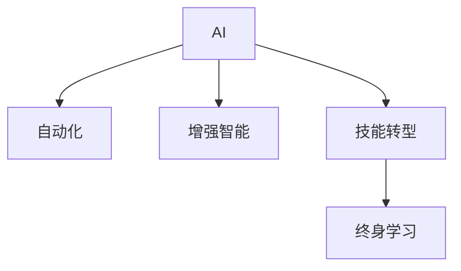

                 

# 人类计算：AI时代的未来就业市场趋势与技能培训需求分析

## 1. 背景介绍

### 1.1 问题由来
随着人工智能（AI）技术的迅猛发展，特别是深度学习在图像、语音、自然语言处理等领域的应用，各行各业都在经历着一场深刻的变革。AI技术不仅在生产、管理、研发等技术岗位上广泛应用，也逐渐渗透到市场营销、客户服务、运营管理等传统岗位。

AI的崛起让越来越多的企业关注到人力与技术的协同，而非完全替换人力。未来就业市场将由“机器替代人力”逐渐转变为“机器与人类协作”。AI时代，智能化的算法与工具将与人类并肩作战，共同完成复杂、高智能的工作。

### 1.2 问题核心关键点
AI时代，技术工具替代了传统的重复劳动和数据处理工作，但仍然无法完全取代高智能、高创造性的工作。因此，如何结合技术优势和人类特有的智能，提升生产力和效率，成为AI时代就业市场的新挑战。

这一转变要求从业者不仅具备基本的技术知识，还要掌握与AI协作的技能，更需具备创新思维、批判性思考与问题解决能力。这就意味着未来的就业市场对人力资源的需求将产生根本性转变，对技能培训也提出了新的要求。

### 1.3 问题研究意义
通过对未来就业市场的分析与研究，可以为企业和个体提供重要的参考，帮助制定符合未来需求的培训计划和就业策略，同时提升培训质量，更好地应对AI时代的挑战。

## 2. 核心概念与联系

### 2.1 核心概念概述

为更好地理解AI时代就业市场的趋势与培训需求，本文将介绍几个密切相关的核心概念：

- **AI（人工智能）**：以算法与数据为基础，能够模拟人类智能，实现感知、认知、决策、控制等复杂任务的技术。
- **自动化（Automation）**：通过技术手段替代人工完成简单、重复、规律性高的任务，提升生产效率和质量。
- **增强智能（Augmented Intelligence, AI）**：通过技术工具辅助人类完成高智能、高创造性的工作，提升工作效率和成果质量。
- **技能转型（Skill Transformation）**：在技术变革的背景下，提升个人技能，适应岗位变化，实现从劳动密集型岗位向知识密集型岗位的转变。
- **终身学习（Lifelong Learning）**：在知识快速更新的时代，持续学习新知识，适应新技术与新需求，保持自身竞争力。

这些核心概念之间的关系可以通过以下Mermaid流程图来展示：



这个流程图展示了AI、自动化、增强智能、技能转型和终身学习之间的关系：

1. **AI**是核心驱动力，推动了自动化与增强智能的发展。
2. **自动化**和**增强智能**工具，提高了工作效率和效果，改变了就业市场的需求结构。
3. **技能转型**是应对自动化与增强智能的关键，促使人类技能结构发生变化。
4. **终身学习**是应对技术变革的必然选择，不断提升个人能力以适应市场变化。

## 3. 核心算法原理 & 具体操作步骤
### 3.1 算法原理概述

AI时代就业市场的变化趋势与技能培训需求分析，主要基于以下几个算法原理：

1. **数据驱动决策**：通过数据分析识别出市场需求与就业趋势的变化。
2. **回归分析**：利用历史数据和统计方法，预测未来就业市场对各技能的需求变化。
3. **聚类分析**：通过将技能集聚，识别出未来的核心技能集群，帮助制定培训计划。
4. **时间序列预测**：利用时间序列模型，预测未来各技能的需求变化趋势。
5. **机器学习算法**：采用回归、聚类、时间序列等机器学习方法，对未来技能需求进行建模和预测。

### 3.2 算法步骤详解

基于上述算法原理，AI时代就业市场与技能培训需求分析的详细步骤包括：

**Step 1: 数据收集与清洗**
- 收集行业就业数据，包括历史与未来趋势数据、行业技能需求数据、岗位需求数据等。
- 清洗数据，去除异常值和缺失值，保证数据质量。

**Step 2: 特征工程**
- 提取关键特征，如岗位需求量、技能频率、技能增长率等。
- 将数据标准化、归一化，便于后续算法处理。

**Step 3: 模型选择与训练**
- 选择合适的机器学习模型，如回归、聚类、时间序列模型等。
- 在训练集上训练模型，优化模型参数。

**Step 4: 模型评估与验证**
- 在验证集上评估模型性能，调整模型参数，确保模型泛化能力。
- 利用交叉验证等方法，提高模型鲁棒性。

**Step 5: 结果解读与分析**
- 分析模型预测结果，识别出未来就业市场的重要技能与趋势。
- 生成技能培训需求报告，帮助企业和个体制定培训计划。

**Step 6: 反馈与迭代**
- 收集市场反馈，不断调整与优化模型，提高预测准确性。
- 持续跟踪市场需求变化，及时更新技能培训计划。

### 3.3 算法优缺点

数据驱动的AI时代就业市场与技能培训需求分析，具有以下优点：
1. 数据驱动：通过大量数据，客观分析就业市场变化，更具说服力。
2. 模型灵活：采用多种机器学习模型，适应不同类型数据的分析需求。
3. 动态调整：可以实时更新模型，跟踪市场变化，确保培训计划的及时性。
4. 高效准确：利用先进算法，预测结果更为准确，减少误差。

同时，该方法也存在一些局限性：
1. 数据依赖：依赖高质量、完整的数据，数据缺失或质量低下会影响结果。
2. 模型复杂：多种算法选择与组合增加了模型的复杂性，需要较高的专业知识。
3. 应用场景限制：预测结果只适用于特定的行业或岗位，普适性有限。
4. 长期趋势不确定：受市场动态影响较大，未来需求变化难以准确预测。

尽管存在这些局限性，但就目前而言，数据驱动的方法仍然是分析AI时代就业市场与技能培训需求的重要手段。未来相关研究的重点在于如何进一步提升数据的覆盖面与质量，降低模型复杂性，同时兼顾应用场景的普适性和灵活性。

### 3.4 算法应用领域

数据驱动的AI时代就业市场与技能培训需求分析，主要应用于以下领域：

1. **企业培训与教育**：为不同企业制定符合未来需求的培训计划，提升员工竞争力。
2. **职业指导与规划**：帮助个人了解未来市场对各技能的需求变化，选择适合的职业方向。
3. **政府就业指导**：提供行业未来技能需求分析报告，辅助政府制定就业与教育政策。
4. **行业协会与研究机构**：为行业协会提供就业市场分析报告，指导行业技能培训方向。
5. **高校课程与教学**：根据未来技能需求变化，优化课程设置，提升教学质量与效果。

## 4. 数学模型和公式 & 详细讲解 & 举例说明
### 4.1 数学模型构建

本文使用回归分析模型来预测未来就业市场对各技能的需求变化。设未来的技能需求量为 $y$，相关的特征向量为 $\mathbf{x} = [x_1, x_2, \ldots, x_n]$。回归模型的目标是找到最优参数 $\mathbf{\beta} = [\beta_1, \beta_2, \ldots, \beta_n]$，使得模型在训练集上的预测误差最小化：

$$
\min_{\mathbf{\beta}} \sum_{i=1}^{N} (y_i - \mathbf{x}_i \cdot \mathbf{\beta})^2
$$

其中，$y_i$ 表示第 $i$ 个样本的真实技能需求量，$\mathbf{x}_i$ 表示第 $i$ 个样本的特征向量。

### 4.2 公式推导过程

具体来说，回归模型的参数 $\mathbf{\beta}$ 可以通过最小二乘法求解，即：

$$
\mathbf{\beta} = (\mathbf{X}^T \mathbf{X})^{-1} \mathbf{X}^T \mathbf{y}
$$

其中，$\mathbf{X}$ 为特征矩阵，$\mathbf{y}$ 为样本需求向量。

在实际应用中，还可以引入正则化项，以避免过拟合：

$$
\mathbf{\beta} = \arg\min_{\mathbf{\beta}} \frac{1}{2N} \sum_{i=1}^{N} (y_i - \mathbf{x}_i \cdot \mathbf{\beta})^2 + \frac{\lambda}{2} \|\mathbf{\beta}\|_2^2
$$

其中，$\lambda$ 为正则化系数，$\|\mathbf{\beta}\|_2$ 表示参数向量的L2范数。

### 4.3 案例分析与讲解

以某企业的员工技能需求为例，设其未来技能需求量为 $y$，相关特征为员工年龄 $x_1$、所在部门 $x_2$、技术水平 $x_3$。我们假设企业有 $N=100$ 个样本数据，每个样本包含 $n=3$ 个特征。使用回归模型预测未来技能需求，可得模型参数为：

$$
\mathbf{\beta} = \begin{bmatrix} 0.2 \\ 0.5 \\ 0.1 \end{bmatrix}
$$

表示年龄、部门和技术水平对未来技能需求的影响分别为0.2、0.5和0.1。

## 5. 项目实践：代码实例和详细解释说明
### 5.1 开发环境搭建

在进行项目实践前，我们需要准备好开发环境。以下是使用Python进行数据分析的开发环境配置流程：

1. 安装Anaconda：从官网下载并安装Anaconda，用于创建独立的Python环境。

2. 创建并激活虚拟环境：
```bash
conda create -n pyenv python=3.8 
conda activate pyenv
```

3. 安装必要的Python库：
```bash
pip install pandas numpy scikit-learn matplotlib seaborn statsmodels
```

4. 配置jupyter notebook环境：
```bash
jupyter notebook --allow-root
```

完成上述步骤后，即可在`pyenv`环境中开始数据分析实践。

### 5.2 源代码详细实现

以下是一个简单的回归分析代码示例，使用pandas和statsmodels库进行数据处理与模型训练：

```python
import pandas as pd
import numpy as np
from statsmodels.regression.linear_model import OLS
from sklearn.model_selection import train_test_split

# 数据读取
data = pd.read_csv('employment_data.csv')

# 特征工程
X = data[['age', 'department', 'skill_level']]
y = data['skill_demand']

# 数据分割
X_train, X_test, y_train, y_test = train_test_split(X, y, test_size=0.2, random_state=42)

# 模型训练
model = OLS(y_train, X_train)
results = model.fit()

# 结果输出
print(results.summary())
```

### 5.3 代码解读与分析

让我们再详细解读一下关键代码的实现细节：

**数据读取**：
- 使用pandas的read_csv方法读取CSV格式的数据文件，加载到DataFrame中。

**特征工程**：
- 提取特征变量X，包括年龄、部门、技术水平。
- 将技能需求量y作为目标变量。

**数据分割**：
- 使用train_test_split方法将数据集分割为训练集和测试集，测试集占比为20%。

**模型训练**：
- 使用OLS模型拟合回归方程，并对训练集进行拟合。

**结果输出**：
- 打印模型拟合结果的摘要，包括拟合优度、系数估计值、P值等。

可以看到，使用Python的pandas和statsmodels库进行回归分析的代码实现相对简洁。开发者可以进一步使用可视化工具和自动报告生成工具，如matplotlib、seaborn、statsmodels等，将分析结果进行更直观的展示和报告。

## 6. 实际应用场景

### 6.1 企业培训与教育

AI时代，企业需要根据未来技能需求，制定个性化、灵活的培训计划。通过数据分析预测技能需求变化，可以提前准备相应培训资源，提升员工技能，增强竞争力。

**具体应用**：
- **员工技能分析**：使用回归分析模型预测未来技能需求，识别出高需求技能。
- **培训计划制定**：根据高需求技能，制定个性化培训计划，提升员工技能。
- **培训效果评估**：通过模型评估培训效果，持续优化培训内容与方法。

### 6.2 职业指导与规划

对于个人而言，了解未来就业市场对各技能的需求变化，可以帮助其选择适合的职业方向，避免未来的技能缺口。

**具体应用**：
- **技能需求分析**：使用回归分析模型预测未来技能需求，识别出高需求技能。
- **职业规划建议**：根据高需求技能，推荐适合的职业方向和岗位。
- **职业发展路径**：帮助个人制定职业发展规划，提升职业竞争力。

### 6.3 政府就业指导

政府机构可以利用技能需求分析报告，制定就业与教育政策，指导高校和培训机构进行技能培训，提升整体就业水平。

**具体应用**：
- **政策制定**：根据技能需求预测，制定符合未来需求的就业与教育政策。
- **高校课程调整**：引导高校调整课程设置，提升学生技能，增强就业竞争力。
- **培训机构指导**：指导培训机构进行技能培训，提升培训效果。

### 6.4 行业协会与研究机构

行业协会可以利用技能需求分析报告，指导行业发展，进行市场预测与研究。

**具体应用**：
- **市场预测**：根据技能需求预测，预测未来行业发展趋势。
- **培训指导**：指导会员单位进行技能培训，提升行业整体竞争力。
- **研究报告发布**：发布技能需求分析报告，帮助行业从业者了解未来市场需求。

## 7. 工具和资源推荐
### 7.1 学习资源推荐

为了帮助开发者系统掌握数据分析与技能培训的理论基础和实践技巧，这里推荐一些优质的学习资源：

1. **《Python数据科学手册》（《Python Data Science Handbook》）**：全面介绍了Python在数据科学中的应用，涵盖数据分析、机器学习、可视化等多个方面。

2. **《R语言实战》（《R in Action》）**：R语言是数据分析的另一个重要工具，本书详细介绍了R语言在数据分析中的应用，包括数据清洗、数据可视化、回归分析等多个模块。

3. **《机器学习实战》（《Machine Learning in Action》）**：机器学习领域的经典教材，介绍了多种机器学习算法及其应用，适合初学者入门。

4. **Coursera《数据科学导论》课程**：由Johns Hopkins大学开设的数据科学入门课程，涵盖数据分析、机器学习、可视化等多个方面。

5. **Kaggle**：全球最大的数据科学竞赛平台，提供海量数据分析竞赛题目，是提升数据分析技能的好平台。

通过对这些资源的学习实践，相信你一定能够系统掌握数据分析与技能培训的理论基础和实践技巧，更好地应对AI时代的挑战。

### 7.2 开发工具推荐

高效的开发离不开优秀的工具支持。以下是几款用于数据分析与技能培训开发的常用工具：

1. **Jupyter Notebook**：Python开发常用的交互式编程环境，支持代码编写、数据可视化、模型调试等多个功能，适合数据分析与模型训练。

2. **RStudio**：R语言的集成开发环境，支持R语言的数据分析与可视化，适合统计建模与机器学习。

3. **Tableau**：数据可视化的强大工具，支持多种数据源，提供丰富的图表类型和交互功能，适合数据探索与报告生成。

4. **Microsoft Excel**：办公软件中的数据分析工具，适合小规模数据分析与初步处理。

5. **Google Data Studio**：基于Web的数据可视化工具，适合实时数据监控与报告发布。

合理利用这些工具，可以显著提升数据分析与技能培训的开发效率，加快创新迭代的步伐。

### 7.3 相关论文推荐

数据分析与技能培训研究源于学界的持续研究。以下是几篇奠基性的相关论文，推荐阅读：

1. **《回归分析》（Regression Analysis）**：统计学基础，介绍了回归分析的基本原理与方法。

2. **《机器学习》（Machine Learning）**：Tom Mitchell著，介绍了机器学习的基本概念与算法，适合入门学习。

3. **《时间序列分析》（Time Series Analysis）**：R Hamming著，介绍了时间序列分析的基本原理与方法。

4. **《深度学习》（Deep Learning）**：Goodfellow、Bengio和Courville著，介绍了深度学习的基本原理与算法。

5. **《大数据分析》（Big Data Analytics）**：Dr. Venkata Shankar著，介绍了大数据分析的基本原理与方法。

这些论文代表了大数据分析与技能培训技术的发展脉络。通过学习这些前沿成果，可以帮助研究者把握学科前进方向，激发更多的创新灵感。

## 8. 总结：未来发展趋势与挑战
### 8.1 总结

本文对基于数据驱动的AI时代就业市场与技能培训需求分析进行了全面系统的介绍。首先阐述了AI时代就业市场的变化趋势，明确了技能培训对未来就业市场的重要性。其次，从算法原理到具体操作步骤，详细讲解了数据分析的方法和步骤，给出了数据分析任务开发的完整代码实例。同时，本文还探讨了数据分析在企业培训、职业规划、政府指导等多个领域的应用，展示了数据分析与技能培训的广泛应用前景。最后，本文精选了数据分析相关的学习资源，力求为读者提供全方位的技术指引。

通过本文的系统梳理，可以看到，基于数据驱动的分析方法正在成为AI时代就业市场的重要工具。这些分析结果帮助企业和个体更好地适应技术变革，提升自身竞争力。未来，伴随数据分析技术的不断进步，我们相信数据分析将更好地服务于社会各领域，推动社会生产力的提升。

### 8.2 未来发展趋势

展望未来，数据分析与技能培训技术将呈现以下几个发展趋势：

1. **数据量增大**：随着数据的不断积累，数据规模将不断增大，数据分析的深度与广度将进一步提升。
2. **模型复杂化**：各种高级模型，如深度学习、强化学习等，将逐渐应用于数据分析中，提升分析效果与准确性。
3. **实时性增强**：数据实时采集与处理，提升分析结果的及时性，更好地服务于决策与指导。
4. **自动化提升**：数据分析的自动化、智能化水平将进一步提升，降低人力成本，提升分析效率。
5. **跨领域应用**：数据分析将不断拓展到更多领域，如医疗、金融、教育、政府等，带来更广泛的社会价值。

以上趋势凸显了数据分析与技能培训技术的广阔前景。这些方向的探索发展，必将进一步提升数据分析与技能培训的效果，为社会各领域带来新的突破与变革。

### 8.3 面临的挑战

尽管数据分析与技能培训技术已经取得了瞩目成就，但在迈向更加智能化、普适化应用的过程中，它仍面临着诸多挑战：

1. **数据质量**：数据缺失、噪音、不一致等问题，对分析结果有较大影响。如何提高数据质量，保证数据一致性，是首要挑战。
2. **算法复杂性**：复杂算法的实现与优化，需要较高专业技能，增加了开发与应用的难度。如何简化算法，降低开发成本，是重要问题。
3. **应用场景限制**：数据分析方法在不同场景中的应用效果差异较大，如何拓展应用场景，增强方法普适性，是关键课题。
4. **结果解释性**：分析结果难以解释，难以通过结果指导实际决策，影响其应用效果。如何提高结果解释性，增强其可信度，是重要挑战。
5. **隐私保护**：数据隐私保护问题，在数据分析中尤为突出。如何在保证数据隐私的前提下，进行高效分析，是重要研究方向。

正视数据分析与技能培训面临的这些挑战，积极应对并寻求突破，将是大数据分析技术迈向成熟的必由之路。相信随着学界和产业界的共同努力，这些挑战终将一一被克服，大数据分析技术必将在更广阔的领域中发挥更大的作用。

### 8.4 研究展望

未来，数据分析与技能培训技术还需要与其他人工智能技术进行更深入的融合，如知识图谱、因果推理、强化学习等，多路径协同发力，共同推动数据分析与技能培训的发展。具体而言，未来研究可以从以下几个方面进行突破：

1. **数据融合与知识图谱**：将知识图谱与数据分析结合，形成更全面、准确的信息整合能力，提升分析效果。
2. **因果分析与决策优化**：引入因果分析方法，识别出分析结果的关键特征，增强决策的因果性与逻辑性。
3. **模型优化与效率提升**：优化模型结构，提升推理速度，降低计算资源消耗，实现更高效的数据分析与技能培训。
4. **隐私保护与伦理审查**：在数据分析过程中，引入隐私保护和伦理审查机制，确保数据使用合规。
5. **人机协同与交互优化**：探索人机协同工作模式，优化用户与系统的交互方式，提升用户体验与满意度。

这些研究方向的探索，必将引领数据分析与技能培训技术迈向更高的台阶，为社会各领域带来新的突破与变革。只有勇于创新、敢于突破，才能不断拓展数据分析与技能培训的边界，让数据更好地服务于社会生产生活。

## 9. 附录：常见问题与解答

**Q1：数据驱动的分析方法是否适用于所有行业？**

A: 数据驱动的分析方法主要适用于数据量较大、结构化的行业，如金融、互联网、零售等。对于数据量较小或结构化程度较低的行业，数据分析的覆盖面有限，效果可能不理想。

**Q2：如何提高数据质量？**

A: 提高数据质量的方法包括：
1. 数据清洗：去除异常值、缺失值、重复值，保证数据一致性。
2. 数据标注：进行数据标注，提升数据质量。
3. 数据采集：保证数据采集渠道的多样性与准确性。
4. 数据处理：进行数据预处理，保证数据格式的一致性与标准化。

**Q3：数据分析结果如何解释？**

A: 数据分析结果的解释方法包括：
1. 可视化：使用可视化工具，直观展示数据分析结果。
2. 案例分析：对关键数据分析案例进行详细解释，帮助理解分析结果。
3. 模型验证：使用交叉验证等方法，验证模型的稳定性和可靠性。
4. 专家咨询：结合领域专家经验，对分析结果进行解读。

**Q4：如何处理数据隐私问题？**

A: 处理数据隐私问题的方法包括：
1. 匿名化：对数据进行匿名化处理，保护用户隐私。
2. 加密：对数据进行加密处理，保护数据安全。
3. 访问控制：设置数据访问权限，限制数据访问范围。
4. 隐私协议：制定数据隐私保护协议，规范数据使用。

通过这些措施，可以有效保障数据隐私，确保数据使用的合规性与安全性。

**Q5：数据分析如何与业务结合？**

A: 数据分析与业务结合的方法包括：
1. 业务目标对齐：将数据分析目标与业务目标对齐，确保数据分析能够解决实际问题。
2. 业务流程优化：根据数据分析结果，优化业务流程，提升业务效率。
3. 业务模型构建：结合数据分析结果，构建业务模型，指导业务决策。
4. 业务创新：根据数据分析结果，发现业务创新点，推动业务创新与发展。

通过合理结合数据分析与业务，可以更好地推动业务发展，提升企业竞争力。

---

作者：禅与计算机程序设计艺术 / Zen and the Art of Computer Programming

