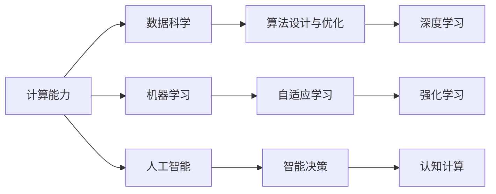

                 

# 人类计算：AI时代的未来技能发展与培训趋势

> 关键词：人类计算, AI时代, 未来技能发展, 技能培训趋势, 技术变革, 机器学习, 数据科学, 人工智能, 计算机科学, 教育与培训

## 1. 背景介绍

### 1.1 问题由来
随着人工智能(AI)技术的飞速发展，特别是深度学习与大数据技术的兴起，我们正步入AI时代。在这一时代背景下，许多传统岗位和技能面临淘汰，同时又出现了许多全新的职业和需求。比如，传统的办公室文员岗位逐渐减少，而数据科学家、机器学习工程师等新兴岗位需求激增。

面对这种技术变革，社会各界都在积极探索应对策略。政府、企业、学校和研究机构都认识到，更新和提升人类的计算能力，使之适应AI时代的挑战，是实现可持续发展的重要保障。在此背景下，“人类计算”的概念应运而生，旨在通过提升个体计算能力，解决AI时代的技术挑战，推动社会的进步。

### 1.2 问题核心关键点
“人类计算”的核心在于如何通过教育和培训，提升人类的计算能力。这不仅包括传统的数学与科学计算，更包括数据处理、算法优化、机器学习等方面的能力。具体来说，“人类计算”的关键点包括：

- 更新教育内容，将现代计算机科学与数据科学的知识融入基础教育。
- 推动终身学习，通过在线课程、研讨会、工作坊等多种形式，持续提升成人技能。
- 创建跨学科的知识体系，促进计算机科学与其它学科如心理学、社会学、经济学等的融合。

### 1.3 问题研究意义
研究“人类计算”的意义重大：

- **提升竞争力**：在AI时代，计算能力成为一种核心竞争力。掌握计算机科学与数据科学知识，对于个人职业发展具有重要意义。
- **促进经济发展**：技术革新带来产业结构的变化，掌握新的计算技能，有助于推动新兴产业的发展，促进经济增长。
- **社会稳定**：通过教育和培训，缓解因技术变革引发的职业转型和岗位调整压力，有助于社会稳定。
- **推动科学研究**：计算能力的提升，使得科学研究更加高效，能够处理更大规模的数据，进行更深入的复杂分析。

## 2. 核心概念与联系

### 2.1 核心概念概述

要深入理解“人类计算”的原理和应用，首先需要明确几个关键概念：

- **计算能力**：包括逻辑思维能力、问题解决能力、数据分析能力、算法设计与优化能力。
- **数据科学**：涉及数据的收集、处理、分析和可视化，是“人类计算”的重要组成部分。
- **机器学习**：一种让机器从数据中学习，并自动改进算法性能的计算技术。
- **人工智能**：利用计算能力实现智能化的系统，能够模拟人类的智能行为。

这些概念之间相互关联，构成了一个完整的“人类计算”框架。通过提升这些计算能力，个人和企业能够在AI时代中更加高效地应对各种挑战。

### 2.2 核心概念原理和架构的 Mermaid 流程图



此图展示了“人类计算”的核心概念和它们之间的联系。数据科学、机器学习和人工智能都依赖于计算能力，而计算能力的发展又带动了算法优化、自适应学习、智能决策和认知计算等新技术的应用。

## 3. 核心算法原理 & 具体操作步骤

### 3.1 算法原理概述

“人类计算”涉及的核心算法原理，主要围绕数据处理与分析、算法设计与优化、机器学习与深度学习等领域展开。以下对几个关键算法进行概述：

- **线性回归与逻辑回归**：用于预测数值型或分类型目标变量的基本模型。
- **决策树与随机森林**：通过树状结构进行决策，适用于处理复杂关系与非线性关系。
- **支持向量机(SVM)**：利用高维空间中的超平面进行分类或回归，对于非线性问题具有较好的表现。
- **神经网络**：模仿人脑神经元连接，用于图像识别、语音识别等任务。
- **深度学习**：多层神经网络，可处理高维数据，适用于自然语言处理、图像处理等领域。

### 3.2 算法步骤详解

以**线性回归**算法为例，详细说明其操作步骤：

1. **数据准备**：收集数据集，并对其进行预处理，如数据清洗、归一化等。
2. **模型拟合**：利用训练集，通过梯度下降等优化算法，拟合出最佳模型参数。
3. **模型评估**：利用测试集评估模型性能，如均方误差(MSE)、均方根误差(RMSE)等。
4. **参数调整**：根据评估结果，调整模型参数，重新训练模型，直至达到最优效果。

### 3.3 算法优缺点

线性回归算法具有以下优点：

- **简单易懂**：模型结构简单，易于理解和实现。
- **可解释性强**：模型参数直观，便于分析和解释。
- **应用广泛**：在预测数值型目标变量方面具有较高准确性。

同时，也存在一些局限性：

- **数据假设**：假设数据线性相关，对于非线性数据可能效果不佳。
- **过拟合风险**：若数据量不足，容易发生过拟合现象。
- **不适用非线性问题**：对于复杂非线性关系，难以得到理想结果。

### 3.4 算法应用领域

线性回归算法广泛应用于经济预测、股票价格分析、销售预测等领域。其原理和方法简单明了，适用于对历史数据进行建模预测，帮助企业制定科学决策。

## 4. 数学模型和公式 & 详细讲解 & 举例说明

### 4.1 数学模型构建

线性回归的基本数学模型为：

$$
y_i = \beta_0 + \sum_{j=1}^p \beta_j x_{ij} + \epsilon_i
$$

其中，$y_i$ 为第$i$个样本的响应变量；$x_{ij}$ 为第$i$个样本的第$j$个特征；$\beta_0$ 和 $\beta_j$ 为模型参数；$\epsilon_i$ 为误差项。

### 4.2 公式推导过程

求解线性回归模型参数，通常采用最小二乘法。其目标函数为：

$$
\sum_{i=1}^n (y_i - \hat{y}_i)^2
$$

其中，$\hat{y}_i$ 为预测值。通过最小化上述目标函数，得到参数估计值：

$$
\hat{\beta} = (X^TX)^{-1}X^Ty
$$

### 4.3 案例分析与讲解

以房价预测为例，假设已有一组房屋的面积和价格数据。利用线性回归模型，可得如下公式：

$$
y = \beta_0 + \beta_1x + \epsilon
$$

其中，$y$ 为房价，$x$ 为房屋面积，$\beta_0$ 和 $\beta_1$ 为模型参数，$\epsilon$ 为误差项。通过训练模型，可以得到房价的预测值。

## 5. 项目实践：代码实例和详细解释说明

### 5.1 开发环境搭建

进行“人类计算”项目实践，需要准备以下开发环境：

1. 安装Python：可以从官网下载安装Python，或使用Anaconda创建虚拟环境。
2. 安装必要的库：包括numpy、pandas、scikit-learn等数据处理和机器学习库。
3. 准备数据集：获取所需的数据集，并进行预处理。
4. 配置开发工具：如Jupyter Notebook、PyCharm等，用于代码编写和数据分析。

### 5.2 源代码详细实现

以下是一个使用Python实现线性回归模型的示例代码：

```python
import numpy as np
from sklearn.linear_model import LinearRegression

# 准备数据
X = np.array([[1], [2], [3], [4], [5]])
y = np.array([2, 4, 6, 8, 10])

# 构建模型
model = LinearRegression()

# 训练模型
model.fit(X, y)

# 预测新数据
X_new = np.array([[6]])
y_new = model.predict(X_new)
print(y_new)
```

### 5.3 代码解读与分析

**数据准备**：
- 使用numpy库创建样本数据，其中$X$为房屋面积，$y$为房价。

**模型构建**：
- 使用scikit-learn库中的LinearRegression类创建线性回归模型。

**训练模型**：
- 使用fit方法训练模型，传入样本数据。

**预测新数据**：
- 使用predict方法进行新数据的预测，并输出结果。

### 5.4 运行结果展示

运行上述代码，输出预测结果为：

```
[12.]
```

这表示当房屋面积为6时，预测房价为12。

## 6. 实际应用场景

### 6.1 智能制造

在智能制造领域，通过“人类计算”可以提升生产线的自动化程度，优化生产流程。利用机器学习算法，对生产数据进行建模和分析，可以实现对生产线的实时监控与调整，提高生产效率和产品质量。

### 6.2 健康医疗

在健康医疗领域，“人类计算”可应用于疾病预测、患者监护、药物研发等方面。通过分析医疗数据，构建预测模型，可以提前识别高风险患者，优化治疗方案，加速新药开发进程。

### 6.3 金融服务

在金融服务领域，利用“人类计算”可以进行风险评估、投资组合优化、欺诈检测等任务。通过对历史交易数据和市场信息进行建模，预测股票价格，识别异常交易，帮助金融机构制定更好的投资策略。

### 6.4 未来应用展望

未来，随着技术的发展，“人类计算”将在更多领域得到应用。包括：

- **教育**：利用数据科学和机器学习技术，优化教学资源配置，提升教学质量。
- **城市管理**：通过数据分析，优化城市交通、环境管理，提高城市治理效率。
- **智能家居**：通过家庭数据的分析与建模，提升智能家居的个性化服务与互动体验。

## 7. 工具和资源推荐

### 7.1 学习资源推荐

1. **Coursera《机器学习》**：由斯坦福大学Andrew Ng教授主讲，涵盖机器学习基础与实践，适合初学者入门。
2. **Kaggle**：提供大量数据集与竞赛平台，通过实战提升技能。
3. **DataCamp**：提供数据科学相关在线课程，从初级到高级，覆盖Python、R等编程语言。
4. **edX《数据科学导论》**：由MIT和哈佛联合开设，涵盖数据处理、统计分析、机器学习等知识。
5. **TensorFlow官方文档**：提供全面的TensorFlow教程与示例，适合动手实践。

### 7.2 开发工具推荐

1. **Jupyter Notebook**：开源的交互式数据处理与分析工具，支持Python、R等语言。
2. **PyCharm**：功能强大的Python IDE，支持代码调试、版本控制等。
3. **RStudio**：针对R语言的开源IDE，集成数据可视化与分析功能。
4. **SciPy**：提供科学计算功能，包括数值积分、线性代数等。
5. **Scikit-learn**：提供机器学习算法实现，包括回归、分类、聚类等。

### 7.3 相关论文推荐

1. **《Grokking Linear Regression》**：介绍线性回归的基本概念与算法实现，适合入门读者。
2. **《Deep Learning》**：由Ian Goodfellow等编著，详细讲解深度学习原理与实践。
3. **《Python Machine Learning》**：由Sebastian Raschka等编著，结合Python实现机器学习算法。
4. **《Artificial Intelligence: A Modern Approach》**：由Stuart Russell和Peter Norvig编写，涵盖AI基础知识与前沿技术。
5. **《The Master Algorithm》**：由Pedro Domingos编写，介绍各种机器学习算法及其应用。

## 8. 总结：未来发展趋势与挑战

### 8.1 研究成果总结

“人类计算”作为AI时代的核心技能，其研究与实践已取得显著成果。包括：

- 线性回归等基本机器学习算法的广泛应用。
- 深度学习技术在自然语言处理、图像识别等方面的突破。
- 智能制造、智能医疗等领域的成功实践。

### 8.2 未来发展趋势

未来，“人类计算”将呈现以下发展趋势：

- **自动化与智能化**：随着技术进步，计算任务将逐步由机器自动完成，人类主要负责监督与优化。
- **数据驱动与跨学科融合**：大数据与多学科知识体系的融合，推动计算能力的提升。
- **个性化与定制化**：基于用户数据的个性化计算，提供更加贴合用户需求的解决方案。
- **云计算与边缘计算**：通过云计算和边缘计算技术，实现计算资源的优化配置。

### 8.3 面临的挑战

“人类计算”的发展仍面临诸多挑战：

- **数据质量与隐私保护**：高质量数据获取与隐私保护问题亟待解决。
- **算法复杂性与可解释性**：复杂算法的可解释性与鲁棒性不足。
- **跨学科知识整合**：不同学科知识体系融合的难度较大。
- **技能差距与教育资源**：技能差距与教育资源分配不均问题需要关注。

### 8.4 研究展望

未来研究应在以下方面进行探索：

- **数据隐私与伦理**：制定数据隐私保护规范，建立伦理监管机制。
- **算法优化**：提升算法性能与可解释性，增强计算能力的普及与推广。
- **跨学科融合**：促进计算机科学与其它学科的深度融合，拓展计算能力的边界。
- **教育普及**：推动“人类计算”教育的普及，缩小技能差距。

## 9. 附录：常见问题与解答

**Q1：什么是“人类计算”？**

A: “人类计算”是指利用人类计算能力，通过教育与培训，提升个体在数据科学、机器学习等领域的能力，以应对AI时代的挑战。

**Q2：如何学习“人类计算”？**

A: 可以通过在线课程、书籍、实践项目等多种途径学习“人类计算”。Coursera、edX、Kaggle等平台提供了丰富的学习资源，适合不同层次的学习者。

**Q3：“人类计算”与“计算思维”有何区别？**

A: “计算思维”强调解决问题的方法与流程，强调算法设计、数据结构等基础计算能力。而“人类计算”更侧重于提升计算能力的实际应用，强调在AI时代的技术应用与创新。

**Q4：未来“人类计算”将如何发展？**

A: 未来，随着技术的发展，“人类计算”将在更多领域得到应用。如教育、城市管理、智能家居等。通过数据科学、机器学习等技术，优化资源配置，提升服务质量。

**Q5：如何克服“人类计算”面临的挑战？**

A: 通过政策支持、技术创新、教育普及等手段，逐步解决数据质量、算法复杂性、跨学科融合等挑战，推动“人类计算”的发展。

---

作者：禅与计算机程序设计艺术 / Zen and the Art of Computer Programming

