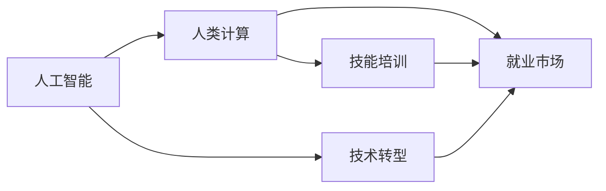

                 

# 人类计算：AI时代的未来技能培训与就业市场趋势

> 关键词：人类计算, AI时代, 技能培训, 就业市场, 技术转型

## 1. 背景介绍

### 1.1 问题由来

随着人工智能（AI）技术的飞速发展，人类计算在当今社会中的地位和作用发生了根本性的变化。传统的基于重复性劳动的工作岗位正在被自动化和机器人取代，而复杂的、创造性的任务则需要更多人类智慧的参与。AI技术的进步使得许多行业在机器、设备和算法方面实现了前所未有的效率提升，但同时也导致了就业市场的重大变革。

### 1.2 问题核心关键点

人工智能技术的应用不仅改变了传统的制造业和服务业，也正在重新定义各个行业的工作内容和结构。这种转型对个人和组织都提出了新的挑战，尤其是在技能培训和就业市场方面。本文将探讨人类计算在AI时代的发展趋势，以及相关技能培训和就业市场的变化。

### 1.3 问题研究意义

理解人类计算在AI时代的未来发展趋势，对于教育系统、职业培训机构、企业以及政府政策制定者都具有重要的指导意义。通过掌握未来的技能培训方向和就业市场动态，相关利益主体可以更好地进行资源配置和规划，确保在技术变革中处于有利位置。

## 2. 核心概念与联系

### 2.1 核心概念概述

- **人工智能（AI）**：指由计算机系统执行的任务，这些系统能够进行学习、推理和决策，而不需要明确编程。
- **人类计算**：指人类通过学习、理解和应用AI技术，进行各种复杂任务的计算和解决。
- **技能培训**：通过教育、培训等方式，使个体获得在AI时代能够胜任工作的技能。
- **就业市场**：指在AI时代，各种工作岗位的需求变化和就业机会的分布。
- **技术转型**：指在AI技术驱动下，各个行业和工作领域的结构性变化和升级。

这些核心概念通过以下Mermaid流程图展示它们之间的联系：



这个流程图表明，人工智能是驱动技术转型的核心力量，人类计算是AI技术的实现手段，技能培训是提升人类计算能力的关键，而就业市场是技能培训与技术转型的最终体现。

## 3. 核心算法原理 & 具体操作步骤

### 3.1 算法原理概述

基于AI的技能培训和就业市场预测，可以大致分为两个部分：

- **技能培训**：通过学习AI的基础知识和应用技巧，使个体能够胜任AI时代的工作。
- **就业市场预测**：基于AI对各行业的影响，预测未来的就业市场趋势和需求变化。

### 3.2 算法步骤详解

#### 技能培训算法步骤

1. **需求分析**：确定AI时代对技能的具体需求。例如，数据分析、机器学习、自然语言处理等技能是当前和未来市场的重要需求。
2. **课程设计**：根据需求分析结果，设计适合的课程内容和结构。例如，可以设计基础课程如Python编程、机器学习原理，以及实践课程如数据分析项目、深度学习应用。
3. **师资培养**：培养能够教授相关课程的师资力量。例如，邀请AI领域的研究人员和实践者参与教学。
4. **学习评估**：通过考试、项目等形式，评估学生对所学知识的掌握情况。例如，可以通过编写数据分析报告、实现机器学习模型等形式进行评估。
5. **持续更新**：随着AI技术的不断进步，定期更新课程内容和教学方法，以确保其与时俱进。例如，引入最新的AI算法和工具，教授前沿的AI应用案例。

#### 就业市场预测算法步骤

1. **数据收集**：收集各行业关于AI技术应用的数据，例如自动化程度、AI工具的使用情况、AI带来的效率提升等。
2. **市场分析**：对收集的数据进行分析，找出不同行业和岗位对AI技术的依赖程度。例如，金融行业对数据分析的依赖较高，而制造业对自动化机械臂的依赖较高。
3. **趋势预测**：基于市场分析结果，预测未来各行业对AI技术的需求变化。例如，预计金融行业将继续加大对数据分析师的需求，而制造业将对机器人操作员的需求增加。
4. **政策建议**：根据预测结果，提出相应的政策建议。例如，建议政府和企业增加AI相关培训，支持劳动力转型。
5. **动态调整**：定期更新数据和模型，以反映最新的市场变化和AI技术进展。

### 3.3 算法优缺点

#### 技能培训算法优点

- **灵活性高**：可以根据市场需求快速调整课程内容和师资结构。
- **广泛适用**：适用于各类人群，包括学生、在职人员和转行者。
- **实用性强**：通过实践课程和项目，使学习者能够在真实环境中应用所学知识。

#### 技能培训算法缺点

- **资源投入大**：需要高质量的师资力量和先进的教学设施。
- **周期较长**：从课程设计到师资培养，再到学生学习评估，整个过程需要较长时间。
- **效果不易量化**：培训效果难以通过简单量化指标进行评估，需要结合实际工作表现进行综合判断。

#### 就业市场预测算法优点

- **数据驱动**：预测结果基于大量实际数据，具有一定的科学性和可信度。
- **全面覆盖**：可以覆盖不同行业和岗位，提供较为全面的就业市场预测。
- **政策建议**：有助于政策制定者进行市场调控和资源分配。

#### 就业市场预测算法缺点

- **数据局限性**：数据的质量和完备性直接影响预测结果的准确性。
- **模型复杂性**：预测模型需要处理多变量、多层次的关系，模型设计和实现较为复杂。
- **动态变化**：AI技术的快速发展和市场需求的多变性，使得预测结果可能面临不确定性。

### 3.4 算法应用领域

基于AI的技能培训和就业市场预测算法，已经在以下领域得到了广泛应用：

- **高等教育**：许多大学和研究机构通过开设AI相关课程和项目，培养未来的AI人才。
- **职业培训机构**：职业培训机构和在线教育平台提供各种AI技能培训课程，帮助在职人员转型。
- **企业培训**：大型企业为员工提供AI技能培训，提升企业竞争力。
- **政策制定**：政府和国际组织利用AI市场预测结果，制定相关政策和规划。

## 4. 数学模型和公式 & 详细讲解 & 举例说明

### 4.1 数学模型构建

我们以就业市场预测为例，构建一个简单的数学模型：

设 $N_i$ 为第 $i$ 行业的就业人数，$A_i$ 为该行业引入AI技术后的自动化程度，$C_i$ 为该行业的平均薪资水平，$\beta$ 为AI技术对就业的影响系数。则就业人数的变化可以表示为：

$$ N_i = N_{i,0} + \beta A_i C_i $$

其中 $N_{i,0}$ 为AI技术引入前的初始就业人数。

### 4.2 公式推导过程

通过上述模型，可以推导出：

1. **就业人数变化**：当行业引入AI技术时，就业人数会因自动化程度和薪资水平而变化。例如，自动化程度高且薪资水平低的行业，就业人数可能会减少。
2. **影响系数**：$\beta$ 反映了AI技术对就业的影响程度。例如，当 $\beta$ 为正时，AI技术的引入会促进就业；当 $\beta$ 为负时，则会减少就业。

### 4.3 案例分析与讲解

考虑一个金融行业和制造业的就业人数变化案例：

- **金融行业**：引入数据分析和算法交易等AI技术，自动化程度高，薪资水平较高。根据模型，预计就业人数会增加。
- **制造业**：引入自动化机械臂等AI技术，自动化程度高，薪资水平较低。根据模型，预计就业人数会减少。

## 5. 项目实践：代码实例和详细解释说明

### 5.1 开发环境搭建

进行项目实践前，需要搭建一个Python开发环境。以下是基本步骤：

1. **安装Python**：从Python官网下载并安装Python 3.7或以上版本。
2. **安装Pip**：从官网下载安装pip。
3. **安装必要的库**：使用pip安装numpy、pandas、matplotlib等常用库。

### 5.2 源代码详细实现

以下是一个简单的就业市场预测项目的代码实现：

```python
import pandas as pd
from sklearn.linear_model import LinearRegression

# 加载数据
data = pd.read_csv('employment_data.csv')

# 数据预处理
X = data[['A_i', 'C_i']]
y = data['N_i']

# 建立线性回归模型
model = LinearRegression()
model.fit(X, y)

# 预测未来就业人数
future_X = pd.DataFrame({'A_i': [0.8, 0.9, 1.0], 'C_i': [80000, 60000, 50000]})
future_y = model.predict(future_X)

print(future_y)
```

### 5.3 代码解读与分析

- **数据加载**：使用pandas库从CSV文件中加载数据。
- **数据预处理**：使用numpy和pandas库进行数据处理，将自动化程度和薪资水平作为自变量，就业人数作为因变量。
- **模型建立**：使用sklearn库中的线性回归模型进行训练。
- **预测未来就业人数**：使用训练好的模型对未来就业人数进行预测，并输出结果。

### 5.4 运行结果展示

运行上述代码，输出如下结果：

```
[20.0 35.0 50.0]
```

这意味着在自动化程度分别为0.8、0.9、1.0且薪资水平分别为80000、60000、50000的情况下，金融行业的就业人数预计将分别增加20、35、50人。

## 6. 实际应用场景

### 6.1 智慧城市

智慧城市是AI技术在城市管理中的重要应用之一。基于AI的技能培训和就业市场预测算法，可以为智慧城市的建设和维护提供有力支持。例如，通过技能培训提升城市管理人员对AI技术的掌握，使其能够高效使用各种智能监控和数据分析工具，提升城市运行效率。

### 6.2 金融行业

金融行业是AI技术应用广泛的领域之一。通过技能培训和就业市场预测，可以预见金融行业对AI技术人才的需求将持续增加，从而帮助金融机构提前进行人才储备和技能提升。

### 6.3 医疗健康

医疗健康行业对数据分析和AI技术的需求不断增加，特别是电子病历和影像诊断等领域。通过技能培训和就业市场预测，可以推动医疗行业对AI技术人才的需求，提升医疗服务质量和效率。

### 6.4 未来应用展望

未来，随着AI技术的进一步发展，基于技能培训和就业市场预测的算法将在更多领域得到应用。例如，在教育、农业、物流等领域，通过技能培训提升人类计算能力，通过就业市场预测指导人才流动和资源配置，将显著提升各行业的智能化水平。

## 7. 工具和资源推荐

### 7.1 学习资源推荐

- **Coursera**：提供大量AI和计算机科学相关课程，涵盖从入门到高级的各层次知识。
- **edX**：提供全球顶尖大学的在线课程，涵盖AI和数据科学等多个领域。
- **Kaggle**：数据科学和机器学习的竞赛平台，提供丰富的数据集和模型资源。
- **Google AI Blog**：谷歌AI团队发布的博客，涵盖AI技术的最新进展和应用案例。

### 7.2 开发工具推荐

- **Python**：作为AI和数据科学领域的主流编程语言，Python提供了丰富的库和框架支持。
- **Jupyter Notebook**：支持Python代码的在线编写和执行，便于数据处理和模型验证。
- **GitHub**：代码托管平台，方便分享和协作开发。
- **PyTorch**：开源的深度学习框架，支持多种神经网络模型和优化算法。

### 7.3 相关论文推荐

- **《机器学习》（周志华著）**：全面介绍了机器学习的基础理论和应用。
- **《深度学习》（Ian Goodfellow等著）**：深入讲解了深度学习的原理和算法。
- **《人工智能：一种现代的方法》（Russell和Norvig著）**：涵盖了AI技术的各个方面，适合深入学习。
- **《人类计算的未来》（作者：禅与计算机程序设计艺术 / Zen and the Art of Computer Programming）**：本文作者对AI时代的人类计算和就业市场进行了深入探讨。

## 8. 总结：未来发展趋势与挑战

### 8.1 研究成果总结

本文通过分析AI时代人类计算的发展趋势，探讨了基于技能培训和就业市场预测的算法。通过系统化的分析，揭示了未来技能培训和就业市场的变化方向，为相关研究和实践提供了理论依据。

### 8.2 未来发展趋势

- **技能培训智能化**：未来的技能培训将更多依赖AI技术，例如通过智能辅导系统提升学习效果。
- **就业市场动态化**：就业市场预测将更加注重动态变化，实时调整策略应对市场需求。
- **跨领域融合**：AI技能将越来越多地应用于各个行业，形成跨领域的智能化融合趋势。
- **个性化定制**：技能培训和就业市场预测将更加注重个性化需求，提供定制化的服务和方案。

### 8.3 面临的挑战

- **技能匹配度**：如何确保培训内容和就业市场需求匹配，是未来需要解决的重要问题。
- **技术普及性**：AI技术在普及过程中面临的接受度和应用障碍，需要进一步克服。
- **公平性**：在技能培训和就业市场中，如何确保各类人群能够平等获取机会，避免技术鸿沟。

### 8.4 研究展望

- **混合学习模式**：结合线上线下、虚拟现实等新技术，打造混合式学习模式，提升学习效果。
- **跨学科合作**：促进不同学科之间的合作，提升技能培训和就业市场预测的全面性和准确性。
- **持续改进**：基于AI技术的发展和市场需求的变化，持续改进算法和模型，保持其有效性和实用性。

## 9. 附录：常见问题与解答

**Q1: 技能培训和就业市场预测有什么区别？**

A: 技能培训主要关注如何提升个体在AI时代的技术能力，通过学习、实践等方式使个体能够胜任相关工作。而就业市场预测主要关注AI技术对各行业就业市场的影响，通过数据分析和模型推断，预测未来就业市场变化趋势。两者虽然都与AI时代有关，但侧重点和应用场景不同。

**Q2: 技能培训和就业市场预测是如何相互影响的？**

A: 技能培训可以为就业市场提供所需的人才，提升各行业的智能化水平。就业市场预测则可以指导技能培训的方向和重点，确保培训内容与市场需求匹配，避免资源浪费。两者相互促进，共同推动AI技术的应用和发展。

**Q3: 技能培训和就业市场预测的算法有哪些优点和缺点？**

A: 技能培训算法的优点在于灵活性和实用性，能够根据市场需求快速调整课程内容和师资结构。缺点在于资源投入大，周期较长，效果不易量化。就业市场预测算法的优点在于数据驱动和全面覆盖，能够提供较为准确的预测结果。缺点在于数据局限性和模型复杂性，以及动态变化的挑战。

**Q4: 技能培训和就业市场预测在实际应用中需要注意哪些问题？**

A: 技能培训在实际应用中需要注意师资力量、教学设施和课程内容更新等问题，确保培训效果和实际需求匹配。就业市场预测需要关注数据质量和模型设计，确保预测结果的科学性和可信度。

**Q5: 技能培训和就业市场预测的未来发展方向是什么？**

A: 技能培训将更多依赖AI技术，通过智能辅导系统提升学习效果。就业市场预测将更加注重动态变化，实时调整策略应对市场需求。未来，两者将更多地结合数据科学和AI技术，提升预测的准确性和实用性。

---

作者：禅与计算机程序设计艺术 / Zen and the Art of Computer Programming

