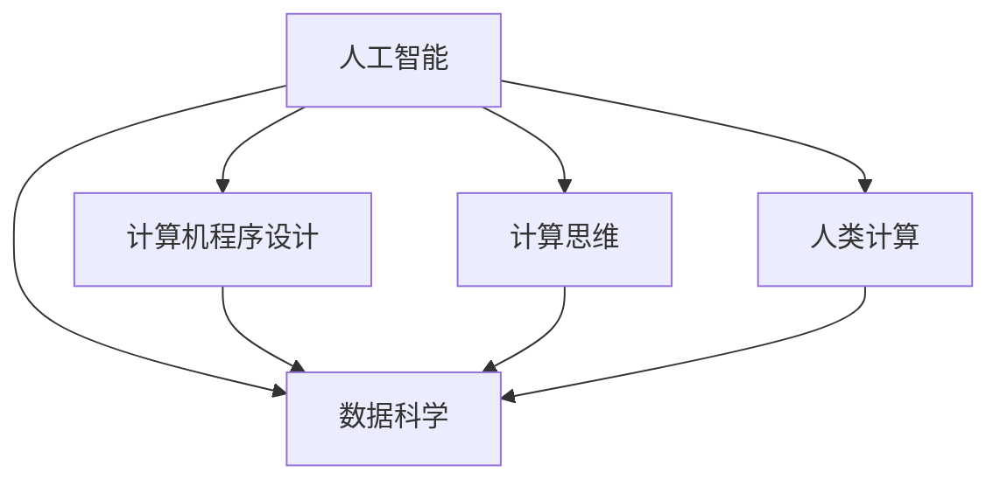

                 

# 人类计算：创造更美好未来的关键

> 关键词：人工智能,计算机程序设计,未来,计算思维,数据科学

## 1. 背景介绍

### 1.1 问题由来
在数字化浪潮的推动下，人工智能(AI)技术在各个领域展现出强大的应用潜力。从自动驾驶、智能推荐到医疗诊断、金融风险控制，AI正在不断拓展人类认知和行动的边界。然而，随着技术的快速演进，我们不禁思考：AI究竟能否真正理解和替代人类智慧，从而创造一个更美好、更可持续的未来？

### 1.2 问题核心关键点
本文旨在探讨人工智能与人类计算的结合，分析人类计算在推动AI技术进步中的作用，并展望未来。人类计算不仅仅是简单的数据处理，更是融合人类认知、情感、创造力的计算方式，是推动AI技术不断进步的关键。通过理解人类计算的本质和应用，可以更好地把握AI技术的未来发展方向。

## 2. 核心概念与联系

### 2.1 核心概念概述

为了更好地理解人类计算的概念及其在AI中的应用，本节将介绍几个核心概念：

- **人工智能(AI)**：通过计算机程序模拟人类智能的过程，包括学习、推理、感知等能力，旨在解决复杂问题，提高工作效率。
- **计算机程序设计**：指编写、测试、维护和优化计算机程序的过程，是实现AI功能的基础。
- **数据科学**：通过数据收集、处理、分析和建模，发现数据中的模式和关系，为AI决策提供支撑。
- **计算思维**：指通过抽象和自动化解决复杂问题的思维方式，是人类计算的核心。
- **人类计算**：结合人类认知、情感、创造力的计算方式，不仅依赖数据和算法，还需结合人类智慧进行理解和判断。

这些概念之间的逻辑关系可以通过以下Mermaid流程图来展示：



这个流程图展示了几大关键概念之间的联系：

1. 数据科学为AI提供数据支撑，计算思维帮助抽象和建模，计算机程序设计实现具体功能。
2. 人类计算不仅依赖数据和算法，还需结合人类智慧进行理解和判断。

### 2.2 核心概念原理和架构的 Mermaid 流程图


## 3. 核心算法原理 & 具体操作步骤

### 3.1 算法原理概述

人类计算的核心在于融合人类智慧与计算能力，通过智能化的数据处理和决策支持，提升决策的准确性和效率。在AI技术中，人类计算主要体现在以下几个方面：

1. **问题抽象**：将复杂问题简化为计算机程序可以处理的形式，通过算法实现问题求解。
2. **数据清洗与预处理**：对原始数据进行清洗和处理，提高数据质量，为模型训练提供高质量的数据支撑。
3. **模型构建与训练**：利用数据科学的方法，构建和训练AI模型，使其具备解决问题的能力。
4. **结果解释与反馈**：结合人类智慧，解释AI模型的输出，并根据反馈调整模型和策略，提升AI的准确性和适应性。

### 3.2 算法步骤详解

人类计算的具体步骤可概括为以下四个阶段：

1. **需求分析**：明确问题和目标，分析问题的复杂性和规模，确定所需数据和算法。
2. **数据采集与处理**：收集相关数据，进行清洗和预处理，生成可用于计算的数据集。
3. **模型设计与训练**：选择或设计适当的算法，利用数据集训练模型，优化模型参数，提高模型性能。
4. **结果验证与迭代**：对模型输出进行验证和分析，结合人类智慧进行结果解释，根据反馈进行调整和优化。

### 3.3 算法优缺点

人类计算的优势在于其融合了人类智慧和计算能力，能够处理复杂多变的问题。缺点在于数据和算法的选择依赖于人类经验，可能存在主观偏差，且模型的解释性较差。

### 3.4 算法应用领域

人类计算在各个领域都有广泛的应用，包括：

- **金融领域**：利用人类计算进行风险评估、投资组合优化、市场预测等。
- **医疗领域**：结合人类医学知识和计算模型，进行疾病诊断、治疗方案优化、个性化医疗等。
- **教育领域**：通过计算思维教育，培养学生解决问题和创新的能力。
- **交通运输**：利用计算思维优化交通网络、减少拥堵、提升安全性。
- **环境保护**：结合人类智慧和计算能力，进行环境监测、资源管理、可持续发展规划等。

## 4. 数学模型和公式 & 详细讲解 & 举例说明

### 4.1 数学模型构建

在AI技术中，人类计算的数学模型构建主要体现在以下几个方面：

- **监督学习**：通过标注数据训练模型，使其具备分类、回归等能力。
- **无监督学习**：在未标注数据上，通过聚类、降维等方法，发现数据中的结构。
- **强化学习**：通过奖励机制，训练模型在特定环境中做出最优决策。

### 4.2 公式推导过程

以监督学习为例，一个简单的线性回归模型可以表示为：

$$
\hat{y} = \theta_0 + \theta_1x_1 + \theta_2x_2 + \cdots + \theta_nx_n
$$

其中，$\hat{y}$为预测值，$\theta_0, \theta_1, \ldots, \theta_n$为模型参数，$x_1, x_2, \ldots, x_n$为输入特征。通过最小化损失函数，我们可以求解出最优的参数值。

### 4.3 案例分析与讲解

假设我们有一组数据集，包含学生的考试成绩和日常学习时间，我们想要预测学生的总成绩。通过监督学习模型，我们可以得到如下公式：

$$
\hat{y} = \theta_0 + \theta_1x_1 + \theta_2x_2
$$

其中，$x_1$为学习时间，$x_2$为考试成绩，$\theta_0, \theta_1, \theta_2$为模型参数。通过对数据集进行训练，我们可以得到最优的参数值，从而实现对学生总成绩的预测。

## 5. 项目实践：代码实例和详细解释说明

### 5.1 开发环境搭建

在开发人类计算相关的AI项目时，我们需要准备以下环境：

- **Python**：Python是当前AI开发的主流语言，拥有丰富的库和工具。
- **PyTorch/TensorFlow**：两个最流行的深度学习框架，提供强大的计算能力。
- **Jupyter Notebook**：一个交互式的数据科学工具，适合开发和调试AI模型。
- **Google Colab**：Google提供的云端计算平台，方便进行大规模计算。

### 5.2 源代码详细实现

以下是一个简单的Python代码实例，展示如何使用PyTorch进行线性回归模型的构建和训练：

```python
import torch
import torch.nn as nn
import torch.optim as optim
import matplotlib.pyplot as plt

# 定义数据集
X = torch.tensor([[1.0], [2.0], [3.0], [4.0], [5.0]])
y = torch.tensor([[2.0], [4.0], [6.0], [8.0], [10.0]])

# 定义模型
model = nn.Linear(1, 1)

# 定义损失函数和优化器
criterion = nn.MSELoss()
optimizer = optim.SGD(model.parameters(), lr=0.01)

# 训练模型
for epoch in range(100):
    optimizer.zero_grad()
    output = model(X)
    loss = criterion(output, y)
    loss.backward()
    optimizer.step()
    
    if epoch % 10 == 0:
        print(f"Epoch {epoch+1}, loss: {loss.item()}")

# 预测结果
x = torch.arange(1, 6).reshape(-1, 1)
output = model(x)
plt.plot(x, output.numpy(), label="predicted")
plt.plot(X.numpy(), y.numpy(), label="actual")
plt.legend()
plt.show()
```

### 5.3 代码解读与分析

这段代码主要展示了如何利用PyTorch进行线性回归模型的构建和训练。其中，我们使用`nn.Linear`定义线性模型，使用`nn.MSELoss`作为损失函数，使用`SGD`作为优化器。在训练过程中，我们通过循环迭代更新模型参数，最小化损失函数。最后，我们使用训练好的模型对新数据进行预测，并绘制实际值和预测值的关系图。

## 6. 实际应用场景

### 6.1 金融风险管理

在金融领域，人类计算被广泛应用于风险评估和管理。通过结合大数据分析和专家知识，金融机构可以构建复杂的计算模型，预测市场风险，优化投资组合。

### 6.2 医疗诊断

在医疗领域，人类计算被用于疾病诊断和治疗方案优化。通过结合电子病历和医学知识库，AI模型可以辅助医生进行初步诊断，并提供治疗建议。

### 6.3 智能交通

在交通运输领域，人类计算被用于优化交通网络、减少拥堵、提升安全性。通过结合交通数据和规则，AI模型可以实时预测交通流量，优化交通信号，提升整体交通效率。

### 6.4 环境保护

在环境保护领域，人类计算被用于资源管理和可持续发展规划。通过结合环境数据和专家知识，AI模型可以预测环境变化趋势，优化资源使用，推动可持续发展。

## 7. 工具和资源推荐

### 7.1 学习资源推荐

为了帮助开发者系统掌握人类计算的理论与实践，这里推荐一些优质的学习资源：

- **《深入浅出人工智能》**：介绍人工智能的基础概念、算法和应用，适合初学者入门。
- **Coursera的《机器学习》课程**：由斯坦福大学教授讲授，深入讲解机器学习的基本原理和算法。
- **DeepLearning.AI的《深度学习专项课程》**：涵盖深度学习的各个方面，包括计算机视觉、自然语言处理等。
- **Google的TensorFlow教程**：详细介绍TensorFlow框架的使用和应用场景。

### 7.2 开发工具推荐

以下是几款用于AI开发的人类计算工具：

- **PyTorch**：提供强大的计算能力和丰富的库，适合进行深度学习研究和应用开发。
- **TensorFlow**：Google推出的深度学习框架，支持分布式计算和高效部署。
- **Jupyter Notebook**：交互式的数据科学工具，方便进行模型开发和调试。
- **Google Colab**：云端计算平台，支持大规模计算和资源共享。

### 7.3 相关论文推荐

人类计算的理论与实践源于学界的持续研究。以下是几篇奠基性的相关论文，推荐阅读：

- **《深度学习》**：Ian Goodfellow等人所著，深入介绍深度学习的基本原理和应用。
- **《强化学习》**：Richard S. Sutton等人所著，介绍强化学习的基本理论和算法。
- **《人工智能：一种现代方法》**：Stuart Russell和Peter Norvig所著，全面介绍人工智能的理论和实践。

## 8. 总结：未来发展趋势与挑战

### 8.1 研究成果总结

人类计算在AI技术中的应用已经展现出巨大的潜力，成为推动AI技术进步的关键。通过融合人类智慧和计算能力，人类计算在多个领域取得了显著的成果，提升了决策的准确性和效率。

### 8.2 未来发展趋势

未来，人类计算的发展趋势主要体现在以下几个方面：

- **智能化**：随着计算能力的提升和数据量的增加，AI系统将更加智能化，能够自主进行复杂的决策和任务处理。
- **个性化**：结合用户行为和偏好，AI系统将能够提供更加个性化的服务和体验。
- **跨领域融合**：AI技术与各个领域的深度融合，将带来更多创新应用和商业价值。
- **伦理与道德**：随着AI技术的广泛应用，伦理和道德问题将越来越受到重视，相关研究和监管将不断加强。

### 8.3 面临的挑战

尽管人类计算在AI技术中具有重要地位，但也面临诸多挑战：

- **数据隐私和安全**：AI系统需要大量数据支持，但数据隐私和安全问题不容忽视。
- **模型解释性**：当前AI模型的黑盒特性使得其结果难以解释，需要更多研究和探索。
- **计算资源**：大规模计算和深度学习模型的训练需要大量计算资源，成本较高。
- **伦理与道德**：AI技术的广泛应用带来了伦理和道德问题，如偏见、歧视等，需要更多研究和监管。

### 8.4 研究展望

面对未来人类计算的挑战，未来研究需要在以下几个方面寻求突破：

- **数据隐私保护**：开发更高效的数据隐私保护技术，确保数据安全和隐私。
- **模型解释性**：结合符号化知识库和计算模型，提升AI模型的解释性，增强人类对其结果的理解。
- **跨领域应用**：结合不同领域的知识和数据，实现跨领域的计算思维和应用。
- **伦理与道德**：建立伦理和道德约束机制，确保AI技术的健康发展。

通过这些研究方向的探索，相信人类计算将能够更好地发挥其优势，推动AI技术不断进步，为人类创造更美好、更可持续的未来。

## 9. 附录：常见问题与解答

**Q1：人类计算与人工智能有什么区别？**

A: 人类计算是融合人类智慧和计算能力的计算方式，而人工智能则侧重于通过计算机程序模拟人类智能。人类计算强调人与机器的协同工作，而人工智能更多依赖于数据和算法。

**Q2：如何进行数据隐私保护？**

A: 数据隐私保护可以通过数据加密、匿名化处理、差分隐私等技术手段实现。具体来说，可以采用差分隐私技术，在保护隐私的同时，提供高质量的数据分析结果。

**Q3：什么是计算思维？**

A: 计算思维是一种通过抽象和自动化解决复杂问题的思维方式，包括分解、抽象、设计算法、评估算法效率等。计算思维不仅是编程的基础，也是解决复杂问题的关键。

**Q4：如何提升AI模型的解释性？**

A: 提升AI模型的解释性可以从多个方面入手，如增加模型透明度、使用可解释的算法、结合符号化知识库等。具体来说，可以采用可解释的算法，如决策树、规则系统等，或结合符号化知识库，增强模型的解释性。

**Q5：未来人类计算的发展方向是什么？**

A: 未来人类计算的发展方向主要在于智能化、个性化、跨领域融合和伦理与道德的协同进步。通过结合人类智慧和计算能力，人类计算将在更多领域展现出巨大的潜力，推动AI技术的不断进步。

---

作者：禅与计算机程序设计艺术 / Zen and the Art of Computer Programming

