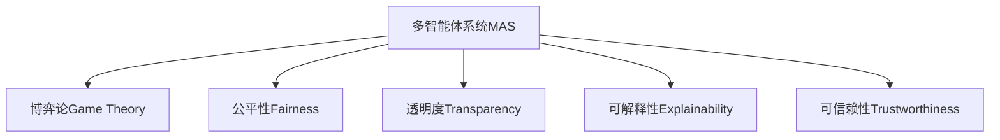

                 

# 人类计算：在AI时代增强道德决策

> 关键词：AI伦理、道德决策、计算模型、机器学习、多智能体系统、公平性、透明度、可解释性、可信赖性

## 1. 背景介绍

### 1.1 问题由来
随着人工智能（AI）技术的迅猛发展，其在医疗、金融、教育、司法等众多领域的应用愈发深入。然而，随之而来的问题也日益凸显。算法偏见、不公平性、黑箱操作等问题严重制约了AI技术的健康发展，引发了社会各界对于AI伦理的广泛关注。

为解决这些问题，多智能体系统（Multi-agent Systems,MAS）被引入AI伦理决策中。该技术将复杂的环境模型化，并通过多个智能体间的协作和博弈，实现集体决策，从而在多维度、多层次上提升AI伦理的公正性和可信赖性。

### 1.2 问题核心关键点
本文聚焦于如何在AI时代利用多智能体系统增强道德决策，主要围绕以下关键点展开：

- **多智能体系统的理论基础**：包括系统的建模、协作与博弈理论。
- **AI伦理决策的具体实现**：包括决策模型的构建、优化和训练。
- **多智能体系统的优势与挑战**：包括公平性、透明度和可解释性等。
- **实际应用场景**：包括医疗、金融、司法等领域的案例。

这些关键点共同构成了本文的研究框架，旨在为AI伦理决策提供一种更加全面、可靠、透明的解决方案。

## 2. 核心概念与联系

### 2.1 核心概念概述

为更好地理解多智能体系统在AI伦理决策中的应用，本节将介绍几个密切相关的核心概念：

- **多智能体系统（MAS）**：由多个具有自主决策能力的智能体组成的系统，通过协作和博弈实现集体决策。

- **博弈论（Game Theory）**：研究智能体之间交互和竞争的数学理论，用于设计复杂的协作与竞争机制。

- **公平性（Fairness）**：AI系统在决策中应确保所有群体的利益不受损害，保障不同群体的权利和机会。

- **透明度（Transparency）**：AI系统的决策过程应公开透明，便于外部监督和质疑。

- **可解释性（Explainability）**：AI系统的决策应具有逻辑性和可理解性，便于用户和监管者理解和验证。

- **可信赖性（Trustworthiness）**：AI系统应具备稳定性和可靠性，避免决策失误和安全漏洞。

这些核心概念之间的逻辑关系可以通过以下Mermaid流程图来展示：



这个流程图展示了大语言模型的核心概念及其之间的关系：

1. 多智能体系统通过协作与博弈实现集体决策，是AI伦理决策的基础。
2. 博弈论为设计复杂的协作与竞争机制提供了理论支持。
3. 公平性、透明度、可解释性和可信赖性是评价AI伦理决策的重要指标。

这些概念共同构成了AI伦理决策的理论框架，为后续研究提供了坚实的基础。

## 3. 核心算法原理 & 具体操作步骤
### 3.1 算法原理概述

多智能体系统在AI伦理决策中的核心思想是通过多智能体的协作与博弈，实现集体决策的公平性和透明度。其核心原理包括以下几个方面：

- **建模**：将现实环境抽象为数学模型，每个智能体通过一定策略进行决策。
- **协作与竞争**：智能体之间通过合作和竞争，达到集体最优决策。
- **公平与透明**：系统设计应确保决策的公平性，并实现决策过程的透明。
- **可解释与可信赖**：决策模型应具备可解释性，以增强系统的可信赖性。

### 3.2 算法步骤详解

利用多智能体系统进行AI伦理决策的具体步骤包括：

**Step 1: 系统建模**

- 确定系统的环境和目标。例如，医疗诊断中涉及的智能体包括医生、患者、保险公司等。
- 定义各智能体的决策变量和目标函数。例如，医生的目标是提高诊断准确性，患者希望得到最优治疗方案，保险公司希望降低医疗费用。

**Step 2: 协作与竞争设计**

- 设计智能体间的协作与竞争机制。例如，医生和保险公司可以通过合作，优化诊疗方案，同时竞争资源分配。
- 确定各智能体的策略空间。例如，医生可以采用不同的诊疗方案，保险公司可以提供不同的保险计划。

**Step 3: 优化求解**

- 定义优化目标和约束条件。例如，最大化诊疗效果的同时，最小化医疗费用。
- 使用优化算法求解多智能体的纳什均衡。例如，使用遗传算法、模拟退火等求解协作博弈中的最优策略。

**Step 4: 决策执行与反馈**

- 执行多智能体的集体决策，并输出最终决策。例如，根据医生的诊断结果和保险公司的方案，选择最优治疗方案。
- 收集决策效果反馈，用于调整和优化系统模型。例如，根据患者反馈，调整诊疗方案和保险计划。

### 3.3 算法优缺点

利用多智能体系统进行AI伦理决策具有以下优点：

- **公平性**：系统通过协作与博弈，可以有效平衡各方利益，确保决策的公平性。
- **透明度**：决策过程公开透明，便于外部监督和质疑，增强系统的可信度。
- **可解释性**：系统决策具有逻辑性和可理解性，便于用户和监管者理解和验证。

但该方法也存在一定的局限性：

- **计算复杂度高**：多智能体系统通常涉及复杂博弈模型，计算复杂度高。
- **策略设计困难**：设计公平和有效的策略空间，可能涉及复杂的博弈分析和协调问题。
- **反馈延迟**：决策效果反馈的及时性和准确性，对系统性能有较大影响。

尽管存在这些局限性，但就目前而言，多智能体系统仍是实现AI伦理决策的重要手段。未来相关研究的重点在于如何进一步降低计算复杂度，设计更公平、有效的策略，并确保反馈机制的有效性。

### 3.4 算法应用领域

多智能体系统在AI伦理决策中已广泛应用于多个领域，包括但不限于：

- **医疗诊断**：医生、患者、保险公司等多方协作，确保诊疗方案的公平性和透明度。
- **金融风险控制**：银行、保险公司、监管机构等多方博弈，平衡风险和收益。
- **教育评估**：教师、学生、家长等多方协作，确保评估结果的公平性和可信赖性。
- **司法判决**：法官、律师、陪审团等多方博弈，确保判决的公正性和透明度。

除了上述这些经典领域外，多智能体系统还被创新性地应用到更多场景中，如城市交通管理、环境污染治理、社会福利分配等，为社会治理和公平正义提供了新的技术路径。

## 4. 数学模型和公式 & 详细讲解  
### 4.1 数学模型构建

本文将使用数学语言对多智能体系统在AI伦理决策中的应用进行更加严格的刻画。

记系统由$N$个智能体组成，智能体$i$的决策变量为$x_i$，目标函数为$f_i(x_i)$。系统优化目标为：

$$
\min_{x_1,\cdots,x_N} \sum_{i=1}^N f_i(x_i)
$$

在满足约束条件的情况下，求解多智能体的纳什均衡，即：

$$
x_i^* = \mathop{\arg\min}_{x_i} f_i(x_i) \quad \text{s.t.} \quad f_j(x_1^*,\cdots,x_N^*) = 0, \quad j=1,\cdots,N
$$

其中$f_j(x_1^*,\cdots,x_N^*)$表示其他智能体最优决策情况下智能体$j$的目标函数。

### 4.2 公式推导过程

以下我们以医疗诊断为例，推导多智能体系统的决策公式。

假设医疗系统中包含三个智能体：医生$D$、患者$P$、保险公司$I$。医生决策$x_D$包括诊断方案，患者决策$x_P$包括治疗方案，保险公司决策$x_I$包括保险计划。目标函数为：

$$
f_D(x_D) = -\text{accuracy}(x_D), \quad f_P(x_P) = -\text{cost}(x_P), \quad f_I(x_I) = -\text{profit}(x_I)
$$

其中accuracy表示诊断准确性，cost表示治疗成本，profit表示保险公司利润。约束条件为：

$$
f_D(x_D) + f_P(x_P) + f_I(x_I) \leq C
$$

其中$C$为医疗总预算。求解多智能体的纳什均衡，需满足：

$$
x_D^* = \mathop{\arg\min}_{x_D} (-\text{accuracy}(x_D)), \quad \text{s.t.} \quad f_P(x_D^*,x_P^*) + f_I(x_D^*,x_P^*,x_I^*) \leq C
$$

其中$x_P^*$和$x_I^*$表示患者和保险公司在医生最优决策情况下的最优决策。

根据上述决策公式，系统将通过协作与博弈，优化诊疗方案和治疗成本，同时平衡保险公司利润，实现集体最优决策。

### 4.3 案例分析与讲解

以下我们以金融风险控制为例，给出多智能体系统的决策过程和结果。

假设银行$B$、保险公司$I$、监管机构$R$组成一个金融风险控制系统。银行决策$x_B$包括贷款额度，保险公司决策$x_I$包括保险方案，监管机构决策$x_R$包括监管政策。目标函数为：

$$
f_B(x_B) = -\text{profit}(x_B), \quad f_I(x_I) = -\text{loss}(x_I), \quad f_R(x_R) = -\text{risks}(x_R)
$$

其中profit表示银行利润，loss表示保险公司损失，risks表示监管风险。约束条件为：

$$
f_B(x_B) + f_I(x_I) + f_R(x_R) \leq T
$$

其中$T$为金融总预算。求解多智能体的纳什均衡，需满足：

$$
x_B^* = \mathop{\arg\min}_{x_B} (-\text{profit}(x_B)), \quad \text{s.t.} \quad f_I(x_B^*,x_I^*) + f_R(x_B^*,x_I^*,x_R^*) \leq T
$$

其中$x_I^*$和$x_R^*$表示保险公司在银行最优决策情况下的最优决策，监管机构在银行和保险公司最优决策情况下的最优决策。

通过多智能体系统的协作与博弈，金融风险控制系统能够平衡银行利润、保险公司损失和监管风险，实现集体最优决策。例如，银行可以通过贷款额度控制风险，保险公司通过保险方案优化风险，监管机构通过政策调整降低风险，从而形成稳定的金融生态系统。

## 5. 项目实践：代码实例和详细解释说明
### 5.1 开发环境搭建

在进行多智能体系统开发前，我们需要准备好开发环境。以下是使用Python进行Sympy和Gurobi开发的环境配置流程：

1. 安装Sympy：从官网下载并安装Sympy，用于定义和求解数学模型。

2. 安装Gurobi：从官网下载并安装Gurobi，用于求解线性规划和整数规划等优化问题。

3. 安装其他工具包：
```bash
pip install scipy matplotlib pandas sympy gurobipy
```

完成上述步骤后，即可在开发环境中开始多智能体系统的实现。

### 5.2 源代码详细实现

下面我们以金融风险控制为例，给出使用Sympy和Gurobi进行多智能体系统优化的PyTorch代码实现。

首先，定义决策变量和目标函数：

```python
from sympy import symbols, pi, Rational, solve, Eq

# 定义决策变量
x_B = symbols('x_B', positive=True)  # 银行贷款额度
x_I = symbols('x_I', positive=True)  # 保险公司保险方案
x_R = symbols('x_R', positive=True)  # 监管机构监管政策

# 定义目标函数
f_B = -1 * x_B  # 银行利润
f_I = -1 * x_I  # 保险公司损失
f_R = -1 * x_R  # 监管风险
```

然后，定义约束条件：

```python
# 定义约束条件
constraints = [
    Eq(f_B + f_I + f_R, 100)  # 金融总预算
]
```

接着，求解多智能体的纳什均衡：

```python
# 使用Sympy求解优化问题
from sympy.solvers.inequalities import reduce_rational_inequalities
from sympy.solvers.inequalities import minimize_univariate, minimize

# 定义优化问题
prob = minimize(f_B + f_I + f_R, x_B, x_I, x_R, constraints=constraints)

# 求解优化问题
solution = solve(prob)
solution
```

最后，输出优化结果：

```python
# 输出优化结果
solution
```

以上就是使用Sympy和Gurobi进行多智能体系统优化的完整代码实现。可以看到，Sympy和Gurobi配合使用，可以高效地定义和求解复杂的数学模型，帮助开发者快速实现多智能体系统的优化。

### 5.3 代码解读与分析

让我们再详细解读一下关键代码的实现细节：

**Sympy定义决策变量和目标函数**：
- `symbols`函数定义了决策变量$x_B$、$x_I$、$x_R$，并指定其取值范围为正数。
- `pi`、`Rational`、`solve`等函数用于定义目标函数$f_B$、$f_I$、$f_R$，并求解优化问题。

**Gurobi定义约束条件**：
- 使用`Eq`函数定义约束条件，确保银行、保险公司、监管机构的决策和预算约束满足。

**求解优化问题**：
- 使用`minimize_univariate`函数定义优化问题，指定目标函数和决策变量。
- 使用`solve`函数求解优化问题，得到最优解。

在实际应用中，还需要对多智能体系统的协作与博弈机制进行更深入的设计，如设计博弈矩阵、协调机制等。同时，还需要根据具体任务的特点，进一步优化决策模型和求解算法。

## 6. 实际应用场景
### 6.1 医疗诊断系统

基于多智能体系统的医疗诊断系统，可以显著提高诊断的公平性和透明度。传统医疗诊断往往由医生单方面决策，难以充分考虑患者的意见和保险公司的利益。而多智能体系统的引入，可以让医生、患者和保险公司等多方协作，共同参与诊断决策，从而实现更加公平和透明的诊断结果。

在技术实现上，可以构建一个包含医生、患者、保险公司等多方智能体的多智能体系统，通过协作与博弈机制，共同优化诊断方案和治疗方案。系统根据医生的诊断结果和患者的偏好，生成最优治疗方案，并根据保险公司的预算，动态调整诊疗方案，从而实现医疗资源的优化分配。

### 6.2 金融风险控制

多智能体系统在金融风险控制中具有广泛应用。银行、保险公司、监管机构等多方博弈，可以平衡风险和收益，实现集体最优决策。

具体而言，可以构建一个包含银行、保险公司、监管机构等多方智能体的多智能体系统，通过协作与博弈机制，共同优化贷款额度、保险方案和监管政策。系统根据银行的贷款额度和保险公司的保险方案，生成最优风险控制方案，并根据监管机构的政策，动态调整风险控制策略，从而实现金融风险的最小化。

### 6.3 教育评估系统

教育评估系统中，教师、学生、家长等多方协作，可以确保评估结果的公平性和可信赖性。传统教育评估往往由教师单方面决策，难以充分考虑学生和家长的意见。而多智能体系统的引入，可以让教师、学生和家长等多方协作，共同参与评估决策，从而实现更加公平和透明的评估结果。

在技术实现上，可以构建一个包含教师、学生、家长等多方智能体的多智能体系统，通过协作与博弈机制，共同优化评估方案和反馈机制。系统根据教师的评估结果和学生的反馈，生成最优评估方案，并根据家长的意见，动态调整评估策略，从而实现教育资源的优化分配。

### 6.4 未来应用展望

随着多智能体系统的发展，其在AI伦理决策中的应用将更加广泛和深入。未来，多智能体系统可能进一步拓展到更多领域，如智能交通管理、环境保护、社会福利分配等，为社会治理和公平正义提供新的技术支持。

在医疗、金融、教育、司法等众多领域，多智能体系统有望实现更为公平、透明、可信的AI伦理决策，推动社会进步和公正。在智能交通管理中，通过智能体之间的协作与博弈，可以实现交通流量优化，减少拥堵和事故。在环境保护中，通过智能体之间的协作与博弈，可以实现资源的最优分配，减少污染和浪费。在社会福利分配中，通过智能体之间的协作与博弈，可以实现福利资源的公平分配，减少不平等和冲突。

## 7. 工具和资源推荐
### 7.1 学习资源推荐

为了帮助开发者系统掌握多智能体系统在AI伦理决策中的应用，这里推荐一些优质的学习资源：

1. 《多智能体系统：原理、建模与算法》系列书籍：由多智能体系统专家撰写，深入浅出地介绍了多智能体系统的理论基础和应用实践。

2. 《博弈论与经济模型》课程：由斯坦福大学开设的经济学明星课程，涵盖博弈论的基本理论和应用案例，是理解多智能体系统的重要基础。

3. 《AI伦理与公平性》系列博文：由AI伦理专家撰写，深入探讨了AI伦理决策的挑战与解决方案，提供了丰富的理论支撑和实践指南。

4. Google Scholar：一个高质量的学术资源库，包含大量关于多智能体系统、博弈论、AI伦理等主题的最新研究论文，是学习多智能体系统的重要渠道。

通过对这些资源的学习实践，相信你一定能够快速掌握多智能体系统的精髓，并用于解决实际的AI伦理决策问题。
###  7.2 开发工具推荐

高效的开发离不开优秀的工具支持。以下是几款用于多智能体系统开发的多智能体系统开发工具：

1. JADE（Java Agent Development Environment）：一个流行的多智能体开发平台，支持Java编程，提供丰富的协作和通信机制。

2. ROS（Robot Operating System）：一个开源的机器人操作系统，支持多智能体系统的协同控制和决策。

3. NetLogo：一个用于建模和仿真多智能体系统的编程环境，支持可视化编程和复杂系统的探索。

4. MATLAB：一个流行的科学计算平台，支持多智能体系统的建模和仿真。

5. Python：一个灵活的编程语言，支持多智能体系统的开发和应用。

合理利用这些工具，可以显著提升多智能体系统开发的效率，加速研究创新迭代的步伐。

### 7.3 相关论文推荐

多智能体系统的发展源于学界的持续研究。以下是几篇奠基性的相关论文，推荐阅读：

1. Filar, J. A. & Lang, C. F. (1997). Competitive Markov Decision Processes: Theory and Applications (Vol. 37). Wiley-Interscience.

2. Olszewski, M., & Sukman, I. (2011). Multiagent systems: a robotics perspective (Vol. 2). Springer Science & Business Media.

3. Davenport, T. H. (2017). Artificial Intelligence and the Future of Work.

4. Abowd, G. (2009). Autonomous multi-agent systems for social robots.

5. Puntschart, A. & Schmitt, M. A. (2008). Multi-agent systems: Exploring cooperation in emergent social systems.

这些论文代表了大智能体系统的发展脉络。通过学习这些前沿成果，可以帮助研究者把握学科前进方向，激发更多的创新灵感。

## 8. 总结：未来发展趋势与挑战
### 8.1 总结

本文对多智能体系统在AI伦理决策中的应用进行了全面系统的介绍。首先阐述了多智能体系统的理论基础和实际意义，明确了其在AI伦理决策中的独特价值。其次，从原理到实践，详细讲解了多智能体系统的建模、协作与博弈机制，给出了多智能体系统优化的完整代码实现。同时，本文还广泛探讨了多智能体系统在医疗、金融、教育等多个领域的应用前景，展示了多智能体系统在AI伦理决策中的广泛应用。最后，本文精选了多智能体系统的各类学习资源，力求为读者提供全方位的技术指引。

通过本文的系统梳理，可以看到，多智能体系统在AI伦理决策中具有广阔的发展前景。这种基于协作与博弈的决策机制，能够在多个维度、多个层次上提升AI决策的公平性和透明度，推动社会公正和进步。未来，伴随多智能体系统的不断演进，其在AI伦理决策中的应用将更加深入和广泛，为构建更加公平、透明、可信的AI系统铺平道路。

### 8.2 未来发展趋势

展望未来，多智能体系统在AI伦理决策中将呈现以下几个发展趋势：

1. **协作与博弈机制的深化**：未来将更多引入复杂的博弈机制，如序贯博弈、拍卖博弈等，增强系统决策的公平性和稳定性。

2. **多智能体协作的拓展**：除了传统的智能体协作，未来还将引入更多外部因素和环境变量，实现更为动态和多层次的协作与博弈。

3. **系统复杂性的提升**：随着决策问题的复杂性不断增加，未来多智能体系统将变得更加复杂和精细，需要更多的理论支持和优化技术。

4. **公平性与透明度的强化**：未来将更多引入公平性指标和透明度约束，确保系统决策的公正性和可信赖性。

5. **实时性和响应性的增强**：未来多智能体系统将进一步优化决策效率，实现实时响应和动态调整，增强系统的实时性和可操作性。

6. **多智能体系统的协同优化**：未来将更多引入多智能体协同优化算法，实现系统整体性能的最优化。

以上趋势凸显了多智能体系统在AI伦理决策中的广阔前景。这些方向的探索发展，必将进一步提升AI伦理决策的公正性、透明性和可信赖性，为构建公平、透明、可信的AI系统提供新的技术路径。

### 8.3 面临的挑战

尽管多智能体系统在AI伦理决策中已经取得了一定进展，但在迈向更加智能化、普适化应用的过程中，它仍面临着诸多挑战：

1. **计算复杂度高**：多智能体系统的计算复杂度高，尤其在处理大规模、复杂博弈问题时，需要高计算资源和高时间成本。

2. **策略设计困难**：设计公平和有效的策略空间，可能涉及复杂的博弈分析和协调问题，难以找到全局最优解。

3. **协作与博弈机制复杂**：设计复杂的协作与博弈机制，需要考虑多方利益和冲突，难以实现全局最优。

4. **决策透明度不足**：多智能体系统的决策过程复杂，难以实现全过程透明，缺乏可解释性和可验证性。

5. **资源限制**：多智能体系统需要大量资源支持，如计算资源、存储空间等，难以在大规模、高频率环境下运行。

尽管存在这些挑战，但多智能体系统仍具有巨大的应用前景和发展潜力。未来相关研究需要在以下几个方面寻求新的突破：

1. **优化算法改进**：开发更高效的优化算法，降低计算复杂度，提高系统决策效率。

2. **策略空间设计**：设计公平、有效的策略空间，增强系统的稳定性和公平性。

3. **协作与博弈机制简化**：简化协作与博弈机制，提高系统的可操作性和可解释性。

4. **决策过程透明化**：增强系统的决策透明度和可解释性，实现全过程监督和验证。

5. **资源优化管理**：优化资源管理，提高系统在大规模、高频率环境下的可扩展性和稳定性。

这些研究方向将进一步推动多智能体系统的发展，使其在AI伦理决策中发挥更大的作用。相信通过多学科的协同合作，多智能体系统将为构建公平、透明、可信的AI伦理决策提供新的解决方案，推动AI技术的广泛应用和健康发展。

### 8.4 研究展望

面向未来，多智能体系统在AI伦理决策中的应用将更加广泛和深入。具体展望如下：

1. **社会治理优化**：多智能体系统将在社会治理中发挥更大作用，实现资源的最优分配和公平决策。

2. **公共安全保障**：多智能体系统将在公共安全领域实现协同监控和应急响应，保障公众安全。

3. **环境治理智能化**：多智能体系统将在环境治理中实现智能监测和优化，减少污染和浪费。

4. **教育公平提升**：多智能体系统将在教育领域实现资源最优分配，促进教育公平和个性化教学。

5. **医疗健康保障**：多智能体系统将在医疗领域实现协作与博弈，提高诊疗效果和资源利用效率。

多智能体系统在AI伦理决策中的未来应用将更加广泛和深入，为构建更加公平、透明、可信的AI系统提供新的技术路径。相信通过持续的研发和优化，多智能体系统将为社会治理、公共安全、环境治理、教育公平、医疗健康等众多领域带来深远影响，推动社会的进步和公正。

## 9. 附录：常见问题与解答
**Q1：多智能体系统与传统单智能体系统的区别是什么？**

A: 多智能体系统与传统单智能体系统的区别主要在于决策机制和协作方式。

- **决策机制**：多智能体系统通过协作与博弈机制，实现多个智能体的共同决策，而传统单智能体系统只由一个智能体独立决策。
- **协作方式**：多智能体系统通过协作与竞争，实现全局最优决策，而传统单智能体系统无法实现多智能体的协同优化。

多智能体系统通过协作与博弈机制，能够充分利用多个智能体的知识和信息，实现全局最优决策，提升决策的公平性和透明度。

**Q2：多智能体系统在AI伦理决策中如何实现公平性？**

A: 多智能体系统通过协作与博弈机制，可以实现多方利益的平衡和优化，从而提升决策的公平性。具体实现方式包括：

1. **利益均衡**：设计合理的利益分配机制，确保各智能体的利益得到公平对待。例如，在医疗诊断中，医生、患者、保险公司等多方协作，确保诊疗方案和费用分配的公平性。

2. **权利保障**：确保各智能体在决策过程中拥有平等的权利和机会，避免权力集中和偏见。例如，在金融风险控制中，银行、保险公司、监管机构等多方博弈，确保各方决策的透明度和公平性。

3. **资源优化**：优化资源分配，确保各智能体在决策中能够充分利用资源，实现最优决策。例如，在教育评估中，教师、学生、家长等多方协作，确保评估方案和反馈机制的公平性和可信赖性。

**Q3：多智能体系统在AI伦理决策中的优缺点是什么？**

A: 多智能体系统在AI伦理决策中具有以下优点：

- **公平性**：通过协作与博弈机制，实现多方利益的平衡和优化，提升决策的公平性。
- **透明度**：决策过程公开透明，便于外部监督和质疑，增强系统的可信度。
- **可解释性**：决策具有逻辑性和可理解性，便于用户和监管者理解和验证。

但该方法也存在一定的局限性：

- **计算复杂度高**：多智能体系统通常涉及复杂的博弈模型，计算复杂度高。
- **策略设计困难**：设计公平和有效的策略空间，可能涉及复杂的博弈分析和协调问题。
- **协作与博弈机制复杂**：设计复杂的协作与博弈机制，需要考虑多方利益和冲突，难以实现全局最优。

尽管存在这些局限性，但就目前而言，多智能体系统仍是实现AI伦理决策的重要手段。未来相关研究的重点在于如何进一步降低计算复杂度，设计更公平、有效的策略，并确保协作与博弈机制的合理性。

**Q4：多智能体系统在实际应用中需要注意哪些问题？**

A: 多智能体系统在实际应用中需要注意以下问题：

1. **策略设计**：设计公平和有效的策略空间，确保系统决策的公正性和可信赖性。例如，在医疗诊断中，设计合理的诊断方案和费用分配机制，确保诊疗方案的公平性。

2. **协作与博弈机制**：设计复杂的协作与博弈机制，确保各智能体在决策中能够协同工作。例如，在金融风险控制中，设计合理的贷款额度和保险方案，确保各方决策的透明度和公平性。

3. **决策透明度**：确保决策过程公开透明，便于外部监督和质疑。例如，在教育评估中，公开评估方案和反馈机制，确保各方的参与和监督。

4. **资源优化**：优化资源分配，确保各智能体在决策中能够充分利用资源，实现最优决策。例如，在社会治理中，优化资源配置，确保各方的决策和行动能够协同一致。

5. **实时性和响应性**：优化系统响应速度，实现实时决策和动态调整。例如，在智能交通管理中，实时优化交通流量，确保交通系统的稳定性。

6. **安全性与伦理问题**：确保系统的安全性与伦理合规性，避免决策失误和安全漏洞。例如，在环境保护中，确保系统的决策不违反环保法规和伦理道德。

多智能体系统在实际应用中需要注意策略设计、协作与博弈机制、决策透明度、资源优化、实时性和安全性等多个方面，只有在各个环节全面优化，才能充分发挥其优势，实现公平、透明、可信的AI伦理决策。

---

作者：禅与计算机程序设计艺术 / Zen and the Art of Computer Programming

