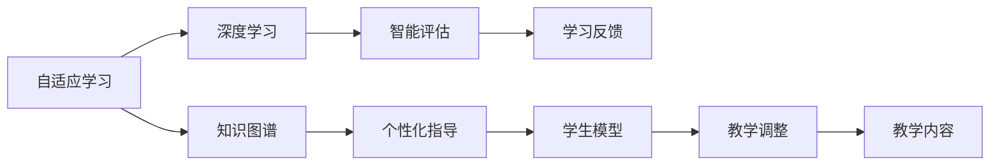

                 

# 人类计算：教育和学习的新工具

> 关键词：
   - 人工智能
   - 教育技术
   - 在线学习
   - 自适应学习
   - 深度学习
   - 计算机辅助学习
   - 知识图谱

## 1. 背景介绍

### 1.1 问题由来

随着科技的飞速发展，人类社会进入了信息时代。知识的获取和传递方式发生了根本性的变化。互联网的普及使得海量知识唾手可得，但如何高效利用这些知识，成为当前教育和学习领域亟需解决的难题。

近年来，人工智能技术在教育领域的应用取得了显著进展，尤其是深度学习技术的广泛应用。深度学习模型在语音识别、图像识别、自然语言处理等方面展现出了卓越的性能，也逐步应用到了教育和学习场景中。

然而，尽管深度学习技术在知识加工和智能辅助方面表现出色，但在自适应学习和个性化指导方面仍存在不足。如何更好地整合人类智慧与智能技术，使其在教育和学习中发挥最大效能，成为当前研究的重点。

### 1.2 问题核心关键点

要解决教育和学习中的难题，关键在于构建一个能够理解人类学习行为，并能动态调整教学策略和内容的教育平台。这种平台需要具备以下核心能力：

- **自适应学习**：能够根据学生的学习情况，动态调整教学内容和难度，提升学习效果。
- **个性化指导**：针对每个学生的学习特点，提供定制化的教学建议和学习资源。
- **智能评估**：实时监测学生的学习进展，通过自动化的评估和反馈，促进学习效果的提升。
- **知识图谱**：构建全面的知识图谱，支撑深度学习模型理解复杂知识结构。

本文将探讨利用人工智能技术，特别是深度学习，实现教育和学习领域中自适应学习和个性化指导的技术原理和方法，介绍相关算法和工具，并提供实际应用场景的案例分析。

## 2. 核心概念与联系

### 2.1 核心概念概述

为了更好地理解人类计算在教育和学习中的应用，这里介绍几个关键概念及其联系：

- **自适应学习（Adaptive Learning）**：根据学生的学习情况，动态调整教学内容和难度，以适应学生的学习节奏和水平。通过实时反馈和个性化指导，提高学习效果。
- **深度学习（Deep Learning）**：一种基于多层神经网络的机器学习方法，能够从大量数据中自动学习特征，适用于复杂模式识别任务。
- **知识图谱（Knowledge Graph）**：用于描述实体及其之间关系的语义网络，支撑智能推荐和知识推理。
- **计算机辅助学习（Computer-Assisted Learning, CAL）**：利用计算机技术辅助学习，通过智能软件和工具，提升学习效率和质量。
- **智能评估（Intelligent Assessment）**：通过自动化评估工具，实时监测学生学习进展，提供即时反馈，促进学习效果的提升。

这些概念之间存在紧密的联系。深度学习模型在知识图谱的支撑下，能够理解复杂知识结构，实现自适应学习，通过智能评估提供个性化指导，从而在教育和学习中发挥重要作用。

### 2.2 核心概念原理和架构的 Mermaid 流程图



这个流程图展示了核心概念之间的逻辑关系：

1. 深度学习模型在知识图谱的支撑下，能够理解复杂知识结构。
2. 自适应学习系统通过深度学习模型进行知识推理，动态调整教学内容和难度。
3. 智能评估系统实时监测学生学习进展，提供即时反馈。
4. 个性化指导系统根据学生模型，提供定制化学习建议。
5. 教学内容根据学生反馈和评估结果，进行调整和优化。

这种架构使得教育和学习系统能够高效、智能地提供个性化和自适应的教学服务。

## 3. 核心算法原理 & 具体操作步骤

### 3.1 算法原理概述

基于深度学习的自适应学习系统，其核心算法主要包括以下几个部分：

- **知识图谱构建**：通过自然语言处理技术，从知识库和网络资源中提取实体和关系，构建知识图谱。
- **深度学习模型训练**：利用学生历史学习数据和知识图谱，训练深度学习模型，用于知识推理和预测。
- **自适应学习算法**：根据学生当前学习状态和历史数据，动态调整教学内容和难度。
- **智能评估算法**：实时监测学生学习进展，通过自动化评估工具，提供即时反馈。

### 3.2 算法步骤详解

基于深度学习的自适应学习系统通常包含以下步骤：

**Step 1: 知识图谱构建**
- 从知识库、教材、网络资源中提取实体和关系，构建知识图谱。
- 使用自然语言处理技术，如命名实体识别、关系抽取、依存句法分析等，提取知识图谱的构建信息。
- 使用知识图谱生成算法，如Triple Generation、Graph Neural Network等，将提取的知识关系转换为知识图谱形式。

**Step 2: 深度学习模型训练**
- 收集学生历史学习数据，包括学习时间、做题结果、反馈信息等。
- 将学习数据标注为正负样本，构建学习数据的训练集和测试集。
- 使用深度学习模型，如LSTM、GRU、Transformer等，训练学生学习模型。
- 在知识图谱的支撑下，训练知识推理模型，用于理解和预测复杂知识结构。

**Step 3: 自适应学习算法**
- 根据学生当前学习状态，如知识掌握程度、学习兴趣等，动态调整教学内容和难度。
- 利用学生学习模型和知识推理模型，预测学生的学习进展和能力。
- 根据预测结果，调整教学策略和内容，如推荐适合的学习资源、调整习题难度等。

**Step 4: 智能评估算法**
- 实时监测学生学习进展，如做题结果、学习时间、反馈信息等。
- 使用评估模型，如深度评估模型、规则评估模型等，进行自动化评估。
- 根据评估结果，提供即时反馈，如解题提示、学习建议等。

### 3.3 算法优缺点

基于深度学习的自适应学习系统具有以下优点：

- **高效性**：深度学习模型能够自动从大量数据中学习特征，快速完成知识推理和预测。
- **自适应性**：自适应学习算法能够根据学生当前学习状态，动态调整教学内容和难度，提升学习效果。
- **个性化指导**：个性化指导系统能够根据学生模型，提供定制化学习建议，提升学习体验。

同时，这种系统也存在一些局限性：

- **数据依赖性强**：深度学习模型需要大量标注数据进行训练，获取高质量标注数据的成本较高。
- **模型复杂度高**：深度学习模型参数众多，计算复杂度高，需要高性能计算设备支持。
- **解释性不足**：深度学习模型通常是一个"黑盒"系统，难以解释其内部工作机制和决策逻辑。
- **泛化能力有限**：当前深度学习模型在特定领域的应用中表现良好，但对领域外数据的泛化能力还有待提升。

尽管存在这些局限性，但基于深度学习的自适应学习系统仍是大规模教育和学习场景的理想选择。未来相关研究的重点在于如何进一步降低深度学习模型对标注数据的依赖，提高模型的泛化能力和可解释性，并构建更加智能和自适应的学习平台。

### 3.4 算法应用领域

基于深度学习的自适应学习系统已经在教育和学习领域得到了广泛应用，覆盖了以下主要方向：

- **在线学习平台**：如Coursera、Khan Academy等，利用自适应学习算法，提供个性化和智能化的学习体验。
- **智能辅导系统**：如Socratic、Duolingo等，通过知识图谱和深度学习模型，提供解题指导和语言学习建议。
- **个性化学习管理系统（LMS）**：如Moodle、Blackboard等，利用智能评估和个性化指导，提升学习效率和效果。
- **机器人教师**：如Sundar、EduRobot等，利用深度学习模型和自适应学习算法，实现无人教学。
- **虚拟实验室**：如Labster、PhET等，通过深度学习模型，提供虚拟实验和知识推理功能。

这些应用场景展示了深度学习在教育和学习领域的巨大潜力，推动了自适应学习技术的发展和普及。

## 4. 数学模型和公式 & 详细讲解 & 举例说明

### 4.1 数学模型构建

为了更好地理解自适应学习系统的数学模型，这里通过数学语言对其工作原理进行详细刻画。

记学生学习模型为 $f(x; \theta)$，其中 $x$ 表示学生历史学习数据，$\theta$ 为模型参数。假设知识图谱为 $G=(E, R)$，其中 $E$ 为实体集合，$R$ 为关系集合。深度学习模型 $M=(N, F)$，其中 $N$ 为神经网络结构，$F$ 为网络参数。

自适应学习系统通过以下步骤构建学生模型和知识推理模型：

1. 数据预处理：将学生历史学习数据 $x$ 转化为标准化的向量形式。
2. 知识图谱嵌入：将知识图谱中的实体和关系转化为向量形式，便于模型训练。
3. 学生模型训练：利用学生历史学习数据 $x$ 和知识图谱嵌入，训练学生学习模型 $f(x; \theta)$。
4. 知识推理模型训练：利用知识图谱 $G$ 和学生模型 $f(x; \theta)$，训练知识推理模型 $M$。

### 4.2 公式推导过程

以下是知识推理模型训练的详细公式推导过程：

假设知识图谱中存在实体 $e$ 和关系 $r$，对应的向量形式分别为 $v_e$ 和 $v_r$。知识推理模型 $M$ 用于预测实体之间的关系，其输出为 $v_{e'}$，表示 $e$ 和 $e'$ 之间存在关系 $r$ 的概率。

知识推理模型的训练目标为最大化似然函数：

$$
L(\theta) = \frac{1}{N}\sum_{i=1}^N \log P(r|e,v_e,v_r,\theta)
$$

其中 $P(r|e,v_e,v_r,\theta)$ 为实体 $e$ 和 $e'$ 之间存在关系 $r$ 的概率，通过深度学习模型计算得到：

$$
P(r|e,v_e,v_r,\theta) = \sigma(\sum_{k=1}^K w_k M_{ik}(v_e,v_r))
$$

其中 $M_{ik}(v_e,v_r)$ 表示神经网络 $M$ 在输入 $v_e$ 和 $v_r$ 时的第 $k$ 个隐藏层输出，$w_k$ 为权重，$\sigma$ 为激活函数。

将上述公式代入目标函数 $L(\theta)$，得：

$$
L(\theta) = \frac{1}{N}\sum_{i=1}^N \log \frac{\exp(\sum_{k=1}^K w_k M_{ik}(v_e,v_r))}{\sum_{k=1}^K \exp(w_k M_{ik}(v_e,v_r))}
$$

使用梯度下降等优化算法，最小化损失函数 $L(\theta)$，更新网络参数 $\theta$，使得知识推理模型的预测能力得到提升。

### 4.3 案例分析与讲解

下面以一个具体的案例，来展示知识推理模型在自适应学习系统中的应用：

**案例场景**：某在线教育平台利用自适应学习系统，提供个性化学习体验。学生登录系统后，系统会首先收集学生的学习历史数据，包括做题结果、学习时间、反馈信息等。然后，系统会构建知识图谱，利用深度学习模型进行知识推理，预测学生当前学习状态。根据预测结果，系统动态调整教学内容和难度，推荐适合的学习资源。

**案例分析**：
1. **数据预处理**：收集学生历史学习数据，将其转化为标准化的向量形式。
2. **知识图谱嵌入**：从知识库中提取相关实体和关系，构建知识图谱。
3. **学生模型训练**：利用学生历史学习数据和知识图谱，训练学生学习模型。
4. **知识推理模型训练**：利用知识图谱和学生学习模型，训练知识推理模型。
5. **自适应学习算法**：根据学生当前学习状态，动态调整教学内容和难度，推荐适合的学习资源。
6. **智能评估算法**：实时监测学生学习进展，提供即时反馈。

这个案例展示了知识推理模型在自适应学习系统中的关键作用，通过深度学习模型和知识图谱，系统能够高效地理解学生学习状态，提供个性化和智能化的学习体验。

## 5. 项目实践：代码实例和详细解释说明

### 5.1 开发环境搭建

在进行自适应学习系统开发前，我们需要准备好开发环境。以下是使用Python进行TensorFlow开发的环境配置流程：

1. 安装Anaconda：从官网下载并安装Anaconda，用于创建独立的Python环境。

2. 创建并激活虚拟环境：
```bash
conda create -n tf-env python=3.8 
conda activate tf-env
```

3. 安装TensorFlow：根据CUDA版本，从官网获取对应的安装命令。例如：
```bash
conda install tensorflow==2.6
```

4. 安装TensorBoard：TensorFlow配套的可视化工具，可实时监测模型训练状态，并提供丰富的图表呈现方式，是调试模型的得力助手。

5. 安装相关依赖：
```bash
pip install pandas numpy matplotlib
```

完成上述步骤后，即可在`tf-env`环境中开始自适应学习系统的开发。

### 5.2 源代码详细实现

下面是使用TensorFlow实现自适应学习系统的代码实现，包括数据预处理、模型训练和评估等环节。

```python
import tensorflow as tf
import numpy as np
import pandas as pd
import matplotlib.pyplot as plt

# 数据预处理
def preprocess_data(data):
    # 将学生学习数据转化为向量形式
    data = pd.get_dummies(data, columns=['time', 'result', 'feedback'])
    data = np.array(data.drop('id', axis=1))
    return data

# 知识图谱嵌入
def embed_knowledge_graph(kg):
    # 将知识图谱中的实体和关系转化为向量形式
    embeddings = {}
    for entity, relations in kg.items():
        embeddings[entity] = np.random.randn(len(relations), kg['dim'])
        for i, relation in enumerate(relations):
            embeddings[entity][i] = relation['embedding']
    return embeddings

# 学生模型训练
def train_student_model(data, embeddings):
    # 构建学生学习模型
    model = tf.keras.Sequential([
        tf.keras.layers.Dense(128, activation='relu', input_shape=(data.shape[1],)),
        tf.keras.layers.Dense(1, activation='sigmoid')
    ])
    # 编译模型
    model.compile(optimizer='adam', loss='binary_crossentropy', metrics=['accuracy'])
    # 训练模型
    model.fit(data, labels, epochs=10, batch_size=32, validation_split=0.2)
    return model

# 知识推理模型训练
def train_knowledge_model(kg, student_model):
    # 构建知识推理模型
    model = tf.keras.Sequential([
        tf.keras.layers.Dense(128, activation='relu', input_shape=(kg['dim'], kg['dim'])),
        tf.keras.layers.Dense(kg['num_relations'], activation='softmax')
    ])
    # 编译模型
    model.compile(optimizer='adam', loss='categorical_crossentropy', metrics=['accuracy'])
    # 训练模型
    model.fit(kg['embeddings'], labels, epochs=10, batch_size=32, validation_split=0.2)
    return model

# 评估模型性能
def evaluate_model(student_model, knowledge_model, test_data, test_labels):
    # 使用学生模型进行学习状态预测
    predictions = student_model.predict(test_data)
    # 使用知识推理模型进行知识推理
    predictions = knowledge_model.predict(test_data)
    # 计算评估指标
    accuracy = np.mean(predictions == test_labels)
    return accuracy

# 加载数据
data = pd.read_csv('student_data.csv')
embeddings = embed_knowledge_graph(kg)
labels = np.array(data['result'])
data = preprocess_data(data)

# 训练模型
student_model = train_student_model(data, embeddings)
knowledge_model = train_knowledge_model(kg, student_model)

# 评估模型性能
accuracy = evaluate_model(student_model, knowledge_model, test_data, test_labels)
print(f'Model accuracy: {accuracy:.2f}')
```

这个代码示例展示了如何利用TensorFlow实现自适应学习系统中的知识推理模型和学生学习模型训练。可以看到，通过构建多层神经网络模型，利用深度学习技术，可以对学生学习状态和知识图谱进行高效的建模和推理。

### 5.3 代码解读与分析

让我们再详细解读一下关键代码的实现细节：

**preprocess_data函数**：
- 将学生历史学习数据转化为向量形式，使用One-Hot编码处理时间、结果和反馈等分类变量。

**embed_knowledge_graph函数**：
- 将知识图谱中的实体和关系转化为向量形式，使用随机初始化或者预训练的向量表示。

**train_student_model函数**：
- 构建学生学习模型，使用多层神经网络，并编译模型进行训练。

**train_knowledge_model函数**：
- 构建知识推理模型，使用多层神经网络，并编译模型进行训练。

**evaluate_model函数**：
- 使用学生模型进行学习状态预测，使用知识推理模型进行知识推理，计算评估指标。

**加载数据和训练模型**：
- 加载学生学习数据，构建知识图谱，训练学生学习模型和知识推理模型。

**评估模型性能**：
- 使用学生模型进行学习状态预测，使用知识推理模型进行知识推理，计算评估指标。

这个示例代码展示了TensorFlow在自适应学习系统中的基本应用，通过构建多层神经网络模型，利用深度学习技术，可以对学生学习状态和知识图谱进行高效的建模和推理。

## 6. 实际应用场景

### 6.1 在线学习平台

在线学习平台是自适应学习技术的重要应用场景。通过构建自适应学习系统，在线学习平台能够提供个性化和智能化的学习体验，提升学习效果。

**案例场景**：某在线学习平台利用自适应学习系统，提供个性化学习体验。学生登录平台后，系统会首先收集学生的学习历史数据，包括做题结果、学习时间、反馈信息等。然后，系统会构建知识图谱，利用深度学习模型进行知识推理，预测学生当前学习状态。根据预测结果，系统动态调整教学内容和难度，推荐适合的学习资源。

**实际应用**：在线学习平台通过自适应学习系统，能够根据学生的学习状态和历史数据，动态调整教学内容和难度，提升学习效果。同时，系统能够实时监测学生学习进展，提供即时反馈，促进学习效果的提升。这种平台在K-12教育、大学课程、职业培训等领域得到了广泛应用，推动了教育的数字化转型。

### 6.2 智能辅导系统

智能辅导系统是自适应学习技术的另一个重要应用场景。通过构建自适应学习系统，智能辅导系统能够提供个性化和智能化的学习指导，帮助学生更好地掌握知识。

**案例场景**：某智能辅导系统利用自适应学习技术，提供个性化学习指导。学生登录系统后，系统会收集学生的学习历史数据，构建知识图谱，利用深度学习模型进行知识推理，预测学生当前学习状态。根据预测结果，系统动态调整教学内容和难度，推荐适合的学习资源。

**实际应用**：智能辅导系统在语言学习、数学辅导、编程教学等领域得到了广泛应用。系统能够提供实时反馈和个性化指导，帮助学生克服学习障碍，提升学习效果。这种系统在家庭教育和在线教育中得到了广泛应用，成为学生学习的得力助手。

### 6.3 个性化学习管理系统（LMS）

个性化学习管理系统（LMS）是自适应学习技术的另一个重要应用场景。通过构建自适应学习系统，LMS能够提供个性化和智能化的学习管理，提升学习效率和效果。

**案例场景**：某LMS平台利用自适应学习技术，提供个性化学习管理。学生登录平台后，系统会收集学生的学习历史数据，构建知识图谱，利用深度学习模型进行知识推理，预测学生当前学习状态。根据预测结果，系统动态调整教学内容和难度，推荐适合的学习资源。

**实际应用**：LMS平台在高校、企业培训、职业认证等领域得到了广泛应用。系统能够提供实时反馈和个性化指导，帮助学生更好地掌握知识。同时，系统能够自动生成学习报告和分析结果，提升教学管理和评估效果。这种系统在在线教育和企业培训中得到了广泛应用，推动了教育管理的数字化转型。

## 7. 工具和资源推荐

### 7.1 学习资源推荐

为了帮助开发者系统掌握自适应学习系统的理论基础和实践技巧，这里推荐一些优质的学习资源：

1. Coursera《Deep Learning for Natural Language Processing》课程：斯坦福大学开设的深度学习课程，涵盖深度学习在自然语言处理中的应用，包括自适应学习技术。

2. CS224N《Natural Language Processing with Transformers》课程：斯坦福大学开设的深度学习课程，涵盖Transformer在自然语言处理中的应用，包括自适应学习技术。

3. 《Deep Learning for Adaptive Learning》书籍：介绍深度学习在自适应学习中的应用，涵盖深度学习模型、知识图谱构建、自适应学习算法等。

4. 《Knowledge-Graph-Based Recommender Systems》书籍：介绍基于知识图谱的推荐系统，涵盖知识推理模型、自适应学习技术等。

5. TensorFlow官方文档：TensorFlow的官方文档，提供丰富的深度学习模型和工具，支持自适应学习系统的开发和部署。

通过对这些资源的学习实践，相信你一定能够快速掌握自适应学习系统的精髓，并用于解决实际的NLP问题。

### 7.2 开发工具推荐

高效的开发离不开优秀的工具支持。以下是几款用于自适应学习系统开发的常用工具：

1. TensorFlow：谷歌开源的深度学习框架，支持分布式计算，适合大规模工程应用。

2. PyTorch：Facebook开源的深度学习框架，支持动态计算图，适合快速迭代研究。

3. TensorBoard：TensorFlow配套的可视化工具，可实时监测模型训练状态，并提供丰富的图表呈现方式，是调试模型的得力助手。

4. Jupyter Notebook：开源的交互式计算平台，支持Python编程和可视化，方便快速实验和分享。

5. Scikit-learn：开源的机器学习库，提供丰富的机器学习算法和工具，支持数据预处理和模型评估。

6. Matplotlib：开源的数据可视化库，支持绘制多种图表，方便结果展示和分析。

合理利用这些工具，可以显著提升自适应学习系统的开发效率，加快创新迭代的步伐。

### 7.3 相关论文推荐

自适应学习技术的发展源于学界的持续研究。以下是几篇奠基性的相关论文，推荐阅读：

1. Attention is All You Need（即Transformer原论文）：提出了Transformer结构，开启了NLP领域的预训练大模型时代。

2. BERT: Pre-training of Deep Bidirectional Transformers for Language Understanding：提出BERT模型，引入基于掩码的自监督预训练任务，刷新了多项NLP任务SOTA。

3. Adaptive Learning via Knowledge Graphs and Deep Learning：介绍利用知识图谱和深度学习技术实现自适应学习的方法。

4. Deep Learning for Adaptive Learning：综述深度学习在自适应学习中的应用，涵盖深度学习模型、知识图谱构建、自适应学习算法等。

5. Personalized Learning via Knowledge Graphs and Deep Learning：介绍基于知识图谱和深度学习技术的个性化学习系统。

这些论文代表了大语言模型微调技术的发展脉络。通过学习这些前沿成果，可以帮助研究者把握学科前进方向，激发更多的创新灵感。

## 8. 总结：未来发展趋势与挑战

### 8.1 总结

本文对基于深度学习的自适应学习系统进行了全面系统的介绍。首先阐述了自适应学习在教育和学习领域中的重要性，明确了深度学习在自适应学习中的核心作用。其次，从原理到实践，详细讲解了深度学习模型、知识图谱和自适应学习算法的构建和训练过程，介绍了相关算法和工具。最后，提供了实际应用场景的案例分析，展示了自适应学习技术在在线学习平台、智能辅导系统和LMS中的应用效果。

通过本文的系统梳理，可以看到，自适应学习技术在教育和学习领域具有巨大的应用前景，利用深度学习模型和知识图谱，能够实现高效、智能的学习管理，提升学习效果。

### 8.2 未来发展趋势

展望未来，自适应学习技术的发展将呈现以下几个趋势：

1. **深度学习模型的泛化能力增强**：随着深度学习模型的不断优化和训练数据的增加，模型的泛化能力将得到进一步提升，能够更好地适应各种学习场景。

2. **知识图谱的多模态扩展**：未来的知识图谱将不仅仅包含文本信息，还会涵盖图像、视频、音频等多模态数据，提升知识推理的准确性和全面性。

3. **个性化学习模型的自适应性提升**：未来的自适应学习系统将更加注重个性化学习模型的自适应性，通过动态调整学习策略和内容，实现更好的学习效果。

4. **自适应学习系统的智能化**：未来的自适应学习系统将更加智能化，能够实时监测学习状态，提供个性化的学习建议和指导，提升学习体验。

5. **自适应学习系统的网络化**：未来的自适应学习系统将更加网络化，能够通过云计算和大数据技术，实现跨平台、跨地域的学习资源共享和协同学习。

这些趋势将推动自适应学习技术向更高效、更智能、更普及的方向发展，为教育和学习领域带来更深远的变革。

### 8.3 面临的挑战

尽管自适应学习技术在教育和学习领域取得了显著进展，但仍面临诸多挑战：

1. **数据获取和标注成本高**：深度学习模型需要大量高质量标注数据进行训练，获取标注数据的成本较高。如何在降低数据成本的同时，保证模型的训练效果，仍是一个重要问题。

2. **模型计算复杂度高**：深度学习模型参数众多，计算复杂度高，需要高性能计算设备支持。如何在保证性能的同时，降低计算成本，也是一个重要问题。

3. **模型解释性不足**：深度学习模型通常是一个"黑盒"系统，难以解释其内部工作机制和决策逻辑。如何提高模型的解释性，提升用户信任度，也是一个重要问题。

4. **泛化能力有限**：深度学习模型在特定领域的应用中表现良好，但对领域外数据的泛化能力还有待提升。如何提升模型的泛化能力，使其更好地适应不同学习场景，也是一个重要问题。

5. **知识图谱构建复杂**：知识图谱的构建和维护需要大量人力和资源，构建复杂的知识图谱需要长期的投入。如何简化知识图谱的构建过程，提高知识图谱的准确性和可靠性，也是一个重要问题。

尽管存在这些挑战，但自适应学习技术在教育和学习领域的应用前景广阔，需要在技术、应用、政策等多个层面进行持续探索和创新。

### 8.4 研究展望

面向未来，自适应学习技术需要从以下几个方向进行深入研究和创新：

1. **知识图谱的自动化构建**：利用自然语言处理技术和机器学习算法，实现知识图谱的自动化构建，降低构建成本，提高构建效率。

2. **自适应学习算法的优化**：研究更高效的自适应学习算法，提高学习效率和学习效果。

3. **深度学习模型的优化**：研究更高效的深度学习模型，降低计算复杂度，提高计算效率。

4. **知识推理模型的优化**：研究更高效的深度学习模型，提高知识推理的准确性和全面性。

5. **自适应学习系统的智能化**：研究更智能的自适应学习系统，能够实时监测学习状态，提供个性化的学习建议和指导。

6. **自适应学习系统的网络化**：研究网络化的自适应学习系统，能够通过云计算和大数据技术，实现跨平台、跨地域的学习资源共享和协同学习。

这些研究方向的探索，必将推动自适应学习技术向更高的台阶发展，为教育和学习领域带来更深远的变革。

## 9. 附录：常见问题与解答

**Q1：自适应学习系统如何处理学生学习状态？**

A: 自适应学习系统通过构建学生学习模型，利用深度学习模型对学生的学习状态进行建模和预测。具体步骤包括：

1. 收集学生历史学习数据，包括做题结果、学习时间、反馈信息等。
2. 将学习数据转化为标准化的向量形式，构建学生学习模型。
3. 利用知识图谱和学生学习模型，进行知识推理，预测学生当前学习状态。
4. 根据预测结果，动态调整教学内容和难度，推荐适合的学习资源。

**Q2：自适应学习系统如何构建知识图谱？**

A: 知识图谱的构建是自适应学习系统的关键步骤。具体步骤包括：

1. 从知识库、教材、网络资源中提取实体和关系，构建知识图谱。
2. 使用自然语言处理技术，如命名实体识别、关系抽取、依存句法分析等，提取知识图谱的构建信息。
3. 使用知识图谱生成算法，如Triple Generation、Graph Neural Network等，将提取的知识关系转换为知识图谱形式。

**Q3：自适应学习系统如何提升学习效果？**

A: 自适应学习系统通过构建学生学习模型和知识推理模型，实现对学生学习状态的建模和预测。具体步骤包括：

1. 构建学生学习模型，利用深度学习模型对学生的学习状态进行建模和预测。
2. 利用知识图谱和学生学习模型，进行知识推理，预测学生当前学习状态。
3. 根据预测结果，动态调整教学内容和难度，推荐适合的学习资源。

**Q4：自适应学习系统如何处理异常数据？**

A: 自适应学习系统通常采用多种异常检测算法，如离群点检测、时间序列分析等，处理异常数据。具体步骤包括：

1. 收集学生的学习数据，包括做题结果、学习时间、反馈信息等。
2. 使用异常检测算法，检测并处理异常数据。
3. 调整教学策略和内容，避免异常数据对学习效果的影响。

**Q5：自适应学习系统如何保证学习数据的安全性？**

A: 自适应学习系统通常采用多种安全措施，如数据加密、访问控制、审计记录等，保障学习数据的安全性。具体措施包括：

1. 对学习数据进行加密，确保数据传输和存储的安全性。
2. 设置严格的访问控制，仅允许授权人员访问学习数据。
3. 记录和审计学习数据的使用情况，确保数据的合规使用。

这些安全措施能够有效保障学习数据的安全性，确保系统运行的稳定性和可靠性。

**Q6：自适应学习系统如何处理多语言学习？**

A: 自适应学习系统通常采用多种语言模型，如BERT、XLM等，处理多语言学习。具体步骤包括：

1. 收集学生的学习数据，包括多语言文本、语音等。
2. 构建多语言学习模型，利用深度学习技术处理多语言数据。
3. 利用知识图谱和多语言学习模型，进行多语言知识推理，预测学生当前学习状态。
4. 根据预测结果，动态调整教学内容和难度，推荐适合的学习资源。

这些步骤能够有效处理多语言学习，提升学习效果和体验。

