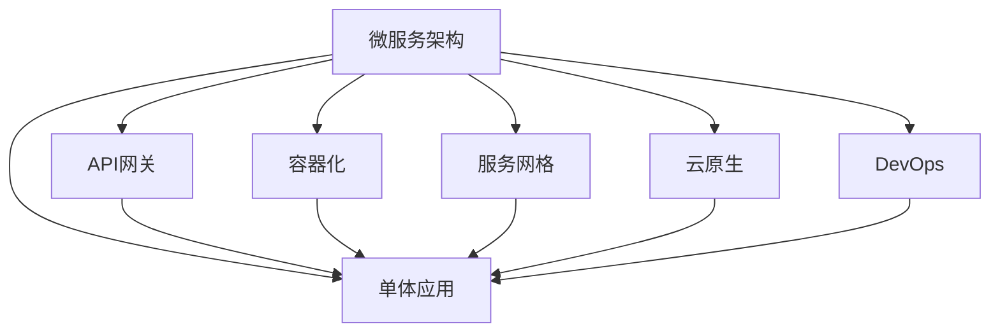

                 

# 从全栈开发到微服务架构师的晋升之路

> 关键词：微服务架构,全栈开发,DevOps,云原生,API网关

## 1. 背景介绍

### 1.1 问题由来

在现代软件开发中，系统架构设计已成为影响项目成败的关键因素之一。随着软件系统的复杂性不断增加，传统单体应用已经难以适应快速迭代、高可靠、高扩展的需求，迫切需要新的架构模式来应对。

近年来，微服务架构（Microservices Architecture）逐渐成为构建大型分布式系统的首选方案。微服务架构将系统拆分为多个独立的小型服务，每个服务负责特定的功能模块，通过轻量级的通信协议（如HTTP RESTful API）进行协同，从而实现系统的高度解耦和灵活构建。

然而，微服务架构并不是银弹，其在实施过程中也面临着诸多挑战。这些问题涉及系统设计、运维管理、开发流程等方面，需要全栈开发人员具备较高的综合素质和专业技能。

本文将从全栈开发者的视角出发，探讨如何逐步提升技术能力，从单体应用开发转型为微服务架构师。我们将从微服务架构的原理与实践、DevOps文化的引入、云原生技术的采纳三个方面，逐步展开深入讲解，帮助全栈开发者顺利晋升为微服务架构师。

### 1.2 问题核心关键点

1. **微服务架构**：系统解耦、独立部署、高效扩展、持续交付。
2. **DevOps文化**：自动化构建、测试、部署，持续集成和持续交付。
3. **云原生技术**：容器化、服务网格、云原生API网关、云原生DevOps。
4. **全栈开发者技能**：前端开发、后端开发、DevOps、云原生应用架构。

这些核心概念相互关联，共同构成了微服务架构师所需掌握的全面能力。通过理解和掌握这些关键点，全栈开发者可以逐步建立起微服务架构的思维模式和实践经验。

## 2. 核心概念与联系

### 2.1 核心概念概述

为更好地理解微服务架构，本节将介绍几个密切相关的核心概念：

- **微服务架构（Microservices Architecture）**：一种架构模式，将系统拆分为多个独立的服务，通过轻量级通信协议进行协同。微服务架构有助于系统解耦、快速迭代和高效扩展。

- **单体应用（Monolithic Architecture）**：整个应用作为一个整体，开发、测试、部署在同一套代码和数据库中，维护和扩展困难。

- **API网关（API Gateway）**：用于统一管理内部服务的访问接口，隐藏内部服务细节，提供统一的、安全的、可扩展的访问入口。

- **容器化（Containerization）**：将应用打包到可移植、可复用的容器（如Docker）中，方便部署和运维。

- **服务网格（Service Mesh）**：一种分布式系统的网络架构，用于实现服务间的通信、负载均衡、故障恢复等功能，与微服务架构无缝集成。

- **云原生（Cloud Native）**：基于云平台和容器技术的现代应用架构，强调自动化、弹性、自适应、高性能。

- **DevOps**：开发（Development）和运维（Operations）的结合，强调自动化、持续交付、质量保证、协作和沟通。

这些核心概念之间的逻辑关系可以通过以下Mermaid流程图来展示：



这个流程图展示了许多关键概念与微服务架构的关系：

1. 微服务架构由单体应用演进而来，解决了单体应用开发、测试、部署等方面的问题。
2. API网关、容器化、服务网格、云原生、DevOps等技术手段，进一步支持和优化微服务架构的实现。
3. 通过微服务架构，开发者可以更好地实践DevOps文化和云原生技术。

## 3. 核心算法原理 & 具体操作步骤

### 3.1 算法原理概述

微服务架构的核心思想是将系统拆分为多个独立的服务，每个服务负责特定功能，通过轻量级通信协议进行协同。这种架构模式具备以下优势：

1. **独立部署**：每个服务可以独立构建、测试和部署，快速迭代更新。
2. **高效扩展**：服务之间通过网络通信，可以水平扩展，提升系统性能和并发能力。
3. **故障隔离**：服务之间的松耦合，单个服务的故障不会影响到整个系统。

微服务架构的设计和实现通常包括以下步骤：

1. **业务拆分**：根据业务功能将系统拆分为多个小型服务。
2. **服务定义**：为每个服务定义清晰的功能和接口。
3. **通信协议**：选择合适的通信协议（如RESTful API）进行服务之间的通信。
4. **服务发现**：使用服务发现机制，动态查找并调用其他服务。
5. **故障恢复**：实现服务的自我修复和故障恢复机制，保证系统的稳定性和可靠性。

### 3.2 算法步骤详解

微服务架构的设计和实现可以分为以下几个关键步骤：

**Step 1: 业务拆分**

根据业务功能将系统拆分为多个小型服务。常用的业务拆分方式包括：

1. 按功能拆分：将系统拆分为独立的模块，每个模块负责特定的业务功能。
2. 按用户角色拆分：根据不同的用户角色，将系统拆分为不同的服务，如用户服务、订单服务、支付服务等。
3. 按数据结构拆分：根据数据结构的不同，将系统拆分为不同的服务，如数据库服务、缓存服务、消息队列服务等。

**Step 2: 服务定义**

为每个服务定义清晰的功能和接口。常用的服务定义方式包括：

1. 使用RESTful API：定义清晰的服务端点和接口，使用HTTP协议进行通信。
2. 使用gRPC：定义基于协议缓冲区的服务接口，提供高效的通信机制。
3. 使用消息队列：定义服务间的消息通信机制，实现异步通信。

**Step 3: 通信协议**

选择合适的通信协议进行服务之间的通信。常用的通信协议包括：

1. HTTP/RESTful API：适用于简单、松耦合的服务通信。
2. gRPC：适用于高性能、低延迟的服务通信。
3. AMQP/RabbitMQ：适用于异步、高可靠的服务通信。

**Step 4: 服务发现**

使用服务发现机制，动态查找并调用其他服务。常用的服务发现机制包括：

1. DNS：使用DNS解析服务地址，实现简单的服务发现。
2. Eureka/Consul：使用集中式的服务注册和发现机制，提供更灵活、高效的服务发现。
3. Kubernetes：使用容器编排技术，实现自动化的服务发现和调用。

**Step 5: 故障恢复**

实现服务的自我修复和故障恢复机制，保证系统的稳定性和可靠性。常用的故障恢复机制包括：

1. 重试机制：对于失败的服务调用，自动进行重试。
2. 限流降级：对于请求量过大的服务，自动降级处理，保证系统稳定。
3. 自我修复：对于服务内部故障，自动进行自我修复和重启。

### 3.3 算法优缺点

微服务架构具有以下优点：

1. **独立部署**：每个服务可以独立构建、测试和部署，快速迭代更新。
2. **高效扩展**：服务之间通过网络通信，可以水平扩展，提升系统性能和并发能力。
3. **故障隔离**：服务之间的松耦合，单个服务的故障不会影响到整个系统。

同时，微服务架构也存在一些缺点：

1. **复杂性增加**：服务数量增加，系统设计复杂度提高。
2. **通信开销**：服务之间的通信增加了网络延迟和开销。
3. **运维复杂度增加**：服务数量增加，运维复杂度提高。

针对这些缺点，需要采用一些优化策略，如服务网格、云原生技术、DevOps文化等，进一步提升微服务架构的可行性和稳定性。

### 3.4 算法应用领域

微服务架构的应用领域非常广泛，涵盖了几乎所有的大型分布式系统。以下是一些典型的应用场景：

1. 电商平台：如淘宝、京东等电商平台，通过微服务架构实现订单、库存、支付等服务的独立部署和高效扩展。
2. 金融系统：如银行、证券等金融系统，通过微服务架构实现交易、风控、结算等服务的独立部署和故障恢复。
3. 社交媒体：如微信、微博等社交媒体平台，通过微服务架构实现消息、互动、广告等服务的独立部署和高效扩展。
4. 医疗系统：如医院、诊所等医疗系统，通过微服务架构实现诊疗、预约、结算等服务的独立部署和高效扩展。
5. 物流系统：如菜鸟网络、顺丰等物流系统，通过微服务架构实现配送、仓储、订单等服务的独立部署和高效扩展。

除了上述这些经典场景外，微服务架构还在更多领域得到了应用，如政府、教育、交通、能源等，为各行各业带来新的创新机遇。

## 4. 数学模型和公式 & 详细讲解  
### 4.1 数学模型构建

在微服务架构中，数学模型的构建主要集中在服务的性能评估和优化上。

假设系统由N个微服务组成，每个服务处理请求的平均响应时间为T，系统总请求数为Q，则系统的平均响应时间为：

$$
T_{sys} = \frac{Q}{N}T
$$

其中，Q/N为每个服务的请求负载，T为单个服务的平均响应时间。

在微服务架构中，每个服务的性能优化对于系统的整体性能至关重要。常见的性能优化策略包括：

1. **负载均衡**：通过负载均衡器将请求均匀分配到各个服务，避免某个服务的请求负载过高。
2. **缓存策略**：使用缓存机制减少服务间的频繁通信，提升系统响应速度。
3. **异步处理**：使用异步处理机制减少服务间的等待时间，提升系统吞吐量。

### 4.2 公式推导过程

假设每个服务的响应时间服从指数分布，服务请求负载为$\lambda$，则单个服务的平均响应时间为：

$$
T = \frac{1}{\lambda}
$$

在微服务架构中，系统的平均响应时间为：

$$
T_{sys} = \frac{1}{\lambda}N
$$

其中，N为服务的数量。

使用负载均衡技术，可以将请求均匀分配到各个服务，从而减少单个服务的请求负载。假设服务之间的负载均衡因子为R，则系统的平均响应时间为：

$$
T_{sys} = \frac{1}{\lambda} \frac{1}{R}
$$

通过使用负载均衡技术，系统的平均响应时间可以进一步优化，提升整体性能。

### 4.3 案例分析与讲解

以电商平台为例，使用微服务架构进行性能优化。假设电商平台有N个订单服务，每个订单服务的平均响应时间为T，系统的总请求数为Q。

使用负载均衡技术将请求均匀分配到各个订单服务，系统的平均响应时间为：

$$
T_{sys} = \frac{Q}{N}T
$$

使用缓存策略对订单信息进行缓存，减少服务间的频繁通信，提升系统响应速度。假设缓存的命中率率为H，则系统的平均响应时间为：

$$
T_{sys} = \frac{(1-H)Q}{N}T + H \frac{Q}{N}T_{cache}
$$

其中，T_{cache}为缓存服务的响应时间。

使用异步处理机制对订单处理进行优化，减少服务间的等待时间，提升系统吞吐量。假设异步处理的延迟时间为D，则系统的平均响应时间为：

$$
T_{sys} = \frac{Q}{N}T + D
$$

通过合理的负载均衡、缓存策略和异步处理，微服务架构能够显著提升电商平台的性能和稳定性。

## 5. 项目实践：代码实例和详细解释说明

### 5.1 开发环境搭建

在进行微服务架构实践前，我们需要准备好开发环境。以下是使用Python和Docker进行微服务架构开发的流程：

1. 安装Docker：从官网下载并安装Docker，搭建微服务架构的开发环境。

2. 编写Dockerfile：定义微服务的Docker镜像构建流程。

3. 构建和运行Docker镜像：通过Dockerfile构建微服务镜像，并使用Docker运行服务。

```bash
docker build -t my_service .
docker run -d -p 8080:8080 my_service
```

4. 部署和管理微服务：使用Kubernetes或Docker Swarm等容器编排工具，对微服务进行部署和管理。

```bash
kubectl apply -f my_service.yaml
kubectl get pods
```

完成上述步骤后，即可在Docker环境中开始微服务架构的实践。

### 5.2 源代码详细实现

下面我们以微服务架构的订单服务为例，给出使用Python和Flask进行微服务架构的开发示例。

首先，定义订单服务的API接口：

```python
from flask import Flask, request, jsonify

app = Flask(__name__)

@app.route('/orders', methods=['POST'])
def create_order():
    data = request.json
    # 处理订单创建逻辑
    return jsonify({'message': 'Order created successfully'})

@app.route('/orders', methods=['GET'])
def get_orders():
    # 处理订单查询逻辑
    return jsonify({'orders': ...})
```

然后，定义订单服务的Docker镜像构建流程：

```dockerfile
FROM python:3.8

WORKDIR /app

COPY requirements.txt requirements.txt
RUN pip install -r requirements.txt

COPY . .

EXPOSE 8080

CMD ["python", "app.py"]
```

最后，使用Docker运行订单服务：

```bash
docker run -d -p 8080:8080 my_order_service
```

### 5.3 代码解读与分析

让我们再详细解读一下关键代码的实现细节：

**Dockerfile**：
- `FROM python:3.8`：指定Docker镜像的基础层。
- `WORKDIR /app`：设置应用的工作目录。
- `COPY requirements.txt requirements.txt`：将项目依赖复制到Docker镜像中。
- `RUN pip install -r requirements.txt`：在Docker镜像中安装项目依赖。
- `COPY . .`：将项目代码复制到Docker镜像中。
- `EXPOSE 8080`：暴露服务端口8080。
- `CMD ["python", "app.py"]`：指定服务启动命令。

**订单服务API接口**：
- `@app.route('/orders', methods=['POST'])`：定义POST请求的接口。
- `@app.route('/orders', methods=['GET'])`：定义GET请求的接口。
- `request.json`：获取JSON格式请求数据。
- `jsonify`：将Python字典转换为JSON格式响应数据。

以上代码展示了微服务架构中的订单服务开发流程，包括定义API接口、构建Docker镜像、运行服务等步骤。开发者可以将其应用到实际的微服务项目中，构建完整的微服务系统。

### 5.4 运行结果展示

启动微服务后，可以通过Docker直接访问API接口：

```bash
curl http://localhost:8080/orders
```

即可获取订单列表信息。

## 6. 实际应用场景

### 6.1 智能客服系统

基于微服务架构的智能客服系统，可以实现高度灵活和可扩展的智能客服服务。系统由多个独立的微服务组成，如知识库服务、语音识别服务、自然语言理解服务等，每个服务负责特定的功能模块。通过微服务架构，系统能够快速迭代更新，适应客户需求的快速变化。

在技术实现上，可以构建独立的微服务，使用API网关统一管理内部服务的访问接口，隐藏内部服务细节，提供统一的、安全的、可扩展的访问入口。同时，通过容器化和云原生技术，实现服务的自动化部署和弹性扩展，保障系统的高可靠性和高效扩展性。

### 6.2 金融系统

基于微服务架构的金融系统，可以实现交易、风控、结算等服务的独立部署和高效扩展。系统由多个独立的微服务组成，如交易服务、风控服务、结算服务等，每个服务负责特定的业务功能。通过微服务架构，系统能够快速迭代更新，适应市场变化的快速变化。

在技术实现上，可以构建独立的微服务，使用API网关统一管理内部服务的访问接口，隐藏内部服务细节，提供统一的、安全的、可扩展的访问入口。同时，通过容器化和云原生技术，实现服务的自动化部署和弹性扩展，保障系统的高可靠性和高效扩展性。

### 6.3 社交媒体

基于微服务架构的社交媒体系统，可以实现消息、互动、广告等服务的独立部署和高效扩展。系统由多个独立的微服务组成，如消息服务、互动服务、广告服务等，每个服务负责特定的业务功能。通过微服务架构，系统能够快速迭代更新，适应用户需求的快速变化。

在技术实现上，可以构建独立的微服务，使用API网关统一管理内部服务的访问接口，隐藏内部服务细节，提供统一的、安全的、可扩展的访问入口。同时，通过容器化和云原生技术，实现服务的自动化部署和弹性扩展，保障系统的高可靠性和高效扩展性。

### 6.4 未来应用展望

随着微服务架构的不断发展，其在更多领域得到了应用，为各行各业带来新的创新机遇。

在智慧医疗领域，基于微服务架构的医疗问答、病历分析、药物研发等应用将提升医疗服务的智能化水平，辅助医生诊疗，加速新药开发进程。

在智能教育领域，微服务架构可应用于作业批改、学情分析、知识推荐等方面，因材施教，促进教育公平，提高教学质量。

在智慧城市治理中，微服务架构可应用于城市事件监测、舆情分析、应急指挥等环节，提高城市管理的自动化和智能化水平，构建更安全、高效的未来城市。

此外，在企业生产、社会治理、文娱传媒等众多领域，微服务架构也将不断涌现，为经济社会发展注入新的动力。

## 7. 工具和资源推荐
### 7.1 学习资源推荐

为了帮助开发者系统掌握微服务架构的理论基础和实践技巧，这里推荐一些优质的学习资源：

1. 《微服务架构之路》系列博文：由微服务架构专家撰写，深入浅出地介绍了微服务架构的原理与实践。

2. 《微服务架构设计与实践》书籍：详细介绍微服务架构的各项关键技术和设计原则，涵盖设计、实现、部署、运维等多个方面。

3. 《Cloud Native: A Primer》书籍：全面介绍云原生技术的核心概念和关键实践，包括容器化、服务网格、云原生API网关、云原生DevOps等。

4. Kubernetes官方文档：详细介绍了Kubernetes的架构、功能、部署和运维指南，是微服务架构的重要参考。

5. Google Cloud DevOps博客：提供丰富的云原生DevOps实践和案例，涵盖CI/CD、自动化测试、持续交付等多个方面。

通过对这些资源的学习实践，相信你一定能够快速掌握微服务架构的精髓，并用于解决实际的系统问题。

### 7.2 开发工具推荐

高效的开发离不开优秀的工具支持。以下是几款用于微服务架构开发的常用工具：

1. Docker：用于构建、部署和管理微服务镜像的工具，支持自动化部署和弹性扩展。

2. Kubernetes：用于容器编排和管理的开源平台，支持自动化的服务部署、负载均衡、故障恢复等。

3. Flask：Python开发框架，用于快速构建微服务API接口，支持RESTful API、异步处理等。

4. Swagger：API设计和文档工具，用于生成API文档和自动化测试，支持OpenAPI和Swagger UI。

5. New Relic：性能监控和分析工具，用于实时监测微服务架构的性能和故障，保障系统稳定。

6. Jenkins：自动化构建、测试和部署工具，支持CI/CD流程的自动化管理。

合理利用这些工具，可以显著提升微服务架构的开发效率，加快创新迭代的步伐。

### 7.3 相关论文推荐

微服务架构的发展源于学界的持续研究。以下是几篇奠基性的相关论文，推荐阅读：

1. "Decomposing Monolithic Applications into Microservices"（《将单体应用拆分为微服务》）：详细介绍微服务架构的设计和实现原理，是微服务架构的奠基性论文。

2. "Microservices: A Personal Journey"（《微服务架构：一段个人历程》）：介绍微服务架构的发展历程、成功案例和最佳实践，是微服务架构的重要参考。

3. "Building Microservices: Designing Fine-Grained Systems"（《构建微服务：设计细粒度系统》）：详细介绍微服务架构的各项关键技术和设计原则，涵盖设计、实现、部署、运维等多个方面。

4. "Microservices: Beyond Remote Process Calls"（《微服务：超越远程过程调用》）：介绍微服务架构的通信机制、负载均衡、故障恢复等核心技术，是微服务架构的重要参考。

5. "The Evolution of Microservices"（《微服务架构的演进》）：介绍微服务架构的演进历程、技术趋势和未来方向，是微服务架构的重要参考。

这些论文代表了大规模微服务架构的发展脉络。通过学习这些前沿成果，可以帮助研究者把握学科前进方向，激发更多的创新灵感。

## 8. 总结：未来发展趋势与挑战

### 8.1 总结

本文对微服务架构的设计和实践进行了全面系统的介绍。首先阐述了微服务架构的基本原理和关键概念，明确了微服务架构在分布式系统中的应用价值。其次，从业务拆分、服务定义、通信协议、服务发现、故障恢复等方面，详细讲解了微服务架构的设计和实现流程。最后，介绍了DevOps文化和云原生技术的引入，进一步优化了微服务架构的开发和运维。

通过本文的系统梳理，可以看到，微服务架构已成为构建大型分布式系统的首选方案，极大地提升了系统的解耦、扩展和运维能力。微服务架构的发展，也为软件开发模式和运维实践带来了深刻变革。

### 8.2 未来发展趋势

展望未来，微服务架构的发展将呈现以下几个趋势：

1. **云原生化**：微服务架构与云原生技术（如Kubernetes、Docker、Istio等）的深度融合，进一步提升系统的灵活性、可靠性和扩展性。

2. **API驱动**：微服务架构向API驱动的演变，服务间的通信和协同将更加依赖API网关和API编排。

3. **数据驱动**：微服务架构将更多地依赖数据驱动的决策，使用数据湖、数据流等技术，提升系统的智能性和自适应能力。

4. **自动化和智能化**：微服务架构将更多地采用自动化和智能化技术，如AI运维、智能监控、自动化测试等，提升开发和运维的效率和质量。

5. **服务治理**：微服务架构将更多地依赖服务治理技术，如服务网格、服务注册、负载均衡、故障恢复等，保障系统的稳定性和可靠性。

这些趋势凸显了微服务架构的广阔前景。未来的微服务架构将更加灵活、高效、智能化，为构建更加复杂和分布式的大型系统提供坚实的基础。

### 8.3 面临的挑战

尽管微服务架构已经取得了瞩目成就，但在迈向更加智能化、普适化应用的过程中，它仍面临着诸多挑战：

1. **复杂性增加**：微服务数量增加，系统设计复杂度提高，运维难度增加。
2. **通信开销**：服务之间的通信增加了网络延迟和开销，影响系统性能。
3. **运维复杂度增加**：服务数量增加，运维复杂度提高，需要更多的运维工具和技能。
4. **数据一致性问题**：微服务架构下，数据的一致性和事务性管理更加复杂，需要更多的设计和优化。
5. **安全性问题**：微服务架构下，系统的安全性和隐私保护更加重要，需要更多的安全措施和策略。

面对这些挑战，未来的微服务架构需要从设计、实现、运维等多个方面进行优化和改进，以适应更复杂的业务需求和更高的性能要求。

### 8.4 研究展望

面对微服务架构所面临的挑战，未来的研究需要在以下几个方面寻求新的突破：

1. **服务治理技术**：开发更加高效、智能的服务治理技术，如服务网格、服务注册、负载均衡、故障恢复等，进一步提升系统的灵活性、可靠性和扩展性。

2. **自动化和智能化技术**：开发更多的自动化和智能化技术，如AI运维、智能监控、自动化测试等，提升开发和运维的效率和质量。

3. **数据驱动的微服务**：将数据驱动的决策引入微服务架构，使用数据湖、数据流等技术，提升系统的智能性和自适应能力。

4. **云原生技术的深入应用**：进一步深入应用云原生技术，如容器化、云原生API网关、云原生DevOps等，提升系统的灵活性、可靠性和扩展性。

这些研究方向的探索，必将引领微服务架构的发展方向，推动微服务架构向更高效、智能化、普适化的方向演进。

## 9. 附录：常见问题与解答

**Q1: 微服务架构的优势和劣势是什么？**

A: 微服务架构的优势包括：

1. 独立部署：每个服务可以独立构建、测试和部署，快速迭代更新。
2. 高效扩展：服务之间通过网络通信，可以水平扩展，提升系统性能和并发能力。
3. 故障隔离：服务之间的松耦合，单个服务的故障不会影响到整个系统。

微服务架构的劣势包括：

1. 复杂性增加：服务数量增加，系统设计复杂度提高。
2. 通信开销：服务之间的通信增加了网络延迟和开销。
3. 运维复杂度增加：服务数量增加，运维复杂度提高。

**Q2: 如何选择合适的微服务通信协议？**

A: 选择合适的微服务通信协议需要考虑以下因素：

1. 服务之间需要传输的数据类型和大小：如文本、二进制数据等。
2. 服务之间的通信频率和负载：如高频率、高负载服务等。
3. 服务的可靠性和安全性要求：如高可靠、高安全性服务等。

常用的微服务通信协议包括：

1. RESTful API：适用于简单、松耦合的服务通信。
2. gRPC：适用于高性能、低延迟的服务通信。
3. AMQP/RabbitMQ：适用于异步、高可靠的服务通信。

**Q3: 如何优化微服务架构的性能？**

A: 优化微服务架构的性能需要考虑以下因素：

1. 负载均衡：通过负载均衡器将请求均匀分配到各个服务，避免某个服务的请求负载过高。
2. 缓存策略：使用缓存机制减少服务间的频繁通信，提升系统响应速度。
3. 异步处理：使用异步处理机制减少服务间的等待时间，提升系统吞吐量。

常用的优化策略包括：

1. 使用缓存机制：对常用的数据进行缓存，减少服务间的频繁通信。
2. 使用异步处理机制：对耗时较长的操作进行异步处理，减少服务间的等待时间。
3. 使用负载均衡机制：使用负载均衡器将请求均匀分配到各个服务，避免某个服务的请求负载过高。

通过合理的负载均衡、缓存策略和异步处理，微服务架构能够显著提升系统的性能和稳定性。

**Q4: 如何实现微服务的自我修复和故障恢复？**

A: 实现微服务的自我修复和故障恢复需要考虑以下因素：

1. 服务监控：实时监控服务的运行状态和性能指标。
2. 故障检测：及时发现和定位服务故障。
3. 故障恢复：自动修复服务故障，确保系统稳定运行。

常用的故障恢复策略包括：

1. 重试机制：对于失败的服务调用，自动进行重试。
2. 限流降级：对于请求量过大的服务，自动降级处理，保证系统稳定。
3. 自我修复：对于服务内部故障，自动进行自我修复和重启。

通过合理的故障检测和自我修复机制，微服务架构能够实现更高的可靠性和稳定性。

**Q5: 微服务架构如何与DevOps文化结合？**

A: 微服务架构与DevOps文化结合，可以提升系统的持续交付和自动化运维能力。具体措施包括：

1. 持续集成和持续部署（CI/CD）：通过自动化工具，将代码提交、编译、测试、部署等流程自动化，提升开发效率。
2. 自动化测试：通过自动化测试工具，提升测试覆盖率和测试质量，保障系统稳定。
3. 自动化运维：通过自动化运维工具，实现自动化的日志监控、故障诊断、故障恢复等，提升运维效率。

通过CI/CD、自动化测试和自动化运维，微服务架构能够实现持续交付和自动化运维，提升系统的稳定性和可扩展性。

**Q6: 如何实现微服务架构的数据一致性？**

A: 微服务架构的数据一致性管理是一个复杂的问题，需要综合考虑数据存储、事务处理、分布式锁等技术手段。

常用的数据一致性策略包括：

1. 最终一致性：通过分布式事务或补偿机制，实现数据一致性。
2. 强一致性：通过乐观锁或悲观锁等机制，确保数据的强一致性。
3. 分布式锁：通过分布式锁机制，确保数据操作的原子性和一致性。

通过合理的分布式事务、乐观锁、悲观锁和分布式锁等策略，微服务架构能够实现数据的一致性和事务性管理。

---

作者：禅与计算机程序设计艺术 / Zen and the Art of Computer Programming

