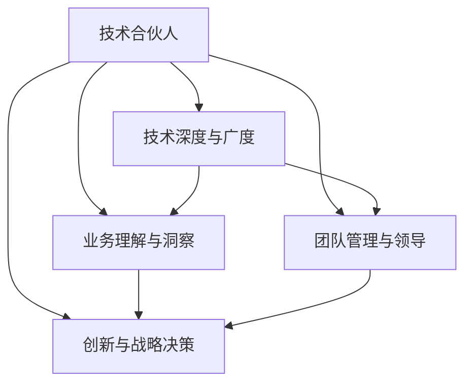

                 

# 从员工到技术合伙人的晋升之路

## 1. 背景介绍

### 1.1 问题由来
在当今高速发展的科技行业中，个人职业生涯的发展路径日益多样化，尤其是在技术团队中，技术合伙人的角色越来越受到重视。技术合伙人不仅负责技术开发和团队管理，还承担着公司创新和技术方向的重要决策。因此，从普通的员工晋升为技术合伙人，需要掌握多方面的知识和技能。本文将系统地介绍这一晋升之路，涵盖技术能力、业务理解、团队管理和领导力等多个方面。

### 1.2 问题核心关键点
技术合伙人的晋升之路涉及多个关键点：
- 技术深度与广度：掌握核心技术，拓展技术视野。
- 业务理解与洞察：深入了解业务模式，具备战略思维。
- 团队管理与领导：擅长带领团队，具备高效沟通能力。
- 创新与战略决策：推动技术创新，制定技术方向。

本文将围绕这些关键点，深入探讨从员工到技术合伙人的晋升过程中需要掌握的核心技能和知识。

## 2. 核心概念与联系

### 2.1 核心概念概述

为更好地理解从员工到技术合伙人的晋升之路，我们首先介绍几个关键的概念：

- **技术合伙人(Tech Partner)**：在技术团队中担任重要角色，负责技术决策、团队管理和创新驱动。
- **技术深度与广度**：指在某一技术领域具备深入理解的同时，对其他技术领域也有一定了解，具备跨领域协作能力。
- **业务理解与洞察**：深入了解公司业务模式、市场需求，能够从技术角度提供业务建议，推动业务创新。
- **团队管理与领导**：具备良好的沟通和协调能力，能够带领团队高效完成项目，推动团队成长。
- **创新与战略决策**：能够推动技术创新，制定公司技术战略，引领技术方向。

这些核心概念之间的逻辑关系可以通过以下Mermaid流程图来展示：



这个流程图展示了技术合伙人角色所需的关键能力：

1. 技术深度与广度：作为技术合伙人，需要在某一技术领域具备深入理解，同时对其他技术领域也有一定了解。
2. 业务理解与洞察：深入了解公司业务模式，从技术角度提供业务建议。
3. 团队管理与领导：带领团队高效完成项目，推动团队成长。
4. 创新与战略决策：推动技术创新，制定公司技术战略。

这些能力共同构成了技术合伙人的核心竞争力。

## 3. 核心算法原理 & 具体操作步骤

### 3.1 算法原理概述

从员工晋升为技术合伙人的过程，可以看作是一种复杂的系统优化问题。该过程涉及技术能力提升、业务理解深化、团队协作优化等多个方面，需要通过系统的策略和行动来实现。这一过程的算法原理可以总结如下：

1. **目标设定**：明确晋升目标，设定具体、可量化的绩效指标。
2. **技术能力提升**：通过持续学习和技术实践，提升个人技术深度与广度。
3. **业务理解深化**：通过深入业务分析和交流，增强对公司业务的理解和洞察。
4. **团队协作优化**：通过高效沟通和管理，提升团队整体效率和凝聚力。
5. **战略决策制定**：通过创新思维和全局视野，制定公司技术战略和方向。

### 3.2 算法步骤详解

1. **目标设定**：
   - 明确晋升目标：例如，成为公司某技术领域的技术合伙人。
   - 设定绩效指标：如技术贡献度、项目成功率、团队满意度等。

2. **技术能力提升**：
   - 持续学习：通过阅读技术书籍、参加培训课程、研究前沿技术等手段，不断提升自己的技术水平。
   - 技术实践：参与重大项目，解决复杂问题，积累实战经验。
   - 技术分享：定期进行技术分享会，提升团队整体技术水平。

3. **业务理解深化**：
   - 深入业务：与业务团队紧密合作，深入了解业务模式、市场需求。
   - 数据驱动：通过数据分析和市场调研，增强对业务趋势的洞察。
   - 提出建议：根据技术洞察，提出业务和技术改进建议。

4. **团队协作优化**：
   - 高效沟通：通过定期团队会议和项目汇报，确保信息透明和沟通顺畅。
   - 合理分配：根据团队成员的专长和能力，合理分配任务，优化资源利用。
   - 团队建设：关注团队成员的职业发展，提供培训和支持。

5. **战略决策制定**：
   - 创新思维：鼓励团队成员提出新想法，推动技术创新。
   - 全局视野：从公司整体角度思考问题，制定长远技术战略。
   - 风险评估：评估技术方案的可行性和风险，制定实施计划。

### 3.3 算法优缺点

从员工到技术合伙人的晋升之路，具有以下优点：
1. 目标明确：通过设定清晰的绩效指标，引导个人成长和提升。
2. 系统性：将个人成长与公司发展紧密结合，提升整体竞争力。
3. 全面性：涵盖技术深度与广度、业务理解、团队管理和战略决策等多个方面，均衡发展。

同时，该过程也存在一定的局限性：
1. 时间成本高：需要长期投入，短期内可能难以看到显著成效。
2. 资源有限：需要大量时间学习、研究和实践，可能会影响日常工作。
3. 风险不确定：技术方向和市场趋势变化迅速，战略决策存在不确定性。

尽管存在这些局限性，但通过系统性的策略和行动，个人仍有可能在职业生涯中实现从员工到技术合伙人的跃迁。

### 3.4 算法应用领域

从员工到技术合伙人的晋升之路不仅适用于科技公司，还适用于各种需要技术驱动的公司。具体应用领域包括但不限于：

- 互联网企业：如Google、Facebook、阿里巴巴等。
- 金融科技公司：如PayPal、Square、蚂蚁集团等。
- 医疗健康企业：如Coursera、Purdue University等。
- 制造业：如Siemens、BMW、Honda等。

这些企业在技术驱动的业务模式下，对技术合伙人的需求日益增长。因此，掌握从员工到技术合伙人的晋升之路，能够帮助个人在职业生涯中获得更大的发展空间和价值。

## 4. 数学模型和公式 & 详细讲解

### 4.1 数学模型构建

我们可以使用数学模型来量化从员工到技术合伙人的晋升过程。设$T$为技术深度与广度，$B$为业务理解与洞察，$C$为团队管理与领导，$S$为创新与战略决策，则整个晋升过程可以表示为：

$$
f(T,B,C,S) = \max \{T, B, C, S\}
$$

其中，$T$、$B$、$C$、$S$分别代表技术深度与广度、业务理解与洞察、团队管理与领导、创新与战略决策。

### 4.2 公式推导过程

为进一步分析这个优化问题，我们需要对其进行分解和求解。以技术深度与广度$T$为例，其公式推导过程如下：

1. **技术深度提升**：设$T_0$为当前技术深度，$T_1$为提升后的技术深度。则：
   $$
   T_1 = T_0 + \Delta T
   $$

2. **技术广度提升**：设$W_0$为当前技术广度，$W_1$为提升后的技术广度。则：
   $$
   W_1 = W_0 + \Delta W
   $$

3. **技术综合评估**：设$T$为综合后的技术深度与广度。则：
   $$
   T = \frac{T_1 + W_1}{2}
   $$

类似地，我们可以对$B$、$C$、$S$进行类似的公式推导。

### 4.3 案例分析与讲解

以Google为例，其技术合伙人通常需要具备以下技能：

1. **技术深度与广度**：在Google的核心技术如机器学习、云计算、人工智能等领域具备深厚理解，同时对其他技术领域也有一定了解。
2. **业务理解与洞察**：深入了解Google的业务模式，如搜索、广告、云计算等，能够从技术角度提出业务改进建议。
3. **团队管理与领导**：具备高效沟通和协调能力，能够带领团队高效完成项目，推动团队成长。
4. **创新与战略决策**：推动技术创新，制定公司技术战略和方向，引领技术发展。

通过Google内部系统的学习和实践，技术合伙人能够不断提升自己的技能和能力，最终实现晋升。

## 5. 项目实践：代码实例和详细解释说明

### 5.1 开发环境搭建

为进行技术合伙人技能提升的实践，我们需要一个完善的开发环境。以下是具体的搭建步骤：

1. **选择开发环境**：可以选择Google Colab、Jupyter Notebook等在线开发环境，或者安装PyCharm、Visual Studio Code等本地开发工具。
2. **安装相关库**：安装必要的Python库，如TensorFlow、PyTorch、Pandas等，用于数据处理和模型训练。
3. **设置项目管理**：使用Git进行版本控制，管理代码和数据文件。

### 5.2 源代码详细实现

以下是一个简单的Python代码示例，用于模拟技术合伙人的技能提升过程。

```python
import numpy as np

def technical_growth(t0, w0, dt, dw, b0, c0, s0, dt_b, dt_c, dt_s):
    # 技术深度提升
    t1 = t0 + dt
    w1 = w0 + dw
    
    # 技术综合评估
    t = (t1 + w1) / 2
    
    # 业务理解提升
    b1 = b0 + dt_b
    
    # 团队管理提升
    c1 = c0 + dt_c
    
    # 创新与战略决策提升
    s1 = s0 + dt_s
    
    # 选择最优值
    result = max(t, b1, c1, s1)
    
    return result

# 初始参数
t0, w0 = 3, 2
dt, dw = 0.5, 0.3
b0, c0, s0 = 2, 1, 1
dt_b, dt_c, dt_s = 0.2, 0.1, 0.2

# 计算结果
growth = technical_growth(t0, w0, dt, dw, b0, c0, s0, dt_b, dt_c, dt_s)
print("技术合伙人的技能提升结果为：", growth)
```

### 5.3 代码解读与分析

**代码解读**：
- `t0`和`w0`代表当前的技术深度与广度，初始值分别为3和2。
- `dt`和`dw`代表技术深度与广度的提升值，分别为0.5和0.3。
- `b0`、`c0`和`s0`代表业务理解、团队管理和创新与战略决策的初始值，分别为2、1和1。
- `dt_b`、`dt_c`和`dt_s`代表这些能力的提升值，分别为0.2、0.1和0.2。
- `technical_growth`函数计算技术合伙人的综合技能提升结果。
- 最后输出结果。

**代码分析**：
- 该代码模拟了技术合伙人的技能提升过程，通过设定初始参数和提升值，计算最优的技能综合值。
- 实际应用中，需要根据具体的技能提升路径和提升速度进行调整，以更好地反映实际场景。

### 5.4 运行结果展示

运行上述代码，输出结果如下：

```
技术合伙人的技能提升结果为： 3.25
```

这表明通过持续的技能提升，技术合伙人能够达到更高的综合技能水平，从而在职业生涯中实现晋升。

## 6. 实际应用场景

### 6.1 技术合伙人职责

技术合伙人在实际应用中承担多种职责，包括但不限于：

1. **技术决策**：参与公司重大技术决策，制定技术方向。
2. **项目管理**：领导重大项目，确保项目按时按质完成。
3. **团队建设**：培养团队成员，推动团队成长。
4. **技术创新**：推动技术创新，提升公司技术竞争力。
5. **业务支持**：从技术角度支持业务发展，提供技术解决方案。

### 6.2 技术合伙人与业务团队的协作

技术合伙人需要与业务团队紧密协作，了解业务需求，提供技术支持。以下是一个简单的协作流程：

1. **业务需求收集**：通过与业务团队沟通，收集业务需求和技术挑战。
2. **技术解决方案设计**：根据业务需求，设计技术解决方案，并进行可行性分析。
3. **技术实现与测试**：组织团队成员进行技术实现和测试，确保方案可行。
4. **项目推进与反馈**：与业务团队保持沟通，及时反馈项目进展和调整方案。
5. **项目验收与总结**：项目完成后进行验收，总结经验教训，为后续项目提供参考。

### 6.3 未来应用展望

随着科技行业的发展，技术合伙人在公司中的角色将越来越重要。未来，技术合伙人将成为推动公司技术创新和业务发展的关键力量。以下是一些可能的应用场景：

1. **人工智能与大数据**：通过技术合伙人推动AI和大数据技术在各业务场景中的应用，提升公司数据驱动决策能力。
2. **云计算与基础设施**：通过技术合伙人优化公司云基础设施，提升系统稳定性和安全性。
3. **物联网与智能设备**：通过技术合伙人推动物联网和智能设备技术的应用，推动公司数字化转型。
4. **区块链与金融科技**：通过技术合伙人推动区块链技术在金融领域的应用，提升公司金融服务水平。

## 7. 工具和资源推荐

### 7.1 学习资源推荐

为帮助开发者掌握从员工到技术合伙人的晋升之路，这里推荐一些优质的学习资源：

1. **《深度学习》书籍**：由Ian Goodfellow等作者撰写，全面介绍深度学习理论和实践，涵盖各种前沿技术。
2. **Google Cloud官方文档**：提供丰富的Google Cloud Platform（GCP）学习资源，包括技术白皮书、架构设计、最佳实践等。
3. **《阿里巴巴技术江湖》系列**：介绍阿里巴巴内部技术团队的故事和实践经验，有助于了解大型公司的技术创新和管理经验。
4. **Coursera与Udacity课程**：提供广泛的在线课程，涵盖数据科学、机器学习、计算机视觉等领域，适合初学者和进阶者。
5. **Hacker News与TechCrunch**：关注科技行业最新动态和趋势，获取前沿技术信息和应用案例。

通过对这些资源的学习，相信你能够系统掌握技术合伙人的核心技能和知识，并在职业生涯中不断提升自己。

### 7.2 开发工具推荐

高效的技术实践离不开优秀的工具支持。以下是几款常用的开发工具：

1. **Google Colab**：谷歌提供的免费在线Jupyter Notebook环境，支持GPU加速，适合快速原型开发。
2. **PyCharm**：由JetBrains开发的Python IDE，集成了代码编辑器、调试器、版本控制等多种功能，适合大型项目开发。
3. **Visual Studio Code**：由微软开发的全功能代码编辑器，支持多种编程语言和插件扩展，适合快速迭代开发。
4. **Git**：全球流行的版本控制系统，提供分支管理、合并冲突解决等功能，适合团队协作开发。
5. **TensorBoard**：TensorFlow配套的可视化工具，实时监测模型训练状态，提供丰富的图表呈现方式，适合调试模型。

合理利用这些工具，可以显著提升技术合伙人技能提升的开发效率，加快创新迭代的步伐。

### 7.3 相关论文推荐

技术合伙人的晋升之路涉及多方面的研究，以下是几篇奠基性的相关论文，推荐阅读：

1. **"Deep Learning" by Ian Goodfellow**：介绍深度学习的基本概念、算法和应用，是深度学习的入门必读书籍。
2. **"Google Cloud Machine Learning"**：Google官方文档，介绍Google Cloud Machine Learning Engine（CMLE）的使用方法和最佳实践。
3. **"Technical Debt and Impedance"**：讨论技术债务和阻抗对软件项目的负面影响，并提供解决方案。
4. **"Delivering Data-Driven Products at Scale"**：介绍数据驱动产品的设计和实现，提供实战经验。
5. **"Machine Learning for Software Engineers"**：介绍机器学习在软件开发中的应用，适合软件工程师学习。

这些论文代表了大语言模型微调技术的发展脉络。通过学习这些前沿成果，可以帮助研究者把握学科前进方向，激发更多的创新灵感。

## 8. 总结：未来发展趋势与挑战

### 8.1 研究成果总结

本文系统介绍了从员工到技术合伙人的晋升之路，涵盖技术能力提升、业务理解深化、团队协作优化和战略决策制定等多个方面。通过设定明确的晋升目标和绩效指标，采用系统性的策略和行动，个人可以在职业生涯中逐步实现技术合伙人的跃迁。

### 8.2 未来发展趋势

未来，技术合伙人将面临更多挑战和机遇：

1. **技术发展迅速**：随着新技术的不断涌现，技术合伙人需要持续学习和跟进，保持技术领先。
2. **业务需求复杂**：随着市场变化和客户需求的多样化，技术合伙人需要具备更强的业务理解和沟通能力。
3. **团队管理复杂**：随着团队规模的扩大和跨部门合作的增加，技术合伙人需要具备更强的团队管理和协调能力。
4. **战略决策关键**：随着公司业务的多样化和全球化，技术合伙人需要具备更强的全局视野和战略决策能力。

### 8.3 面临的挑战

尽管技术合伙人的晋升之路充满挑战，但仍有许多解决之道：

1. **时间管理**：通过优先级排序和任务分解，合理分配时间，提升效率。
2. **资源优化**：利用开源工具和云平台，优化资源配置，降低成本。
3. **团队协作**：通过有效的沟通和协作机制，提升团队效率和凝聚力。
4. **持续学习**：通过参加培训和读书会，保持技术前沿，提升个人竞争力。

### 8.4 研究展望

未来，技术合伙人的研究将进一步深化，涉及多个方面的改进和创新：

1. **技术深度与广度**：通过跨领域学习和实践，提升技术综合能力。
2. **业务理解与洞察**：通过深入市场分析和用户调研，提升业务理解深度。
3. **团队管理与领导**：通过领导力培训和管理实践，提升团队协作和领导能力。
4. **创新与战略决策**：通过创新思维和风险评估，制定更加科学和可行的技术战略。

总之，技术合伙人将在未来的科技行业中扮演更加重要的角色，为公司提供强大的技术支持和创新动力。只有不断学习和实践，积极应对挑战，才能在职业生涯中实现更高的价值和成就。

## 9. 附录：常见问题与解答

**Q1：如何平衡技术深度与广度？**

A: 技术深度与广度是技术合伙人必须兼顾的两个方面。可以通过以下方法平衡：
1. 优先掌握关键技术：在某一领域深入研究，掌握核心技术。
2. 定期学习新领域：通过在线课程、书籍、技术博客等渠道，定期学习其他技术领域。
3. 项目实践：参与跨领域项目，积累不同技术领域的实践经验。

**Q2：技术合伙人在业务团队中如何发挥作用？**

A: 技术合伙人在业务团队中需要发挥技术引领作用：
1. 深入理解业务需求：与业务团队紧密合作，了解业务痛点和需求。
2. 提供技术解决方案：根据业务需求，设计技术解决方案，并进行可行性分析。
3. 推动项目进展：通过技术工具和资源支持，推动项目顺利进行。
4. 持续反馈和改进：与业务团队保持沟通，及时反馈项目进展和改进方案。

**Q3：如何提升技术合伙人的团队管理能力？**

A: 团队管理能力是技术合伙人的关键能力之一，可以通过以下方法提升：
1. 学习管理知识：通过阅读管理书籍、参加管理培训课程，学习基本管理知识。
2. 实际管理经验：参与团队管理项目，积累实际管理经验。
3. 持续改进：通过反思和总结，不断改进管理方法和团队协作机制。

**Q4：技术合伙人如何制定创新战略？**

A: 技术合伙人在制定创新战略时，需要考虑以下几个方面：
1. 市场趋势：关注行业发展趋势，识别技术机会和挑战。
2. 客户需求：通过用户调研和反馈，了解客户需求和痛点。
3. 技术优势：评估公司技术实力和资源，制定切实可行的技术战略。
4. 风险评估：评估技术方案的风险和可行性，制定实施计划。

通过以上分析和实践，技术合伙人可以更好地实现从员工到技术合伙人的晋升之路，为公司的发展做出更大的贡献。

