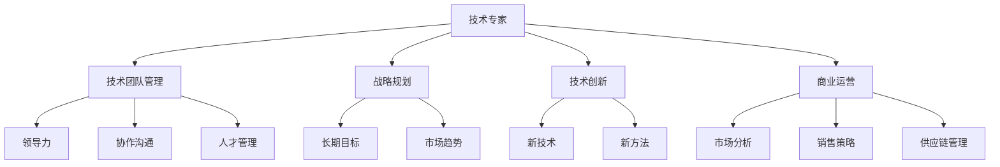

                 

# 从技术专家到企业家的心态转变

> 关键词：心态转变, 技术专家, 企业家, 技术团队管理, 战略规划, 技术创新, 商业运营

## 1. 背景介绍

在当今这个快速变化的技术和商业环境中，技术专家如何转型成为企业家，成为了一个日益重要的话题。随着技术的不断进步和应用的深入，技术专家需要具备更广泛的视野和更全面的能力，才能够引领技术团队和企业实现商业成功。本文将从技术专家的心态转变入手，探讨如何从技术导向转向商业导向，从技术思维转向企业家思维，从而更好地应对挑战，推动企业发展。

## 2. 核心概念与联系

### 2.1 核心概念概述

为了更好地理解技术专家转型为企业家的过程，我们先来梳理几个核心概念及其之间的联系：

- **技术专家（Technical Expert）**：指的是在特定技术领域具有深厚知识和技能的专业人士，通常聚焦于技术实现和产品开发。
- **企业家（Entrepreneur）**：指的是能够识别商业机会，整合资源，推动产品或服务从概念到市场化，实现商业成功的人。
- **技术团队管理（Technical Team Management）**：涉及技术团队的领导、沟通、协调和激励，确保团队能够高效产出高质量的技术成果。
- **战略规划（Strategic Planning）**：涉及制定和实施长期目标和计划，以实现企业的可持续发展。
- **技术创新（Technology Innovation）**：指的是通过新技术和新方法解决实际问题，提升产品和服务的竞争力。
- **商业运营（Business Operation）**：涉及市场分析、销售策略、供应链管理等，确保企业运营的高效和盈利。

这些概念之间的联系可以通过以下Mermaid流程图来展示：



这个流程图展示了技术专家在转型过程中需要掌握的关键技能和能力。

## 3. 核心算法原理 & 具体操作步骤

### 3.1 算法原理概述

技术专家转型为企业家，本质上是一个从技术导向到商业导向的思维转变过程。这种转变涉及多个层面，包括战略规划、市场分析、销售策略、团队管理、技术创新等。

**3.2 算法步骤详解**

以下是技术专家转型为企业家的一般步骤：

**Step 1: 识别商业机会**
- 广泛了解市场趋势和技术动态，寻找潜在的商业机会。
- 通过市场调研和用户反馈，明确目标用户和市场需求。

**Step 2: 制定战略规划**
- 根据商业机会，制定长期和短期的战略目标。
- 确定企业的核心竞争力和市场定位，制定相应的市场策略。

**Step 3: 组建核心团队**
- 招募具有不同技能和背景的团队成员，形成多元化的团队结构。
- 明确团队成员的角色和责任，建立有效的沟通和协作机制。

**Step 4: 技术研发和商业验证**
- 在团队协作和资源调配下，进行技术研发，实现产品原型或原型功能。
- 通过最小可行产品(MVP)或概念验证(POC)，验证产品的市场潜力和用户接受度。

**Step 5: 市场推广和销售策略**
- 基于市场调研结果，制定和执行市场推广计划。
- 开发有效的销售策略，确保产品能够顺利进入市场。

**Step 6: 商业运营和持续改进**
- 建立供应链、物流、客户服务等商业运营系统，确保产品顺利生产和销售。
- 持续监控市场反馈和用户需求，不断优化产品和服务。

### 3.3 算法优缺点

技术专家转型为企业家的方法，有以下优点：

1. **技术基础扎实**：技术专家的技术背景和知识，可以帮助企业在技术实现和创新方面保持竞争力。
2. **问题导向**：技术专家更擅长通过解决具体问题，实现技术成果的商业化。
3. **执行能力强**：技术专家通常具备高效的执行力和项目管理能力，可以快速推进项目进展。

但同时也存在一些缺点：

1. **市场意识不足**：技术专家可能过于关注技术实现，忽视市场趋势和用户需求。
2. **资源调配有限**：技术专家在资源调配和跨领域协作方面可能经验不足，需要加强学习。
3. **战略规划能力有待提高**：技术专家在战略规划和长期目标制定方面可能缺乏系统性思维，需要提高战略思维能力。

### 3.4 算法应用领域

技术专家转型为企业家的方法，适用于各种技术驱动型的企业，特别是在新兴技术和市场需求旺盛的领域，如AI、区块链、互联网金融等。

## 4. 数学模型和公式 & 详细讲解

### 4.1 数学模型构建

本节将使用数学语言对技术专家转型为企业家的一般过程进行更严格的刻画。

设 $T$ 为技术专家的技术技能，$B$ 为商业运营能力，$L$ 为领导力，$M$ 为市场分析能力，$J$ 为战略规划能力，$P$ 为团队管理能力，$S$ 为销售策略能力，$C$ 为供应链管理能力。技术专家转型为企业家的一般模型可以表示为：

$$
\begin{aligned}
&B = f(T, L, M, J, P, S, C) \\
&\text{其中} \\
&f \text{为映射函数，将技术专家的技能映射为商业运营能力。}
\end{aligned}
$$

### 4.2 公式推导过程

通过以上模型，我们可以推导出技术专家转型为企业家的一般路径：

1. **识别商业机会**：通过市场调研和用户反馈，获取市场信息 $M$。
2. **制定战略规划**：结合市场信息和自身技术技能 $T$，制定长期和短期战略 $J$。
3. **组建核心团队**：通过领导力 $L$ 和团队管理能力 $P$，招募和培养团队成员。
4. **技术研发和商业验证**：通过技术技能 $T$ 和市场分析能力 $M$，进行产品研发和市场验证。
5. **市场推广和销售策略**：结合销售策略能力 $S$ 和供应链管理能力 $C$，制定和执行市场推广计划。
6. **商业运营和持续改进**：通过市场分析能力 $M$ 和销售策略能力 $S$，持续优化商业运营系统。

### 4.3 案例分析与讲解

以一家AI初创公司为例，展示技术专家如何转型为企业家：

1. **识别商业机会**：公司创始人通过技术调研，发现AI在医疗诊断中的应用前景广阔。
2. **制定战略规划**：确定公司致力于开发医疗影像AI分析系统的长期目标，并制定具体的市场策略。
3. **组建核心团队**：招募具有医疗背景、AI技术能力、项目管理经验的多元化团队。
4. **技术研发和商业验证**：通过技术团队和市场分析，实现产品原型并进行了概念验证。
5. **市场推广和销售策略**：通过销售团队和供应链管理，推出市场推广活动，确保产品顺利进入市场。
6. **商业运营和持续改进**：持续收集用户反馈，优化产品功能，提升用户体验。

## 5. 项目实践：代码实例和详细解释说明

### 5.1 开发环境搭建

在进行技术专家转型为企业家实践前，我们需要准备好开发环境。以下是使用Python进行开发的环境配置流程：

1. 安装Python：从官网下载并安装Python，选择最新版本。
2. 安装开发工具：安装PyCharm、VSCode等开发工具，确保代码编辑器的高效使用。
3. 配置版本控制：安装Git，配置本地仓库，确保代码版本管理的顺利进行。
4. 设置环境变量：配置环境变量，确保不同环境间的代码一致性。
5. 安装依赖库：通过pip安装必要的依赖库，如numpy、pandas、matplotlib等。

### 5.2 源代码详细实现

接下来，我们通过一个简单的案例，展示技术专家如何转型为企业家，并实现一个AI医疗影像分析系统的开发：

```python
# 1. 识别商业机会
market_research = {
    "market_trends": "医疗影像AI分析需求旺盛",
    "user_feedback": "医疗从业者希望提高诊断效率"
}

# 2. 制定战略规划
strategic_plan = {
    "long_term_goals": "开发医疗影像AI分析系统",
    "market_strategy": "与医院合作推广产品"
}

# 3. 组建核心团队
team_members = {
    "domain_knowledge": "医疗专家",
    "ai_skill": "AI工程师",
    "project_management": "项目经理"
}

# 4. 技术研发和商业验证
product_prototype = "AI影像分析系统原型"
market_validation = "概念验证通过"

# 5. 市场推广和销售策略
marketing_plan = "通过在线广告和展会推广产品"
sales_strategy = "定制化方案推广"

# 6. 商业运营和持续改进
commercial_operations = "实现批量生产"
continuous_improvement = "收集反馈优化产品"
```

### 5.3 代码解读与分析

这段代码展示了技术专家转型为企业家的一般过程。每个步骤通过Python字典的方式进行了封装，具有清晰的逻辑和接口。

- 第1步和第2步的字典包含了市场调研和战略规划的具体内容，显示了如何从技术角度出发，制定商业策略。
- 第3步的字典展示了核心团队的构建，包括不同角色的专家和技能。
- 第4步和第5步的字典展示了技术研发和商业验证的具体过程，从产品原型到概念验证，展示了技术如何转化为市场价值。
- 第6步的字典展示了市场推广和销售策略，以及持续改进的机制，展示了商业运营和产品优化过程。

## 6. 实际应用场景

### 6.1 企业转型升级

技术专家转型为企业家的方法，可以应用于企业的转型升级。许多传统行业企业，面临技术变革的挑战，需要通过技术创新和商业模式创新，实现转型升级。例如，制造业企业可以通过引入AI技术，实现智能制造、质量检测等，提升生产效率和产品质量。

### 6.2 初创企业孵化

初创企业的成功与否，很大程度上取决于团队的技术和商业能力。通过技术专家的转型，可以提升团队的整体能力，推动初创企业的快速发展。例如，科技创业孵化器可以通过培训和指导，帮助技术专家实现角色转换，构建多元化的创业团队。

### 6.3 大公司内部创新

大公司内部的创新，需要突破部门和技术的壁垒，实现跨部门的协同创新。通过技术专家的转型，可以打破部门隔阂，推动跨领域的技术合作和创新，提升企业的整体竞争力。例如，阿里巴巴通过设立数据科学部门，促进技术专家和商业团队的合作，推动公司大数据和AI技术的落地应用。

### 6.4 未来应用展望

随着技术的发展和市场的变化，技术专家转型为企业家的方法将不断演进。未来，我们可以预见以下趋势：

1. **数据驱动决策**：基于大数据和AI分析，进行市场趋势和用户需求分析，制定更加精准的商业策略。
2. **智能化运营**：通过物联网和AI技术，实现智能生产、智能物流、智能客服等，提升运营效率。
3. **全球化市场**：通过跨境电商和全球市场分析，拓展企业的国际化业务，实现全球化发展。
4. **持续创新**：建立持续创新机制，定期进行技术前沿和市场趋势的培训和研讨，保持企业的竞争优势。

## 7. 工具和资源推荐

### 7.1 学习资源推荐

为了帮助技术专家转型为企业家，以下是一些优质的学习资源：

1. **Coursera的《创业与创新》课程**：由斯坦福大学教授讲授，涵盖创业基础、创新思维、市场分析等多个方面，适合初学者和进阶者。
2. **《从0到1》书籍**：彼得·蒂尔的经典创业作品，详细介绍了创业的各个环节和关键点，为技术专家提供全面的创业指导。
3. **Y Combinator创业加速器**：全球著名的创业加速器，提供丰富的创业资源和导师支持，帮助技术专家快速成长。
4. **Crunchbase平台**：提供全面的创业公司信息和市场分析报告，帮助技术专家了解市场趋势和机会。
5. **精益创业（Lean Startup）理论**：埃里克·莱斯提出的创业方法论，强调快速验证和持续迭代，适合技术专家快速进入市场。

### 7.2 开发工具推荐

高效的开发离不开优秀的工具支持。以下是几款用于技术专家转型为企业家开发的常用工具：

1. **JIRA**：项目管理工具，帮助团队高效协调和追踪任务。
2. **Confluence**：团队协作和知识共享平台，帮助团队保持高效沟通和信息同步。
3. **Slack**：即时通讯工具，支持多团队协作和消息同步。
4. **Google Workspace**：云办公套件，支持文档、表格、邮件等协作。
5. **GitHub**：代码版本控制工具，支持远程协作和代码共享。

### 7.3 相关论文推荐

技术专家转型为企业家的方法，涉及多个学科的前沿研究。以下是几篇相关的经典论文，推荐阅读：

1. **《创业者的特征与绩效关系研究》**：研究创业者的特征如何影响企业绩效，提供技术专家的心理和行为特征分析。
2. **《技术创业公司管理：理论与实践》**：探讨技术创业公司的管理挑战和创新策略，提供实践指导。
3. **《数据驱动的商业决策：大数据在创业中的应用》**：分析大数据技术在创业决策中的应用，提供数据驱动的商业分析方法。
4. **《跨领域创新：技术与商业的融合》**：探讨技术与商业的深度融合，提供跨领域创新的方法和案例。
5. **《从技术创新到商业成功：实现路径与策略》**：分析技术创新与商业成功的关联，提供具体的实现路径和策略。

## 8. 总结：未来发展趋势与挑战

### 8.1 总结

本文对技术专家转型为企业家的方法进行了全面系统的介绍。首先阐述了技术专家和企业家之间的区别及其联系，明确了转型的关键步骤和技能。其次，从数学模型和公式的角度，详细讲解了技术专家的技术能力如何映射为商业运营能力。最后，通过实际应用场景的展示，展示了技术专家转型为企业家在多个领域的成功案例。

通过对技术专家的心态转变深入探讨，可以看到，技术专家转型为企业家是一个复杂的过程，需要掌握多种技能和能力，包括技术能力、商业运营、领导力、市场分析、战略规划等。只有不断学习、不断实践，才能逐步实现从技术专家到企业家的成功转型。

### 8.2 未来发展趋势

展望未来，技术专家转型为企业家的方法将呈现以下几个发展趋势：

1. **数据驱动决策**：技术专家需要更多地利用大数据和AI技术，进行市场趋势和用户需求分析，制定更加精准的商业策略。
2. **智能化运营**：通过物联网和AI技术，实现智能生产、智能物流、智能客服等，提升运营效率。
3. **全球化市场**：通过跨境电商和全球市场分析，拓展企业的国际化业务，实现全球化发展。
4. **持续创新**：建立持续创新机制，定期进行技术前沿和市场趋势的培训和研讨，保持企业的竞争优势。

### 8.3 面临的挑战

尽管技术专家转型为企业家的方法已经取得了一定的成效，但在迈向更加智能化、普适化应用的过程中，仍面临诸多挑战：

1. **资源调配**：技术专家在资源调配和跨领域协作方面可能经验不足，需要加强学习。
2. **市场意识**：技术专家可能过于关注技术实现，忽视市场趋势和用户需求。
3. **战略规划能力**：技术专家在战略规划和长期目标制定方面可能缺乏系统性思维，需要提高战略思维能力。
4. **技术创新**：技术专家在技术创新和产品开发方面需要不断学习和实践，提升技术能力。
5. **商业运营**：技术专家在商业运营和市场推广方面需要加强训练，提升运营能力。

### 8.4 研究展望

未来的研究需要在以下几个方面寻求新的突破：

1. **跨领域协作**：研究如何通过跨领域协作，提升技术专家在商业运营和市场推广方面的能力。
2. **数据驱动分析**：研究如何通过大数据和AI技术，进行市场趋势和用户需求分析，制定更加精准的商业策略。
3. **持续创新机制**：研究如何建立持续创新机制，定期进行技术前沿和市场趋势的培训和研讨，保持企业的竞争优势。
4. **全球化市场拓展**：研究如何通过跨境电商和全球市场分析，拓展企业的国际化业务，实现全球化发展。

## 9. 附录：常见问题与解答

**Q1：技术专家转型为企业家需要哪些核心技能？**

A: 技术专家转型为企业家需要掌握以下核心技能：
1. **技术能力**：具有深厚的技术背景和知识，能够推动技术创新。
2. **商业运营能力**：了解市场趋势和用户需求，具备商业运营和销售策略能力。
3. **领导力**：能够领导和协调团队，实现项目目标。
4. **战略规划能力**：能够制定和执行长期和短期战略目标。
5. **团队管理能力**：能够招募和管理具有不同技能和背景的团队成员。
6. **数据分析能力**：具备数据驱动决策的能力，能够利用大数据和AI技术进行分析。

**Q2：技术专家转型为企业家时需要注意哪些问题？**

A: 技术专家转型为企业家时需要注意以下问题：
1. **资源调配**：技术专家需要加强在资源调配和跨领域协作方面的能力，确保项目高效推进。
2. **市场意识**：技术专家需要关注市场趋势和用户需求，避免过于关注技术实现。
3. **战略规划**：技术专家需要提高战略规划和长期目标制定的能力，确保企业可持续发展。
4. **持续创新**：技术专家需要建立持续创新机制，不断学习和实践，保持技术领先。
5. **商业运营**：技术专家需要加强商业运营和市场推广方面的能力，提升企业运营效率。

**Q3：技术专家转型为企业家需要哪些学习资源和工具？**

A: 技术专家转型为企业家需要以下学习资源和工具：
1. **学习资源**：Coursera的《创业与创新》课程、《从0到1》书籍、Y Combinator创业加速器、Crunchbase平台、精益创业理论。
2. **开发工具**：JIRA、Confluence、Slack、Google Workspace、GitHub。

**Q4：技术专家转型为企业家时，如何平衡技术创新和商业运营？**

A: 技术专家转型为企业家时，可以通过以下方法平衡技术创新和商业运营：
1. **建立跨领域团队**：招募具有技术、商业和运营背景的团队成员，形成多元化的团队结构。
2. **敏捷开发方法**：采用敏捷开发方法，快速迭代产品原型，不断验证市场接受度。
3. **数据驱动决策**：利用大数据和AI技术，进行市场趋势和用户需求分析，制定更加精准的商业策略。
4. **定期沟通和反馈**：建立团队定期沟通机制，及时收集市场反馈，调整产品策略。

---

作者：禅与计算机程序设计艺术 / Zen and the Art of Computer Programming

