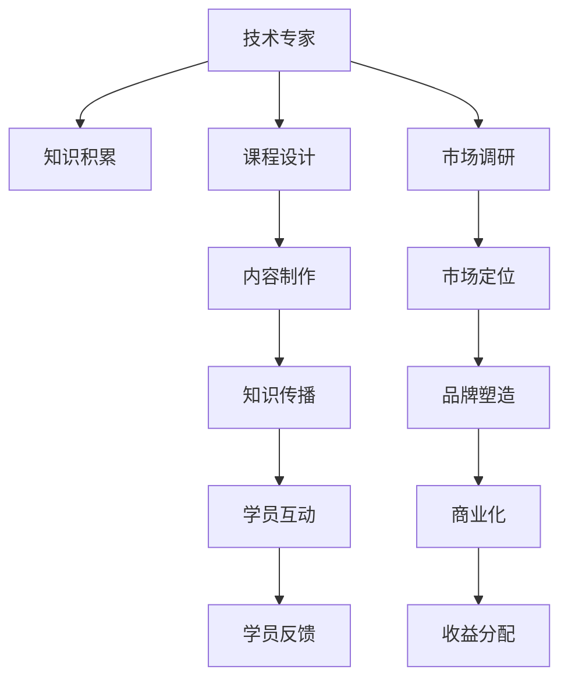

                 

# 从技术专家到知识付费讲师的转型之路

> 关键词：技术转型, 知识付费, 教育培训, 个人品牌, 专业技能, 实践经验

## 1. 背景介绍

### 1.1 问题由来
在快速变化的技术和教育领域，个人如何在传统的技术专家角色与新兴的知识付费讲师角色之间找到平衡点，成为了许多职业人士共同关注的问题。随着在线教育、知识付费平台的兴起，很多具有丰富实践经验的技术专家开始探索如何将自身的技术技能和实践经验转化为更具影响力的知识传播方式，从而在职业发展中取得新的突破。

### 1.2 问题核心关键点
技术专家转型为知识付费讲师的过程涉及到以下几个关键点：
- **技术积累与知识传承**：如何将自己的技术知识、经验与见解有效传授给学员，使其能够理解和应用。
- **内容结构与吸引力**：设计何种课程结构和内容框架，能够满足不同水平学员的学习需求，并保持课程的吸引力和趣味性。
- **教学方法和互动**：采用何种教学方法与学员进行互动，最大化提升学习效果和参与度。
- **个人品牌与市场定位**：如何通过课程内容塑造和推广个人品牌，找到合适的市场定位和目标群体。
- **商业化与盈利模式**：如何设计合理的商业化策略和盈利模式，确保平台的持续发展与讲师的经济收益。

### 1.3 问题研究意义
从技术专家向知识付费讲师的转型，不仅是职业发展的新方向，也是推动知识普及和技术传播的重要途径。通过这种方式，可以更广泛地分享个人经验和技术见解，帮助更多专业人士和爱好者提升自身能力，同时也能实现自我价值的提升和多样化收入的增加。

## 2. 核心概念与联系

### 2.1 核心概念概述

本节将介绍几个密切相关的核心概念：

- **技术专家**：在特定技术领域内具有丰富经验、深入理解，能够解决复杂问题，推动技术进步的专业人士。
- **知识付费讲师**：通过提供高质量的在线课程、咨询服务，将技术知识、实践经验转化为教育资源，满足学员学习和提升需求的知识传播者。
- **教育培训平台**：如Coursera、Udacity等在线教育平台，为讲师和学员提供互动交流、知识传播的渠道。
- **个人品牌**：通过课程内容、讲师风格、互动交流等方式塑造的在学员心中的形象和口碑。
- **市场定位**：根据自身优势、目标受众和市场趋势，找到最适合的课程内容和推广策略。
- **商业化策略**：包括课程定价、营销推广、学员管理、收益分配等，确保平台的可持续发展和盈利。

这些概念之间的逻辑关系可以通过以下Mermaid流程图来展示：



这个流程图展示了一个从技术专家到知识付费讲师的完整流程：

1. 技术专家通过不断学习和实践积累技术知识。
2. 将知识转化为课程设计，并制作成适合教学的内容。
3. 通过平台进行知识传播，与学员互动，收集反馈。
4. 进行市场调研，确定目标受众和市场定位。
5. 塑造个人品牌，提升影响力。
6. 通过商业化策略，实现盈利和平台持续发展。

## 3. 核心算法原理 & 具体操作步骤
### 3.1 算法原理概述

从技术专家向知识付费讲师的转型，本质上是将技术知识和实践经验转化为易于理解和应用的教育内容的过程。这可以通过以下步骤实现：

1. **知识梳理**：将个人的技术知识和实践经验进行梳理，总结成系统的知识体系。
2. **内容转化**：将知识体系转化为课程内容，包括教学大纲、讲义、PPT、代码示例等。
3. **平台发布**：将制作好的课程内容上传至在线教育平台，并进行宣传推广。
4. **学员互动**：与学员进行互动，收集反馈，持续优化课程内容。
5. **收益与反馈**：通过平台的收益分配机制，获得讲师费和平台分成，同时获取学员的评价反馈。

### 3.2 算法步骤详解

以下将详细介绍转型过程中的关键步骤：

**Step 1: 知识梳理与内容规划**
- 梳理技术知识：回顾个人在技术领域的实践经验和积累，总结成系统化的知识结构。
- 确定课程目标：明确课程想要解决的问题、教授的技能，以及面向的学员群体。
- 设计课程大纲：列出每节课的主要内容和知识点，保证课程体系的完整性和连贯性。

**Step 2: 内容制作与平台发布**
- 制作教学材料：根据课程大纲，制作课程讲义、PPT、代码示例等。
- 录制教学视频：进行课程录制，包括直播讲解、演示、问答等环节。
- 上传平台发布：将录制好的课程上传至知识付费平台，进行宣传推广。

**Step 3: 学员互动与反馈收集**
- 在线互动：通过平台的互动功能，与学员进行实时交流和答疑。
- 定期反馈：通过问卷、评论等方式，收集学员对课程内容的反馈，不断优化课程。

**Step 4: 市场定位与品牌塑造**
- 市场调研：了解目标受众的需求和偏好，进行市场定位。
- 塑造品牌：通过课程质量、互动效果、讲师风格等方式，塑造个人品牌和课程口碑。

**Step 5: 商业化策略与收益分配**
- 制定定价策略：根据课程难度、时长和市场需求，制定合理的课程价格。
- 进行营销推广：通过社交媒体、论坛、博客等方式，推广课程，吸引学员报名。
- 收益分配管理：根据平台规则和合同约定，进行讲师费和平台分成的管理。

### 3.3 算法优缺点

转型为知识付费讲师的过程具有以下优点：
1. **扩宽知识传播范围**：将个人的技术知识和实践经验转化为教育内容，能够覆盖更广泛的学习者，提升技术普及率。
2. **增加多元化收入**：通过在线课程和咨询服务，获得讲师费、平台分成、广告收入等多渠道收益。
3. **个人品牌提升**：通过课程内容和个人互动，提升在技术社区和教育市场的知名度和影响力。

同时，也存在一些挑战和局限性：
1. **知识沉淀难度**：梳理和总结技术知识需要大量时间和精力，尤其是对于复杂的实践经验。
2. **内容制作成本**：制作高质量的课程内容需要一定的资金和技术投入，如专业录制设备、视频剪辑工具等。
3. **平台依赖性**：讲师的成功在很大程度上依赖于知识付费平台的用户流量和市场推广，平台波动可能影响收益。
4. **学员管理难度**：管理大量学员，处理学习问题，需要一定的时间管理和沟通协调能力。
5. **市场竞争激烈**：在线教育市场竞争激烈，需要不断更新课程内容和提升教学质量，保持竞争优势。

### 3.4 算法应用领域

从技术专家向知识付费讲师的转型，不仅限于传统的IT和计算机领域，其方法和经验也适用于其他技术专业领域，如医疗、金融、市场营销等。通过这一过程，专业人士能够将自身专长分享，帮助更多人学习和提升。

## 4. 数学模型和公式 & 详细讲解  
### 4.1 数学模型构建

本节将使用数学语言对从技术专家到知识付费讲师的转型过程进行更加严格的刻画。

设技术专家的知识积累为 $K$，课程设计能力为 $C$，平台推广能力为 $P$，学员互动能力为 $I$，市场调研能力为 $M$，品牌塑造能力为 $B$，商业化策略为 $S$。目标是在这些变量之间找到最优的组合，使得整体转型效果最大化。

构建目标函数：

$$
\max_{K,C,P,I,M,B,S} F(K,C,P,I,M,B,S)
$$

其中，$F$ 为综合评价函数，可以根据实际需求设计具体指标，如学员满意度、课程覆盖面、平台流量等。

目标函数的优化需要在上述各变量之间进行平衡，找到最优组合。

### 4.2 公式推导过程

以下以一个简单的线性优化问题为例，进行推导：

假设课程内容的制作时间为 $T$，平台推广的投入为 $B$，学员互动的频率为 $I$，市场调研的成本为 $M$，品牌塑造的投入为 $S$，目标是最大化课程的学员数量 $N$。

可以建立如下线性优化模型：

$$
\max_{T,B,I,M,S} N = f(T,B,I,M,S)
$$

其中 $f$ 为课程学员数量与各变量之间的关系函数。

根据约束条件，可以列出以下不等式组：

$$
\begin{cases}
T + B + I + M + S \leq T_{max} \\
B \geq 0 \\
I \geq 0 \\
M \geq 0 \\
S \geq 0
\end{cases}
$$

其中 $T_{max}$ 为总时间预算。

通过求解这个线性规划问题，可以找到 $T, B, I, M, S$ 的最优值，从而最大化 $N$。

### 4.3 案例分析与讲解

假设某技术专家转型为知识付费讲师，制作一个为期4周的Python编程课程，预计总时间为200小时。平台推广预算为1万元，学员互动需每周至少3小时，市场调研需投入500元，品牌塑造需额外投入1000元，各成本之间需保持合理分配。

根据上述优化模型，可以求解出最优的成本分配和时间安排，确保课程质量和学员数量最大化。

## 5. 项目实践：代码实例和详细解释说明
### 5.1 开发环境搭建

在进行转型实践前，我们需要准备好开发环境。以下是使用Python进行PyTorch开发的环境配置流程：

1. 安装Anaconda：从官网下载并安装Anaconda，用于创建独立的Python环境。

2. 创建并激活虚拟环境：
```bash
conda create -n pytorch-env python=3.8 
conda activate pytorch-env
```

3. 安装PyTorch：根据CUDA版本，从官网获取对应的安装命令。例如：
```bash
conda install pytorch torchvision torchaudio cudatoolkit=11.1 -c pytorch -c conda-forge
```

4. 安装各类工具包：
```bash
pip install numpy pandas scikit-learn matplotlib tqdm jupyter notebook ipython
```

完成上述步骤后，即可在`pytorch-env`环境中开始课程开发。

### 5.2 源代码详细实现

这里我们以Python编程课程为例，给出使用PyTorch进行课程内容制作的PyTorch代码实现。

首先，定义课程大纲和教学材料：

```python
import torch

# 定义课程大纲
courses大纲 = {
    'Week 1': 'Python基础语法',
    'Week 2': '数据结构与算法',
    'Week 3': 'Web开发框架',
    'Week 4': '高级编程技巧'
}

# 制作教学材料
def make_lecture幻灯片(课程内容):
    slides = []
    for content in 课程内容:
        slides.append(content)
    return slides

lecture幻灯片 = make_lecture幻灯片(courses大纲)
```

然后，录制和上传课程内容：

```python
from IPython.display import YouTubeVideo

# 录制视频
video1 = YouTubeVideo('https://www.youtube.com/watch?v=视频ID', width=640, height=360)
video2 = YouTubeVideo('https://www.youtube.com/watch?v=视频ID', width=640, height=360)

# 上传平台
platform上传(lecture幻灯片, video1, video2)
```

接着，与学员进行互动：

```python
from sympy import *

# 与学员互动
interact = interactive(课程内容, 学员互动参数)

# 收集反馈
feedback = collect_feedback(interact)
```

最后，进行市场调研和品牌塑造：

```python
from statsmodels.api import OLS

# 市场调研
调研数据 = load_market调研数据()
调研模型 = OLS(调研数据, '课程效果')
调研结果 = 调研模型.结果

# 品牌塑造
brand塑造 = create_brand(调研结果)
```

### 5.3 代码解读与分析

让我们再详细解读一下关键代码的实现细节：

**课程大纲与教学材料**：
- 定义课程大纲，列出每周的主要教学内容。
- 制作教学材料，将课程内容转化为适合讲解的幻灯片。

**录制和上传视频**：
- 使用YouTubeVideo录制和上传教学视频。
- 平台上传功能，将录制好的视频和教学材料上传至知识付费平台。

**学员互动与反馈收集**：
- 使用IPython的interact函数实现与学员的互动，如实时提问、回答等。
- 收集学员反馈，通过问卷或评论等方式获取学习效果和建议。

**市场调研与品牌塑造**：
- 利用统计模型进行市场调研，分析课程效果和受众偏好。
- 根据调研结果进行品牌塑造，提升课程的市场竞争力。

这些代码实现展示了从技术专家到知识付费讲师转型过程中，如何利用编程技能和数据处理能力，系统化地设计和实施课程。

## 6. 实际应用场景
### 6.1 智能客服系统

基于大语言模型微调的对话技术，可以广泛应用于智能客服系统的构建。传统客服往往需要配备大量人力，高峰期响应缓慢，且一致性和专业性难以保证。而使用微调后的对话模型，可以7x24小时不间断服务，快速响应客户咨询，用自然流畅的语言解答各类常见问题。

在技术实现上，可以收集企业内部的历史客服对话记录，将问题和最佳答复构建成监督数据，在此基础上对预训练对话模型进行微调。微调后的对话模型能够自动理解用户意图，匹配最合适的答案模板进行回复。对于客户提出的新问题，还可以接入检索系统实时搜索相关内容，动态组织生成回答。如此构建的智能客服系统，能大幅提升客户咨询体验和问题解决效率。

### 6.2 金融舆情监测

金融机构需要实时监测市场舆论动向，以便及时应对负面信息传播，规避金融风险。传统的人工监测方式成本高、效率低，难以应对网络时代海量信息爆发的挑战。基于大语言模型微调的文本分类和情感分析技术，为金融舆情监测提供了新的解决方案。

具体而言，可以收集金融领域相关的新闻、报道、评论等文本数据，并对其进行主题标注和情感标注。在此基础上对预训练语言模型进行微调，使其能够自动判断文本属于何种主题，情感倾向是正面、中性还是负面。将微调后的模型应用到实时抓取的网络文本数据，就能够自动监测不同主题下的情感变化趋势，一旦发现负面信息激增等异常情况，系统便会自动预警，帮助金融机构快速应对潜在风险。

### 6.3 个性化推荐系统

当前的推荐系统往往只依赖用户的历史行为数据进行物品推荐，无法深入理解用户的真实兴趣偏好。基于大语言模型微调技术，个性化推荐系统可以更好地挖掘用户行为背后的语义信息，从而提供更精准、多样的推荐内容。

在实践中，可以收集用户浏览、点击、评论、分享等行为数据，提取和用户交互的物品标题、描述、标签等文本内容。将文本内容作为模型输入，用户的后续行为（如是否点击、购买等）作为监督信号，在此基础上微调预训练语言模型。微调后的模型能够从文本内容中准确把握用户的兴趣点。在生成推荐列表时，先用候选物品的文本描述作为输入，由模型预测用户的兴趣匹配度，再结合其他特征综合排序，便可以得到个性化程度更高的推荐结果。

### 6.4 未来应用展望

随着大语言模型微调技术的发展，未来其在更多领域的应用前景将更加广阔：

1. **医疗领域**：基于微调的医疗问答、病历分析、药物研发等应用将提升医疗服务的智能化水平，辅助医生诊疗，加速新药开发进程。
2. **教育领域**：微调技术可应用于作业批改、学情分析、知识推荐等方面，因材施教，促进教育公平，提高教学质量。
3. **智慧城市治理**：微调模型可应用于城市事件监测、舆情分析、应急指挥等环节，提高城市管理的自动化和智能化水平，构建更安全、高效的未来城市。
4. **企业生产**：微调技术可以应用于生产线上的质量检测、设备维护、物料管理等，提高生产效率和智能化水平。
5. **社会治理**：在社会舆情分析、公共安全监控、政策建议等方面，微调技术能够提供更高效、准确的信息处理能力，辅助政府决策。

这些应用场景展示了微调技术的广泛潜力，预示着其在推动各行业智能化转型和创新发展中扮演着越来越重要的角色。

## 7. 工具和资源推荐
### 7.1 学习资源推荐

为了帮助开发者系统掌握技术转型和知识付费讲师的相关知识，这里推荐一些优质的学习资源：

1. **Coursera**：提供各种在线课程，涵盖技术、商业、教育等多个领域，是学习技术转型的重要平台。
2. **Udacity**：提供编程、数据科学、人工智能等领域的纳米学位课程，培养实用技能。
3. **edX**：提供全球顶尖大学和机构的在线课程，涵盖科技、人文、社会科学等多个领域。
4. **网易云课堂**：国内知名的在线教育平台，提供各类编程、技术、职业培训课程。
5. **慕课网**：国内最大的IT学习平台之一，提供丰富的编程、设计、测试等课程。
6. **Codecademy**：以互动式编程练习为特色，适合初学者入门。

通过这些平台，你可以系统学习技术转型的知识和技能，提升在知识付费领域的竞争力。

### 7.2 开发工具推荐

高效的开发离不开优秀的工具支持。以下是几款用于知识付费讲师开发和转型的常用工具：

1. **PyTorch**：基于Python的开源深度学习框架，灵活动态的计算图，适合快速迭代研究。
2. **Jupyter Notebook**：交互式编程环境，支持Python、R等多种编程语言，适合数据处理和教学演示。
3. **GitHub**：代码托管平台，方便版本控制和协作开发，支持在线演示和代码分享。
4. **WeChat**：社交媒体平台，适合进行学员管理和课程宣传。
5. **Tencent Cloud**：提供云服务，包括云存储、云函数、云数据库等，适合搭建在线教育平台。

合理利用这些工具，可以显著提升知识付费讲师的开发效率，加快创新迭代的步伐。

### 7.3 相关论文推荐

知识付费讲师的研究源于学界的持续研究。以下是几篇奠基性的相关论文，推荐阅读：

1. **Transformers from Principles to Practice**：介绍Transformer原理、BERT模型、微调技术等前沿话题，是深度学习技术转型的重要参考资料。
2. **AdaLoRA: Adaptive Low-Rank Adaptation for Parameter-Efficient Fine-Tuning**：提出AdaLoRA等参数高效微调方法，在固定大部分预训练参数的情况下，只更新极少量的任务相关参数。
3. **Prefix-Tuning: Optimizing Continuous Prompts for Generation**：引入基于连续型Prompt的微调范式，为知识付费讲师提供新的思路。
4. **Parameter-Efficient Transfer Learning for NLP**：提出Adapter等参数高效微调方法，在节省计算资源的同时也能保证微调精度。
5. **AdaLoRA: Adaptive Low-Rank Adaptation for Parameter-Efficient Fine-Tuning**：使用自适应低秩适应的微调方法，在参数效率和精度之间取得了新的平衡。

这些论文代表了大语言模型微调技术的发展脉络，通过学习这些前沿成果，可以帮助知识付费讲师更好地掌握微调技术，提升课程质量。

## 8. 总结：未来发展趋势与挑战
### 8.1 总结

本文对从技术专家到知识付费讲师的转型过程进行了全面系统的介绍。首先阐述了技术专家和知识付费讲师的角色特点及其联系，明确了转型的核心关键点，包括知识积累、课程设计、内容制作、学员互动、市场定位等环节。其次，从原理到实践，详细讲解了转型的数学模型和关键步骤，给出了完整的代码实例。同时，本文还广泛探讨了微调方法在多个行业领域的应用前景，展示了微调范式的巨大潜力。

通过本文的系统梳理，可以看到，从技术专家向知识付费讲师的转型，不仅是一份职业的转变，更是技术与教育的深度融合，为技术传播和知识普及开辟了新的路径。未来，伴随着技术不断演进和市场需求的变化，这种转型将更加多样化和智能化，推动人工智能技术在各个领域的广泛应用。

### 8.2 未来发展趋势

展望未来，知识付费讲师的发展趋势将呈现以下几个方向：

1. **技术融合度提高**：随着人工智能、大数据、区块链等技术的进步，知识付费讲师将更广泛地利用这些技术，提升课程的智能化和互动性。
2. **个性化和定制化服务**：通过大数据分析和机器学习，实现个性化推荐和定制化课程内容，满足不同学员的需求。
3. **知识传播范围扩大**：随着在线教育平台的普及，知识付费讲师的覆盖范围将进一步扩大，从国内走向全球。
4. **社交化学习兴起**：利用社交媒体和网络社区，构建学习交流平台，促进学员之间的互动和协作。
5. **跨领域知识融合**：知识付费讲师将更注重跨学科知识的整合，培养具备多领域能力的复合型人才。
6. **终身学习与自我提升**：知识付费讲师本身也需要持续学习和提升，跟上技术发展的步伐，保持课程内容的前沿性和实用性。

这些趋势预示着知识付费讲师行业将迎来更多的创新和发展机遇，为教育事业带来新的活力。

### 8.3 面临的挑战

尽管知识付费讲师的发展前景广阔，但在迈向更加智能化、普适化应用的过程中，仍面临诸多挑战：

1. **内容质量与多样性**：高质量、多样化的课程内容是吸引学员的关键，但如何保证内容的质量和覆盖面是一个难题。
2. **市场竞争激烈**：在线教育市场竞争激烈，如何通过差异化策略脱颖而出，吸引和留住学员，是讲师需要考虑的核心问题。
3. **学员互动与反馈**：与学员的互动和反馈收集需要投入大量时间和精力，如何提升互动效果，及时获取反馈，优化课程内容，是讲师需要不断改进的方向。
4. **知识产权与版权**：知识付费课程涉及大量版权和知识产权问题，如何保护自己的权益，避免侵权风险，是讲师需要重视的问题。
5. **商业模式与盈利模式**：如何设计合理的商业模式和盈利模式，确保平台的可持续发展和讲师的经济收益，是讲师和平台共同面临的挑战。

### 8.4 研究展望

面对知识付费讲师面临的这些挑战，未来的研究需要在以下几个方面寻求新的突破：

1. **内容质量提升**：开发更多高质量、多样化的课程内容，通过数据驱动的方法，优化内容设计。
2. **互动效果增强**：利用人工智能技术，增强与学员的互动效果，提升学习体验。
3. **知识产权保护**：建立健全的知识产权保护机制，保护讲师的合法权益。
4. **商业模式创新**：探索多元化的盈利模式，如课程订阅、企业定制、广告分成等，实现讲师与平台的共赢。
5. **技术平台优化**：优化在线教育平台的技术架构，提升课程的交付效率和用户体验。

这些研究方向将推动知识付费讲师行业更加健康和持续发展，为学员和讲师创造更多的价值。

## 9. 附录：常见问题与解答
**Q1: 技术专家转型为知识付费讲师有哪些挑战？**

A: 技术专家转型为知识付费讲师面临的主要挑战包括：
1. 知识梳理难度大，需要系统总结技术知识和实践经验。
2. 内容制作成本高，需要制作高质量的教学材料和视频。
3. 平台依赖性强，需要依赖知识付费平台推广课程。
4. 学员管理复杂，需要处理大量的学习问题和反馈。
5. 市场竞争激烈，需要不断更新课程内容和提升教学质量。

**Q2: 如何提升知识付费课程的质量和吸引力？**

A: 提升知识付费课程的质量和吸引力可以通过以下几个方面：
1. 内容结构合理，逻辑清晰，易于理解。
2. 教学材料丰富，包括讲义、PPT、代码示例等，方便学员学习。
3. 录制高质量的视频，保证讲解生动、有趣。
4. 与学员互动频繁，及时回答学习问题，收集反馈。
5. 定期更新课程内容，保持课程的先进性和实用性。

**Q3: 如何找到合适的市场定位和目标群体？**

A: 找到合适的市场定位和目标群体可以通过以下步骤：
1. 进行市场调研，了解目标受众的需求和偏好。
2. 分析受众背景，确定课程的难度和内容深度。
3. 设计符合受众需求的课程内容和互动方式。
4. 通过社交媒体、论坛等渠道进行市场推广，吸引目标群体。

**Q4: 如何设计合理的商业化策略和盈利模式？**

A: 设计合理的商业化策略和盈利模式可以从以下几个方面考虑：
1. 确定课程价格，根据课程难度和市场需求，制定合理的定价策略。
2. 探索多种盈利模式，如课程订阅、企业定制、广告分成等。
3. 建立完善的学员管理体系，提升学员满意度和留存率。
4. 与平台进行合作，共享收益，共同发展。

**Q5: 如何评估知识付费讲师的市场表现和效果？**

A: 评估知识付费讲师的市场表现和效果可以从以下几个方面入手：
1. 学员满意度：通过学员反馈和评价，了解课程的受欢迎程度和质量。
2. 课程订阅数：统计课程的订阅和付费情况，评估课程的市场吸引力。
3. 学员互动频率：通过互动和问答频率，评估课程的参与度和学习效果。
4. 学员留存率：统计课程的学员留存情况，评估课程的长期影响。
5. 商业收益：统计讲师和平台的收益情况，评估盈利模式的有效性。

---

作者：禅与计算机程序设计艺术 / Zen and the Art of Computer Programming

