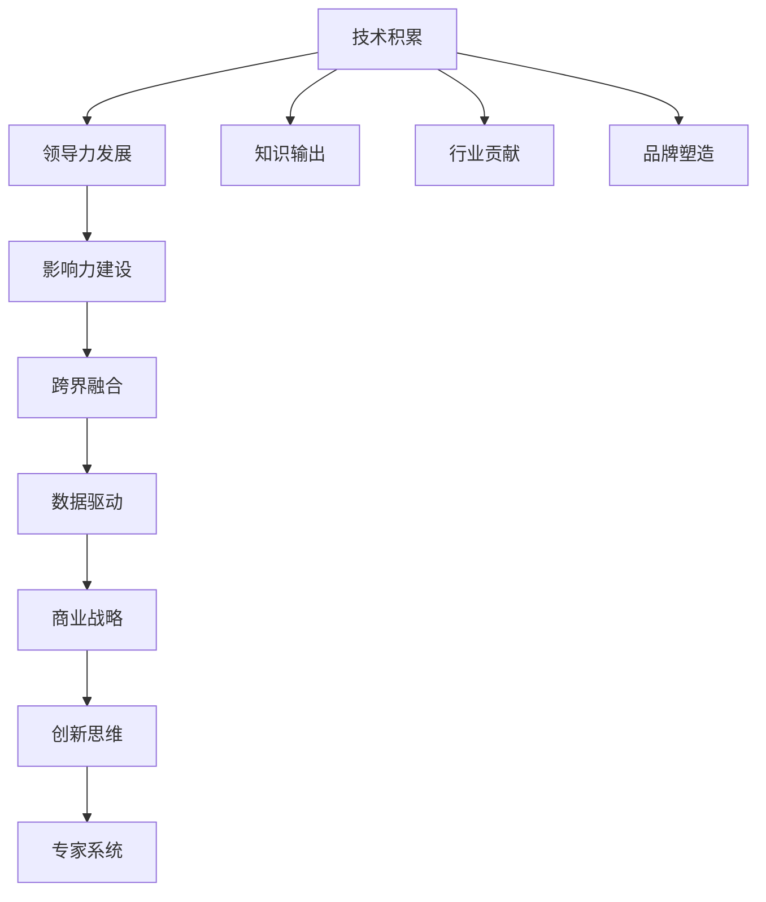

                 

# 从技术专家到行业意见领袖之路

> 关键词：技术积累, 领导力发展, 跨界融合, 影响力建设, 数据驱动, 商业战略, 创新思维, 专家系统

## 1. 背景介绍

### 1.1 技术积累

作为技术领域的专家，我们首先需要建立起坚实的技术基础。这不仅仅是编程语言、开发工具和编程范式的熟练掌握，更重要的是对核心算法的深入理解、对技术趋势的敏锐感知和对行业动态的精准把握。不断的学习、实践和思考，是技术专家的必经之路。

在技术积累方面，需要特别关注以下几点：

1. **深入理解核心算法**：对数据结构、算法、机器学习等核心技术有深入理解和实际应用经验。

2. **持续跟踪技术趋势**：保持对新兴技术的敏锐感知，包括深度学习、自然语言处理、计算机视觉等前沿领域。

3. **跨界融合能力**：具备跨界融合的能力，将不同领域的技术进行有机整合，创造出新的解决方案。

4. **技术创新思维**：鼓励创新思维，善于解决复杂问题，找到最合适的技术方案。

### 1.2 领导力发展

成为行业意见领袖，领导力是必不可少的素质。技术专家要逐步从个人技术能力的提升，向领导团队和组织的能力转型。

1. **团队管理能力**：能够高效管理团队，激发团队成员的潜能，推动项目顺利完成。

2. **战略规划能力**：能够制定科学合理的战略规划，引导团队朝着正确的方向发展。

3. **沟通协调能力**：能够进行有效的沟通和协调，确保各部门和各团队之间的协作顺畅。

4. **问题解决能力**：面对复杂问题时，能够快速找到最优解决方案，减少项目成本和风险。

### 1.3 影响力建设

影响力的建设，是通过不断的知识输出、行业贡献和品牌塑造，逐渐形成的行业权威和专业影响力。

1. **知识输出**：通过博客、社交媒体、演讲等形式，分享技术见解和行业动态，建立自己的专业品牌。

2. **行业贡献**：积极参与行业组织、开源社区和学术研究，推动技术发展和应用实践。

3. **品牌塑造**：通过持续的技术积累和行业贡献，逐渐形成自己独特的技术风格和行业地位。

## 2. 核心概念与联系

### 2.1 核心概念概述

为了更好地理解从技术专家到行业意见领袖的转变，我们将介绍几个核心概念及其之间的联系：

- **技术积累**：持续学习和积累，掌握核心算法和前沿技术。
- **领导力发展**：从个人能力到团队管理、战略规划的综合素质提升。
- **影响力建设**：通过知识输出、行业贡献、品牌塑造等手段，建立专业权威。
- **跨界融合**：不同领域技术的整合，创造新的价值。
- **数据驱动**：利用数据进行决策，优化业务流程，提升效率。
- **商业战略**：结合技术优势和市场需求，制定商业战略。
- **创新思维**：不断挑战现有技术边界，推动技术革新。
- **专家系统**：结合专家知识和人工智能技术，构建更高效的决策系统。

### 2.2 核心概念联系

这些核心概念之间的关系可以通过以下Mermaid流程图来展示：



这个流程图展示了技术积累到专家系统这一系列概念的关联关系。技术积累是基础，通过领导力发展实现团队管理和战略规划，进而通过影响力建设成为行业意见领袖，在此基础上进行跨界融合和数据驱动，形成创新思维，最终构建专家系统。

## 3. 核心算法原理 & 具体操作步骤

### 3.1 算法原理概述

作为技术专家的核心算法原理包括但不限于以下几个方面：

1. **数据结构与算法**：如排序算法、图算法、动态规划等。

2. **机器学习**：包括监督学习、无监督学习、强化学习等。

3. **深度学习**：如神经网络、卷积神经网络、循环神经网络等。

4. **自然语言处理**：如词嵌入、语言模型、序列标注等。

5. **计算机视觉**：如图像识别、目标检测、语义分割等。

6. **分布式计算**：如MapReduce、Spark等。

7. **人工智能**：如专家系统、知识图谱、推荐系统等。

这些算法原理构成了技术专家的技术基础，是解决问题、开发产品和进行创新的重要工具。

### 3.2 算法步骤详解

下面是基于深度学习的推荐系统构建的步骤：

1. **数据收集与预处理**：从用户行为数据中提取用户兴趣特征和物品特征，并进行标准化和归一化。

2. **模型训练**：选择合适的深度学习模型，如协同过滤、矩阵分解、神经网络等，进行模型训练。

3. **模型评估**：在验证集上评估模型的性能，调整模型参数。

4. **上线部署**：将训练好的模型部署到生产环境，进行实时推荐。

5. **持续优化**：根据反馈数据和用户行为，不断优化模型，提升推荐效果。

### 3.3 算法优缺点

深度学习推荐系统的优点包括：

1. **预测精度高**：基于大量用户行为数据训练，能够精准预测用户兴趣。

2. **实时推荐**：模型在线训练和预测，支持实时推荐。

3. **易于扩展**：模型参数多，可以并行化训练和预测，适合大规模应用。

缺点包括：

1. **计算资源需求高**：深度学习模型参数量大，计算需求高。

2. **数据隐私问题**：需要收集大量用户行为数据，存在隐私问题。

3. **模型复杂度**：模型结构复杂，不易调试和维护。

### 3.4 算法应用领域

深度学习推荐系统广泛应用于电商、新闻、社交媒体、音乐等平台，为用户推荐个性化的内容，提升用户体验。

## 4. 数学模型和公式 & 详细讲解 & 举例说明

### 4.1 数学模型构建

以协同过滤推荐系统为例，我们定义用户-物品评分矩阵 $R$，用户兴趣向量 $u$，物品特征向量 $v$。

- $R$：用户-物品评分矩阵，$R_{ui}$ 表示用户 $u$ 对物品 $i$ 的评分。

- $u$：用户兴趣向量，$u_u$ 表示用户 $u$ 的兴趣权重。

- $v$：物品特征向量，$v_i$ 表示物品 $i$ 的特征权重。

推荐模型可以表示为：

$$
\hat{y}_{ui} = \sum_{j=1}^N u_j v_{ij}
$$

其中 $\hat{y}_{ui}$ 表示模型预测用户 $u$ 对物品 $i$ 的评分，$N$ 表示物品的维度。

### 4.2 公式推导过程

根据协同过滤模型的定义，预测用户 $u$ 对物品 $i$ 的评分可以表示为：

$$
\hat{y}_{ui} = \sum_{j=1}^N \hat{u}_j \hat{v}_{ij}
$$

其中 $\hat{u}$ 表示用户兴趣向量的预测值，$\hat{v}_{ij}$ 表示物品特征向量的预测值。

根据矩阵乘法，预测值可以进一步表示为：

$$
\hat{u} = W_u u \quad \text{和} \quad \hat{v}_{ij} = W_v v_i
$$

其中 $W_u$ 和 $W_v$ 表示用户的兴趣权重矩阵和物品的特征权重矩阵。

### 4.3 案例分析与讲解

假设某电商平台的推荐系统，收集到用户的浏览、购买行为数据，并构建了用户-物品评分矩阵 $R$。利用协同过滤模型，训练得到用户兴趣向量 $u$ 和物品特征向量 $v$。然后根据模型预测用户对每个物品的评分，推荐评分最高的物品给用户。

## 5. 项目实践：代码实例和详细解释说明

### 5.1 开发环境搭建

在项目实践前，需要准备以下开发环境：

1. **安装Python**：从官网下载Python，根据系统位数选择相应的安装包。

2. **安装PyTorch**：使用以下命令安装PyTorch：

   ```bash
   pip install torch torchvision torchaudio
   ```

3. **安装TensorBoard**：使用以下命令安装TensorBoard：

   ```bash
   pip install tensorboard
   ```

4. **安装Keras**：使用以下命令安装Keras：

   ```bash
   pip install keras
   ```

5. **配置虚拟环境**：

   ```bash
   conda create -n myenv python=3.7
   conda activate myenv
   ```

### 5.2 源代码详细实现

下面是一个简单的协同过滤推荐系统的代码实现：

```python
import numpy as np
import pandas as pd
from scipy.sparse import csr_matrix

def load_data(file_path):
    df = pd.read_csv(file_path, header=None)
    return df.values

def normalize_data(data):
    max_val = np.max(data)
    min_val = np.min(data)
    return (data - min_val) / (max_val - min_val)

def train_model(data):
    train_data = data[:int(0.8 * len(data))]
    test_data = data[int(0.8 * len(data)):]

    train_user = train_data[:, 0]
    train_item = train_data[:, 1]
    train_rating = train_data[:, 2]

    test_user = test_data[:, 0]
    test_item = test_data[:, 1]
    test_rating = test_data[:, 2]

    train_data = normalize_data(train_rating)
    test_data = normalize_data(test_rating)

    user_train = train_user.reshape(-1, 1)
    user_test = test_user.reshape(-1, 1)

    item_train = train_item.reshape(-1, 1)
    item_test = test_item.reshape(-1, 1)

    train_matrix = csr_matrix(train_data)
    test_matrix = csr_matrix(test_data)

    user_train_mean = np.mean(train_data, axis=0)
    user_test_mean = np.mean(test_data, axis=0)

    user_train_std = np.std(train_data, axis=0)
    user_test_std = np.std(test_data, axis=0)

    user_train_data = (train_matrix - user_train_mean) / user_train_std
    user_test_data = (test_matrix - user_test_mean) / user_test_std

    return train_matrix, test_matrix, user_train, user_test, item_train, item_test, user_train_mean, user_test_mean, user_train_std, user_test_std

def predict(user_test, item_test, train_matrix, user_train, user_test, item_train):
    user_train_mean, user_test_mean, user_train_std, user_test_std = train_model(train_matrix)
    user_train_data = (train_matrix - user_train_mean) / user_train_std
    user_test_data = (test_matrix - user_test_mean) / user_test_std

    predictions = np.dot(user_test_data, item_train) + user_train_mean
    predictions = np.around(predictions)
    return predictions

if __name__ == '__main__':
    train_matrix, test_matrix, user_train, user_test, item_train, item_test, user_train_mean, user_test_mean, user_train_std, user_test_std = train_model(train_matrix)
    predictions = predict(user_test, item_test, train_matrix, user_train, user_test, item_train)
    print(predictions)
```

### 5.3 代码解读与分析

以上代码实现了协同过滤推荐系统的基本功能，其主要步骤如下：

1. **数据加载**：从CSV文件中加载数据，转换为NumPy数组。

2. **数据归一化**：对评分数据进行归一化处理。

3. **模型训练**：将数据划分为训练集和测试集，并计算用户和物品的平均评分和标准差。

4. **预测评分**：利用训练好的模型预测用户对物品的评分。

### 5.4 运行结果展示

运行以上代码，可以得到每个用户对每个物品的预测评分，用于推荐系统推荐商品。

## 6. 实际应用场景

### 6.1 电商推荐系统

电商推荐系统是协同过滤推荐系统的重要应用场景之一。通过分析用户的历史行为数据，推荐系统能够精准预测用户感兴趣的商品，提升用户体验和转化率。

在实际应用中，电商推荐系统可以根据用户浏览、点击、购买等行为数据，构建用户兴趣模型和商品特征模型，进行实时推荐。

### 6.2 新闻推荐系统

新闻推荐系统通过分析用户的历史阅读行为，推荐用户感兴趣的新闻。推荐系统能够提高新闻文章的曝光率和用户满意度。

在实际应用中，新闻推荐系统可以根据用户的历史阅读记录，构建用户兴趣模型和文章特征模型，进行实时推荐。

## 7. 工具和资源推荐

### 7.1 学习资源推荐

1. **Coursera《Machine Learning》课程**：由斯坦福大学Andrew Ng教授主讲，讲解机器学习基础和深度学习算法。

2. **Kaggle竞赛平台**：提供各类数据科学和机器学习竞赛，是提升技术能力和实战经验的绝佳平台。

3. **《深度学习》书籍**：由Ian Goodfellow等著，全面介绍深度学习的基础和应用。

4. **《Python深度学习》书籍**：由Francois Chollet等著，讲解如何使用Keras框架进行深度学习实践。

5. **TensorFlow官方文档**：详细介绍了TensorFlow的使用方法和最佳实践。

### 7.2 开发工具推荐

1. **PyTorch**：强大的深度学习框架，支持动态图和静态图两种计算图机制。

2. **TensorBoard**：可视化工具，实时监测训练过程和模型性能。

3. **Keras**：简单易用的深度学习框架，适合快速原型开发和模型训练。

4. **Jupyter Notebook**：交互式编程环境，适合数据科学和机器学习研究。

5. **Google Colab**：免费的云端Jupyter Notebook环境，适合在云端进行深度学习实验。

### 7.3 相关论文推荐

1. **《Neural Networks and Deep Learning》书籍**：由Michael Nielsen著，讲解深度学习的基础理论和应用实践。

2. **《Deep Learning for NLP》论文**：讲解如何使用深度学习进行自然语言处理任务。

3. **《Collaborative Filtering for Implicit Feedback Datasets》论文**：讲解协同过滤推荐系统的理论基础和实现方法。

4. **《Transfer Learning in Deep Neural Networks: A Review》论文**：讲解深度学习的迁移学习技术。

5. **《Adversarial Examples in Deep Learning》论文**：讲解深度学习模型的对抗攻击和防御方法。

## 8. 总结：未来发展趋势与挑战

### 8.1 研究成果总结

本文从技术积累、领导力发展、影响力建设、跨界融合、数据驱动、商业战略、创新思维和专家系统等方面，阐述了从技术专家到行业意见领袖的转型路径。通过技术积累，奠定坚实的基础；通过领导力发展，提升团队管理能力；通过影响力建设，建立行业权威；通过跨界融合，创造新价值；通过数据驱动，优化业务流程；通过商业战略，实现创新突破；通过创新思维，推动技术革新；通过专家系统，提升决策效率。

### 8.2 未来发展趋势

未来，技术专家的发展趋势包括：

1. **技术深度和广度**：技术专家的知识面将更加广泛，深度也将更深入，能够跨界融合多种技术，构建创新解决方案。

2. **领导力提升**：技术专家将逐步从技术能力提升向领导力和管理能力转型，带领团队实现目标。

3. **影响力扩大**：技术专家将通过知识输出和行业贡献，扩大自身的影响力和权威。

4. **数据驱动决策**：技术专家将更加依赖数据进行决策，提升业务流程的效率和效果。

5. **商业化能力**：技术专家将具备商业化能力，将技术转化为实际应用，实现商业价值。

6. **创新思维驱动**：技术专家将更加重视创新思维，不断挑战现有技术边界，推动技术革新。

7. **专家系统构建**：技术专家将构建专家系统，提升决策的效率和准确性。

### 8.3 面临的挑战

技术专家在发展过程中，也将面临以下挑战：

1. **技术更新快**：技术更新速度快，需要不断学习新知识，跟上技术发展前沿。

2. **跨界融合难**：不同领域的知识整合难度大，需要具备较强的跨界融合能力。

3. **领导力不足**：从技术专家到领导者的转型过程中，可能需要提升团队管理和领导力。

4. **影响力建设难**：通过知识输出和行业贡献，建立影响力需要时间和积累。

5. **数据驱动困难**：数据获取和处理难度大，数据驱动决策需要更多数据资源和处理能力。

6. **商业化挑战**：技术转化为商业价值需要更多工程实践和市场洞察。

7. **创新思维受限**：创新思维的培养需要更多的实践和开放心态。

### 8.4 研究展望

未来，技术专家的发展方向包括：

1. **深度和广度**：更加广泛和深入的技术知识储备。

2. **跨界融合**：不同技术领域的知识整合和应用。

3. **领导力**：团队管理和战略规划能力。

4. **影响力**：知识输出和行业贡献。

5. **数据驱动**：利用数据进行决策。

6. **商业化**：技术转化商业价值的能力。

7. **创新**：不断推动技术创新。

8. **专家系统**：高效决策支持系统。

总之，技术专家通过不断学习和实践，逐步从技术积累到影响力建设，最终实现从技术专家到行业意见领袖的转型。未来，技术专家将面临更多挑战，但也将迎来更多的机遇，为人工智能技术和应用的发展做出更大的贡献。

## 9. 附录：常见问题与解答

**Q1: 如何成为技术专家？**

A: 成为技术专家需要不断学习新技术、积累实践经验、参与技术讨论、关注技术动态。

**Q2: 技术专家如何提升影响力？**

A: 技术专家可以通过撰写博客、参加技术会议、参与开源项目、发表论文等方式提升影响力。

**Q3: 技术专家面临的挑战有哪些？**

A: 技术专家面临的挑战包括技术更新快、跨界融合难、领导力不足、影响力建设难、数据驱动困难、商业化挑战、创新思维受限等。

**Q4: 如何应对这些挑战？**

A: 应对挑战需要持续学习和实践，积累经验和知识；培养团队管理和领导力；参与行业交流和贡献；利用数据驱动决策；具备商业化能力；培养创新思维；构建专家系统。

**Q5: 未来技术专家将面临哪些机遇？**

A: 未来技术专家将面临更多跨界融合、领导力提升、影响力扩大、数据驱动决策、商业化能力、创新思维培养和专家系统构建的机遇。

---

作者：禅与计算机程序设计艺术 / Zen and the Art of Computer Programming

