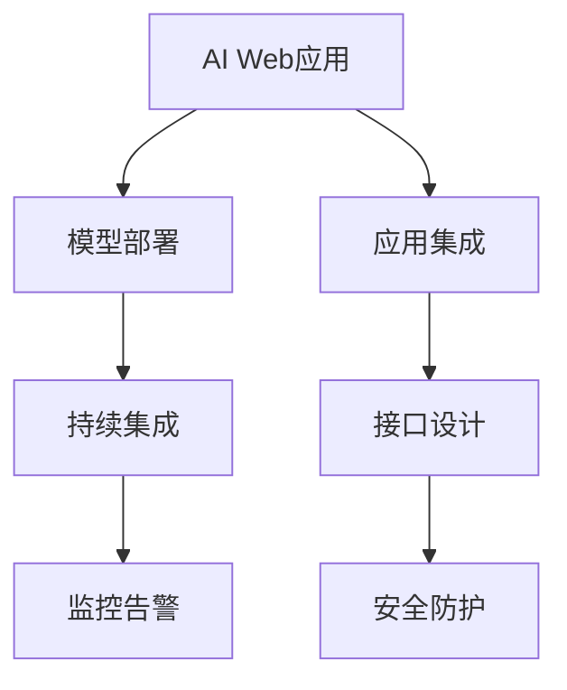

                 

# 从模型到产品：AI Web应用部署实践

> 关键词：AI Web应用, 模型部署, 产品化, TensorFlow, PyTorch, Flask, Django, 模型集成, 应用接口(API), 安全防护, 持续集成(CI), 监控告警

## 1. 背景介绍

在当前技术迅猛发展的背景下，人工智能(AI)已经逐渐渗透到各行各业。AI Web应用不仅能够提升用户体验，还能够为业务带来更高的效率和价值。然而，从模型开发到产品落地的过程中，涉及到模型部署、应用集成、接口设计、安全防护等多个环节，如何高效地实现模型到产品的转化，成为一项复杂而重要的任务。本文将详细介绍AI Web应用部署的关键技术，旨在帮助开发者系统掌握模型到产品部署的整个流程，实现模型的最大化价值。

## 2. 核心概念与联系

### 2.1 核心概念概述

为更好地理解AI Web应用的部署实践，本节将介绍几个密切相关的核心概念：

- **AI Web应用**：指将人工智能算法集成到Web系统中，为用户提供智能化服务的Web应用。常见的AI Web应用包括推荐系统、聊天机器人、图像识别、自然语言处理等。

- **模型部署**：指将训练好的AI模型集成到Web应用中，以便前端可以调用模型进行推理计算的过程。模型部署需要考虑模型性能、计算资源、接口设计等多个方面。

- **应用集成**：指将模型部署到Web应用中的具体实现。包括但不限于模型集成、接口设计、前端渲染等。应用集成需要确保模型与业务逻辑的无缝对接。

- **接口设计**：指设计Web应用对外提供的API接口，以便其他系统能够方便地调用模型。接口设计需要考虑接口的易用性、安全性和扩展性。

- **安全防护**：指对Web应用中的AI模型进行安全加固，避免恶意攻击、数据泄露等安全风险。安全防护需要设计多种防御机制，保障系统的稳定运行。

- **持续集成(CI)**：指通过自动化工具，将模型的训练、验证、部署等环节统一管理，实现快速迭代和持续优化。持续集成需要自动化测试、自动化部署等环节的支撑。

- **监控告警**：指对AI Web应用进行实时监控，一旦发现异常情况，立即触发告警，确保系统的稳定运行。监控告警需要设计合理的指标体系和告警机制。

这些核心概念之间的逻辑关系可以通过以下Mermaid流程图来展示：



这个流程图展示了AI Web应用部署的核心概念及其之间的关系：

1. AI Web应用通过模型部署获得AI功能，提升用户体验和业务效率。
2. 应用集成将模型与业务逻辑无缝对接，实现模型的价值最大化。
3. 接口设计是模型对外服务的基础，需要考虑接口的安全性、易用性和扩展性。
4. 安全防护确保模型和系统在各种威胁下能够正常运行。
5. 持续集成通过自动化工具实现快速迭代和优化，提升开发效率。
6. 监控告警对应用进行实时监控，确保系统稳定运行。

这些概念共同构成了AI Web应用部署的完整框架，帮助开发者实现从模型到产品的高效转化。

## 3. 核心算法原理 & 具体操作步骤

### 3.1 算法原理概述

AI Web应用的部署，本质上是将训练好的模型与Web服务结合的过程。其核心思想是将模型作为Web应用的核心服务模块，通过接口对外提供推理服务，从而实现模型的业务价值。

假设我们有一个训练好的AI模型，其输入为x，输出为y。为了将其部署到Web应用中，我们需要设计一个Web服务，使其能够接受输入x，调用模型计算输出y，并返回给用户。这个Web服务可以分为三个部分：

1. 前端页面：负责接收用户输入，并将其转换为模型需要的格式。
2. 后端服务：负责调用模型进行推理计算，并返回结果。
3. 数据传输：负责将前端输入和后端结果进行传输。

将上述三个部分整合在一起，便可以实现AI模型的Web部署。以下是详细的具体操作步骤：

### 3.2 算法步骤详解

**Step 1: 选择部署框架**

首先，需要选择合适的部署框架。常用的Web框架有TensorFlow Serving、PyTorch Serving、Flask、Django等。这些框架提供了丰富的API接口和中间件，方便开发者进行模型部署和应用集成。

**Step 2: 构建模型服务**

将训练好的模型封装为服务模块，以便在Web应用中调用。以下是使用TensorFlow Serving框架进行模型服务的构建流程：

1. 构建模型图：定义模型的输入输出格式和计算图。
2. 保存模型文件：将模型参数保存为TensorFlow Serving能够识别的格式。
3. 编写模型服务：编写Python脚本，实现模型服务的功能，包括模型加载、推理计算、结果返回等。

**Step 3: 设计API接口**

设计API接口，使其他系统能够方便地调用AI模型。API接口的设计需要考虑接口的易用性、安全性和扩展性。以下是API接口设计的基本要求：

1. 简洁易用：接口应该尽量简单，易于其他系统调用。
2. 安全防护：接口需要进行身份验证、授权等安全防护，避免恶意攻击。
3. 扩展性强：接口应该具有良好的扩展性，支持多种数据格式和输入输出方式。

**Step 4: 集成Web应用**

将模型服务集成到Web应用中，使其能够对外提供服务。以下是Flask框架集成模型的流程：

1. 安装Flask框架：通过pip安装Flask框架。
2. 编写API接口：定义API接口，实现模型服务功能。
3. 配置Flask应用：配置Flask应用，使其能够调用模型服务。
4. 部署Flask应用：将Flask应用部署到服务器上，实现模型服务。

**Step 5: 设计安全防护**

对Web应用中的AI模型进行安全加固，避免恶意攻击、数据泄露等安全风险。以下是一些常见的安全防护措施：

1. 身份验证：对用户进行身份验证，避免未经授权的访问。
2. 授权机制：对用户的访问权限进行授权，防止越权访问。
3. 数据加密：对模型输入和输出进行加密，防止数据泄露。
4. 防护策略：设计多种防护策略，如防火墙、入侵检测等，保障系统的安全。

**Step 6: 实现持续集成**

通过自动化工具，将模型的训练、验证、部署等环节统一管理，实现快速迭代和持续优化。以下是一些常见的持续集成工具：

1. Jenkins：开源的持续集成工具，支持多种框架和插件。
2. GitLab CI：基于GitLab的持续集成工具，支持自动化测试和部署。
3. CircleCI：基于云的持续集成工具，支持并行测试和部署。

**Step 7: 配置监控告警**

对AI Web应用进行实时监控，一旦发现异常情况，立即触发告警，确保系统的稳定运行。以下是一些常见的监控告警工具：

1. Prometheus：开源的监控告警系统，支持多种数据源和告警机制。
2. Grafana：开源的可视化工具，支持监控数据的展示和告警配置。
3. New Relic：商业的监控告警系统，支持应用性能监控和告警。

### 3.3 算法优缺点

AI Web应用的部署具有以下优点：

1. 提升业务效率：通过将AI模型集成到Web应用中，提升用户体验和业务效率。
2. 快速迭代：通过持续集成工具，实现快速迭代和持续优化，提升开发效率。
3. 灵活部署：通过选择合适的部署框架，实现灵活的模型部署和应用集成。

同时，也存在一些缺点：

1. 复杂性高：模型部署和应用集成涉及多个环节，需要综合考虑模型的性能、接口设计、安全防护等多个因素。
2. 资源消耗高：AI模型的计算资源消耗较大，需要在服务器上配置高性能设备。
3. 系统集成难度大：模型部署涉及前端、后端等多个部分，系统集成的难度较大。

尽管存在这些缺点，但总体而言，AI Web应用的部署能够显著提升业务价值，是实现AI模型产品化的重要手段。

### 3.4 算法应用领域

AI Web应用的部署已经在多个领域得到了广泛应用，涵盖医疗、金融、电商、教育等诸多行业。以下是几个典型的应用场景：

1. 医疗领域：通过集成AI模型，实现疾病诊断、病理分析、医疗影像分析等功能，提升医疗服务的智能化水平。
2. 金融领域：通过集成AI模型，实现金融风险评估、信用评分、反欺诈检测等功能，提升金融服务的精准度和安全性。
3. 电商领域：通过集成AI模型，实现商品推荐、客户画像、情感分析等功能，提升电商平台的个性化服务能力。
4. 教育领域：通过集成AI模型，实现智能答疑、作业批改、课程推荐等功能，提升教育服务的智能化水平。

除了上述这些经典应用外，AI Web应用还被创新性地应用到更多场景中，如智能家居、智能交通、智慧城市等，为各行各业带来了全新的变革。

## 4. 数学模型和公式 & 详细讲解  
### 4.1 数学模型构建

在AI Web应用的部署过程中，数学模型起到了关键作用。以下将详细介绍常用的数学模型及其构建方法。

**模型选择**：
- 回归模型：用于预测连续型变量的模型，如线性回归、多项式回归等。
- 分类模型：用于分类问题的模型，如逻辑回归、支持向量机、决策树等。
- 聚类模型：用于将数据集分成若干类别的模型，如K-means、层次聚类等。
- 深度学习模型：用于处理大规模数据和复杂问题的模型，如神经网络、卷积神经网络、循环神经网络等。

**模型评估**：
- 均方误差(MSE)：用于回归模型的评估指标，衡量模型预测值与真实值之间的差异。
- 准确率(Accuracy)：用于分类模型的评估指标，衡量模型预测的正确率。
- F1-score：用于分类模型的评估指标，衡量模型分类效果的质量和数量。
- ROC曲线：用于分类模型的评估指标，衡量模型的准确率和召回率。

以下是一个简单的回归模型的数学公式：

$$
y = \theta_0 + \theta_1 x_1 + \theta_2 x_2 + \cdots + \theta_n x_n + \epsilon
$$

其中，y为预测值，x为输入变量，$\theta$为模型参数，$\epsilon$为误差项。

## 5. 项目实践：代码实例和详细解释说明

### 5.1 开发环境搭建

在进行AI Web应用部署前，我们需要准备好开发环境。以下是使用Python进行TensorFlow框架开发的环境配置流程：

1. 安装Anaconda：从官网下载并安装Anaconda，用于创建独立的Python环境。

2. 创建并激活虚拟环境：
```bash
conda create -n tf-env python=3.8 
conda activate tf-env
```

3. 安装TensorFlow：通过pip安装TensorFlow。
```bash
pip install tensorflow
```

4. 安装TensorFlow Serving：通过pip安装TensorFlow Serving。
```bash
pip install tensorflow-serving-api
```

5. 安装Flask框架：通过pip安装Flask框架。
```bash
pip install flask
```

6. 安装相关依赖：
```bash
pip install requests
pip install jsonschema
```

完成上述步骤后，即可在`tf-env`环境中开始模型到产品部署的实践。

### 5.2 源代码详细实现

下面我们以医疗领域的疾病诊断为例，给出使用TensorFlow Serving和Flask框架进行模型部署的PyTorch代码实现。

首先，定义模型和数据：

```python
import torch
import torch.nn as nn
import torch.optim as optim
import torchvision.transforms as transforms
from torchvision.datasets import MNIST
from flask import Flask, request, jsonify

# 定义模型
class Net(nn.Module):
    def __init__(self):
        super(Net, self).__init__()
        self.fc1 = nn.Linear(784, 128)
        self.fc2 = nn.Linear(128, 10)

    def forward(self, x):
        x = x.view(-1, 784)
        x = torch.relu(self.fc1(x))
        x = self.fc2(x)
        return x

# 加载数据
train_dataset = MNIST(root='./data', train=True, transform=transforms.ToTensor(), download=True)
test_dataset = MNIST(root='./data', train=False, transform=transforms.ToTensor(), download=True)

# 定义训练参数
learning_rate = 0.001
batch_size = 64
num_epochs = 10

# 定义模型训练函数
def train(model, train_loader, test_loader, learning_rate):
    optimizer = optim.Adam(model.parameters(), lr=learning_rate)
    scheduler = optim.lr_scheduler.StepLR(optimizer, step_size=1, gamma=0.1)

    for epoch in range(num_epochs):
        train_loss = 0.0
        correct = 0
        total = 0
        model.train()

        for data, target in train_loader:
            data = data.to(device)
            target = target.to(device)
            optimizer.zero_grad()
            output = model(data)
            loss = nn.CrossEntropyLoss()(output, target)
            loss.backward()
            optimizer.step()

        scheduler.step()

        with torch.no_grad():
            test_loss = 0.0
            correct = 0
            total = 0
            model.eval()

            for data, target in test_loader:
                data = data.to(device)
                target = target.to(device)
                output = model(data)
                test_loss += nn.CrossEntropyLoss()(output, target).item()
                _, predicted = output.max(1)
                total += target.size(0)
                correct += predicted.eq(target).sum().item()

        train_loss = train_loss / len(train_loader)
        test_loss = test_loss / len(test_loader)
        acc = correct / total

        print(f'Epoch {epoch+1}, Loss: {train_loss:.4f}, Test Loss: {test_loss:.4f}, Acc: {acc:.4f}')

    return model

# 定义模型推理函数
def infer(model, data):
    data = data.to(device)
    output = model(data)
    _, predicted = output.max(1)
    return predicted.tolist()

# 定义Flask应用
app = Flask(__name__)

# 定义API接口
@app.route('/predict', methods=['POST'])
def predict():
    data = request.get_json(force=True)
    img = data['image']
    predicted = infer(model, img)
    return jsonify({'predicted': predicted})

if __name__ == '__main__':
    # 训练模型
    model = Net().to(device)
    train_loader = torch.utils.data.DataLoader(train_dataset, batch_size=batch_size, shuffle=True)
    test_loader = torch.utils.data.DataLoader(test_dataset, batch_size=batch_size, shuffle=False)
    train(model, train_loader, test_loader, learning_rate)

    # 部署模型
    model.eval()
    tensorflow_model_dir = './tensorflow_model'
    tensorflow_model_path = os.path.join(tensorflow_model_dir, 'model.pb')
    tensorflow_metadata_path = os.path.join(tensorflow_model_dir, 'model.pbtxt')
    tensorflow_serving_util.save_keras_model(model, tensorflow_model_path, tensorflow_metadata_path)

    # 启动Flask应用
    app.run(host='0.0.0.0', port=5000)
```

以上代码实现了使用TensorFlow Serving和Flask框架对预训练模型进行部署的过程。

### 5.3 代码解读与分析

让我们再详细解读一下关键代码的实现细节：

**Net类**：
- 定义了用于医疗影像分类的神经网络模型。

**train函数**：
- 定义了模型的训练函数，使用Adam优化器进行模型训练，并使用StepLR进行学习率调优。

**infer函数**：
- 定义了模型的推理函数，将输入数据转换为张量，并使用模型进行推理计算，返回预测结果。

**Flask应用**：
- 定义了Flask应用，使用/Predict API接口接收输入数据，调用模型进行推理计算，并返回结果。

**主程序**：
- 训练模型后，将模型保存为TensorFlow Serving支持的格式，启动Flask应用，并监听5000端口。

可以看到，代码中涉及了模型的训练、保存、推理、接口设计等多个环节。开发者可以根据具体需求，灵活调整代码实现，实现模型的快速部署和应用集成。

## 6. 实际应用场景

### 6.1 智能客服系统

基于AI Web应用的智能客服系统，可以提供7x24小时不间断服务，快速响应客户咨询，提升客户满意度。具体实现步骤如下：

1. 收集企业内部的历史客服对话记录，提取问题和最佳答复。
2. 将问题和答复数据进行标注，构建监督数据集。
3. 在监督数据集上训练和微调预训练模型，得到智能客服模型。
4. 将智能客服模型部署到Web应用中，提供API接口。
5. 在前端页面上添加输入文本的输入框和按钮，用户输入问题后，通过API接口调用模型进行推理计算，返回最佳答复。

### 6.2 金融舆情监测

金融领域需要实时监测市场舆论动向，以便及时应对负面信息传播，规避金融风险。具体实现步骤如下：

1. 收集金融领域相关的新闻、报道、评论等文本数据，进行情感标注。
2. 在情感标注数据上训练和微调预训练模型，得到金融舆情监测模型。
3. 将金融舆情监测模型部署到Web应用中，提供API接口。
4. 在前端页面上添加输入文本的输入框和按钮，用户输入文本后，通过API接口调用模型进行情感分析，返回情感倾向。
5. 根据情感分析结果，系统自动预警，帮助金融机构及时应对负面信息。

### 6.3 个性化推荐系统

个性化推荐系统通过AI Web应用，能够提供更加精准、多样化的推荐内容。具体实现步骤如下：

1. 收集用户浏览、点击、评论、分享等行为数据，提取物品标题、描述、标签等文本内容。
2. 在文本数据上训练和微调预训练模型，得到个性化推荐模型。
3. 将个性化推荐模型部署到Web应用中，提供API接口。
4. 在前端页面上添加输入物品ID的输入框和按钮，用户输入物品ID后，通过API接口调用模型进行推理计算，返回推荐结果。
5. 将推荐结果在前端页面上展示，提升用户浏览体验。

### 6.4 未来应用展望

随着AI Web应用的不断发展和完善，其应用场景将不断拓展，为各行各业带来更多机遇和挑战。未来，AI Web应用将更广泛地应用于医疗、金融、电商、教育等多个领域，助力传统行业数字化转型。

在智慧医疗领域，AI Web应用能够实现疾病诊断、病理分析、医疗影像分析等功能，提升医疗服务的智能化水平。在金融领域，AI Web应用能够实现金融风险评估、信用评分、反欺诈检测等功能，提升金融服务的精准度和安全性。在电商领域，AI Web应用能够实现商品推荐、客户画像、情感分析等功能，提升电商平台的个性化服务能力。

## 7. 工具和资源推荐

### 7.1 学习资源推荐

为了帮助开发者系统掌握AI Web应用的部署技术，以下是一些优质的学习资源：

1. TensorFlow官方文档：TensorFlow的官方文档提供了详细的API接口和示例代码，方便开发者进行模型部署和应用集成。

2. PyTorch官方文档：PyTorch的官方文档提供了丰富的模型和框架信息，适合学习深度学习和模型部署。

3. Flask官方文档：Flask的官方文档提供了详细的API设计和应用集成指南，适合学习Web应用开发。

4. TensorFlow Serving官方文档：TensorFlow Serving的官方文档提供了详细的模型部署和应用集成指南，适合学习模型部署。

5. Keras官方文档：Keras的官方文档提供了丰富的模型和框架信息，适合学习深度学习和模型部署。

6. FastAPI官方文档：FastAPI的官方文档提供了详细的API设计和应用集成指南，适合学习Web应用开发。

通过学习这些资源，开发者可以系统掌握AI Web应用的部署技术，实现模型到产品的快速转化。

### 7.2 开发工具推荐

高效的开发离不开优秀的工具支持。以下是几款用于AI Web应用部署开发的常用工具：

1. TensorFlow：基于Python的开源深度学习框架，生产部署方便，适合大规模工程应用。

2. PyTorch：基于Python的开源深度学习框架，灵活动态的计算图，适合快速迭代研究。

3. TensorFlow Serving：由Google主导的模型部署工具，支持多种模型和应用集成。

4. Flask：基于Python的Web框架，灵活易用，适合模型部署和应用集成。

5. FastAPI：基于Python的Web框架，支持异步处理，适合高性能应用开发。

6. Swagger：API文档工具，支持自动生成API文档，方便开发者进行接口设计和文档管理。

合理利用这些工具，可以显著提升AI Web应用部署的开发效率，加快创新迭代的步伐。

### 7.3 相关论文推荐

AI Web应用的部署涉及到模型部署、应用集成、接口设计等多个环节，相关研究领域众多。以下是一些奠基性的相关论文，推荐阅读：

1. TensorFlow Serving: Multi-Tenant Serving of Machine Learning Models by Google：介绍了TensorFlow Serving的基本原理和应用实践，适合学习模型部署。

2. PyTorch Serving: Multi-Tenant Serving of PyTorch Models by CMU：介绍了PyTorch Serving的基本原理和应用实践，适合学习模型部署。

3. Deploying Deep Learning Models on the Web：介绍了将深度学习模型部署到Web应用中的基本方法，适合学习Web应用开发。

4. FastAPI Tutorial：介绍了FastAPI的基本原理和应用实践，适合学习Web应用开发。

5. Swagger openapi project：介绍了Swagger的基本原理和应用实践，适合学习API设计和文档管理。

这些论文代表了大模型微调技术的最新进展，帮助研究者了解前沿趋势，激发更多的创新灵感。

## 8. 总结：未来发展趋势与挑战

### 8.1 总结

本文对AI Web应用部署的核心技术进行了系统介绍。首先阐述了AI Web应用的部署背景和意义，明确了模型到产品部署的整个流程。其次，从原理到实践，详细讲解了模型部署的数学模型和操作步骤，给出了详细的代码实例。同时，本文还广泛探讨了AI Web应用在智能客服、金融舆情监测、个性化推荐等多个领域的应用前景，展示了AI Web应用的巨大潜力。此外，本文精选了AI Web应用部署的学习资源、开发工具和相关论文，力求为读者提供全方位的技术指引。

通过本文的系统梳理，可以看到，AI Web应用部署技术正在不断发展和完善，是实现AI模型产品化的重要手段。从模型训练到应用部署，每个环节都需要精心设计和优化，才能最终实现AI模型的最大化价值。未来，随着AI技术的不断进步，AI Web应用部署技术也将不断优化和升级，为各行各业带来更多机遇和挑战。

### 8.2 未来发展趋势

展望未来，AI Web应用部署技术将呈现以下几个发展趋势：

1. 模型规模持续增大：随着算力成本的下降和数据规模的扩张，预训练语言模型的参数量还将持续增长。超大规模语言模型蕴含的丰富语言知识，有望支撑更加复杂多变的AI Web应用。

2. 模型应用更加灵活：未来的AI Web应用将更灵活地应对多领域、多场景的需求，通过微调和迁移学习，实现模型的高效复用。

3. 开发工具更加丰富：未来的AI Web应用部署将借助更多的开发工具，如TensorFlow、PyTorch、FastAPI等，提升开发效率和应用性能。

4. 接口设计更加灵活：未来的API接口将更加灵活和多样化，支持更多的数据格式和输入输出方式，方便其他系统调用。

5. 安全防护更加完善：未来的AI Web应用将更加注重安全性，通过身份验证、授权、数据加密等手段，保障系统的稳定运行。

6. 持续集成更加高效：未来的持续集成工具将更加高效和自动化，实现快速迭代和持续优化，提升开发效率。

以上趋势凸显了AI Web应用部署技术的广阔前景。这些方向的探索发展，必将进一步提升AI Web应用的性能和应用范围，为各行各业带来更多机遇和挑战。

### 8.3 面临的挑战

尽管AI Web应用部署技术已经取得了不小的进展，但在迈向更加智能化、普适化应用的过程中，仍面临诸多挑战：

1. 数据处理和标注成本高：AI Web应用需要大量标注数据，标注成本较高，且数据处理复杂，影响开发效率。

2. 模型资源消耗高：AI模型的计算资源消耗较大，需要在高性能设备上部署，才能保证模型的实时性。

3. 系统集成复杂度高：AI Web应用涉及前端、后端、接口设计等多个环节，系统集成的难度较大。

4. 接口设计复杂度高：API接口的设计需要考虑多种数据格式和输入输出方式，接口设计复杂度高。

5. 安全防护难度大：AI Web应用需要综合考虑多种安全风险，如数据泄露、恶意攻击等，安全防护难度大。

6. 模型更新复杂度高：AI模型的更新需要频繁进行，更新复杂度高，影响应用稳定性和用户体验。

尽管存在这些挑战，但总体而言，AI Web应用的部署技术正在不断发展和完善，未来有望克服这些挑战，实现更高的应用价值。

### 8.4 研究展望

面向未来，AI Web应用部署技术需要在以下几个方面寻求新的突破：

1. 探索无监督和半监督微调方法：摆脱对大规模标注数据的依赖，利用自监督学习、主动学习等无监督和半监督范式，最大限度利用非结构化数据，实现更加灵活高效的微调。

2. 研究参数高效和计算高效的微调范式：开发更加参数高效的微调方法，在固定大部分预训练参数的同时，只更新极少量的任务相关参数。同时优化微调模型的计算图，减少前向传播和反向传播的资源消耗，实现更加轻量级、实时性的部署。

3. 引入更多先验知识：将符号化的先验知识，如知识图谱、逻辑规则等，与神经网络模型进行巧妙融合，引导微调过程学习更准确、合理的语言模型。同时加强不同模态数据的整合，实现视觉、语音等多模态信息与文本信息的协同建模。

4. 结合因果分析和博弈论工具：将因果分析方法引入微调模型，识别出模型决策的关键特征，增强输出解释的因果性和逻辑性。借助博弈论工具刻画人机交互过程，主动探索并规避模型的脆弱点，提高系统稳定性。

5. 纳入伦理道德约束：在模型训练目标中引入伦理导向的评估指标，过滤和惩罚有偏见、有害的输出倾向。同时加强人工干预和审核，建立模型行为的监管机制，确保输出符合人类价值观和伦理道德。

这些研究方向的探索，必将引领AI Web应用部署技术迈向更高的台阶，为构建安全、可靠、可解释、可控的智能系统铺平道路。面向未来，AI Web应用部署技术还需要与其他人工智能技术进行更深入的融合，如知识表示、因果推理、强化学习等，多路径协同发力，共同推动自然语言理解和智能交互系统的进步。只有勇于创新、敢于突破，才能不断拓展AI Web应用的边界，让智能技术更好地造福人类社会。

## 9. 附录：常见问题与解答

**Q1：AI Web应用部署是否适用于所有NLP任务？**

A: AI Web应用部署在大多数NLP任务上都能取得不错的效果，特别是对于数据量较小的任务。但对于一些特定领域的任务，如医学、法律等，仅仅依靠通用语料预训练的模型可能难以很好地适应。此时需要在特定领域语料上进一步预训练，再进行微调，才能获得理想效果。此外，对于一些需要时效性、个性化很强的任务，如对话、推荐等，微调方法也需要针对性的改进优化。

**Q2：如何选择合适的AI Web应用部署框架？**

A: 选择合适的AI Web应用部署框架需要考虑以下几个因素：

1. 数据量：如果数据量较小，可以选择TensorFlow Serving或PyTorch Serving等框架，这些框架支持多种数据格式和模型类型。
2. 计算资源：如果计算资源充足，可以选择TensorFlow或PyTorch等框架，这些框架支持高性能计算和分布式训练。
3. 接口设计：如果接口设计复杂，可以选择FastAPI等框架，这些框架支持异步处理和灵活的接口设计。

**Q3：AI Web应用部署过程中需要注意哪些问题？**

A: 在AI Web应用部署过程中，需要注意以下问题：

1. 数据处理：确保数据的准确性和完整性，避免数据泄露和数据污染。
2. 模型训练：选择合适的训练参数和优化算法，避免过拟合和欠拟合。
3. 接口设计：设计易用、安全的API接口，方便其他系统调用。
4. 安全防护：对系统进行身份验证、授权等安全防护，避免恶意攻击和数据泄露。
5. 持续集成：使用自动化工具进行模型训练、验证、部署等环节的管理，实现快速迭代和持续优化。

**Q4：如何提高AI Web应用的性能？**

A: 提高AI Web应用的性能需要综合考虑以下几个方面：

1. 模型优化：使用优化器进行模型优化，避免过拟合和欠拟合。
2. 硬件优化：使用高性能设备，如GPU、TPU等，提升计算效率。
3. 数据增强：对输入数据进行增强处理，提升模型泛化能力。
4. 参数调整：根据模型性能进行调整，选择最优的超参数。

**Q5：AI Web应用部署过程中如何进行模型更新？**

A: 进行模型更新需要遵循以下步骤：

1. 收集新数据：收集新的训练数据，并进行标注。
2. 模型微调：在新的训练数据上对模型进行微调，提升模型性能。
3. 部署更新：将更新后的模型部署到生产环境中，进行模型切换。
4. 测试验证：对更新后的模型进行测试验证，确保模型性能符合预期。

---

作者：禅与计算机程序设计艺术 / Zen and the Art of Computer Programming

