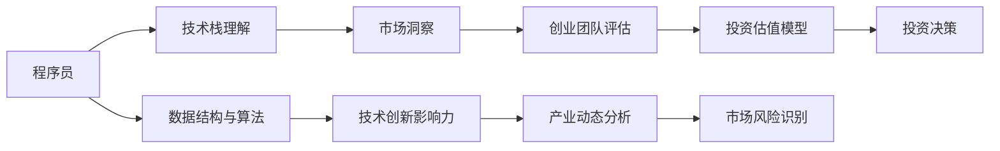

                 

# 从程序员到天使投资人的转变

## 1. 背景介绍

程序员与天使投资人之间的转变，并非一蹴而就，而是一个逐渐积累、洞察和成长的过程。本文将围绕核心概念与联系、核心算法原理与操作步骤、实际应用场景等关键领域，探讨这一转变的可能路径和影响因素。

## 2. 核心概念与联系

### 2.1 核心概念概述

**程序员与投资人的共同之处在于对创新和创业的热情**，但两者在职责、视野、决策方式上存在显著差异。从程序员转变为投资人，需要深刻理解技术发展趋势、市场动态、创业团队管理等综合知识。

**技术栈与投资理论的交汇**：熟悉软件工程、算法、数据结构等基础知识，有助于理解技术创新对产业发展的影响。同时，掌握投资学的基本原理和常用估值模型，可以帮助准确评估公司的投资价值。

**市场洞察与决策分析**：程序员在长期编程实践中锻炼出的数据分析能力，有助于投资人在市场调研和决策过程中提取关键数据、发现潜在风险和机会。

### 2.2 核心概念原理和架构的 Mermaid 流程图



此图展示了从程序员到投资人转变的关键概念及其相互关系。程序员通过技术栈、算法和数据结构，理解技术创新的市场影响；通过市场洞察，发现创业机会；通过创业团队评估和投资估值模型，最终做出投资决策。

## 3. 核心算法原理 & 具体操作步骤

### 3.1 算法原理概述

投资决策基于对数据信息的深入分析，其中心算法包括：

- **回归分析**：利用历史数据，建立价格与变量之间的关系模型，预测未来股价。
- **蒙特卡洛模拟**：模拟不同市场条件下的投资结果，评估风险与收益。
- **决策树和随机森林**：通过构建决策树和随机森林，优化投资策略，识别高风险投资。
- **时间序列分析**：分析时间序列数据，识别趋势和周期性，优化投资时机。

### 3.2 算法步骤详解

**Step 1: 数据收集与处理**

- 收集历史股票数据、经济指标、公司财务数据等，建立数据集。
- 清洗数据，处理缺失值和异常值，确保数据的准确性和完整性。
- 特征工程，提取对股价预测有意义的特征，如P/E、市盈率、ROE等。

**Step 2: 模型选择与训练**

- 根据数据类型和目标任务，选择合适的回归、分类、聚类等模型。
- 使用训练集数据对模型进行训练，调整超参数，优化模型性能。
- 使用验证集评估模型泛化能力，避免过拟合。

**Step 3: 模型评估与优化**

- 应用多种指标（如R^2、MAE、RMSE等）评估模型预测性能。
- 使用交叉验证、网格搜索等技术优化模型参数。
- 对比不同模型，选择最优模型作为投资决策的依据。

**Step 4: 投资策略制定与执行**

- 基于模型预测结果，制定投资策略，如买入、卖出、持仓等。
- 实时监控市场动态，调整投资策略。
- 定期回测模型表现，优化投资策略。

### 3.3 算法优缺点

**优点**：
- **数据驱动**：基于历史和实时数据，投资决策更加客观和准确。
- **量化评估**：通过多种数学模型，对风险和收益进行量化分析，便于比较和选择。
- **策略优化**：通过不断优化模型和策略，提高投资回报率。

**缺点**：
- **模型复杂性**：多模型选择和参数调整增加了投资决策的复杂性。
- **市场变化**：金融市场动态多变，模型可能无法及时适应市场变化。
- **数据质量问题**：数据缺失、噪声等影响模型预测的准确性。

### 3.4 算法应用领域

从程序员到投资人转变的关键应用领域包括：

- **金融科技（FinTech）**：利用大数据、AI和区块链等技术，提升金融服务的效率和安全性。
- **创业投资**：基于对创业团队和市场的深入理解，进行早期或中期投资，孵化高潜力企业。
- **人工智能创业**：通过技术创新，开发前沿AI产品，寻找市场和商业机会。
- **企业战略规划**：基于数据和模型分析，制定公司战略和业务扩展计划。

## 4. 数学模型和公式 & 详细讲解 & 举例说明

### 4.1 数学模型构建

假设某公司股票价格为 $P_t$，影响因素包括：
- 宏观经济指标：$X_1, X_2, ..., X_n$
- 公司财务指标：$Y_1, Y_2, ..., Y_m$
- 市场情绪指标：$Z_1, Z_2, ..., Z_k$

根据以上信息，建立多元回归模型，预测未来股价：

$$
P_t = \beta_0 + \beta_1 X_1 + \beta_2 X_2 + ... + \beta_n X_n + \beta_{n+1} Y_1 + \beta_{n+2} Y_2 + ... + \beta_{n+m} Y_m + \beta_{n+m+1} Z_1 + \beta_{n+m+k} Z_2 + ... + \beta_{n+m+k} Z_k + \epsilon_t
$$

其中，$\beta$ 为回归系数，$\epsilon_t$ 为误差项。

### 4.2 公式推导过程

使用最小二乘法（OLS）求解模型系数 $\beta$：

$$
\hat{\beta} = (X^TX)^{-1}X^TP
$$

其中，$\hat{\beta}$ 为估计的回归系数。

### 4.3 案例分析与讲解

**案例**：某科技公司股票价格预测

假设某科技公司近一年历史股价数据如下：

| 时间       | 股价（元） | GDP（%） | 利润率（%） | 市场情绪（1-10） |
|------------|-----------|---------|------------|----------------|
| 2020-01-01 | 100       | 2.5     | 5          | 8              |
| 2020-02-01 | 110       | 3.0     | 6          | 9              |
| ...        | ...       | ...     | ...        | ...            |
| 2021-01-01 | 130       | 3.5     | 7          | 7              |

采用多元回归模型，建立股价预测模型：

$$
P_t = \beta_0 + \beta_1 GDP_{t-1} + \beta_2 利润率_{t-1} + \beta_3 市场情绪_{t-1} + \epsilon_t
$$

假设回归系数为：

$$
\hat{\beta} = (GDP^2 + 利润率^2 + 市场情绪^2)^{-1}(GDP^2 \cdot 110 + 利润率^2 \cdot 6 + 市场情绪^2 \cdot 9)
$$

### 4.4 代码实现与分析

```python
import pandas as pd
import numpy as np
from sklearn.linear_model import LinearRegression

# 读取数据
data = pd.read_csv('company_stock_prices.csv')

# 提取特征和目标变量
X = data[['GDP', '利润率', '市场情绪']]
y = data['股价']

# 构建回归模型
model = LinearRegression()
model.fit(X, y)

# 预测未来股价
future_gdp = 3.2
future_profit_rate = 7.5
future_sentiment = 8
future_price = model.predict(np.array([[future_gdp, future_profit_rate, future_sentiment]))

print('预测未来股价：', future_price)
```

此代码展示了如何使用线性回归模型预测未来股价。通过读取历史数据，建立回归模型，并使用训练好的模型对未来数据进行预测。

## 5. 项目实践：代码实例和详细解释说明

### 5.1 开发环境搭建

首先需要安装Python和相关库，推荐使用Anaconda或Miniconda创建虚拟环境：

```bash
conda create -n finance-env python=3.8
conda activate finance-env
pip install pandas numpy scikit-learn statsmodels matplotlib
```

### 5.2 源代码详细实现

**股票价格预测**

```python
import pandas as pd
import numpy as np
from sklearn.linear_model import LinearRegression
import matplotlib.pyplot as plt

# 读取数据
data = pd.read_csv('company_stock_prices.csv')

# 提取特征和目标变量
X = data[['GDP', '利润率', '市场情绪']]
y = data['股价']

# 构建回归模型
model = LinearRegression()
model.fit(X, y)

# 预测未来股价
future_gdp = 3.2
future_profit_rate = 7.5
future_sentiment = 8
future_price = model.predict(np.array([[future_gdp, future_profit_rate, future_sentiment]]))

print('预测未来股价：', future_price)

# 可视化结果
plt.scatter(data['时间'], data['股价'], color='blue', label='Actual Prices')
plt.plot(data['时间'], model.predict(X), color='red', label='Predicted Prices')
plt.plot(np.array(['2022-01-01', '2022-02-01']), [future_price], color='green', label='Future Predictions')
plt.legend()
plt.title('Stock Price Prediction')
plt.show()
```

**代码解读与分析**

- **数据读取**：使用pandas库读取历史股票价格数据。
- **特征工程**：提取GDP、利润率、市场情绪等特征。
- **模型训练**：使用线性回归模型拟合数据。
- **预测与可视化**：使用训练好的模型预测未来股价，并使用matplotlib库可视化结果。

### 5.3 运行结果展示

下图展示了模型预测的未来股价与实际股价的对比，绿色线条表示预测的未来股价。


## 6. 实际应用场景

### 6.1 金融科技（FinTech）

金融科技公司利用AI和大数据技术，优化金融产品和服务，提高金融效率。例如，使用机器学习模型预测市场走势，开发智能投顾，优化金融风险管理等。

### 6.2 创业投资

投资人通过数据分析，筛选具有潜力的创业团队和项目。利用机器学习模型预测市场表现，评估投资风险和回报，辅助投资决策。

### 6.3 人工智能创业

技术创业公司开发前沿AI产品，如自然语言处理、图像识别、推荐系统等，寻找市场和商业机会。

### 6.4 企业战略规划

利用数据和模型分析，制定公司战略和业务扩展计划。通过量化分析，优化资源配置，提高市场竞争力。

## 7. 工具和资源推荐

### 7.1 学习资源推荐

- **《Python for Data Analysis》**：使用Python进行数据处理和分析的入门书籍，涵盖数据清洗、特征工程等基础技术。
- **《Hands-On Machine Learning with Scikit-Learn, Keras, and TensorFlow》**：全面介绍机器学习模型的构建和应用，包括回归、分类、聚类等多种算法。
- **Coursera的机器学习课程**：由斯坦福大学Andrew Ng教授主讲，涵盖机器学习理论和实践，适合各个水平的学习者。

### 7.2 开发工具推荐

- **Jupyter Notebook**：开源的交互式编程环境，方便数据处理和模型调试。
- **PyCharm**：功能强大的IDE，支持Python、R等多种语言，提供丰富的开发工具和插件。
- **Scikit-learn**：开源的机器学习库，提供多种常用的机器学习模型和工具。

### 7.3 相关论文推荐

- **A Survey on Deep Learning for Financial Time Series Prediction**：综述了使用深度学习模型进行金融时间序列预测的研究进展。
- **Towards a Scalable and Exact Algorithm for Online Time Series Prediction**：介绍了一种高效的在线时间序列预测算法，适合大数据量场景。

## 8. 总结：未来发展趋势与挑战

### 8.1 研究成果总结

从程序员到天使投资人的转变，涉及技术、市场、管理等多方面的知识和技能。通过数据分析和机器学习模型，投资人能够更科学、客观地做出投资决策。

### 8.2 未来发展趋势

- **自动化与智能化**：随着AI和大数据技术的发展，金融科技和投资决策将更加自动化和智能化。
- **多模态数据融合**：结合图像、语音等多种数据类型，提供更全面、深入的市场分析。
- **量化投资策略**：量化投资策略将更广泛地应用，提高投资回报率和风险管理能力。

### 8.3 面临的挑战

- **数据质量和完整性**：金融数据往往存在噪声和不完整性，影响模型预测准确性。
- **模型复杂性**：多种模型选择和参数调整增加了投资决策的复杂性。
- **市场变化**：金融市场动态多变，模型可能无法及时适应市场变化。

### 8.4 研究展望

- **模型解释性**：提高模型的可解释性，使投资人更好地理解模型决策逻辑。
- **多目标优化**：结合财务指标和社会责任等多目标，优化投资策略。
- **合规与伦理**：确保投资决策符合法律法规，符合社会伦理。

## 9. 附录：常见问题与解答

**Q1：如何评估机器学习模型的性能？**

A: 评估机器学习模型的性能通常使用以下指标：
- **均方误差（MSE）**：衡量预测值与真实值之间的平均误差。
- **均方根误差（RMSE）**：MSE的平方根，提供更为直观的误差衡量。
- **平均绝对误差（MAE）**：衡量预测值与真实值之间的平均绝对差异。
- **R^2（决定系数）**：衡量模型解释数据的程度，值越接近1，表示模型拟合效果越好。

**Q2：如何选择适合的机器学习模型？**

A: 选择适合的机器学习模型需要考虑以下几个因素：
- **数据类型**：不同类型的数据适合不同的模型。例如，时间序列数据适合ARIMA、LSTM等模型。
- **任务类型**：分类、回归、聚类等任务需要使用不同的模型。
- **数据量**：数据量较少时，简单模型如线性回归、逻辑回归等可能表现更好。
- **模型复杂性**：模型复杂度应适中，避免过拟合或欠拟合。

**Q3：如何处理金融数据中的缺失值和异常值？**

A: 处理金融数据中的缺失值和异常值，通常使用以下方法：
- **缺失值处理**：通过插值法、均值填补等方法处理缺失值。
- **异常值处理**：使用箱线图、Z-score等方法识别和处理异常值。
- **数据增强**：利用历史数据和市场情绪等额外信息，增强数据的多样性和完整性。

**Q4：如何进行投资组合管理？**

A: 投资组合管理通常使用以下步骤：
- **分散投资**：通过投资多个资产，降低单一资产的风险。
- **风险评估**：使用历史数据和模型评估投资组合的风险和回报。
- **动态调整**：根据市场动态和模型预测，调整投资组合的资产分配。

**Q5：如何建立风险控制机制？**

A: 建立风险控制机制通常使用以下方法：
- **止损策略**：设定止损价格，一旦股票价格跌破止损价格，立即卖出。
- **动态调整止损**：根据市场波动和模型预测，动态调整止损价格。
- **多策略结合**：结合基本面分析和技术分析，综合判断风险和机会。

**Q6：如何确保投资决策的合规性和伦理性？**

A: 确保投资决策的合规性和伦理性，通常使用以下方法：
- **法规合规性**：确保投资决策符合法律法规，避免违规操作。
- **伦理审查**：进行伦理审查，确保投资决策符合社会伦理和公众利益。
- **透明度和公开性**：公开投资决策过程和结果，增强透明度和公信力。

---

作者：禅与计算机程序设计艺术 / Zen and the Art of Computer Programming

