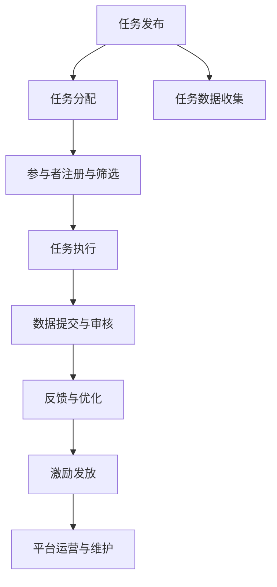

                 

# 众包的力量：如何利用集体智慧解决问题

在数字化时代，我们面临的信息和问题日益复杂化。从全球疫情的监测到城市交通的管理，从互联网产品的创新到环境保护的推进，各行各业都在寻求解决这些复杂问题的最佳途径。众包（Crowdsourcing）作为一种新兴的解决策略，凭借其高效、低成本的特点，逐渐成为解决这些问题的有力工具。本文将深入探讨众包的概念、原理及其在实际应用中的策略和技巧，帮助你理解如何通过集体智慧解决问题。

## 1. 背景介绍

### 1.1 问题由来

众包源于在线环境中的协作模式，指的是利用互联网平台将工作任务分配给大众，以获取所需信息或解决方案。与传统的自上而下或自下而上的决策过程不同，众包通过网络聚合多样化的知识和技能，从而激发创新，提升决策的科学性和效率。近年来，众包已成为互联网技术和协作模式结合的产物，广泛应用于各行业。

### 1.2 问题核心关键点

众包的核心在于如何有效地聚合和管理来自全球不同背景、拥有不同技能的参与者的贡献，并将这些贡献转化为有价值的产出。成功的众包需要解决以下几个关键问题：

- **任务分解与分配**：如何精确地将任务分解为可管理的小任务，并分配给合适的参与者。
- **激励机制设计**：如何设计合理的激励机制，鼓励参与者的积极性和创新性。
- **数据收集与管理**：如何高效地收集和整理来自不同参与者的反馈和数据。
- **反馈与优化**：如何对收集到的数据进行分析和优化，形成更准确的解决方案。

这些关键点共同构成了众包的核心价值和实现路径。

## 2. 核心概念与联系

### 2.1 核心概念概述

为了更好地理解众包，我们首先介绍几个核心概念：

- **众包平台**：指提供任务发布和参与者管理功能的在线平台。
- **众包任务**：需要由参与者完成的具体工作，通常包括数据分析、创意设计、任务测试等。
- **参与者**：通过众包平台接任务的志愿者或专业工作者。
- **工作流管理**：指如何组织和协调参与者的任务执行和信息反馈流程。
- **激励机制**：包括物质奖励、荣誉奖励、积分奖励等，旨在激励参与者的积极参与。

这些概念共同构成了众包系统的基础架构，并通过有效设计和管理，形成协同工作的强大引擎。

### 2.2 核心概念原理和架构的 Mermaid 流程图

以下是众包平台的核心工作流程的 Mermaid 流程图：



这个流程图展示了从任务发布到激励发放的整个众包流程。

## 3. 核心算法原理 & 具体操作步骤

### 3.1 算法原理概述

众包系统的算法原理主要基于以下几个核心思想：

- **任务分解**：将复杂任务分解为可管理的小任务，便于参与者理解和执行。
- **动态分配**：根据参与者的技能和可用时间，动态分配任务，实现最优匹配。
- **激励机制**：设计合理的激励机制，激发参与者的积极性和持续参与。
- **反馈与优化**：通过收集和分析反馈数据，不断优化任务设计和激励机制，提升众包效果。

这些核心思想通过算法实现，形成了众包系统的核心算法框架。

### 3.2 算法步骤详解

以下是众包系统的详细操作步骤：

**Step 1: 任务发布**
- 确定任务目标和需求，编写详细的任务描述。
- 将任务发布到众包平台，等待参与者报名。

**Step 2: 任务分配**
- 根据参与者的技能和可用时间，动态分配任务。
- 确保任务分配公平合理，避免少数人垄断大量任务。

**Step 3: 任务执行**
- 参与者接收到任务后，进行执行，并提交任务结果。
- 平台对提交结果进行初步审核，确保结果质量。

**Step 4: 数据收集与管理**
- 收集参与者的反馈和数据，进行整理和分析。
- 使用数据分析工具，如机器学习、自然语言处理等，提取有价值的信息。

**Step 5: 反馈与优化**
- 对收集到的反馈进行分析和处理，提出改进建议。
- 根据分析结果，优化任务设计和激励机制，提高任务执行效率。

**Step 6: 激励发放**
- 根据任务执行情况和反馈，发放适当的激励。
- 激励形式包括物质奖励、荣誉奖励、积分奖励等。

**Step 7: 平台运营与维护**
- 持续监测平台运行情况，优化平台功能和用户体验。
- 收集用户反馈，不断改进众包系统，提高众包效果。

### 3.3 算法优缺点

众包系统的优点在于其高效、低成本、多样化的特点，能够快速聚集大量创新资源，解决复杂问题。缺点在于如何保证任务的高质量完成、激励机制的设计和管理、参与者的筛选和监控等，仍是众包面临的挑战。

### 3.4 算法应用领域

众包的应用领域广泛，涵盖了从科学研究到商业创新、从环境保护到社会治理等多个方面。以下是几个典型的应用场景：

- **科学研究**：通过众包平台收集大量的观测数据，解决复杂的科学问题。
- **产品设计与创新**：收集用户的创意和反馈，加速产品的设计与迭代。
- **城市管理**：利用众包平台收集城市数据，优化城市规划和管理。
- **环境保护**：通过众包平台收集环境数据，提升环境保护的科学性和效率。

## 4. 数学模型和公式 & 详细讲解 & 举例说明

### 4.1 数学模型构建

在众包系统中，常用的数学模型包括：

- **线性回归模型**：用于分析任务完成与激励发放之间的关系，建立激励模型。
- **主成分分析(PCA)**：用于分析任务完成后的数据，提取关键特征。
- **支持向量机(SVM)**：用于分类和回归分析，优化任务设计。

### 4.2 公式推导过程

以下是一个简单的线性回归模型推导过程：

设任务完成度为 $Y$，激励发放为 $X$，线性回归模型为 $Y = \alpha + \beta X + \epsilon$，其中 $\alpha$ 为截距，$\beta$ 为斜率，$\epsilon$ 为误差项。

通过对大量历史数据进行最小二乘法拟合，求解 $\alpha$ 和 $\beta$，即可建立激励模型。

### 4.3 案例分析与讲解

假设有一个众包平台，用于收集大众对某款产品的使用反馈。平台希望通过发放激励（如优惠券），提升用户反馈的质量和数量。

- 利用历史数据，使用线性回归模型建立激励模型 $Y = \alpha + \beta X + \epsilon$。
- 分析历史数据，求解 $\alpha$ 和 $\beta$，确定最优激励发放策略。
- 根据激励模型，动态调整激励发放策略，优化任务执行效果。

## 5. 项目实践：代码实例和详细解释说明

### 5.1 开发环境搭建

在进行众包系统开发前，我们需要准备好开发环境。以下是使用Python进行Django开发的环境配置流程：

1. 安装Anaconda：从官网下载并安装Anaconda，用于创建独立的Python环境。
2. 创建并激活虚拟环境：
```bash
conda create -n crowdsourcing python=3.8 
conda activate crowdsourcing
```
3. 安装Django：从官网获取对应的安装命令。例如：
```bash
pip install django
```
4. 安装相关工具包：
```bash
pip install pandas numpy scikit-learn matplotlib tqdm
```

完成上述步骤后，即可在`crowdsourcing`环境中开始开发。

### 5.2 源代码详细实现

下面以一个简单的众包平台为例，给出Django开发的环境配置和代码实现。

首先，创建Django项目和应用：

```bash
django-admin startproject crowdsourcing
cd crowdsourcing
python manage.py startapp tasks
```

然后，定义任务模型：

```python
from django.db import models
from django.contrib.auth.models import User

class Task(models.Model):
    title = models.CharField(max_length=100)
    description = models.TextField()
    creator = models.ForeignKey(User, on_delete=models.CASCADE)
    status = models.IntegerField(choices=[(0, 'Open'), (1, 'In Progress'), (2, 'Completed')])
    created_at = models.DateTimeField(auto_now_add=True)
    updated_at = models.DateTimeField(auto_now=True)
```

接着，定义用户模型：

```python
from django.contrib.auth.models import AbstractUser
from django.db import models

class CrowdUser(AbstractUser):
    pass
```

然后，创建任务和参与者管理页面：

```python
from django.shortcuts import render, redirect
from .models import Task, CrowdUser

def task_list(request):
    tasks = Task.objects.all()
    return render(request, 'tasks/list.html', {'tasks': tasks})

def create_task(request):
    if request.method == 'POST':
        task = Task(
            title=request.POST['title'],
            description=request.POST['description'],
            creator=request.user
        )
        task.save()
        return redirect('task_list')
    return render(request, 'tasks/create.html')

def task_detail(request, pk):
    task = Task.objects.get(pk=pk)
    return render(request, 'tasks/detail.html', {'task': task})

def task_assign(request, pk):
    task = Task.objects.get(pk=pk)
    task.status = 1
    task.save()
    return redirect('task_detail', pk=pk)
```

最后，创建激励发放页面：

```python
from django.shortcuts import render, redirect
from .models import Task, CrowdUser

def reward_assign(request, pk):
    task = Task.objects.get(pk=pk)
    user = CrowdUser.objects.get(username=request.POST['username'])
    task.reward = user.username
    task.save()
    return redirect('task_detail', pk=pk)
```

以上就是使用Django对众包平台进行开发的完整代码实现。可以看到，借助Django框架，开发众包平台变得相对简洁高效。

### 5.3 代码解读与分析

让我们再详细解读一下关键代码的实现细节：

**任务模型**：
- `title`：任务标题，最大长度为100。
- `description`：任务描述，可输入文本。
- `creator`：任务创建者，为平台用户。
- `status`：任务状态，包括开放、进行中、已完成。
- `created_at`：任务创建时间，自动记录。
- `updated_at`：任务更新时间，自动记录。

**用户模型**：
- 继承自Django内置的`AbstractUser`模型，用于扩展用户信息。

**任务管理页面**：
- `task_list`：列出所有任务，每个任务包含标题、描述、状态、创建时间等信息。
- `create_task`：创建新任务，需要输入任务标题和描述，并指定创建者。
- `task_detail`：展示单个任务详情，包括任务标题、描述、状态、创建时间、更新时间等信息。
- `task_assign`：将任务标记为进行中状态，表示任务已开始执行。

**激励发放页面**：
- `reward_assign`：发放奖励给任务执行者，需要输入执行者用户名。

可以看到，Django提供了完整的CRUD功能，可以方便地对任务和参与者进行管理。

## 6. 实际应用场景

### 6.1 众包平台在科学研究中的应用

众包平台在科学研究中有着广泛的应用。通过众包平台，科学家们可以收集大量观测数据，解决复杂的科学问题。例如，天文学家可以通过众包平台收集全球天文爱好者提交的天文观测数据，进行大规模的星空图谱绘制。

### 6.2 众包平台在商业创新中的应用

众包平台在商业创新中也有重要应用。例如，电商平台可以通过众包平台收集用户的创意和反馈，进行产品设计与迭代。众包平台还可以用于市场调研，收集消费者对产品的看法和建议。

### 6.3 众包平台在城市管理中的应用

众包平台在城市管理中的应用越来越普遍。例如，城市规划部门可以通过众包平台收集市民的意见和建议，优化城市规划和管理。交通部门可以通过众包平台收集市民的交通数据，优化城市交通管理。

### 6.4 众包平台在环境保护中的应用

众包平台在环境保护中也发挥着重要作用。例如，环境保护组织可以通过众包平台收集市民的环保建议和行动计划，推动环保事业的发展。

## 7. 工具和资源推荐

### 7.1 学习资源推荐

为了帮助开发者系统掌握众包技术，这里推荐一些优质的学习资源：

1. 《Crowdsourcing: A Field Guide》书籍：全面介绍了众包的概念、原理和应用，是了解众包的入门必读。
2. 《Designing Crowdsourced Systems》课程：斯坦福大学开设的众包课程，涵盖众包平台的设计和实现，适合深入学习。
3. 《Crowdsourcing: A Cross-Disciplinary Perspective》论文：系统综述了众包领域的研究进展和应用案例，是了解众包研究的权威资源。
4. 《Crowdsourcing Platforms: Models, Algorithms, and Applications》文章：介绍了众包平台的算法和应用案例，适合技术实践者参考。
5. 《Platforms of Engagement》文章：探讨了众包平台的设计原则和用户体验，适合产品设计和用户体验设计师参考。

通过对这些资源的学习实践，相信你一定能够全面掌握众包技术的精髓，并将其应用于实际项目中。

### 7.2 开发工具推荐

高效的开发离不开优秀的工具支持。以下是几款用于众包系统开发的常用工具：

1. Django：基于Python的开源Web框架，提供丰富的数据库操作、用户管理等功能。
2. Flask：基于Python的轻量级Web框架，适合快速开发小型应用。
3. MongoDB：基于文档存储的非关系型数据库，适合存储大量的任务和参与者数据。
4. Redis：基于内存存储的键值数据库，适合存储高效的实时数据。
5. RabbitMQ：基于消息队列的消息中间件，适合处理任务分配和数据收集。
6. Jenkins：开源的自动化持续集成工具，适合部署和管理众包平台。

合理利用这些工具，可以显著提升众包系统的开发效率，加快创新迭代的步伐。

### 7.3 相关论文推荐

众包技术的发展离不开学界的持续研究。以下是几篇奠基性的相关论文，推荐阅读：

1. <a href="https://www.acm.org/citation.cfm?id=1976062.1976114">A Survey on Crowdsourcing, Datasets, and Building Products</a>：综述了众包技术和应用，为理解众包提供了全面的视角。
2. <a href="https://www.aclweb.org/anthology/N18-1021/">Crowdsourced Classification</a>：介绍了一种基于众包任务的分类方法，适合研究众包在数据标注中的应用。
3. <a href="https://arxiv.org/abs/1910.08430">Crowdsourcing and Machine Learning: Bridging the Gap Between Crowdsourcing and AI</a>：探讨了众包与机器学习技术的结合，适合研究众包在AI应用中的潜力。
4. <a href="https://www.aclweb.org/anthology/D13-1149/">What is Crowdsourcing?</a>：定义了众包的概念和应用场景，适合理解众包的基础知识。
5. <a href="https://arxiv.org/abs/2006.14244">Crowdsourcing Reimagined: A Computational Crowdsourcing Paradigm</a>：提出了一种新的众包模式，适合研究未来众包的发展方向。

这些论文代表了大数据、人工智能与众包技术融合的最新趋势，帮助研究者掌握众包技术的最新进展和应用前景。

## 8. 总结：未来发展趋势与挑战

### 8.1 总结

本文对众包的概念、原理及其在实际应用中的策略和技巧进行了全面系统的介绍。首先阐述了众包技术的发展背景和意义，明确了众包在解决复杂问题中的独特价值。其次，从原理到实践，详细讲解了众包系统的核心算法和操作步骤，给出了详细的代码实现。同时，本文还广泛探讨了众包技术在科学研究、商业创新、城市管理、环境保护等多个领域的应用前景，展示了众包技术的广阔应用空间。此外，本文精选了众包技术的各类学习资源，力求为读者提供全方位的技术指引。

通过本文的系统梳理，可以看到，众包技术凭借其高效、低成本、多样化的特点，在各行各业中展现了巨大的潜力。众包技术不仅能够快速聚集大量创新资源，解决复杂问题，还能推动技术与应用的融合创新，提升决策的科学性和效率。未来，随着技术的不断进步和应用的不断拓展，众包技术必将得到更广泛的应用，进一步推动社会的进步和创新。

### 8.2 未来发展趋势

展望未来，众包技术的发展趋势包括以下几个方面：

1. **自动化水平提升**：随着人工智能技术的不断进步，众包平台将能够自动处理更多的任务，提高任务执行效率。
2. **多模态众包**：众包平台将能够整合多模态数据，支持图像、语音、文本等多种形式的任务执行。
3. **跨平台协作**：众包平台将支持跨平台的协作，实现不同平台间的任务协同和数据共享。
4. **实时反馈优化**：众包平台将能够实时收集和分析参与者的反馈，不断优化任务设计和激励机制，提高任务执行效果。
5. **智能任务分配**：众包平台将能够利用机器学习技术，自动分配任务，实现最优匹配。

这些趋势凸显了众包技术的广阔前景，未来必将进一步提升众包系统的效率和效果，推动更多创新应用的落地。

### 8.3 面临的挑战

尽管众包技术已经取得了瞩目成就，但在迈向更加智能化、普适化应用的过程中，仍面临以下挑战：

1. **数据隐私和安全**：众包平台需要收集和存储大量用户数据，数据隐私和安全问题需要高度重视。
2. **参与者筛选和管理**：如何有效筛选和管理参与者，确保任务的高质量完成，仍是众包面临的挑战。
3. **任务匹配和优化**：如何高效地将任务与参与者匹配，并不断优化任务设计和激励机制，提升任务执行效果，仍需进一步研究。
4. **技术集成和创新**：众包技术需要与其他技术（如AI、区块链等）进行更深入的融合，推动创新应用的落地。
5. **平台运营和维护**：众包平台需要持续运营和维护，确保系统稳定和高效，需要投入大量人力和资源。

这些挑战需要各界共同努力，通过技术创新和业务优化，逐步解决，推动众包技术的持续发展。

### 8.4 研究展望

面对众包技术面临的挑战，未来的研究需要在以下几个方面寻求新的突破：

1. **隐私保护技术**：开发更加安全、隐私保护的众包平台，保护用户数据的安全和隐私。
2. **智能任务分配算法**：研究更加智能化的任务分配算法，提高任务执行效率和质量。
3. **多模态数据融合**：研究多模态数据的融合方法，提升众包平台的多模态数据处理能力。
4. **自动化任务执行**：研究自动化的任务执行技术，减少人工干预，提高任务执行效率。
5. **智能激励机制**：研究更加智能化的激励机制，提高参与者的积极性和持续参与。

这些研究方向的探索，必将引领众包技术迈向更高的台阶，为构建安全、可靠、可解释、可控的智能系统铺平道路。面向未来，众包技术还需要与其他人工智能技术进行更深入的融合，共同推动智能交互系统的进步。只有勇于创新、敢于突破，才能不断拓展众包技术的边界，让智能技术更好地造福人类社会。

## 9. 附录：常见问题与解答

**Q1：众包平台如何确保任务的高质量完成？**

A: 众包平台确保任务高质量完成的关键在于以下几个方面：

1. **任务分解和设计**：将任务分解为可管理的小任务，确保任务明确、可执行。
2. **参与者筛选和管理**：通过筛选和培训参与者，确保参与者具备完成任务所需的技能和知识。
3. **激励机制设计**：设计合理的激励机制，激发参与者的积极性和持续参与。
4. **任务监控和反馈**：实时监控任务执行情况，及时发现和处理问题，收集参与者的反馈，不断优化任务设计和激励机制。

通过这些措施，众包平台可以有效确保任务的高质量完成。

**Q2：众包平台如何处理数据隐私和安全问题？**

A: 众包平台处理数据隐私和安全问题需要采取以下措施：

1. **数据匿名化**：对用户数据进行匿名化处理，确保用户隐私不被泄露。
2. **数据加密**：对存储和传输的数据进行加密，防止数据泄露和篡改。
3. **访问控制**：限制平台内部人员和外部人员的访问权限，确保数据安全。
4. **审计和监控**：定期审计和监控平台数据访问和使用情况，发现和处理安全问题。

通过这些措施，众包平台可以有效保护用户数据隐私和安全。

**Q3：众包平台如何提高任务匹配和优化效果？**

A: 众包平台提高任务匹配和优化效果的关键在于以下几个方面：

1. **任务描述清晰**：任务描述要详细、清晰，确保参与者理解任务要求。
2. **参与者技能匹配**：根据参与者的技能和经验，动态分配任务，确保任务匹配合理。
3. **实时监控和反馈**：实时监控任务执行情况，及时发现和处理问题，收集参与者的反馈，不断优化任务设计和激励机制。
4. **智能任务分配算法**：利用机器学习技术，自动分配任务，实现最优匹配。

通过这些措施，众包平台可以有效提高任务匹配和优化效果，提升任务执行效率和质量。

**Q4：众包平台如何处理参与者激励问题？**

A: 众包平台处理参与者激励问题的关键在于以下几个方面：

1. **多样化的激励机制**：设计多样化的激励机制，包括物质奖励、荣誉奖励、积分奖励等，满足不同参与者的需求。
2. **激励模型优化**：通过历史数据，建立激励模型，优化激励发放策略。
3. **实时监控和调整**：实时监控激励发放效果，及时调整激励策略，确保激励效果最佳。

通过这些措施，众包平台可以有效处理参与者激励问题，提高参与者的积极性和持续参与。

**Q5：众包平台如何优化参与者管理？**

A: 众包平台优化参与者管理的关键在于以下几个方面：

1. **参与者筛选**：通过筛选和培训，确保参与者具备完成任务所需的技能和知识。
2. **参与者监控**：实时监控参与者的任务执行情况，发现和处理问题。
3. **参与者反馈**：收集参与者的反馈，不断优化参与者管理策略。
4. **参与者培训**：定期对参与者进行培训，提升其技能和知识。

通过这些措施，众包平台可以有效优化参与者管理，确保任务的高质量完成。

---

作者：禅与计算机程序设计艺术 / Zen and the Art of Computer Programming

