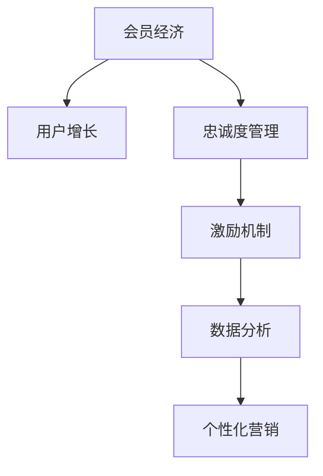

                 

# 会员经济创业：构建忠诚用户群的策略

> 关键词：会员经济, 用户增长, 忠诚度管理, 激励机制, 数据分析, 个性化营销

## 1. 背景介绍

### 1.1 问题由来

在当前的市场竞争中，构建一个忠诚的用户群体变得越来越重要。无论是电商、社交媒体，还是内容订阅平台，如何通过有效的会员体系来提高用户粘性、增加用户生命周期价值（Customer Lifetime Value, CLV），是一个企业持续关注的话题。随着互联网技术和数据驱动营销的迅猛发展，通过构建一个完善的会员体系，不仅可以提高用户满意度，增加用户忠诚度，还能为企业带来可观的商业价值。

### 1.2 问题核心关键点

构建一个有效的会员经济系统，涉及多个关键点，包括会员体系的建立、用户激励机制的设计、数据分析的应用、个性化营销的实现等。本文将从这些关键点出发，详细阐述如何构建一个忠诚的用户群，帮助企业提高用户留存率和转化率，从而提升整体盈利能力。

### 1.3 问题研究意义

构建忠诚用户群，不仅可以提升企业的市场竞争力，还能够带来长期稳定的收入。特别是在数字化时代，拥有忠诚用户群的企业，往往能够更快地适应市场变化，抓住新的商业机会。此外，构建忠诚用户群，还能帮助企业更好地理解用户需求，通过精准的个性化推荐和服务，提高用户的满意度和体验感，从而增加用户的生命周期价值（CLV）。

## 2. 核心概念与联系

### 2.1 核心概念概述

为更好地理解会员经济系统的构建，本节将介绍几个密切相关的核心概念：

- **会员经济**：指通过提供一系列的会员权益和服务，吸引并留住用户，形成一种持续性、稳定性的收入模式。会员经济系统通常包括会员体系、积分系统、增值服务、专属活动等内容。

- **用户增长**：指通过各种营销手段和技术手段，提高用户数量和活跃度的过程。用户增长不仅关注新增用户，更注重已有用户的留存和转化。

- **忠诚度管理**：指通过各种方式提高用户对品牌的忠诚度，包括通过会员体系、积分系统、个性化推荐等方式，提升用户对品牌的依赖和黏性。

- **激励机制**：指通过设定奖惩机制，激励用户进行特定行为，如购买、分享、参与活动等。激励机制可以基于积分、折扣、实物奖励等形式，增强用户参与度。

- **数据分析**：指通过收集、处理和分析用户数据，发现用户行为和偏好的规律，为个性化推荐和精准营销提供依据。数据分析涉及数据采集、清洗、处理和建模等技术环节。

- **个性化营销**：指根据用户行为和偏好，推送个性化的内容、产品和服务，提高用户满意度和转化率。个性化营销需要依赖强大的数据处理和分析能力，以及灵活的营销工具和策略。

这些核心概念之间的逻辑关系可以通过以下Mermaid流程图来展示：



这个流程图展示了几大核心概念及其之间的关系：

1. 会员经济系统通过提供多种会员权益和服务，吸引用户加入。
2. 用户增长策略用于扩大用户基数，提高用户活跃度。
3. 忠诚度管理通过会员体系和激励机制，增强用户对品牌的依赖和忠诚度。
4. 数据分析通过处理用户数据，发现用户行为规律，为个性化营销提供依据。
5. 个性化营销通过推送个性化内容和服务，提高用户满意度和转化率。

这些概念共同构成了会员经济系统的核心框架，帮助企业构建忠诚用户群，提升商业价值。

## 3. 核心算法原理 & 具体操作步骤
### 3.1 算法原理概述

构建忠诚用户群的算法原理，主要基于用户行为分析和个性化推荐。具体来说，通过对用户历史行为数据进行分析和建模，预测用户未来的行为倾向，从而实现个性化推荐和服务。

算法的主要流程包括以下几个步骤：

1. **用户数据采集**：收集用户的基本信息、行为数据、购买记录等，为后续分析提供数据基础。
2. **数据预处理**：对采集到的数据进行清洗、归一化、缺失值处理等，保证数据质量。
3. **用户行为建模**：利用机器学习模型，如协同过滤、深度学习等，对用户行为进行建模，发现用户行为规律。
4. **个性化推荐**：根据用户行为模型，为每个用户推送个性化的产品、内容和服务，提高用户满意度和转化率。
5. **效果评估**：对推荐结果进行效果评估，通过A/B测试等手段，不断优化推荐算法和策略。

### 3.2 算法步骤详解

以下将详细讲解每个步骤的实现方法和具体步骤：

#### 3.2.1 用户数据采集

用户数据采集是构建忠诚用户群的基础。用户数据通常包括以下几类：

- **基本信息**：如年龄、性别、职业、兴趣爱好等。
- **行为数据**：如浏览记录、购买记录、评论记录等。
- **交互数据**：如点击、浏览、停留时间等。
- **社交数据**：如社交网络好友、社交圈等。

数据采集可以通过用户注册、浏览记录、交易记录等方式进行。数据采集完成后，需要对数据进行清洗和预处理，去除噪声和冗余信息，保证数据质量。

#### 3.2.2 数据预处理

数据预处理包括数据清洗、归一化、缺失值处理等。数据清洗主要是去除重复数据、异常数据和无效数据。归一化是将不同特征的值缩放到统一区间，避免不同特征之间的尺度差异对模型的影响。缺失值处理包括填补缺失值和删除缺失数据两种方法。

#### 3.2.3 用户行为建模

用户行为建模是通过机器学习模型对用户行为进行建模，发现用户行为规律。常见的用户行为建模方法包括协同过滤、矩阵分解、深度学习等。

协同过滤是一种基于用户行为相似性的推荐方法，通过计算用户间的相似度，为用户推荐相似用户喜欢的商品。矩阵分解是一种基于矩阵分解的用户行为建模方法，将用户行为矩阵分解为用户隐向量矩阵和物品隐向量矩阵。深度学习则是通过神经网络模型，对用户行为进行深度建模，发现更加复杂的用户行为规律。

#### 3.2.4 个性化推荐

个性化推荐是根据用户行为模型，为每个用户推送个性化的产品、内容和服务。个性化推荐方法包括基于内容的推荐、协同过滤推荐、混合推荐等。

基于内容的推荐是通过分析用户对某些内容的偏好，推荐用户可能感兴趣的其他内容。协同过滤推荐是通过计算用户间的相似度，为用户推荐相似用户喜欢的商品。混合推荐则是将多种推荐方法结合起来，综合不同方法的优势，提高推荐效果。

#### 3.2.5 效果评估

效果评估是评估个性化推荐算法的性能，通过A/B测试等手段，不断优化推荐算法和策略。常用的效果评估指标包括点击率、转化率、用户满意度等。

### 3.3 算法优缺点

构建忠诚用户群的算法具有以下优点：

- 通过用户行为分析，能够发现用户行为规律，实现个性化推荐和服务，提高用户满意度和转化率。
- 能够快速吸引新用户，增加用户粘性，提高用户生命周期价值（CLV）。
- 能够通过数据分析，发现用户流失原因，及时采取措施，降低用户流失率。

同时，该算法也存在一些缺点：

- 数据采集和预处理环节可能存在隐私和数据安全问题。
- 算法模型需要大量历史数据进行训练，对数据质量要求高。
- 推荐效果可能受到用户行为变化的影响，需要不断优化模型和策略。
- 推荐系统可能存在冷启动问题，即新用户或新物品缺乏足够的历史数据。

尽管存在这些局限性，但构建忠诚用户群的算法仍然是大规模营销和服务中不可或缺的技术手段。

### 3.4 算法应用领域

构建忠诚用户群的算法已经在电商、社交媒体、内容订阅平台等多个领域得到了广泛应用，具体包括：

- **电商领域**：通过会员体系、积分系统、优惠券等手段，吸引和留住用户，提升用户复购率。
- **社交媒体**：通过会员订阅、专属内容、社交互动等方式，增强用户对平台的粘性。
- **内容订阅平台**：通过会员等级、专属权益、个性化推荐等方式，提升用户订阅率和留存率。
- **金融服务**：通过会员权益、积分体系、个性化理财服务等，增强用户对金融产品的依赖和忠诚度。
- **教育培训**：通过会员体系、积分系统、个性化学习推荐等方式，提高用户对教育平台的黏性。

除了上述这些领域外，构建忠诚用户群的算法也被创新性地应用到更多场景中，如健康管理、旅游服务等，为不同行业带来新的突破。

## 4. 数学模型和公式 & 详细讲解 & 举例说明
### 4.1 数学模型构建

构建忠诚用户群的算法涉及多个数学模型，以下将详细介绍其中的核心模型。

### 4.2 公式推导过程

#### 4.2.1 协同过滤推荐模型

协同过滤推荐模型基于用户和物品之间的相似度，为用户推荐其他用户喜欢的物品。协同过滤模型的数学表达式如下：

$$
\text{prediction}(u, i) = \sum_{j=1}^{N} \alpha_{uj} \cdot \text{rating}(j, i)
$$

其中，$u$ 为用户，$i$ 为物品，$N$ 为所有物品的集合，$\alpha_{uj}$ 为用户 $u$ 对物品 $j$ 的偏好程度，$\text{rating}(j, i)$ 为物品 $j$ 被用户 $u$ 的评分。

协同过滤模型可以通过矩阵分解的形式进行求解，即将用户行为矩阵 $U \times V$ 分解为用户隐向量矩阵 $U$ 和物品隐向量矩阵 $V$。

#### 4.2.2 深度学习推荐模型

深度学习推荐模型通过神经网络模型对用户行为进行建模，发现更加复杂的用户行为规律。常见的深度学习推荐模型包括基于FM的推荐模型、基于CTR的推荐模型等。

基于FM的推荐模型通过因子分解机（Factorization Machines），对用户行为进行建模。其数学表达式如下：

$$
\text{prediction}(u, i) = \text{bias}(i) + \sum_{j=1}^{N} (\text{feature}(j) \cdot \text{bias}(u) + \text{feature}(j) \cdot \text{feature}(i))
$$

其中，$\text{feature}(j)$ 为物品 $j$ 的特征向量，$\text{bias}(u)$ 为用户 $u$ 的偏置项，$\text{bias}(i)$ 为物品 $i$ 的偏置项。

基于CTR的推荐模型通过点击率预测模型，对用户行为进行建模。其数学表达式如下：

$$
\text{click}(u, i) = \sigma(\text{sigmoid}(u, i) \cdot \text{CTR}(i))
$$

其中，$\text{sigmoid}(u, i)$ 为用户 $u$ 对物品 $i$ 的特征向量，$\text{CTR}(i)$ 为物品 $i$ 的点击率。

### 4.3 案例分析与讲解

#### 4.3.1 亚马逊推荐系统

亚马逊推荐系统是一个经典的协同过滤推荐系统，通过用户行为数据进行推荐。其核心算法包括基于用户的协同过滤算法和基于物品的协同过滤算法。

基于用户的协同过滤算法通过计算用户间的相似度，为用户推荐其他用户喜欢的商品。具体步骤如下：

1. 收集用户的历史行为数据，计算用户之间的相似度。
2. 计算每个用户对所有物品的评分。
3. 根据相似度权重，为用户推荐其他用户喜欢的商品。

基于物品的协同过滤算法通过计算物品间的相似度，为用户推荐其他用户喜欢的商品。具体步骤如下：

1. 收集用户的历史行为数据，计算物品之间的相似度。
2. 计算每个用户对所有物品的评分。
3. 根据相似度权重，为用户推荐其他用户喜欢的商品。

#### 4.3.2 Netflix推荐系统

Netflix推荐系统是一个深度学习推荐系统，通过神经网络模型对用户行为进行建模。其核心算法包括基于FM的推荐模型和基于CTR的推荐模型。

基于FM的推荐模型通过因子分解机对用户行为进行建模。具体步骤如下：

1. 收集用户的历史行为数据，构建用户行为矩阵。
2. 对用户行为矩阵进行因子分解，得到用户隐向量矩阵和物品隐向量矩阵。
3. 使用FM模型预测用户对每个物品的评分。
4. 根据评分预测，为用户推荐物品。

基于CTR的推荐模型通过点击率预测模型对用户行为进行建模。具体步骤如下：

1. 收集用户的历史行为数据，构建用户行为矩阵。
2. 使用CTR模型预测用户对每个物品的点击率。
3. 根据点击率预测，为用户推荐物品。

## 5. 项目实践：代码实例和详细解释说明
### 5.1 开发环境搭建

在进行项目实践前，我们需要准备好开发环境。以下是使用Python进行PyTorch开发的环境配置流程：

1. 安装Anaconda：从官网下载并安装Anaconda，用于创建独立的Python环境。

2. 创建并激活虚拟环境：
```bash
conda create -n pytorch-env python=3.8 
conda activate pytorch-env
```

3. 安装PyTorch：根据CUDA版本，从官网获取对应的安装命令。例如：
```bash
conda install pytorch torchvision torchaudio cudatoolkit=11.1 -c pytorch -c conda-forge
```

4. 安装Transformers库：
```bash
pip install transformers
```

5. 安装各类工具包：
```bash
pip install numpy pandas scikit-learn matplotlib tqdm jupyter notebook ipython
```

完成上述步骤后，即可在`pytorch-env`环境中开始项目实践。

### 5.2 源代码详细实现

下面我们以亚马逊推荐系统为例，给出使用Transformers库进行协同过滤推荐系统的PyTorch代码实现。

首先，定义协同过滤推荐模型的用户数据：

```python
import pandas as pd
import numpy as np
from sklearn.decomposition import TruncatedSVD

# 读取用户行为数据
data = pd.read_csv('user_behavior.csv', sep='\t')

# 构建用户行为矩阵
user_ids = data['user_id'].unique().tolist()
item_ids = data['item_id'].unique().tolist()
user_matrix = np.zeros((len(user_ids), len(item_ids)))
for i in range(len(data)):
    user_id = data.iloc[i]['user_id']
    item_id = data.iloc[i]['item_id']
    user_matrix[user_ids.index(user_id), item_ids.index(item_id)] += 1

# 对用户行为矩阵进行SVD分解
svd = TruncatedSVD(n_components=50, random_state=0)
user_matrix_svd = svd.fit_transform(user_matrix)
```

然后，定义推荐函数：

```python
def recommend(u, top_n=10):
    # 构建用户隐向量
    user_u = user_matrix_svd[u]
    # 计算用户与其他用户的相似度
    similarity = np.dot(user_matrix_svd, user_u.T)
    # 计算相似度权重
    weight = np.sqrt(similarity * similarity + np.finfo(np.float32).eps)
    # 计算其他用户喜欢的物品
    recommendations = np.dot(user_matrix_svd, weight.T)
    # 选择推荐物品的前top_n个
    top_items = np.argsort(recommendations, axis=1)[-top_n:]
    return top_items.tolist()
```

最后，使用推荐函数进行推荐：

```python
u = 0
top_items = recommend(u)
print('Recommended items:', top_items)
```

以上就是使用PyTorch进行亚马逊推荐系统实现的完整代码。可以看到，在实际项目中，需要对用户行为数据进行清洗和预处理，然后使用协同过滤推荐算法进行推荐。

### 5.3 代码解读与分析

让我们再详细解读一下关键代码的实现细节：

**用户数据采集**：
- 通过读取用户行为数据，构建用户行为矩阵。
- 使用SVD分解用户行为矩阵，得到用户隐向量。

**推荐函数实现**：
- 计算用户与其他用户的相似度。
- 计算相似度权重，避免除0错误。
- 计算其他用户喜欢的物品，并返回top_n个推荐物品。

**推荐流程**：
- 选择用户u，调用推荐函数，返回top_n个推荐物品。
- 输出推荐结果。

可以看到，构建忠诚用户群的算法需要处理大规模用户行为数据，并对数据进行特征提取和建模。在实际项目中，还需要对推荐结果进行效果评估和优化。

## 6. 实际应用场景
### 6.1 智能客服系统

智能客服系统通过构建忠诚用户群，提供24小时不间断的客户服务。通过会员体系和积分系统，吸引和留住客户，提高客户满意度和忠诚度。智能客服系统可以实时响应客户咨询，通过自然语言处理技术，理解客户需求，并提供个性化的服务。

### 6.2 金融服务

金融服务行业通过会员体系和积分系统，吸引客户开立账户，并进行投资理财等业务。通过个性化推荐和定制服务，提升客户黏性，增加客户生命周期价值（CLV）。

### 6.3 电商零售

电商零售行业通过会员体系和积分系统，吸引客户进行购物，并进行个性化推荐。通过会员等级和专属权益，提升客户忠诚度，增加客户复购率。

### 6.4 未来应用展望

随着技术的不断发展，构建忠诚用户群的方法也将不断创新。未来的应用场景可能包括：

- **健康管理**：通过会员体系和积分系统，吸引用户进行健康管理和健身训练，提升用户粘性。
- **旅游服务**：通过会员体系和积分系统，吸引用户预订旅游服务，并进行个性化推荐和定制服务。
- **在线教育**：通过会员体系和积分系统，吸引用户进行在线学习，并进行个性化推荐和课程推荐。

## 7. 工具和资源推荐
### 7.1 学习资源推荐

为了帮助开发者系统掌握构建忠诚用户群的技术，这里推荐一些优质的学习资源：

1. 《用户行为分析与建模》系列博文：由大模型技术专家撰写，深入浅出地介绍了用户行为分析和建模的基本概念和核心技术。

2. 《深度学习推荐系统》课程：斯坦福大学开设的推荐系统经典课程，涵盖深度学习推荐系统的各种算法和技术，适合深度学习从业者学习。

3. 《推荐系统实践》书籍：全面介绍了推荐系统开发的各个环节，包括数据采集、数据处理、模型选择、系统部署等。

4. Kaggle推荐系统竞赛：Kaggle平台上的推荐系统竞赛，涵盖协同过滤、深度学习等多种推荐算法，是提升推荐系统技能的绝佳机会。

5. PyTorch官方文档：PyTorch官方文档提供了丰富的推荐系统实现案例，适合动手实践学习。

通过对这些资源的学习实践，相信你一定能够快速掌握构建忠诚用户群的技术，并用于解决实际的商业问题。

### 7.2 开发工具推荐

高效的开发离不开优秀的工具支持。以下是几款用于构建忠诚用户群开发的常用工具：

1. PyTorch：基于Python的开源深度学习框架，灵活动态的计算图，适合快速迭代研究。大部分推荐系统都有PyTorch版本的实现。

2. TensorFlow：由Google主导开发的开源深度学习框架，生产部署方便，适合大规模工程应用。推荐系统的多种实现都基于TensorFlow。

3. Scikit-learn：基于Python的机器学习库，提供了丰富的算法和工具，适合数据预处理和建模。

4. Apache Spark：适合处理大规模数据集，支持分布式计算，适合构建推荐系统等大数据应用。

5. Elasticsearch：分布式搜索和分析引擎，适合处理用户行为数据，支持实时查询和分析。

6. Apache Kafka：分布式消息队列，适合处理实时数据流，支持高吞吐量的数据采集和处理。

合理利用这些工具，可以显著提升构建忠诚用户群项目的开发效率，加快创新迭代的步伐。

### 7.3 相关论文推荐

构建忠诚用户群的研究源于学界的持续研究。以下是几篇奠基性的相关论文，推荐阅读：

1. Factorization Machines for Recommender Systems（FTRL论文）：提出了基于FM的推荐系统，通过因子分解机对用户行为进行建模。

2. A Neural Collaborative Filtering Approach（NCF论文）：提出了基于神经网络的推荐系统，通过深度学习对用户行为进行建模。

3. Matrix Factorization Techniques for Recommender Systems：介绍了矩阵分解的推荐系统，通过SVD等方法对用户行为进行建模。

4. Adaptive Parallel Stochastic Gradient Descent as Follow the Regularized Leader（AP-SGD论文）：提出了适应性并行随机梯度下降算法，提高了推荐系统的训练效率和性能。

5. Online Learning for Matrix Factorization（Warp+SVD论文）：提出了基于在线学习的矩阵分解算法，适合处理实时数据流。

这些论文代表了大规模推荐系统的最新进展，是推荐系统开发的重要参考资料。

## 8. 总结：未来发展趋势与挑战

### 8.1 总结

本文对构建忠诚用户群的算法进行了全面系统的介绍。首先阐述了用户增长和忠诚度管理的重要性，明确了构建忠诚用户群的独特价值。其次，从算法原理和具体操作步骤，详细讲解了如何通过用户行为分析，实现个性化推荐和服务。最后，探讨了构建忠诚用户群在实际应用中的多种场景和未来发展趋势。

通过本文的系统梳理，可以看到，构建忠诚用户群的技术已经广泛应用于各个行业，帮助企业提升用户留存率和转化率，带来可观的商业价值。未来，伴随技术的不断发展，推荐算法和策略将更加智能和高效，构建忠诚用户群将成为企业竞争力的重要手段。

### 8.2 未来发展趋势

构建忠诚用户群的算法将呈现以下几个发展趋势：

1. **个性化推荐**：未来的推荐系统将更加智能化，通过深度学习和机器学习技术，实现更加精准的个性化推荐。

2. **实时推荐**：推荐系统将实时响应用户行为，根据实时数据进行推荐，提高用户满意度。

3. **跨领域推荐**：推荐系统将能够跨领域进行推荐，通过联合学习等技术，提升推荐效果。

4. **多模态推荐**：推荐系统将融合多种模态数据，如文本、图像、视频等，提高推荐的丰富性和多样性。

5. **联邦学习**：推荐系统将采用联邦学习技术，保护用户隐私的同时，提升推荐性能。

6. **可解释性**：推荐系统将更加注重可解释性，通过解释推荐结果，提高用户信任度和满意度。

这些趋势将推动推荐系统向更加智能、高效、可解释的方向发展，提升用户满意度和忠诚度，带来更大的商业价值。

### 8.3 面临的挑战

尽管构建忠诚用户群的技术已经取得了诸多进展，但在推广应用过程中，仍然面临一些挑战：

1. **数据隐私和安全**：在数据采集和处理过程中，如何保护用户隐私，防止数据泄露和滥用，是一个重要问题。

2. **冷启动问题**：新用户或新物品缺乏足够的历史数据，难以进行有效推荐。如何处理冷启动问题，是推荐系统的重要挑战。

3. **多领域覆盖**：不同领域的用户行为和需求存在差异，如何构建通用的推荐模型，覆盖不同领域的用户需求，需要进一步研究和优化。

4. **模型复杂度**：深度学习等复杂模型虽然效果更好，但计算资源消耗大，训练时间长。如何提高模型训练效率，减少资源消耗，是推荐系统需要解决的难题。

5. **用户可解释性**：推荐系统的决策过程难以解释，用户难以理解推荐结果的依据。如何提高推荐系统的可解释性，是提高用户信任度和满意度的重要手段。

这些挑战需要通过技术创新和多方协作，逐步克服，推动推荐系统向更加智能、高效、可解释的方向发展。

### 8.4 研究展望

面对构建忠诚用户群所面临的挑战，未来的研究需要在以下几个方面寻求新的突破：

1. **可解释性增强**：通过引入可解释性技术，如因果分析、知识图谱等，增强推荐系统的可解释性，提高用户信任度和满意度。

2. **数据隐私保护**：通过差分隐私、联邦学习等技术，保护用户隐私，防止数据泄露和滥用。

3. **冷启动优化**：通过迁移学习、少样本学习等技术，解决新用户和新物品的冷启动问题，提升推荐效果。

4. **多领域适配**：通过跨领域联合学习、多模态推荐等技术，构建通用的推荐模型，覆盖不同领域的用户需求。

5. **实时推荐系统**：通过实时数据流处理技术，如Spark Streaming、Kafka等，实现实时推荐，提高用户满意度。

6. **个性化推荐算法**：通过深度学习、强化学习等技术，实现更加智能和个性化的推荐，提升用户留存率和转化率。

这些研究方向将引领推荐系统向更加智能、高效、可解释的方向发展，推动构建忠诚用户群技术的进一步突破。

## 9. 附录：常见问题与解答

**Q1：如何构建有效的会员体系？**

A: 构建有效的会员体系需要考虑多个方面，包括会员权益的设计、会员等级的设置、会员活动的策划等。首先，需要明确会员体系的目标和价值，设计合理的会员权益，吸引用户加入。其次，根据用户的行为和消费，设计多等级会员体系，激励用户不断升级。最后，通过策划多种会员活动，增强用户参与感和忠诚度。

**Q2：如何选择推荐算法？**

A: 推荐算法的选择需要根据业务场景和数据特点进行综合考虑。一般来说，协同过滤算法适用于冷启动问题较少，数据量较大的场景。深度学习算法适用于数据量较大，但冷启动问题较多的场景。混合推荐算法则结合了多种推荐方法的优势，适用于多种场景。

**Q3：如何评估推荐系统的效果？**

A: 推荐系统的效果评估主要通过点击率、转化率、用户满意度等指标进行衡量。可以通过A/B测试等手段，不断优化推荐算法和策略，提高推荐效果。

**Q4：如何处理冷启动问题？**

A: 冷启动问题可以通过少样本学习、迁移学习等技术解决。少样本学习可以通过少数样本来训练推荐模型，解决新物品和新用户的推荐问题。迁移学习则可以通过跨领域、跨数据源的迁移学习，提升推荐性能。

**Q5：如何提高推荐系统的可解释性？**

A: 提高推荐系统的可解释性可以通过引入可解释性技术，如因果分析、知识图谱等，增强推荐系统的透明度和可信度。同时，可以通过可视化技术，展示推荐系统的决策过程，提高用户信任度。

---

作者：禅与计算机程序设计艺术 / Zen and the Art of Computer Programming

