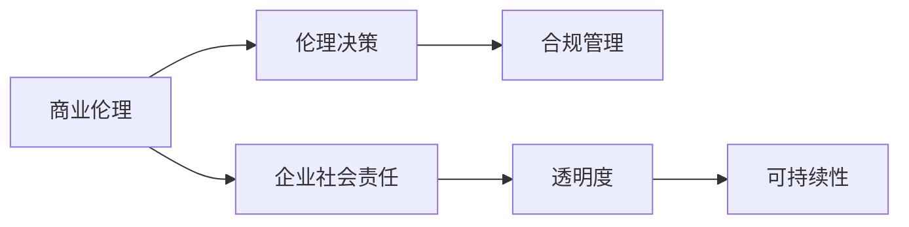

                 

# 伦理管理：在商业决策中保持道德标准

> 关键词：商业伦理,企业决策,道德规范,责任意识,法律合规

## 1. 背景介绍

### 1.1 问题由来
随着经济的全球化和科技的迅猛发展，企业面临的商业环境和经营挑战日益复杂。如何在商业决策中平衡企业利益与道德标准，保持长期可持续性，成为了企业管理者和决策者面临的重要课题。近年来，频频曝光的商业丑闻和企业治理失败案例，更是凸显了伦理管理的重要性。

### 1.2 问题核心关键点
现代商业伦理管理的核心在于，如何将道德规范和责任意识内化为企业的核心价值观，并融入到日常的商业决策过程中，确保企业在追求利润的同时，不损害公众利益，不破坏环境，不违背社会公正原则。

### 1.3 问题研究意义
商业伦理管理不仅有助于提升企业声誉和公众信任，还能够有效规避法律风险，确保企业行为合法合规。良好的伦理管理能够促进企业与社会的和谐共生，实现经济效益和社会价值的双赢。

## 2. 核心概念与联系

### 2.1 核心概念概述

为更好地理解商业伦理管理的核心思想和具体实践，本节将介绍几个关键概念：

- **商业伦理(Business Ethics)**：指企业在商业活动中遵循的道德准则和规范，涉及对员工、客户、供应商、社区、环境等方面的责任和义务。
- **企业社会责任(Corporate Social Responsibility, CSR)**：企业在追求经济效益的同时，还应承担起对社会的责任，包括环境保护、员工福利、慈善捐赠等方面。
- **伦理决策(Ethical Decision Making)**：在商业决策过程中，企业应综合考虑道德、法律、经济等多方面因素，做出符合道德标准的决策。
- **合规管理(Compliance Management)**：确保企业遵守法律法规，防范合规风险，避免违法违规行为。
- **透明度(Transparency)**：企业应保持信息公开透明，主动接受社会监督，提升公信力。
- **可持续性(Sustainability)**：企业在追求短期利益的同时，还应考虑长远发展，实现经济效益与环境、社会效益的协调。

这些核心概念共同构成了商业伦理管理的框架，指导企业在复杂多变的商业环境中做出符合道德、法律和社会规范的决策。

### 2.2 核心概念原理和架构的 Mermaid 流程图



这个流程图展示了商业伦理管理中的核心概念及其联系：

1. 商业伦理是企业社会责任的基础，指导企业的行为规范。
2. 伦理决策是企业行为的核心指导原则，要求企业综合考虑多方面因素。
3. 合规管理是保障企业行为合法合规的关键，避免法律风险。
4. 透明度是企业公信力的重要保障，增强社会信任。
5. 可持续性是企业长期发展的关键，促进经济与环境、社会的和谐共生。

## 3. 核心算法原理 & 具体操作步骤

### 3.1 算法原理概述

商业伦理管理的基本思想是，在商业决策中综合考虑道德、法律、经济等多方面因素，确保企业的行为符合社会的伦理标准。其核心算法原理包括：

1. **道德准则的引入**：在决策模型中引入道德准则，通过权重或阈值等方式，对道德标准进行量化和优先级排序。
2. **法律合规的约束**：将法律合规要求嵌入决策模型，确保企业行为符合法律法规。
3. **经济利益的评估**：通过经济模型评估不同决策方案的经济效益，并结合道德和法律因素，进行综合决策。
4. **伦理训练的数据集构建**：利用历史数据和专家知识，构建包含道德和法律约束的数据集，用于训练决策模型。

### 3.2 算法步骤详解

商业伦理管理的算法步骤包括：

**Step 1: 数据收集与预处理**
- 收集企业的历史决策数据，包括决策情境、结果、道德和法律因素等。
- 清洗和预处理数据，去除无关特征，标准化数据格式。

**Step 2: 道德准则的建模**
- 定义道德准则，如诚信、公正、尊重等，将其量化为不同的维度。
- 确定每个准则的权重，建立道德准则模型。

**Step 3: 法律合规的约束**
- 收集和整理相关法律法规，构建合规约束规则。
- 将合规约束规则嵌入决策模型，确保决策合法合规。

**Step 4: 经济模型的构建**
- 建立经济模型，评估不同决策方案的经济效益。
- 将道德准则和合规约束规则作为约束条件，加入经济模型。

**Step 5: 决策模型的训练与评估**
- 利用训练数据，训练决策模型。
- 在测试数据集上评估模型效果，调整参数和权重。

**Step 6: 实际应用与监控**
- 将训练好的决策模型应用于实际商业决策中。
- 实时监控决策过程，确保符合道德和法律标准。

### 3.3 算法优缺点

商业伦理管理算法具有以下优点：
1. 综合考虑道德、法律和经济因素，确保决策的全面性和公正性。
2. 通过模型训练，提升决策的透明度和可解释性，便于事后审计。
3. 自动化的决策过程，减少人为偏差，提升决策的客观性。

同时，也存在一些局限性：
1. 道德准则和法律规范的复杂性可能导致模型难以完全覆盖，存在潜在的决策盲区。
2. 数据质量和隐私问题可能影响模型的训练效果。
3. 经济模型的复杂性可能增加决策过程的复杂度，降低决策效率。
4. 模型的解释性和可解释性仍需进一步提升，确保决策过程的透明和可信。

### 3.4 算法应用领域

商业伦理管理算法可以广泛应用于各种商业决策场景，如：

- 市场营销：在推广活动设计和内容创作中，确保广告内容的真实性和不误导消费者。
- 产品设计：在产品研发和设计过程中，考虑产品对社会和环境的影响，确保环保和社会责任。
- 供应链管理：在供应链选择和物流规划中，考虑供应链伦理和合规要求，确保供应商的社会责任。
- 人力资源管理：在招聘和员工管理中，确保公平招聘和合理薪酬，避免歧视和利益冲突。
- 客户服务：在客户互动和客户关系管理中，确保服务质量和客户权益，避免不当营销和隐私泄露。
- 投资决策：在金融投资和资产管理中，考虑道德和合规要求，避免利益冲突和不当行为。

## 4. 数学模型和公式 & 详细讲解 & 举例说明

### 4.1 数学模型构建

本节将使用数学语言对商业伦理管理的核心算法进行详细描述。

假设企业面临一个二元决策问题，即是否采取某项措施（记为 $X$）。设 $D$ 为决策情境，$M$ 为决策结果，$E$ 为经济效益，$L$ 为法律合规性，$E$ 为道德准则。则决策模型可表示为：

$$
f(D, X) = E(D, X) \cdot M(D, X) + \lambda_L L(D, X) + \lambda_E E(D, X)
$$

其中 $\lambda_L$ 和 $\lambda_E$ 分别为法律合规和道德准则的权重系数。

### 4.2 公式推导过程

- 首先，对决策情境 $D$ 进行特征提取和编码，得到决策特征向量 $\mathbf{d}$。
- 然后，对决策措施 $X$ 进行量化和编码，得到措施特征向量 $\mathbf{x}$。
- 接着，利用历史数据和专家知识，构建经济模型 $E(D, X)$，评估不同措施的经济效益。
- 将法律合规和道德准则模型 $L(D, X)$ 和 $E(D, X)$ 作为约束条件，加入决策模型。
- 最后，通过优化算法，求解最大化的决策得分 $f(D, X)$，选择得分最高的决策措施。

### 4.3 案例分析与讲解

假设一家制造企业需要在新市场的推广活动中选择广告形式（电视广告或网络广告）。设 $D$ 为推广时间和预算，$X$ 为广告形式，$E$ 为经济效益，$L$ 为法律合规性，$E$ 为道德准则。

根据历史数据和市场调查，构建经济模型 $E(D, X)$，并设定法律合规模型 $L(D, X)$ 和道德准则模型 $E(D, X)$。假设法律合规要求广告内容不得有虚假宣传，道德准则要求广告不得有性别歧视。

将数据输入决策模型，通过优化算法求解，得到最大化的决策得分 $f(D, X)$。若得分最高的决策措施为电视广告，则选择电视广告作为最终推广形式。

## 5. 项目实践：代码实例和详细解释说明

### 5.1 开发环境搭建

在进行商业伦理管理项目实践前，需要准备好开发环境。以下是使用Python进行Sympy和Pandas开发的环境配置流程：

1. 安装Anaconda：从官网下载并安装Anaconda，用于创建独立的Python环境。

2. 创建并激活虚拟环境：
```bash
conda create -n ethics-env python=3.8 
conda activate ethics-env
```

3. 安装Sympy和Pandas：
```bash
conda install sympy pandas
```

4. 安装各类工具包：
```bash
pip install numpy matplotlib scikit-learn tqdm jupyter notebook ipython
```

完成上述步骤后，即可在`ethics-env`环境中开始项目实践。

### 5.2 源代码详细实现

以下是一个简单的商业伦理管理决策模型代码实现：

```python
import sympy as sp
import pandas as pd
from sympy import symbols, Rational, pi

# 定义决策变量
D, X = symbols('D X')

# 定义决策情境和措施
D_values = [1, 2, 3, 4]
X_values = [0, 1]

# 构建经济模型
E = sp.Matrix([[1, 2], [2, 3]])

# 构建法律合规模型
L = sp.Matrix([[0, 1], [1, 1]])

# 构建道德准则模型
E = sp.Matrix([[0, 1], [1, 1]])

# 定义决策模型
f = E * X + sp.pi * L * X + sp.pi * E * X

# 求解决策得分
solution = sp.solve(f, X)

# 输出最优决策
best_decision = max(solution)
print(f"最优决策为: {best_decision}")
```

### 5.3 代码解读与分析

让我们再详细解读一下关键代码的实现细节：

**决策变量定义**：
- 使用Sympy定义决策变量 $D$ 和 $X$，表示推广时间和广告形式。

**决策情境和措施定义**：
- 定义推广时间和广告形式的取值范围，分别为1到4和0或1。

**经济模型构建**：
- 使用Sympy构建经济模型 $E$，评估不同措施的经济效益。

**法律合规和道德准则模型构建**：
- 使用Sympy构建法律合规模型 $L$ 和道德准则模型 $E$，分别表示法律合规要求和道德准则要求。

**决策模型构建**：
- 定义决策模型 $f$，综合考虑经济模型、法律合规模型和道德准则模型，求解最大化的决策得分。

**决策得分求解**：
- 使用Sympy求解决策得分，得到最优决策措施。

**最优决策输出**：
- 输出最优决策措施。

可以看到，商业伦理管理决策模型通过引入道德准则和法律合规要求，对经济模型进行约束和优化，实现了多方面因素的综合考虑和决策。

## 6. 实际应用场景

### 6.1 智能制造

智能制造企业面临复杂的决策环境，需要在生产、研发、供应链管理等多个方面进行伦理管理。通过商业伦理管理算法，智能制造企业可以确保决策过程符合道德标准和法律要求，提升企业形象和社会声誉。

### 6.2 医疗健康

医疗健康领域的企业需要处理大量的患者数据和医疗决策，涉及隐私保护、伦理审查等多方面要求。通过商业伦理管理算法，医疗健康企业可以确保数据使用的合法合规，提升患者信任和满意度。

### 6.3 金融科技

金融科技企业需要处理大量的客户数据和金融交易，涉及隐私保护、合规审查等多方面要求。通过商业伦理管理算法，金融科技企业可以确保交易的透明和公正，提升客户信任和品牌形象。

### 6.4 未来应用展望

随着技术的进步和社会的进步，商业伦理管理算法将在更多领域得到应用，为企业的可持续发展提供保障。未来，商业伦理管理算法将进一步融入企业决策系统，成为企业决策的必备工具。同时，算法也将不断优化，提升决策的全面性和透明性，助力企业构建更公正、透明、可持续的商业模式。

## 7. 工具和资源推荐

### 7.1 学习资源推荐

为了帮助开发者系统掌握商业伦理管理的理论和实践，这里推荐一些优质的学习资源：

1. **《商业伦理管理》系列博文**：由商业伦理管理专家撰写，深入浅出地介绍了商业伦理管理的核心思想和实践方法。

2. **哈佛大学《商业伦理》课程**：哈佛大学开设的商业伦理课程，涵盖了商业伦理的理论基础和实际应用，是学习和研究商业伦理管理的经典教材。

3. **《企业社会责任》书籍**：商业伦理管理的重要组成部分，介绍了企业社会责任的理论和实践，是商业伦理管理的重要参考。

4. **国际商业伦理中心**：提供商业伦理管理培训和认证，涵盖国际商业伦理规范和最佳实践，是商业伦理管理的权威资源。

5. **《责任与成功》系列文章**：探讨企业社会责任和商业伦理管理的深度话题，是了解商业伦理管理前沿动态的重要窗口。

通过学习这些资源，相信你一定能够全面掌握商业伦理管理的精髓，并用于解决实际的商业问题。

### 7.2 开发工具推荐

商业伦理管理的开发离不开优秀的工具支持。以下是几款用于商业伦理管理开发的常用工具：

1. **Python**：作为商业伦理管理的主要开发语言，Python提供了丰富的库和框架，支持数据处理、模型构建和决策分析。

2. **Sympy**：用于数学建模和符号计算，支持复杂数学模型的构建和求解。

3. **Pandas**：用于数据处理和分析，支持大规模数据集的快速处理和分析。

4. **Jupyter Notebook**：用于数据可视化、模型构建和决策分析，支持交互式编程和结果展示。

5. **TensorBoard**：用于模型训练和可视化，支持模型结构、参数和性能的可视化展示。

6. **Weights & Biases**：用于模型实验跟踪和分析，支持模型性能的可视化展示和调优。

合理利用这些工具，可以显著提升商业伦理管理的开发效率，加快创新迭代的步伐。

### 7.3 相关论文推荐

商业伦理管理的发展源于学界的持续研究。以下是几篇奠基性的相关论文，推荐阅读：

1. **《商业伦理管理：理论与实践》**：商业伦理管理领域的经典之作，全面介绍了商业伦理管理的理论基础和实践方法。

2. **《企业社会责任与可持续发展》**：探讨企业社会责任和可持续发展的关系，提供了商业伦理管理的实践案例。

3. **《责任与成功：商业伦理管理的新挑战》**：探讨商业伦理管理的新挑战和未来发展方向，提供了前沿的思考和建议。

4. **《商业伦理与人工智能：未来之路》**：探讨人工智能在商业伦理管理中的应用，提供了未来发展的方向和建议。

这些论文代表了大规模语言模型微调技术的发展脉络。通过学习这些前沿成果，可以帮助研究者把握学科前进方向，激发更多的创新灵感。

## 8. 总结：未来发展趋势与挑战

### 8.1 总结

本文对商业伦理管理的核心思想和实践方法进行了全面系统的介绍。首先阐述了商业伦理管理的研究背景和意义，明确了伦理管理在企业决策中的重要性。其次，从原理到实践，详细讲解了商业伦理管理的数学模型和操作步骤，给出了决策模型的完整代码实现。同时，本文还探讨了商业伦理管理在智能制造、医疗健康、金融科技等领域的实际应用，展示了其广泛的应用前景。最后，本文精选了商业伦理管理的各类学习资源和开发工具，力求为读者提供全方位的技术指引。

通过本文的系统梳理，可以看到，商业伦理管理在复杂多变的商业环境中，通过综合考虑道德、法律和经济因素，帮助企业在追求经济效益的同时，保持道德标准和法律合规，实现长期的可持续性。未来，商业伦理管理算法将在更多领域得到应用，为企业的可持续发展提供保障。

### 8.2 未来发展趋势

展望未来，商业伦理管理将呈现以下几个发展趋势：

1. **AI驱动的伦理管理**：随着AI技术的不断发展，AI驱动的伦理管理将逐渐普及，帮助企业更高效、更全面地进行伦理决策。

2. **透明化与可解释性**：商业伦理管理算法将进一步提升决策的透明性和可解释性，确保决策过程的公正和透明。

3. **跨文化伦理管理**：随着全球化进程的加快，跨文化伦理管理将成为一个重要课题，帮助企业在全球市场中保持一致的道德标准。

4. **社会责任与企业绩效**：企业社会责任与企业绩效的关系将得到更深入的研究，帮助企业找到平衡点，实现经济效益和社会价值的双赢。

5. **伦理合规一体化**：商业伦理管理与合规管理的融合将更加紧密，实现合规要求和伦理标准的协同管理。

6. **伦理风险评估**：商业伦理管理将引入伦理风险评估机制，提前识别和防范潜在的伦理风险。

以上趋势凸显了商业伦理管理的广阔前景。这些方向的探索发展，必将进一步提升商业伦理管理的精度和效率，为企业的可持续发展提供坚实保障。

### 8.3 面临的挑战

尽管商业伦理管理已经取得了一定的进展，但在迈向更加智能化、普适化应用的过程中，仍面临诸多挑战：

1. **伦理准则的多样性**：不同国家和地区的伦理准则存在差异，如何在全球化背景下制定统一的伦理标准，是一个复杂的问题。

2. **数据隐私与保护**：商业决策涉及大量客户数据和个人隐私，如何在保护隐私的前提下进行数据处理和分析，是一个重要的挑战。

3. **伦理决策的自动化**：虽然商业伦理管理算法已经取得了一定的进展，但仍需提升其自动化程度，减少人为干预，提升决策的客观性和公正性。

4. **伦理与法律的协调**：商业伦理管理需要与法律法规相结合，如何确保伦理决策与法律要求的协调一致，是一个重要的挑战。

5. **伦理决策的透明度**：虽然商业伦理管理算法提升了决策的透明度，但仍需进一步优化，确保决策过程的透明和可解释性。

6. **伦理决策的公平性**：商业伦理管理算法需要确保决策的公平性，避免因数据偏差、算法偏见等因素导致的不公平决策。

面对这些挑战，未来的研究需要在以下几个方面寻求新的突破：

1. **跨文化伦理规范的研究**：研究不同国家和地区的伦理规范，找到共同点，制定统一的伦理准则。

2. **数据隐私保护技术的研究**：研究数据隐私保护技术，确保客户数据和个人隐私的安全。

3. **伦理决策自动化技术的研究**：开发更加自动化、智能化的伦理决策算法，减少人为干预。

4. **伦理与法律的协同机制**：研究伦理决策与法律要求的协同机制，确保决策的合法合规。

5. **决策过程的透明性**：进一步提升决策过程的透明性和可解释性，确保决策的公正和透明。

6. **公平性保障机制**：研究公平性保障机制，确保决策的公平性和公正性。

这些研究方向的探索，必将引领商业伦理管理技术迈向更高的台阶，为构建公平、透明、可持续的商业环境提供坚实保障。

### 8.4 研究展望

面向未来，商业伦理管理需要不断突破现有技术瓶颈，寻求新的创新突破。未来，商业伦理管理技术将在以下几个方面进行深入探索：

1. **AI驱动的伦理管理**：利用AI技术，提升伦理决策的自动化程度，减少人为干预，提高决策的客观性和公正性。

2. **跨文化伦理规范**：研究不同国家和地区的伦理规范，找到共同点，制定统一的伦理准则，实现跨文化伦理管理。

3. **数据隐私保护**：研究数据隐私保护技术，确保客户数据和个人隐私的安全，提升数据处理的可信度。

4. **透明化与可解释性**：进一步提升决策过程的透明性和可解释性，确保决策过程的公正和透明。

5. **伦理与法律的协同**：研究伦理决策与法律要求的协同机制，确保决策的合法合规。

6. **公平性保障**：研究公平性保障机制，确保决策的公平性和公正性，避免因数据偏差、算法偏见等因素导致的不公平决策。

这些研究方向的探索，必将引领商业伦理管理技术迈向更高的台阶，为构建公平、透明、可持续的商业环境提供坚实保障。

## 9. 附录：常见问题与解答

**Q1: 商业伦理管理是否适用于所有企业？**

A: 商业伦理管理适用于各种类型的企业，包括传统制造企业、高科技企业、金融企业、医疗健康企业等。在面对复杂的商业环境和多元化的利益诉求时，商业伦理管理能够帮助企业更好地进行决策，实现经济效益和社会价值的双赢。

**Q2: 商业伦理管理如何实现透明化与可解释性？**

A: 通过引入透明的决策流程和可解释的决策模型，商业伦理管理可以实现透明化与可解释性。具体而言，可以将决策过程和决策模型公开透明，接受外部监督和审查，确保决策过程的公正和透明。同时，可以通过可视化工具和报告，展示决策过程和结果，提高决策的可解释性。

**Q3: 商业伦理管理如何处理伦理与法律的协调？**

A: 商业伦理管理需要在法律合规和伦理规范之间找到平衡点，确保决策符合法律要求和伦理标准。具体而言，可以通过构建合规与伦理协同模型，综合考虑法律合规和伦理标准，确保决策的合法合规和道德标准。同时，可以通过定期审计和评估，发现和解决伦理与法律协调中的问题。

**Q4: 商业伦理管理如何应对数据隐私保护？**

A: 商业伦理管理需要在数据使用和隐私保护之间找到平衡点，确保客户数据和个人隐私的安全。具体而言，可以采用数据脱敏、加密等技术，保护数据隐私。同时，可以建立透明的数据使用规则，确保数据使用的合法合规和客户知情同意。

**Q5: 商业伦理管理如何实现公平性保障？**

A: 商业伦理管理需要在公平性和公正性之间找到平衡点，确保决策的公平性和公正性。具体而言，可以通过引入公平性保障机制，如多样性审计、公平性评估等，确保决策不受数据偏差和算法偏见的影响。同时，可以通过定期审查和改进，不断提升决策的公平性和公正性。

这些问题的解答，可以帮助你更好地理解商业伦理管理的核心思想和具体实践，为解决实际的商业问题提供参考和指导。

---

作者：禅与计算机程序设计艺术 / Zen and the Art of Computer Programming

