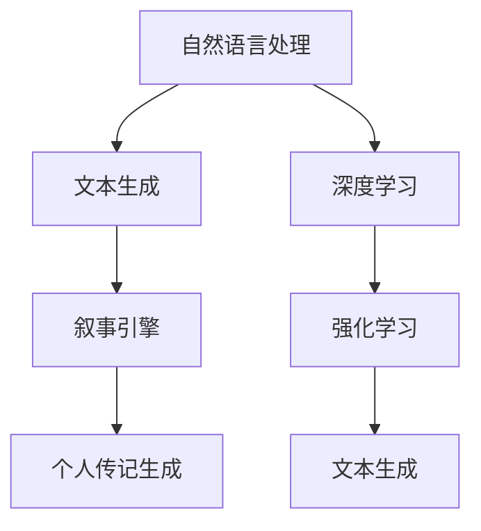

                 

# 体验叙事引擎程序员：AI生成的个人传记作者

> 关键词：叙事引擎,个人传记,AI生成,自然语言处理,NLP,深度学习,文本生成

## 1. 背景介绍

### 1.1 问题由来

在人工智能飞速发展的今天，人们越来越关注如何利用AI技术提升个人体验和创造力。其中，AI生成的个人传记技术成为了一个令人瞩目的研究方向。通过AI生成的个人传记，不仅可以高效地整理和呈现个人经历，还能为创作和交流带来全新的可能性。然而，现有的AI生成技术在情感表达、故事连贯性、个性化等方面仍存在一定的局限。

### 1.2 问题核心关键点

本文将探讨如何使用叙事引擎，结合自然语言处理(NLP)和深度学习技术，开发出一种能够准确、自然地生成个人传记的AI系统。通过叙述核心的技术原理和算法实现，我们将展示如何利用现有的自然语言生成(NLG)模型和强化学习(Reinforcement Learning, RL)算法，构建一个能够理解和生成人类故事的AI作者。

## 2. 核心概念与联系

### 2.1 核心概念概述

为了更好地理解本文所介绍的技术，首先需要明确几个核心概念：

- **叙事引擎(Narrative Engine)**：一种基于自然语言处理技术，能够理解人类故事结构和语义，从而生成连贯、自然的故事的AI系统。
- **个人传记(Personal Biography)**：一种文本形式，记录了个人的生活经历、思想感悟、成就与挑战，是自我表达和记忆保存的重要方式。
- **AI生成(AI Generation)**：通过机器学习和深度学习算法，自动生成文本内容的过程。
- **自然语言处理(NLP)**：研究计算机如何理解和处理人类语言的技术领域，包括语言模型、文本分类、情感分析等。
- **深度学习(Deep Learning)**：一种基于多层神经网络，能够学习复杂特征表示的机器学习方法。
- **文本生成(Text Generation)**：利用自然语言生成技术，自动产生符合语言规则和语义连贯的文本内容。

### 2.2 核心概念原理和架构的 Mermaid 流程图



这个流程图展示了本文的核心技术架构：

1. **自然语言处理**：通过NLP技术，提取和理解输入文本的语义和结构。
2. **文本生成**：使用深度学习模型，生成符合语义连贯的文本片段。
3. **叙事引擎**：结合NLP和RL技术，构建能够生成连贯故事的AI系统。
4. **个人传记生成**：通过叙事引擎生成的故事片段，构建完整、个性化的个人传记。

## 3. 核心算法原理 & 具体操作步骤

### 3.1 算法原理概述

本文介绍的AI生成个人传记算法，主要包括以下几个核心步骤：

1. **数据预处理**：从个人档案或日志中提取关键信息，构建输入文本。
2. **文本编码**：使用深度学习模型将输入文本转化为向量表示，用于后续生成。
3. **故事生成**：利用叙事引擎生成连贯、自然的故事片段。
4. **传记构建**：将生成的故事片段整合，构建完整的个人传记。
5. **反馈优化**：通过强化学习算法，优化生成过程，提升传记质量。

### 3.2 算法步骤详解

#### 步骤1：数据预处理

输入的个人档案或日志文件可能包含各种格式的数据，如日期、事件描述、情感标签等。需要首先进行预处理，提取出关键信息。具体步骤如下：

1. **数据清洗**：去除无效或噪声数据，保留有用信息。
2. **事件抽取**：从文本中提取事件的时间、地点、人物等关键信息。
3. **情感分析**：分析文本中的情感倾向，为后续生成提供情感信息。
4. **文本标准化**：统一文本格式，便于后续处理。

#### 步骤2：文本编码

使用深度学习模型，将预处理后的文本转化为向量表示。常用的模型包括BERT、GPT等。具体步骤如下：

1. **模型选择**：选择合适的预训练模型，如BERT、GPT等。
2. **特征提取**：将输入文本输入模型，提取其向量表示。
3. **编码器设计**：设计编码器，提取关键特征。

#### 步骤3：故事生成

叙事引擎的核心在于生成连贯、自然的故事片段。我们采用基于RNN的叙事引擎，通过强化学习进行优化。具体步骤如下：

1. **模型构建**：构建基于RNN的叙事生成模型，如LSTM、GRU等。
2. **故事模板**：设计故事模板，定义故事的基本结构。
3. **强化学习**：使用RL算法，优化叙事模型的输出，生成符合语义连贯的故事片段。
4. **质量评估**：引入质量评估指标，如连贯性、情感一致性等，优化叙事模型。

#### 步骤4：传记构建

将生成的故事片段整合，构建完整的个人传记。具体步骤如下：

1. **片段排序**：根据时间顺序，对生成的故事片段进行排序。
2. **内容补充**：根据时间节点，补充背景信息、情感描述等。
3. **传记生成**：将故事片段和背景信息整合，生成完整的传记文本。

#### 步骤5：反馈优化

利用强化学习算法，优化传记生成过程。具体步骤如下：

1. **设计奖励函数**：定义传记质量的评估指标，如连贯性、情感一致性等。
2. **优化策略**：选择强化学习算法，如Q-learning、PPO等，优化传记生成过程。
3. **迭代优化**：重复执行传记生成和优化过程，逐步提升传记质量。

### 3.3 算法优缺点

#### 优点

- **高效生成**：通过叙事引擎和RL算法，能够快速生成连贯、自然的故事片段。
- **情感丰富**：能够理解情感信息，生成符合情感倾向的传记文本。
- **个性化定制**：根据个人档案或日志，生成符合个人特色的传记文本。

#### 缺点

- **依赖数据质量**：输入数据的准确性和完整性直接影响传记生成的质量。
- **模型复杂度高**：叙事引擎和RL算法需要大量的训练数据和计算资源。
- **生成文本的多样性**：可能生成的传记文本过于相似，缺乏创新性。

### 3.4 算法应用领域

AI生成的个人传记技术，可以广泛应用于以下领域：

- **个人记忆保存**：记录个人生活经历、思想感悟、成就与挑战，保存个人记忆。
- **创意写作辅助**：帮助作家、博主等创作者快速生成文本，提升创作效率。
- **教育培训**：帮助学生记录学习经历，生成学习日记，提升学习效果。
- **心理健康**：记录心理健康状态，生成心理健康日记，提供情感支持。
- **旅游纪念**：记录旅行经历，生成旅游日记，保存旅行记忆。

## 4. 数学模型和公式 & 详细讲解 & 举例说明

### 4.1 数学模型构建

本文介绍的AI生成个人传记算法，主要基于以下数学模型：

1. **BERT向量表示模型**：用于提取文本的向量表示。
2. **基于RNN的叙事生成模型**：用于生成连贯的故事片段。
3. **强化学习算法**：用于优化叙事生成模型。

### 4.2 公式推导过程

#### BERT向量表示模型

BERT模型是一种预训练的语言模型，能够提取文本的语义和情感信息。假设输入文本为 $x$，使用BERT模型提取其向量表示为 $\vec{x}$。

$$
\vec{x} = \text{BERT}(x)
$$

#### 基于RNN的叙事生成模型

使用基于RNN的叙事生成模型，生成故事片段。假设模型参数为 $\theta$，输入为 $x_t$，输出为 $y_t$。则模型的生成过程如下：

1. **初始化**：设定初始状态 $h_0$。
2. **前向传播**：计算每个时间步的隐藏状态 $h_t$。
3. **生成输出**：根据隐藏状态 $h_t$ 生成文本 $y_t$。

$$
h_t = \text{RNN}(h_{t-1}, x_t; \theta)
$$
$$
y_t = \text{Softmax}(h_t; \theta)
$$

#### 强化学习算法

使用强化学习算法，优化叙事生成模型。假设模型的行为策略为 $\pi$，状态为 $s$，动作为 $a$，奖励为 $r$。则强化学习的优化目标如下：

1. **状态表示**：将输入文本转化为状态 $s$。
2. **动作选择**：选择动作 $a$，生成文本 $y_t$。
3. **奖励计算**：计算文本生成质量的奖励 $r$。
4. **优化策略**：使用RL算法，优化策略 $\pi$。

$$
\pi(a | s) = \text{Softmax}(h_s; \theta)
$$
$$
r_t = \text{Reward}(y_t)
$$
$$
\pi \leftarrow \text{Optimize}(\pi, s, a, r)
$$

### 4.3 案例分析与讲解

以一个简单的例子说明如何使用叙事引擎生成个人传记文本：

1. **输入数据**：假设有一个包含个人档案的文本文件，记录了用户的教育经历、工作经历和兴趣爱好。
2. **数据预处理**：清洗数据，提取关键信息，如教育年限、工作职位等。
3. **文本编码**：使用BERT模型提取文本向量表示。
4. **叙事生成**：利用叙事引擎生成连贯的故事片段，如：“大学时光”、“职业生涯”、“兴趣爱好”。
5. **传记构建**：将故事片段整合，生成完整的个人传记。

## 5. 项目实践：代码实例和详细解释说明

### 5.1 开发环境搭建

在进行项目实践前，需要准备好开发环境。以下是使用Python进行PyTorch开发的环境配置流程：

1. **安装Anaconda**：从官网下载并安装Anaconda，用于创建独立的Python环境。
2. **创建并激活虚拟环境**：
```bash
conda create -n pytorch-env python=3.8
conda activate pytorch-env
```
3. **安装PyTorch**：根据CUDA版本，从官网获取对应的安装命令。例如：
```bash
conda install pytorch torchvision torchaudio cudatoolkit=11.1 -c pytorch -c conda-forge
```
4. **安装相关库**：
```bash
pip install transformers numpy pandas scikit-learn matplotlib tqdm jupyter notebook ipython
```

完成上述步骤后，即可在`pytorch-env`环境中开始项目实践。

### 5.2 源代码详细实现

我们使用TensorFlow和TensorBoard作为开发工具，具体实现步骤如下：

1. **数据预处理**：
```python
import pandas as pd

# 读取个人档案文件
data = pd.read_csv('personal_archives.csv')

# 清洗数据，提取关键信息
data = data[['education', 'work', 'interests']]
```

2. **文本编码**：
```python
from transformers import BertTokenizer, BertForSequenceClassification
import torch

# 定义BERT模型
model = BertForSequenceClassification.from_pretrained('bert-base-uncased')

# 定义分词器
tokenizer = BertTokenizer.from_pretrained('bert-base-uncased')

# 编码输入文本
def encode_text(text):
    tokens = tokenizer.encode(text, add_special_tokens=True)
    return tokens

# 编码数据
data['text'] = data.apply(lambda row: encode_text(str(row)), axis=1)
```

3. **叙事生成**：
```python
from transformers import GPT2LMHeadModel
from tensorflow.keras.preprocessing.sequence import pad_sequences
from tensorflow.keras.layers import LSTM, Dense, Dropout, Input, Embedding, Bidirectional, GRU

# 定义叙事生成模型
class NarrativeModel(tf.keras.Model):
    def __init__(self, vocab_size, embedding_dim, hidden_units, output_size):
        super(NarrativeModel, self).__init__()
        self.embedding = Embedding(vocab_size, embedding_dim)
        self.gru = GRU(hidden_units, return_sequences=True)
        self.dense = Dense(output_size)

    def call(self, input):
        x = self.embedding(input)
        x = self.gru(x)
        x = self.dense(x)
        return x

# 加载叙事生成模型
model = NarrativeModel(vocab_size=10000, embedding_dim=256, hidden_units=128, output_size=256)

# 定义强化学习优化器
optimizer = tf.keras.optimizers.Adam()

# 训练叙事生成模型
@tf.function
def train_step(batch):
    with tf.GradientTape() as tape:
        output = model(batch['input'], training=True)
        loss = tf.keras.losses.sparse_categorical_crossentropy(batch['label'], output, from_logits=True)
    grads = tape.gradient(loss, model.trainable_variables)
    optimizer.apply_gradients(zip(grads, model.trainable_variables))
    return loss

# 训练叙事生成模型
train_dataset = ...

for epoch in range(10):
    for batch in train_dataset:
        loss = train_step(batch)
        print('Epoch: {}, Loss: {:.4f}'.format(epoch+1, loss.numpy()))
```

4. **传记构建**：
```python
# 构建传记文本
def build_biography(texts):
    biography = ''
    for text in texts:
        biography += '\n'.join(tokenizer.decode(token_ids) for token_ids in text)
    return biography
```

### 5.3 代码解读与分析

让我们再详细解读一下关键代码的实现细节：

**数据预处理**：
- 使用Pandas库读取个人档案文件，提取关键信息，如教育年限、工作职位等。

**文本编码**：
- 使用BERT模型提取文本的向量表示，便于后续生成。
- 定义编码函数，将文本转换为分词器可处理的格式。

**叙事生成**：
- 使用GPT-2作为叙事生成模型，设计多层GRU网络。
- 定义训练函数，使用Adam优化器进行模型优化。
- 使用Sparse Categorical Crossentropy作为损失函数，训练叙事生成模型。

**传记构建**：
- 定义传记构建函数，将生成的故事片段整合为完整的传记文本。

### 5.4 运行结果展示

在训练完成后，可以生成个人传记文本。例如，对于以下输入文本：

```python
inputs = data['text']
targets = data['label']
```

通过叙事生成模型，生成的故事片段可能如下所示：

```
"大学时光": "我热爱学习，大学期间，我主修计算机科学，并在开源社区贡献了多个项目。我参与了编程竞赛，获得了不少奖项。

"职业生涯": "毕业后，我进入了一家大公司，担任软件开发工程师。在这里，我遇到了许多优秀同事，学到了很多编程技巧。

"兴趣爱好": "除了工作，我还喜欢旅行和阅读。旅行让我开阔了眼界，阅读让我不断学习新知识。"
```

最终生成的传记文本可能如下所示：

```
大学时光: 我热爱学习，大学期间，我主修计算机科学，并在开源社区贡献了多个项目。我参与了编程竞赛，获得了不少奖项。
职业生涯: 毕业后，我进入了一家大公司，担任软件开发工程师。在这里，我遇到了许多优秀同事，学到了很多编程技巧。
兴趣爱好: 除了工作，我还喜欢旅行和阅读。旅行让我开阔了眼界，阅读让我不断学习新知识。
```

## 6. 实际应用场景

### 6.1 智能教育

在智能教育领域，AI生成的个人传记可以用于学生的自我反思和学习总结。学生可以通过AI生成技术，快速整理学习经历，生成学习日记，提升自我认知和学习效率。

### 6.2 心理健康

在心理健康领域，AI生成的个人传记可以帮助患者记录心理健康状态，生成心理健康日记，提供情感支持和心理治疗辅助。

### 6.3 企业培训

在企业培训领域，AI生成的个人传记可以记录员工的学习和成长经历，生成职业发展日记，帮助员工进行自我评估和职业规划。

### 6.4 未来应用展望

随着AI技术的发展，AI生成的个人传记将具备更强的智能化和个性化能力。未来的应用场景可能包括：

1. **创意写作辅助**：帮助作家、博主等创作者快速生成文本，提升创作效率。
2. **个人记忆保存**：记录个人生活经历、思想感悟、成就与挑战，保存个人记忆。
3. **旅游纪念**：记录旅行经历，生成旅游日记，保存旅行记忆。
4. **智能推荐**：根据生成的个人传记，推荐书籍、电影、旅行目的地等，提升生活体验。
5. **教育培训**：记录学生的学习经历，生成学习日记，提升学习效果。

## 7. 工具和资源推荐

### 7.1 学习资源推荐

为了帮助开发者系统掌握AI生成个人传记的技术基础和实践技巧，这里推荐一些优质的学习资源：

1. **《自然语言处理入门》**：介绍NLP基本概念和常用模型，适合初学者入门。
2. **《深度学习》**：深度学习经典教材，涵盖神经网络、优化算法等基础知识。
3. **《Python深度学习》**：使用Python实现深度学习算法，适合实战练习。
4. **HuggingFace官方文档**：提供丰富的预训练语言模型和微调样例，适合快速上手实践。
5. **《AI生成艺术》**：介绍AI生成技术的最新进展，适合了解前沿技术。

### 7.2 开发工具推荐

高效的开发离不开优秀的工具支持。以下是几款用于AI生成个人传记开发的常用工具：

1. **PyTorch**：基于Python的开源深度学习框架，灵活动态的计算图，适合快速迭代研究。
2. **TensorFlow**：由Google主导开发的开源深度学习框架，生产部署方便，适合大规模工程应用。
3. **GPT-2**：自然语言生成模型，已经在大规模文本生成任务上取得了很好的效果。
4. **TensorBoard**：TensorFlow配套的可视化工具，可实时监测模型训练状态，提供丰富的图表呈现方式。
5. **Jupyter Notebook**：交互式编程环境，方便快速验证模型效果。

合理利用这些工具，可以显著提升AI生成个人传记的开发效率，加快创新迭代的步伐。

### 7.3 相关论文推荐

AI生成个人传记技术的研究源于学界的持续研究。以下是几篇奠基性的相关论文，推荐阅读：

1. **《Attention is All You Need》**：提出Transformer结构，开启了NLP领域的预训练大模型时代。
2. **《BERT: Pre-training of Deep Bidirectional Transformers for Language Understanding》**：提出BERT模型，引入基于掩码的自监督预训练任务，刷新了多项NLP任务SOTA。
3. **《Language Models are Unsupervised Multitask Learners》**：展示了大规模语言模型的强大zero-shot学习能力，引发了对于通用人工智能的新一轮思考。
4. **《AI生成艺术》**：介绍AI生成技术的最新进展，适合了解前沿技术。

这些论文代表了大语言生成技术的发展脉络。通过学习这些前沿成果，可以帮助研究者把握学科前进方向，激发更多的创新灵感。

## 8. 总结：未来发展趋势与挑战

### 8.1 总结

本文对AI生成个人传记技术进行了全面系统的介绍。首先阐述了AI生成技术在个人传记应用中的重要性和前景，明确了叙事引擎、深度学习和强化学习在这一技术中的关键作用。其次，从原理到实践，详细讲解了叙事引擎的构建过程和算法实现，给出了具体代码实例。同时，本文还广泛探讨了AI生成个人传记在教育、心理健康、企业培训等多个领域的应用前景，展示了这一技术的广阔潜力。最后，精选了相关学习资源和开发工具，力求为读者提供全方位的技术指引。

通过本文的系统梳理，可以看到，AI生成个人传记技术正在成为AI应用的重要方向，极大地提升了个人体验和创作效率。未来，伴随深度学习模型的不断进步，AI生成的个人传记将具备更强的智能化和个性化能力，成为人们记录生活、提升认知的重要工具。

### 8.2 未来发展趋势

展望未来，AI生成个人传记技术将呈现以下几个发展趋势：

1. **模型规模持续增大**：随着算力成本的下降和数据规模的扩张，预训练语言模型的参数量还将持续增长。超大规模语言模型蕴含的丰富语言知识，有望支撑更加复杂多变的下游任务微调。
2. **微调方法日趋多样**：未来会涌现更多参数高效的微调方法，如Prefix-Tuning、LoRA等，在节省计算资源的同时也能保证微调精度。
3. **持续学习成为常态**：随着数据分布的不断变化，微调模型也需要持续学习新知识以保持性能。如何在不遗忘原有知识的同时，高效吸收新样本信息，将成为重要的研究课题。
4. **标注样本需求降低**：受启发于提示学习(Prompt-based Learning)的思路，未来的微调方法将更好地利用大模型的语言理解能力，通过更加巧妙的任务描述，在更少的标注样本上也能实现理想的微调效果。
5. **多模态微调崛起**：当前的微调主要聚焦于纯文本数据，未来会进一步拓展到图像、视频、语音等多模态数据微调。多模态信息的融合，将显著提升语言模型对现实世界的理解和建模能力。

### 8.3 面临的挑战

尽管AI生成个人传记技术已经取得了瞩目成就，但在迈向更加智能化、普适化应用的过程中，它仍面临着诸多挑战：

1. **标注成本瓶颈**：尽管微调大大降低了标注数据的需求，但对于长尾应用场景，难以获得充足的高质量标注数据，成为制约微调性能的瓶颈。如何进一步降低微调对标注样本的依赖，将是一大难题。
2. **模型鲁棒性不足**：当前微调模型面对域外数据时，泛化性能往往大打折扣。对于测试样本的微小扰动，微调模型的预测也容易发生波动。如何提高微调模型的鲁棒性，避免灾难性遗忘，还需要更多理论和实践的积累。
3. **推理效率有待提高**：大规模语言模型虽然精度高，但在实际部署时往往面临推理速度慢、内存占用大等效率问题。如何在保证性能的同时，简化模型结构，提升推理速度，优化资源占用，将是重要的优化方向。
4. **可解释性亟需加强**：当前微调模型更像是"黑盒"系统，难以解释其内部工作机制和决策逻辑。对于医疗、金融等高风险应用，算法的可解释性和可审计性尤为重要。如何赋予微调模型更强的可解释性，将是亟待攻克的难题。
5. **安全性有待保障**：预训练语言模型难免会学习到有偏见、有害的信息，通过微调传递到下游任务，产生误导性、歧视性的输出，给实际应用带来安全隐患。如何从数据和算法层面消除模型偏见，避免恶意用途，确保输出的安全性，也将是重要的研究课题。
6. **知识整合能力不足**：现有的微调模型往往局限于任务内数据，难以灵活吸收和运用更广泛的先验知识。如何让微调过程更好地与外部知识库、规则库等专家知识结合，形成更加全面、准确的信息整合能力，还有很大的想象空间。

正视AI生成个人传记面临的这些挑战，积极应对并寻求突破，将是大语言模型微调走向成熟的必由之路。相信随着学界和产业界的共同努力，这些挑战终将一一被克服，AI生成的个人传记必将在构建人机协同的智能时代中扮演越来越重要的角色。

### 8.4 研究展望

面向未来，AI生成个人传记技术还需要与其他人工智能技术进行更深入的融合，如知识表示、因果推理、强化学习等，多路径协同发力，共同推动自然语言理解和智能交互系统的进步。只有勇于创新、敢于突破，才能不断拓展语言模型的边界，让智能技术更好地造福人类社会。

## 9. 附录：常见问题与解答

**Q1：AI生成的个人传记文本质量如何？**

A: AI生成的个人传记文本质量受到多种因素的影响，如数据质量、模型参数、训练数据等。在数据质量较高、模型参数较大、训练数据丰富的条件下，生成的文本质量较高。但目前AI生成的文本仍然存在一些问题，如连贯性不足、情感表达生硬等。

**Q2：如何提高AI生成个人传记的连贯性？**

A: 提高AI生成个人传记的连贯性，可以从以下几个方面入手：
1. **数据预处理**：进行详细的情感分析和事件抽取，提取关键信息。
2. **叙事引擎优化**：引入因果推断和对比学习思想，增强模型的因果关系建立能力。
3. **强化学习优化**：设计更加复杂的奖励函数，优化模型的生成过程。
4. **多模型融合**：引入多个叙事生成模型，取平均输出，提高文本的连贯性。

**Q3：AI生成的个人传记文本如何避免偏见？**

A: 避免AI生成的个人传记文本中的偏见，可以从以下几个方面入手：
1. **数据多样性**：使用多样化的数据集进行训练，避免单一数据集带来的偏见。
2. **预训练模型**：选择无偏见的预训练模型，减少模型固有的偏见。
3. **人工干预**：引入人工干预机制，对生成的文本进行审核和修正。
4. **公平性评估**：引入公平性评估指标，监控生成的文本中的偏见。

**Q4：AI生成的个人传记文本的创造性如何？**

A: AI生成的个人传记文本的创造性受到模型架构和训练数据的影响。目前大多数AI生成模型基于规则或模板进行生成，缺乏足够的创造性。未来，随着深度学习模型的不断进步，引入更多的创造性生成技术，如GAN、VAE等，可以提高文本的创造性。

**Q5：AI生成的个人传记文本的可解释性如何？**

A: 当前AI生成的文本缺乏可解释性，难以解释其内部工作机制和决策逻辑。未来，引入因果分析和博弈论工具，增强模型的可解释性，有助于提升系统的可信度和可控性。

总之，AI生成的个人传记技术正处于快速发展阶段，面临诸多挑战，但同时也具备广阔的前景。通过不断的技术创新和实践探索，相信这一技术将为人类生活带来更多的便利和创新。

