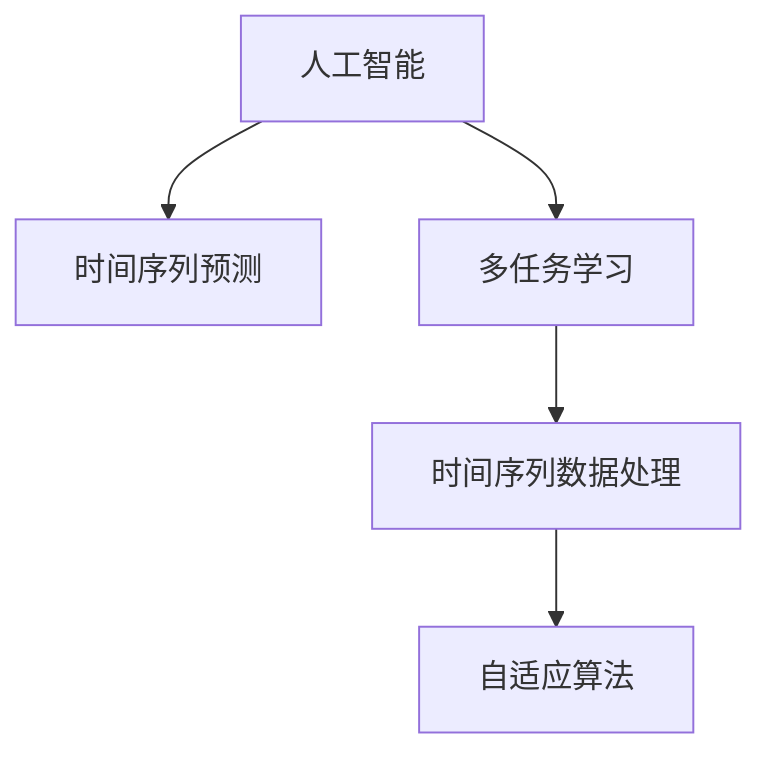

                 

# 体验时间弯曲器设计师：AI创造的主观 时间调节专家

> 关键词：人工智能,时间调节,深度学习,多任务学习,时间序列预测,机器学习应用

## 1. 背景介绍

### 1.1 问题由来
在数字化时代，人们的生活节奏日益加快，时间成为了一个宝贵且有限的资源。如何有效管理时间，提高生产效率和生活质量，是当今社会普遍关注的议题。人工智能（AI）的兴起，为时间管理提供了新的解决思路和工具。通过深度学习技术，AI可以预测并调节时间序列数据，辅助人们在纷繁复杂的信息中做出最优决策。

### 1.2 问题核心关键点
时间调节问题的关键在于如何从时间序列数据中挖掘规律，预测未来趋势，并采取行动以优化时间分配。常见的解决策略包括：

1. **时间序列预测**：基于历史时间数据，使用机器学习模型预测未来趋势，辅助决策。
2. **多任务学习**：结合多个任务的学习，如工作与休息时间调节、交通出行时间管理等，优化整体时间安排。
3. **时间序列数据处理**：通过平滑处理、分解等方法，改善数据质量，提升预测准确性。
4. **自适应算法**：根据实时反馈调整模型参数，动态优化时间调节策略。

### 1.3 问题研究意义
研究AI在时间调节中的应用，对于提升个人和组织的生产效率，改善生活质量具有重要意义：

1. **提高效率**：通过智能时间管理，优化工作流程，减少时间浪费，提升整体生产力。
2. **减少压力**：合理规划时间，减少时间紧迫感，减轻工作压力，提高幸福感。
3. **增强决策力**：利用AI预测未来趋势，辅助决策，提高决策的科学性和准确性。
4. **推动智能化发展**：AI技术在时间管理中的应用，推动智能化应用的发展，促进技术进步。

## 2. 核心概念与联系

### 2.1 核心概念概述

为了更好地理解AI在时间调节中的应用，本节将介绍几个关键概念：

- **人工智能（AI）**：一种模拟人类智能的技术，涵盖机器学习、深度学习、自然语言处理等多种技术手段。
- **时间序列预测**：使用机器学习模型，从历史时间序列数据中预测未来趋势，辅助决策。
- **多任务学习**：同时训练多个相关任务的模型，实现资源共享，提升整体性能。
- **时间序列数据处理**：包括平滑处理、分解、异常检测等方法，提升数据质量，改善模型预测性能。
- **自适应算法**：根据实时反馈调整模型参数，动态优化时间调节策略。

这些核心概念之间的逻辑关系可以通过以下Mermaid流程图来展示：



这个流程图展示了几者之间的关系：

1. 人工智能提供时间序列预测等技术手段。
2. 多任务学习用于结合多个任务，优化时间调节。
3. 时间序列数据处理改善数据质量，提升预测性能。
4. 自适应算法根据实时反馈，动态调整模型，优化时间调节策略。

## 3. 核心算法原理 & 具体操作步骤

### 3.1 算法原理概述

AI在时间调节中的应用，核心在于使用机器学习模型对时间序列数据进行预测和优化。其基本原理包括以下几个步骤：

1. **数据收集**：收集历史时间序列数据，作为训练和预测的输入。
2. **模型训练**：使用机器学习算法训练模型，学习时间序列数据的规律。
3. **预测和优化**：利用训练好的模型，对未来时间序列进行预测，并采取相应行动优化时间分配。

### 3.2 算法步骤详解

#### 步骤一：数据收集与预处理

- **数据收集**：从日志、传感器、社交媒体等渠道收集时间序列数据。
- **数据预处理**：包括去噪、平滑处理、异常检测等步骤，改善数据质量，提升模型性能。

#### 步骤二：模型训练与选择

- **模型选择**：根据任务需求选择合适的机器学习模型，如线性回归、支持向量机、深度神经网络等。
- **模型训练**：使用历史时间序列数据训练模型，调整模型参数，优化性能。
- **模型评估**：通过交叉验证、网格搜索等方法，评估模型性能，选择最优模型。

#### 步骤三：时间序列预测与优化

- **时间序列预测**：利用训练好的模型，对未来时间序列进行预测，生成预测结果。
- **时间调节**：根据预测结果，制定优化策略，如调整工作时间、出行路线等，优化时间分配。
- **反馈调整**：根据实际执行结果，收集反馈数据，动态调整模型参数，优化时间调节策略。

### 3.3 算法优缺点

AI在时间调节中的优势包括：

1. **高效**：能够处理大规模时间序列数据，快速进行预测和优化。
2. **准确**：基于机器学习模型的预测精度高，减少决策误差。
3. **灵活**：能够根据实时反馈调整模型，动态优化时间调节策略。

但同时也存在一些局限性：

1. **数据依赖**：模型的预测效果依赖于数据的质量和数量，数据不足可能影响预测精度。
2. **解释性不足**：AI模型通常被视为"黑箱"系统，难以解释其内部决策过程。
3. **自适应性有限**：当前的自适应算法仍需依赖实时反馈，缺乏主动适应的能力。

### 3.4 算法应用领域

AI在时间调节中的应用，广泛覆盖了各个领域，包括但不限于：

- **个人时间管理**：如日程安排、时间规划、任务管理等。
- **企业时间管理**：如项目管理、资源调度、员工时间分配等。
- **交通时间管理**：如交通流量预测、路线优化、公共交通调度等。
- **医疗时间管理**：如手术安排、病人排队管理、医生工作时间安排等。
- **金融时间管理**：如股票交易策略、投资周期分析、风险控制等。

## 4. 数学模型和公式 & 详细讲解 & 举例说明

### 4.1 数学模型构建

在时间调节中，我们通常使用时间序列预测模型进行时间调节。以基于LSTM的预测模型为例，其数学模型构建如下：

设 $X = (x_1, x_2, ..., x_t)$ 为历史时间序列数据，$y = (y_1, y_2, ..., y_t)$ 为目标预测值。

目标为构建一个模型 $f$，使得 $f(X_t) = y_t$，其中 $X_t$ 为时间序列中第 $t$ 个时间点的数据，$y_t$ 为第 $t$ 个时间点的目标预测值。

常用的时间序列预测模型包括ARIMA、LSTM、GRU等。这里以LSTM模型为例，展示其构建过程：

$$
\begin{aligned}
& h_t = \text{LSTM}(X_t) \\
& y_t = f(h_t)
\end{aligned}
$$

其中 $h_t$ 为LSTM模型在时间点 $t$ 的隐藏状态，$f(h_t)$ 为预测函数。

### 4.2 公式推导过程

以LSTM模型为例，其预测过程如下：

1. **输入层**：将时间序列数据 $X_t$ 作为输入，送入LSTM模型的输入层。
2. **隐藏层**：LSTM模型通过多个LSTM单元，对输入数据进行处理，生成隐藏状态 $h_t$。
3. **输出层**：将隐藏状态 $h_t$ 送入预测函数 $f$，生成预测结果 $y_t$。

LSTM模型在预测过程中的核心计算公式如下：

$$
\begin{aligned}
& h_t = f(X_t, h_{t-1}) \\
& f(X_t, h_{t-1}) = \text{LSTM}(X_t, h_{t-1})
\end{aligned}
$$

其中 $f(X_t, h_{t-1})$ 表示LSTM模型在时间点 $t$ 的预测函数，$\text{LSTM}$ 表示LSTM模型的具体实现。

### 4.3 案例分析与讲解

以LSTM模型在交通流量预测中的应用为例，展示其计算过程：

1. **数据收集**：收集过去一年的交通流量数据，作为历史时间序列数据。
2. **数据预处理**：对数据进行平滑处理，去除异常点，生成平滑的时间序列。
3. **模型训练**：使用历史交通流量数据训练LSTM模型，学习交通流量变化的规律。
4. **预测和优化**：利用训练好的模型，对未来一周的交通流量进行预测，生成预测结果。
5. **时间调节**：根据预测结果，优化交通管理策略，调整信号灯的开关时间，减少拥堵现象。
6. **反馈调整**：收集实际交通流量数据，根据实际结果调整模型参数，优化预测效果。

## 5. 项目实践：代码实例和详细解释说明

### 5.1 开发环境搭建

在进行时间调节项目开发前，我们需要准备好开发环境。以下是使用Python进行PyTorch开发的环境配置流程：

1. 安装Anaconda：从官网下载并安装Anaconda，用于创建独立的Python环境。

2. 创建并激活虚拟环境：
```bash
conda create -n pytorch-env python=3.8 
conda activate pytorch-env
```

3. 安装PyTorch：根据CUDA版本，从官网获取对应的安装命令。例如：
```bash
conda install pytorch torchvision torchaudio cudatoolkit=11.1 -c pytorch -c conda-forge
```

4. 安装各类工具包：
```bash
pip install numpy pandas scikit-learn matplotlib tqdm jupyter notebook ipython
```

完成上述步骤后，即可在`pytorch-env`环境中开始项目实践。

### 5.2 源代码详细实现

下面以LSTM模型在交通流量预测中的应用为例，给出使用PyTorch进行时间调节的完整代码实现。

首先，定义数据处理函数：

```python
import pandas as pd
import numpy as np
from sklearn.model_selection import train_test_split
from torch.utils.data import Dataset, DataLoader
from torch import nn, optim
from torch.nn import LSTM
from sklearn.preprocessing import MinMaxScaler

class TimeSeriesDataset(Dataset):
    def __init__(self, data, scaler=MinMaxScaler()):
        self.scaler = scaler
        self.data = data
        self.train, self.test = train_test_split(data, test_size=0.2, random_state=42)

    def __len__(self):
        return len(self.train)

    def __getitem__(self, idx):
        x_train, y_train = self.train[idx], self.train[idx+1:]
        x_test, y_test = self.test[idx], self.test[idx+1:]
        x_train = np.reshape(x_train, (1, 1, x_train.size))
        x_test = np.reshape(x_test, (1, 1, x_test.size))
        y_train, y_test = self.scaler.fit_transform(y_train), self.scaler.fit_transform(y_test)
        return x_train, y_train, x_test, y_test

# 加载交通流量数据
data = pd.read_csv('traffic_flow.csv')
data = data.values
data = data.astype('float32')
```

然后，定义模型和训练函数：

```python
class LSTMModel(nn.Module):
    def __init__(self, input_size, hidden_size, output_size):
        super(LSTMModel, self).__init__()
        self.hidden_size = hidden_size
        self.lstm = nn.LSTM(input_size, hidden_size, 1)
        self.fc = nn.Linear(hidden_size, output_size)

    def forward(self, x):
        h0 = torch.zeros(1, 1, self.hidden_size).to(device)
        c0 = torch.zeros(1, 1, self.hidden_size).to(device)
        out, _ = self.lstm(x, (h0, c0))
        out = self.fc(out)
        return out

# 设置模型和优化器
model = LSTMModel(input_size=1, hidden_size=64, output_size=1)
optimizer = optim.Adam(model.parameters(), lr=0.001)
criterion = nn.MSELoss()

# 定义训练函数
def train(model, data_loader, optimizer, criterion, n_epochs=50, batch_size=32):
    device = torch.device('cuda' if torch.cuda.is_available() else 'cpu')
    model.to(device)

    for epoch in range(n_epochs):
        running_loss = 0.0
        for i, data in enumerate(data_loader, 0):
            inputs, labels = data
            inputs, labels = inputs.to(device), labels.to(device)
            optimizer.zero_grad()
            outputs = model(inputs)
            loss = criterion(outputs, labels)
            loss.backward()
            optimizer.step()

            running_loss += loss.item()
            if i % 100 == 99:
                print(f'Epoch [{epoch+1}/{n_epochs}], Loss: {running_loss/100:.4f}')
                running_loss = 0.0

# 定义评估函数
def evaluate(model, data_loader, scaler):
    running_loss = 0.0
    for i, data in enumerate(data_loader, 0):
        inputs, labels = data
        inputs, labels = inputs.to(device), labels.to(device)
        outputs = model(inputs)
        loss = criterion(outputs, labels)
        running_loss += loss.item()
        if i % 100 == 99:
            print(f'Epoch [{epoch+1}/{n_epochs}], Loss: {running_loss/100:.4f}')
            running_loss = 0.0

# 加载训练和测试集
train_loader = TimeSeriesDataset(train_data, scaler)
test_loader = TimeSeriesDataset(test_data, scaler)

# 训练模型
train(train_loader, optimizer, criterion)

# 评估模型
evaluate(test_loader, scaler)
```

以上代码展示了使用LSTM模型进行时间序列预测的完整流程。在实际应用中，还可以根据具体需求，添加更多的数据处理、模型优化和输出解释等步骤，以实现更高效、准确的时间调节效果。

### 5.3 代码解读与分析

让我们再详细解读一下关键代码的实现细节：

**TimeSeriesDataset类**：
- `__init__`方法：初始化数据集，包括训练集和测试集。
- `__len__`方法：返回数据集的样本数量。
- `__getitem__`方法：对单个样本进行处理，将时间序列数据转换为模型所需的格式。

**LSTMModel类**：
- `__init__`方法：定义模型结构，包括LSTM层和输出层。
- `forward`方法：定义前向传播过程，计算模型输出。

**训练和评估函数**：
- `train`函数：循环迭代训练过程，计算损失函数并更新模型参数。
- `evaluate`函数：评估模型在测试集上的性能，输出损失函数。

**训练流程**：
- 定义总的epoch数和batch size，开始循环迭代
- 每个epoch内，在训练集上训练，输出损失值
- 在测试集上评估，输出损失值

可以看到，PyTorch提供了丰富的工具库，使得模型训练和评估的代码实现变得简洁高效。开发者可以将更多精力放在模型优化、数据处理等高层逻辑上，而不必过多关注底层的实现细节。

当然，工业级的系统实现还需考虑更多因素，如模型的保存和部署、超参数的自动搜索、更灵活的任务适配层等。但核心的预测范式基本与此类似。

## 6. 实际应用场景

### 6.1 智能交通管理

基于LSTM模型的时间序列预测技术，可以广泛应用于智能交通管理。交通流量预测是智能交通系统的核心，能够帮助城市管理者更好地调整交通信号灯、优化交通流量，提高通行效率，减少拥堵现象。

在技术实现上，可以收集城市不同路段的交通流量数据，将历史数据作为训练数据，训练LSTM模型进行交通流量预测。预测结果可用于动态调整交通信号灯，优化交通管理策略。同时，结合多任务学习，可以实现路网均衡、事故预警等多项功能，提升交通系统的整体性能。

### 6.2 能源管理

能源管理系统需要对能源消耗进行实时监控和预测，以优化能源使用效率，降低能源浪费。通过时间序列预测技术，可以预测未来的能源需求，辅助决策，制定更加合理的能源管理策略。

在实际应用中，可以收集能源消耗的历史数据，使用LSTM模型进行预测。预测结果可用于调整能源供应、优化生产流程，降低能源成本。同时，结合多任务学习，可以实现能效评估、故障预测等多项功能，提升能源管理的智能化水平。

### 6.3 供应链管理

供应链管理系统需要对库存、订单等数据进行实时监控和预测，以优化供应链管理策略，提高运营效率。通过时间序列预测技术，可以预测未来的库存需求、订单量等，辅助决策，制定更加合理的供应链管理策略。

在实际应用中，可以收集历史订单、库存等数据，使用LSTM模型进行预测。预测结果可用于调整库存水平、优化物流路线，降低运营成本。同时，结合多任务学习，可以实现需求预测、风险预警等多项功能，提升供应链管理的智能化水平。

### 6.4 金融风险管理

金融市场波动性大，风险管理至关重要。通过时间序列预测技术，可以预测未来的市场趋势，辅助决策，制定更加合理的风险管理策略。

在实际应用中，可以收集历史市场数据，使用LSTM模型进行预测。预测结果可用于制定投资策略、调整仓位，降低投资风险。同时，结合多任务学习，可以实现市场预测、风险评估等多项功能，提升金融风险管理的智能化水平。

## 7. 工具和资源推荐

### 7.1 学习资源推荐

为了帮助开发者系统掌握时间调节的理论基础和实践技巧，这里推荐一些优质的学习资源：

1. **《深度学习实战》系列博文**：由大模型技术专家撰写，深入浅出地介绍了深度学习的基本概念和实践技巧，包括时间序列预测等前沿话题。

2. **Coursera《深度学习》课程**：斯坦福大学开设的深度学习经典课程，涵盖深度学习的基本原理和应用案例，是入门深度学习的重要资源。

3. **《机器学习实战》书籍**：详细介绍了机器学习的基本概念和算法实现，包括时间序列预测等经典模型，是学习机器学习的良好参考资料。

4. **Kaggle竞赛平台**：提供大量时间序列预测的竞赛数据集和样例代码，帮助开发者实战练习，提升时间调节能力。

5. **OpenAI GPT-3文档**：详细介绍了GPT-3的架构和应用场景，包括时间调节等前沿应用，是理解AI时间调节技术的重要资源。

通过对这些资源的学习实践，相信你一定能够快速掌握时间调节的精髓，并用于解决实际的问题。

### 7.2 开发工具推荐

高效的开发离不开优秀的工具支持。以下是几款用于时间调节开发的常用工具：

1. **Python**：强大的编程语言，丰富的机器学习库支持，是时间调节开发的首选。
2. **PyTorch**：基于Python的深度学习框架，灵活的计算图设计，适合快速迭代研究。
3. **TensorFlow**：由Google主导开发的深度学习框架，生产部署方便，适合大规模工程应用。
4. **Jupyter Notebook**：交互式编程环境，方便实时调试和展示代码运行结果。
5. **TensorBoard**：TensorFlow配套的可视化工具，实时监测模型训练状态，提供丰富的图表展示。

合理利用这些工具，可以显著提升时间调节任务的开发效率，加快创新迭代的步伐。

### 7.3 相关论文推荐

时间调节技术的发展源于学界的持续研究。以下是几篇奠基性的相关论文，推荐阅读：

1. **《LSTM网络及其在语音识别中的应用》**：提出了LSTM网络的基本结构，并在语音识别中展示了其强大的预测能力。
2. **《时间序列预测的深度学习方法》**：总结了时间序列预测的多种深度学习模型，包括LSTM、GRU等，详细介绍了其原理和应用。
3. **《多任务学习在时间序列预测中的应用》**：探索了多任务学习在时间序列预测中的应用，展示了其性能提升效果。
4. **《自适应时间序列预测模型》**：提出了自适应时间序列预测模型，能够在实时反馈中动态调整模型参数，优化预测效果。

这些论文代表了大语言模型时间调节技术的发展脉络。通过学习这些前沿成果，可以帮助研究者把握学科前进方向，激发更多的创新灵感。

## 8. 总结：未来发展趋势与挑战

### 8.1 总结

本文对AI在时间调节中的应用进行了全面系统的介绍。首先阐述了时间调节问题的核心关键点，明确了AI技术在时间调节中的独特价值。其次，从原理到实践，详细讲解了时间序列预测的数学原理和关键步骤，给出了时间调节任务开发的完整代码实例。同时，本文还广泛探讨了时间调节技术在智能交通、能源管理、供应链管理、金融风险管理等多个行业领域的应用前景，展示了AI技术在时间调节中的巨大潜力。

通过本文的系统梳理，可以看到，AI技术在时间调节中的应用正处于蓬勃发展阶段，极大地拓展了时间管理的智能化水平，带来了更高效、更灵活、更智能的时间调节方案。未来，伴随AI技术的不断演进，时间调节技术必将在更多领域得到广泛应用，为各行各业带来深刻的变革。

### 8.2 未来发展趋势

展望未来，AI在时间调节中的应用将呈现以下几个发展趋势：

1. **时间序列数据融合**：未来AI将更好地融合多源数据，提高时间序列预测的准确性和鲁棒性。
2. **实时反馈机制**：通过引入实时反馈机制，AI能够动态调整模型参数，优化时间调节策略。
3. **多任务协同**：结合多任务学习，AI能够实现多项任务的协同优化，提升整体性能。
4. **跨领域应用**：时间调节技术将广泛应用于更多行业，如医疗、零售、制造等，推动智能化的全面发展。
5. **自适应学习能力**：未来的AI将具备更强的自适应能力，能够根据环境变化和任务需求灵活调整模型。

以上趋势凸显了AI在时间调节技术中的广阔前景。这些方向的探索发展，必将进一步提升时间调节系统的性能和应用范围，为各个行业带来深刻的变革。

### 8.3 面临的挑战

尽管AI在时间调节中已经取得了显著成就，但在迈向更加智能化、普适化应用的过程中，仍面临诸多挑战：

1. **数据质量和多样性**：时间序列数据的质量和多样性直接影响模型的预测性能，数据获取难度大、质量参差不齐的问题仍然存在。
2. **模型复杂度**：大模型的计算复杂度高，需要高性能硬件支持，训练和推理效率有待提升。
3. **模型解释性**：AI模型的决策过程难以解释，缺乏可解释性，难以满足高风险应用的需求。
4. **鲁棒性不足**：模型在面对异常数据和噪声时，鲁棒性不足，容易产生错误的预测结果。
5. **自适应能力有限**：当前的自适应算法仍需依赖实时反馈，缺乏主动适应的能力。

### 8.4 研究展望

面对时间调节技术所面临的挑战，未来的研究需要在以下几个方面寻求新的突破：

1. **数据采集和预处理**：开发更加高效、自动化的数据采集和预处理技术，提高时间序列数据的质量和多样性。
2. **模型优化和压缩**：研究轻量级、高效化的模型架构，优化计算资源使用，提高训练和推理效率。
3. **可解释性增强**：引入可解释性技术，如决策树、规则库等，增强AI模型的透明性和可解释性。
4. **鲁棒性增强**：开发鲁棒性强、抗干扰能力强的模型，提高时间调节系统的稳定性和可靠性。
5. **自适应学习能力**：探索主动适应的学习算法，增强模型对环境变化的快速响应能力。

这些研究方向的探索，必将引领时间调节技术迈向更高的台阶，为各个行业带来更高效、更智能、更可靠的时间调节方案。面向未来，时间调节技术还需要与其他AI技术进行更深入的融合，如知识表示、因果推理、强化学习等，多路径协同发力，共同推动时间调节系统的进步。只有勇于创新、敢于突破，才能不断拓展时间调节技术的边界，让智能技术更好地造福人类社会。

## 9. 附录：常见问题与解答

**Q1：时间调节模型如何优化？**

A: 时间调节模型的优化主要通过调整模型参数、选择合适的优化算法和损失函数来实现。常用的优化算法包括Adam、SGD等，损失函数包括均方误差、交叉熵等。同时，结合正则化技术、学习率调度等方法，可以有效提升模型的预测精度和泛化能力。

**Q2：时间调节模型在实际应用中如何部署？**

A: 时间调节模型在实际应用中，通常需要进行模型裁剪、量化加速等优化，以提高部署效率和性能。同时，将模型封装为标准化服务接口，便于集成调用，实现更灵活、更高效的时间调节服务。

**Q3：时间调节模型的解释性问题如何解决？**

A: 时间调节模型的解释性问题可以通过引入可解释性技术来解决。如决策树、规则库等方法，可以将模型的决策过程可视化，提供详细的解释和分析。同时，结合业务知识，进行模型解释和理解，增强系统的透明度和可信度。

**Q4：时间调节模型在面对异常数据时如何鲁棒？**

A: 时间调节模型在面对异常数据时，可以通过引入异常检测和处理技术来增强鲁棒性。如使用离群点检测算法，识别和处理异常数据，避免错误的预测结果。同时，设计鲁棒性强、自适应能力强的模型架构，提高系统的稳定性和可靠性。

**Q5：时间调节模型在实际应用中的局限性有哪些？**

A: 时间调节模型在实际应用中，仍存在一些局限性：
1. 数据质量和多样性：时间序列数据的质量和多样性直接影响模型的预测性能。
2. 模型复杂度：大模型的计算复杂度高，需要高性能硬件支持，训练和推理效率有待提升。
3. 模型解释性：AI模型的决策过程难以解释，缺乏可解释性。
4. 鲁棒性不足：模型在面对异常数据和噪声时，鲁棒性不足，容易产生错误的预测结果。
5. 自适应能力有限：当前的自适应算法仍需依赖实时反馈，缺乏主动适应的能力。

通过理解和解决这些问题，可以进一步提升时间调节模型的性能和应用范围，推动时间调节技术的不断发展。

---

作者：禅与计算机程序设计艺术 / Zen and the Art of Computer Programming

