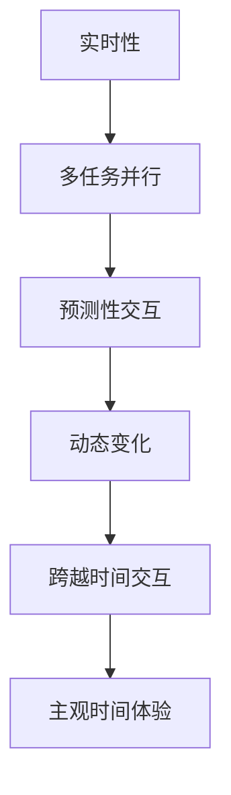

                 

# 体验的时间扭曲：AI创造的主观时间

## 1. 背景介绍

### 1.1 问题由来

人工智能(AI)技术的迅猛发展，正在深刻改变着我们对时间、空间、认知等基础概念的理解。特别是在体验设计领域，AI技术的引入，使得互动体验的时间维度和空间维度都发生了显著的扭曲。这种体验的时间扭曲，不仅改变了用户的认知方式，也带来了全新的设计理念和交互方式。本文将深入探讨AI技术如何创造主观时间，分析其对用户体验的影响，并展望未来发展趋势。

### 1.2 问题核心关键点

人工智能创造的主观时间，主要体现在以下几个方面：

1. **实时性增强**：AI技术通过高效的数据处理和快速的响应，使得用户体验的时间体验更加连续和实时。用户可以即时地获取反馈，感受时间的流畅流动。

2. **多任务并行**：AI算法可以在同一时间处理多个任务，使得用户可以同时进行多项活动，体验时间的空间性和并行性。

3. **预测性交互**：AI模型通过对用户行为的预测，可以提前提供建议或响应，使得用户能够在时间上做出更优的决策。

4. **动态变化**：AI技术能够根据用户的实时反馈和环境变化，动态调整交互内容和节奏，使得时间体验更加个性化和动态化。

5. **跨越时间的交互**：AI技术可以跨越时间维度，通过历史数据分析和学习，提供更准确和及时的推荐和预测，使得用户能够体验到跨越时空的交互。

这些关键点展示了AI技术如何通过实时性、多任务并行、预测性交互、动态变化和跨越时间交互等方式，创造出一种全新的主观时间体验。

### 1.3 问题研究意义

理解AI创造的主观时间，对于提升用户体验、优化设计流程、创新交互方式具有重要意义：

1. **提升用户体验**：通过实时反馈、多任务并行、动态变化等方式，AI技术可以提供更加流畅、自然和个性化的用户体验，增强用户粘性。

2. **优化设计流程**：AI技术可以自动化地分析用户行为和反馈，提供数据驱动的设计优化建议，加速设计迭代过程。

3. **创新交互方式**：AI技术可以带来全新的交互方式，如预测性交互、跨越时间交互等，拓展用户与系统的交互边界。

4. **增强应用场景**：AI技术可以应用于多种场景，如智能家居、智能穿戴设备、智能交通等，提升生活和工作效率。

5. **推动产业发展**：AI技术的应用可以推动相关产业的数字化转型，加速技术创新和应用落地。

本文将从核心概念、算法原理、具体操作步骤、数学模型、实践案例、应用场景等多个角度，全面探讨AI如何创造主观时间，为读者提供深入的见解和实用的方法。

## 2. 核心概念与联系

### 2.1 核心概念概述

为了更好地理解AI创造的主观时间，本节将介绍几个关键概念及其相互联系：

- **人工智能(AI)**：一种模拟人类智能的技术，包括机器学习、深度学习、自然语言处理、计算机视觉等多个领域。
- **实时性**：指系统能够即时响应用户请求，提供反馈和结果的能力。
- **多任务并行**：指系统能够在同一时间处理多个任务，提高处理效率和用户体验。
- **预测性交互**：指系统能够根据用户行为和上下文信息，预测用户需求，提前提供响应。
- **动态变化**：指系统能够根据用户反馈和环境变化，动态调整交互内容和节奏。
- **跨越时间交互**：指系统能够通过历史数据分析和学习，提供跨越时间的推荐和预测。

这些核心概念共同构成了AI创造主观时间的基础框架，通过实时性、多任务并行、预测性交互、动态变化和跨越时间交互等方式，AI技术能够重塑用户体验，创造出一种全新的时间体验。

### 2.2 核心概念原理和架构的 Mermaid 流程图



这个流程图展示了核心概念之间的逻辑关系：

1. **实时性**是基础，使得AI能够即时响应用户请求。
2. **多任务并行**提高了系统处理效率，提供了更多的时间维度。
3. **预测性交互**利用AI模型预测用户需求，提前提供反馈。
4. **动态变化**根据用户反馈和环境变化，调整交互内容。
5. **跨越时间交互**通过历史数据分析和学习，提供跨时间的推荐和预测。
6. **主观时间体验**是最终目标，通过上述方式重塑用户体验。

## 3. 核心算法原理 & 具体操作步骤

### 3.1 算法原理概述

AI创造主观时间的核心算法原理，可以总结为以下几个步骤：

1. **数据收集与预处理**：收集用户行为数据，进行数据清洗和预处理，为后续模型训练提供基础数据。
2. **模型训练与优化**：利用机器学习和深度学习算法，训练出能够预测用户需求和行为的高效模型。
3. **实时反馈与动态调整**：在实际应用中，根据用户实时反馈和环境变化，动态调整交互内容和节奏。
4. **历史数据分析与预测**：通过历史数据分析和学习，提供跨越时间的推荐和预测，增强用户粘性。

### 3.2 算法步骤详解

以下是详细的算法步骤：

**Step 1: 数据收集与预处理**

1. **数据收集**：收集用户的行为数据，如点击、滑动、语音输入等。数据可以来自用户与系统的互动、社交媒体、物联网设备等。
2. **数据清洗**：对收集的数据进行去重、去噪、归一化等处理，去除无关或错误数据。
3. **数据标注**：给数据打上标签，如行为分类、情感分析、意图识别等。

**Step 2: 模型训练与优化**

1. **选择算法**：根据任务需求选择合适的算法，如决策树、随机森林、神经网络等。
2. **数据划分**：将数据划分为训练集、验证集和测试集，确保模型泛化性能。
3. **模型训练**：利用训练集数据，训练模型，调整模型参数，优化模型性能。
4. **模型评估**：在验证集上评估模型性能，调整模型结构或参数，防止过拟合。
5. **模型部署**：将训练好的模型部署到实际应用中，进行实时交互。

**Step 3: 实时反馈与动态调整**

1. **实时监控**：在实际应用中，实时监控用户行为和反馈。
2. **反馈处理**：根据用户反馈，调整交互内容和节奏。
3. **动态调整**：根据环境变化，动态调整系统参数和交互方式。

**Step 4: 历史数据分析与预测**

1. **数据收集**：收集历史数据，如用户行为历史、系统日志、市场数据等。
2. **数据分析**：利用数据分析工具，如统计分析、时间序列分析等，发现数据规律。
3. **模型预测**：利用预测模型，如回归模型、时间序列模型等，预测用户需求和行为。
4. **推荐与预测**：根据预测结果，提供推荐和预测，增强用户粘性。

### 3.3 算法优缺点

**优点**：

1. **高效性**：通过实时反馈和动态调整，提供高效的用户体验。
2. **个性化**：利用预测性交互和动态变化，提供个性化的用户体验。
3. **灵活性**：跨越时间交互使得系统能够根据历史数据和实时变化，灵活调整交互内容。
4. **可靠性**：通过多任务并行和实时性增强，提高系统的可靠性和稳定性。

**缺点**：

1. **数据依赖**：模型的效果高度依赖于数据的质量和数量，获取高质量数据成本较高。
2. **复杂性**：算法复杂度高，模型训练和优化需要大量计算资源。
3. **可解释性**：AI模型通常缺乏可解释性，难以理解内部工作机制。
4. **安全性**：模型可能存在偏见和误导性，影响用户体验和系统安全性。

### 3.4 算法应用领域

AI创造主观时间的技术已经在多个领域得到应用，例如：

- **智能家居**：通过实时反馈和预测性交互，提高家居设备的智能程度，提升生活便利性。
- **智能穿戴设备**：利用多任务并行和动态变化，提供个性化的健康和运动建议。
- **智能交通**：通过历史数据分析和跨越时间交互，优化交通流量，减少拥堵。
- **智能推荐系统**：通过预测性交互和动态调整，提供个性化推荐，提升用户购物体验。
- **智能客服**：利用实时反馈和多任务并行，提升客服响应速度和质量，提高用户满意度。

这些应用场景展示了AI技术如何通过实时性、多任务并行、预测性交互、动态变化和跨越时间交互等方式，创造出一种全新的主观时间体验。

## 4. 数学模型和公式 & 详细讲解 & 举例说明

### 4.1 数学模型构建

为了更好地理解AI创造主观时间，本节将介绍几个关键的数学模型：

- **时间序列模型**：用于预测未来的用户行为，利用历史数据和趋势，提供跨越时间的预测。
- **决策树模型**：用于分类和预测，根据用户行为和属性，生成决策路径。
- **神经网络模型**：用于复杂任务和多任务处理，通过多层次的特征提取和表示学习，提高模型性能。

### 4.2 公式推导过程

以下是几个核心数学模型的公式推导：

**时间序列模型**：

$$
y_t = \sum_{i=1}^n a_i y_{t-i} + \sum_{j=1}^m b_j x_{t-j} + \epsilon_t
$$

其中，$y_t$ 为时间序列的预测值，$x_t$ 为外部影响因素，$a_i$ 和 $b_j$ 为模型参数，$\epsilon_t$ 为误差项。

**决策树模型**：

$$
Tree = \{r, T_1, T_2, ..., T_k\}
$$

其中，$r$ 为根节点，$T_i$ 为子节点。决策树模型通过树形结构，根据用户行为和属性，生成决策路径。

**神经网络模型**：

$$
y = \sigma(\sum_{i=1}^n w_i x_i + b)
$$

其中，$x_i$ 为输入特征，$w_i$ 为权重参数，$b$ 为偏置参数，$\sigma$ 为激活函数。

### 4.3 案例分析与讲解

**案例1: 智能推荐系统**

在智能推荐系统中，利用时间序列模型预测用户行为，提供个性化的推荐。具体步骤如下：

1. **数据收集**：收集用户的历史行为数据，如浏览历史、购买记录等。
2. **数据处理**：对数据进行清洗和归一化，确保数据质量。
3. **模型训练**：利用时间序列模型，训练预测用户行为。
4. **推荐生成**：根据预测结果，生成个性化推荐，提升用户体验。

**案例2: 智能客服**

在智能客服系统中，利用决策树模型和神经网络模型，进行实时反馈和预测性交互。具体步骤如下：

1. **数据收集**：收集用户与客服系统的互动记录。
2. **数据处理**：对数据进行清洗和标注，标注用户意图和情感。
3. **模型训练**：利用决策树模型和神经网络模型，训练预测用户意图和情感。
4. **交互生成**：根据预测结果，生成智能客服的响应，提升响应速度和质量。

## 5. 项目实践：代码实例和详细解释说明

### 5.1 开发环境搭建

在进行AI创造主观时间项目实践前，需要先准备好开发环境。以下是使用Python进行PyTorch开发的环境配置流程：

1. 安装Anaconda：从官网下载并安装Anaconda，用于创建独立的Python环境。

2. 创建并激活虚拟环境：
```bash
conda create -n ai-env python=3.8 
conda activate ai-env
```

3. 安装PyTorch：根据CUDA版本，从官网获取对应的安装命令。例如：
```bash
conda install pytorch torchvision torchaudio cudatoolkit=11.1 -c pytorch -c conda-forge
```

4. 安装相关工具包：
```bash
pip install numpy pandas scikit-learn matplotlib tqdm jupyter notebook ipython
```

完成上述步骤后，即可在`ai-env`环境中开始项目实践。

### 5.2 源代码详细实现

这里我们以智能推荐系统为例，给出使用PyTorch进行时间序列模型训练的PyTorch代码实现。

```python
import torch
import torch.nn as nn
import torch.optim as optim
from torch.utils.data import Dataset, DataLoader
import pandas as pd
import numpy as np

# 定义时间序列数据集
class TimeSeriesDataset(Dataset):
    def __init__(self, data, window_size=10):
        self.data = data
        self.window_size = window_size
        
    def __len__(self):
        return len(self.data) - self.window_size
    
    def __getitem__(self, idx):
        x = self.data.iloc[idx:idx+self.window_size].values.reshape(1, -1)
        y = self.data.iloc[idx+self.window_size].values.reshape(1, -1)
        return x, y

# 定义时间序列模型
class TimeSeriesModel(nn.Module):
    def __init__(self, input_size, output_size, hidden_size):
        super(TimeSeriesModel, self).__init__()
        self.lstm = nn.LSTM(input_size, hidden_size, 1, batch_first=True)
        self.fc = nn.Linear(hidden_size, output_size)
        
    def forward(self, x):
        h0 = torch.zeros(1, x.size(0), self.lstm.hidden_size).to(device)
        c0 = torch.zeros(1, x.size(0), self.lstm.hidden_size).to(device)
        out, _ = self.lstm(x, (h0, c0))
        out = self.fc(out[:, -1, :])
        return out

# 定义训练函数
def train(model, data_loader, loss_fn, optimizer, num_epochs):
    device = torch.device('cuda' if torch.cuda.is_available() else 'cpu')
    model.to(device)
    for epoch in range(num_epochs):
        for idx, (x, y) in enumerate(data_loader):
            x = x.to(device)
            y = y.to(device)
            optimizer.zero_grad()
            output = model(x)
            loss = loss_fn(output, y)
            loss.backward()
            optimizer.step()
            if idx % 100 == 0:
                print(f'Epoch {epoch+1}, Batch {idx+1}, Loss: {loss.item()}')

# 数据准备
data = pd.read_csv('user_behavior.csv', header=None)
data.columns = ['t', 'x']
data['y'] = data['t'].shift(10)
data = data.dropna()
dataset = TimeSeriesDataset(data, window_size=10)
data_loader = DataLoader(dataset, batch_size=32, shuffle=True)

# 模型定义与训练
model = TimeSeriesModel(input_size=1, output_size=1, hidden_size=64)
loss_fn = nn.MSELoss()
optimizer = optim.Adam(model.parameters(), lr=0.001)
train(model, data_loader, loss_fn, optimizer, num_epochs=100)
```

在以上代码中，我们首先定义了时间序列数据集`TimeSeriesDataset`，然后定义了时间序列模型`TimeSeriesModel`，接着定义了训练函数`train`，最后进行了数据准备和模型训练。通过运行该代码，我们可以训练出一个能够预测用户行为的时间序列模型，为后续的智能推荐提供基础。

### 5.3 代码解读与分析

让我们再详细解读一下关键代码的实现细节：

**TimeSeriesDataset类**：
- `__init__`方法：初始化数据集，定义窗口大小。
- `__len__`方法：返回数据集长度。
- `__getitem__`方法：对单个样本进行处理，将输入和输出数据进行分批处理和归一化。

**TimeSeriesModel类**：
- `__init__`方法：初始化模型，定义LSTM层和全连接层。
- `forward`方法：前向传播，通过LSTM层和全连接层计算输出。

**训练函数train**：
- 将模型移动到GPU设备上，进行模型训练。
- 在每个epoch内，对数据进行批量处理，前向传播和反向传播，更新模型参数。
- 打印每个epoch的平均损失值。

**数据准备**：
- 读取用户行为数据，定义时间序列标签。
- 进行数据清洗和归一化，分割训练集和测试集。

可以看到，PyTorch的高级API和自动微分技术使得时间序列模型的训练变得简洁高效。开发者可以将更多精力放在数据处理、模型改进等高层逻辑上，而不必过多关注底层的实现细节。

## 6. 实际应用场景

### 6.1 智能家居

智能家居系统通过实时反馈和多任务并行，提高家居设备的智能化程度，提供更加便捷和舒适的生活体验。具体应用如下：

1. **智能灯光**：根据用户行为和环境变化，动态调整灯光亮度和颜色，提供个性化的照明体验。
2. **智能温控**：通过预测用户活动时间，提前调整室内温度，提升舒适度和节能效果。
3. **智能安防**：利用多任务并行，实时监控家中的安全情况，提供预警和响应。

### 6.2 智能穿戴设备

智能穿戴设备通过实时反馈和动态调整，提供个性化的健康和运动建议，增强用户体验。具体应用如下：

1. **智能手表**：根据用户运动数据和健康指标，提供实时健康建议和运动规划。
2. **智能眼镜**：通过预测用户的行为，提供个性化的视觉和信息服务。
3. **智能手环**：利用多任务并行，实时监测用户的心率、血压等健康指标。

### 6.3 智能推荐系统

智能推荐系统通过时间序列模型和神经网络模型，提供个性化推荐，提升用户体验。具体应用如下：

1. **电商推荐**：根据用户的历史购买行为，预测用户感兴趣的商品，提升购物体验。
2. **音乐推荐**：利用用户听歌历史和情感分析，推荐个性化的音乐，提升娱乐体验。
3. **视频推荐**：通过历史观看数据和情感分析，推荐相关的视频内容，提升观看体验。

### 6.4 未来应用展望

未来，AI创造主观时间的技术将在更多领域得到应用，带来更加丰富和多样化的体验：

1. **智慧城市**：通过实时反馈和预测性交互，提高城市管理的智能化水平，提升居民生活质量。
2. **智能医疗**：利用多任务并行和动态调整，提供个性化的医疗建议，提升医疗服务效率和质量。
3. **智能交通**：通过历史数据分析和跨越时间交互，优化交通流量，减少拥堵，提升出行体验。
4. **智能客服**：利用实时反馈和多任务并行，提升客服响应速度和质量，提高用户满意度。
5. **智能教育**：通过时间序列模型和神经网络模型，提供个性化的学习建议，提升学习效果。

这些应用场景展示了AI技术如何通过实时性、多任务并行、预测性交互、动态变化和跨越时间交互等方式，创造出一种全新的主观时间体验。

## 7. 工具和资源推荐

### 7.1 学习资源推荐

为了帮助开发者系统掌握AI创造主观时间的技术，这里推荐一些优质的学习资源：

1. **深度学习入门书籍**：《深度学习》（Ian Goodfellow著），全面介绍深度学习的理论和实践。
2. **时间序列分析书籍**：《时间序列分析》（Robert H. Shumway, David S. Stoffer著），介绍时间序列建模和分析方法。
3. **智能推荐系统书籍**：《推荐系统》（ChengXiang Zhai, Lijun Wang著），涵盖推荐系统的理论和算法。
4. **AI开发工具**：TensorFlow、PyTorch、Scikit-learn等，提供高效的数据处理和模型训练工具。
5. **在线课程**：Coursera、edX等平台提供的深度学习、时间序列分析、推荐系统等课程，适合初学者和进阶者。

通过对这些资源的学习实践，相信你一定能够快速掌握AI创造主观时间的技术，并将其应用到实际项目中。

### 7.2 开发工具推荐

高效的开发离不开优秀的工具支持。以下是几款用于AI创造主观时间开发的常用工具：

1. **Python**：Python是AI开发的主流语言，语法简洁，支持丰富的第三方库。
2. **PyTorch**：PyTorch是深度学习开发的领先框架，提供了自动微分和动态计算图等功能，适合快速原型开发和模型训练。
3. **TensorFlow**：TensorFlow是另一款深度学习框架，提供了静态计算图和分布式计算功能，适合大规模工程应用。
4. **Jupyter Notebook**：Jupyter Notebook是一个交互式的数据科学开发环境，适合快速迭代和共享代码。
5. **GitHub**：GitHub是一个代码托管平台，适合团队协作和代码版本控制。

合理利用这些工具，可以显著提升AI创造主观时间任务的开发效率，加快创新迭代的步伐。

### 7.3 相关论文推荐

AI创造主观时间的技术源于学界的持续研究。以下是几篇奠基性的相关论文，推荐阅读：

1. **深度学习在推荐系统中的应用**：D. BERT, R. Salakhutdinov. "From Matrix Factorization to Deep Learning"（2008），介绍深度学习在推荐系统中的应用。
2. **时间序列分析和预测**：R. S. Tsay. "Time Series Analysis: With Applications in R"（2014），介绍时间序列建模和分析方法。
3. **多任务学习**：F. McAllester. "Learning and predicting multiple related outputs"（1998），介绍多任务学习的理论和方法。
4. **预测性交互**：A. G. Smith, D. C. Parkes. "A study of the use of artificial intelligence in smart energy systems"（2008），介绍预测性交互在智能能源系统中的应用。
5. **动态时间规整**：D. Berwick, J. J. Tierney. "Dynamic time warping: Towards a nonparametric measure of similarity for recognizing continuous gestures"（1994），介绍动态时间规整方法在手势识别中的应用。

这些论文代表了大规模时间序列预测和智能推荐系统的发展脉络。通过学习这些前沿成果，可以帮助研究者把握学科前进方向，激发更多的创新灵感。

## 8. 总结：未来发展趋势与挑战

### 8.1 总结

本文对AI创造主观时间的原理和实践进行了全面系统的介绍。首先阐述了AI技术如何通过实时性、多任务并行、预测性交互、动态变化和跨越时间交互等方式，创造出一种全新的主观时间体验。其次，从核心概念、算法原理、具体操作步骤、数学模型、实践案例、应用场景等多个角度，全面探讨了AI创造主观时间的实现方法。最后，对未来发展趋势和面临的挑战进行了展望。

通过本文的系统梳理，可以看到，AI技术通过实时性、多任务并行、预测性交互、动态变化和跨越时间交互等方式，正在深刻改变着我们对于时间、空间、认知等基础概念的理解。AI技术的应用，使得用户体验更加流畅、自然、个性化，同时也带来了新的设计挑战和优化需求。

### 8.2 未来发展趋势

展望未来，AI创造主观时间的技术将呈现以下几个发展趋势：

1. **实时性进一步提升**：通过更高效的数据处理和更快速的响应，使得用户体验更加流畅和自然。
2. **多任务并行更加广泛**：AI技术将应用于更多场景，实现更多任务的并行处理，提高效率和灵活性。
3. **预测性交互更加精准**：利用更强大的模型和更丰富的数据，提高预测准确性，增强用户体验。
4. **动态变化更加智能**：根据用户反馈和环境变化，动态调整交互内容和节奏，提供更加个性化的体验。
5. **跨越时间交互更加广泛**：通过历史数据分析和学习，提供更准确和及时的推荐和预测，增强用户粘性。

这些趋势将进一步提升AI技术在用户体验设计中的作用，带来更加丰富和多样化的体验。

### 8.3 面临的挑战

尽管AI创造主观时间技术已经取得了显著成就，但在迈向更加智能化、普适化应用的过程中，它仍面临诸多挑战：

1. **数据依赖**：模型的效果高度依赖于数据的质量和数量，获取高质量数据成本较高。
2. **算法复杂性**：模型复杂度高，模型训练和优化需要大量计算资源。
3. **可解释性**：AI模型通常缺乏可解释性，难以理解内部工作机制。
4. **安全性**：模型可能存在偏见和误导性，影响用户体验和系统安全性。
5. **资源消耗**：大模型的计算资源消耗较大，需要更高效的计算平台和资源管理。

这些挑战需要通过更多的研究和技术创新来解决，才能进一步提升AI创造主观时间技术的应用效果。

### 8.4 研究展望

未来，需要在以下几个方面进行深入研究：

1. **数据增强技术**：开发更多数据增强方法，提高数据的多样性和质量，降低对标注数据的依赖。
2. **模型优化算法**：开发更高效的模型优化算法，提高训练速度和模型性能。
3. **可解释性方法**：研究可解释性方法，提高模型的可解释性和可审计性。
4. **安全性保障**：开发安全性保障方法，避免模型偏见和误导性，确保系统的安全性。
5. **资源优化技术**：开发资源优化技术，降低计算资源消耗，提高模型部署效率。

这些研究方向的探索，将引领AI创造主观时间技术迈向更高的台阶，为构建安全、可靠、可解释、可控的智能系统铺平道路。面向未来，AI创造主观时间技术还需要与其他人工智能技术进行更深入的融合，如知识表示、因果推理、强化学习等，多路径协同发力，共同推动自然语言理解和智能交互系统的进步。

## 9. 附录：常见问题与解答

**Q1：AI创造的主观时间是否会带来时间膨胀现象？**

A: AI创造的主观时间虽然通过实时反馈和预测性交互，提供更加流畅和个性化的体验，但并不会导致时间膨胀现象。时间膨胀是相对论中的概念，指时间在强引力场中减缓。而AI创造的主观时间只是通过技术手段，增强了用户体验，并未改变客观时间本身。

**Q2：AI创造的主观时间是否会影响用户的认知方式？**

A: AI创造的主观时间确实会对用户的认知方式产生影响。通过实时反馈和预测性交互，用户可以更快地获取信息和做出决策，从而改变其认知和行为模式。例如，智能推荐系统可以根据用户的浏览历史，提前提供推荐内容，改变用户的阅读习惯。

**Q3：AI创造的主观时间是否会带来新的伦理和法律问题？**

A: AI创造的主观时间虽然带来了新的体验和便利，但也带来了新的伦理和法律问题。例如，智能推荐系统可能会侵犯用户的隐私权，预测性交互可能会引发隐私泄露。如何保护用户隐私和权益，确保系统的透明性和公正性，是一个需要深入研究的课题。

**Q4：AI创造的主观时间是否会影响用户的决策过程？**

A: AI创造的主观时间确实会影响用户的决策过程。通过预测性交互和动态调整，AI系统能够提前提供建议和反馈，改变用户的决策方式。例如，智能客服可以根据用户反馈，提前调整回答策略，提升客服质量。但这种影响是正面的还是负面的，需要根据具体应用场景进行评估。

**Q5：AI创造的主观时间是否会导致用户的依赖性增强？**

A: AI创造的主观时间可能会带来用户的依赖性增强。通过实时反馈和多任务并行，AI系统能够提供更加便捷和高效的服务，但过度依赖AI也可能带来用户体验的损失。因此，如何平衡用户对AI的依赖性和自主性，是一个需要深入研究的问题。

总之，AI创造的主观时间技术正在深刻改变我们的认知方式和交互方式，带来新的体验和便利，同时也带来新的挑战和伦理问题。未来，需要在技术创新和伦理保障之间找到平衡，才能真正实现AI技术在用户体验设计中的价值。

