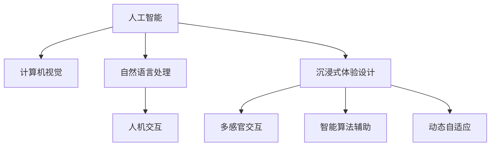

                 

# 体验设计的未来：AI驱动的沉浸式世界

## 1. 背景介绍

在数字时代，人类生活的方方面面都深受信息技术的影响。从智能手机到智能家居，从在线教育到远程医疗，AI技术的广泛应用正在深刻改变我们的体验方式。体验设计（Experience Design, UX Design）作为连接技术与人类的桥梁，其重要性日益凸显。如今，随着AI驱动的设计工具和技术的涌现，沉浸式体验设计（Immersive UX Design）正逐渐成为未来设计的主流方向。

沉浸式体验设计旨在通过多感官交互、智能算法辅助、动态自适应等方式，创造高度真实和沉浸的交互体验。这不仅提升了用户的参与感和满意度，还为品牌带来了更多的用户粘性和商业价值。本文将深入探讨AI驱动的沉浸式体验设计，揭示其在未来的发展趋势和应用潜力。

## 2. 核心概念与联系

### 2.1 核心概念概述

沉浸式体验设计融合了人工智能、计算机视觉、自然语言处理、人机交互等前沿技术，打造全方位沉浸式体验。以下是几个关键概念：

- **人工智能（AI）**：利用机器学习、深度学习等技术，实现自动化决策和动态优化。
- **计算机视觉（CV）**：通过图像识别、目标检测等技术，增强对环境的感知能力。
- **自然语言处理（NLP）**：通过理解自然语言，实现智能对话和自然交互。
- **人机交互（HCI）**：通过多模态输入输出技术，提升用户体验的直观性和自然性。

### 2.2 核心概念联系的 Mermaid 流程图



此图展示了AI、CV、NLP和HCI技术在沉浸式体验设计中的应用。其中，多感官交互、智能算法辅助和动态自适应是沉浸式体验设计的核心要素。

## 3. 核心算法原理 & 具体操作步骤

### 3.1 算法原理概述

沉浸式体验设计的核心算法原理包括以下几个方面：

- **多感官融合**：通过计算机视觉和自然语言处理技术，捕捉用户的视觉、听觉、触觉等多种感官信息，实现多感官融合。
- **智能推荐系统**：基于用户行为和偏好，使用机器学习算法推荐个性化的内容和服务。
- **动态自适应**：根据用户行为和环境变化，动态调整系统的交互方式和内容呈现方式。

### 3.2 算法步骤详解

#### 3.2.1 多感官融合

1. **视觉信息采集**：通过摄像头、图像传感器等设备采集用户的视觉信息。
2. **自然语言处理**：利用NLP技术解析用户的语音或文本输入，提取关键信息。
3. **多感官信息融合**：将视觉和自然语言信息进行融合，形成综合感知模型。

#### 3.2.2 智能推荐系统

1. **用户画像构建**：通过数据分析和机器学习算法，构建用户的兴趣和行为画像。
2. **内容推荐模型**：使用协同过滤、深度学习等技术，推荐符合用户兴趣的内容。
3. **动态推荐调整**：根据用户反馈和行为数据，实时调整推荐算法，优化推荐结果。

#### 3.2.3 动态自适应

1. **环境感知**：通过传感器和计算机视觉技术，实时感知用户周围的环境变化。
2. **行为分析**：利用AI技术分析用户的行为和交互模式，识别用户意图。
3. **动态调整**：根据用户行为和环境变化，动态调整系统的交互方式和内容呈现方式。

### 3.3 算法优缺点

**优点**：
- 提升用户体验：通过多感官融合和智能推荐，提供高度个性化和真实沉浸的体验。
- 优化资源利用：通过动态自适应，实现资源的智能分配和优化。
- 减少用户干预：自动化决策和动态优化，降低用户的使用门槛。

**缺点**：
- 技术复杂度高：需要融合多种前沿技术，对开发和维护的要求高。
- 隐私和安全问题：多传感器数据采集和用户行为分析，涉及隐私和安全问题。
- 数据依赖性强：需要大量的用户行为数据和环境数据，数据获取难度大。

### 3.4 算法应用领域

沉浸式体验设计已经在多个领域得到广泛应用，包括：

- **游戏与娱乐**：通过计算机视觉和自然语言处理技术，提升游戏互动性和沉浸感。
- **电商与零售**：利用智能推荐系统，提升用户体验和转化率。
- **医疗与健康**：通过动态自适应技术，提供个性化的医疗健康服务。
- **教育与培训**：使用AI辅助，提供沉浸式学习体验，提升教育效果。
- **旅游与休闲**：通过多感官融合，提供沉浸式的旅游体验。

## 4. 数学模型和公式 & 详细讲解

### 4.1 数学模型构建

沉浸式体验设计的数学模型涉及多个领域，包括计算机视觉、自然语言处理和人机交互。以下以智能推荐系统为例，介绍其数学模型构建。

#### 4.1.1 用户画像构建

假设用户的行为数据集为 $\mathcal{D}=\{(x_i, y_i)\}_{i=1}^N$，其中 $x_i$ 为行为特征，$y_i$ 为行为标签。

设用户画像为 $P$，其中 $p$ 为用户画像向量，$y$ 为标签向量。用户画像 $P$ 的构建可以表示为：

$$
P = \mathop{\arg\min}_{p} \mathcal{L}(P, \mathcal{D})
$$

其中 $\mathcal{L}$ 为用户画像损失函数。

#### 4.1.2 内容推荐模型

假设推荐系统的目标是最小化预测误差 $E$，其中 $E$ 为预测误差损失函数。设推荐内容为 $R$，其中 $r$ 为推荐向量，$t$ 为真实标签向量。

推荐系统的内容推荐模型可以表示为：

$$
R = \mathop{\arg\min}_{r} E(r, t)
$$

### 4.2 公式推导过程

#### 4.2.1 用户画像构建

$$
\mathcal{L}(P, \mathcal{D}) = \sum_{i=1}^N \ell(p_i, y_i)
$$

其中 $\ell$ 为单个样本的损失函数，如交叉熵损失。

用户画像 $P$ 的构建过程为：

1. 收集用户行为数据 $\mathcal{D}$。
2. 利用深度学习算法，训练用户画像模型 $P$。
3. 通过最大化似然函数，更新用户画像 $P$ 的参数。

#### 4.2.2 内容推荐模型

$$
E(r, t) = \sum_{i=1}^N e(r_i, t_i)
$$

其中 $e$ 为单个样本的预测误差，如均方误差。

内容推荐模型的构建过程为：

1. 收集用户行为数据 $\mathcal{D}$ 和推荐内容 $R$。
2. 利用深度学习算法，训练推荐模型 $R$。
3. 通过最小化预测误差 $E$，更新推荐模型 $R$ 的参数。

### 4.3 案例分析与讲解

#### 4.3.1 智能推荐系统

某电商平台使用智能推荐系统提升用户体验和转化率。其核心算法如下：

1. **用户画像构建**：收集用户行为数据，利用深度学习算法训练用户画像模型，提取用户兴趣和行为特征。
2. **内容推荐模型**：利用协同过滤算法和深度学习模型，推荐符合用户兴趣的商品。
3. **动态推荐调整**：根据用户反馈和行为数据，动态调整推荐算法，优化推荐结果。

## 5. 项目实践：代码实例和详细解释说明

### 5.1 开发环境搭建

1. **环境准备**：安装Python、PyTorch、TensorFlow、Scikit-learn等工具。
2. **工具配置**：配置好虚拟环境，安装必要的依赖库。
3. **开发环境**：搭建好开发环境后，可以使用Jupyter Notebook等工具进行开发。

### 5.2 源代码详细实现

#### 5.2.1 用户画像构建

```python
import pandas as pd
from sklearn.model_selection import train_test_split
from sklearn.metrics import mean_squared_error
from sklearn.linear_model import Ridge
from sklearn.preprocessing import StandardScaler

# 加载用户行为数据
data = pd.read_csv('user_behavior.csv')

# 特征工程
features = ['feature1', 'feature2', 'feature3']
target = 'label'

X_train, X_test, y_train, y_test = train_test_split(data[features], data[target], test_size=0.2)

# 标准化处理
scaler = StandardScaler()
X_train = scaler.fit_transform(X_train)
X_test = scaler.transform(X_test)

# 模型训练
model = Ridge(alpha=0.1)
model.fit(X_train, y_train)

# 模型评估
y_pred = model.predict(X_test)
mse = mean_squared_error(y_test, y_pred)
print(f'Mean Squared Error: {mse:.3f}')
```

#### 5.2.2 内容推荐模型

```python
import numpy as np
from tensorflow.keras.layers import Input, Dense, Embedding, Flatten
from tensorflow.keras.models import Model
from tensorflow.keras.optimizers import Adam

# 定义推荐模型
input1 = Input(shape=(50,))
input2 = Input(shape=(50,))
emb1 = Embedding(input_dim=1000, output_dim=100, input_length=50)(input1)
emb2 = Embedding(input_dim=1000, output_dim=100, input_length=50)(input2)
concat = Flatten()(embedding1 + embedding2)
dense = Dense(128, activation='relu')(concat)
output = Dense(1, activation='sigmoid')(dense)

model = Model(inputs=[input1, input2], outputs=output)

# 编译模型
model.compile(loss='binary_crossentropy', optimizer=Adam(lr=0.001), metrics=['accuracy'])

# 模型训练
model.fit(x_train, y_train, batch_size=32, epochs=10)

# 模型评估
y_pred = model.predict([x_test, x_test])
acc = np.mean(y_pred > 0.5)
print(f'Accuracy: {acc:.3f}')
```

### 5.3 代码解读与分析

#### 5.3.1 用户画像构建

1. **数据准备**：加载用户行为数据，并进行特征工程，提取关键特征。
2. **模型训练**：使用线性回归模型，对用户画像进行训练。
3. **模型评估**：通过均方误差指标，评估模型的预测效果。

#### 5.3.2 内容推荐模型

1. **模型定义**：定义神经网络模型，包含两个嵌入层和两个全连接层。
2. **模型编译**：使用二分类交叉熵损失函数和Adam优化器，训练模型。
3. **模型评估**：通过准确率指标，评估模型的推荐效果。

### 5.4 运行结果展示

运行上述代码，即可得到用户画像构建和内容推荐模型的训练和评估结果。

## 6. 实际应用场景

### 6.1 智能家居

智能家居系统通过多传感器融合和智能推荐，为用户提供高度个性化和舒适的生活体验。例如：

- **环境感知**：通过摄像头和传感器实时感知环境变化，如光线、温度、湿度等。
- **智能推荐**：根据用户的行为和偏好，智能推荐音乐、灯光、空调等，提升生活质量。

### 6.2 虚拟现实（VR）

VR体验设计通过计算机视觉和自然语言处理技术，创造高度沉浸的虚拟环境。例如：

- **多感官融合**：结合视觉、听觉、触觉等多种感官信息，提供沉浸式体验。
- **动态自适应**：根据用户的行为和环境变化，动态调整虚拟环境，提高体验的沉浸感和真实感。

### 6.3 远程办公

远程办公系统通过智能推荐和动态自适应技术，提升远程协作效率。例如：

- **智能推荐**：根据用户的工作习惯和任务优先级，智能推荐相关文档、会议和工具。
- **动态调整**：根据用户的操作行为和工作环境变化，动态调整系统界面和功能。

## 7. 工具和资源推荐

### 7.1 学习资源推荐

1. **《深度学习》课程**：斯坦福大学李飞飞教授的课程，系统讲解深度学习理论和实践。
2. **《机器学习实战》书籍**：介绍机器学习和深度学习的经典应用，适合初学者入门。
3. **Kaggle平台**：提供丰富的数据集和竞赛项目，提升数据处理和模型优化能力。

### 7.2 开发工具推荐

1. **Python编程语言**：易用性强，生态系统丰富，适合进行深度学习和数据分析。
2. **TensorFlow框架**：基于数据流图，支持分布式计算，适合大规模深度学习应用。
3. **PyTorch框架**：动态计算图，易于调试，适合进行快速原型开发和研究。

### 7.3 相关论文推荐

1. **《深度学习》论文**：ICML 2013，Ian Goodfellow、Yoshua Bengio、Aaron Courville合著。
2. **《计算机视觉》论文**：CVPR 2014，Alex Krizhevsky、Geoffrey Hinton、Ronan Collobert合著。
3. **《自然语言处理》论文**：ACL 2020，Yangqing Jia、Alexander J. Smola合著。

## 8. 总结：未来发展趋势与挑战

### 8.1 未来发展趋势

1. **技术融合加速**：随着AI技术的发展，深度学习、计算机视觉、自然语言处理等技术将进一步融合，提升沉浸式体验设计的性能和效率。
2. **硬件性能提升**：未来AI芯片和边缘计算的发展，将大幅提升沉浸式体验设计的数据处理和实时响应能力。
3. **用户隐私保护**：用户隐私保护将受到越来越多的重视，未来的沉浸式体验设计需要在保护隐私和提升体验之间取得平衡。
4. **跨平台互联互通**：未来的沉浸式体验设计将实现跨平台、跨设备、跨系统的互联互通，提供无缝的用户体验。
5. **智能自适应**：未来的沉浸式体验设计将实现更智能的自适应，根据用户的行为和环境变化，动态调整体验内容和服务。

### 8.2 面临的挑战

1. **技术复杂度高**：沉浸式体验设计需要融合多种前沿技术，对开发和维护的要求高。
2. **数据获取难度大**：需要大量的用户行为数据和环境数据，数据获取难度大。
3. **隐私和安全问题**：多传感器数据采集和用户行为分析，涉及隐私和安全问题。
4. **用户体验不一致**：不同平台和设备的用户体验不一致，需要统一的体验设计标准。
5. **算法复杂度高**：算法设计和优化复杂，需要不断迭代和优化。

### 8.3 未来突破

1. **技术融合创新**：推动多种前沿技术的融合创新，提升沉浸式体验设计的性能和效率。
2. **数据获取优化**：利用隐私保护技术，优化数据获取方式，提升数据的质量和数量。
3. **智能自适应算法**：开发智能自适应算法，实现更高效的动态调整。
4. **用户体验统一**：制定统一的体验设计标准，实现跨平台、跨设备的无缝用户体验。
5. **隐私保护技术**：利用隐私保护技术，保障用户数据安全和隐私保护。

## 9. 附录：常见问题与解答

### 9.1 常见问题

**Q1: 沉浸式体验设计如何提升用户体验？**

A1: 沉浸式体验设计通过多感官融合和智能推荐，提供高度个性化和真实沉浸的体验，提升了用户的参与感和满意度。

**Q2: 沉浸式体验设计面临哪些技术挑战？**

A2: 沉浸式体验设计面临技术复杂度高、数据获取难度大、隐私和安全问题等挑战。

**Q3: 如何实现智能推荐系统？**

A3: 智能推荐系统通过用户画像构建和内容推荐模型，利用机器学习算法实现个性化推荐。

**Q4: 沉浸式体验设计的未来趋势是什么？**

A4: 沉浸式体验设计的未来趋势包括技术融合加速、硬件性能提升、用户隐私保护、跨平台互联互通、智能自适应等。

---

作者：禅与计算机程序设计艺术 / Zen and the Art of Computer Programming

