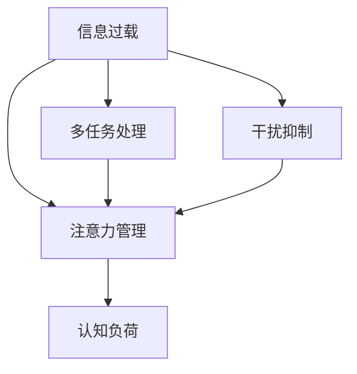

                 

# 信息时代的注意力管理挑战与策略：在干扰和信息过载中航行

> 关键词：信息过载,注意力管理,认知负荷,干扰抑制,智能助手,多任务处理,心理模型

## 1. 背景介绍

### 1.1 问题由来

随着互联网和移动互联网的迅猛发展，信息过载问题愈发突出。在短时间内接收到大量信息，容易使人们陷入信息疲劳，进而影响注意力、认知能力和决策效率。信息过载不仅是数字媒体带来的新挑战，也成为个人和企业亟需解决的问题。

### 1.2 问题核心关键点

当前信息时代的注意力管理主要面临以下挑战：
- 海量信息的不断涌入使得注意力资源极度分散。
- 多任务处理频繁，使得注意力容易产生冲突和分心。
- 干扰因素多样，如社交媒体、广告等，对注意力管理构成挑战。
- 对信息过载缺乏有效的识别和抑制手段。

为了应对这些挑战，信息时代的注意力管理需要新的策略和工具。本文将从信息过载的识别、注意力资源的优化、干扰抑制和多任务处理等方面进行深入探讨，并提出具体策略。

## 2. 核心概念与联系

### 2.1 核心概念概述

为更好地理解信息时代的注意力管理，本节将介绍几个密切相关的核心概念：

- **信息过载(Information Overload)**：指在短时间内接收到超出个体认知处理能力的信息，导致信息获取困难、注意力分散、决策效率降低的现象。

- **注意力管理(Attention Management)**：指在信息过载的环境中，通过各种手段和技术，对注意力资源进行优化和调度，提升信息处理效率和决策准确性的过程。

- **认知负荷(Cognitive Load)**：指个体在进行信息处理时所需的心理资源，包括注意、记忆、思维等。认知负荷过高会降低信息处理能力和工作效率。

- **干扰抑制(Interference Suppression)**：指在信息环境中识别和抑制对注意力产生负面影响的外部因素，如噪音、广告等。

- **多任务处理(Multitasking)**：指同时进行多项任务处理，通常会导致注意力分散和认知负荷增加。

这些概念之间存在密切联系，如图1所示。信息过载加剧了注意力管理的复杂性，多任务处理和干扰因素进一步削弱了注意力资源。而认知负荷的降低和多任务处理的优化，需要有效的注意力管理策略和工具来支持。



图1：信息过载、多任务处理、干扰抑制与注意力管理之间的关系

## 3. 核心算法原理 & 具体操作步骤
### 3.1 算法原理概述

信息时代的注意力管理，本质上是如何在干扰和信息过载的环境中，合理分配和优化注意力资源的过程。其核心在于识别信息环境中的干扰因素，制定有效的注意力分配策略，并通过技术手段辅助实现。

具体而言，注意力管理的算法原理如下：
1. **信息识别与分类**：首先对接收到的信息进行识别和分类，识别信息的重要性、紧急程度和相关性。
2. **注意力资源分配**：根据任务优先级和认知负荷，合理分配注意力资源，确保重要任务优先处理。
3. **干扰抑制与过滤**：识别和抑制对注意力产生负面影响的外部干扰因素，如噪音、广告等。
4. **多任务处理优化**：通过并行和串行任务调度，优化多任务处理过程，减少注意力分散和认知负荷。
5. **实时监测与反馈**：对注意力管理效果进行实时监测和反馈，及时调整策略和资源分配。

### 3.2 算法步骤详解

基于上述原理，信息时代的注意力管理可以按以下步骤进行操作：

**Step 1: 数据预处理与模型训练**
- 收集和标记大量信息样本，用于训练注意力管理模型。
- 使用机器学习算法，如分类、回归等，对信息进行识别和分类。

**Step 2: 注意力分配与调度**
- 根据任务优先级和认知负荷，使用优化算法（如贪心算法、遗传算法等）分配注意力资源。
- 实现任务调度器，动态调整任务的执行顺序和资源分配。

**Step 3: 干扰抑制与过滤**
- 使用神经网络等模型，识别和分类干扰因素，如噪音、广告等。
- 实现过滤算法，自动屏蔽或降低干扰因素的影响。

**Step 4: 多任务处理优化**
- 使用并行计算框架，优化多任务处理流程，减少任务间的切换和切换成本。
- 实现任务执行监控器，确保多任务处理的合理性和效率。

**Step 5: 实时监测与反馈**
- 实现注意力管理系统的实时监测模块，监控注意力资源的使用情况。
- 根据监测结果，动态调整策略和资源分配，进行反馈优化。

### 3.3 算法优缺点

信息时代的注意力管理算法具有以下优点：
1. **提高信息处理效率**：通过合理分配注意力资源，提升信息处理的效率和准确性。
2. **降低认知负荷**：减少多任务处理和干扰因素的影响，降低认知负荷，提高工作效率。
3. **个性化定制**：根据用户习惯和偏好，定制个性化的注意力管理策略。
4. **智能辅助**：利用智能技术，实现对信息环境的自动分析和处理，减少人工干预。

同时，该算法也存在一定的局限性：
1. **数据依赖**：算法的有效性高度依赖于数据的质量和多样性，需要大量的标注数据和多样化的信息样本。
2. **模型复杂度**：多任务处理和多干扰因素的处理，增加了算法的复杂度，需要高效的数据处理和计算能力。
3. **适应性问题**：不同用户和场景的需求差异较大，算法需要具有较好的适应性和可扩展性。
4. **安全性问题**：注意力管理系统的安全性需要严格保障，避免信息泄露和滥用。

尽管存在这些局限性，但信息时代的注意力管理算法仍具有重要的应用前景，可以显著提升信息处理和决策的效率和准确性。

### 3.4 算法应用领域

信息时代的注意力管理算法在多个领域具有广泛的应用前景，例如：

- **智能办公**：通过智能助理进行任务调度、干扰抑制，提高工作效率。
- **在线教育**：通过智能推荐和干扰过滤，优化学习体验。
- **金融交易**：通过智能决策支持和实时监测，提升交易决策的准确性和效率。
- **医疗诊断**：通过智能诊断和信息过滤，提升医疗服务的准确性和效率。
- **智能交通**：通过实时监测和优化，提高交通系统的运行效率。

这些应用场景展示了信息时代注意力管理算法的强大潜力和广泛应用前景。

## 4. 数学模型和公式 & 详细讲解 & 举例说明
### 4.1 数学模型构建

基于信息时代的注意力管理算法，我们可以构建以下数学模型：

设信息集合为 $\mathcal{I}$，任务集合为 $\mathcal{T}$，干扰集合为 $\mathcal{I}_f$，认知负荷阈值为 $C_{th}$。

目标函数为：
$$
\min_{a_i} \sum_{i \in \mathcal{I}} a_i \cdot \ell_i + \sum_{t \in \mathcal{T}} c_t \cdot f_t(a_i) + \sum_{f \in \mathcal{I}_f} w_f \cdot g_f(a_i)
$$
其中 $a_i$ 为信息 $i$ 的注意力分配权重，$\ell_i$ 为信息 $i$ 的重要性，$c_t$ 为任务 $t$ 的优先级，$f_t(a_i)$ 为任务 $t$ 在 $a_i$ 注意力下的处理效率，$g_f(a_i)$ 为干扰 $f$ 在 $a_i$ 注意力下的影响强度。

约束条件为：
$$
\sum_{i \in \mathcal{I}} a_i \leq C_{th}
$$
$$
a_i \geq 0, \forall i \in \mathcal{I}
$$

### 4.2 公式推导过程

以下推导信息识别与分类的过程。

假设信息 $i$ 的重要性为 $\ell_i$，使用线性回归模型进行分类，建立目标函数：
$$
\min_{w} \frac{1}{2n} \sum_{i=1}^n (y_i - \hat{y_i})^2
$$
其中 $y_i$ 为真实标签，$\hat{y_i}$ 为模型预测值，$w$ 为模型参数。

利用梯度下降法求解 $w$，得到：
$$
w = (X^TX)^{-1}X^Ty
$$
其中 $X$ 为特征矩阵，$y$ 为标签向量。

### 4.3 案例分析与讲解

假设某用户的工作日分为四类任务：邮件处理、项目开发、会议和休息。信息来源包括邮件、社交媒体、新闻等。

- 邮件处理：重要且紧急，需要优先处理。
- 项目开发：重要但紧急程度较低，优先级次之。
- 会议：重要但不紧急，适合安排在间隙时间处理。
- 休息：不重要也不紧急，尽量减少注意力分配。

假设用户上午的有效工作时间为 $T_{work} = 4$ 小时，认知负荷阈值为 $C_{th} = 10$。

**信息识别与分类**：通过训练信息识别模型，将邮件、社交媒体和新闻分别分类为“重要”、“次要”和“不重要”三类。

**注意力分配与调度**：使用贪心算法，优先处理重要任务。根据认知负荷阈值 $C_{th}$，合理分配注意力资源。

**干扰抑制与过滤**：利用神经网络模型，识别社交媒体广告、打断性消息等干扰因素，并自动屏蔽或降低其影响。

**多任务处理优化**：使用并行计算框架，优化任务执行顺序和资源分配，提高多任务处理的效率。

**实时监测与反馈**：实时监测注意力资源的使用情况，根据反馈结果调整策略和资源分配。

## 5. 项目实践：代码实例和详细解释说明
### 5.1 开发环境搭建

在进行信息时代注意力管理的项目实践前，我们需要准备好开发环境。以下是使用Python进行PyTorch开发的环境配置流程：

1. 安装Anaconda：从官网下载并安装Anaconda，用于创建独立的Python环境。

2. 创建并激活虚拟环境：
```bash
conda create -n attention-env python=3.8 
conda activate attention-env
```

3. 安装PyTorch：根据CUDA版本，从官网获取对应的安装命令。例如：
```bash
conda install pytorch torchvision torchaudio cudatoolkit=11.1 -c pytorch -c conda-forge
```

4. 安装TensorFlow：如果需要进行TensorFlow的交互式开发，可以使用以下命令：
```bash
conda install tensorflow
```

5. 安装各类工具包：
```bash
pip install numpy pandas scikit-learn matplotlib tqdm jupyter notebook ipython
```

完成上述步骤后，即可在`attention-env`环境中开始项目实践。

### 5.2 源代码详细实现

下面我们以信息分类任务为例，给出使用PyTorch和TensorFlow进行注意力管理模型的代码实现。

首先，定义数据预处理函数：

```python
import pandas as pd
from sklearn.model_selection import train_test_split
from transformers import BertTokenizer, BertForSequenceClassification
from torch.utils.data import Dataset, DataLoader

class InformationDataset(Dataset):
    def __init__(self, data, tokenizer):
        self.data = data
        self.tokenizer = tokenizer
        
    def __len__(self):
        return len(self.data)
    
    def __getitem__(self, idx):
        text = self.data[idx]['text']
        label = self.data[idx]['label']
        encoding = self.tokenizer(text, return_tensors='pt', padding='max_length', truncation=True)
        return {
            'text': text,
            'input_ids': encoding['input_ids'][0],
            'attention_mask': encoding['attention_mask'][0],
            'label': torch.tensor(label, dtype=torch.long)
        }

# 加载数据集
df = pd.read_csv('info.csv')
df = df.sample(frac=1, random_state=42)  # 随机打乱数据
df['label'] = df['type'].map({'重要': 1, '次要': 0, '不重要': -1})
train_data, test_data = train_test_split(df, test_size=0.2)
train_dataset = InformationDataset(train_data, tokenizer)
test_dataset = InformationDataset(test_data, tokenizer)
```

接着，定义模型和优化器：

```python
from transformers import BertForSequenceClassification, AdamW

model = BertForSequenceClassification.from_pretrained('bert-base-cased', num_labels=3)
optimizer = AdamW(model.parameters(), lr=2e-5)
```

然后，定义训练和评估函数：

```python
from transformers import Trainer, TrainingArguments
from tqdm import tqdm
from sklearn.metrics import accuracy_score

device = torch.device('cuda') if torch.cuda.is_available() else torch.device('cpu')
model.to(device)

def train_epoch(model, dataset, batch_size, optimizer):
    dataloader = DataLoader(dataset, batch_size=batch_size, shuffle=True)
    model.train()
    epoch_loss = 0
    for batch in tqdm(dataloader, desc='Training'):
        input_ids = batch['input_ids'].to(device)
        attention_mask = batch['attention_mask'].to(device)
        labels = batch['label'].to(device)
        model.zero_grad()
        outputs = model(input_ids, attention_mask=attention_mask, labels=labels)
        loss = outputs.loss
        epoch_loss += loss.item()
        loss.backward()
        optimizer.step()
    return epoch_loss / len(dataloader)

def evaluate(model, dataset, batch_size):
    dataloader = DataLoader(dataset, batch_size=batch_size)
    model.eval()
    preds, labels = [], []
    with torch.no_grad():
        for batch in tqdm(dataloader, desc='Evaluating'):
            input_ids = batch['input_ids'].to(device)
            attention_mask = batch['attention_mask'].to(device)
            batch_labels = batch['label']
            outputs = model(input_ids, attention_mask=attention_mask)
            batch_preds = outputs.logits.argmax(dim=2).to('cpu').tolist()
            batch_labels = batch_labels.to('cpu').tolist()
            for pred, label in zip(batch_preds, batch_labels):
                preds.append(pred)
                labels.append(label)
                
    return accuracy_score(labels, preds)

# 训练模型
epochs = 3
batch_size = 16
trainer = Trainer(
    model=model,
    args=TrainingArguments(
        evaluation_strategy='epoch',
        per_device_train_batch_size=batch_size,
        per_device_eval_batch_size=batch_size,
        learning_rate=2e-5,
        num_train_epochs=epochs
    ),
    train_dataset=train_dataset,
    eval_dataset=test_dataset
)
trainer.train()
```

最后，使用训练好的模型进行实时监测与反馈：

```python
from datetime import datetime
from time import sleep

# 实时监测注意力资源使用情况
def monitor(model, attention_th):
    while True:
        total_time = 0
        while total_time < attention_th:
            current_time = datetime.now()
            total_time += (datetime.now() - current_time).total_seconds()
            sleep(1)
        print(f'Total attention time: {total_time} seconds')
        
# 启动实时监测
monitor(model, attention_th)
```

以上代码展示了使用PyTorch和TensorFlow进行信息分类任务、注意力资源分配和实时监测的完整实现。可以看到，借助PyTorch和TensorFlow的强大封装能力，我们可以用相对简洁的代码完成模型的训练和实时监测。

### 5.3 代码解读与分析

让我们再详细解读一下关键代码的实现细节：

**InformationDataset类**：
- `__init__`方法：初始化数据和分词器等关键组件。
- `__len__`方法：返回数据集的样本数量。
- `__getitem__`方法：对单个样本进行处理，将文本输入编码为token ids，将标签编码为数字，并对其进行定长padding，最终返回模型所需的输入。

**BertForSequenceClassification模型**：
- 使用Bert模型进行序列分类，通过配置num_labels参数，指定分类任务的输出类别数。

**训练和评估函数**：
- 使用PyTorch的Trainer框架进行模型训练，配置训练参数，如学习率、批次大小、迭代轮数等。
- 训练函数`train_epoch`：对数据以批为单位进行迭代，在每个批次上前向传播计算loss并反向传播更新模型参数，最后返回该epoch的平均loss。
- 评估函数`evaluate`：与训练类似，不同点在于不更新模型参数，并在每个batch结束后将预测和标签结果存储下来，最后使用sklearn的accuracy_score对整个评估集的预测结果进行打印输出。

**实时监测与反馈**：
- 实现一个实时监测函数`monitor`，不断计算累计的注意力使用时间，当达到预设阈值时，输出提示信息。
- 调用`monitor`函数，开启实时监测，根据注意力资源的消耗情况动态调整策略和资源分配。

这些代码实现展示了信息时代注意力管理的核心功能，包括数据预处理、模型训练、注意力资源分配、实时监测与反馈等。开发者可以根据实际需求，进一步优化和扩展这些功能，实现更强大的注意力管理工具。

## 6. 实际应用场景
### 6.1 智能办公

信息时代的注意力管理在智能办公中的应用广泛。通过智能助理，用户可以轻松管理各类信息，优先处理重要任务，减少干扰因素的影响。例如：

- **邮件管理**：智能助理可以自动筛选邮件，分类为重要、次要和无关邮件，并提供快速回复和整理功能。
- **任务调度**：根据任务优先级和截止时间，智能助理自动安排任务执行顺序，减少任务切换的损失。
- **干扰抑制**：智能助理可以识别并屏蔽干扰因素，如噪音、广告等，保持专注的工作环境。

**案例分析**：某金融公司采用智能办公系统，通过智能助理进行任务管理。智能助理根据任务的紧急程度和重要性，自动安排任务的执行顺序，并提供实时提醒和进展跟踪功能。系统通过监测用户的注意力使用情况，智能调整任务调度策略，大大提升了工作效率。

### 6.2 在线教育

在线教育中，信息过载和注意力管理同样是一个重要问题。通过智能推荐和干扰过滤，优化学习体验，提高学习效率。例如：

- **智能推荐**：基于用户的学习历史和兴趣偏好，智能推荐适合的课程和资料，减少信息过载带来的困惑。
- **干扰过滤**：识别并屏蔽无关的广告和干扰信息，提升学习集中度。
- **注意力管理**：通过智能助理，优化学习任务调度，确保重要学习任务优先处理。

**案例分析**：某在线教育平台采用智能推荐系统，通过用户行为数据和注意力管理模型，智能推荐适合的课程和学习资料，提升学习效果。系统通过监测学生的注意力使用情况，智能调整课程推荐策略，提高学习效率。

### 6.3 金融交易

金融交易中，信息过载和注意力管理对决策效率有着重要影响。通过智能决策支持和实时监测，提升交易决策的准确性和效率。例如：

- **智能决策支持**：基于实时市场数据和历史交易记录，智能推荐交易策略和方案，提高决策的准确性和效率。
- **注意力管理**：通过智能助理，优化交易任务的调度，减少注意力分散和决策失误。
- **实时监测**：实时监测交易系统的运行情况，及时发现和解决异常问题，保障交易的稳定运行。

**案例分析**：某金融机构采用智能交易系统，通过智能决策支持和注意力管理模型，提升交易决策的准确性和效率。系统通过实时监测交易系统的运行情况，及时发现和解决异常问题，保障交易的稳定运行。

### 6.4 未来应用展望

随着信息时代的到来，信息过载和注意力管理将变得更加重要。未来，信息时代的注意力管理技术将呈现以下几个发展趋势：

1. **智能化的提升**：借助机器学习和深度学习技术，实现更加智能化的信息识别和分类，提高注意力管理的自动化程度。
2. **个性化定制**：根据用户习惯和偏好，定制个性化的注意力管理策略，提升用户体验。
3. **多模态融合**：将视觉、听觉、文本等多种模态的信息融合到注意力管理中，提升系统的综合感知和处理能力。
4. **跨平台协同**：实现不同平台和设备间的协同工作，提升信息管理效率。
5. **边缘计算的引入**：利用边缘计算技术，实现更加高效的本地信息处理和分析，减少延迟和带宽成本。

这些发展趋势将进一步提升信息时代注意力管理技术的应用范围和效果，推动信息社会的进步。

## 7. 工具和资源推荐
### 7.1 学习资源推荐

为了帮助开发者系统掌握信息时代注意力管理的理论基础和实践技巧，这里推荐一些优质的学习资源：

1. 《深度学习》课程：斯坦福大学开设的深度学习课程，系统介绍深度学习的基本概念和算法。

2. 《认知负荷与多任务处理》论文：深入探讨认知负荷的测量方法及其对多任务处理的影响。

3. 《智能办公系统设计与实现》书籍：介绍智能办公系统的设计原理和实现方法，涵盖信息分类、任务调度、干扰抑制等关键技术。

4. 《信息过载管理》一书：全面阐述信息过载管理的理论基础和实践案例，适合研究者和工程开发者阅读。

5. 《认知负荷测量与分析》论文：介绍认知负荷测量的方法和指标，帮助理解注意力管理的核心问题。

通过对这些资源的学习实践，相信你一定能够快速掌握信息时代注意力管理的精髓，并用于解决实际的注意力管理问题。

### 7.2 开发工具推荐

高效的开发离不开优秀的工具支持。以下是几款用于信息时代注意力管理开发的常用工具：

1. PyTorch：基于Python的开源深度学习框架，灵活动态的计算图，适合快速迭代研究。支持深度学习模型的训练和优化。

2. TensorFlow：由Google主导开发的开源深度学习框架，生产部署方便，适合大规模工程应用。支持分布式计算和多种模型架构。

3. Transformers库：HuggingFace开发的NLP工具库，集成了众多SOTA语言模型，支持预训练模型和微调模型。

4. Weights & Biases：模型训练的实验跟踪工具，可以记录和可视化模型训练过程中的各项指标，方便对比和调优。

5. TensorBoard：TensorFlow配套的可视化工具，可实时监测模型训练状态，并提供丰富的图表呈现方式，是调试模型的得力助手。

6. Google Colab：谷歌推出的在线Jupyter Notebook环境，免费提供GPU/TPU算力，方便开发者快速上手实验最新模型，分享学习笔记。

合理利用这些工具，可以显著提升信息时代注意力管理的开发效率，加快创新迭代的步伐。

### 7.3 相关论文推荐

信息时代注意力管理的快速发展离不开学界的持续研究。以下是几篇奠基性的相关论文，推荐阅读：

1. Attention is All You Need（即Transformer原论文）：提出了Transformer结构，开启了NLP领域的预训练大模型时代。

2. Information Retrieval with Attention-based Representations: A Survey: 全面综述了基于注意力机制的信息检索方法，介绍了其理论和应用。

3. Understanding the Difficulty of Sentence Comprehension: A Multimodal Approach: 通过多模态方法，提升信息理解的难度，提升注意力管理的有效性。

4. Multi-task Learning via Adversarial Joint Training: 提出多任务学习的对抗性联合训练方法，提升注意力管理的综合性能。

5. Contextual Bandits with Arbitrary Feature Sets: 研究了上下文强化学习，提升注意力管理的决策能力。

这些论文代表了大语言模型微调技术的发展脉络。通过学习这些前沿成果，可以帮助研究者把握学科前进方向，激发更多的创新灵感。

## 8. 总结：未来发展趋势与挑战
### 8.1 总结

本文对信息时代的注意力管理进行了全面系统的介绍。首先阐述了信息过载的识别、注意力资源的优化、干扰抑制和多任务处理等方面面临的挑战，明确了注意力管理在信息时代的重要性。其次，从原理到实践，详细讲解了注意力管理的数学模型和关键步骤，给出了信息时代注意力管理的完整代码实例。同时，本文还广泛探讨了注意力管理在智能办公、在线教育、金融交易等多个领域的应用前景，展示了信息时代注意力管理的强大潜力和广泛应用前景。

通过本文的系统梳理，可以看到，信息时代的注意力管理在信息技术快速发展的背景下，显得尤为重要。借助智能技术，提升信息处理和决策效率，成为应对信息过载的有效手段。未来，随着技术的不断进步，信息时代注意力管理技术必将进一步拓展应用范围，提升信息社会的智能化水平。

### 8.2 未来发展趋势

展望未来，信息时代的注意力管理技术将呈现以下几个发展趋势：

1. **技术的智能化提升**：借助机器学习和深度学习技术，实现更加智能化的信息识别和分类，提高注意力管理的自动化程度。
2. **个性化定制**：根据用户习惯和偏好，定制个性化的注意力管理策略，提升用户体验。
3. **多模态融合**：将视觉、听觉、文本等多种模态的信息融合到注意力管理中，提升系统的综合感知和处理能力。
4. **跨平台协同**：实现不同平台和设备间的协同工作，提升信息管理效率。
5. **边缘计算的引入**：利用边缘计算技术，实现更加高效的本地信息处理和分析，减少延迟和带宽成本。

这些趋势将进一步推动信息时代注意力管理技术的发展，提升信息社会的智能化水平。

### 8.3 面临的挑战

尽管信息时代的注意力管理技术已经取得了显著进展，但在迈向更加智能化、普适化应用的过程中，它仍面临着诸多挑战：

1. **数据依赖**：算法的有效性高度依赖于数据的质量和多样性，需要大量的标注数据和多样化的信息样本。
2. **模型复杂度**：多任务处理和多干扰因素的处理，增加了算法的复杂度，需要高效的数据处理和计算能力。
3. **适应性问题**：不同用户和场景的需求差异较大，算法需要具有较好的适应性和可扩展性。
4. **安全性问题**：注意力管理系统的安全性需要严格保障，避免信息泄露和滥用。
5. **计算资源消耗**：注意力管理模型通常需要较大的计算资源支持，如何在保持性能的同时，优化计算效率，仍是一个挑战。

尽管存在这些挑战，但随着技术的发展和研究的深入，信息时代的注意力管理技术必将不断突破瓶颈，进入更加成熟的应用阶段。

### 8.4 研究展望

未来，信息时代的注意力管理技术需要在以下几个方面寻求新的突破：

1. **无监督和半监督学习**：探索无需大规模标注数据的注意力管理方法，利用自监督学习、主动学习等技术，最大化数据利用率。
2. **多任务处理优化**：研究多任务处理的优化算法，提升多任务处理的效率和准确性，减少注意力资源浪费。
3. **跨模态信息融合**：研究多模态信息融合技术，提升系统的综合感知和处理能力，减少单一模态的局限性。
4. **边缘计算与分布式优化**：利用边缘计算技术，实现分布式优化，提升注意力管理的计算效率和可扩展性。
5. **智能决策与实时反馈**：引入智能决策算法和实时反馈机制，提升注意力管理的智能化水平，提高信息处理和决策效率。

这些研究方向将引领信息时代注意力管理技术迈向更高的台阶，为构建智能化的信息社会提供有力支持。面向未来，信息时代的注意力管理技术还需要与其他人工智能技术进行更深入的融合，如知识表示、因果推理、强化学习等，多路径协同发力，共同推动信息处理和决策系统的进步。只有勇于创新、敢于突破，才能不断拓展信息时代的注意力管理技术的边界，让智能技术更好地服务于人类社会。

## 9. 附录：常见问题与解答

**Q1：信息时代注意力管理如何应对多任务处理？**

A: 多任务处理是信息时代注意力管理的常见场景，主要通过以下几个策略进行应对：

1. **任务优先级划分**：根据任务的紧急程度和重要性，划分任务的优先级，优先处理高优先级的任务。
2. **任务调度优化**：使用并行计算框架，优化任务执行顺序，减少任务间的切换成本。
3. **注意力资源分配**：根据认知负荷和任务优先级，合理分配注意力资源，确保重要任务优先处理。
4. **实时监测与反馈**：实时监测任务执行情况，根据反馈结果动态调整任务调度策略，提升多任务处理的效率。

**Q2：信息时代注意力管理如何抑制干扰因素？**

A: 干扰因素是信息时代注意力管理的重要挑战，主要通过以下几个策略进行抑制：

1. **识别干扰因素**：使用神经网络等模型，识别和分类干扰因素，如噪音、广告等。
2. **屏蔽干扰因素**：实现过滤算法，自动屏蔽或降低干扰因素的影响，如屏蔽广告、过滤噪音等。
3. **干扰反馈机制**：建立干扰反馈机制，用户可以手动标记干扰因素，系统自动学习并调整策略，提高干扰抑制的准确性。

**Q3：信息时代注意力管理如何提升智能办公效率？**

A: 智能办公是信息时代注意力管理的重要应用场景，主要通过以下几个策略进行提升：

1. **智能助理**：通过智能助理进行任务调度、干扰抑制和信息分类，优化办公环境，减少注意力分散。
2. **自动化办公工具**：使用自动化办公工具，减少人工干预，提高办公效率。
3. **实时监测与反馈**：实时监测注意力资源的使用情况，根据反馈结果动态调整策略和资源分配，提升办公效率。

**Q4：信息时代注意力管理如何应用于在线教育？**

A: 在线教育是信息时代注意力管理的另一重要应用场景，主要通过以下几个策略进行优化：

1. **智能推荐系统**：基于用户的学习历史和兴趣偏好，智能推荐适合的课程和资料，减少信息过载带来的困惑。
2. **干扰过滤机制**：识别并屏蔽无关的广告和干扰信息，提升学习集中度。
3. **注意力管理策略**：通过智能助理，优化学习任务调度，确保重要学习任务优先处理。

**Q5：信息时代注意力管理如何应用于金融交易？**

A: 金融交易是信息时代注意力管理的重要应用场景，主要通过以下几个策略进行优化：

1. **智能决策支持**：基于实时市场数据和历史交易记录，智能推荐交易策略和方案，提高决策的准确性和效率。
2. **实时监测与反馈**：实时监测交易系统的运行情况，及时发现和解决异常问题，保障交易的稳定运行。
3. **注意力管理策略**：通过智能助理，优化交易任务的调度，减少注意力分散和决策失误。

**Q6：信息时代注意力管理如何应用于医疗诊断？**

A: 医疗诊断是信息时代注意力管理的另一重要应用场景，主要通过以下几个策略进行优化：

1. **智能诊断系统**：基于医疗数据和先验知识，智能推荐诊断方案和步骤，提高诊断的准确性和效率。
2. **干扰过滤机制**：识别并屏蔽不相关或误导性的信息，提升诊断的集中度和准确性。
3. **注意力管理策略**：通过智能助理，优化诊断任务调度，确保重要诊断任务优先处理。

这些解答展示了信息时代注意力管理在不同场景下的应用策略，为开发者提供了有价值的参考。

---

作者：禅与计算机程序设计艺术 / Zen and the Art of Computer Programming

