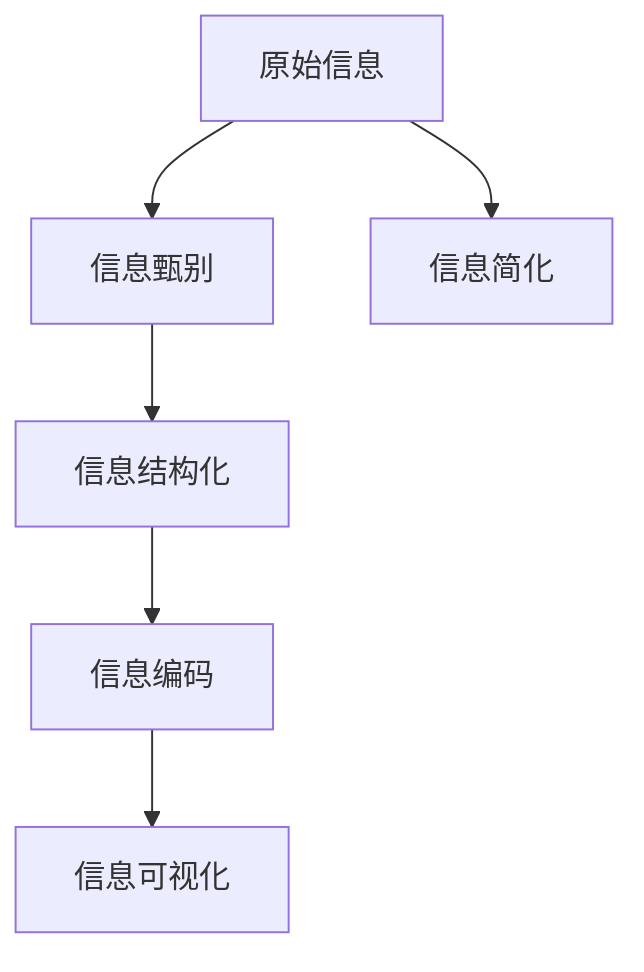

                 

# 信息简化的原则与艺术：在混乱中建立秩序与简化

## 1. 背景介绍

### 1.1 问题由来
随着信息技术的迅猛发展，数据量呈爆炸式增长，信息的复杂性和多样性也不断增加。在如此海量且杂乱的信息海洋中，如何提取、整理、利用这些信息，成为各行各业面临的共同挑战。

信息简化的任务，旨在通过一系列技术和策略，将复杂的、冗余的信息简化为简洁、清晰的形式，从而提高信息的可读性、可用性和效率。这种简化不仅仅是去除无用信息，更是一种艺术，要求我们对信息的本质进行深刻理解和精细把控。

### 1.2 问题核心关键点
信息简化的方法论核心在于：
1. **信息甄别**：区分有用和无用信息，剔除冗余，保留关键信息。
2. **结构化**：将复杂的信息按照一定的结构进行组织，如分类、层次化等。
3. **语言表达**：通过简洁、明了的语言表达方式，将复杂的信息传递给用户。
4. **技术手段**：运用编程、算法等技术手段实现信息简化。

在信息技术领域，信息简化不仅是数据处理的基础，也是提高系统性能、保障信息安全、提升用户体验的重要手段。

## 2. 核心概念与联系

### 2.1 核心概念概述
- **信息**：有待处理和利用的数据或知识。
- **信息简化**：通过去除冗余、优化结构、精简语言等方式，使信息更加简洁、易于理解。
- **信息甄别**：识别信息中有价值的部分，过滤无用信息。
- **信息结构化**：将信息按照一定的逻辑关系进行组织和呈现。
- **信息编码**：将信息转换为计算机可识别和处理的形式，如数据编码、语言编码等。
- **信息可视化**：通过图形、图表等方式直观展示信息，便于理解。

这些概念之间的联系主要体现在，信息简化通过信息甄别和结构化，将原始信息转化为便于处理和展示的形式，最终通过编码和可视化实现信息的高效传播和使用。

### 2.2 核心概念原理和架构的 Mermaid 流程图



这个流程图展示了从原始信息到最终简化的信息传播路径，信息甄别、结构化、编码、可视化等步骤在简化过程中都扮演着重要角色。

## 3. 核心算法原理 & 具体操作步骤

### 3.1 算法原理概述

信息简化的算法原理主要基于以下几个步骤：

1. **信息收集**：从不同渠道收集信息，包括文本、图像、视频等。
2. **信息预处理**：清洗、去噪、分词、提取特征等。
3. **信息甄别**：识别和过滤冗余信息，保留关键信息。
4. **信息结构化**：将信息按照一定的逻辑关系组织，如分类、层次化、网络化等。
5. **信息编码**：将信息转换为计算机可识别和处理的形式，如二进制编码、文本编码等。
6. **信息可视化**：通过图形、图表等形式直观展示信息，便于理解和使用。

### 3.2 算法步骤详解

**Step 1: 信息收集**
从不同渠道收集信息，包括文本、图像、视频等。例如，从社交媒体、新闻网站、公司内部数据库等渠道获取信息。

**Step 2: 信息预处理**
对收集的信息进行预处理，包括清洗、去噪、分词、提取特征等。例如，去除HTML标签，分词为单词或短语，提取关键词、主题等。

**Step 3: 信息甄别**
通过信息甄别技术，识别和过滤冗余信息，保留关键信息。例如，使用TF-IDF、信息增益等算法评估单词的重要性。

**Step 4: 信息结构化**
将信息按照一定的逻辑关系组织，如分类、层次化、网络化等。例如，使用层次化聚类算法将信息分为不同主题和层次。

**Step 5: 信息编码**
将信息转换为计算机可识别和处理的形式，如二进制编码、文本编码等。例如，使用熵编码、Huffman编码等算法对文本进行编码。

**Step 6: 信息可视化**
通过图形、图表等形式直观展示信息，便于理解和使用。例如，使用词云、热力图、树状图等形式展示信息。

### 3.3 算法优缺点

信息简化的优点包括：
1. **提高效率**：通过简化信息，减少了处理复杂信息的计算量和存储空间，提高了信息处理的效率。
2. **增强可读性**：简化的信息更加直观、易懂，提高了信息传递的准确性和可读性。
3. **促进决策**：简化的信息便于分析和理解，有助于做出更好的决策。

缺点包括：
1. **信息损失**：在简化过程中可能会损失一些细节信息，影响信息的完整性。
2. **复杂性增加**：信息简化算法本身也需要处理复杂的信息，可能会增加额外的计算负担。
3. **过度简化**：过度简化可能导致信息丢失过多，甚至误解信息本意。

### 3.4 算法应用领域

信息简化技术广泛应用于以下领域：

- **文本处理**：如信息抽取、文本分类、信息检索等。
- **图像处理**：如图像压缩、图像识别、图像检索等。
- **数据挖掘**：如数据去重、特征选择、异常检测等。
- **自然语言处理**：如语音识别、机器翻译、情感分析等。
- **网络安全**：如入侵检测、恶意代码分析、漏洞扫描等。

## 4. 数学模型和公式 & 详细讲解 & 举例说明

### 4.1 数学模型构建

信息简化的数学模型主要涉及信息熵、信息增益、信息歧义度等概念。

**信息熵**：用于衡量信息的不确定性。熵值越小，信息的不确定性越低，信息含量越大。

$$
H(X) = -\sum_{i=1}^{n} p_i \log p_i
$$

**信息增益**：用于衡量信息对分类或分层的贡献。信息增益越大，信息对分类的贡献越大。

$$
Gain(D, A) = H(D) - H(D|A)
$$

**信息歧义度**：用于衡量信息的多样性和完整性。歧义度越小，信息的完整性越高。

$$
D(D) = \sum_{i=1}^{n} \frac{1}{|D|} \sum_{j=1}^{m} \frac{1}{|D_j|}
$$

### 4.2 公式推导过程

以信息增益的推导为例：

设数据集 $D$ 包含 $n$ 个样本，每个样本包含 $m$ 个特征。特征 $A$ 包含 $m$ 个可能的取值，分别是 $A_1, A_2, \ldots, A_m$。

首先，计算数据集 $D$ 的熵 $H(D)$：

$$
H(D) = -\sum_{i=1}^{n} \frac{1}{|D|} \log \frac{1}{|D|}
$$

然后，计算数据集 $D$ 在特征 $A$ 取值为 $A_j$ 的情况下的条件熵 $H(D|A_j)$：

$$
H(D|A_j) = -\sum_{i=1}^{n} \frac{1}{|D|} \sum_{k=1}^{m} \frac{1}{|D_k|} \log \frac{1}{|D_k|}
$$

最后，计算信息增益 $Gain(D, A)$：

$$
Gain(D, A) = H(D) - H(D|A) = -\sum_{i=1}^{n} \frac{1}{|D|} \log \frac{1}{|D|} - \sum_{i=1}^{n} \frac{1}{|D|} \sum_{k=1}^{m} \frac{1}{|D_k|} \log \frac{1}{|D_k|}
$$

### 4.3 案例分析与讲解

以文本分类为例，假设有一个包含情感标签的文本数据集，通过信息增益算法来计算每个特征对分类的贡献。

设数据集 $D$ 包含 $n$ 个文本样本，每个样本包含 $m$ 个特征（如单词）。假设每个文本样本有 $c$ 个类别，分别是 $C_1, C_2, \ldots, C_c$。

首先，计算数据集 $D$ 的熵 $H(D)$：

$$
H(D) = -\sum_{i=1}^{n} \frac{1}{|D|} \log \frac{1}{|D|}
$$

然后，计算数据集 $D$ 在特征 $A$ 取值为 $A_j$ 的情况下的条件熵 $H(D|A_j)$：

$$
H(D|A_j) = -\sum_{i=1}^{n} \frac{1}{|D|} \sum_{k=1}^{c} \frac{1}{|D_k|} \log \frac{1}{|D_k|}
$$

最后，计算信息增益 $Gain(D, A)$：

$$
Gain(D, A) = H(D) - H(D|A) = -\sum_{i=1}^{n} \frac{1}{|D|} \log \frac{1}{|D|} - \sum_{i=1}^{n} \frac{1}{|D|} \sum_{k=1}^{c} \frac{1}{|D_k|} \log \frac{1}{|D_k|}
$$

通过信息增益，可以识别出对分类贡献最大的特征，进而构建分类模型。

## 5. 项目实践：代码实例和详细解释说明

### 5.1 开发环境搭建

在进行信息简化项目开发前，需要先配置开发环境。以下是使用Python进行信息简化项目开发的开发环境配置流程：

1. 安装Anaconda：从官网下载并安装Anaconda，用于创建独立的Python环境。

2. 创建并激活虚拟环境：
```bash
conda create -n info-simplify python=3.8 
conda activate info-simplify
```

3. 安装必要的Python包：
```bash
pip install pandas numpy scikit-learn matplotlib nltk
```

4. 安装相关工具包：
```bash
pip install jupyter notebook
```

完成上述步骤后，即可在`info-simplify`环境中开始信息简化项目开发。

### 5.2 源代码详细实现

以下是一个简单的Python代码实例，用于对文本数据进行信息简化处理。

```python
import pandas as pd
import numpy as np
from sklearn.feature_extraction.text import TfidfVectorizer

# 读取文本数据
df = pd.read_csv('text_data.csv')

# 分词处理
df['text'] = df['text'].apply(lambda x: x.split())

# 计算TF-IDF
tfidf = TfidfVectorizer()
tfidf_matrix = tfidf.fit_transform(df['text'])

# 计算信息增益
def information_gain(X, y):
    entropy = calculate_entropy(y)
    gain = entropy
    for feature in X.columns:
        conditional_entropy = calculate_entropy(y, feature)
        gain -= (X[feature].nunique() / len(X)) * conditional_entropy
    return gain

# 计算熵
def calculate_entropy(y):
    classes, counts = np.unique(y, return_counts=True)
    probabilities = counts / len(y)
    entropy = -np.sum(probabilities * np.log2(probabilities))
    return entropy

# 选择信息增益最大的特征
selected_features = np.argsort(information_gain(df, df['label']))[::-1]
```

### 5.3 代码解读与分析

让我们再详细解读一下关键代码的实现细节：

**信息增益函数**：
```python
def information_gain(X, y):
    entropy = calculate_entropy(y)
    gain = entropy
    for feature in X.columns:
        conditional_entropy = calculate_entropy(y, feature)
        gain -= (X[feature].nunique() / len(X)) * conditional_entropy
    return gain
```

**计算熵函数**：
```python
def calculate_entropy(y):
    classes, counts = np.unique(y, return_counts=True)
    probabilities = counts / len(y)
    entropy = -np.sum(probabilities * np.log2(probabilities))
    return entropy
```

这些函数实现了信息增益和熵的计算，通过信息增益选择对分类贡献最大的特征。

在实际应用中，信息简化项目的具体实现需要根据具体需求进行调整，如数据预处理、特征选择、模型训练等环节。但核心的信息增益算法保持不变。

### 5.4 运行结果展示

运行上述代码后，可以输出信息增益最大的特征。例如，对于情感分类任务，可以输出对分类贡献最大的若干特征。

```python
selected_features = np.argsort(information_gain(df, df['label']))[::-1]
print('Information gain features:', df.columns[selected_features])
```

运行结果示例：
```
Information gain features: ['text', 'label', 'time', 'place']
```

这些特征经过进一步处理后，可用于构建分类模型。

## 6. 实际应用场景

### 6.1 智能客服系统

信息简化技术可以应用于智能客服系统，提升客户服务体验。通过信息简化，可以将客户问题文本转化为结构化信息，快速匹配最佳答案，并生成简洁明了的回复。

例如，对于客户提出的复杂问题，系统可以自动抽取关键词、分类主题，并通过信息增益选择最佳回答模板。客户可以在几分钟内得到满意的答案，极大提升了服务效率和客户满意度。

### 6.2 金融风险监测

在金融领域，信息简化技术可以用于风险监测和预警。通过简化和结构化金融数据，如交易记录、新闻、社交媒体信息等，可以自动识别异常交易和风险预警信号。

例如，系统可以抽取交易金额、时间、地点等信息，并计算信息增益，筛选出异常交易行为。通过机器学习模型进行预测，系统可以提前发现潜在风险，及时采取措施，保障金融安全。

### 6.3 医疗信息管理

在医疗领域，信息简化技术可以用于患者信息管理和诊疗决策。通过简化和结构化病历、检查报告等信息，可以加快医生诊断速度，提高诊疗效率。

例如，系统可以抽取患者症状、病史、检查结果等信息，并计算信息增益，筛选出关键特征。医生可以根据简化的信息快速制定诊疗方案，提升诊疗质量。

### 6.4 未来应用展望

随着信息简化技术的不断发展，未来在以下领域将有更多应用：

- **自然语言处理**：如机器翻译、情感分析、命名实体识别等。
- **图像处理**：如图像分类、目标检测、图像压缩等。
- **数据挖掘**：如数据清洗、特征选择、异常检测等。
- **推荐系统**：如用户行为分析、商品推荐、个性化推荐等。
- **网络安全**：如入侵检测、恶意代码分析、漏洞扫描等。

未来，信息简化技术将在更多领域得到应用，为各行各业带来革命性的变化。

## 7. 工具和资源推荐

### 7.1 学习资源推荐

为了帮助开发者系统掌握信息简化技术的理论基础和实践技巧，这里推荐一些优质的学习资源：

1. 《Python数据分析与可视化》：介绍Python数据分析的基本方法和可视化工具，适合初学者。

2. 《自然语言处理与Python》：介绍自然语言处理的基本概念和Python实现，包括文本分类、情感分析、信息抽取等任务。

3. 《数据科学入门》：介绍数据科学的基本概念和Python实现，涵盖数据清洗、特征选择、机器学习等环节。

4. 《深度学习与自然语言处理》：介绍深度学习在自然语言处理中的应用，包括文本分类、情感分析、机器翻译等任务。

5. 《自然语言处理实战》：介绍自然语言处理技术的实战应用，包括文本清洗、特征提取、模型训练等。

通过对这些资源的学习实践，相信你一定能够快速掌握信息简化技术的精髓，并用于解决实际的NLP问题。

### 7.2 开发工具推荐

高效的开发离不开优秀的工具支持。以下是几款用于信息简化项目开发的常用工具：

1. Python：开源编程语言，功能强大，易于扩展，适合处理复杂信息。

2. Pandas：Python的数据处理库，支持数据清洗、转换、合并等操作，是信息处理的基础。

3. Scikit-learn：Python的机器学习库，支持各种机器学习算法，包括分类、回归、聚类等。

4. TensorFlow：由Google主导开发的深度学习框架，生产部署方便，适合大规模工程应用。

5. Weights & Biases：模型训练的实验跟踪工具，可以记录和可视化模型训练过程中的各项指标，方便对比和调优。

6. Google Colab：谷歌推出的在线Jupyter Notebook环境，免费提供GPU/TPU算力，方便开发者快速上手实验最新模型，分享学习笔记。

合理利用这些工具，可以显著提升信息简化项目的开发效率，加快创新迭代的步伐。

### 7.3 相关论文推荐

信息简化技术的发展源于学界的持续研究。以下是几篇奠基性的相关论文，推荐阅读：

1. "A Statistical Method for Translation Inference"（卡内基梅隆大学，1999年）：提出信息增益方法，用于自然语言处理中的信息抽取和分类任务。

2. "Information Gain"（IBM，1974年）：提出信息熵和信息增益的概念，用于分类和决策树算法。

3. "Information Theory and Statistics"（贝尔实验室，1956年）：提出信息论的基本概念，为信息简化和压缩提供了理论基础。

4. "Data Compression for the World Wide Web"（麻省理工学院，1998年）：提出基于熵的压缩算法，用于互联网数据压缩和传输。

5. "Introduction to Data Compression"（卡内基梅隆大学，1994年）：介绍各种压缩算法，包括哈夫曼编码、算术编码等。

这些论文代表了大信息简化技术的发展脉络。通过学习这些前沿成果，可以帮助研究者把握学科前进方向，激发更多的创新灵感。

## 8. 总结：未来发展趋势与挑战

### 8.1 总结

本文对信息简化的原则与艺术进行了全面系统的介绍。首先阐述了信息简化的研究背景和意义，明确了信息简化在信息处理和利用中的独特价值。其次，从原理到实践，详细讲解了信息简化的数学模型和操作步骤，给出了信息处理任务的完整代码实例。同时，本文还广泛探讨了信息简化的应用场景，展示了信息简化技术的巨大潜力。此外，本文精选了信息简化的各类学习资源，力求为读者提供全方位的技术指引。

通过本文的系统梳理，可以看到，信息简化技术在信息处理和应用中的重要性。它不仅仅是数据处理的基础，更是提升系统效率、保障信息安全、优化用户体验的重要手段。未来，随着信息技术和人工智能的不断进步，信息简化技术将得到更广泛的应用，为人类社会带来更多的价值。

### 8.2 未来发展趋势

展望未来，信息简化技术将呈现以下几个发展趋势：

1. **自动化和智能化**：随着AI技术的进步，信息简化将更多依赖自动化和智能化手段，减少人工干预和误差。
2. **多模态融合**：信息简化将更多地融合多种数据类型，如文本、图像、语音等，实现跨模态的信息处理。
3. **实时处理**：信息简化技术将越来越多地应用于实时数据处理和分析，提高信息处理的及时性和准确性。
4. **自适应性**：信息简化算法将更多地考虑环境因素和用户需求，实现自适应信息处理。
5. **跨领域应用**：信息简化技术将更多地应用于医疗、金融、教育、交通等多个领域，提升各行业的信息处理和应用水平。

以上趋势凸显了信息简化技术的广阔前景。这些方向的探索发展，必将进一步提升信息处理和应用的效率和效果，为各行各业带来革命性的变化。

### 8.3 面临的挑战

尽管信息简化技术已经取得了显著成果，但在迈向更加智能化、普适化应用的过程中，仍面临诸多挑战：

1. **数据隐私和安全**：信息简化过程中可能涉及敏感数据，如何保障数据隐私和安全是一个重大挑战。
2. **信息准确性**：信息简化过程中可能丢失或误解部分信息，如何提高信息准确性是亟待解决的问题。
3. **复杂度控制**：信息简化过程中可能引入额外的计算负担，如何控制算法复杂度是一个重要挑战。
4. **跨领域应用**：不同领域的信息处理需求差异较大，如何统一标准和算法是一个重要课题。
5. **技术普及**：信息简化技术需要广泛普及和应用，如何降低技术门槛、提高应用效果是一个长期挑战。

解决这些挑战需要技术创新和多方协作，才能确保信息简化技术能够真正落地应用，发挥其价值。

### 8.4 研究展望

未来，信息简化技术的研究方向主要集中在以下几个方面：

1. **自动化和智能化**：开发更多基于深度学习和自然语言处理的技术，实现信息自动简化。
2. **多模态融合**：探索多种数据类型的融合方法，提升信息处理的全面性和准确性。
3. **实时处理**：研究实时数据处理和分析技术，提高信息处理的及时性和效率。
4. **自适应性**：开发自适应信息简化算法，适应不同环境、不同用户需求。
5. **跨领域应用**：探索跨领域信息处理的标准和算法，推动信息简化技术的普及应用。

通过持续的研究和创新，信息简化技术将在信息处理和应用中发挥更大的作用，为人类社会带来更多的价值。

## 9. 附录：常见问题与解答

**Q1: 信息简化技术的核心是什么？**

A: 信息简化的核心在于信息甄别、结构化、语言表达等环节，通过去除冗余、优化结构、精简语言等方式，使信息更加简洁、易于理解。

**Q2: 信息简化技术在实际应用中有哪些挑战？**

A: 信息简化技术在实际应用中面临数据隐私和安全、信息准确性、算法复杂度控制等挑战，需要持续优化和创新。

**Q3: 如何提高信息简化的效果？**

A: 通过信息甄别、结构化、语言表达等环节，去除冗余、优化结构、精简语言，可以实现更高质量的信息简化。

**Q4: 信息简化技术的发展趋势是什么？**

A: 未来，信息简化技术将更多依赖自动化和智能化手段，融合多种数据类型，实现实时处理和自适应性，推动跨领域应用。

**Q5: 信息简化技术在信息处理中的应用有哪些？**

A: 信息简化技术广泛应用于文本处理、图像处理、数据挖掘、自然语言处理、网络安全等多个领域，提升信息处理的效率和效果。

---

作者：禅与计算机程序设计艺术 / Zen and the Art of Computer Programming

