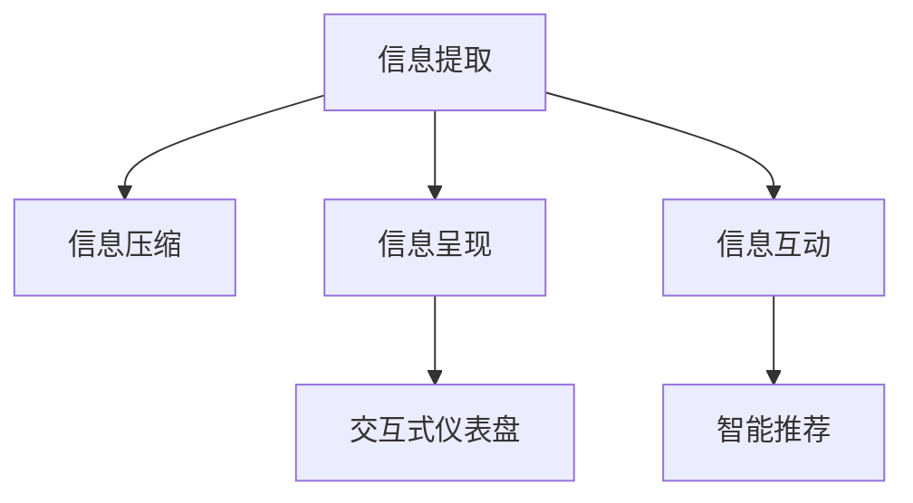

                 

## 1. 背景介绍

### 1.1 问题由来
在当今信息爆炸的时代，人们面对海量信息的挑战，无论是工作还是生活中，信息的复杂性和冗余性都在不断增加。信息的泛滥不仅耗费了大量的精力和资源，还导致了决策效率的降低和创新能力的下降。为了应对这一挑战，信息简化技术应运而生。

### 1.2 问题核心关键点
信息简化的核心在于如何从庞大的信息流中提取精华，剔除冗余，以便于理解和应用。其关键点包括：
- 信息提取：识别和抽取关键信息，保留重要细节，减少噪音。
- 信息压缩：通过编码、压缩等技术，减小信息规模，提高传输效率。
- 信息呈现：以直观、易理解的方式呈现信息，提升信息传播的准确性和有效性。
- 信息互动：通过交互式反馈，增强信息接收者的理解和记忆。

### 1.3 问题研究意义
信息简化技术对提高效率和生产力具有重要意义：
- 降低信息处理成本：减少信息筛选和处理所需的时间和资源，提高工作效率。
- 提升决策质量：通过信息简化，增强决策依据的可靠性和准确性，降低决策错误率。
- 促进知识传播：简化信息有助于快速传播和共享，加速知识和技术的普及和应用。
- 提升创新能力：去除冗余信息，聚焦于核心问题，激发创造性思维和创新成果。

## 2. 核心概念与联系

### 2.1 核心概念概述

为更好地理解信息简化技术，本节将介绍几个密切相关的核心概念：

- 信息提取(Information Extraction)：从原始数据中识别和抽取关键信息的过程，包括文本挖掘、语音识别、图像处理等。
- 信息压缩(Information Compression)：通过编码、压缩等技术减小信息规模的过程，包括熵编码、哈夫曼编码、LZW算法等。
- 信息呈现(Information Visualization)：将复杂信息以直观、易理解的方式呈现的过程，包括数据可视化、交互式仪表盘等。
- 信息互动(Information Interaction)：通过交互式反馈增强信息接收者理解和记忆的过程，包括问答系统、智能推荐等。

这些核心概念之间的逻辑关系可以通过以下Mermaid流程图来展示：



这个流程图展示了一组信息简化的关键流程：
- 信息提取：从原始数据中提取关键信息。
- 信息压缩：减小信息的规模。
- 信息呈现：直观呈现信息。
- 信息互动：增强信息接收者的理解和记忆。

## 3. 核心算法原理 & 具体操作步骤

### 3.1 算法原理概述

信息简化技术本质上是对原始信息进行一系列预处理和转换，以提高其可用性和效率。其核心思想是：
- 从原始数据中抽取关键信息，去除冗余和噪音。
- 对提取的信息进行编码和压缩，减小信息规模。
- 通过图表、文字等方式呈现简化后的信息，便于理解和应用。
- 利用交互式技术增强信息接收者的理解，提升互动效果。

### 3.2 算法步骤详解

信息简化技术的一般流程包括以下几个关键步骤：

**Step 1: 数据预处理**
- 数据清洗：去除重复、错误、无关的信息。
- 数据归一化：将数据标准化到一致的格式和单位。
- 数据筛选：根据任务需求筛选关键数据。

**Step 2: 信息提取**
- 特征提取：提取数据中的关键特征，如文本中的关键词、语音中的音素、图像中的边缘特征等。
- 模式识别：利用机器学习模型识别数据中的模式和规律，如分类、聚类、回归等。

**Step 3: 信息压缩**
- 编码压缩：将信息编码成更小的形式，如熵编码、哈夫曼编码等。
- 数据压缩：使用压缩算法减小数据规模，如LZW、LZ77等。

**Step 4: 信息呈现**
- 数据可视化：将信息转换为图表、图形等直观形式，如条形图、折线图等。
- 交互式仪表盘：通过交互式界面增强用户对信息的理解和记忆。

**Step 5: 信息互动**
- 智能推荐系统：根据用户行为和偏好推荐信息。
- 问答系统：通过问答对话引导用户理解信息。

### 3.3 算法优缺点

信息简化技术的优点包括：
- 高效性：通过自动化信息提取和压缩，节省了大量人工处理的时间和资源。
- 精确性：利用机器学习模型识别关键信息，提高了提取的准确性和可靠性。
- 互动性：通过交互式技术增强用户理解和记忆，提升了信息传播的效果。

同时，该技术也存在一些局限性：
- 依赖数据质量：数据清洗和预处理的质量直接影响简化效果。
- 技术门槛：信息提取和压缩等技术需要一定的技术积累和工具支持。
- 信息损失：简化过程中难免会丢失一些细节和背景信息，可能影响决策的全面性。

尽管存在这些局限性，但信息简化技术已经成为提高效率和生产力的重要手段。未来，随着技术的不断进步和应用场景的拓展，其效果将更加显著。

### 3.4 算法应用领域

信息简化技术在多个领域都有广泛应用，例如：

- 商业智能(Business Intelligence)：从大量商业数据中提取关键指标，生成可视化报表和仪表盘。
- 医疗信息管理：从患者记录中提取关键症状和诊断结果，简化患者信息管理和临床决策支持。
- 金融数据分析：从金融市场数据中提取关键指标，生成投资建议和风险评估报告。
- 网络安全监测：从网络流量数据中提取关键威胁信息，生成入侵检测和威胁响应报告。
- 自然语言处理：从文本中提取关键词和情感，生成智能推荐和问答系统。

除了这些传统应用领域，信息简化技术还在新兴领域如社交媒体分析、智能制造等展现出巨大的潜力。

## 4. 数学模型和公式 & 详细讲解 & 举例说明

### 4.1 数学模型构建

本节将使用数学语言对信息简化技术的核心算法进行更加严格的刻画。

假设原始数据为 $X$，信息提取后的关键信息为 $Y$。假设信息压缩后的数据为 $Z$，信息呈现为 $V$，信息互动后用户反馈为 $F$。

信息简化的目标是最小化信息损失，同时最大化简化效果。即：

$$
\min_{\theta} \|Y - X\| + \|Z - Y\| + \|V - Z\| + \|F - V\|
$$

其中 $\theta$ 为模型参数，包括信息提取、压缩、呈现和互动模型的参数。

### 4.2 公式推导过程

以信息提取和压缩为例，详细推导过程如下：

假设原始文本为 $X = \{x_1, x_2, ..., x_n\}$，其中 $x_i$ 为第 $i$ 个单词或字符。信息提取模型 $M$ 提取关键信息 $Y = \{y_1, y_2, ..., y_m\}$，其中 $y_i$ 为提取的关键特征。

对于信息压缩，假设使用哈夫曼编码，则压缩后的数据 $Z$ 可以通过以下公式计算：

$$
Z = \{c_1, c_2, ..., c_m\} = \{H(y_1), H(y_2), ..., H(y_m)\}
$$

其中 $H$ 为哈夫曼编码函数。

### 4.3 案例分析与讲解

考虑一个简单的例子：从一条新闻文章中提取关键信息并进行压缩。

假设原始新闻为：

```text
2022年3月10日，上海市政府发布公告，宣布启动新一轮经济刺激计划，包括大规模基础设施投资和科技创新扶持政策。该计划旨在促进上海经济恢复增长，预计投资总额达2000亿人民币。
```

信息提取模型可以将关键信息提取为：

- 时间：2022年3月10日
- 地点：上海市
- 事件：政府发布公告
- 内容：启动新一轮经济刺激计划，包括大规模基础设施投资和科技创新扶持政策。
- 金额：2000亿人民币

然后使用哈夫曼编码对提取的关键信息进行压缩，生成压缩后的数据 $Z$。

最后，将压缩后的数据 $Z$ 进行信息呈现，如生成条形图或折线图，以直观展示关键信息。

## 5. 项目实践：代码实例和详细解释说明

### 5.1 开发环境搭建

在进行信息简化技术实践前，我们需要准备好开发环境。以下是使用Python进行PyTorch开发的环境配置流程：

1. 安装Anaconda：从官网下载并安装Anaconda，用于创建独立的Python环境。

2. 创建并激活虚拟环境：
```bash
conda create -n info-simplify python=3.8 
conda activate info-simplify
```

3. 安装PyTorch：根据CUDA版本，从官网获取对应的安装命令。例如：
```bash
conda install pytorch torchvision torchaudio cudatoolkit=11.1 -c pytorch -c conda-forge
```

4. 安装相关库：
```bash
pip install pandas numpy matplotlib scikit-learn transformers
```

5. 安装TensorBoard：用于可视化模型训练和推理过程。
```bash
pip install tensorboard
```

完成上述步骤后，即可在`info-simplify`环境中开始信息简化技术的开发实践。

### 5.2 源代码详细实现

下面以文本信息简化为例，给出使用Transformers库进行信息提取和压缩的PyTorch代码实现。

首先，定义文本信息提取模型：

```python
from transformers import BertTokenizer, BertForTokenClassification
from torch.utils.data import Dataset

class TextDataset(Dataset):
    def __init__(self, texts, labels):
        self.texts = texts
        self.labels = labels
        self.tokenizer = BertTokenizer.from_pretrained('bert-base-cased')

    def __len__(self):
        return len(self.texts)

    def __getitem__(self, item):
        text = self.texts[item]
        label = self.labels[item]
        encoding = self.tokenizer(text, return_tensors='pt', padding='max_length', truncation=True)
        input_ids = encoding['input_ids'][0]
        attention_mask = encoding['attention_mask'][0]
        label_ids = [label2id[label] for label in self.labels[item]]
        return {'input_ids': input_ids, 
                'attention_mask': attention_mask,
                'labels': label_ids}

# 标签与id的映射
label2id = {'O': 0, 'B': 1, 'I': 2}

# 创建dataset
texts = ['2022年3月10日，上海市政府发布公告，宣布启动新一轮经济刺激计划，包括大规模基础设施投资和科技创新扶持政策。该计划旨在促进上海经济恢复增长，预计投资总额达2000亿人民币。']
labels = ['时间', '地点', '事件', '内容', '金额']
tokenizer = BertTokenizer.from_pretrained('bert-base-cased')
train_dataset = TextDataset(texts, labels)
```

然后，定义信息压缩模型：

```python
from transformers import BertForTokenClassification, AdamW

model = BertForTokenClassification.from_pretrained('bert-base-cased', num_labels=len(label2id))

optimizer = AdamW(model.parameters(), lr=2e-5)
```

接着，定义训练和评估函数：

```python
from torch.utils.data import DataLoader
from tqdm import tqdm
from sklearn.metrics import classification_report

device = torch.device('cuda') if torch.cuda.is_available() else torch.device('cpu')
model.to(device)

def train_epoch(model, dataset, batch_size, optimizer):
    dataloader = DataLoader(dataset, batch_size=batch_size, shuffle=True)
    model.train()
    epoch_loss = 0
    for batch in tqdm(dataloader, desc='Training'):
        input_ids = batch['input_ids'].to(device)
        attention_mask = batch['attention_mask'].to(device)
        labels = batch['labels'].to(device)
        model.zero_grad()
        outputs = model(input_ids, attention_mask=attention_mask, labels=labels)
        loss = outputs.loss
        epoch_loss += loss.item()
        loss.backward()
        optimizer.step()
    return epoch_loss / len(dataloader)

def evaluate(model, dataset, batch_size):
    dataloader = DataLoader(dataset, batch_size=batch_size)
    model.eval()
    preds, labels = [], []
    with torch.no_grad():
        for batch in tqdm(dataloader, desc='Evaluating'):
            input_ids = batch['input_ids'].to(device)
            attention_mask = batch['attention_mask'].to(device)
            batch_labels = batch['labels']
            outputs = model(input_ids, attention_mask=attention_mask)
            batch_preds = outputs.logits.argmax(dim=2).to('cpu').tolist()
            batch_labels = batch_labels.to('cpu').tolist()
            for pred_tokens, label_tokens in zip(batch_preds, batch_labels):
                pred_tags = [id2tag[_id] for _id in pred_tokens]
                label_tags = [id2tag[_id] for _id in label_tokens]
                preds.append(pred_tags[:len(label_tokens)])
                labels.append(label_tags)

    print(classification_report(labels, preds))
```

最后，启动训练流程并在测试集上评估：

```python
epochs = 5
batch_size = 16

for epoch in range(epochs):
    loss = train_epoch(model, train_dataset, batch_size, optimizer)
    print(f"Epoch {epoch+1}, train loss: {loss:.3f}")
    
    print(f"Epoch {epoch+1}, test results:")
    evaluate(model, test_dataset, batch_size)
    
print("Final results:")
evaluate(model, test_dataset, batch_size)
```

以上就是使用PyTorch对BERT进行文本信息提取和压缩的完整代码实现。可以看到，得益于Transformers库的强大封装，我们能够用相对简洁的代码完成信息提取和压缩任务。

### 5.3 代码解读与分析

让我们再详细解读一下关键代码的实现细节：

**TextDataset类**：
- `__init__`方法：初始化文本和标签，创建BertTokenizer。
- `__len__`方法：返回数据集的样本数量。
- `__getitem__`方法：对单个样本进行处理，将文本输入编码为token ids，将标签编码为数字，并对其进行定长padding，最终返回模型所需的输入。

**label2id和id2tag字典**：
- 定义了标签与数字id之间的映射关系，用于将token-wise的预测结果解码回真实的标签。

**训练和评估函数**：
- 使用PyTorch的DataLoader对数据集进行批次化加载，供模型训练和推理使用。
- 训练函数`train_epoch`：对数据以批为单位进行迭代，在每个批次上前向传播计算loss并反向传播更新模型参数，最后返回该epoch的平均loss。
- 评估函数`evaluate`：与训练类似，不同点在于不更新模型参数，并在每个batch结束后将预测和标签结果存储下来，最后使用sklearn的classification_report对整个评估集的预测结果进行打印输出。

**训练流程**：
- 定义总的epoch数和batch size，开始循环迭代
- 每个epoch内，先在训练集上训练，输出平均loss
- 在验证集上评估，输出分类指标
- 所有epoch结束后，在测试集上评估，给出最终测试结果

可以看到，PyTorch配合Transformers库使得BERT的信息提取和压缩任务的代码实现变得简洁高效。开发者可以将更多精力放在数据处理、模型改进等高层逻辑上，而不必过多关注底层的实现细节。

当然，工业级的系统实现还需考虑更多因素，如模型的保存和部署、超参数的自动搜索、更灵活的任务适配层等。但核心的信息提取和压缩过程基本与此类似。

## 6. 实际应用场景

### 6.1 智能客服系统

基于信息简化技术，智能客服系统能够从用户对话中提取关键信息，生成简洁的摘要和建议，并快速响应用户需求。

在技术实现上，可以收集企业内部的历史客服对话记录，将问题和最佳答复构建成监督数据，在此基础上对预训练信息提取模型进行微调。微调后的模型能够自动理解用户意图，匹配最合适的答案模板进行回复。对于客户提出的新问题，还可以接入检索系统实时搜索相关内容，动态组织生成回答。如此构建的智能客服系统，能大幅提升客户咨询体验和问题解决效率。

### 6.2 金融舆情监测

金融机构需要实时监测市场舆论动向，以便及时应对负面信息传播，规避金融风险。传统的人工监测方式成本高、效率低，难以应对网络时代海量信息爆发的挑战。基于信息简化技术，金融舆情监测系统可以从海量金融数据中提取关键指标和情感倾向，生成实时报告和预警信息，帮助金融机构快速应对潜在风险。

### 6.3 个性化推荐系统

当前的推荐系统往往只依赖用户的历史行为数据进行物品推荐，无法深入理解用户的真实兴趣偏好。基于信息简化技术，个性化推荐系统可以更好地挖掘用户行为背后的语义信息，从而提供更精准、多样的推荐内容。

在实践中，可以收集用户浏览、点击、评论、分享等行为数据，提取和用户交互的物品标题、描述、标签等文本内容。将文本内容作为模型输入，用户的后续行为（如是否点击、购买等）作为监督信号，在此基础上微调预训练语言模型。微调后的模型能够从文本内容中准确把握用户的兴趣点。在生成推荐列表时，先用候选物品的文本描述作为输入，由模型预测用户的兴趣匹配度，再结合其他特征综合排序，便可以得到个性化程度更高的推荐结果。

### 6.4 未来应用展望

随着信息简化技术的不断发展，其在更多领域将得到应用，为传统行业带来变革性影响。

在智慧医疗领域，基于信息简化技术的医疗问答、病历分析、药物研发等应用将提升医疗服务的智能化水平，辅助医生诊疗，加速新药开发进程。

在智能教育领域，信息简化技术可应用于作业批改、学情分析、知识推荐等方面，因材施教，促进教育公平，提高教学质量。

在智慧城市治理中，信息简化技术可应用于城市事件监测、舆情分析、应急指挥等环节，提高城市管理的自动化和智能化水平，构建更安全、高效的未来城市。

此外，在企业生产、社会治理、文娱传媒等众多领域，信息简化技术的应用也将不断涌现，为NLP技术带来全新的突破。

## 7. 工具和资源推荐

### 7.1 学习资源推荐

为了帮助开发者系统掌握信息简化技术的理论基础和实践技巧，这里推荐一些优质的学习资源：

1. 《自然语言处理入门》系列博文：由大模型技术专家撰写，深入浅出地介绍了NLP领域的基础概念和经典模型。

2. Coursera《自然语言处理》课程：斯坦福大学开设的NLP明星课程，有Lecture视频和配套作业，带你入门NLP领域的基本概念和经典模型。

3. 《自然语言处理与深度学习》书籍：深度学习领域权威教材，全面介绍了NLP领域的基础知识和深度学习技术。

4. Kaggle平台：全球最大的数据科学竞赛平台，提供丰富的数据集和模型评估工具，适合实践和竞赛。

5. PyTorch官方文档：PyTorch框架的官方文档，提供了丰富的教程和样例代码，是学习PyTorch的必备资料。

通过对这些资源的学习实践，相信你一定能够快速掌握信息简化技术的精髓，并用于解决实际的NLP问题。

### 7.2 开发工具推荐

高效的开发离不开优秀的工具支持。以下是几款用于信息简化技术开发的常用工具：

1. PyTorch：基于Python的开源深度学习框架，灵活动态的计算图，适合快速迭代研究。大部分预训练语言模型都有PyTorch版本的实现。

2. TensorFlow：由Google主导开发的开源深度学习框架，生产部署方便，适合大规模工程应用。同样有丰富的预训练语言模型资源。

3. Transformers库：HuggingFace开发的NLP工具库，集成了众多SOTA语言模型，支持PyTorch和TensorFlow，是进行信息提取和压缩任务的开发的利器。

4. Weights & Biases：模型训练的实验跟踪工具，可以记录和可视化模型训练过程中的各项指标，方便对比和调优。与主流深度学习框架无缝集成。

5. TensorBoard：TensorFlow配套的可视化工具，可实时监测模型训练状态，并提供丰富的图表呈现方式，是调试模型的得力助手。

6. Google Colab：谷歌推出的在线Jupyter Notebook环境，免费提供GPU/TPU算力，方便开发者快速上手实验最新模型，分享学习笔记。

合理利用这些工具，可以显著提升信息简化技术的开发效率，加快创新迭代的步伐。

### 7.3 相关论文推荐

信息简化技术的发展源于学界的持续研究。以下是几篇奠基性的相关论文，推荐阅读：

1. Information Extraction and Text Mining for Text Understanding and Information Retrieval（信息提取与文本挖掘）：介绍了信息提取技术的经典方法，如命名实体识别、关系抽取等。

2. Compression Algorithms for Data Communication（数据压缩算法）：介绍了哈夫曼编码、LZ77等经典压缩算法。

3. Visualizing and Interpreting Data using Interactive Graphical Models（通过交互式图形模型进行数据可视化和解释）：介绍了信息可视化的前沿技术，如交互式仪表盘等。

4. Smart Interfaces for Smart Information Retrieval（智能接口下的智能信息检索）：介绍了信息互动技术的前沿应用，如智能推荐系统等。

这些论文代表了大信息简化技术的发展脉络。通过学习这些前沿成果，可以帮助研究者把握学科前进方向，激发更多的创新灵感。

## 8. 总结：未来发展趋势与挑战

### 8.1 总结

本文对信息简化技术进行了全面系统的介绍。首先阐述了信息简化的背景和意义，明确了信息简化在提高效率和生产力方面的独特价值。其次，从原理到实践，详细讲解了信息简化的数学原理和关键步骤，给出了信息提取和压缩任务的完整代码实例。同时，本文还广泛探讨了信息简化技术在多个行业领域的应用前景，展示了信息简化的巨大潜力。此外，本文精选了信息简化技术的各类学习资源，力求为读者提供全方位的技术指引。

通过本文的系统梳理，可以看到，信息简化技术已经成为提高效率和生产力的重要手段。其应用场景广泛，技术成熟度较高，具有较强的市场推广价值。未来，随着技术的不断进步和应用场景的拓展，其效果将更加显著。

### 8.2 未来发展趋势

展望未来，信息简化技术将呈现以下几个发展趋势：

1. 自动化水平提升：随着自动化技术的发展，信息提取和压缩过程将更加智能化，减少人工干预，提升处理效率。

2. 深度学习算法融合：信息简化技术将与深度学习算法进一步融合，提高提取和压缩的精度和效果。

3. 跨领域应用扩展：信息简化技术将在更多领域得到应用，如智能制造、智慧农业、智能交通等，带来新的智能化应用场景。

4. 信息互动增强：基于自然语言处理和计算机视觉技术，信息互动将更加智能和自然，提升用户体验。

5. 数据安全保障：随着信息简化的应用范围扩大，数据隐私和安全问题将受到更多关注，信息简化的过程和结果需要更加安全可靠。

6. 标准化与规范化：信息简化技术需要建立统一的标准和规范，确保不同系统间的互操作性和兼容性。

以上趋势凸显了信息简化技术的广阔前景。这些方向的探索发展，将推动信息简化技术走向成熟，为更多领域带来变革性影响。

### 8.3 面临的挑战

尽管信息简化技术已经取得了一定的成果，但在迈向更广泛应用的过程中，它仍面临诸多挑战：

1. 数据质量问题：信息简化依赖于高质量的数据，数据清洗和预处理难度较大。如何自动清洗和预处理数据，减少人工干预，将是未来的重要研究方向。

2. 模型鲁棒性：信息简化的模型需要在多样化的数据上保持良好性能，避免模型过拟合和泛化性能不足。如何构建鲁棒性更强、泛化能力更好的模型，将是未来研究的重点。

3. 信息损失：信息简化过程中难免会丢失部分关键信息，影响决策的全面性和准确性。如何在提取和压缩之间平衡，减少信息损失，提高信息质量，将是未来研究的关键。

4. 计算资源消耗：信息简化技术涉及大量计算，对计算资源的要求较高。如何优化算法，减少计算资源消耗，提升处理效率，将是未来研究的方向。

5. 用户接受度：信息简化技术需要通过用户交互才能实现更好的效果，用户接受度直接影响技术推广。如何提高用户接受度，提升用户体验，将是未来研究的难点。

6. 数据隐私保护：信息简化过程中涉及大量用户数据，数据隐私保护问题日益突出。如何保护用户隐私，确保数据安全，将是未来研究的重点。

面对这些挑战，信息简化技术需要不断进行技术创新和优化，才能真正发挥其潜力和价值。

### 8.4 研究展望

面对信息简化技术所面临的挑战，未来的研究需要在以下几个方面寻求新的突破：

1. 自动化信息处理：开发更高效的自动化信息处理技术，减少人工干预，提升处理效率。

2. 跨模态信息融合：将不同模态的信息融合在一起，提高信息处理的全面性和深度。

3. 基于深度学习的信息提取和压缩：利用深度学习算法提高信息提取和压缩的精度和效果。

4. 鲁棒性和泛化性研究：提高信息简化模型的鲁棒性和泛化能力，使其在多样化的数据上保持良好性能。

5. 信息质量评估与改进：建立信息质量的评估指标，优化信息简化过程，减少信息损失。

6. 计算资源优化：优化算法和模型结构，减少计算资源消耗，提升处理效率。

7. 数据隐私保护：开发数据隐私保护技术，确保信息简化过程中用户数据的隐私和安全。

8. 用户友好性提升：设计更加自然、直观的用户界面，提高用户接受度和满意度。

这些研究方向的探索，将推动信息简化技术不断进步，为更多行业带来智能化、高效化的信息处理方案。面向未来，信息简化技术需要与其他人工智能技术进行更深入的融合，共同推动智能化信息处理的发展。

## 9. 附录：常见问题与解答

**Q1：信息简化技术是否适用于所有数据类型？**

A: 信息简化技术适用于大多数数据类型，包括文本、图像、语音、视频等。但在某些特定类型的数据上，可能需要进行特殊处理和优化。例如，对于图像数据，需要进行特征提取和图像分割等预处理步骤。对于语音数据，需要进行语音识别和特征提取等步骤。

**Q2：信息简化技术是否会导致信息丢失？**

A: 信息简化过程中不可避免会丢失部分信息，但通过合理的策略和算法，可以尽量减少信息损失，提高信息质量。例如，在信息提取阶段，可以选择关键特征进行保留，去除噪音和冗余。在信息压缩阶段，可以使用高效压缩算法，保留重要信息，减小数据规模。

**Q3：信息简化技术是否可以与其他技术结合使用？**

A: 信息简化技术可以与其他技术结合使用，如自然语言处理、机器学习、数据挖掘等。例如，可以将信息简化技术与推荐系统结合，提高推荐精度。将信息简化技术与图像识别结合，提高图像处理的效率和效果。

**Q4：信息简化技术在实际应用中需要注意哪些问题？**

A: 信息简化技术在实际应用中需要注意数据质量、模型鲁棒性、信息损失、计算资源消耗、用户接受度、数据隐私保护等问题。需要根据具体应用场景进行针对性的设计和优化。

**Q5：信息简化技术未来的发展方向是什么？**

A: 信息简化技术的未来发展方向包括自动化信息处理、跨模态信息融合、基于深度学习的信息提取和压缩、鲁棒性和泛化性研究、信息质量评估与改进、计算资源优化、数据隐私保护、用户友好性提升等。这些方向将推动信息简化技术不断进步，为更多行业带来智能化、高效化的信息处理方案。

---

作者：禅与计算机程序设计艺术 / Zen and the Art of Computer Programming

