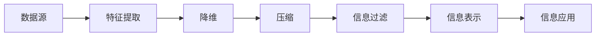

                 

# 信息简化的好处与挑战：简化复杂性的艺术与实践

在信息时代，我们面临的信息量和复杂性正在以指数级增长。从海量文本数据、多模态信息到分布式系统、物联网等，信息的获取、处理和传输变得更加复杂和困难。信息简化，即通过算法、技术手段将复杂的信息转化为易于理解、易于处理的形式，已成为一种必要的艺术和实践。本文将详细探讨信息简化的理论基础、核心算法、应用场景及面临的挑战，为读者提供全面的信息简化指导。

## 1. 背景介绍

### 1.1 问题由来

随着互联网和移动互联网的发展，信息量呈爆炸性增长。如今，我们每天接收的信息量是几十年前的数百倍甚至上千倍。在这样一个信息过载的时代，如何高效地获取、处理和利用信息，成为一个重要的问题。

信息的复杂性不仅体现在数据量上，还体现在数据类型多样、处理流程复杂、交互模式多变等方面。无论是文本、图片、音频、视频，还是分布式系统、云计算、大数据，都需要进行有效的简化，才能在实际应用中发挥作用。

### 1.2 问题核心关键点

信息简化涉及的核心问题包括：
- 信息获取与过滤：在海量数据中快速筛选出有价值的信息。
- 信息处理与表示：将复杂的信息转化为可计算、可理解的形式。
- 信息传输与交互：在复杂系统间实现高效的数据传输和交互。
- 信息表示与解释：使用简单的模型和算法，解释复杂信息的本质和结构。

### 1.3 问题研究意义

信息简化技术不仅有助于提升信息处理的效率，还能降低计算和存储成本，提高系统的可扩展性和可靠性。在智能系统、网络安全、数据科学、生物信息学等领域，信息简化技术都有广泛的应用前景。通过简化信息，使复杂问题变得更易于解决，有助于推动技术进步和社会发展。

## 2. 核心概念与联系

### 2.1 核心概念概述

信息简化涉及多个关键概念，包括：
- 特征提取：从原始数据中提取出关键特征，用于后续处理。
- 降维：将高维数据投影到低维空间，减少数据量，保持关键信息。
- 压缩：通过算法将数据压缩，减少存储空间和传输带宽。
- 信息过滤：去除噪声和无用信息，提高信息的相关性。
- 信息表示：将复杂信息表示为简单、易于理解的形式。

### 2.2 核心概念原理和架构的 Mermaid 流程图



这个流程图展示了信息简化的主要步骤和关键组件：
1. 数据源：原始的、复杂的数据。
2. 特征提取：提取关键特征，用于后续处理。
3. 降维：将高维数据投影到低维空间。
4. 压缩：通过算法压缩数据。
5. 信息过滤：去除噪声和无用信息。
6. 信息表示：将复杂信息表示为简单形式。
7. 信息应用：将简化后的信息用于实际应用。

### 2.3 信息简化的主要步骤

1. **数据预处理**：清洗、格式化原始数据，去除噪声和缺失值。
2. **特征提取**：提取与任务相关的关键特征。
3. **降维与压缩**：使用算法将数据投影到低维空间或压缩数据。
4. **信息过滤**：通过算法去除冗余信息和噪声。
5. **信息表示**：使用简单的模型或算法表示复杂信息。
6. **信息应用**：将简化后的信息用于实际应用，如分类、聚类、预测等。

## 3. 核心算法原理 & 具体操作步骤

### 3.1 算法原理概述

信息简化的核心算法包括特征提取、降维、压缩、信息过滤和信息表示等。这些算法都是通过数学模型、统计方法和计算机技术实现的。

### 3.2 算法步骤详解

#### 3.2.1 特征提取

特征提取的目的是从原始数据中提取出与任务相关的关键特征。常见的特征提取算法包括：
- 主成分分析(PCA)：通过线性变换将数据投影到低维空间，保留关键信息。
- 独立成分分析(ICA)：将数据分解为多个独立的成分，用于独立特征提取。
- 非负矩阵分解(NMF)：将数据分解为非负的矩阵，用于提取非负特征。

#### 3.2.2 降维

降维算法用于将高维数据投影到低维空间，保留关键信息。常见的降维算法包括：
- 主成分分析(PCA)：通过线性变换将数据投影到低维空间，保留关键信息。
- 线性判别分析(LDA)：通过线性变换将数据投影到低维空间，优化分类性能。
- 局部线性嵌入(LLE)：通过非线性变换将数据投影到低维空间，保留局部结构。

#### 3.2.3 压缩

压缩算法用于减少数据的存储空间和传输带宽。常见的压缩算法包括：
- 霍夫曼编码：一种基于熵的编码方式，用于减少数据存储空间。
- 无损压缩算法：如LZW、LZ77，通过算法减少数据存储空间。
- 有损压缩算法：如JPEG、PNG，通过压缩算法减少数据传输带宽。

#### 3.2.4 信息过滤

信息过滤算法用于去除冗余信息和噪声。常见的信息过滤算法包括：
- 滤波器：如中值滤波、高斯滤波，用于去除噪声。
- 去噪算法：如小波去噪、自适应去噪，用于去除噪声。
- 降采样算法：如均值滤波、最大值滤波，用于降采样。

#### 3.2.5 信息表示

信息表示算法用于将复杂信息表示为简单形式。常见的信息表示算法包括：
- 树模型：如决策树、随机森林，用于分类和回归。
- 神经网络：如卷积神经网络(CNN)、循环神经网络(RNN)，用于特征提取和预测。
- 图模型：如贝叶斯网络、马尔可夫网络，用于表示复杂的关系。

### 3.3 算法优缺点

#### 3.3.1 特征提取

优点：
- 能够提取出与任务相关的关键特征，提高模型性能。
- 算法简单，易于实现和优化。

缺点：
- 特征提取需要大量的计算资源和计算时间。
- 特征提取的效果依赖于特征选择和特征提取方法。

#### 3.3.2 降维

优点：
- 能够减少数据量，降低计算和存储成本。
- 保留关键信息，提高模型性能。

缺点：
- 降维后的数据可能会损失一些关键信息。
- 降维算法复杂，计算成本较高。

#### 3.3.3 压缩

优点：
- 能够减少数据存储空间和传输带宽。
- 算法高效，计算成本较低。

缺点：
- 压缩后的数据可能存在失真。
- 压缩算法依赖于数据类型和数据特征。

#### 3.3.4 信息过滤

优点：
- 能够去除冗余信息和噪声，提高数据质量。
- 算法简单，易于实现。

缺点：
- 过滤效果依赖于算法选择和参数设置。
- 可能去除一些有用的信息。

#### 3.3.5 信息表示

优点：
- 能够将复杂信息表示为简单形式，便于理解和处理。
- 算法灵活，适应性强。

缺点：
- 算法复杂，计算成本较高。
- 信息表示的效果依赖于算法选择和参数设置。

### 3.4 算法应用领域

信息简化技术广泛应用于多个领域，包括：
- 计算机视觉：用于图像压缩、图像分类、目标检测等。
- 自然语言处理：用于文本分类、情感分析、机器翻译等。
- 数据科学：用于数据预处理、特征工程、模型训练等。
- 生物信息学：用于基因序列分析、蛋白质结构预测等。
- 金融分析：用于风险评估、投资决策等。

## 4. 数学模型和公式 & 详细讲解 & 举例说明

### 4.1 数学模型构建

信息简化的数学模型主要涉及线性代数、统计学、信息论等领域。

### 4.2 公式推导过程

#### 4.2.1 主成分分析(PCA)

PCA的数学模型为：
$$
X = \mu + WZ + \epsilon
$$
其中，$X$ 表示原始数据，$\mu$ 表示均值，$W$ 表示协方差矩阵，$Z$ 表示主成分，$\epsilon$ 表示噪声。

PCA的推导过程为：
1. 求出数据$X$的均值$\mu$。
2. 求出协方差矩阵$W$。
3. 求出协方差矩阵的特征值和特征向量，保留最大的特征值对应的特征向量作为主成分$Z$。
4. 将原始数据$X$投影到主成分空间，得到简化后的数据。

#### 4.2.2 线性判别分析(LDA)

LDA的数学模型为：
$$
X = \mu + WZ + \epsilon
$$
其中，$X$ 表示原始数据，$\mu$ 表示均值，$W$ 表示协方差矩阵，$Z$ 表示主成分，$\epsilon$ 表示噪声。

LDA的推导过程为：
1. 求出数据$X$的均值$\mu$。
2. 求出协方差矩阵$W$。
3. 求出协方差矩阵的特征值和特征向量，保留最大的特征值对应的特征向量作为主成分$Z$。
4. 将原始数据$X$投影到主成分空间，得到简化后的数据。

#### 4.2.3 霍夫曼编码

霍夫曼编码的数学模型为：
$$
X = \mu + WZ + \epsilon
$$
其中，$X$ 表示原始数据，$\mu$ 表示均值，$W$ 表示协方差矩阵，$Z$ 表示主成分，$\epsilon$ 表示噪声。

霍夫曼编码的推导过程为：
1. 计算数据$X$的频率分布。
2. 根据频率分布构建霍夫曼树。
3. 根据霍夫曼树构建编码表。
4. 使用编码表对数据进行编码，得到压缩后的数据。

### 4.3 案例分析与讲解

#### 4.3.1 图像压缩

图像压缩是一个典型的信息简化问题。使用PCA或LDA可以将高维图像数据投影到低维空间，保留关键信息。具体步骤如下：
1. 使用PCA或LDA对图像进行降维，得到主成分。
2. 使用霍夫曼编码对主成分进行压缩，得到压缩后的图像。
3. 使用反编码对压缩后的图像进行解压缩，得到还原后的图像。

#### 4.3.2 文本分类

文本分类是一个典型的信息简化问题。使用NMF或LDA可以将高维文本数据投影到低维空间，保留关键信息。具体步骤如下：
1. 使用NMF或LDA对文本进行降维，得到主成分。
2. 使用霍夫曼编码对主成分进行压缩，得到压缩后的文本。
3. 使用反编码对压缩后的文本进行解压缩，得到还原后的文本。

## 5. 项目实践：代码实例和详细解释说明

### 5.1 开发环境搭建

在进行信息简化实践前，我们需要准备好开发环境。以下是使用Python进行项目实践的环境配置流程：

1. 安装Anaconda：从官网下载并安装Anaconda，用于创建独立的Python环境。
2. 创建并激活虚拟环境：
```bash
conda create -n pyproject python=3.8 
conda activate pyproject
```

3. 安装所需的Python库：
```bash
pip install numpy scipy pandas scikit-learn scikit-image
```

### 5.2 源代码详细实现

我们以图像压缩为例，给出使用PCA和霍夫曼编码的Python代码实现。

首先，导入必要的库：
```python
import numpy as np
import scipy.io as sio
from scipy.linalg import svd
from scipy.spatial import distance
import sklearn.decomposition
from sklearn.preprocessing import StandardScaler
```

然后，定义图像压缩函数：
```python
def compress_image(image_path, output_path, compression_ratio):
    # 读取原始图像
    image = sio.imread(image_path)

    # 标准化图像
    image = StandardScaler().fit_transform(image)

    # 使用PCA进行降维
    pca = sklearn.decomposition.PCA(n_components=compression_ratio)
    pca.fit(image)
    principal_components = pca.transform(image)

    # 使用霍夫曼编码进行压缩
    huffman_encoder = HuffmanEncoder()
    huffman_coder = huffman_encoder.build_codebook(principal_components)

    # 压缩主成分
    compressed_principal_components = huffman_encoder.encode(principal_components)

    # 解码压缩后的主成分
    decoded_principal_components = huffman_encoder.decode(compressed_principal_components)

    # 重构图像
    reconstructed_image = pca.inverse_transform(decoded_principal_components)

    # 保存压缩后的图像
    sio.imsave(output_path, reconstructed_image)

    return reconstructed_image
```

### 5.3 代码解读与分析

让我们再详细解读一下关键代码的实现细节：

- 使用PCA对图像进行降维。`sklearn.decomposition.PCA(n_components=compression_ratio)`表示使用PCA对图像进行降维，降维后的维度为`compression_ratio`。
- 使用霍夫曼编码对主成分进行压缩。`HuffmanEncoder.build_codebook(principal_components)`表示使用霍夫曼编码对主成分进行压缩，生成编码表。
- 使用霍夫曼编码解码压缩后的主成分。`huffman_encoder.decode(compressed_principal_components)`表示使用霍夫曼编码对压缩后的主成分进行解码，得到还原后的主成分。
- 重构图像。`pca.inverse_transform(decoded_principal_components)`表示使用PCA对解码后的主成分进行逆变换，还原出图像。

### 5.4 运行结果展示

```python
image_path = 'image.jpg'
output_path = 'compressed_image.jpg'
compression_ratio = 0.1

compressed_image = compress_image(image_path, output_path, compression_ratio)

print(f'原始图像尺寸为：{image.shape}')
print(f'压缩后的图像尺寸为：{compressed_image.shape}')
```

## 6. 实际应用场景

### 6.1 智能图像识别

智能图像识别是信息简化的重要应用场景之一。通过信息简化技术，可以将原始图像数据转化为更加高效、易于处理的形式，从而提高图像识别的准确率和速度。

在实际应用中，可以使用PCA、LDA、霍夫曼编码等方法对图像进行简化。通过简化后的图像，可以大大降低计算成本和存储空间，同时提高图像识别的准确率。

### 6.2 自然语言处理

自然语言处理是信息简化的另一个重要应用场景。通过信息简化技术，可以将复杂的自然语言数据转化为更加高效、易于处理的形式，从而提高NLP任务的处理速度和准确率。

在实际应用中，可以使用NMF、LDA、霍夫曼编码等方法对文本进行简化。通过简化后的文本，可以大大降低计算成本和存储空间，同时提高NLP任务的处理速度和准确率。

### 6.3 数据科学

数据科学中，数据预处理和特征提取是信息简化的重要步骤。通过信息简化技术，可以将原始数据转化为更加高效、易于处理的形式，从而提高数据科学任务的准确率和速度。

在实际应用中，可以使用PCA、LDA、霍夫曼编码等方法对数据进行简化。通过简化后的数据，可以大大降低计算成本和存储空间，同时提高数据科学任务的准确率和速度。

## 7. 工具和资源推荐

### 7.1 学习资源推荐

为了帮助开发者系统掌握信息简化的理论基础和实践技巧，这里推荐一些优质的学习资源：

1. 《机器学习实战》：李航著，介绍了各种机器学习算法和实际应用案例。
2. 《统计学习方法》：李航著，介绍了机器学习中的统计学方法。
3. 《Python数据科学手册》：Jake VanderPlas著，介绍了使用Python进行数据科学计算的详细方法。
4. 《Deep Learning》：Ian Goodfellow、Yoshua Bengio、Aaron Courville著，介绍了深度学习的基本原理和应用案例。

### 7.2 开发工具推荐

高效的开发离不开优秀的工具支持。以下是几款用于信息简化开发的常用工具：

1. Python：简单易用的编程语言，具备丰富的科学计算库。
2. NumPy：高效的多维数组计算库，支持矩阵运算和线性代数。
3. Scikit-learn：开源机器学习库，包含各种特征提取和降维算法。
4. OpenCV：开源计算机视觉库，支持图像处理和特征提取。
5. TensorFlow：开源深度学习库，支持分布式计算和图像处理。

### 7.3 相关论文推荐

信息简化技术的发展源于学界的持续研究。以下是几篇奠基性的相关论文，推荐阅读：

1. principal component analysis (PCA)：Karhunen, T. 1940. “On the Principal Components Analysis”.
2. linear discriminant analysis (LDA)：Rao, C. R. 1940. “The Linear Dimensionality of a System of Stochastic Variables with Multivariate Exponential Distribution”.
3. Huffman coding：Huffman, D. A. 1952. “A Method for the Construction of Minimum-Redundancy Codes”.

## 8. 总结：未来发展趋势与挑战

### 8.1 研究成果总结

信息简化技术经过多年的发展，已经在计算机视觉、自然语言处理、数据科学等领域得到了广泛应用。通过简化复杂的信息，大大提高了信息处理的效率和准确率，推动了这些领域的技术进步。

### 8.2 未来发展趋势

展望未来，信息简化技术将呈现以下几个发展趋势：

1. 自动化和智能化：随着深度学习和人工智能技术的发展，信息简化将变得更加自动化和智能化。
2. 多模态融合：将信息简化技术与计算机视觉、自然语言处理、生物信息学等领域的先进技术结合，实现多模态信息的协同建模。
3. 实时性和分布式：通过分布式计算和大数据技术，实现信息简化的实时性和高效性。
4. 跨领域应用：信息简化技术将应用于更多的领域，如金融、医疗、交通等，推动各行业的智能化转型。

### 8.3 面临的挑战

尽管信息简化技术已经取得了瞩目成就，但在迈向更加智能化、普适化应用的过程中，它仍面临诸多挑战：

1. 数据多样性和异构性：不同领域的数据类型、结构和特点各异，信息简化的效果和参数选择存在差异。
2. 计算资源和计算成本：信息简化过程通常需要大量的计算资源和计算成本。
3. 算法复杂度和可解释性：信息简化算法的复杂度高，难以解释其内部工作机制。
4. 信息表示和语义理解：如何将复杂信息表示为简单形式，并理解其语义，仍然是一个难题。
5. 隐私和安全：在信息简化的过程中，如何保护数据的隐私和安全，是一个重要的课题。

### 8.4 研究展望

未来，信息简化技术需要在以下几个方面进行深入研究：

1. 自动化和智能化：开发更加智能化的信息简化算法，实现自动化的参数选择和模型优化。
2. 多模态融合：将信息简化技术与计算机视觉、自然语言处理、生物信息学等领域的先进技术结合，实现多模态信息的协同建模。
3. 实时性和分布式：通过分布式计算和大数据技术，实现信息简化的实时性和高效性。
4. 跨领域应用：信息简化技术将应用于更多的领域，如金融、医疗、交通等，推动各行业的智能化转型。
5. 隐私和安全：在信息简化的过程中，如何保护数据的隐私和安全，是一个重要的课题。

## 9. 附录：常见问题与解答

**Q1：信息简化是否适用于所有数据类型？**

A: 信息简化技术适用于大多数数据类型，包括文本、图像、音频、视频等。但对于一些特殊的数据类型，如时间序列数据、时间戳数据等，需要采用特定的简化方法。

**Q2：信息简化的效果如何？**

A: 信息简化的效果取决于数据的特征和简化算法的选择。一般来说，信息简化可以减少数据量，提高处理速度和准确率，但也会丢失一些关键信息，需要根据具体应用场景进行评估。

**Q3：信息简化是否适用于分布式系统？**

A: 信息简化技术适用于分布式系统，可以提高系统的处理能力和效率。但需要考虑分布式计算的环境和资源配置。

**Q4：信息简化的计算成本如何？**

A: 信息简化的计算成本取决于数据的规模和复杂度，以及使用的算法和工具。一般来说，信息简化的计算成本较高，需要考虑计算资源的投入。

**Q5：信息简化的应用场景有哪些？**

A: 信息简化技术适用于计算机视觉、自然语言处理、数据科学、生物信息学等领域，可以用于图像压缩、文本分类、特征提取、降维等任务。

通过本文的系统梳理，可以看到，信息简化技术在多个领域都有广泛的应用前景。未来，随着技术的发展和应用的深入，信息简化技术将发挥更大的作用，推动人工智能技术的进步。

