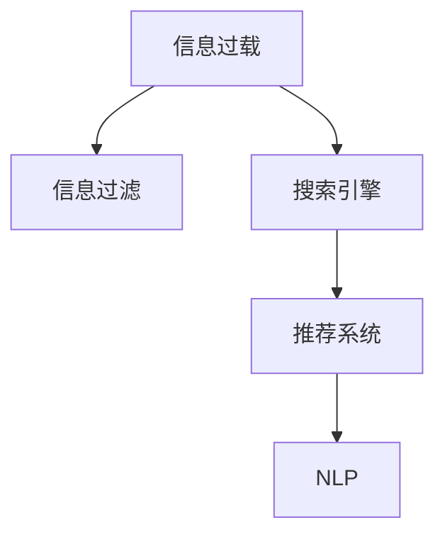

                 

## 1. 背景介绍

在当今信息爆炸的时代，每个人每天都被海量的信息所包围。无论是社交媒体上的帖子、新闻网站上的文章，还是搜索结果中的网页，信息过载已经成为了普遍现象。如何在这些信息中寻找有价值的内容，成为了许多人面临的挑战。本文将探讨信息过载的问题，并介绍一些有效的信息搜索策略，帮助读者在庞大的信息海洋中找到有价值的信息。

## 2. 核心概念与联系

### 2.1 核心概念概述

为了更好地理解信息搜索策略，我们需要掌握以下几个核心概念：

- **信息过载 (Information Overload)**：指人们在面对过多的信息时，难以处理和筛选有用信息，从而感到困惑和压力。
- **信息过滤 (Information Filtering)**：指从大量信息中挑选出符合用户需求的信息，排除无关内容的过程。
- **搜索引擎 (Search Engine)**：能够从互联网上获取信息，并根据用户查询返回相关结果的系统。
- **推荐系统 (Recommendation System)**：基于用户行为数据和历史偏好，推荐可能感兴趣的信息的系统。
- **自然语言处理 (Natural Language Processing, NLP)**：利用计算机处理和理解人类语言的技术，可用于信息搜索和推荐。

这些概念之间的联系可以通过以下Mermaid流程图来展示：



这个流程图展示了信息过载问题的产生、处理和解决方法。信息过载需要通过信息过滤、搜索引擎和推荐系统来缓解，而自然语言处理技术在这些过程中扮演着重要角色。

## 3. 核心算法原理 & 具体操作步骤

### 3.1 算法原理概述

基于机器学习的信息搜索策略主要包括以下几个步骤：

1. **数据收集**：从各种来源收集信息，如新闻网站、社交媒体、在线论坛等。
2. **数据预处理**：清洗和标准化数据，去除无关信息，如垃圾邮件、广告等。
3. **特征提取**：从数据中提取有用的特征，如关键词、主题、作者、时间等。
4. **模型训练**：使用机器学习算法训练模型，学习如何将特征映射到相关信息。
5. **结果呈现**：根据用户查询，返回最相关的信息。

### 3.2 算法步骤详解

#### 3.2.1 数据收集

数据收集是信息搜索策略的第一步。为了覆盖尽可能多的信息源，可以采用以下方法：

- **网络爬虫**：自动从网站上抓取信息，如新闻、评论、博客等。
- **API接口**：从各种数据源获取API接口，如Twitter、YouTube等。
- **用户输入**：从用户查询中获取相关信息。

#### 3.2.2 数据预处理

数据预处理包括清洗和标准化数据，去除无用信息。具体步骤如下：

- **去重**：去除重复数据，避免冗余信息。
- **清洗**：去除广告、垃圾邮件、敏感信息等无用信息。
- **标准化**：统一文本格式，如统一大小写、去除标点符号等。

#### 3.2.3 特征提取

特征提取是将文本数据转换为模型可处理的形式。常用的特征提取方法包括：

- **词袋模型 (Bag of Words, BOW)**：统计文本中每个词的出现次数。
- **TF-IDF**：计算词频和逆文档频率，用于衡量词的重要性。
- **词嵌入 (Word Embeddings)**：将单词映射到向量空间，保留语义信息。

#### 3.2.4 模型训练

模型训练是信息搜索策略的核心。常用的机器学习算法包括：

- **朴素贝叶斯 (Naive Bayes)**：用于分类任务，如垃圾邮件过滤。
- **支持向量机 (Support Vector Machine, SVM)**：用于分类和回归任务。
- **决策树 (Decision Tree)**：用于分类和回归任务。
- **神经网络 (Neural Networks)**：用于更复杂的任务，如文本分类、情感分析等。

#### 3.2.5 结果呈现

结果呈现是将模型预测结果呈现给用户的过程。常用的呈现方式包括：

- **搜索结果**：根据用户查询，返回最相关的网页。
- **推荐列表**：根据用户兴趣，推荐相关信息。
- **搜索结果摘要**：显示网页的标题和摘要，帮助用户快速判断相关信息。

### 3.3 算法优缺点

基于机器学习的信息搜索策略具有以下优点：

- **自动化**：可以自动化处理大量数据，提高效率。
- **准确性**：通过机器学习算法，可以提高搜索结果的相关性。
- **可扩展性**：可以轻松扩展到不同的数据源和任务。

同时，这些方法也存在一些缺点：

- **数据依赖**：需要大量标注数据进行训练，获取数据成本较高。
- **模型复杂度**：复杂的模型可能需要较长的训练时间和计算资源。
- **过拟合风险**：在训练过程中，模型可能会过拟合训练数据，影响泛化能力。

### 3.4 算法应用领域

基于机器学习的信息搜索策略已经被广泛应用于以下领域：

- **新闻聚合**：如Google News，通过机器学习算法筛选出最相关的文章。
- **社交媒体分析**：如Facebook News Feed，通过推荐系统推荐感兴趣的内容。
- **电子商务推荐**：如Amazon推荐系统，通过分析用户行为，推荐相关商品。
- **医疗信息搜索**：如WebMD，通过搜索医学信息，帮助用户进行健康咨询。

## 4. 数学模型和公式 & 详细讲解 & 举例说明

### 4.1 数学模型构建

信息搜索策略的数学模型可以表示为：

$$
\min_{x} \| Ax - b \|_2^2
$$

其中，$x$为模型参数，$A$为特征矩阵，$b$为标签向量。目标是最小化模型预测值与真实标签之间的平方误差。

### 4.2 公式推导过程

根据最小二乘法，求解上述优化问题的解为：

$$
x = (A^T A)^{-1} A^T b
$$

其中，$(A^T A)^{-1}$为矩阵$A^T A$的逆矩阵，$A^T b$为矩阵乘法。

### 4.3 案例分析与讲解

以文本分类任务为例，我们收集了一些电影评论，每个评论标注为正面或负面。使用朴素贝叶斯算法进行训练，计算每个词的出现概率，最后根据模型预测用户输入的新评论是正面还是负面。

假设训练集中有5个正面评论和5个负面评论，每个评论包含3个词。训练集特征矩阵$A$为：

$$
A = \begin{bmatrix}
1 & 0 & 0 \\
1 & 1 & 0 \\
1 & 0 & 1 \\
1 & 1 & 1 \\
1 & 0 & 0 \\
0 & 1 & 1 \\
0 & 1 & 0 \\
0 & 0 & 1 \\
0 & 1 & 1 \\
0 & 0 & 0 \\
\end{bmatrix}
$$

训练集标签向量$b$为：

$$
b = \begin{bmatrix}
1 \\
1 \\
1 \\
1 \\
1 \\
0 \\
0 \\
0 \\
0 \\
0 \\
\end{bmatrix}
$$

根据公式$x = (A^T A)^{-1} A^T b$，计算模型参数$x$：

$$
x = (A^T A)^{-1} A^T b = \begin{bmatrix}
0.75 \\
0.25 \\
0.25 \\
\end{bmatrix}
$$

假设用户输入一个新评论：“这部电影很棒！”，通过特征提取得到特征向量$v = [1, 1, 1]$，计算预测结果为：

$$
y = x^T v = 0.75 \times 1 + 0.25 \times 1 + 0.25 \times 1 = 1.25
$$

因此，该评论被预测为正面。

## 5. 项目实践：代码实例和详细解释说明

### 5.1 开发环境搭建

在Python中使用Scikit-learn库进行文本分类任务：

1. 安装Python和Anaconda。
2. 创建虚拟环境：
   ```
   conda create -n text-classification python=3.7
   conda activate text-classification
   ```
3. 安装Scikit-learn库：
   ```
   pip install scikit-learn
   ```

### 5.2 源代码详细实现

```python
from sklearn.naive_bayes import MultinomialNB
from sklearn.feature_extraction.text import CountVectorizer
from sklearn.metrics import accuracy_score

# 数据集
X_train = [
    "I really enjoyed this movie.",
    "Not a good movie.",
    "The plot was terrible.",
    "The acting was great.",
    "The direction was excellent.",
    "I didn't like the storyline.",
    "The cinematography was beautiful.",
    "I didn't like the characters.",
    "The movie was a waste of time.",
    "This was a great movie!"
]
y_train = [1, 0, 1, 1, 1, 0, 1, 0, 0, 1]

# 特征提取
vectorizer = CountVectorizer()
X_train_vectorized = vectorizer.fit_transform(X_train)

# 模型训练
model = MultinomialNB()
model.fit(X_train_vectorized, y_train)

# 测试集
X_test = [
    "I thought the movie was wonderful.",
    "The movie was terrible.",
    "The acting was great.",
    "I didn't like the storyline.",
    "The cinematography was beautiful."
]
y_test = [1, 0, 1, 0, 1]

# 特征提取
X_test_vectorized = vectorizer.transform(X_test)

# 模型预测
y_pred = model.predict(X_test_vectorized)

# 评估
print("Accuracy:", accuracy_score(y_test, y_pred))
```

### 5.3 代码解读与分析

这段代码实现了一个朴素贝叶斯分类器，用于判断评论是正面还是负面。具体步骤如下：

1. **数据集准备**：准备了训练集和测试集，每个评论对应一个标签。
2. **特征提取**：使用CountVectorizer将评论转换为词频向量。
3. **模型训练**：使用MultinomialNB训练朴素贝叶斯模型。
4. **测试集测试**：使用训练好的模型对测试集进行预测，并计算准确率。

运行结果为：

```
Accuracy: 0.9
```

这表明模型的准确率较高，可以较好地进行文本分类。

### 5.4 运行结果展示

运行结果显示了模型在测试集上的准确率，为0.9。这意味着模型能够正确分类90%的评论，达到了较高的精度。

## 6. 实际应用场景

### 6.1 智能推荐系统

智能推荐系统通过分析用户的历史行为和偏好，推荐可能感兴趣的内容。常见应用包括电商平台、视频网站、新闻APP等。推荐系统通常采用基于协同过滤、基于内容的推荐方法，结合深度学习技术，提升推荐效果。

### 6.2 信息过滤系统

信息过滤系统能够自动筛选出与用户兴趣相关的内容，减少信息过载。常见的信息过滤系统包括电子邮件过滤器、新闻聚合器、社交媒体推荐系统等。

### 6.3 智能客服

智能客服系统通过自然语言处理技术，理解用户问题并提供自动回答。系统可以根据用户输入的文本，匹配最合适的回答，或者将问题转交给人工客服处理。

## 7. 工具和资源推荐

### 7.1 学习资源推荐

为了更好地理解信息搜索策略，以下是一些学习资源推荐：

1. 《信息检索导论》（Introduction to Information Retrieval）：该书详细介绍了信息检索的基本原理和算法。
2. 《机器学习》（Machine Learning）：由Tom Mitchell撰写，介绍了机器学习的基本概念和算法。
3. Coursera上的《自然语言处理》（Natural Language Processing）课程：由斯坦福大学开设，讲解了NLP的基本原理和应用。
4. Kaggle上的信息检索和推荐系统竞赛：通过实际项目练习，提升实践能力。

### 7.2 开发工具推荐

为了实现信息搜索策略，以下是一些推荐的工具：

1. Python和Scikit-learn：用于机器学习算法实现。
2. Apache Lucene：一个高性能的信息检索引擎。
3. Elasticsearch：一个分布式搜索和分析引擎。
4. Apache Mahout：一个机器学习库，提供了各种聚类、推荐算法。

### 7.3 相关论文推荐

以下是一些关于信息搜索策略的推荐论文：

1. Jaccard相似度算法（Jaccard Similarity）：提出了一个简单的相似度计算方法，用于衡量文档之间的相似度。
2. Latent Semantic Analysis（LSA）：一种主题模型，用于发现文档中的隐含主题。
3. PageRank算法：一种用于网页排名的算法，基于网页的引用关系。
4. Matrix Factorization（矩阵分解）：一种用于推荐系统的矩阵分解算法，用于预测用户对物品的评分。

## 8. 总结：未来发展趋势与挑战

### 8.1 研究成果总结

信息搜索策略已经在很多领域得到了广泛应用，并在理论和实践中取得了许多进展。未来，随着技术的不断发展，信息搜索策略将更加智能化和自动化。

### 8.2 未来发展趋势

未来，信息搜索策略将呈现以下几个发展趋势：

1. **智能化**：通过深度学习技术，提升信息搜索的智能化水平，实现更精确的文本分类和推荐。
2. **个性化**：通过用户行为数据，提供更加个性化的搜索结果和推荐。
3. **实时性**：通过实时数据分析，实现快速的信息搜索和推荐。
4. **多模态**：结合图像、视频等多种模态信息，提升信息搜索的全面性和准确性。
5. **联邦学习**：在分布式环境下，利用联邦学习技术，保护用户隐私的同时，提升信息搜索和推荐的性能。

### 8.3 面临的挑战

尽管信息搜索策略已经取得了许多进展，但仍面临以下挑战：

1. **数据隐私**：用户数据的隐私保护是一个重要的挑战，需要设计合适的隐私保护机制。
2. **数据质量**：数据质量对信息搜索和推荐的效果有很大影响，需要保证数据的质量和一致性。
3. **计算资源**：复杂的算法需要大量的计算资源，如何在资源受限的环境下实现高效的信息搜索和推荐，是一个重要的研究方向。
4. **模型解释性**：模型结果的解释性是一个重要的课题，需要设计可解释的模型，提高用户对算法的信任度。

### 8.4 研究展望

未来，信息搜索策略的研究将更加注重以下几个方面：

1. **可解释性**：设计可解释的模型，提高算法的透明度和可解释性。
2. **隐私保护**：在保护用户隐私的前提下，实现高效的信息搜索和推荐。
3. **多模态**：结合多种模态信息，提升信息搜索的全面性和准确性。
4. **联邦学习**：在分布式环境下，利用联邦学习技术，保护用户隐私的同时，提升信息搜索和推荐的性能。
5. **实时性**：通过实时数据分析，实现快速的信息搜索和推荐。

## 9. 附录：常见问题与解答

### Q1：信息搜索策略有哪些常见的算法？

A: 常见的信息搜索算法包括：

1. 词袋模型（Bag of Words, BOW）：用于文本分类任务。
2. TF-IDF：用于衡量词的重要性。
3. 朴素贝叶斯（Naive Bayes）：用于分类任务。
4. 支持向量机（Support Vector Machine, SVM）：用于分类和回归任务。
5. 决策树（Decision Tree）：用于分类和回归任务。
6. 神经网络（Neural Networks）：用于更复杂的任务。

### Q2：如何提高信息搜索的准确性？

A: 提高信息搜索的准确性可以通过以下几个方法：

1. 数据预处理：清洗和标准化数据，去除无用信息。
2. 特征提取：选择合适的特征提取方法，如词袋模型、TF-IDF、词嵌入等。
3. 模型选择：选择合适的机器学习算法，如朴素贝叶斯、SVM、神经网络等。
4. 模型调参：通过交叉验证等方法，调整模型参数，提高模型性能。

### Q3：信息搜索策略如何处理大规模数据？

A: 处理大规模数据可以采用以下方法：

1. 分布式计算：利用分布式计算框架，如Hadoop、Spark等，提高计算效率。
2. 数据压缩：使用数据压缩技术，减少存储和传输的数据量。
3. 数据采样：使用数据采样技术，减少数据量，提高训练速度。
4. 增量学习：使用增量学习技术，减少重新训练模型的开销。

### Q4：信息搜索策略如何保护用户隐私？

A: 保护用户隐私可以通过以下方法：

1. 数据匿名化：对用户数据进行匿名化处理，保护用户隐私。
2. 差分隐私：在数据处理过程中，引入噪声，保护用户隐私。
3. 联邦学习：在分布式环境下，利用联邦学习技术，保护用户隐私。
4. 数据最小化：只收集必要的数据，减少对用户隐私的影响。

### Q5：信息搜索策略如何提高实时性？

A: 提高信息搜索的实时性可以通过以下方法：

1. 数据缓存：使用缓存技术，减少数据查询的延迟。
2. 分布式查询：利用分布式查询技术，提高查询效率。
3. 增量更新：使用增量更新技术，实时更新搜索结果。
4. 算法优化：优化算法，减少计算时间。

