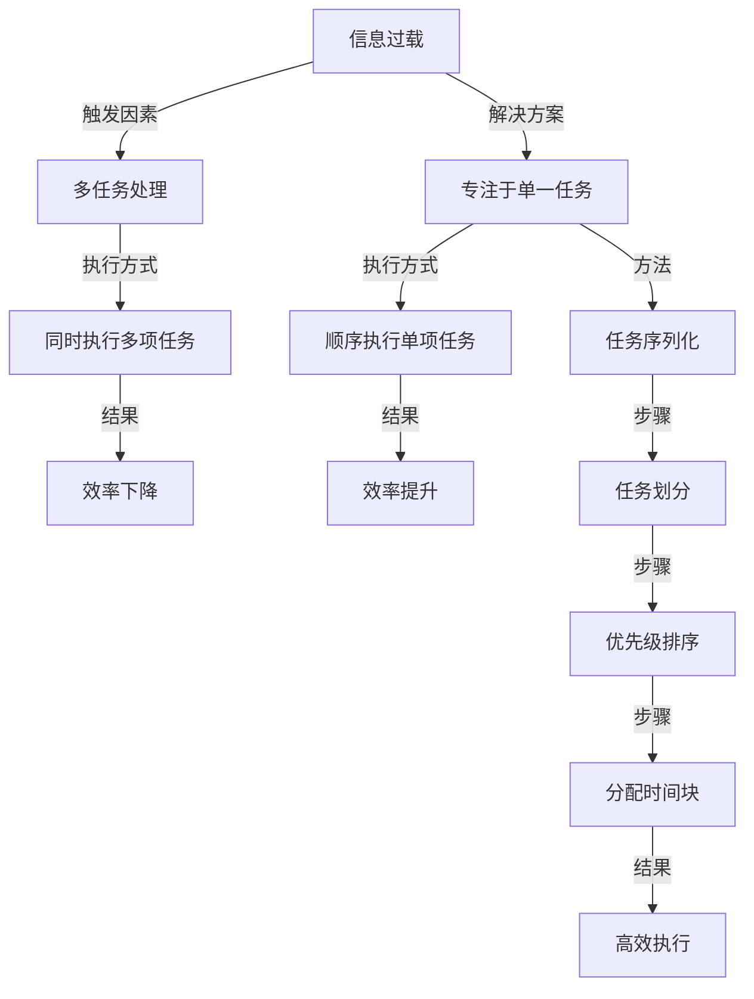

                 

# 信息过载与多任务处理的陷阱：专注于单一任务的力量

> 关键词：信息过载, 多任务处理, 专注于单一任务, 认知负荷, 任务切换, 单一任务优势

## 1. 背景介绍

在当今这个信息爆炸的时代，我们不断地被各种各样的信息和任务所包围。从社交媒体上的消息，到日常工作中的多项任务，都要求我们同时处理大量的信息。这种信息过载和任务切换（task-switching）的问题，已经成为了我们工作和学习效率的重大瓶颈。如何在信息过载的环境中保持高效的工作状态，如何在多任务处理中保持专注，成为了现代职业人必须面对的挑战。

在本文中，我们将深入探讨信息过载和多任务处理带来的陷阱，并重点讨论专注于单一任务的力量，以及如何在实践中有效应用这一原则来提升工作和学习效率。

## 2. 核心概念与联系

### 2.1 核心概念概述

- **信息过载（Information Overload）**：指的是在短时间内接收到的信息量超出个人或组织处理能力的状况。过多的信息源、消息、数据和决策点都可能导致决策困难和效率低下。
- **多任务处理（Multitasking）**：指在一段时间内同时执行多项任务的行为。尽管多任务处理似乎可以同时利用时间，但在实际工作中，任务切换成本和时间分散注意力，常常导致整体效率的下降。
- **专注于单一任务（Single-tasking）**：指在一段时间内只专注于一个任务，直到完成或达到预设目标。专注于单一任务可以避免多任务处理带来的认知负荷和注意力分散问题。
- **认知负荷（Cognitive Load）**：指人在进行认知任务时所承受的心理负担。过高的认知负荷会导致工作或学习效率下降。
- **任务切换（Task Switching）**：指从一个任务转移到另一个任务的过程。任务切换会消耗大量时间和精力，影响效率。

### 2.2 核心概念原理和架构的 Mermaid 流程图



## 3. 核心算法原理 & 具体操作步骤

### 3.1 算法原理概述

专注于单一任务的核心原理在于减少认知负荷，避免任务切换带来的效率损失。通过将工作或学习任务划分为一系列单项任务，并按照优先级顺序执行，可以有效降低任务处理的复杂性和认知负担，从而提高整体效率。

### 3.2 算法步骤详解

1. **任务划分**：将大任务分解为多个小任务，每个小任务可以独立完成。
2. **优先级排序**：根据任务的重要性和紧急程度对任务进行排序，优先处理高优先级任务。
3. **时间块分配**：为每个任务分配固定时间段，避免长时间任务切换带来的疲劳和效率损失。
4. **任务序列化**：按照优先级顺序执行任务，确保高效完成。

### 3.3 算法优缺点

**优点**：
- 减少认知负荷：专注于单一任务可以降低大脑处理信息时的负担。
- 提升效率：避免任务切换，减少时间浪费。
- 提高质量：单一任务执行可以减少错误和遗漏。

**缺点**：
- 短期效率下降：在任务转换阶段，效率可能会短暂下降。
- 任务优先级难以确定：根据实际情况灵活调整任务优先级需要较高的判断力。
- 需要严格自律：专注单一任务需要较高的自我管理和时间管理能力。

### 3.4 算法应用领域

专注于单一任务的方法适用于各种工作和学习场景，如软件开发、项目管理、学术研究、日常事务处理等。特别是在需要长时间集中注意力的复杂任务中，专注于单一任务更是提高效率的关键。

## 4. 数学模型和公式 & 详细讲解 & 举例说明

### 4.1 数学模型构建

假设我们有 $N$ 个任务，每个任务的处理时间为 $t_i$，处理难度为 $d_i$，优先级为 $p_i$（$1 \leq i \leq N$）。我们的目标是找到一个最优的任务执行顺序，使得整体处理时间最小。

### 4.2 公式推导过程

根据任务优先级，我们可以建立一个目标函数 $T$ 来衡量总处理时间：

$$
T = \sum_{i=1}^N p_i t_i
$$

其中 $p_i$ 是任务的优先级权重，$t_i$ 是任务的实际处理时间。为了求解最小化 $T$，我们使用贪心算法（Greedy Algorithm），每次选择当前优先级最高的任务进行执行。

### 4.3 案例分析与讲解

假设我们有三个任务 $A$、$B$、$C$，其处理时间分别为 $t_A = 3$ 小时、$t_B = 2$ 小时、$t_C = 4$ 小时，优先级分别为 $p_A = 0.7$、$p_B = 0.5$、$p_C = 0.3$。

按照优先级排序，我们首先执行任务 $A$，其次是任务 $B$，最后是任务 $C$。任务序列化执行的结果是：

- 第 $1$ 天：执行 $A$，耗时 $3$ 小时。
- 第 $2$ 天：执行 $B$，耗时 $2$ 小时。
- 第 $3$ 天：执行 $C$，耗时 $4$ 小时。

总处理时间为 $3 + 2 + 4 = 9$ 小时。如果我们采用多任务处理，例如同时执行 $A$ 和 $B$，虽然可以在一天内完成这两个任务，但由于任务切换带来的额外时间消耗，总处理时间可能会超过 $9$ 小时。

## 5. 项目实践：代码实例和详细解释说明

### 5.1 开发环境搭建

在开始具体项目实践前，我们需要准备以下开发环境：

1. **安装Python**：下载并安装Python 3.x，确保环境稳定。
2. **安装必要的库**：安装 NumPy、Pandas、Matplotlib 等库，用于数据分析和可视化。
3. **创建项目目录**：在本地创建项目文件夹，将代码和数据文件存储在内。

### 5.2 源代码详细实现

以下是一个简单的Python代码示例，用于任务划分、优先级排序和执行时间块分配：

```python
import numpy as np
from operator import itemgetter

# 定义任务和处理时间
tasks = [
    {'name': 'Task A', 'time': 3, 'priority': 0.7},
    {'name': 'Task B', 'time': 2, 'priority': 0.5},
    {'name': 'Task C', 'time': 4, 'priority': 0.3},
    # 新增任务
]

# 按照优先级排序
sorted_tasks = sorted(tasks, key=itemgetter('priority'), reverse=True)

# 分配时间块
day_time = 8  # 每天工作时间
daily_tasks = []
remaining_time = day_time

for task in sorted_tasks:
    if task['time'] > remaining_time:
        daily_tasks.append(task)
        remaining_time -= task['time']
    else:
        task['time'] -= remaining_time
        daily_tasks.append(task)
        remaining_time = 0
        break

# 执行任务
for task in daily_tasks:
    print(f"Day {day_time - remaining_time}, Task: {task['name']}, Time: {task['time']} hours")
```

### 5.3 代码解读与分析

在上述代码中，我们首先定义了任务及其处理时间，然后按照优先级进行排序，最后根据剩余时间来分配任务执行时间块。通过这种方式，我们实现了专注于单一任务的目标，避免了多任务处理带来的时间浪费和效率下降。

## 6. 实际应用场景

### 6.1 软件开发

在软件开发中，任务繁多且复杂，常见的项目包括需求分析、设计、编码、测试、部署等。通过专注于单一任务，可以减少任务切换带来的效率损失，提高整体开发质量。

**案例**：一个软件开发团队可以使用专注于单一任务的策略，每天专注于完成一个需求点或模块的开发，避免多任务处理带来的分心。

### 6.2 项目管理

项目管理中，任务常常需要跨部门协作，任务优先级和执行时间也需要精心规划。通过专注于单一任务，可以更有效地分配资源，确保项目的顺利进行。

**案例**：项目经理可以采用专注于单一任务的方法，每天早上分配优先级最高的任务，确保团队成员高效完成关键任务。

### 6.3 学术研究

学术研究中，文献阅读、实验设计、数据分析等任务需要大量的时间和精力。通过专注于单一任务，可以更深入地理解和应用研究方法。

**案例**：研究人员可以每天专注于阅读一篇高质量文献，或者完成一个小型实验，避免多任务处理带来的浅尝辄止。

### 6.4 未来应用展望

专注于单一任务的方法将在更多领域得到应用，为提高工作和学习效率提供新的思路。未来，随着技术的不断发展，专注于单一任务的实践将结合更多智能化工具，如任务管理系统、自动化工具等，进一步提升整体效率。

## 7. 工具和资源推荐

### 7.1 学习资源推荐

1. **《深度工作》（Deep Work）**：作者卡尔·纽波特（Cal Newport），深入探讨了如何在信息过载的时代保持高效工作状态。
2. **Coursera 课程《时间管理》**：涵盖时间管理和效率提升的多个方面，包括任务优先级、时间块分配等。
3. **TED Talks**：大量关于高效工作和学习的视频演讲，涵盖多种专注于单一任务的方法。

### 7.2 开发工具推荐

1. **Trello**：任务管理工具，支持任务划分、优先级排序和分配时间块。
2. **Pomodoro Technique**：时间管理工具，通过设定25分钟工作块和5分钟休息块，帮助保持专注。
3. **RescueTime**：时间跟踪工具，帮助了解和优化日常时间分配，减少不必要的任务切换。

### 7.3 相关论文推荐

1. **《高效能人士的七个习惯》（The 7 Habits of Highly Effective People）**：史蒂芬·柯维（Stephen Covey）的经典著作，提出了时间管理和任务执行的多个原则。
2. **《多任务处理对认知负荷的影响》（The Impact of Multitasking on Cognitive Load）**：探讨多任务处理对认知负荷的影响，提出了减少任务切换的策略。

## 8. 总结：未来发展趋势与挑战

### 8.1 研究成果总结

本文探讨了信息过载和多任务处理带来的陷阱，重点讨论了专注于单一任务的力量。通过划分任务、优先级排序和分配时间块，可以显著提高整体效率。

### 8.2 未来发展趋势

1. **智能化工具的普及**：未来专注于单一任务的实践将更多结合智能化工具，如自动化任务管理、智能调度等，进一步提升效率。
2. **跨领域应用**：专注于单一任务的方法将应用于更多领域，如教育、医疗、金融等，推动各行各业的智能化转型。
3. **个性化定制**：根据个人工作习惯和任务特点，提供个性化的任务管理方案，提升整体效率。

### 8.3 面临的挑战

1. **任务优先级确定**：灵活调整任务优先级需要较高的判断力，需要结合实际情况进行调整。
2. **自律和时间管理**：专注于单一任务需要较高的自我管理和时间管理能力，对部分人员可能具有挑战性。
3. **任务依赖**：部分任务之间存在依赖关系，需要合理规划时间块，避免顺序执行导致的效率损失。

### 8.4 研究展望

专注于单一任务的实践将在未来持续发展，结合更多智能化工具和方法，进一步提升整体效率。未来研究将关注如何更好地应对任务优先级不确定性和时间管理挑战，提升任务执行的灵活性和适应性。

## 9. 附录：常见问题与解答

### 常见问题 Q1：专注于单一任务真的有效吗？

**回答**：专注于单一任务已被大量研究表明可以显著提升整体效率和质量。尽管短期内可能会面临任务切换带来的效率下降，但从长期来看，减少任务切换和认知负荷可以带来更大的回报。

### 常见问题 Q2：如何在工作中保持专注？

**回答**：保持专注需要自律和时间管理能力。可以尝试使用时间管理工具、设定固定时间块、避免干扰等方式来提升专注度。此外，保持良好的工作习惯和心理状态也是保持专注的关键。

### 常见问题 Q3：多任务处理是否真的比专注于单一任务更高效？

**回答**：多任务处理在一些特定情境下可能有效，但长期来看，专注于单一任务可以更好地利用时间和精力，提升整体效率和质量。在信息过载的环境中，专注于单一任务更具优势。

### 常见问题 Q4：专注于单一任务是否适用于所有职业？

**回答**：专注于单一任务的方法适用于大部分职业和任务，特别是需要长时间集中注意力的复杂任务。但在某些需要快速反应和即时决策的情境中，多任务处理可能有其优势。

作者：禅与计算机程序设计艺术 / Zen and the Art of Computer Programming

