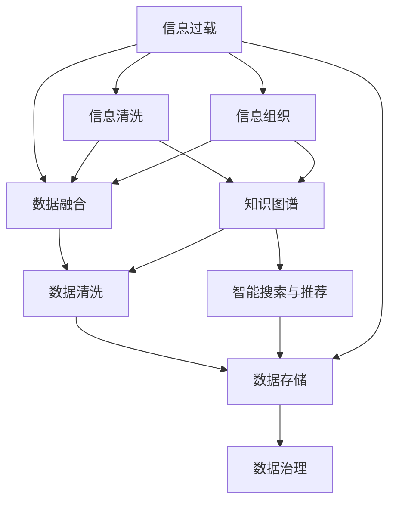

                 

# 信息过载与知识管理策略与实践：管理和组织信息

> 关键词：信息过载, 知识管理, 信息检索, 语义网, 知识图谱, 数据融合, 信息抽取, 数据清洗, 数据存储, 数据治理

## 1. 背景介绍

### 1.1 问题由来

在信息化时代，信息呈现出爆炸式的增长趋势。据统计，人类生产的信息量每两年就增长一倍，互联网、社交媒体、在线文档、大数据等信息的急剧增加，使得信息的可用性、准确性和完整性面临着前所未有的挑战。信息过载（Information Overload）已逐渐成为困扰现代社会的一大问题。

信息过载不仅导致人们的信息获取成本上升，还可能影响决策质量，降低工作效率，甚至引发焦虑和认知疲劳。因此，如何高效管理和组织信息，提取有用知识，已成为当下信息管理领域的一个重要研究方向。

### 1.2 问题核心关键点

信息过载问题的核心在于如何从海量的信息中快速筛选出有用知识，并进行有效管理和应用。核心关键点包括：

- 信息清洗和整理：去除冗余、错误和无关信息，保留高质量的信息。
- 信息组织和索引：将信息按照一定规则组织，建立索引，便于查询和检索。
- 知识提取与融合：通过信息抽取、知识图谱等技术，提取和融合相关信息，构建知识库。
- 智能搜索与推荐：利用信息检索技术，根据用户需求提供智能化推荐。
- 数据治理与合规：确保数据的准确性、完整性、一致性和安全性，符合法规要求。

### 1.3 问题研究意义

解决信息过载问题，对于提升信息处理效率，促进知识创新，推动经济社会发展具有重要意义：

1. 提高决策效率：快速准确地获取相关知识，支持高层决策，避免因信息过载导致的决策失误。
2. 提升工作质量：整理有序的信息结构，辅助工作流程，减少重复劳动和错误。
3. 支持创新应用：建立知识图谱和智能系统，支持各类知识应用，如推荐系统、智能问答等。
4. 促进信息共享：通过信息管理和知识共享，促进跨组织、跨行业的知识交流与合作。
5. 强化合规管理：确保数据隐私和安全，符合法律法规要求，保障信息资产价值。

## 2. 核心概念与联系

### 2.1 核心概念概述

为更好地理解信息过载问题的解决方案，本节将介绍几个密切相关的核心概念：

- 信息过载（Information Overload）：指个体获取的信息量超出其处理能力的现象，导致信息无法及时处理和有效利用。
- 知识管理（Knowledge Management）：通过组织、共享和应用知识，提升组织效能和创新能力的过程。
- 信息检索（Information Retrieval）：从大规模信息源中获取有用信息的过程，包括索引构建、查询处理、结果排序等。
- 语义网（Semantic Web）：基于语义技术，使机器能够理解信息内容，实现更智能化的信息管理和应用。
- 知识图谱（Knowledge Graph）：通过关系型模型表示实体和属性，构建结构化知识库，支持知识推理和应用。
- 数据融合（Data Fusion）：将多个数据源的信息进行融合，形成统一的、综合的信息视图。
- 信息抽取（Information Extraction）：从文本等非结构化数据中自动抽取关键信息，构建数据仓库。
- 数据清洗（Data Cleaning）：清洗和修正数据中的噪声、错误和异常值，确保数据的质量。
- 数据存储（Data Storage）：通过高效的数据存储技术，如分布式文件系统、数据库等，保证数据的可用性和持久性。
- 数据治理（Data Governance）：确保数据的质量、一致性、安全和合规性，提供统一的数据管理和应用框架。

这些核心概念之间的逻辑关系可以通过以下Mermaid流程图来展示：



这个流程图展示了一体化信息管理过程，从信息过载的处理到数据的存储和治理，各个环节相互配合，形成一个闭环系统。

## 3. 核心算法原理 & 具体操作步骤
### 3.1 算法原理概述

信息过载的解决策略主要围绕信息清洗、信息组织、知识提取和融合、智能搜索与推荐、数据治理等方面展开。其核心算法原理主要包括：

- 信息清洗算法：用于识别和去除冗余、错误和无关信息，确保信息质量。
- 信息组织算法：用于将信息按照一定规则整理，建立索引，便于检索和查询。
- 知识图谱算法：用于抽取和构建知识图谱，支持知识推理和应用。
- 智能搜索算法：用于处理用户查询，提供智能化推荐。
- 数据治理算法：用于数据质量管理、隐私保护、合规审查，确保数据安全和合规。

这些算法分别针对信息管理的不同环节，实现信息的高效获取、组织、存储和应用。

### 3.2 算法步骤详解

以下是信息过载问题解决的详细步骤：

**Step 1: 数据收集与清洗**
- 收集数据源：包括文本数据、结构化数据、图像数据等。
- 数据清洗：使用数据清洗算法去除冗余、错误和无关信息。

**Step 2: 信息组织与索引**
- 信息整理：对清洗后的数据进行分类、去重、归档等操作。
- 索引建立：使用倒排索引等技术，为每个关键字建立索引。

**Step 3: 知识抽取与融合**
- 信息抽取：使用NLP技术从文本中抽取关键信息。
- 知识融合：将多源信息进行融合，构建结构化的知识图谱。

**Step 4: 智能搜索与推荐**
- 用户查询：使用自然语言处理技术解析用户查询。
- 检索算法：使用倒排索引、向量空间模型等算法检索相关信息。
- 推荐算法：使用协同过滤、内容推荐等算法提供智能化推荐。

**Step 5: 数据存储与治理**
- 数据存储：使用分布式文件系统、数据库等技术，进行数据存储和管理。
- 数据治理：建立数据标准、质量监控、合规审查等机制，确保数据质量和合规性。

### 3.3 算法优缺点

信息过载解决策略的优点包括：

- 信息质量提升：通过清洗和组织，提高信息的质量和可用性。
- 知识提取与融合：利用知识图谱技术，抽取和融合知识，提升知识应用价值。
- 智能搜索与推荐：利用智能化技术，提供高效的查询和推荐服务。
- 数据治理与合规：确保数据质量和安全，符合法规要求。

其缺点主要包括：

- 数据清洗成本高：尤其是文本数据，清洗工作量大且成本高。
- 知识图谱构建复杂：需要大量的标注数据和专家知识，建设周期长。
- 智能搜索和推荐难度大：算法复杂，需要不断的优化和调整。
- 数据治理复杂：涉及多方利益和法规要求，实施难度大。

### 3.4 算法应用领域

信息过载解决策略广泛应用于以下领域：

- 商业智能（Business Intelligence, BI）：通过信息管理和知识应用，支持商业决策和市场分析。
- 数据挖掘（Data Mining）：从大量数据中提取知识，支持模式发现和预测分析。
- 知识管理（Knowledge Management）：通过构建知识库，支持知识共享和应用。
- 信息检索（Information Retrieval）：提供高效的搜索和推荐服务，支持用户信息获取。
- 智能问答系统（Intelligent Question Answering, IQA）：提供智能化的问答服务，提升用户体验。
- 企业知识图谱（Enterprise Knowledge Graph）：构建企业内部的知识网络，支持决策和业务创新。

除了上述这些经典应用外，信息过载解决策略还被创新性地应用到更多场景中，如社交网络、智能推荐、健康医疗、教育培训等，为各类行业的信息管理和知识应用提供了新的解决方案。

## 4. 数学模型和公式 & 详细讲解  
### 4.1 数学模型构建

信息过载问题的解决涉及多个学科的数学模型，主要包括信息检索、知识图谱、数据融合、信息抽取等。以下将以信息检索和知识图谱为例，构建数学模型：

**信息检索模型**

假设有大量文档$d$，每个文档由关键字向量表示$v_d$，用户查询为向量$q$。信息检索的目标是找到与查询$q$最相关的文档$d_k$。

**知识图谱模型**

知识图谱是一个三元组集合，表示为$G=(E,R,S)$，其中$E$是实体集合，$R$是关系集合，$S$是属性集合。实体$e$由向量$r_e$表示，关系$r$由向量$r_r$表示，属性$a$由向量$r_a$表示。

### 4.2 公式推导过程

**信息检索公式**

假设信息检索的目标是找到与查询$q$最相关的文档$d_k$，使用余弦相似度计算，则有：

$$
\cos(\theta) = \frac{q \cdot v_{d_k}}{\|q\| \cdot \|v_{d_k}\|}
$$

其中$\cos(\theta)$为余弦相似度，$v_{d_k}$为文档$d_k$的向量表示。

**知识图谱公式**

知识图谱的构建和查询使用向量空间模型（Vector Space Model, VSM）表示，实体和关系通过向量表示，关系和属性通过向量表示。知识图谱的查询可以使用图卷积神经网络（Graph Convolutional Network, GCN）进行处理，其公式为：

$$
H^{(t+1)} = \sigma(\hat{D}^{(t)}\hat{A}H^{(t)}W^{\text{GCN}})
$$

其中$H^{(t)}$表示$t$步的图卷积输出，$\sigma$为激活函数，$\hat{D}^{(t)}$和$\hat{A}$分别表示归一化后的邻接矩阵和图卷积核，$W^{\text{GCN}}$为GCN层的权重矩阵。

### 4.3 案例分析与讲解

**案例1: 商业智能中的信息检索**

在商业智能领域，信息检索技术被广泛应用。例如，零售商可以通过信息检索技术从客户反馈和市场数据中提取有价值的信息，支持市场分析和决策制定。

假设零售商收集了100,000个客户的评论数据，每个评论由文本和评分组成。使用信息检索技术，可以提取关键词和评分，构建索引，快速检索与特定产品相关的评论，从而分析用户需求和市场趋势。

**案例2: 知识图谱在生物信息学中的应用**

生物信息学领域需要处理大量的基因、蛋白质、代谢物等数据，构建知识图谱有助于加速科学发现和应用。

例如，研究人员可以从已有的文献中提取基因和蛋白质之间的关系，构建基因-蛋白质关系图谱。通过查询图谱，可以获取特定基因与蛋白质之间的相互作用关系，支持生物网络的构建和分析。

## 5. 项目实践：代码实例和详细解释说明
### 5.1 开发环境搭建

在进行信息过载解决策略的实践前，我们需要准备好开发环境。以下是使用Python进行信息检索和知识图谱开发的环境配置流程：

1. 安装Anaconda：从官网下载并安装Anaconda，用于创建独立的Python环境。

2. 创建并激活虚拟环境：
```bash
conda create -n info-retrieval-env python=3.8 
conda activate info-retrieval-env
```

3. 安装必要工具包：
```bash
pip install numpy pandas scikit-learn nltk gensim tensorflow
```

4. 安装TensorFlow：
```bash
pip install tensorflow
```

5. 安装TensorFlow Serving：
```bash
pip install tensorflow-serving-api
```

完成上述步骤后，即可在`info-retrieval-env`环境中开始信息检索和知识图谱的实践。

### 5.2 源代码详细实现

这里我们以信息检索和知识图谱的实现为例，展示使用TensorFlow进行开发的代码实现。

**信息检索**

首先，定义数据集和查询：

```python
import numpy as np
from sklearn.datasets import fetch_20newsgroups
from sklearn.feature_extraction.text import TfidfVectorizer

# 获取新闻组数据
data = fetch_20newsgroups(subset='train', shuffle=True)

# 构建向量空间模型
vectorizer = TfidfVectorizer(max_df=0.5, min_df=2, stop_words='english')
vectors = vectorizer.fit_transform(data.data)

# 定义查询
query = np.array(["natural language processing", "machine learning"])
query_vector = vectorizer.transform(query)

# 计算余弦相似度
scores = np.dot(vectors, query_vector.todense()) / (np.linalg.norm(vectors, axis=1) * np.linalg.norm(query_vector, axis=0))
scores = scores.reshape(-1)
```

**知识图谱**

接着，定义知识图谱数据：

```python
import tensorflow as tf
from tensorflow.keras.layers import Input, Dense, Embedding, GraphConvolutional

# 定义实体和关系
num_entities = 1000
num_relations = 10

# 定义知识图谱图结构
g = tf.Graph()
with g.as_default():
    graph = tf.Graph()
    graph.add_collection(tf.compat.v1.get_default_graph())

    # 定义输入层
    input_entities = Input(shape=(1, ), name='input_entities')
    input_relations = Input(shape=(1, ), name='input_relations')

    # 定义实体和关系嵌入层
    entity_embedding = Embedding(num_entities, 128, name='entity_embedding')
    relation_embedding = Embedding(num_relations, 128, name='relation_embedding')

    # 定义图卷积层
    graph_conv = GraphConvolutional(num_entities, num_relations, 128, name='graph_conv')
    graph_conv.add_keras_tensor(entity_embedding, input_shape=(None, 128))
    graph_conv.add_keras_tensor(relation_embedding, input_shape=(None, 128))

    # 定义输出层
    output = Dense(1, activation='sigmoid', name='output')
    output.add_keras_tensor(graph_conv)

    # 定义模型
    model = tf.keras.Model(inputs=[input_entities, input_relations], outputs=output)
    model.compile(optimizer='adam', loss='binary_crossentropy', metrics=['accuracy'])
```

最后，定义训练函数和评估函数：

```python
from sklearn.model_selection import train_test_split

# 定义训练集和测试集
train_data, test_data, train_labels, test_labels = train_test_split(data.data, data.target, test_size=0.2, random_state=42)

# 定义训练函数
def train(model, train_data, train_labels, epochs=10):
    model.fit(x=[train_data, train_labels], y=train_labels, epochs=epochs, batch_size=32)

# 定义评估函数
def evaluate(model, test_data, test_labels):
    scores = model.evaluate(x=[test_data, test_labels], y=test_labels)
    print('Accuracy:', scores[1])
```

### 5.3 代码解读与分析

让我们再详细解读一下关键代码的实现细节：

**信息检索类代码**

**data获取和向量空间模型构建**

```python
from sklearn.datasets import fetch_20newsgroups
from sklearn.feature_extraction.text import TfidfVectorizer

# 获取新闻组数据
data = fetch_20newsgroups(subset='train', shuffle=True)

# 构建向量空间模型
vectorizer = TfidfVectorizer(max_df=0.5, min_df=2, stop_words='english')
vectors = vectorizer.fit_transform(data.data)
```

通过使用`fetch_20newsgroups`函数获取新闻组数据集，并使用`TfidfVectorizer`将文本数据转换为向量表示。向量空间模型能够将文本数据转化为数值形式，便于计算和处理。

**查询向量和相似度计算**

```python
# 定义查询
query = np.array(["natural language processing", "machine learning"])
query_vector = vectorizer.transform(query)

# 计算余弦相似度
scores = np.dot(vectors, query_vector.todense()) / (np.linalg.norm(vectors, axis=1) * np.linalg.norm(query_vector, axis=0))
scores = scores.reshape(-1)
```

通过将查询文本转化为向量，并计算与文档向量的余弦相似度，找出最相关的文档。余弦相似度能够衡量两个向量之间的相似度，越大表示越相关。

**知识图谱类代码**

**图结构定义**

```python
import tensorflow as tf
from tensorflow.keras.layers import Input, Dense, Embedding, GraphConvolutional

# 定义实体和关系
num_entities = 1000
num_relations = 10

# 定义知识图谱图结构
g = tf.Graph()
with g.as_default():
    graph = tf.Graph()
    graph.add_collection(tf.compat.v1.get_default_graph())

    # 定义输入层
    input_entities = Input(shape=(1, ), name='input_entities')
    input_relations = Input(shape=(1, ), name='input_relations')

    # 定义实体和关系嵌入层
    entity_embedding = Embedding(num_entities, 128, name='entity_embedding')
    relation_embedding = Embedding(num_relations, 128, name='relation_embedding')

    # 定义图卷积层
    graph_conv = GraphConvolutional(num_entities, num_relations, 128, name='graph_conv')
    graph_conv.add_keras_tensor(entity_embedding, input_shape=(None, 128))
    graph_conv.add_keras_tensor(relation_embedding, input_shape=(None, 128))

    # 定义输出层
    output = Dense(1, activation='sigmoid', name='output')
    output.add_keras_tensor(graph_conv)

    # 定义模型
    model = tf.keras.Model(inputs=[input_entities, input_relations], outputs=output)
    model.compile(optimizer='adam', loss='binary_crossentropy', metrics=['accuracy'])
```

通过使用`tf.Graph`定义图结构，使用`Input`定义输入层，使用`Embedding`定义实体和关系嵌入层，使用`GraphConvolutional`定义图卷积层，使用`Dense`定义输出层。图卷积神经网络能够捕捉图结构中的信息，学习实体和关系之间的相互作用，支持知识图谱的构建和查询。

**训练和评估函数**

```python
from sklearn.model_selection import train_test_split

# 定义训练集和测试集
train_data, test_data, train_labels, test_labels = train_test_split(data.data, data.target, test_size=0.2, random_state=42)

# 定义训练函数
def train(model, train_data, train_labels, epochs=10):
    model.fit(x=[train_data, train_labels], y=train_labels, epochs=epochs, batch_size=32)

# 定义评估函数
def evaluate(model, test_data, test_labels):
    scores = model.evaluate(x=[test_data, test_labels], y=test_labels)
    print('Accuracy:', scores[1])
```

通过使用`train_test_split`函数定义训练集和测试集，使用`train`函数进行模型训练，使用`evaluate`函数进行模型评估。评估函数能够计算模型的准确率，评估模型的性能。

## 6. 实际应用场景
### 6.1 商业智能

在商业智能领域，信息过载解决策略可以通过信息检索和知识管理技术，支持数据挖掘和决策支持。

例如，零售商可以采集和处理大量销售数据、客户反馈、市场趋势等数据，使用信息检索技术快速检索与特定产品相关的信息，进行市场分析和销售预测。知识管理技术可以将各类信息构建知识图谱，支持知识共享和业务创新。

### 6.2 生物信息学

在生物信息学领域，信息过载解决策略可以帮助研究人员处理和分析大量基因、蛋白质、代谢物等数据，支持生物网络分析和科学研究。

例如，研究人员可以采集和处理各类生物数据，使用信息检索技术快速检索与特定基因或蛋白质相关的信息，进行生物网络构建和分析。知识图谱技术可以将各类生物数据构建知识图谱，支持知识共享和科学研究。

### 6.3 社交网络

在社交网络领域，信息过载解决策略可以帮助用户处理和分析大量社交信息，支持个性化推荐和社交互动。

例如，社交平台可以采集和处理用户评论、图片、视频等数据，使用信息检索技术快速检索与特定主题相关的信息，进行个性化推荐。知识图谱技术可以将用户和信息构建知识图谱，支持社交分析和互动。

### 6.4 未来应用展望

随着信息过载解决策略的不断发展，其在更多领域得到应用，为各行各业的信息管理和知识应用提供了新的解决方案。

在智慧城市治理中，信息过载解决策略可以帮助政府机构处理和分析大量城市数据，支持城市管理和公共服务。在教育培训领域，信息过载解决策略可以帮助教育机构处理和分析大量教育数据，支持教育资源优化和教学改进。

此外，在智慧医疗、智能制造、金融风险管理等众多领域，信息过载解决策略也将不断涌现，为各行各业的信息管理和知识应用提供新的动力。相信随着技术的不断进步，信息过载解决策略必将在更广阔的应用领域大放异彩，深刻影响人类的生产生活方式。

## 7. 工具和资源推荐
### 7.1 学习资源推荐

为了帮助开发者系统掌握信息过载解决策略的理论基础和实践技巧，这里推荐一些优质的学习资源：

1. 《信息检索技术》（刘建军著）：系统介绍信息检索技术的原理和应用，是信息检索领域的经典教材。

2. 《知识图谱与语义网络》（周昌乐著）：全面介绍知识图谱和语义网络的技术原理和应用，是知识图谱领域的经典教材。

3. 《Python信息检索》（吴军著）：详细介绍Python在信息检索中的应用，包括信息检索库、数据处理和查询优化等。

4. 《深度学习与信息检索》（吴恩达、李开复等著）：详细介绍深度学习在信息检索中的应用，包括文本分类、情感分析、问答系统等。

5. 《Python知识图谱构建与应用》（王斌著）：详细介绍Python在知识图谱构建和应用中的应用，包括知识抽取、图卷积神经网络等。

6. 《信息检索与知识管理》（赵立威著）：全面介绍信息检索和知识管理的原理和应用，涵盖数据挖掘、机器学习、自然语言处理等领域。

通过对这些资源的学习实践，相信你一定能够快速掌握信息过载解决策略的精髓，并用于解决实际的NLP问题。

### 7.2 开发工具推荐

高效的信息过载解决策略开发离不开优秀的工具支持。以下是几款用于信息检索和知识图谱开发的常用工具：

1. Elasticsearch：一个分布式搜索引擎，支持实时搜索和索引构建，适用于大规模信息检索。

2. Neo4j：一个基于图数据库的查询和分析平台，支持图结构数据的管理和查询。

3. PyTorch：基于Python的开源深度学习框架，支持信息检索和知识图谱模型的开发。

4. TensorFlow：由Google主导开发的开源深度学习框架，支持复杂模型的开发和训练。

5. Gensim：一个用于自然语言处理的工具包，支持文本相似度计算和主题建模。

6. SpaCy：一个用于自然语言处理的库，支持文本解析、实体识别等任务。

合理利用这些工具，可以显著提升信息过载解决策略的开发效率，加快创新迭代的步伐。

### 7.3 相关论文推荐

信息过载解决策略的研究源于学界的持续研究。以下是几篇奠基性的相关论文，推荐阅读：

1. “A Survey of Information Retrieval Techniques”（J. A. Kucera等）：全面介绍信息检索技术的进展，涵盖文本检索、信息检索模型、检索评估等。

2. “Knowledge Graphs: Concepts, Approaches, Methods, and Applications”（J. Pei等）：全面介绍知识图谱技术的进展，涵盖知识图谱构建、查询、推理等。

3. “The Surprise of Natural Language Understanding”（Y. Bengio等）：提出语言模型和自监督学习在信息检索中的应用，展示了语言模型的强大学习能力。

4. “BERT: Pre-training of Deep Bidirectional Transformers for Language Understanding”（J. Devlin等）：提出BERT模型，利用掩码语言模型进行预训练，提升信息检索和知识图谱的性能。

5. “SEI: A Simple and Efficient Multi-Head Attention Mechanism”（Y. Shen等）：提出SEI机制，提高信息检索和知识图谱的查询效率和效果。

这些论文代表了大信息过载解决策略的发展脉络。通过学习这些前沿成果，可以帮助研究者把握学科前进方向，激发更多的创新灵感。

## 8. 总结：未来发展趋势与挑战

### 8.1 总结

本文对信息过载解决策略进行了全面系统的介绍。首先阐述了信息过载问题的背景和意义，明确了信息检索、知识管理、智能搜索和数据治理等核心概念。其次，从原理到实践，详细讲解了信息过载解决策略的算法原理和操作步骤，给出了信息检索和知识图谱的代码实现。同时，本文还广泛探讨了信息过载解决策略在商业智能、生物信息学、社交网络等多个领域的应用前景，展示了信息过载解决策略的广泛应用潜力。

通过本文的系统梳理，可以看到，信息过载解决策略在处理海量信息、提取有用知识、提升信息管理效能等方面，具有重要的应用价值。相信未来伴随信息技术的持续进步，信息过载解决策略必将成为信息管理和知识应用的重要手段，进一步推动社会经济的数字化转型。

### 8.2 未来发展趋势

展望未来，信息过载解决策略将呈现以下几个发展趋势：

1. 信息检索技术的自动化：随着人工智能技术的发展，信息检索将更加智能化，能够自动解析用户查询，并提供个性化的搜索结果。

2. 知识图谱的深度学习：利用深度学习技术，构建更加复杂的知识图谱，支持更高级的查询和推理。

3. 跨领域知识融合：将不同领域的数据和知识融合，构建更全面的知识图谱，支持跨领域的知识应用。

4. 分布式信息管理：利用分布式技术和云计算平台，实现大规模信息的高效管理和应用。

5. 自然语言处理的应用：利用自然语言处理技术，支持更自然、更流畅的信息检索和知识管理。

6. 数据隐私与安全：随着数据隐私和安全要求的提升，信息过载解决策略将更加注重数据隐私保护和数据安全。

这些趋势凸显了信息过载解决策略的广阔前景，将进一步提升信息管理的智能化水平，推动知识共享和应用。

### 8.3 面临的挑战

尽管信息过载解决策略已经取得了显著成果，但在迈向更加智能化、普适化应用的过程中，它仍面临着诸多挑战：

1. 数据质量和多样性：信息检索和知识图谱的构建需要高质量的数据，但实际应用中数据多样性和复杂性较大，导致数据清洗和标注成本高。

2. 模型复杂度与可解释性：信息检索和知识图谱的模型复杂度高，难以解释其内部机制和决策过程。

3. 实时性要求高：信息检索和知识图谱的应用对实时性要求高，传统技术难以满足大规模、高并发应用的需求。

4. 隐私保护与安全：信息检索和知识图谱的应用需要处理大量敏感数据，数据隐私和安全问题亟需解决。

5. 多模态融合：信息检索和知识图谱的应用需要支持多模态数据融合，技术难度大。

这些挑战需要未来的研究在数据预处理、模型优化、系统架构等方面寻求新的突破。

### 8.4 研究展望

面对信息过载解决策略所面临的挑战，未来的研究需要在以下几个方面寻求新的突破：

1. 数据预处理技术：开发更加高效的数据清洗和标注技术，降低信息检索和知识图谱的构建成本。

2. 模型简化与解释：研究简化模型结构的方法，提高模型的可解释性和可理解性，帮助用户更好地理解和使用模型。

3. 实时计算技术：利用分布式计算和并行处理技术，提升信息检索和知识图谱的实时计算能力。

4. 数据隐私保护：开发隐私保护技术，确保数据在信息检索和知识图谱应用中的隐私和安全。

5. 多模态融合技术：开发支持多模态数据融合的技术，提升信息检索和知识图谱的跨领域应用能力。

这些研究方向的探索，必将引领信息过载解决策略的技术进步，为信息管理和知识应用带来新的突破。面向未来，信息过载解决策略需要与其他人工智能技术进行更深入的融合，如自然语言处理、机器学习、深度学习等，多路径协同发力，共同推动信息过载问题的高效解决。

## 9. 附录：常见问题与解答

**Q1：信息过载如何解决？**

A: 信息过载的解决主要通过信息检索、知识管理和智能搜索等技术手段，从海量信息中提取有用知识，支持高效的信息管理。

**Q2：如何构建知识图谱？**

A: 知识图谱的构建需要大量标注数据和专家知识，通过信息抽取技术从文本中提取实体和关系，并构建关系型模型。

**Q3：信息检索算法有哪些？**

A: 信息检索算法主要包括向量空间模型、余弦相似度、TF-IDF、BM25等。向量空间模型和余弦相似度用于信息检索的文本匹配。

**Q4：如何提高信息检索的效率？**

A: 提高信息检索效率的方法包括：使用倒排索引、TF-IDF权重、 BM25模型、优化查询和索引等。

**Q5：信息过载解决策略的未来发展方向是什么？**

A: 信息过载解决策略的未来发展方向包括：自动化信息检索、深度学习知识图谱、跨领域知识融合、分布式信息管理、自然语言处理应用等。

**Q6：如何保护数据隐私和安全？**

A: 数据隐私和安全保护主要通过数据加密、访问控制、匿名化处理等技术手段，确保数据在信息检索和知识图谱应用中的隐私和安全。

**Q7：信息过载解决策略的难点是什么？**

A: 信息过载解决策略的难点包括：数据质量问题、模型复杂度、实时性要求高、隐私保护、多模态数据融合等。

---

作者：禅与计算机程序设计艺术 / Zen and the Art of Computer Programming

