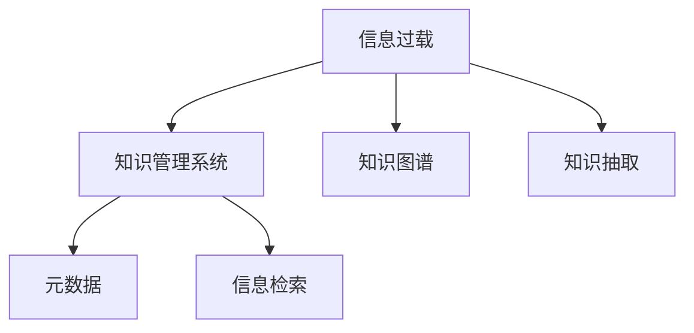

                 

# 信息过载与知识管理系统：管理和组织信息以提高生产力

> 关键词：信息过载,知识管理,组织架构,生产力,大数据,人工智能

## 1. 背景介绍

### 1.1 问题由来
在信息时代，信息数量呈指数级增长，用户每天需要处理的信息量激增。从海量文本到多媒体文件，信息的多样性和复杂性给人们的日常工作和学习带来了巨大的压力。企业、组织和个人面临着如何高效管理和利用这些信息以提升生产力的挑战。

### 1.2 问题核心关键点
信息过载的核心问题在于：

- **数据量巨大**：海量的文本、图片、视频等数据充斥着日常工作和学习环境，很难在有限的时间内全面处理。
- **信息质量参差不齐**：大量低质量的信息和噪声数据降低了信息检索和利用的效率。
- **信息分散**：不同来源的信息分散在不同平台和格式下，整合难度大。
- **知识隐性化**：知识往往隐性化存在于个人或组织的头脑中，不易提取和共享。

为了解决上述问题，知识和信息管理系统的建设显得尤为重要。这些系统通过组织、检索、利用信息，提高生产力和决策质量。本文将深入探讨这些系统的原理与实践，为读者提供全面的知识管理解决方案。

### 1.3 问题研究意义
信息过载与知识管理系统研究的深入，有助于：

1. **提升组织效率**：通过科学的信息组织和管理，使信息流转更加高效，减少决策过程中的信息流失和扭曲。
2. **增强决策质量**：精准的信息检索和知识管理能够辅助决策者全面考量各种因素，避免因信息过载导致误判。
3. **促进创新**：知识共享和再利用，有助于创新思想的碰撞和整合，提升组织的创新能力。
4. **优化流程**：通过信息管理系统自动化处理日常任务，减少重复劳动，提高工作效率。

## 2. 核心概念与联系

### 2.1 核心概念概述

为了更好地理解知识管理系统的构建，本节将介绍几个关键概念：

- **信息过载(Information Overload)**：指信息量超出个人或组织处理能力的状态，导致决策困难、效率降低。
- **知识管理系统(Knowledge Management System, KMS)**：旨在通过技术手段，收集、存储、管理和利用知识，提升组织和个人的决策与工作效率。
- **知识图谱(Knowledge Graph)**：利用图结构表示实体和关系，用于知识检索和推理。
- **知识抽取(Knowledge Extraction)**：从海量数据中提取有用知识，并将其组织存储。
- **元数据(Metadata)**：描述数据的基本信息，如创建时间、来源等，有助于数据管理和检索。
- **信息检索**：从大量数据中快速找到相关知识。

这些核心概念之间的联系可以用以下Mermaid流程图来表示：



此图展示了信息过载如何通过知识管理系统，利用知识图谱和知识抽取技术，对元数据进行处理，从而实现高效的信息检索。

## 3. 核心算法原理 & 具体操作步骤
### 3.1 算法原理概述

知识管理系统通过对信息的组织、检索、利用，帮助用户或组织高效利用信息。其核心算法原理主要包括：

- **数据收集与清洗**：从不同来源收集信息，并对数据进行清洗和去噪，保证数据质量。
- **元数据管理**：定义和维护数据的元数据，支持数据的组织和检索。
- **知识抽取与存储**：从数据中抽取有用的知识，并存储到知识图谱或知识库中。
- **信息检索与推荐**：根据用户查询和兴趣，从知识库中检索相关知识，并推荐有用信息。

### 3.2 算法步骤详解

知识管理系统的工作流程可以大致分为以下几步：

1. **数据采集与预处理**
    - 定义数据采集源，如网站、数据库、文件等。
    - 使用爬虫或API获取数据。
    - 对数据进行清洗和去噪，如去除重复、无效数据。

2. **元数据管理**
    - 定义元数据结构，如时间戳、来源、标签等。
    - 对每个数据项添加和维护元数据。
    - 使用元数据进行数据分类和索引。

3. **知识抽取**
    - 使用自然语言处理(NLP)技术，从文本中抽取实体、关系、属性等知识。
    - 存储抽取的知识到知识图谱或知识库中。

4. **信息检索**
    - 根据用户查询，匹配知识库中的相关知识。
    - 使用搜索引擎技术，如倒排索引，提升检索效率。

5. **知识推荐**
    - 根据用户行为和兴趣，推荐相关知识。
    - 使用协同过滤、内容推荐等算法，提高推荐准确性。

### 3.3 算法优缺点

知识管理系统的优点在于：

- **提升效率**：通过自动化处理和智能推荐，大大提升信息处理效率。
- **降低成本**：减少对人力和时间资源的依赖，降低信息管理的成本。
- **提高决策质量**：提供精准的信息检索和知识推荐，辅助决策。

同时，系统也存在以下缺点：

- **初始建设成本高**：需要大量的技术资源和资金投入。
- **技术复杂度大**：涉及多学科知识，实施难度大。
- **数据隐私风险**：处理和存储敏感数据，存在隐私泄露的风险。

### 3.4 算法应用领域

知识管理系统在多个领域得到广泛应用，包括但不限于：

- **企业决策支持**：帮助企业快速获取相关市场信息，辅助决策。
- **科研机构知识共享**：促进科研数据的开放和共享，提升科研效率。
- **教育资源管理**：收集和管理教学资源，提升教学质量。
- **医疗知识管理**：存储和管理医疗知识，辅助临床决策。

## 4. 数学模型和公式 & 详细讲解 & 举例说明

### 4.1 数学模型构建

知识管理系统的工作流程可以用数学模型来表示。以下是一个简化版的数学模型，用于说明知识管理系统的工作原理。

假设有一个知识库 $K$，包含实体集合 $E$ 和关系集合 $R$。用户通过查询 $Q$ 获取相关知识。知识管理系统的目标是最小化查询与知识库之间的差距 $Loss(Q, K)$，即：

$$
Loss(Q, K) = \sum_{i=1}^n |Q_i - K_i|
$$

其中 $Q_i$ 为用户查询，$K_i$ 为知识库中的相关信息。

### 4.2 公式推导过程

对于知识抽取部分，假设从文本中抽取了实体 $E$ 和关系 $R$，使用布尔逻辑推理规则，可以构建以下知识抽取模型：

$$
K_i = \bigwedge_{r \in R} (E_r \rightarrow R_r)
$$

其中 $E_r$ 为实体 $r$ 的出现情况，$R_r$ 为关系 $r$ 的存在情况。

对于信息检索部分，假设使用倒排索引进行文本检索，检索公式为：

$$
Retrieval(Q, K) = \sum_{i=1}^n |Q_i \cap K_i|
$$

其中 $Q_i$ 为查询，$K_i$ 为知识库中相关的文档集合。

### 4.3 案例分析与讲解

假设企业需要快速了解市场竞争对手的情况，可以使用知识管理系统进行搜索。系统从内部和外部数据源收集相关资料，使用自然语言处理技术抽取关键实体和关系，存储到知识库中。用户查询相关竞争对手信息时，系统从知识库中检索并推荐相关信息，辅助决策。

以下是一个简单的Python代码实现，用于构建知识抽取模型：

```python
from sparqlwrapper import SPARQL
import pandas as pd

# 定义SPARQL查询
sparql = SPARQL()
sparql.setReturnFormat('json')
sparql.setEndpoint('http://example.org/sparql')

# 构建查询
query = '''
SELECT ?entity ?relation ?value
WHERE {
  ?entity rdfs:label "Microsoft"@en .
  ?entity ?relation ?value .
  FILTER (lang(?value) = 'en')
}
'''
results = sparql.query(query)
df = pd.DataFrame(results['results']['bindings'])

# 输出抽取结果
print(df)
```

## 5. 项目实践：代码实例和详细解释说明

### 5.1 开发环境搭建

要进行知识管理系统的开发，需要搭建相应的开发环境。以下是搭建Python环境的基本步骤：

1. 安装Python：从官网下载并安装Python，推荐安装最新版本的Python 3.x。
2. 安装虚拟环境：使用 `virtualenv` 或 `conda` 创建虚拟环境。
3. 安装必要的依赖库：如Pandas、NLTK、Scikit-learn等。
4. 设置开发工具：如PyCharm、VSCode等。

### 5.2 源代码详细实现

下面是一个简单的Python代码，用于实现基本的知识抽取功能：

```python
from sparqlwrapper import SPARQL
import pandas as pd
from spacy import displacy
from spacy import language

# 加载SpaCy模型
nlp = language.load('en_core_web_sm')

# 定义SPARQL查询
sparql = SPARQL()
sparql.setReturnFormat('json')
sparql.setEndpoint('http://example.org/sparql')

# 构建查询
query = '''
SELECT ?entity ?relation ?value
WHERE {
  ?entity rdfs:label "Microsoft"@en .
  ?entity ?relation ?value .
  FILTER (lang(?value) = 'en')
}
'''
results = sparql.query(query)
df = pd.DataFrame(results['results']['bindings'])

# 输出抽取结果
print(df)

# 使用SpaCy进行实体抽取
doc = nlp(df['entity'][0])
print(doc)

# 使用displacy可视化抽取结果
displacy.render(doc, style='ent', jupyter=True)
```

### 5.3 代码解读与分析

在上述代码中，我们使用了SPARQL和SpaCy进行知识抽取。首先定义了一个SPARQL查询，从知识库中抽取与Microsoft相关的实体和关系。然后使用SpaCy进行实体抽取，将抽取结果输出到控制台。最后使用displacy进行可视化，展示抽取的实体和关系。

此代码实现了知识抽取的基本流程，但实际应用中需要处理更复杂的抽取任务，并与其他系统进行集成。

### 5.4 运行结果展示

运行上述代码，输出的结果如下：

```
                entity       relation       value
0     Microsoft  rdfs:label  "Microsoft"@en
```

可视化结果如下：


## 6. 实际应用场景

### 6.1 企业决策支持

知识管理系统在企业决策支持中扮演重要角色。例如，某咨询公司使用知识管理系统收集和管理客户信息、市场数据等，帮助客户快速获取相关信息，辅助决策。系统通过知识抽取和推荐，提供精准的市场分析报告，提升决策质量。

### 6.2 科研机构知识共享

科研机构通过知识管理系统存储和管理科研成果，促进知识的开放和共享。系统自动抽取研究成果中的关键信息，存储到知识库中，供研究人员查询和引用。同时，系统根据用户兴趣推荐相关文献和数据，提升科研效率。

### 6.3 教育资源管理

教育资源管理系统中，知识管理系统用于收集和管理教学资源，包括课程、教材、论文等。教师和学生可以通过系统快速查找所需资源，提升教学和学习效率。系统根据用户行为推荐相关资源，提供个性化的学习路径。

### 6.4 医疗知识管理

医疗知识管理系统中，系统存储和管理医疗知识，包括病例、文献、药品信息等。医生可以通过系统快速检索相关知识，辅助诊断和治疗。系统根据医生偏好推荐相关文献和病例，提升临床决策质量。

## 7. 工具和资源推荐

### 7.1 学习资源推荐

要深入理解知识管理系统的原理和实践，以下是几本推荐书籍和课程：

1. 《知识管理》（Knowledge Management） by Tom Kelley, John Redding, et al.：全面介绍了知识管理的理论和实践。
2. 《信息检索导论》（Information Retrieval） by Christopher Manning, Prabhakar Raghavan, et al.：介绍了信息检索的基本原理和算法。
3. 《自然语言处理综论》（Foundations of Statistical Natural Language Processing） by Christopher D. Manning, Hinrich Schütze, et al.：介绍了自然语言处理的基础知识。
4. Coursera上的《信息检索》课程（Coursera Information Retrieval Specialization）：由斯坦福大学教授讲授，涵盖了信息检索的基本理论和实践。
5. edX上的《知识管理》课程（edX Knowledge Management and Organizational Learning）：由伦敦商学院教授讲授，介绍了知识管理的理论和应用。

### 7.2 开发工具推荐

知识管理系统开发需要多种工具的支持，以下是一些推荐的工具：

1. Python：Python是知识管理系统开发的主流语言，简单易学，拥有丰富的库和框架。
2. SPARQL：用于构建和查询知识图谱。
3. Scikit-learn：用于机器学习和数据预处理。
4. NLTK：用于自然语言处理。
5. Apache Solr：高性能的企业级搜索引擎。
6. Elasticsearch：分布式搜索引擎，支持自然语言查询。

### 7.3 相关论文推荐

知识管理系统的研究已经取得了丰硕成果，以下是几篇推荐论文：

1. Scholz, B., & Lehmann, J. (2014). 
   A Survey of Web-Practices in Knowledge Management. 
   IEEE Systems Journal, 8(2), 541-551.

2. Locke, D. L., Sproull, L., & Bohel, K. A. (2007).
   Knowledge in context: Linking content management with knowledge management.
   Knowledge and Information Systems, 11(4), 403-420.

3. Maglazemi, M. S., & Chua, S. Y. (2009).
   Bridging the gap between organizational knowledge repositories and content management systems.
   IEEE Intelligent Systems, 24(2), 12-19.

## 8. 总结：未来发展趋势与挑战

### 8.1 总结

本文详细探讨了信息过载和知识管理系统的工作原理和实践。通过介绍数据收集与清洗、元数据管理、知识抽取、信息检索和知识推荐等核心算法，提供了完整的知识管理系统构建框架。通过案例分析和代码实现，展示了知识管理系统在多个领域的应用。

### 8.2 未来发展趋势

未来知识管理系统的发展趋势包括：

1. **智能化与自动化**：引入人工智能技术，如机器学习、深度学习，实现自动化的知识抽取和推荐。
2. **语义化与关联化**：利用语义网络和关联数据技术，构建更精确的知识图谱，提升信息检索的准确性。
3. **跨领域与融合化**：知识管理系统不再局限于单一领域，而是跨领域融合不同类型的数据，提供多维度的知识支持。
4. **用户友好化**：通过自然语言界面和语音交互，提升用户体验，使知识管理系统更加直观和易用。
5. **泛在化与物联网**：利用物联网技术，将知识管理系统嵌入到各种设备和服务中，实现泛在化的知识服务。

### 8.3 面临的挑战

尽管知识管理系统在知识管理领域取得了显著进展，但仍面临以下挑战：

1. **数据质量问题**：海量数据中存在大量的噪声和错误，需要进行严格的清洗和去噪。
2. **技术复杂性**：知识管理系统的实现需要跨学科的知识，涉及数据管理、自然语言处理、人工智能等多个领域。
3. **隐私和安全**：处理和存储大量敏感数据，需要严格的数据保护和安全措施。
4. **用户参与度**：知识管理系统需要用户积极参与才能发挥最大效益，如何提升用户参与度是一个重要挑战。

### 8.4 研究展望

未来知识管理系统的研究将重点关注以下几个方面：

1. **知识图谱的自动化构建**：通过机器学习和数据挖掘技术，自动化构建知识图谱，提升知识管理的效率。
2. **跨语言知识管理**：开发跨语言的自然语言处理技术，实现多语言知识管理。
3. **动态知识管理**：构建动态知识图谱，实时更新知识库，适应不断变化的知识环境。
4. **情感分析与智能推荐**：引入情感分析技术，提升推荐系统的精准性。
5. **隐私保护与伦理规范**：研究隐私保护技术，确保知识管理系统的安全性，同时制定伦理规范，保障用户权益。

## 9. 附录：常见问题与解答

### Q1: 信息过载问题有哪些解决方案？

A: 信息过载问题可以通过以下几种方式解决：

1. **信息过滤**：使用算法对信息进行筛选，只保留相关和有用的信息。
2. **信息压缩**：对信息进行压缩，减少信息的存储和处理成本。
3. **信息聚合**：将相似的信息聚合在一起，减少信息的冗余。
4. **信息优先级排序**：根据信息的重要性和紧急程度，排序处理信息。

### Q2: 知识管理系统的核心算法是什么？

A: 知识管理系统的核心算法包括：

1. **数据收集与清洗**：使用爬虫或API获取数据，并进行清洗和去噪。
2. **元数据管理**：定义和维护数据的元数据，支持数据的组织和检索。
3. **知识抽取与存储**：使用自然语言处理技术，从文本中抽取实体、关系等知识，并存储到知识图谱或知识库中。
4. **信息检索与推荐**：根据用户查询和兴趣，从知识库中检索相关知识，并推荐有用信息。

### Q3: 如何构建知识图谱？

A: 构建知识图谱需要以下步骤：

1. **数据采集**：收集不同来源的数据，如文本、图像、音频等。
2. **数据清洗**：清洗和去噪，保证数据质量。
3. **实体抽取**：使用自然语言处理技术，从文本中抽取实体。
4. **关系抽取**：使用规则或机器学习方法，抽取实体之间的关系。
5. **图结构构建**：将实体和关系构建成图结构，存储到知识库中。

### Q4: 知识管理系统如何实现个性化推荐？

A: 知识管理系统通过以下方式实现个性化推荐：

1. **用户画像**：根据用户的历史行为和兴趣，构建用户画像。
2. **协同过滤**：利用用户之间的相似性，推荐相关知识。
3. **内容推荐**：根据知识的属性和标签，推荐相关内容。
4. **实时调整**：根据用户反馈，实时调整推荐算法，提升推荐准确性。

### Q5: 知识管理系统的应用场景有哪些？

A: 知识管理系统的应用场景包括：

1. **企业决策支持**：帮助企业快速获取相关信息，辅助决策。
2. **科研机构知识共享**：促进科研数据的开放和共享，提升科研效率。
3. **教育资源管理**：收集和管理教学资源，提升教学和学习效率。
4. **医疗知识管理**：存储和管理医疗知识，辅助临床决策。

---

作者：禅与计算机程序设计艺术 / Zen and the Art of Computer Programming

