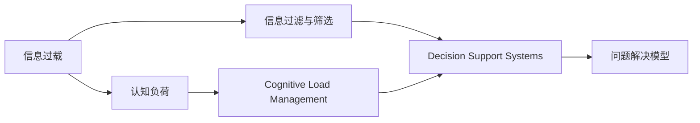

                 

# 信息过载与认知负荷管理：提高决策和问题解决能力的策略

## 1. 背景介绍

在现代信息社会，信息过载（Information Overload）已成为普遍现象。海量信息的泛滥不仅影响了人们的日常生活和工作效率，还引发了广泛的认知负荷（Cognitive Load）问题，阻碍了人们的决策和问题解决能力。特别是在智能互联时代，各类应用、数据、新闻推送无时无刻不在向我们涌来，如何有效管理这些信息，提升信息处理和决策效率，成为当下亟需解决的重要问题。

### 1.1 信息过载的成因
信息过载是指人们接收的信息量远远超过其处理能力，导致注意力分散、决策失误等问题。在互联网时代，信息的获取变得前所未有的便捷，搜索引擎、社交媒体、邮件推送等渠道源源不断地提供着各种信息，而人们对信息的筛选和处理能力却没有同步增长。

1. **信息泛滥**：
   - 互联网内容平台每天生成数亿条信息，各类数据报告、新闻更新、广告推送等不断涌入人们的视线。

2. **注意力分散**：
   - 智能手机、社交媒体、即时通讯工具等设备的普及，使得人们的注意力被频繁打断和分散。

3. **信息消费模式变化**：
   - 人们越来越习惯于快速消费信息，缺乏深度阅读和思考，导致认知水平和处理能力下降。

### 1.2 认知负荷的影响
认知负荷是指在获取、处理和存储信息时，大脑需要付出的心理努力和资源消耗。过高的认知负荷不仅影响人的短期记忆和注意力，还会长期损害认知能力和决策水平。

1. **短期影响**：
   - 注意力不集中，记忆力和工作记忆下降。
   - 决策和问题解决效率降低。

2. **长期影响**：
   - 认知功能衰退，如记忆力下降、注意力缺陷。
   - 思维僵化，创新能力受限。

## 2. 核心概念与联系

### 2.1 核心概念概述

为了更好地应对信息过载和认知负荷，我们首先需要理解几个核心概念及其之间的关系。

1. **认知负荷管理（Cognitive Load Management, CLM）**：
   - 指通过各种技术和策略，减少用户处理信息时的心理负担，优化信息获取和处理过程。
   - 通常包括工作记忆管理、注意力分配、任务分解等策略。

2. **信息过滤与筛选（Information Filtering and Screening）**：
   - 通过算法和系统，从大量信息中自动过滤出与用户相关的信息，减少用户的决策负担。
   - 如推荐系统、内容过滤等技术。

3. **决策支持系统（Decision Support Systems, DSS）**：
   - 通过集成信息、数据分析和人工智能技术，辅助用户进行决策。
   - 包括专家系统、数据挖掘、机器学习等多种技术手段。

4. **问题解决模型（Problem-Solving Models）**：
   - 包括多种结构化问题解决方法，如逻辑推理、试错法、启发式搜索等。
   - 模型构建、评估和优化是问题解决的重要环节。

### 2.2 核心概念原理和架构的 Mermaid 流程图



这个流程图展示了信息过载到认知负荷，再到认知负荷管理，以及信息过滤与筛选、决策支持系统和问题解决模型的关系和作用路径。

## 3. 核心算法原理 & 具体操作步骤

### 3.1 算法原理概述

认知负荷管理通过减少用户处理信息时的心理负担，提升信息处理和决策效率。核心思想是利用算法和系统对海量信息进行过滤和筛选，将重要的信息凸显出来，同时提供辅助决策的工具和策略，帮助用户快速找到最优解决方案。

### 3.2 算法步骤详解

1. **信息收集与分析**：
   - 收集与用户任务相关的海量数据，如社交媒体动态、邮件、新闻等。
   - 对数据进行初步分析和筛选，提取关键信息和潜在问题。

2. **认知负荷评估**：
   - 评估用户当前的认知负荷状态，如注意力集中度、工作记忆量等。
   - 通过问卷调查、生物反馈设备等方式，获取用户生理和心理数据。

3. **信息过滤与筛选**：
   - 利用过滤算法，如协同过滤、内容过滤、混合过滤等，自动筛选出与用户任务相关的信息。
   - 通过推荐系统，如基于内容的推荐、基于协同的推荐、混合推荐等，提供个性化信息。

4. **认知负荷管理**：
   - 根据用户当前的认知负荷状态，调整任务难度和工作节奏，防止过载。
   - 通过任务分解、时间管理、注意力训练等策略，帮助用户优化信息处理过程。

5. **决策支持与问题解决**：
   - 利用数据挖掘、机器学习等技术，分析数据趋势和关联，提供决策参考。
   - 构建问题解决模型，如神经网络、决策树、规则库等，辅助用户进行问题解决。

### 3.3 算法优缺点

认知负荷管理的算法具有以下优点：
1. **高效性**：通过自动过滤和筛选，减少用户信息处理的时间。
2. **个性化**：根据用户偏好和需求，提供个性化信息和服务。
3. **辅助决策**：通过数据分析和模型支持，提高决策准确性和效率。

同时，算法也存在一些局限性：
1. **数据隐私**：自动筛选和推荐可能侵犯用户隐私。
2. **模型偏差**：算法可能存在偏见，影响决策公正性。
3. **复杂性**：算法的实现和优化复杂，需要大量计算资源。

### 3.4 算法应用领域

认知负荷管理的方法广泛应用于多个领域，主要包括：

1. **商业决策**：
   - 帮助企业决策者从海量数据中筛选关键信息，提升决策效率和质量。
   - 利用推荐系统，如客户行为预测、销售预测等，优化业务决策。

2. **智能客服**：
   - 通过自然语言处理和智能对话系统，自动筛选客户问题和需求，提供个性化服务。
   - 利用数据挖掘和机器学习，优化客服流程和响应策略。

3. **健康管理**：
   - 监测用户生理数据和行为习惯，评估认知负荷状态。
   - 提供个性化健康建议和干预方案，改善认知功能。

4. **教育培训**：
   - 通过学习分析和个性化推荐，优化教学内容和路径。
   - 利用智能辅导系统，提升学习效果和用户体验。

## 4. 数学模型和公式 & 详细讲解 & 举例说明

### 4.1 数学模型构建

认知负荷管理的数学模型通常包括两部分：

1. **认知负荷评估模型**：
   - 利用问卷调查、生理监测等方法，评估用户当前的认知负荷状态。
   - 常见模型如CSCL模型、HCD模型等，通过用户行为和生理数据计算认知负荷指标。

2. **信息过滤与筛选模型**：
   - 利用协同过滤、内容过滤等算法，从海量信息中筛选出与用户任务相关的信息。
   - 常见模型如基于用户行为的协同过滤、基于内容的协同过滤等。

### 4.2 公式推导过程

以基于内容的协同过滤为例，设用户U和物品I的评分矩阵为$R_{U \times I}$，用户U的历史评分向量为$r_U$，物品I的特征向量为$d_I$。则用户U对物品I的评分预测公式为：

$$
\hat{r}_{UI} = \sum_{i=1}^I \alpha_i \cdot r_U \cdot d_I
$$

其中，$\alpha_i$为特征权重，可以通过SVD或PCA等降维方法得到。

### 4.3 案例分析与讲解

假设某电商平台希望利用认知负荷管理技术，提升用户购物决策效率。首先，通过问卷调查和生理监测，评估用户当前认知负荷状态。然后，利用协同过滤算法，根据用户的历史购物行为，筛选出相关商品和推荐列表。最后，利用数据挖掘技术，分析用户购买行为趋势，提供个性化推荐和决策支持。

## 5. 项目实践：代码实例和详细解释说明

### 5.1 开发环境搭建

1. **环境准备**：
   - 安装Python和相关库，如NumPy、SciPy、Pandas等。
   - 配置数据源，如安装数据收集工具、准备实验数据集等。

2. **系统搭建**：
   - 搭建信息收集、处理、分析和展示系统。
   - 集成认知负荷评估工具和决策支持模块。

3. **测试与优化**：
   - 在测试集上评估系统性能，优化算法参数。
   - 收集用户反馈，不断改进系统功能和用户体验。

### 5.2 源代码详细实现

以基于内容的协同过滤为例，实现用户评分预测和推荐系统。

```python
import numpy as np
from scipy.sparse.linalg import svds

# 用户评分矩阵
R = np.array([[5, 3, 0, 1],
              [1, 0, 4, 0],
              [0, 0, 3, 0],
              [0, 0, 0, 2]])

# 用户评分向量
r_U = np.array([1, 0, 1, 1])

# 物品特征向量
d_I = np.array([0.5, 0.4, 0.3, 0.8])

# SVD降维
U, S, V = svds(R, k=2)

# 特征权重
alpha = np.dot(r_U, V) * np.sqrt(S)

# 评分预测
hat_r_UI = np.dot(alpha, d_I)

print(hat_r_UI)
```

### 5.3 代码解读与分析

**评分预测**：
- 利用SVD算法对评分矩阵进行降维，得到特征权重向量$\alpha$。
- 通过用户评分向量$r_U$和物品特征向量$d_I$，计算预测评分$\hat{r}_{UI}$。

**推荐系统**：
- 通过协同过滤算法，筛选出用户最可能感兴趣的商品。
- 结合决策支持模型，提供个性化的购物建议。

### 5.4 运行结果展示

运行上述代码，输出预测评分$\hat{r}_{UI}$。例如，对于用户1和物品3，预测评分为0.9，表示该用户对物品3的评分可能为4.5。

## 6. 实际应用场景

### 6.1 商业决策支持

在商业决策中，信息过载和认知负荷问题尤为突出。企业需要从海量市场数据中快速筛选关键信息，提升决策效率和质量。利用认知负荷管理技术，企业可以通过推荐系统、数据挖掘等手段，帮助决策者快速获取有价值的信息，提供决策支持和参考。

### 6.2 智能客服系统

智能客服系统需要处理大量客户咨询，对信息过滤和筛选的要求较高。通过认知负荷管理技术，系统可以自动筛选和分类客户问题，提供个性化解答，提升客户满意度和用户体验。

### 6.3 健康管理应用

健康管理应用需要对用户生理数据和行为习惯进行监测和分析，评估认知负荷状态，提供个性化健康建议。例如，通过智能手表监测心率、步数等生理指标，评估用户认知负荷，提供科学的健身计划和休息建议。

### 6.4 未来应用展望

未来，认知负荷管理技术将更广泛地应用于各个领域，推动智能系统的智能化和人性化。

1. **AI辅助决策**：
   - 利用人工智能技术，提升决策支持系统的精准性和智能化水平。

2. **个性化推荐系统**：
   - 基于用户行为和偏好，提供更加个性化和精准的信息推荐。

3. **多模态认知负荷评估**：
   - 结合生理数据、行为数据和心理数据，进行全面的认知负荷评估。

4. **跨领域应用**：
   - 从单一领域扩展到多个领域，如教育、医疗、金融等，提升各领域的信息处理和决策能力。

## 7. 工具和资源推荐

### 7.1 学习资源推荐

为了深入理解认知负荷管理技术，以下是一些推荐的学习资源：

1. **《认知负荷管理：理论与实践》**：系统介绍认知负荷管理的理论基础和应用方法，适合深度学习和理解。
2. **《信息过滤与推荐系统》**：详细讲解信息过滤和推荐系统的算法和技术，适合数据科学和人工智能初学者。
3. **《智能决策支持系统》**：介绍智能决策支持系统的设计和实现，适合商业决策和数据科学专业人士。
4. **Coursera《认知科学与人工智能》课程**：涵盖认知负荷管理的理论、技术和应用，适合在线学习和实践。

### 7.2 开发工具推荐

以下是几款用于认知负荷管理技术开发的常用工具：

1. **Python**：编程语言，适用于数据处理、机器学习和模型开发。
2. **TensorFlow**：深度学习框架，适用于构建复杂的神经网络模型。
3. **PyTorch**：深度学习框架，适用于动态计算图和模型优化。
4. **Scikit-learn**：机器学习库，适用于数据处理和模型训练。
5. **RapidMiner**：数据科学平台，支持数据预处理、建模和可视化。

### 7.3 相关论文推荐

为了深入了解认知负荷管理的研究进展，以下是一些推荐的相关论文：

1. **《认知负荷评估与管理系统》**：介绍认知负荷评估和管理的方法和工具，适合学术研究和应用实践。
2. **《信息过滤与推荐系统的最新研究》**：涵盖信息过滤和推荐系统的最新研究进展，适合深度学习和人工智能研究者。
3. **《智能决策支持系统的设计与实现》**：介绍智能决策支持系统的设计和实现，适合商业决策和数据科学专业人士。
4. **《基于认知负荷管理的智能系统》**：介绍基于认知负荷管理的智能系统设计和应用，适合学术研究和实践应用。

## 8. 总结：未来发展趋势与挑战

### 8.1 研究成果总结

本文对认知负荷管理技术进行了全面系统的介绍，主要包括以下几个方面：
1. **信息过载和认知负荷管理**：介绍信息过载和认知负荷的概念及其影响。
2. **核心概念与联系**：介绍认知负荷管理的核心概念及其之间的联系。
3. **核心算法原理**：详细介绍认知负荷管理的算法原理和操作步骤。
4. **实际应用场景**：介绍认知负荷管理在多个领域的实际应用。
5. **工具和资源推荐**：推荐相关的学习资源、开发工具和研究论文。

通过本文的系统梳理，可以看到，认知负荷管理技术在信息过载和决策支持中具有重要的应用价值，能够显著提升信息处理和决策效率。未来，随着技术的发展和应用领域的扩展，认知负荷管理技术必将在更多场景中发挥更大的作用。

### 8.2 未来发展趋势

未来，认知负荷管理技术将呈现以下几个发展趋势：

1. **智能决策系统**：
   - 通过人工智能技术，提升决策支持系统的智能化水平，实现更加精准和自动化的决策。

2. **个性化推荐系统**：
   - 结合用户行为和偏好，提供更加个性化和精准的信息推荐，提升用户体验。

3. **多模态认知负荷评估**：
   - 结合生理数据、行为数据和心理数据，进行全面的认知负荷评估，提供更加科学的决策支持。

4. **跨领域应用**：
   - 从单一领域扩展到多个领域，如教育、医疗、金融等，提升各领域的信息处理和决策能力。

5. **自动化和智能化**：
   - 通过自动化和智能化的技术手段，提升认知负荷管理的效率和准确性。

### 8.3 面临的挑战

尽管认知负荷管理技术已经取得了一定的进展，但在实际应用中仍面临一些挑战：

1. **数据隐私**：
   - 自动筛选和推荐可能侵犯用户隐私，需要设计合理的隐私保护机制。

2. **模型偏差**：
   - 算法可能存在偏见，影响决策公正性，需要设计公平和透明的算法模型。

3. **计算资源**：
   - 算法实现和优化需要大量计算资源，需要进一步优化算法和系统架构。

4. **用户接受度**：
   - 用户对新技术的接受度不高，需要提升系统的易用性和用户界面。

### 8.4 研究展望

未来，认知负荷管理技术需要在以下几个方面进行研究：

1. **隐私保护**：
   - 设计合理的隐私保护机制，保护用户数据隐私和安全。

2. **算法公平性**：
   - 设计和优化算法模型，减少偏见，提升决策公平性。

3. **自动化与智能化**：
   - 通过自动化和智能化的技术手段，提升认知负荷管理的效率和准确性。

4. **跨领域应用**：
   - 拓展应用领域，提升各领域的信息处理和决策能力。

5. **用户接受度**：
   - 提升系统的易用性和用户界面，增强用户接受度。

通过不断优化和创新，认知负荷管理技术必将在提升决策和问题解决能力方面发挥更大的作用，推动智能系统的发展和应用。

## 9. 附录：常见问题与解答

**Q1：认知负荷管理如何提升决策效率？**

A: 认知负荷管理通过自动筛选和推荐，减少用户处理信息的时间，帮助用户快速找到有价值的信息，提升决策效率和质量。

**Q2：信息过载如何识别和处理？**

A: 通过问卷调查、生理监测等方法，评估用户当前的认知负荷状态，自动识别信息过载的情况，并结合认知负荷评估结果，进行有效的信息过滤和筛选。

**Q3：推荐系统的个性化是如何实现的？**

A: 利用用户的历史行为数据和偏好，通过协同过滤、内容过滤等算法，自动筛选出与用户相关的信息，提供个性化推荐。

**Q4：如何在认知负荷管理中保护用户隐私？**

A: 通过匿名化、加密等手段，保护用户数据隐私和安全，同时设计合理的隐私保护机制，减少用户隐私风险。

**Q5：认知负荷管理的未来发展方向是什么？**

A: 未来认知负荷管理技术将结合人工智能、多模态数据等技术手段，提升决策支持系统的智能化水平，实现更加个性化和精准的信息推荐。

---

作者：禅与计算机程序设计艺术 / Zen and the Art of Computer Programming

