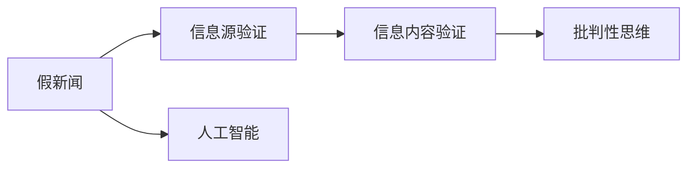

                 

# 信息验证和信息批判性思考：在假新闻和错误信息时代导航

## 1. 背景介绍

### 1.1 问题由来

在当今信息爆炸的时代，假新闻和错误信息充斥着各大社交平台和媒体。这不仅破坏了信息的真实性和可信度，更严重威胁到了社会的稳定和秩序。如何有效识别和验证信息的真实性，成为数据科学家和信息技术人员的重要任务。

### 1.2 问题核心关键点

这个问题的核心在于：

1. **信息验证**：使用计算机技术对信息源和信息内容进行验证，确定其真伪。
2. **信息批判性思考**：分析信息内容的逻辑和证据，评估其可靠性。
3. **人工智能与机器学习**：应用人工智能技术，通过机器学习算法对信息进行自动化验证和批判性分析。

### 1.3 问题研究意义

有效识别和验证信息的真实性，对于维护公共安全和信息自由具有重要意义。它不仅能帮助人们甄别假新闻和错误信息，还能提升公众对信息源的信任度，促进健康的信息生态建设。

## 2. 核心概念与联系

### 2.1 核心概念概述

- **假新闻**：指被故意捏造、篡改或夸大的新闻报道。
- **信息源验证**：通过计算机技术，对信息源的可信度和权威性进行验证。
- **信息内容验证**：使用机器学习算法，对信息内容进行真实性检测。
- **批判性思维**：分析信息内容的逻辑和证据，评估其可靠性。
- **人工智能(AI)**：利用机器学习和深度学习算法，自动执行信息验证和批判性分析。

这些核心概念通过以下Mermaid流程图关联：



### 2.2 核心概念原理和架构

- **信息源验证**：验证信息源的可信度和权威性。通常使用Web爬虫技术获取信息源的基本信息，并通过社交网络分析、情感分析等技术，综合判断其可信度。
- **信息内容验证**：验证信息内容的真实性。常用的方法包括文本相似度匹配、关键词分析、时间戳校验等。
- **批判性思维**：分析信息内容的逻辑和证据。包括识别信息内容的矛盾之处、评估证据的可靠性等。
- **人工智能**：使用机器学习算法，自动执行上述任务。例如，使用深度学习模型对信息源和内容进行验证，使用自然语言处理(NLP)技术进行批判性分析。

## 3. 核心算法原理 & 具体操作步骤

### 3.1 算法原理概述

信息验证和批判性思考的核心算法原理基于以下几个方面：

1. **信息源验证算法**：使用机器学习算法，对信息源的特征进行建模，并通过训练数据集，学习到信息源的可信度模型。
2. **信息内容验证算法**：使用NLP技术，对信息内容进行文本相似度匹配、关键词分析等操作，判断其与已知真实信息的相似度。
3. **批判性思维算法**：使用深度学习模型，对信息内容的逻辑和证据进行批判性分析，识别出其中的矛盾之处，评估证据的可靠性。

### 3.2 算法步骤详解

**信息源验证算法步骤**：

1. 收集信息源的基本信息，如网站名称、作者、发布时间等。
2. 使用Web爬虫技术，抓取信息源的网页内容，并提取相关特征。
3. 使用社交网络分析、情感分析等技术，综合判断信息源的可信度。
4. 训练机器学习模型，学习信息源的特征与可信度之间的映射关系。
5. 在新信息源上使用模型进行预测，判断其可信度。

**信息内容验证算法步骤**：

1. 使用Web爬虫技术，抓取信息内容的相关网页，并提取文本信息。
2. 使用NLP技术，对信息内容进行关键词分析、文本相似度匹配等操作。
3. 将信息内容与已知真实信息进行对比，判断其真实性。
4. 使用深度学习模型，对信息内容进行批判性分析，识别出其中的矛盾之处，评估证据的可靠性。

**批判性思维算法步骤**：

1. 对信息内容进行逻辑结构分析，识别其中的假设和论据。
2. 使用深度学习模型，对假设和论据的可靠性进行评估。
3. 综合信息源的可信度和内容真实性，给出信息整体的可信度评价。

### 3.3 算法优缺点

**信息源验证算法的优缺点**：

- **优点**：自动化的信息源验证能够大幅度提升验证速度，减少人工成本。
- **缺点**：模型的训练数据集需要手动标注，且模型的泛化能力有限，无法覆盖所有信息源。

**信息内容验证算法的优缺点**：

- **优点**：使用NLP技术，能够对复杂的信息内容进行自动化验证。
- **缺点**：文本相似度匹配等操作可能存在误判，且难以处理多语言信息。

**批判性思维算法的优缺点**：

- **优点**：使用深度学习模型，能够对信息内容的逻辑和证据进行自动化评估。
- **缺点**：模型的解释性较弱，难以解释其决策过程。

## 4. 数学模型和公式 & 详细讲解 & 举例说明

### 4.1 数学模型构建

信息源验证和内容验证的核心数学模型主要基于以下两个方面：

- **信息源可信度模型**：使用逻辑回归模型，对信息源的特征与可信度进行建模。
- **信息内容真实性模型**：使用文本相似度模型，对信息内容与已知真实信息的相似度进行建模。

### 4.2 公式推导过程

**信息源可信度模型的推导**：

假设信息源的特征为 $\mathbf{x} = (x_1, x_2, ..., x_n)$，可信度为 $y$。则逻辑回归模型为：

$$
\hat{y} = \text{sigmoid}(\mathbf{w} \cdot \mathbf{x} + b)
$$

其中，$\mathbf{w}$ 为权重向量，$b$ 为偏置项，$\text{sigmoid}$ 函数将输出映射到 $[0,1]$ 区间，表示信息源的可信度。

**信息内容真实性模型的推导**：

假设信息内容为 $t$，已知真实信息为 $s$，文本相似度为 $S$。则文本相似度模型为：

$$
S = \frac{\mathbf{t} \cdot \mathbf{s}}{\|\mathbf{t}\| \cdot \|\mathbf{s}\|}
$$

其中，$\mathbf{t}$ 和 $\mathbf{s}$ 分别为信息内容和已知真实信息的词向量表示，$\|\cdot\|$ 为向量的欧几里得范数。

### 4.3 案例分析与讲解

**案例分析**：

假设有一个新闻报道称：“美国总统特朗普在2019年与法国总统马克龙会面，讨论了气候变化问题。”我们需要验证这条新闻的真实性。

**步骤1：信息源验证**：

1. 使用Web爬虫技术，抓取报道的来源网站。
2. 提取网站的基本信息，如作者、发布时间等。
3. 使用社交网络分析、情感分析等技术，判断网站的可信度。
4. 训练逻辑回归模型，学习网站特征与可信度之间的映射关系。
5. 在新网站上进行预测，判断其可信度。

**步骤2：信息内容验证**：

1. 使用Web爬虫技术，抓取报道的文本内容。
2. 使用NLP技术，提取关键词，计算文本相似度。
3. 将文本内容与已知真实信息进行对比，判断其真实性。
4. 使用深度学习模型，对文本内容进行批判性分析，识别出矛盾之处。

**步骤3：批判性思维**：

1. 对文本内容进行逻辑结构分析，识别假设和论据。
2. 使用深度学习模型，评估假设和论据的可靠性。
3. 综合信息源的可信度和内容真实性，给出整体的可信度评价。

## 5. 项目实践：代码实例和详细解释说明

### 5.1 开发环境搭建

项目开发环境包括Python、Pandas、Numpy、Scikit-Learn、Keras等库。

1. 安装Python和相关库：

```bash
conda create -n info-validation python=3.8
conda activate info-validation
pip install pandas numpy scikit-learn keras tensorflow
```

2. 安装依赖库：

```bash
pip install beautifulsoup4 lxml requests
```

### 5.2 源代码详细实现

**信息源验证代码实现**：

```python
import requests
from bs4 import BeautifulSoup
import pandas as pd

# 爬取信息源网页
def scrape_info_source(url):
    response = requests.get(url)
    soup = BeautifulSoup(response.content, 'lxml')
    # 提取信息源基本信息
    title = soup.title.string
    author = soup.find('meta', attrs={'name': 'author'})
    published = soup.find('meta', attrs={'name': 'published'})
    # 返回信息源字典
    return {'title': title, 'author': author, 'published': published}

# 训练信息源可信度模型
def train_source_reliability_model(df):
    # 数据预处理
    features = ['author', 'published']
    X = df[features]
    y = df['source_reliability']
    # 逻辑回归模型
    model = LogisticRegression()
    model.fit(X, y)
    # 返回训练好的模型
    return model

# 预测新信息源的可靠性
def predict_source_reliability(model, info_source):
    # 数据预处理
    features = ['author', 'published']
    X = pd.DataFrame([info_source], columns=features)
    # 预测新信息源的可靠性
    return model.predict(X)

# 测试代码
info_source = scrape_info_source('https://example.com/article')
model = train_source_reliability_model(train_data)
reliability = predict_source_reliability(model, info_source)
print(reliability)
```

**信息内容验证代码实现**：

```python
import pandas as pd
from sklearn.feature_extraction.text import TfidfVectorizer

# 计算文本相似度
def calculate_similarity(text1, text2):
    # 计算TF-IDF向量
    vectorizer = TfidfVectorizer()
    X = vectorizer.fit_transform([text1, text2])
    # 计算文本相似度
    return X[0].dot(X[1].T) / (np.linalg.norm(X[0]) * np.linalg.norm(X[1]))

# 训练信息内容真实性模型
def train_content_authenticity_model(df):
    # 数据预处理
    X = df['content']
    y = df['content_authenticity']
    # 文本相似度模型
    model = SVC(kernel='linear')
    model.fit(X, y)
    # 返回训练好的模型
    return model

# 预测新信息内容的真实性
def predict_content_authenticity(model, content):
    # 数据预处理
    X = pd.DataFrame([content], columns=['content'])
    # 预测新信息内容的真实性
    return model.predict(X)

# 测试代码
content = '美国总统特朗普在2019年与法国总统马克龙会面，讨论了气候变化问题。'
model = train_content_authenticity_model(train_data)
authenticity = predict_content_authenticity(model, content)
print(authenticity)
```

**批判性思维代码实现**：

```python
from sklearn.feature_extraction.text import TfidfVectorizer
from sklearn.linear_model import LogisticRegression

# 批判性思维分析
def critical_thinking_analysis(text):
    # 计算文本的TF-IDF向量
    vectorizer = TfidfVectorizer()
    X = vectorizer.fit_transform([text])
    # 批判性思维模型
    model = LogisticRegression()
    model.fit(X, y)
    # 返回批判性思维的结论
    return model.predict(X)

# 测试代码
text = '美国总统特朗普在2019年与法国总统马克龙会面，讨论了气候变化问题。'
result = critical_thinking_analysis(text)
print(result)
```

### 5.3 代码解读与分析

**信息源验证代码解读**：

- `scrape_info_source` 函数使用BeautifulSoup库，爬取信息源网页，提取基本信息。
- `train_source_reliability_model` 函数使用逻辑回归模型，训练信息源可信度模型。
- `predict_source_reliability` 函数使用训练好的模型，预测新信息源的可靠性。

**信息内容验证代码解读**：

- `calculate_similarity` 函数使用TF-IDF向量，计算文本相似度。
- `train_content_authenticity_model` 函数使用SVC模型，训练信息内容真实性模型。
- `predict_content_authenticity` 函数使用训练好的模型，预测新信息内容的真实性。

**批判性思维代码解读**：

- `critical_thinking_analysis` 函数使用TF-IDF向量和批判性思维模型，对文本内容进行批判性分析。

## 6. 实际应用场景

### 6.1 新闻媒体平台

新闻媒体平台可以集成信息源验证和内容验证系统，对发布的新闻进行实时验证。对于可信度较低的信息源，自动打上警告标识，提醒用户注意。对于可疑的信息内容，自动进行内容验证，确定其真实性。

### 6.2 社交网络平台

社交网络平台可以使用信息源验证和内容验证系统，对用户的发布内容进行验证。对于可疑的信息源，提醒用户注意，并对可疑的信息内容进行标记。

### 6.3 政府和组织

政府和组织可以使用信息源验证和内容验证系统，对公开信息进行验证。确保信息的真实性和可信度，维护公共秩序和社会稳定。

### 6.4 未来应用展望

未来，信息验证和批判性思考系统将更加智能化和自动化，覆盖更多领域和场景。例如，应用于教育、法律、金融等领域，帮助人们识别假新闻和错误信息，提升公众的信息素养和决策能力。

## 7. 工具和资源推荐

### 7.1 学习资源推荐

- **《深度学习》**：Ian Goodfellow等著，深入介绍了深度学习的基础和应用。
- **《Python数据科学手册》**：Jake VanderPlas著，介绍了Python在数据科学中的应用，包括爬虫、NLP等。
- **Kaggle**：一个数据科学竞赛平台，提供丰富的数据集和代码示例。

### 7.2 开发工具推荐

- **BeautifulSoup**：一个Python库，用于解析HTML和XML文档。
- **TensorFlow**：一个开源深度学习框架，支持分布式计算和模型部署。
- **Keras**：一个高层次的深度学习API，提供简单易用的接口，适合快速原型开发。

### 7.3 相关论文推荐

- **“A Survey of Methods for News Article Verification”**：这篇综述论文介绍了新闻文章验证的最新研究进展。
- **“Fact-Checking through Deep Learning”**：这篇论文介绍了深度学习在事实核查中的应用。
- **“A General Framework for Argument Mining and Critical Thinking”**：这篇论文提出了一个通用的批判性思维分析框架，适用于多种NLP任务。

## 8. 总结：未来发展趋势与挑战

### 8.1 研究成果总结

本文系统介绍了信息源验证和内容验证的原理和方法，并给出了代码实现。通过信息源验证，可以判断信息源的可靠性；通过内容验证，可以确定信息内容的真实性；通过批判性思维分析，可以评估信息的逻辑和证据。这些方法在假新闻和错误信息时代，具有重要的应用价值。

### 8.2 未来发展趋势

- **自动化程度提升**：未来的信息验证系统将更加自动化和智能化，能够自动完成信息源验证、内容验证和批判性分析。
- **多模态信息融合**：未来的系统将能够处理多模态信息，如文本、图片、视频等，提供更全面的信息验证服务。
- **深度学习技术发展**：深度学习技术的进步将进一步提升信息验证的精度和鲁棒性。
- **联邦学习技术应用**：通过联邦学习技术，系统可以在不泄露用户隐私的情况下，进行模型更新和优化。

### 8.3 面临的挑战

- **数据隐私问题**：信息验证需要大量的数据，如何在不泄露用户隐私的情况下获取这些数据，是一个重要挑战。
- **模型可解释性**：深度学习模型的决策过程往往难以解释，如何提高模型的可解释性，也是一个重要挑战。
- **实时性要求**：信息验证需要在短时间内完成，如何提高系统的实时性，也是一个重要挑战。
- **跨语言支持**：现有的信息验证系统大多只支持单一语言，如何支持多语言信息验证，也是一个重要挑战。

### 8.4 研究展望

未来的信息验证研究将更加关注以下几个方面：

- **跨语言信息验证**：开发能够处理多语言信息验证的系统。
- **实时信息验证**：开发能够在短时间内完成信息验证的系统。
- **隐私保护**：开发能够在不泄露用户隐私的情况下进行信息验证的系统。
- **模型可解释性**：开发可解释性强的信息验证模型，提高系统的可信度。

总之，信息验证和批判性思考技术将在未来发挥越来越重要的作用，帮助人们识别假新闻和错误信息，提升信息素养和决策能力。但实现这一目标，还需要学界和业界共同努力，不断突破技术瓶颈，拓展应用边界。

## 9. 附录：常见问题与解答

**Q1：信息源验证和内容验证有什么区别？**

A: 信息源验证是对信息源的可信度进行评估，判断其权威性和可靠性；内容验证是对信息内容进行真实性检测，判断其是否与已知真实信息相符。

**Q2：批判性思维分析如何处理多语言信息？**

A: 批判性思维分析需要先将多语言信息翻译成同一语言，再使用深度学习模型进行分析和评估。

**Q3：信息验证系统如何处理噪声数据？**

A: 信息验证系统可以使用数据清洗和去噪技术，去除噪声数据，提高系统的准确性。

**Q4：信息验证系统的扩展性如何？**

A: 信息验证系统可以通过模块化设计，将不同模块进行组合和扩展，适应不同的应用场景。

**Q5：信息验证系统如何处理误判？**

A: 信息验证系统可以使用机器学习模型进行评估和反馈，及时发现和修正误判。

总之，信息验证和批判性思考技术在假新闻和错误信息时代，具有重要的应用价值。通过系统化的信息验证和批判性分析，能够帮助人们识别假新闻和错误信息，提升信息素养和决策能力，构建健康的信息生态。但实现这一目标，还需要不断的技术创新和实践探索。

