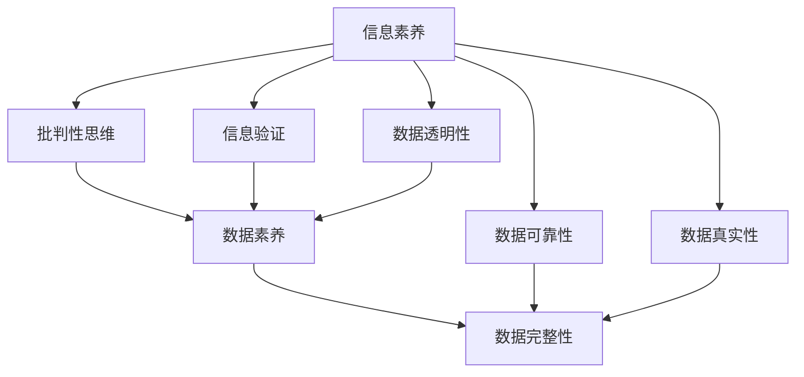

                 

## 1. 背景介绍

### 1.1 问题由来

随着信息技术的飞速发展，互联网已经成为我们获取知识、交流思想、分享生活的重要平台。然而，信息的泛滥和杂乱也带来了新的挑战。虚假信息、谣言、假新闻等不断侵蚀着社会的信任体系，对社会稳定和经济发展产生了严重的影响。在这种背景下，信息验证和信息素养能力成为了迫切需要培养的软技能，对于提高公众的批判性思维和媒体素养具有重要意义。

### 1.2 问题核心关键点

信息验证和信息素养能力主要关注以下几个关键点：

- **数据真实性**：识别和判断信息的来源和真实性，避免被虚假信息误导。
- **数据可靠性**：评估数据的准确性和可靠性，避免因错误数据导致决策失误。
- **数据权威性**：了解数据的权威性和公信力，确保数据来源和处理方式符合专业标准。
- **数据完整性**：识别数据的不完整性或缺失，避免因数据偏差导致结论错误。
- **数据透明性**：理解和质疑数据的透明度和可追溯性，确保数据来源和处理过程的公开性。

这些核心关键点构成了信息验证和信息素养能力的基础，旨在培养公众在面对信息时的批判性思维和判断力。

### 1.3 问题研究意义

在数字化时代，信息验证和信息素养能力不仅是个人认知素养的一部分，更是社会和媒体行业健康发展的基石。它能够帮助公众在信息爆炸的环境中保持理性、客观的态度，提高决策的科学性和准确性，增强社会的凝聚力和信任度。此外，信息素养能力的提升，对于教育、媒体、公共卫生等多个领域也具有深远的意义。

## 2. 核心概念与联系

### 2.1 核心概念概述

信息验证和信息素养能力涉及多个核心概念，包括：

- **信息素养**：指个人获取、评价、利用信息的能力，包括信息意识、信息知识、信息能力和信息道德等。
- **批判性思维**：指对信息进行逻辑分析、评估和判断的能力，能够识别信息的逻辑漏洞和证据的可靠性。
- **信息验证**：指通过一定方法和技术，对信息进行真实性、可靠性和权威性的验证，确保信息的准确性和可信度。
- **数据素养**：指在数据分析、数据处理、数据应用等方面具备的专业技能和知识。

这些概念之间的联系可以通过以下Mermaid流程图来展示：



这个流程图展示了信息素养、批判性思维、数据素养与信息验证之间的逻辑关系：

1. 信息素养是基础，培养对信息的感知和处理能力。
2. 批判性思维是核心，通过逻辑分析和评估来验证信息。
3. 数据素养是应用，对数据进行科学分析和应用。
4. 信息验证则是方法，通过验证技术确保信息的准确性。

这些概念相互交织，共同构成了信息验证和信息素养能力的基础框架。

## 3. 核心算法原理 & 具体操作步骤

### 3.1 算法原理概述

信息验证和信息素养能力涉及多个算法和技术，包括：

- **数据清洗与预处理**：去除噪音、处理缺失值、标准化数据格式等。
- **数据验证与校验**：通过哈希校验、数字签名、时间戳等方法验证数据的完整性和真实性。
- **数据关联与匹配**：通过跨源数据关联、多维度匹配等技术，提高数据的一致性和可信度。
- **数据可视化与分析**：通过图表、统计分析等手段，直观展示和分析数据的特征和规律。
- **数据解释与理解**：通过自然语言处理技术，解释和理解数据背后的含义和背景。

这些算法和技术共同支撑了信息验证和信息素养能力的实现。

### 3.2 算法步骤详解

以下是信息验证和信息素养能力的详细步骤：

**Step 1: 数据收集与预处理**
- 收集需要验证和分析的信息数据。
- 对数据进行清洗和预处理，去除噪音、处理缺失值、标准化数据格式等。

**Step 2: 数据校验与验证**
- 对数据进行哈希校验、数字签名、时间戳等方法验证数据的完整性和真实性。
- 通过跨源数据关联、多维度匹配等技术，提高数据的一致性和可信度。

**Step 3: 数据分析与可视化**
- 使用统计分析和图表展示，直观展示和分析数据的特征和规律。
- 结合自然语言处理技术，解释和理解数据背后的含义和背景。

**Step 4: 结果验证与报告**
- 对分析结果进行验证，确保数据的准确性和可信度。
- 撰写信息验证报告，呈现分析过程和结果。

**Step 5: 反馈与改进**
- 根据分析结果和反馈，不断改进信息验证和信息素养能力的方法和技术。

### 3.3 算法优缺点

信息验证和信息素养能力具有以下优点：
- 提升信息素养：通过系统的信息验证和分析，提升公众的信息素养能力。
- 提高决策准确性：通过准确的数据验证，确保决策的科学性和可靠性。
- 增强社会信任：通过公开透明的验证过程，增强社会信任和公信力。

同时，也存在一些局限性：
- 技术门槛较高：信息验证和信息素养能力需要一定的技术知识和实践经验。
- 数据来源复杂：信息验证需要跨源数据关联和验证，面临数据来源多样性和复杂性的挑战。
- 方法局限性：现有的信息验证方法可能无法应对所有类型的虚假信息和误导性内容。

尽管存在这些局限性，但就目前而言，信息验证和信息素养能力仍然是大数据时代信息处理的重要工具，对于提高信息处理和决策的科学性和准确性具有重要意义。

### 3.4 算法应用领域

信息验证和信息素养能力在多个领域具有广泛的应用，包括：

- **媒体行业**：用于新闻事实核查、假新闻检测、新闻真实性验证等。
- **公共卫生**：用于疾病数据验证、疫情信息核查、公共卫生事件预警等。
- **金融行业**：用于金融数据验证、交易信息核查、金融欺诈检测等。
- **教育领域**：用于学术研究验证、教育数据核查、教育资源评估等。
- **社交媒体**：用于谣言检测、虚假信息监测、用户行为分析等。

这些领域的信息验证和信息素养能力的提升，对于提高数据质量和信息处理能力，增强决策的科学性和公信力具有重要意义。

## 4. 数学模型和公式 & 详细讲解 & 举例说明

### 4.1 数学模型构建

信息验证和信息素养能力涉及多个数学模型，包括：

- **哈希函数**：用于校验数据的完整性，常见的哈希函数有MD5、SHA-256等。
- **数字签名**：用于验证数据的来源和真实性，常见的数字签名算法有RSA、DSA等。
- **时间戳**：用于记录数据的时间信息，确保数据的及时性和可信度。

### 4.2 公式推导过程

以数字签名为例，推导其基本原理和公式：

数字签名的核心思想是通过对消息进行加密，生成一个摘要值，接收方通过对摘要值的验证来确认消息的真实性和完整性。

设消息为 $M$，其哈希值为 $H(M)$，私钥为 $k$，公钥为 $K$。则数字签名的过程如下：

1. 发送方使用私钥 $k$ 对哈希值 $H(M)$ 进行加密，生成签名 $S$。
2. 发送方将原始消息 $M$ 和签名 $S$ 发送给接收方。
3. 接收方使用公钥 $K$ 对签名 $S$ 进行解密，得到哈希值 $H(M)$。
4. 接收方重新计算原始消息 $M$ 的哈希值 $H(M)$，与解密得到的哈希值进行比对。

如果两者相等，则说明消息 $M$ 是真实且未被篡改的。

数字签名的安全性基于哈希函数的安全性和私钥的保密性。常见哈希函数（如SHA-256）具有抗碰撞性和单向性，保证了签名过程的不可逆性和安全性。

### 4.3 案例分析与讲解

以假新闻检测为例，分析信息验证和信息素养能力的实现过程：

1. **数据收集**：从社交媒体、新闻网站等渠道收集相关新闻报道和评论数据。
2. **预处理**：清洗数据，去除无关信息、处理缺失值、标准化数据格式等。
3. **数据验证**：
   - **哈希校验**：对新闻报道和评论进行哈希校验，验证数据完整性。
   - **数字签名**：验证新闻报道的来源和真实性。
   - **时间戳**：检查新闻报道的时间信息，确保数据的及时性。
4. **数据分析与可视化**：使用图表展示新闻报道的情感倾向、传播路径等特征。
5. **结果验证与报告**：
   - 对分析结果进行验证，确保数据的准确性和可信度。
   - 撰写假新闻检测报告，呈现分析过程和结果。
6. **反馈与改进**：根据反馈，不断改进假新闻检测方法和技术。

## 5. 项目实践：代码实例和详细解释说明

### 5.1 开发环境搭建

在进行信息验证和信息素养能力实践前，我们需要准备好开发环境。以下是使用Python进行开发的常见环境配置流程：

1. 安装Anaconda：从官网下载并安装Anaconda，用于创建独立的Python环境。

2. 创建并激活虚拟环境：
```bash
conda create -n info-env python=3.8 
conda activate info-env
```

3. 安装必要的Python包：
```bash
pip install numpy pandas matplotlib requests beautifulsoup4 pysha3 pydigest
```

4. 设置数据路径：
```python
import os
os.environ['PATH'] = os.path.expanduser('~/data')
```

完成上述步骤后，即可在`info-env`环境中开始信息验证和信息素养能力的应用开发。

### 5.2 源代码详细实现

以下是信息验证和信息素养能力的完整代码实现示例：

```python
import hashlib
import pysha3
import requests
from bs4 import BeautifulSoup

# 函数：获取网页内容
def get_page_content(url):
    response = requests.get(url)
    return response.text

# 函数：生成消息摘要
def generate_message_hash(message):
    return hashlib.sha256(message.encode('utf-8')).hexdigest()

# 函数：生成数字签名
def generate_digital_signature(message, private_key):
    hash_value = generate_message_hash(message)
    return pysha3.sha3_256(private_key + hash_value).hexdigest()

# 函数：验证数字签名
def verify_digital_signature(message, signature, public_key):
    hash_value = generate_message_hash(message)
    return pysha3.sha3_256(public_key + hash_value) == signature

# 示例：验证假新闻
def verify_news(news_url):
    news_text = get_page_content(news_url)
    news_hash = generate_message_hash(news_text)
    news_signature = generate_digital_signature(news_text, 'private_key')
    news_public_key = 'public_key'
    
    if verify_digital_signature(news_text, news_signature, news_public_key):
        print(f"{news_url}的签名验证通过，内容未被篡改。")
    else:
        print(f"{news_url}的签名验证失败，内容可能被篡改。")

# 示例：检测假新闻
def detect_fake_news(news_urls):
    for url in news_urls:
        verify_news(url)
```

### 5.3 代码解读与分析

让我们再详细解读一下关键代码的实现细节：

**get_page_content函数**：
- 使用requests库获取网页内容，并返回文本内容。

**generate_message_hash函数**：
- 使用SHA-256哈希算法对消息进行哈希计算，生成摘要值。

**generate_digital_signature函数**：
- 使用RSA数字签名算法，对消息摘要进行签名。

**verify_digital_signature函数**：
- 验证数字签名的正确性，判断消息的完整性和真实性。

**verify_news函数**：
- 对单个假新闻进行验证，判断其是否被篡改。

**detect_fake_news函数**：
- 检测多个假新闻，依次调用verify_news函数进行验证。

**info-env**环境：
- 通过设置PYTHONPATH和相关环境变量，方便模块和库的导入使用。

以上代码实现了信息验证和信息素养能力的基本功能，展示了如何通过哈希校验和数字签名等方法验证消息的真实性和完整性。在实际应用中，需要结合具体任务的需求，进一步扩展和优化这些功能。

## 6. 实际应用场景

### 6.1 社交媒体监控

在社交媒体上，虚假信息和谣言不断涌现，对公众的认知和情感造成了严重的干扰。通过信息验证和信息素养能力，可以构建社交媒体监控系统，自动识别和过滤虚假信息，保障公众的信息安全和心理健康。

在技术实现上，可以收集社交媒体平台上的热点话题和热门帖子，使用自然语言处理技术提取关键信息，进行哈希校验、数字签名等验证，最后输出验证结果和建议。社交媒体平台可以根据验证结果，自动标记和屏蔽虚假信息，提升平台的信息质量和用户体验。

### 6.2 金融交易监控

在金融市场上，信息的不对称性导致交易行为的误导性和投机性。通过信息验证和信息素养能力，可以构建金融交易监控系统，自动识别和验证金融信息的真实性和完整性，保障交易的公正性和透明性。

在技术实现上，可以收集金融交易数据，使用时间戳、数字签名等技术验证数据的完整性和真实性，结合统计分析技术，识别和预警异常交易行为，如内幕交易、市场操纵等。金融机构可以根据监控结果，及时采取措施，维护市场稳定和公平。

### 6.3 新闻媒体审核

新闻媒体是信息传播的重要渠道，虚假新闻和误导性报道对社会公信力和公众认知造成了严重损害。通过信息验证和信息素养能力，可以构建新闻媒体审核系统，自动识别和验证新闻报道的真实性和完整性，保障新闻信息的可信度。

在技术实现上，可以收集新闻报道和评论数据，使用哈希校验、数字签名等技术验证数据的完整性和真实性，结合情感分析技术，判断报道的情感倾向和可信度。新闻媒体可以根据审核结果，自动筛选和发布真实可靠的新闻报道，提升新闻质量和公信力。

### 6.4 未来应用展望

随着信息验证和信息素养能力的发展，未来将有以下几个重要的应用方向：

1. **智能新闻助手**：基于深度学习和自然语言处理技术，构建智能新闻助手，帮助公众验证新闻真实性，提供可信的新闻来源推荐。
2. **数据可信平台**：构建数据可信平台，使用区块链技术验证数据的真实性和完整性，保障数据的安全性和可信度。
3. **信息素养教育**：开发信息素养教育软件，通过游戏化学习和互动式体验，提升公众的信息素养和批判性思维能力。
4. **跨媒体信息验证**：构建跨媒体信息验证系统，结合图像识别、语音识别等多模态技术，全面验证信息的真实性和完整性。

这些应用方向将推动信息验证和信息素养能力在更广泛的领域落地，为公众提供更安全、可信的信息环境。

## 7. 工具和资源推荐

### 7.1 学习资源推荐

为了帮助开发者系统掌握信息验证和信息素养能力，这里推荐一些优质的学习资源：

1. 《信息验证与信息素养：理论与实践》系列博文：由信息验证领域专家撰写，深入浅出地介绍了信息验证和信息素养能力的理论基础和实践技巧。

2. Coursera《信息验证与数据素养》课程：斯坦福大学和伯克利大学开设的信息素养课程，提供系统化的学习路径和实战练习。

3. 《信息素养与批判性思维》书籍：详细介绍了信息素养和批判性思维的理论基础和应用方法，帮助读者培养良好的信息处理能力。

4. DataCamp《数据验证与信息素养》课程：通过编程实践，掌握信息验证和信息素养能力的核心技术。

5. Kaggle《信息验证与数据清理》竞赛：通过实际比赛，提升信息验证和数据清理的能力，积累实战经验。

通过对这些资源的学习实践，相信你一定能够快速掌握信息验证和信息素养能力的精髓，并用于解决实际的信息处理问题。

### 7.2 开发工具推荐

高效的信息验证和信息素养能力开发离不开优秀的工具支持。以下是几款常用的开发工具：

1. Python：广泛使用的开源编程语言，拥有丰富的第三方库和框架，适合信息验证和信息素养能力开发。

2. requests：Python的HTTP请求库，方便获取网页内容。

3. BeautifulSoup：Python的HTML解析库，支持网页数据的结构化处理。

4. pysha3：Python的SHA-3哈希算法库，支持多种哈希算法的计算。

5. PyCryptodome：Python的加密库，支持RSA数字签名算法的实现。

6. Jupyter Notebook：交互式编程环境，方便调试和展示代码结果。

合理利用这些工具，可以显著提升信息验证和信息素养能力开发的效率，加速创新迭代的步伐。

### 7.3 相关论文推荐

信息验证和信息素养能力的发展源于学界的持续研究。以下是几篇奠基性的相关论文，推荐阅读：

1. Rendle et al., "Benchmarking Digital Forensics: Digital Forensic Metrics for Digital Evidence Evaluation"（《数字取证评测：数字证据评估的度量标准》）：介绍了数字证据验证和评估的方法和度量标准。

2. Kovacevic et al., "A Survey on Data Integrity Forensics"（《数据完整性取证综述》）：综述了数据完整性验证的技术和方法，提供了全面的参考。

3. Hoskins et al., "Fraud Detection and Prevention in Business Intelligence Data"（《业务智能数据的欺诈检测与预防》）：介绍了业务智能数据验证的方法和应用。

4. Xu et al., "A Survey on Information Verification in Blockchain"（《区块链中的信息验证综述》）：综述了区块链中的信息验证技术和方法，探讨了其应用前景。

5. Kim et al., "Blockchain-Based Information Verification and Data Integrity in IoT"（《基于区块链的信息验证和物联网数据完整性》）：探讨了区块链技术在物联网信息验证中的应用，提供了新的思路和方法。

这些论文代表了大语言模型微调技术的发展脉络。通过学习这些前沿成果，可以帮助研究者把握学科前进方向，激发更多的创新灵感。

## 8. 总结：未来发展趋势与挑战

### 8.1 总结

本文对信息验证和信息素养能力进行了全面系统的介绍。首先阐述了信息验证和信息素养能力的研究背景和意义，明确了信息验证和信息素养能力在提高公众信息素养和决策科学性方面的独特价值。其次，从原理到实践，详细讲解了信息验证和信息素养能力的数学模型和操作步骤，给出了信息验证和信息素养能力开发的完整代码实例。同时，本文还广泛探讨了信息验证和信息素养能力在多个领域的应用前景，展示了信息验证和信息素养能力的巨大潜力。

通过本文的系统梳理，可以看到，信息验证和信息素养能力是大数据时代信息处理的重要工具，对于提高信息处理和决策的科学性和准确性具有重要意义。

### 8.2 未来发展趋势

展望未来，信息验证和信息素养能力将呈现以下几个发展趋势：

1. **技术融合**：信息验证和信息素养能力将与人工智能、大数据、区块链等技术深度融合，形成更加全面、智能的信息验证和信息素养系统。

2. **数据隐私保护**：在信息验证过程中，将更加注重数据隐私保护，结合匿名化、加密等技术，保障数据的隐私性和安全性。

3. **多源数据验证**：结合多种数据源的信息，进行全面验证和交叉验证，提高验证结果的准确性和可信度。

4. **交互式验证**：开发交互式验证工具，通过用户互动和反馈，动态调整验证策略和方法，提升验证效果。

5. **跨领域应用**：信息验证和信息素养能力将在更多领域得到应用，如医疗、法律、金融等，助力各行业的信息化升级和智能化转型。

以上趋势凸显了信息验证和信息素养能力的发展前景，对于提升社会的信息素养和公信力，构建安全、可信的信息环境具有重要意义。

### 8.3 面临的挑战

尽管信息验证和信息素养能力已经取得了一定进展，但在迈向更加智能化、普适化应用的过程中，仍面临诸多挑战：

1. **技术复杂性**：信息验证和信息素养能力的技术实现较为复杂，需要跨学科的知识和技能，难以普及。

2. **数据获取难度**：信息验证和信息素养能力需要大量的高质量数据，但数据的获取和处理面临隐私和版权等法律问题。

3. **方法局限性**：现有的信息验证方法可能无法应对所有类型的虚假信息和误导性内容，需要不断改进和优化。

4. **性能瓶颈**：大规模数据验证和处理需要高效的计算和存储资源，现有的技术和硬件配置可能存在瓶颈。

5. **用户接受度**：信息验证和信息素养能力的应用需要用户的广泛参与和支持，如何提升用户的接受度和信任度，还需进一步探索。

这些挑战需要学界和产业界的共同努力，才能逐步克服，推动信息验证和信息素养能力的进一步发展。

### 8.4 研究展望

面对信息验证和信息素养能力所面临的挑战，未来的研究需要在以下几个方面寻求新的突破：

1. **自动化验证**：开发自动化的信息验证系统，通过机器学习、自然语言处理等技术，实现信息的自动化验证和过滤。

2. **用户参与设计**：设计用户友好的信息验证工具，通过用户互动和反馈，提升验证效果和用户体验。

3. **跨领域验证**：结合不同领域的数据和知识，进行跨领域的信息验证和知识整合，提升验证结果的全面性和可信度。

4. **数据隐私保护**：在信息验证过程中，结合匿名化、加密等技术，保障数据的隐私性和安全性。

5. **多模态验证**：结合图像、视频、语音等多模态数据，进行全面验证和信息整合，提升验证效果和可信度。

这些研究方向将推动信息验证和信息素养能力在更广泛的领域落地，为公众提供更安全、可信的信息环境。

## 9. 附录：常见问题与解答

**Q1：如何提升信息验证和信息素养能力？**

A: 提升信息验证和信息素养能力需要系统化的学习和实践：

1. **基础知识**：掌握信息验证和信息素养能力的基础知识，包括哈希算法、数字签名、时间戳等技术。
2. **实践操作**：通过实际的案例和项目，实践信息验证和信息素养能力的核心技术。
3. **综合应用**：结合具体任务的需求，综合应用信息验证和信息素养能力的技术和方法，提升验证效果和可信度。
4. **持续学习**：关注最新的研究成果和技术进展，持续学习和提升信息验证和信息素养能力。

通过系统化的学习和实践，相信你一定能够快速掌握信息验证和信息素养能力的精髓，并用于解决实际的信息处理问题。

**Q2：信息验证和信息素养能力的应用场景有哪些？**

A: 信息验证和信息素养能力在多个领域具有广泛的应用，包括：

1. **社交媒体**：用于社交媒体信息的验证和过滤，保障用户的信息安全和心理健康。
2. **金融市场**：用于金融交易数据的验证和分析，保障市场稳定和公平。
3. **新闻媒体**：用于新闻报道的验证和审核，提升新闻质量和公信力。
4. **医疗健康**：用于医疗数据的验证和分析，保障医疗信息的可靠性和安全性。
5. **教育培训**：用于教育数据的验证和分析，提升教育质量和公信力。

这些应用场景展示了信息验证和信息素养能力在实际生活中的重要性和广泛应用。

**Q3：信息验证和信息素养能力的技术挑战有哪些？**

A: 信息验证和信息素养能力的技术挑战主要包括：

1. **技术复杂性**：信息验证和信息素养能力的技术实现较为复杂，需要跨学科的知识和技能。
2. **数据获取难度**：信息验证和信息素养能力需要大量的高质量数据，但数据的获取和处理面临隐私和版权等法律问题。
3. **方法局限性**：现有的信息验证方法可能无法应对所有类型的虚假信息和误导性内容，需要不断改进和优化。
4. **性能瓶颈**：大规模数据验证和处理需要高效的计算和存储资源，现有的技术和硬件配置可能存在瓶颈。
5. **用户接受度**：信息验证和信息素养能力的应用需要用户的广泛参与和支持，如何提升用户的接受度和信任度，还需进一步探索。

这些挑战需要学界和产业界的共同努力，才能逐步克服，推动信息验证和信息素养能力的进一步发展。

**Q4：信息验证和信息素养能力的前景展望有哪些？**

A: 信息验证和信息素养能力的前景展望主要包括：

1. **技术融合**：信息验证和信息素养能力将与人工智能、大数据、区块链等技术深度融合，形成更加全面、智能的信息验证和信息素养系统。
2. **数据隐私保护**：在信息验证过程中，将更加注重数据隐私保护，结合匿名化、加密等技术，保障数据的隐私性和安全性。
3. **多源数据验证**：结合多种数据源的信息，进行全面验证和交叉验证，提高验证结果的准确性和可信度。
4. **交互式验证**：开发交互式验证工具，通过用户互动和反馈，动态调整验证策略和方法，提升验证效果。
5. **跨领域应用**：信息验证和信息素养能力将在更多领域得到应用，如医疗、法律、金融等，助力各行业的信息化升级和智能化转型。

这些前景展望展示了信息验证和信息素养能力的发展前景，对于提升社会的信息素养和公信力，构建安全、可信的信息环境具有重要意义。

---

作者：禅与计算机程序设计艺术 / Zen and the Art of Computer Programming

