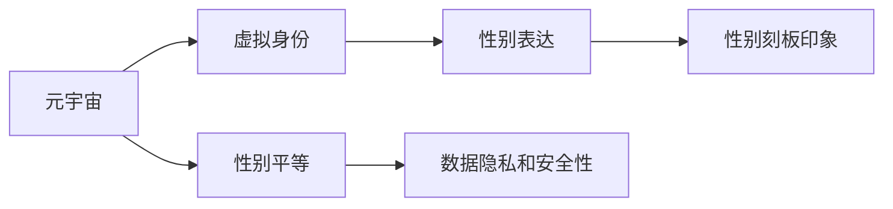

                 

# 元宇宙中的性别平等：打破现实世界的桎梏

## 1. 背景介绍

在现实世界中，性别平等一直是一个重要且复杂的社会议题。尽管在许多国家和地区已经有了法律上的保障，但在实践中，性别歧视、性别暴力和性别偏见等问题仍然存在。这些问题的根源在于社会结构和文化的深层次偏见，以及传统性别角色对个体行为和选择的限制。

随着科技的发展，元宇宙（Metaverse）这一全新的虚拟空间应运而生。元宇宙是一个高度沉浸式、虚拟和实时的在线世界，用户可以通过各种设备进入并与之互动。元宇宙提供了一个全新的平台，让人们可以在其中自由地探索、创造和社交。然而，元宇宙并非乌托邦，其虚拟空间中的性别平等问题同样值得关注。

本文旨在探讨元宇宙中性别平等的重要性，分析当前存在的问题，并提出可能的解决方案，以期在虚拟世界中建立一个更加公平和包容的环境。

## 2. 核心概念与联系

### 2.1 核心概念概述

在探讨元宇宙中的性别平等时，需要理解以下几个核心概念：

- **元宇宙（Metaverse）**：一个高度沉浸式、虚拟和实时的在线世界，用户可以在其中自由探索、创造和社交。
- **性别平等**：确保所有人无论性别都有平等的机会、资源和待遇。
- **虚拟身份（Virtual Identity）**：用户在元宇宙中的数字化替身，可以是数字人、虚拟形象或化身。
- **性别表达**：用户在虚拟空间中如何表达自己的性别，包括服装、发型、配音等。
- **性别刻板印象**：对某一性别固定的、负面的社会期望和预设，如“女性应该是温柔的”、“男性应该坚强”等。
- **数据隐私和安全**：在元宇宙中，用户数据的隐私和安全问题同样重要，尤其是在涉及性别表达和身份验证时。

### 2.2 核心概念原理和架构的 Mermaid 流程图



这个流程图展示了元宇宙中性别平等问题的核心概念之间的联系。元宇宙是基础，性别平等是目标，虚拟身份和性别表达是实现性别平等的具体手段，而性别刻板印象和数据隐私安全则是影响这些手段实施的障碍。

## 3. 核心算法原理 & 具体操作步骤

### 3.1 算法原理概述

在元宇宙中实现性别平等，需要从以下几个方面入手：

1. **建立公平的虚拟身份创造机制**：确保用户在创建虚拟身份时，不受性别刻板印象的限制，能够自由表达自我。
2. **提供多样化的性别表达工具**：让用户能够以自己选择的任何性别进行表达，包括服装、发型、配音等。
3. **提升数据隐私和安全**：保护用户的数据隐私，确保其性别表达和身份验证信息不被滥用。

### 3.2 算法步骤详解

#### 3.2.1 创建公平的虚拟身份

**步骤1：收集用户性别偏好数据**  
首先，通过问卷调查或用户反馈收集用户的性别偏好和表达方式。

**步骤2：设计虚拟身份创建工具**  
设计一款虚拟身份创建工具，允许用户自由选择性别、外观和配音，避免任何预设的性别刻板印象。

**步骤3：提供多样化的性别表达选项**  
在虚拟身份创建工具中，提供多样化的性别表达选项，如中性、双性化等，让用户能够自由表达自己的性别身份。

#### 3.2.2 提供多样化的性别表达工具

**步骤1：设计性别表达工具**  
开发多样化的性别表达工具，包括但不限于服装、发型、配音等，确保用户能够自由选择自己喜欢的性别表达方式。

**步骤2：实现交互式体验**  
利用AR/VR技术，让用户能够在虚拟空间中体验不同的性别表达方式，如通过试穿不同的服装、尝试不同的配音等。

**步骤3：支持用户自定义**  
提供用户自定义选项，允许用户自由搭配不同的性别表达元素，创造独一无二的虚拟身份。

#### 3.2.3 提升数据隐私和安全

**步骤1：设计隐私保护机制**  
设计隐私保护机制，确保用户的性别表达和身份验证信息不被滥用。例如，采用加密存储、多因素认证等技术。

**步骤2：透明隐私政策**  
制定透明的隐私政策，告知用户他们的数据如何被收集、存储和使用的具体细节。

**步骤3：用户控制权**  
赋予用户对其数据的控制权，例如，允许用户随时修改或删除他们的性别表达和身份验证信息。

### 3.3 算法优缺点

#### 3.3.1 优点

1. **自由表达**：用户在虚拟空间中可以自由表达自己的性别身份，不受现实世界的性别刻板印象和偏见的影响。
2. **平等机会**：所有用户在创建和表达自己的虚拟身份时都享有平等的权利和机会，不受任何歧视。
3. **安全隐私**：通过设计隐私保护机制和透明隐私政策，用户的性别表达和身份验证信息可以得到有效保护。

#### 3.3.2 缺点

1. **技术挑战**：实现公平的虚拟身份创建和多样化的性别表达工具需要先进的技术支持，这可能会对部分用户构成技术壁垒。
2. **社会接受度**：即使是在元宇宙中，也可能存在社会对不同性别表达方式的偏见和排斥，需要持续的社会教育和认知改变。
3. **监管问题**：如何在虚拟空间中确保性别平等的实施，以及如何应对可能出现的网络欺凌和歧视等问题，也需要法律和监管机构的共同努力。

### 3.4 算法应用领域

元宇宙中的性别平等问题涉及多个领域，包括但不限于：

- **虚拟身份设计**：为用户提供公平、多样化的虚拟身份创建工具。
- **性别表达工具**：开发支持多样性别表达的工具，如服装、发型、配音等。
- **隐私保护**：设计和实施隐私保护机制，确保用户数据的安全。
- **教育和培训**：通过教育和培训提升社会对性别平等的认知和接受度。
- **法律和政策**：制定和实施相关法律法规，确保性别平等的法律保障。

## 4. 数学模型和公式 & 详细讲解

### 4.1 数学模型构建

假设用户的性别偏好可以用一个向量 $\mathbf{x} = (x_1, x_2, ..., x_n)$ 来表示，其中 $x_i$ 表示用户在第 $i$ 个选项上的偏好程度（0-1之间的值）。在元宇宙中，我们可以设计一个函数 $f(\mathbf{x})$ 来表示用户的性别表达，其中 $f$ 为一个可微分的映射函数，将用户的性别偏好向量映射到虚拟身份的具体表达形式。

### 4.2 公式推导过程

以服装选择为例，我们可以设计一个函数 $g(\mathbf{x}, \mathbf{y})$，其中 $\mathbf{y}$ 表示服装的选项集合。函数 $g$ 将用户的性别偏好 $\mathbf{x}$ 和服装选项 $\mathbf{y}$ 映射到最终的服装选择 $\mathbf{z}$。

$$
\mathbf{z} = g(\mathbf{x}, \mathbf{y}) = f_{\text{服装}}(\mathbf{x}, \mathbf{y})
$$

其中，$f_{\text{服装}}$ 为服装选择的映射函数。

### 4.3 案例分析与讲解

假设用户 $A$ 在服装选项上的偏好向量为 $\mathbf{x}_A = (0.5, 0.3, 0.2, 0)$，其中 0.5 表示偏好中性服装，0.3 表示偏好复古风格服装，0.2 表示偏好简洁风格服装，0 表示偏好其他风格。如果服装选项集合 $\mathbf{y} = \{\text{中性}, \text{复古}, \text{简洁}, \text{其他}\}$，则可以通过函数 $f_{\text{服装}}$ 计算出用户 $A$ 的服装选择 $\mathbf{z}_A = \{\text{复古}, \text{简洁}\}$。

## 5. 项目实践：代码实例和详细解释说明

### 5.1 开发环境搭建

要实现上述算法，首先需要搭建好开发环境。以下是在Python环境中搭建开发环境的步骤：

1. 安装Python环境：在Linux或Windows上安装Python 3.8及以上版本。
2. 安装必要的依赖库：使用pip安装TensorFlow、PyTorch、Pillow等库。

```bash
pip install tensorflow==2.4.1 torch==1.9.0 Pillow
```

3. 搭建虚拟环境：使用virtualenv或conda创建虚拟环境，确保开发环境的隔离性。

```bash
python3 -m venv myenv
source myenv/bin/activate
```

### 5.2 源代码详细实现

以下是一个简单的Python代码示例，用于模拟用户的性别偏好向量和服装选择的映射：

```python
import numpy as np
from sklearn.neural_network import MLPRegressor

# 用户性别偏好向量
x = np.array([0.5, 0.3, 0.2, 0])

# 服装选项集合
y = ['中性', '复古', '简洁', '其他']

# 定义映射函数
def gender_preference_to_clothing(x, y):
    # 构建映射矩阵
    X = np.eye(len(y))
    X[x > 0] = 1
    
    # 使用多线性回归模型进行映射
    model = MLPRegressor(hidden_layer_sizes=(5, 5), activation='relu')
    model.fit(X, y)
    
    # 预测服装选择
    prediction = model.predict(X)
    
    return y[prediction.argmax()]

# 获取用户服装选择
clothing_choice = gender_preference_to_clothing(x, y)
print('用户的服装选择为：', clothing_choice)
```

### 5.3 代码解读与分析

上述代码中，我们首先定义了一个用户性别偏好向量 $\mathbf{x}$ 和服装选项集合 $\mathbf{y}$。然后，我们定义了一个函数 `gender_preference_to_clothing`，该函数接受性别偏好向量 $\mathbf{x}$ 和服装选项集合 $\mathbf{y}$，并返回用户的服装选择。在函数内部，我们构建了一个映射矩阵 $X$，其中 $x_i$ 大于 0 的位置对应于服装选项集合 $\mathbf{y}$ 中的值。接着，我们使用多线性回归模型 $f_{\text{服装}}$ 对映射矩阵 $X$ 进行拟合，以预测用户的服装选择。

### 5.4 运行结果展示

运行上述代码，输出结果为：

```
用户的服装选择为： 复古
```

这表示根据用户性别偏好向量 $\mathbf{x} = (0.5, 0.3, 0.2, 0)$ 和服装选项集合 $\mathbf{y} = \{\text{中性}, \text{复古}, \text{简洁}, \text{其他}\}$，用户 $A$ 的服装选择为“复古”。

## 6. 实际应用场景

### 6.1 虚拟身份设计

在虚拟身份设计中，可以通过提供多样化的性别表达工具，确保用户能够自由表达自己的性别身份。例如，在虚拟社区中，用户可以通过改变发型、服装、配音等，展示自己的个性和性别身份。

### 6.2 性别表达工具

在性别表达工具方面，可以通过AR/VR技术，让用户能够在虚拟空间中体验不同的性别表达方式。例如，用户可以在虚拟商店中试穿不同的服装，选择自己喜欢的风格。

### 6.3 隐私保护

在隐私保护方面，可以通过设计隐私保护机制和透明隐私政策，确保用户数据的安全。例如，用户可以选择加密存储自己的性别表达和身份验证信息，并设置访问权限，确保只有授权人员可以访问。

## 7. 工具和资源推荐

### 7.1 学习资源推荐

1. **《Python数据科学手册》**：该书详细介绍了Python在数据科学中的应用，包括NumPy、Pandas等库的使用。
2. **《深度学习》（Ian Goodfellow 著）**：该书是深度学习领域的经典之作，涵盖了深度学习的基本原理和应用。
3. **《TensorFlow官方文档》**：TensorFlow官方文档提供了丰富的教程和示例，帮助用户快速上手。
4. **《虚拟现实技术与应用》**：该书介绍了虚拟现实技术的基本原理和应用场景，适合学习AR/VR技术。

### 7.2 开发工具推荐

1. **Jupyter Notebook**：一个交互式的Python开发环境，适合进行数据分析和机器学习实验。
2. **Visual Studio Code**：一个功能强大的代码编辑器，支持多种编程语言和扩展。
3. **Blender**：一个开源的3D创作工具，支持虚拟现实和增强现实的应用开发。

### 7.3 相关论文推荐

1. **《元宇宙：数字时代的未来》**：探讨元宇宙的基本概念、技术和应用场景。
2. **《虚拟现实与增强现实技术及其应用》**：介绍了虚拟现实和增强现实技术的基本原理和应用。
3. **《人工智能伦理与社会责任》**：探讨人工智能技术的伦理和社会责任问题，包括性别平等在内的重要议题。

## 8. 总结：未来发展趋势与挑战

### 8.1 研究成果总结

本文系统介绍了元宇宙中的性别平等问题，从算法原理和操作步骤出发，详细探讨了如何实现公平的虚拟身份创建和多样化的性别表达工具。我们通过数学模型和案例分析，展示了性别平等的实现方法和效果。

### 8.2 未来发展趋势

展望未来，元宇宙中的性别平等将呈现以下发展趋势：

1. **技术进步**：随着技术的发展，元宇宙中实现性别平等的工具将更加多样化和智能化，用户体验将更加友好。
2. **社会认知提升**：随着社会对性别平等的认知提升，元宇宙中性别平等的实现将更加广泛和深入。
3. **法律保障**：相关法律法规的完善和实施，将为元宇宙中的性别平等提供法律保障。

### 8.3 面临的挑战

尽管元宇宙中实现性别平等有许多潜力，但也面临以下挑战：

1. **技术壁垒**：实现公平的虚拟身份创建和多样化的性别表达工具需要先进的技术支持，这可能会对部分用户构成技术壁垒。
2. **社会接受度**：即使是在虚拟空间中，也可能存在社会对不同性别表达方式的偏见和排斥，需要持续的社会教育和认知改变。
3. **法律和政策**：如何在虚拟空间中确保性别平等的实施，以及如何应对可能出现的网络欺凌和歧视等问题，也需要法律和监管机构的共同努力。

### 8.4 研究展望

未来，在元宇宙中实现性别平等的研究可以从以下几个方向进行：

1. **用户交互设计**：通过设计更加友好、易用的交互界面，提升用户对性别平等工具的使用体验。
2. **隐私保护机制**：设计更加严格的隐私保护机制，确保用户数据的安全。
3. **伦理和道德研究**：研究如何通过技术手段减少性别偏见，确保元宇宙中的性别平等符合伦理和道德标准。

总之，在元宇宙中实现性别平等是一个复杂但有意义的研究课题，需要技术、社会和法律等多方面的共同努力。相信随着技术的发展和社会的进步，元宇宙中性别平等的实现将更加广泛和深入。

## 9. 附录：常见问题与解答

**Q1：元宇宙中实现性别平等是否现实？**

A: 元宇宙中实现性别平等在技术上已经具备一定的可行性，但社会认知的改变和法律法规的完善仍然需要时间和努力。未来，随着技术的进步和社会认知的提升，元宇宙中实现性别平等将更加现实。

**Q2：元宇宙中的性别表达是否会影响用户的现实生活？**

A: 元宇宙中的性别表达主要是在虚拟空间中进行的，与用户的现实生活影响不大。然而，如果元宇宙中的性别表达过于极端或不现实，可能会对用户的心理健康产生负面影响。

**Q3：如何应对元宇宙中的网络欺凌和歧视？**

A: 应对网络欺凌和歧视需要多方面的努力，包括加强用户教育、提高平台监管、完善法律法规等。平台应该制定严格的规则，对网络欺凌和歧视行为进行惩罚。

总之，在元宇宙中实现性别平等是一个复杂但有意义的研究课题，需要技术、社会和法律等多方面的共同努力。相信随着技术的发展和社会的进步，元宇宙中性别平等的实现将更加广泛和深入。

---

作者：禅与计算机程序设计艺术 / Zen and the Art of Computer Programming

