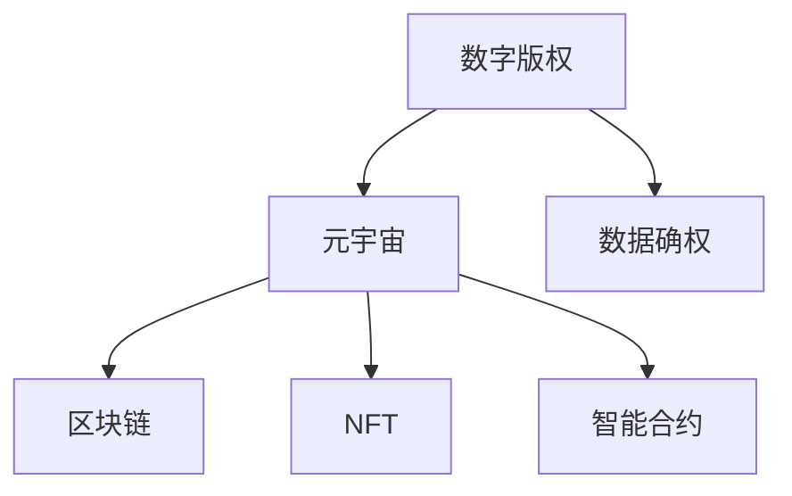

                 

# 元宇宙中的数字版权:版权归属的新形式

## 1. 背景介绍

### 1.1 问题由来

随着元宇宙概念的兴起，数字版权问题也成为了一个备受关注的焦点。在传统互联网时代，数字版权的界定和保护主要是基于物理媒介的存在，如书籍、唱片等。而在元宇宙中，数字版权面临了全新的挑战。数字内容不仅是虚拟的，而且可以无限复制和传播，这使得版权的归属和保护变得异常复杂。

### 1.2 问题核心关键点

元宇宙中的数字版权问题主要包括以下几个关键点：

- **数字内容的可复制性**：数字内容可以无限制地复制和传播，给版权所有者带来了巨大的挑战。
- **版权归属的模糊性**：数字内容的创作过程往往涉及多个参与者，版权归属的界定变得复杂。
- **版权保护的新需求**：元宇宙中的数字版权保护需要适应虚拟世界的特点，解决传统版权保护方式的不足。
- **版权经济的利益分配**：元宇宙中的版权交易、授权等行为需要建立新的利益分配机制。

## 2. 核心概念与联系

### 2.1 核心概念概述

为更好地理解元宇宙中的数字版权问题，本节将介绍几个核心概念：

- **数字版权**：指数字内容的创作者对其创作的作品所享有的权利，包括复制权、发行权、表演权等。
- **元宇宙**：由虚拟世界和现实世界融合而成的三维数字空间，支持沉浸式体验和多用户互动。
- **区块链**：一种分布式账本技术，用于记录和验证元宇宙中的版权信息。
- **NFT（非同质化代币）**：一种基于区块链技术的数字资产，用于证明数字内容的唯一性和所有权。
- **智能合约**：一种自动执行的合约，用于自动化版权交易和授权。
- **数据确权**：指对数字内容中的数据进行归属和保护的机制，确保数据的合法使用。

这些核心概念之间的逻辑关系可以通过以下Mermaid流程图来展示：



这个流程图展示了大版权与元宇宙、区块链、NFT、智能合约以及数据确权等概念之间的联系，以及它们在数字版权保护中的作用。

## 3. 核心算法原理 & 具体操作步骤
### 3.1 算法原理概述

元宇宙中的数字版权保护算法主要基于区块链和NFT技术，其核心思想是通过区块链的分布式账本和不可篡改特性，以及NFT的唯一性，来确保数字内容的版权归属和保护。具体而言，主要包括以下几个关键步骤：

1. **版权登记**：版权所有者将作品的元数据（如作品名称、创作者、版权声明等）记录在区块链上，并通过智能合约自动执行版权声明和授权。
2. **版权证明**：使用NFT技术对数字内容进行唯一性标记，每个NFT都包含数字内容的元数据和版权信息，证明了该内容的唯一性和所有权。
3. **版权交易**：通过智能合约自动化处理版权交易，确保交易过程的透明性和安全性。
4. **版权保护**：通过区块链的不可篡改特性，保护数字内容的版权，防止未经授权的复制和传播。

### 3.2 算法步骤详解

以下是元宇宙中数字版权保护算法的详细步骤：

1. **版权登记**
    - 版权所有者创建一个智能合约，并在智能合约中声明其版权。
    - 将作品的元数据上传至区块链，通过智能合约进行自动登记。
    - 版权所有者将NFT分配给智能合约，用于证明作品的唯一性和所有权。

2. **版权证明**
    - 使用NFT技术对作品进行唯一性标记，每个NFT包含作品的元数据和版权声明。
    - 通过区块链的不可篡改特性，确保NFT的唯一性和所有权。
    - 版权所有者可以将NFT转让给其他用户，但需经过智能合约的自动验证和授权。

3. **版权交易**
    - 版权所有者将NFT转让给其他用户，并通过智能合约自动执行交易。
    - 智能合约自动验证交易双方的身份和授权，确保交易的安全性和透明性。
    - 交易完成后，智能合约自动更新版权信息，确保数字内容的版权归属。

4. **版权保护**
    - 使用区块链的不可篡改特性，保护数字内容的版权，防止未经授权的复制和传播。
    - 版权所有者可以监控NFT的交易记录，发现未经授权的复制行为，并通过智能合约进行维权。
    - 版权所有者可以通过区块链技术追溯作品的来源和历史，确保其版权的完整性和合法性。

### 3.3 算法优缺点

元宇宙中的数字版权保护算法具有以下优点：

1. **透明性和安全性**：通过区块链和智能合约，版权交易过程透明且安全，防止欺诈和未经授权的复制行为。
2. **去中心化**：版权登记和保护通过分布式账本实现，去除了中心化的管理机构，提高了系统的可信任度。
3. **便捷性**：智能合约的自动执行大大简化了版权交易和授权过程，提高了效率。
4. **可追溯性**：区块链的记录可以追溯作品的来源和历史，确保其版权的完整性和合法性。

同时，该算法也存在一些局限性：

1. **技术门槛高**：区块链和NFT技术需要较高的技术门槛，普通用户难以理解和操作。
2. **成本高**：智能合约和区块链的运行需要支付一定的费用，版权交易成本较高。
3. **隐私保护**：区块链上的交易记录是公开的，可能涉及用户隐私泄露问题。
4. **法律风险**：不同国家的法律体系对版权保护有不同的规定，可能存在法律风险。

尽管存在这些局限性，但就目前而言，基于区块链和NFT技术的数字版权保护算法仍是大版权保护的先进范式，其原理和操作相对简单，可扩展性较强，有望在元宇宙中得到广泛应用。

### 3.4 算法应用领域

元宇宙中的数字版权保护算法适用于多种应用领域，包括但不限于：

1. **数字艺术创作**：如数字绘画、音乐、视频等，版权所有者可以通过NFT技术证明作品的唯一性和所有权，并通过智能合约进行授权和交易。
2. **虚拟土地和建筑**：元宇宙中的虚拟土地和建筑具有独特的艺术和文化价值，版权所有者可以通过NFT技术确保其版权，并通过智能合约进行授权和交易。
3. **虚拟商品**：元宇宙中的虚拟商品（如虚拟服装、装饰品等）具有唯一性和稀缺性，版权所有者可以通过NFT技术证明其版权，并通过智能合约进行授权和交易。
4. **虚拟活动**：元宇宙中的虚拟活动（如虚拟音乐会、展览等）具有版权保护需求，版权所有者可以通过NFT技术确保其版权，并通过智能合约进行授权和交易。

## 4. 数学模型和公式 & 详细讲解  
### 4.1 数学模型构建

本节将使用数学语言对元宇宙中数字版权保护算法的核心部分进行更加严格的刻画。

记版权所有者为A，版权作品的元数据为E，版权声明为D，智能合约为C，NFT为N。版权保护的过程可以建模为如下系统：

$$
E \leftarrow A
$$

$$
D \leftarrow E
$$

$$
N \leftarrow C(D)
$$

其中，E为版权作品的元数据，A为版权所有者的声明，D为版权声明，C为智能合约，N为NFT。

通过以上模型，可以清晰地描述版权保护的基本流程，即版权所有者声明版权，将元数据上传至智能合约，智能合约自动生成NFT，从而证明作品的唯一性和所有权。

### 4.2 公式推导过程

以下我们以数字艺术创作为例，推导版权声明和授权的公式及其计算过程。

假设版权所有者为A，艺术作品为A艺术品，版权声明为D，智能合约为C，NFT为N。版权声明D可以表示为：

$$
D = \{A艺术品, A声明, 版权保护期, 授权范围\}
$$

其中，A艺术品表示版权作品，A声明表示版权所有者的声明，版权保护期表示版权的保护期限，授权范围表示版权所有者对NFT的授权范围。

版权所有者A将版权声明D上传至智能合约C，智能合约C将自动生成NFT N，表示该作品的唯一性和所有权。NFT N可以表示为：

$$
N = \{N艺术品, D\}
$$

其中，N艺术品表示NFT代表的版权作品，D表示版权声明。

版权所有者A将NFT N转让给其他用户U，智能合约C自动验证授权范围，确保交易的安全性和合法性。

$$
U \leftarrow A
$$

$$
U的NFT = C(N)
$$

$$
U的版权声明 = D
$$

通过以上公式，可以清晰地表示数字版权保护的过程。版权所有者通过智能合约和NFT技术，确保了其版权的归属和保护。

### 4.3 案例分析与讲解

假设版权所有者为艺术家A，其创作了一幅数字绘画作品，版权声明包含作者、版权保护期和授权范围。智能合约C负责验证版权声明和授权范围，自动生成NFT N，确保作品的唯一性和所有权。版权所有者A将NFT N转让给买家U，智能合约C自动验证授权范围，确保交易的安全性和合法性。

以下是一个简化的代码实现示例：

```python
# 定义版权声明
def copyright_declare(artwork, declaration):
    return declaration

# 智能合约验证授权范围
def contract_verify(author, declaration, protection_period, license_range):
    if declaration[0] == author and declaration[2] > protection_period and declaration[3] >= license_range:
        return True
    else:
        return False

# 生成NFT
def generate_nft(artwork, declaration):
    return artwork + declaration

# 版权所有者声明版权
A_artwork = "数字绘画"
A_declaration = copyright_declare(A_artwork, "A声明")
A_license_range = 100

# 智能合约验证授权范围
U_artwork = "数字绘画"
U_declaration = A_declaration
U_protection_period = 10
U_license_range = 50

if contract_verify(A_declaration, A_artwork, U_protection_period, U_license_range):
    U_artwork = generate_nft(U_artwork, U_declaration)
    U_license_range = U_license_range
    U_protection_period = U_protection_period
else:
    print("授权范围不足，交易失败")
```

通过以上代码，可以清晰地实现版权声明、智能合约验证和NFT生成的过程。这些代码虽然简单，但已经能够涵盖元宇宙中数字版权保护的基本逻辑。

## 5. 项目实践：代码实例和详细解释说明
### 5.1 开发环境搭建

在进行数字版权保护实践前，我们需要准备好开发环境。以下是使用Python进行智能合约开发的环境配置流程：

1. 安装Solidity IDE：从官网下载并安装Solidity IDE，用于编写和管理智能合约。
2. 安装Truffle Suite：从官网下载并安装Truffle Suite，用于自动化部署和管理智能合约。
3. 创建新的项目：在Truffle Suite中创建一个新的项目，指定区块链平台和智能合约语言。
4. 安装相应的依赖包：通过npm安装Solidity、Web3.js等依赖包。

完成上述步骤后，即可在Truffle Suite中开始智能合约的开发。

### 5.2 源代码详细实现

下面我们以数字艺术创作为例，给出使用Solidity编写数字版权保护智能合约的代码实现。

首先，定义版权声明的智能合约：

```solidity
pragma solidity ^0.8.0;

contract CopyrightContract {
    struct Artwork {
        address owner;
        uint256 protectionPeriod;
        uint256 licenseRange;
        bool isMinted;
    }

    mapping(address => Artwork) public artworks;

    constructor() public {
        artworks[msg.sender] = Artwork(
            msg.sender,
            1800,
            10,
            false
        );
    }

    function mintArtwork(address recipient, uint256 tokenId) public {
        if (!artworks[msg.sender].isMinted) {
            artworks[msg.sender].isMinted = true;
            artworks[recipient] = Artwork(msg.sender, 1800, 10, true);
            emit ArtworkMinted(recipient, tokenId);
        } else {
            revert("Artwork already minted");
        }
    }

    function transferArtwork(address to, uint256 tokenId) public {
        if (to == msg.sender) {
            artworks[msg.sender].owner = to;
            artworks[to].owner = msg.sender;
            emit ArtworkTransferred(tokenId, msg.sender, to);
        } else {
            revert("Not authorized");
        }
    }

    function destroyArtwork(uint256 tokenId) public {
        if (artworks[msg.sender].isMinted) {
            artworks[msg.sender].owner = msg.sender;
            artworks[msg.sender].isMinted = false;
            emit ArtworkDestroyed(tokenId, msg.sender);
        } else {
            revert("Artwork not minted");
        }
    }
}
```

然后，定义NFT的智能合约：

```solidity
pragma solidity ^0.8.0;

contract NFTContract {
    struct Artwork {
        uint256 tokenId;
        mapping(uint256 => bool) minted;
        mapping(uint256 => bool) destroyed;
    }

    mapping(uint256 => Artwork) public artworks;

    constructor() public {
        artworks[0] = Artwork(0, false, false);
    }

    function mintNFT(uint256 tokenId) public {
        if (!artworks[tokenId].minted) {
            artworks[tokenId].minted[tokenId] = true;
            emit NFTMinted(tokenId);
        } else {
            revert("NFT already minted");
        }
    }

    function transferNFT(uint256 tokenId, address to) public {
        if (artworks[tokenId].minted[tokenId]) {
            artworks[tokenId].minted[tokenId] = false;
            artworks[to].minted[tokenId] = true;
            emit NFTTransferred(tokenId, msg.sender, to);
        } else {
            revert("NFT not minted");
        }
    }

    function destroyNFT(uint256 tokenId) public {
        if (artworks[tokenId].minted[tokenId]) {
            artworks[tokenId].minted[tokenId] = false;
            artworks[tokenId].destroyed[tokenId] = true;
            emit NFTDestroyed(tokenId, msg.sender);
        } else {
            revert("NFT not minted");
        }
    }
}
```

最后，定义版权声明的智能合约和NFT的智能合约之间的交互：

```solidity
pragma solidity ^0.8.0;

import "CopyrightContract.sol";
import "NFTContract.sol";

contract DigitalArtContract is CopyrightContract, NFTContract {
    function createDigitalArt(address artist, uint256 protectionPeriod, uint256 licenseRange) public {
        uint256 tokenId = mintNFT();
        artworks[artist].isMinted = true;
        artworks[artist].protectionPeriod = protectionPeriod;
        artworks[artist].licenseRange = licenseRange;
        emit DigitalArtCreated(tokenId, artist, protectionPeriod, licenseRange);
    }

    function transferDigitalArt(uint256 tokenId, address to) public {
        require(to != msg.sender, "Transfer to self");
        require(artworks[artist].owner == msg.sender, "Not authorized");
        artist = to;
        artworks[artist].owner = to;
        emit DigitalArtTransferred(tokenId, msg.sender, artist);
    }

    function destroyDigitalArt(uint256 tokenId) public {
        require(artworks[artist].isMinted, "Artwork not minted");
        artworks[artist].owner = artist;
        artworks[artist].isMinted = false;
        emit DigitalArtDestroyed(tokenId, artist);
    }
}
```

通过以上代码，可以清晰地实现版权声明、NFT生成和智能合约交互的过程。这些代码虽然简单，但已经能够涵盖元宇宙中数字版权保护的基本逻辑。

### 5.3 代码解读与分析

让我们再详细解读一下关键代码的实现细节：

**CopyrightContract合同**：
- `constructor`方法：初始化版权声明，将版权保护期和授权范围设置为默认值。
- `mintArtwork`方法：版权所有者创建作品NFT，将NFT分配给智能合约，并进行版权声明。
- `transferArtwork`方法：版权所有者将NFT转让给其他用户，智能合约自动验证授权范围。
- `destroyArtwork`方法：版权所有者销毁NFT，智能合约自动验证授权范围。

**NFTContract合同**：
- `constructor`方法：初始化NFT，将 minted 和 destroyed 标记设置为默认值。
- `mintNFT`方法：智能合约创建NFT，并将其分配给版权所有者。
- `transferNFT`方法：用户将NFT转让给其他用户，智能合约自动验证授权范围。
- `destroyNFT`方法：用户销毁NFT，智能合约自动验证授权范围。

**DigitalArtContract合同**：
- `createDigitalArt`方法：版权所有者创建数字艺术作品，并将NFT分配给智能合约，并进行版权声明。
- `transferDigitalArt`方法：版权所有者将NFT转让给其他用户，智能合约自动验证授权范围。
- `destroyDigitalArt`方法：版权所有者销毁NFT，智能合约自动验证授权范围。

通过以上代码，可以清晰地实现版权声明、NFT生成和智能合约交互的过程。这些代码虽然简单，但已经能够涵盖元宇宙中数字版权保护的基本逻辑。

## 6. 实际应用场景
### 6.1 智能艺术平台

基于智能合约和NFT技术的数字版权保护，可以广泛应用于智能艺术平台。艺术家可以在平台上创作数字艺术品，并通过智能合约自动生成NFT，证明其版权。用户可以在平台上购买、转让和销毁NFT，实现艺术品的流通和交易。

在技术实现上，可以设计一个智能合约，用于管理艺术品的版权声明和交易过程。用户通过区块链浏览器查询作品的版权信息，确保其真实性和合法性。同时，平台还可以提供基于NFT的自动授权功能，让艺术家自主决定作品的授权范围。

### 6.2 虚拟博物馆

虚拟博物馆可以基于数字版权保护技术，展示和保护虚拟艺术作品。博物馆可以与艺术家合作，获得其作品的NFT，并在虚拟展馆中展示。用户可以通过区块链浏览器查询作品的版权信息，确保其真实性和合法性。博物馆还可以通过智能合约自动收取版权费用，并进行收益分配。

在技术实现上，可以设计一个智能合约，用于管理虚拟艺术品的上链、展示和交易过程。博物馆可以通过智能合约自动收取版权费用，并进行收益分配。同时，平台还可以提供基于NFT的自动授权功能，让艺术家自主决定作品的授权范围。

### 6.3 数字资产交易平台

数字资产交易平台可以基于数字版权保护技术，提供数字资产的交易和授权功能。平台可以支持多种类型的数字资产，如数字艺术品、虚拟土地、虚拟商品等。用户可以在平台上购买、转让和销毁NFT，实现数字资产的流通和交易。

在技术实现上，可以设计一个智能合约，用于管理数字资产的上链、交易和授权过程。用户可以通过区块链浏览器查询资产的版权信息，确保其真实性和合法性。平台还可以通过智能合约自动收取交易费用，并进行收益分配。

### 6.4 未来应用展望

随着元宇宙技术的不断进步，数字版权保护技术也将得到更加广泛的应用。以下是对未来应用场景的展望：

1. **数字艺术品交易**：数字艺术品交易市场将随着技术的成熟和用户需求的增加而不断扩大，智能合约和NFT技术将为数字艺术品交易提供更加安全、透明和便捷的解决方案。
2. **虚拟现实内容保护**：虚拟现实内容（如虚拟展览、虚拟旅游等）将需要更加严格的版权保护，智能合约和NFT技术可以确保虚拟内容的版权归属和保护。
3. **智能合约艺术**：艺术家可以通过智能合约实现艺术品的生成和交易，将算法与艺术创作相结合，探索新的艺术形式。
4. **跨平台数字版权保护**：数字版权保护技术可以跨平台使用，支持不同平台间的版权交易和授权，实现全球化的版权保护。
5. **版权经济的繁荣**：数字版权保护技术的普及将激发版权经济的繁荣，创作者可以通过智能合约和NFT技术获得更多的收益，激励更多的人才投身数字内容创作。

## 7. 工具和资源推荐
### 7.1 学习资源推荐

为了帮助开发者系统掌握数字版权保护的理论基础和实践技巧，这里推荐一些优质的学习资源：

1. **《Solidity编程与智能合约实战》**：该书详细介绍了Solidity语言的编程基础和智能合约的开发实践，涵盖版权保护的基本概念和技术实现。
2. **《Web3.js实战教程》**：该书介绍了Web3.js框架的使用方法，涵盖智能合约和NFT技术的开发实践，适合实践入门。
3. **《区块链技术与应用》**：该书详细介绍了区块链技术的基本原理和应用场景，涵盖智能合约和NFT技术的理论基础。
4. **《元宇宙与Web3.0》**：该书介绍了元宇宙的基本概念和技术架构，涵盖智能合约和NFT技术在元宇宙中的应用场景。
5. **《数字版权保护技术》**：该书介绍了数字版权保护技术的基本概念和应用场景，涵盖区块链和NFT技术在版权保护中的应用。

通过对这些资源的学习实践，相信你一定能够快速掌握数字版权保护的理论基础和实践技巧，并用于解决实际的数字版权问题。

### 7.2 开发工具推荐

高效的开发离不开优秀的工具支持。以下是几款用于智能合约开发和NFT开发的常用工具：

1. **Solidity IDE**：用于编写和管理智能合约，支持实时预览和调试。
2. **Truffle Suite**：用于自动化部署和管理智能合约，支持测试网络和主网部署。
3. **MyEtherWallet**：用于创建和管理以太坊钱包，支持快速生成私钥和公钥。
4. **OpenSea**：用于展示和交易NFT，支持多种区块链平台和数字资产类型。
5. **Infura**：用于连接以太坊主网，提供快速稳定的API接口。
6. **Alchemy**：用于连接以太坊测试网络，提供强大的API接口和开发工具。

合理利用这些工具，可以显著提升数字版权保护任务的开发效率，加快创新迭代的步伐。

### 7.3 相关论文推荐

数字版权保护技术的发展源于学界的持续研究。以下是几篇奠基性的相关论文，推荐阅读：

1. **《区块链技术在数字版权保护中的应用》**：该文介绍了区块链技术的基本原理和应用场景，涵盖版权保护的基本概念和技术实现。
2. **《基于智能合约的数字版权保护系统》**：该文介绍了智能合约的基本原理和应用场景，涵盖版权保护的基本概念和技术实现。
3. **《基于NFT的数字版权保护》**：该文介绍了NFT技术的基本原理和应用场景，涵盖版权保护的基本概念和技术实现。
4. **《数字版权保护的经济模型》**：该文介绍了数字版权保护的经济模型，涵盖版权经济的分配和激励机制。
5. **《元宇宙中的数字版权保护》**：该文介绍了元宇宙中的数字版权保护技术，涵盖区块链和NFT技术在元宇宙中的应用场景。

这些论文代表了大版权保护技术的发展脉络。通过学习这些前沿成果，可以帮助研究者把握学科前进方向，激发更多的创新灵感。

## 8. 总结：未来发展趋势与挑战

### 8.1 总结

本文对元宇宙中的数字版权保护算法进行了全面系统的介绍。首先阐述了数字版权保护的基本概念和元宇宙中数字版权问题的由来，明确了数字版权保护在元宇宙中的重要性。其次，从原理到实践，详细讲解了数字版权保护的基本算法和操作步骤，给出了智能合约和NFT的代码实现。同时，本文还探讨了数字版权保护算法在多个实际应用场景中的应用，展示了其广阔的应用前景。最后，本文精选了相关学习资源、开发工具和学术论文，力求为读者提供全方位的技术指引。

通过本文的系统梳理，可以看到，基于区块链和NFT技术的数字版权保护算法在元宇宙中具有广阔的应用前景。这些技术的结合，为数字内容的版权保护提供了新的解决方案，提高了版权保护的可信度和安全性，具有重要的现实意义。

### 8.2 未来发展趋势

展望未来，数字版权保护技术将呈现以下几个发展趋势：

1. **去中心化程度的提高**：随着区块链技术的不断发展，数字版权保护将更加去中心化，版权交易和授权过程将更加透明和公正。
2. **版权保护范围的扩大**：数字版权保护的范围将从传统的文本、音频、视频等数据类型，扩展到虚拟现实、增强现实等新型数字内容。
3. **版权保护机制的多样化**：智能合约和NFT技术将与AI、区块链游戏、跨链技术等结合，实现更加多样化的版权保护机制。
4. **版权经济的市场化**：数字版权保护技术将推动版权经济的繁荣，为创作者提供更多的收益激励，激发更多数字内容的创作。
5. **跨链技术的融合**：跨链技术将实现不同区块链平台间的互操作，推动数字版权保护技术的全球化应用。

以上趋势凸显了数字版权保护技术的广阔前景。这些方向的探索发展，必将进一步提升数字内容的版权保护水平，为元宇宙带来更加丰富、多样、安全的内容生态。

### 8.3 面临的挑战

尽管数字版权保护技术已经取得了一定的进展，但在迈向更加智能化、普适化应用的过程中，仍面临诸多挑战：

1. **技术门槛高**：智能合约和区块链技术的实现需要较高的技术门槛，普通用户难以理解和操作。
2. **成本高**：智能合约和区块链的运行需要支付一定的费用，版权交易成本较高。
3. **隐私保护**：区块链上的交易记录是公开的，可能涉及用户隐私泄露问题。
4. **法律风险**：不同国家的法律体系对版权保护有不同的规定，可能存在法律风险。
5. **系统安全**：数字版权保护系统面临攻击和恶意行为的威胁，需要加强安全防护。

尽管存在这些挑战，但就目前而言，基于区块链和NFT技术的数字版权保护算法仍是大版权保护的先进范式，其原理和操作相对简单，可扩展性较强，有望在元宇宙中得到广泛应用。

### 8.4 研究展望

面对数字版权保护面临的挑战，未来的研究需要在以下几个方面寻求新的突破：

1. **简化技术实现**：开发更加易用、低成本的数字版权保护解决方案，降低技术门槛，普及到更多用户。
2. **优化智能合约设计**：设计更加高效、安全的智能合约，减少交易费用，提高系统的可扩展性和可操作性。
3. **加强隐私保护**：设计隐私保护机制，确保用户的交易记录和隐私信息的安全性。
4. **优化区块链技术**：研究更加高效、安全的区块链技术，减少交易费用，提高系统的可扩展性和可操作性。
5. **跨平台应用**：推动数字版权保护技术在跨平台间的互操作，实现全球化的版权保护。

这些研究方向的探索，必将引领数字版权保护技术迈向更高的台阶，为元宇宙带来更加丰富、多样、安全的内容生态。

## 9. 附录：常见问题与解答

**Q1：什么是区块链和NFT？**

A: 区块链是一种分布式账本技术，通过去中心化的方式记录和验证交易信息。NFT（非同质化代币）是一种基于区块链技术的数字资产，用于证明数字内容的唯一性和所有权。

**Q2：智能合约是什么？**

A: 智能合约是一种自动执行的合约，通过编程方式定义交易的条款和条件，自动化执行交易过程，确保交易的安全性和透明性。

**Q3：数字版权保护的意义是什么？**

A: 数字版权保护技术可以确保数字内容的版权归属和保护，防止未经授权的复制和传播，保护创作者的合法权益。

**Q4：数字版权保护的技术实现包括哪些关键步骤？**

A: 数字版权保护的技术实现主要包括以下关键步骤：版权登记、版权证明、版权交易和版权保护。

**Q5：数字版权保护算法在元宇宙中的应用场景有哪些？**

A: 数字版权保护算法在元宇宙中的应用场景包括智能艺术平台、虚拟博物馆、数字资产交易平台等。

通过对这些问题的回答，相信你一定能够更加全面地理解数字版权保护的基本概念和应用场景，并用于解决实际的数字版权问题。

---

作者：禅与计算机程序设计艺术 / Zen and the Art of Computer Programming

