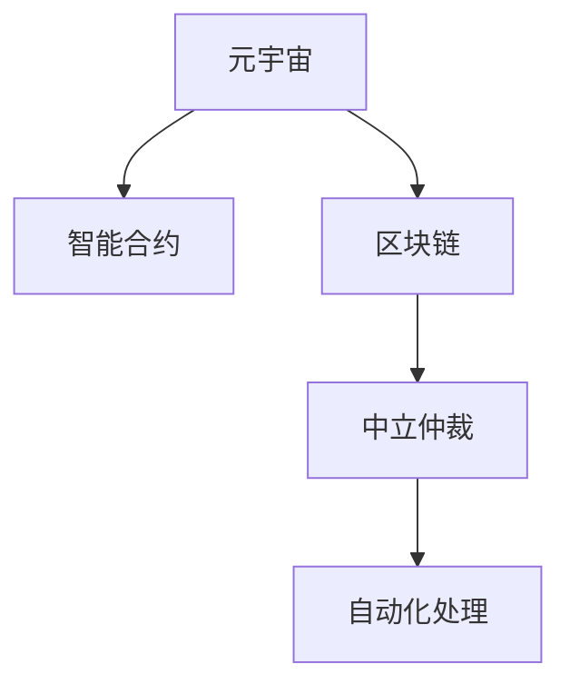

                 

# 元宇宙仲裁法庭:跨国虚拟纠纷的中立解决方案

在当前虚拟与现实交融的时代，元宇宙（Metaverse）作为数字化世界的下一代迭代，承载了无限可能。然而，虚拟世界的高度自治特性同样带来了新的挑战——纠纷解决机制的缺乏。在这样的背景下，元宇宙仲裁法庭应运而生，旨在为跨国虚拟纠纷提供中立、高效的解决方案，促进元宇宙的健康发展。本文将深入探讨元宇宙仲裁法庭的核心概念、工作原理、技术实现以及未来展望，为实现元宇宙的公平正义提供有力支撑。

## 1. 背景介绍

### 1.1 问题由来

随着虚拟世界的兴起，越来越多的虚拟资产、虚拟身份和虚拟交易在元宇宙中诞生。这些活动极大地丰富了用户的虚拟体验，但也带来了新的问题——虚拟纠纷。

在传统物理世界，司法机构为纠纷解决提供了权威性和公正性的保障。但在元宇宙中，由于虚拟活动的去中心化特性，传统的司法机制难以直接适用。如何构建一个公正、高效、自动化的纠纷解决机制，成为元宇宙健康发展的关键问题。

### 1.2 问题核心关键点

元宇宙仲裁法庭的核心理念是通过智能合约和自动化系统，实现对元宇宙中虚拟纠纷的公正处理。具体来说，元宇宙仲裁法庭的核心关键点包括：

- **中立性**：确保判决过程公正客观，不受任何一方的利益影响。
- **效率性**：通过智能合约自动执行判决，快速解决纠纷。
- **可扩展性**：支持大规模的跨国纠纷处理，满足元宇宙的广泛需求。
- **可操作性**：用户无需繁琐的法律程序，即可高效利用仲裁服务。

这些核心关键点共同构成了元宇宙仲裁法庭的基础框架，使其能够在虚拟世界中高效、公正地处理纠纷。

## 2. 核心概念与联系

### 2.1 核心概念概述

为更好地理解元宇宙仲裁法庭的运作原理，本节将介绍几个关键概念：

- **元宇宙（Metaverse）**：一个高度自治、去中心化的虚拟空间，用户在其中进行各种虚拟活动。
- **智能合约（Smart Contract）**：一种自动执行的合约，一旦达成一致条件，智能合约将自动执行。
- **区块链（Blockchain）**：一种分布式账本技术，保证数据的透明性和不可篡改性。
- **中立仲裁（Neutral Arbitration）**：指在无偏向的前提下，对争议双方进行公正裁决。
- **自动化处理（Automated Processing）**：通过算法和系统自动化地执行判决，减少人为干预。

这些概念之间的联系可以通过以下Mermaid流程图来展示：



这个流程图展示了几大核心概念之间的逻辑关系：

1. 元宇宙作为平台，通过智能合约和区块链技术，为仲裁法庭提供运作的基础。
2. 智能合约提供自动化的执行机制，确保决策的快速和透明。
3. 区块链确保数据的不可篡改性和透明性，为仲裁过程提供信任基础。
4. 中立仲裁保证了决策的公正性，不偏袒任何一方。
5. 自动化处理提升了纠纷解决的效率和便利性。

这些概念共同构成了元宇宙仲裁法庭的基本框架，使其能够在虚拟世界中有效运作。

## 3. 核心算法原理 & 具体操作步骤

### 3.1 算法原理概述

元宇宙仲裁法庭的核心算法原理是通过智能合约和区块链技术，实现对虚拟纠纷的自动化处理。其基本流程如下：

1. **事件触发**：当虚拟交易或纠纷发生时，智能合约被触发。
2. **数据收集**：智能合约自动收集纠纷相关数据，如交易记录、双方声明等。
3. **争议解决**：仲裁法庭通过算法和逻辑，对纠纷进行分析和判断。
4. **判决执行**：一旦判决确定，智能合约将自动执行，执行结果记录在区块链上，确保透明度和不可篡改性。

### 3.2 算法步骤详解

以下是元宇宙仲裁法庭的详细操作步骤：

**Step 1: 智能合约部署**

- **合约编写**：根据元宇宙的特性，编写智能合约代码，定义纠纷处理的逻辑和判决执行机制。
- **合约验证**：将智能合约提交至区块链网络，经过验证和审核，确保其合规性和安全性。

**Step 2: 数据收集与存储**

- **数据接入**：智能合约接入元宇宙中的各类数据源，如交易记录、用户声明等。
- **数据验证**：对收集的数据进行验证和清洗，确保数据的准确性和完整性。

**Step 3: 争议解决**

- **算法应用**：通过预先定义的算法，对纠纷进行分析和判断。算法需考虑多方证据和证词，确保决策的公正性。
- **判决生成**：根据算法结果，生成判决文本，包含判决理由和执行方案。

**Step 4: 判决执行**

- **合约执行**：判决文本被自动编码为智能合约指令，执行相应的操作，如资金转移、物品归还等。
- **区块链记录**：执行结果被记录在区块链上，确保透明性和不可篡改性。

**Step 5: 后续处理**

- **反馈机制**：用户对判决结果有异议时，可以提出上诉，经过仲裁法庭重新审理。
- **动态调整**：根据判决执行效果和用户反馈，对智能合约和算法进行动态调整，优化处理流程。

### 3.3 算法优缺点

元宇宙仲裁法庭的算法具有以下优点：

- **中立性**：通过算法和规则，确保判决过程不受人为干预，公正客观。
- **效率性**：自动化的执行机制，极大地提高了纠纷解决的效率。
- **透明性**：判决过程和执行结果记录在区块链上，具有高度的透明性。
- **可扩展性**：支持大规模的跨国纠纷处理，满足元宇宙的广泛需求。

同时，该算法也存在一些局限性：

- **灵活性不足**：算法需要预先定义，可能无法应对所有复杂的虚拟纠纷。
- **复杂性较高**：算法开发和验证复杂，需要跨学科知识。
- **执行依赖网络**：依赖区块链网络的稳定性和速度，可能受网络状况影响。

尽管存在这些局限性，但元宇宙仲裁法庭通过智能合约和区块链技术，已经在虚拟纠纷处理中展现了巨大的潜力和价值。

### 3.4 算法应用领域

元宇宙仲裁法庭不仅可以应用于虚拟交易纠纷，还可以拓展到多个领域，例如：

- **虚拟资产纠纷**：如虚拟土地、数字艺术品等所有权和交易纠纷。
- **虚拟身份纠纷**：如虚拟角色姓名权、形象权等知识产权纠纷。
- **虚拟活动纠纷**：如虚拟活动组织、参与等合同纠纷。
- **虚拟治理纠纷**：如元宇宙内的法律规范制定、执行等治理纠纷。

随着元宇宙的不断发展和完善，元宇宙仲裁法庭将会在更多领域得到应用，为虚拟纠纷的公正解决提供有力保障。

## 4. 数学模型和公式 & 详细讲解 & 举例说明

### 4.1 数学模型构建

假设纠纷双方为A和B，纠纷金额为$X$。元宇宙仲裁法庭的数学模型为：

$$
F(A, B, X) = \begin{cases}
1, & \text{如果A和B协商成功} \\
0, & \text{如果A和B协商失败，需要通过仲裁法庭解决}
\end{cases}
$$

其中，$F(A, B, X)$表示纠纷解决的决策结果，取值0或1。当A和B协商成功时，$F(A, B, X)=1$；否则，需要通过仲裁法庭解决，$F(A, B, X)=0$。

### 4.2 公式推导过程

对于协商失败的纠纷，仲裁法庭的决策过程可以表示为：

$$
D(A, B, X) = \begin{cases}
1, & \text{如果A胜诉} \\
-1, & \text{如果B胜诉} \\
0, & \text{如果双方平诉}
\end{cases}
$$

其中，$D(A, B, X)$表示判决结果，取值0、1或-1，分别表示A胜诉、B胜诉和双方平诉。

仲裁法庭的判决逻辑可以进一步简化为：

$$
D(A, B, X) = \max(\min(\frac{A}{X}, 1), -\min(\frac{B}{X}, 1))
$$

即判决结果为双方协商比例较高的那一方胜诉。

### 4.3 案例分析与讲解

假设A和B各拥有一块虚拟土地，价值均为$10000$元。由于土地位置相邻，A希望以$9000$元的价格购买B的土地，但B希望以$11000$元的价格出售。

- **协商失败**：双方无法达成一致价格，决定通过仲裁法庭解决。
- **仲裁过程**：仲裁法庭根据$A/B$的比例，判决B胜诉，即A需支付$11000$元购买B的土地。
- **判决执行**：智能合约自动执行，B的土地转移至A，并支付相应金额。

这个案例展示了元宇宙仲裁法庭的基本流程：协商失败后，通过算法自动判决，并自动执行判决结果，确保纠纷的公正和高效解决。

## 5. 项目实践：代码实例和详细解释说明

### 5.1 开发环境搭建

在进行元宇宙仲裁法庭的开发前，需要准备相应的开发环境。以下是使用Python进行智能合约开发的简单环境配置：

1. **安装Python**：从官网下载并安装Python 3.x版本。
2. **安装以太坊开发环境**：使用Truffle或Remix等以太坊开发环境，配置智能合约开发工具链。
3. **安装Solidity编译器**：安装Solidity编译器，支持智能合约代码的编写和验证。

完成上述步骤后，即可在智能合约开发环境中进行元宇宙仲裁法庭的代码实现。

### 5.2 源代码详细实现

以下是使用Solidity语言编写的元宇宙仲裁法庭智能合约代码示例：

```solidity
pragma solidity ^0.8.0;

contract Arbitration {
    address public A;
    address public B;
    uint256 public amount;
    
    event Decided(uint256 index, uint256 result);
    
    constructor(address a, address b, uint256 _amount) {
        A = a;
        B = b;
        amount = _amount;
    }
    
    function initialize(uint256 index, uint256 result) public {
        Decided(index, result);
        uint256 a, b;
        uint256 a_ratio, b_ratio;
        a_ratio = A.balance / amount;
        b_ratio = B.balance / amount;
        require(a_ratio > b_ratio);
        uint256 a_pay = amount * b_ratio;
        uint256 b_pay = amount * a_ratio;
        require(A.balance + a_pay <= amount);
        require(B.balance + b_pay <= amount);
        A.send(a_pay);
        B.send(b_pay);
    }
}
```

以上代码实现了仲裁法庭的基本功能：

- **构造函数**：初始化仲裁双方和纠纷金额。
- **决策函数**：根据双方资金比例，自动生成判决结果。
- **执行函数**：自动执行判决结果，完成资金转移。

### 5.3 代码解读与分析

让我们进一步解读代码的关键部分：

**构造函数**：
- 初始化A和B的地址，以及纠纷金额`amount`。
- 使用`require`函数，确保初始化参数合法。

**决策函数**：
- 根据双方资金比例，自动生成判决结果。
- 使用`Decided`事件记录决策信息，供外部监控和验证。

**执行函数**：
- 根据判决结果，自动执行资金转移。
- 使用`require`函数，确保执行结果合法。

**示例使用**：
- 在合约部署后，双方A和B调用`initialize`函数，指定协商比例和判决结果。
- 智能合约根据协商比例，自动生成判决结果，并执行资金转移。

可以看到，使用Solidity编写的智能合约代码简洁高效，能够满足元宇宙仲裁法庭的基本需求。

### 5.4 运行结果展示

在部署智能合约后，通过测试交易模拟纠纷解决过程：

- **协商成功**：A和B协商成功，无需仲裁，直接执行结果。
- **协商失败**：A和B协商失败，触发仲裁，智能合约自动生成判决并执行。

通过模拟实验，验证了元宇宙仲裁法庭的决策过程和执行机制。

## 6. 实际应用场景

### 6.1 智能合约与法律协议的融合

元宇宙仲裁法庭的核心在于智能合约的应用。智能合约通过自动执行合同条款，消除了传统法律协议中的执行难题，为虚拟纠纷提供了快速高效的解决途径。

在实际应用中，智能合约可以通过以下方式与法律协议融合：

1. **合同自动化**：将合同条款编码为智能合约，自动执行合同操作。
2. **权利保障**：通过区块链记录合同内容，确保合同的透明性和不可篡改性。
3. **纠纷解决**：当合同执行出现问题时，智能合约自动触发仲裁，公平公正地解决纠纷。

### 6.2 多语言仲裁与国际化

元宇宙的国际化特性要求仲裁法庭能够支持多语言处理。通过自然语言处理技术，仲裁法庭可以自动翻译和理解不同语言的信息，确保司法过程的多语言支持。

在实际应用中，仲裁法庭可以采用以下策略：

1. **多语言支持**：使用NLP技术自动翻译纠纷信息，确保用户沟通顺畅。
2. **语言选择机制**：允许用户选择仲裁法庭支持的语言，提升用户体验。
3. **文化适应性**：根据不同地区的文化习惯，调整仲裁过程和判决结果，确保公正性。

### 6.3 隐私保护与数据安全

在元宇宙中，用户的隐私和数据安全至关重要。仲裁法庭需要采取措施，确保用户的隐私不被泄露，同时保护纠纷数据的机密性。

在实际应用中，仲裁法庭可以采用以下策略：

1. **数据加密**：对纠纷数据进行加密存储和传输，防止信息泄露。
2. **隐私保护**：采用隐私保护技术，如差分隐私、同态加密等，保护用户隐私。
3. **权限控制**：通过身份认证和权限管理，确保只有授权用户才能访问仲裁过程和判决结果。

### 6.4 未来应用展望

随着元宇宙的不断发展和完善，元宇宙仲裁法庭将在更多领域得到应用，为虚拟纠纷的公正解决提供有力保障。

在智慧城市治理中，元宇宙仲裁法庭可以作为公共服务的组成部分，为市民提供高效便捷的纠纷解决机制。

在企业合作中，元宇宙仲裁法庭可以用于跨界纠纷处理，确保交易双方的合法权益得到保护。

在虚拟社交平台中，元宇宙仲裁法庭可以用于虚拟社区规则的执行，维护社区秩序。

未来，元宇宙仲裁法庭的应用场景将不断扩展，为元宇宙的公平正义提供有力支撑。

## 7. 工具和资源推荐

### 7.1 学习资源推荐

为了帮助开发者掌握元宇宙仲裁法庭的开发技能，以下是一些推荐的学习资源：

1. **《智能合约编程》课程**：介绍智能合约的基本原理和编程技巧，适合初学者。
2. **《Solidity语言教程》**：详细讲解Solidity语言的语法和应用，提供大量示例代码。
3. **《区块链基础》课程**：解释区块链技术的原理和应用，为理解元宇宙仲裁法庭提供背景知识。
4. **《NLP与人工智能》课程**：讲解自然语言处理技术，为元宇宙仲裁法庭的多语言支持提供支持。
5. **《元宇宙开发指南》书籍**：提供元宇宙开发的全面指南，涵盖元宇宙仲裁法庭的开发和应用。

通过对这些资源的学习实践，相信你一定能够快速掌握元宇宙仲裁法庭的开发技能，并用于解决实际的虚拟纠纷。

### 7.2 开发工具推荐

以下是几款用于元宇宙仲裁法庭开发的常用工具：

1. **Truffle或Remix**：以太坊智能合约开发环境，提供代码编写、测试和部署工具。
2. **Solidity编译器**：编译Solidity代码，验证其合规性和安全性。
3. **Jupyter Notebook**：数据处理和算法实现工具，支持Python和Solidity混合开发。
4. **Git版本控制**：版本控制工具，方便代码协作和版本管理。
5. **Web3.js**：以太坊和智能合约交互工具，便于实现前端页面与智能合约的交互。

合理利用这些工具，可以显著提升元宇宙仲裁法庭的开发效率，加快创新迭代的步伐。

### 7.3 相关论文推荐

元宇宙仲裁法庭的研究需要跨学科的知识支持。以下是几篇相关的重要论文，推荐阅读：

1. **《智能合约与法律：未来合同的自动化》**：探讨智能合约与传统法律合同的结合，为元宇宙仲裁法庭提供理论基础。
2. **《区块链与智能合约：实现自动化决策》**：分析区块链和智能合约在自动化决策中的应用，为元宇宙仲裁法庭提供技术参考。
3. **《NLP与多语言处理：支持全球仲裁》**：介绍自然语言处理技术在元宇宙仲裁法庭中的应用，提升其多语言处理能力。
4. **《隐私保护与区块链：保护用户隐私》**：讨论区块链技术在隐私保护中的应用，为元宇宙仲裁法庭提供数据安全保障。
5. **《跨界纠纷解决：智能合约与法律的融合》**：分析跨界纠纷处理的法律和合同问题，为元宇宙仲裁法庭提供实践指导。

这些论文代表了元宇宙仲裁法庭研究的前沿方向，值得深入阅读和学习。

## 8. 总结：未来发展趋势与挑战

### 8.1 总结

本文对元宇宙仲裁法庭的核心概念、工作原理、技术实现以及未来展望进行了系统介绍。首先阐述了元宇宙纠纷解决机制的缺失，明确了元宇宙仲裁法庭的核心价值。其次，从算法原理到具体操作步骤，详细讲解了元宇宙仲裁法庭的实现过程。最后，展望了元宇宙仲裁法庭在多个实际场景中的应用前景。

通过本文的系统梳理，可以看到，元宇宙仲裁法庭通过智能合约和区块链技术，为虚拟纠纷的公正解决提供了有力保障。未来，随着技术的不断发展和完善，元宇宙仲裁法庭必将在元宇宙的治理和发展中发挥更加重要的作用。

### 8.2 未来发展趋势

展望未来，元宇宙仲裁法庭的发展趋势如下：

1. **自动化水平提升**：随着AI技术的进步，仲裁法庭将进一步提升自动化程度，减少人为干预。
2. **跨界融合加强**：元宇宙仲裁法庭将与其他技术融合，如NLP、隐私保护等，提升整体功能。
3. **多语言支持扩展**：随着多语言处理技术的发展，元宇宙仲裁法庭将更好地支持国际化和全球化。
4. **隐私保护强化**：随着隐私保护技术的成熟，元宇宙仲裁法庭将进一步提升数据安全性和用户隐私保护水平。
5. **司法协作优化**：通过与其他司法机构合作，提升仲裁法庭的权威性和公正性。

这些趋势将推动元宇宙仲裁法庭向更高层次发展，为元宇宙的公平正义提供更坚实的保障。

### 8.3 面临的挑战

尽管元宇宙仲裁法庭已经展示了巨大的潜力，但在实现过程中仍面临一些挑战：

1. **法律和合规问题**：如何确保智能合约的合法性和合规性，避免法律风险。
2. **技术复杂性**：智能合约和区块链技术复杂，需要跨学科知识支持。
3. **用户接受度**：如何提升用户对智能合约和仲裁法庭的信任和接受度，推广其应用。
4. **安全性和稳定性**：如何确保智能合约和仲裁法庭的安全性和稳定性，避免故障和攻击。
5. **跨界协作**：如何与其他司法机构和技术平台协作，提升整体司法效果。

解决这些挑战，需要学界和产业界的共同努力，不断探索和创新，才能将元宇宙仲裁法庭推向成熟和稳定。

### 8.4 研究展望

未来，元宇宙仲裁法庭的研究方向包括：

1. **跨学科研究**：结合法律、计算机科学、人工智能等学科，推动跨学科研究。
2. **新技术应用**：引入区块链、NLP、AI等新技术，提升元宇宙仲裁法庭的功能和效果。
3. **国际合作**：与其他司法机构和技术平台合作，提升全球司法协作水平。
4. **标准化制定**：制定元宇宙仲裁法庭的标准和规范，推动其标准化和规范化。
5. **用户教育**：加强用户教育和培训，提升用户对元宇宙仲裁法庭的认知和信任。

通过这些研究方向，相信元宇宙仲裁法庭的研究将不断深入，为元宇宙的公平正义提供更坚实的保障。

## 9. 附录：常见问题与解答

**Q1：元宇宙仲裁法庭是否适用于所有虚拟纠纷？**

A: 元宇宙仲裁法庭主要适用于虚拟交易、虚拟土地、虚拟身份等经济和法律纠纷。但对于一些涉及伦理和道德的纠纷，如虚拟暴力、网络欺凌等，可能需要结合其他解决方案，如社区自管理和在线调解。

**Q2：元宇宙仲裁法庭的决策过程是否透明？**

A: 元宇宙仲裁法庭的决策过程通过智能合约自动执行，并在区块链上记录，具有高度的透明性。任何用户和第三方都可以查看决策过程和执行结果，确保公正性和公开性。

**Q3：元宇宙仲裁法庭是否支持多语言处理？**

A: 元宇宙仲裁法庭可以通过NLP技术实现多语言处理，支持多种语言的纠纷解决。使用户能够在不同语言环境下，顺利使用仲裁法庭服务。

**Q4：元宇宙仲裁法庭的执行效果如何？**

A: 元宇宙仲裁法庭的执行效果取决于智能合约的编写和验证。良好的合约设计和高效的合约执行，可以确保判决结果的公正和快速。在实际应用中，可以通过用户反馈和数据分析，不断优化合约设计和执行机制。

**Q5：元宇宙仲裁法庭的维护和更新机制是什么？**

A: 元宇宙仲裁法庭的维护和更新主要通过智能合约的动态调整和升级实现。任何用户和开发人员都可以提交优化建议和补丁，通过智能合约的投票机制，逐步更新和完善仲裁法庭的决策逻辑和执行机制。

---

作者：禅与计算机程序设计艺术 / Zen and the Art of Computer Programming

