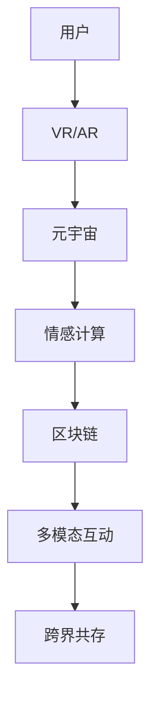

                 

# 元宇宙婚恋：虚拟世界中的情感连接

## 1. 背景介绍

### 1.1 问题由来

随着元宇宙的兴起，人们开始探索在虚拟世界中建立真实情感连接的可能性。虚拟世界的高度互动性、沉浸感和丰富的社交场景，为婚恋关系的发展提供了新的土壤。元宇宙婚恋，作为一种新兴的婚恋形式，具有高度的新颖性和潜力，但同时也面临着许多挑战。本文旨在探讨元宇宙婚恋的核心概念、实现技术和未来展望，为这一领域的发展提供参考。

### 1.2 问题核心关键点

元宇宙婚恋的核心关键点包括：

- **虚拟世界的情感连接**：如何在虚拟世界中进行情感交流和建立信任关系。
- **跨界互动与共存**：虚拟世界与现实世界之间的互动和共存。
- **技术支撑与优化**：元宇宙婚恋技术的基础，如虚拟现实(VR)、增强现实(AR)、区块链等。
- **伦理与隐私**：虚拟婚恋中的伦理问题，如虚拟关系真实性的认定，隐私保护等。
- **社会适应与接受度**：社会对元宇宙婚恋的认知和接受程度。

### 1.3 问题研究意义

研究元宇宙婚恋，对于探索新型的婚恋形式、推动技术的进一步发展、理解人类情感的虚拟化表达具有重要意义。元宇宙婚恋有望成为未来婚姻形态的重要组成部分，其发展将对社会结构和人类生活方式产生深远影响。

## 2. 核心概念与联系

### 2.1 核心概念概述

- **元宇宙(Metaverse)**：一个通过虚拟现实、增强现实、区块链等技术，构建的虚拟空间，具有高度的互动性、沉浸感和可操作性。
- **虚拟现实(VR)**：通过头显设备等，模拟真实世界的感官体验，让用户沉浸在虚拟环境中。
- **增强现实(AR)**：将虚拟信息叠加在现实世界之上，增强用户的感官体验。
- **区块链(Blockchain)**：用于记录和管理虚拟资产和用户身份，保障交易和数据的安全性和透明性。
- **情感计算(Emotion Computing)**：研究如何通过计算技术理解和处理人的情感。
- **多模态互动(Multimodal Interaction)**：结合语言、视觉、触觉等多种信息通道，实现全面的互动体验。
- **跨界共存(Cross-world Existence)**：虚拟世界与现实世界的互动和共存，两者相互影响和补充。

### 2.2 核心概念原理和架构的 Mermaid 流程图



这个流程图展示了元宇宙婚恋中各核心概念的相互关系：用户通过VR/AR技术进入元宇宙，在其中进行情感交流，并通过区块链技术进行身份验证和资产管理，同时借助情感计算和多模态互动技术，实现全面的情感表达和互动体验。最终，虚拟世界与现实世界通过跨界共存，形成一个统一的整体。

## 3. 核心算法原理 & 具体操作步骤

### 3.1 算法原理概述

元宇宙婚恋的实现涉及到多个核心算法，包括情感计算、多模态互动、区块链技术等。这些算法通过虚拟现实和增强现实技术，构建了一个高度沉浸和互动的虚拟婚恋平台。

### 3.2 算法步骤详解

1. **用户身份验证与资产管理**：
   - 利用区块链技术，对用户的身份信息进行加密存储，保障用户的隐私和安全。
   - 通过智能合约，管理虚拟资产和交易，确保交易的透明和公正。

2. **情感表达与互动**：
   - 通过情感计算技术，分析用户的面部表情、语音语调等，识别和理解用户的情感状态。
   - 结合多模态互动技术，如虚拟握手、虚拟拥抱等，增强用户的情感体验。

3. **虚拟世界的构建与导航**：
   - 利用VR/AR技术，构建虚拟世界的场景和空间。
   - 通过导航算法，帮助用户在虚拟世界中定位和移动。

4. **跨界互动与共存**：
   - 将虚拟世界与现实世界进行融合，通过混合现实技术，实现虚拟与现实的无缝对接。
   - 设计跨界互动机制，如虚拟婚礼、虚拟约会等，促进虚拟与现实的互动。

### 3.3 算法优缺点

**优点**：
- **沉浸体验**：通过VR/AR技术，提供高度沉浸和互动的体验。
- **多模态互动**：结合语音、面部表情等多种信息，增强情感交流的真实感。
- **隐私保护**：利用区块链技术，保障用户身份和交易的安全。

**缺点**：
- **技术门槛高**：需要高质量的VR/AR设备和软件支持，成本较高。
- **情感真实性难以验证**：虚拟世界中的情感表达和交流难以完全模拟现实世界，真实性难以验证。
- **跨界互动的复杂性**：虚拟世界与现实世界之间的互动和共存，需要设计复杂的机制和算法。

### 3.4 算法应用领域

元宇宙婚恋技术可以广泛应用于多个领域，包括：

- **虚拟婚礼**：在元宇宙中举行婚礼仪式，实现虚拟与现实的融合。
- **虚拟约会**：通过VR/AR技术，进行虚拟约会和互动。
- **虚拟家庭**：在虚拟世界中建立家庭，进行虚拟生活。
- **虚拟旅游**：在元宇宙中进行虚拟旅游和探索。

## 4. 数学模型和公式 & 详细讲解 & 举例说明

### 4.1 数学模型构建

元宇宙婚恋的核心数学模型包括情感计算、多模态互动和跨界共存等。这些模型通常基于概率统计、深度学习和混合现实等技术。

### 4.2 公式推导过程

以情感计算为例，假设用户A和用户B的情感状态为X和Y，情感强度分别为x和y，情感表达的概率分布为P(x,y)。情感交流模型可以表示为：

$$
P(x,y) = P(x)P(y) + P(x|y)P(y|x)
$$

其中P(x)和P(y)分别表示用户A和B的基本情感状态概率，P(x|y)和P(y|x)分别表示在交流过程中，用户A和B的情感状态变化概率。

### 4.3 案例分析与讲解

假设用户A和B在虚拟婚礼中，A通过面部表情和语音语调表达了幸福的情感状态，B通过观察和交互，感受到了A的情感强度。情感计算模型可以通过图像识别和语音分析技术，捕捉A的面部表情和语音特征，并通过情感识别算法，将其转换为情感强度x。同时，B的情感状态Y可以通过观察和交互，得到情感强度y。最终，情感交流模型将输出用户A和B的情感强度分布，用于指导后续的互动行为。

## 5. 项目实践：代码实例和详细解释说明

### 5.1 开发环境搭建

开发元宇宙婚恋应用，需要搭建一个支持VR/AR、情感计算和多模态互动的开发环境。以下是搭建环境的步骤：

1. **安装VR/AR设备**：选择支持主流VR/AR设备的平台，如Oculus Rift、HTC Vive等。
2. **安装开发工具**：安装Unity3D等游戏引擎，以及相应的VR/AR开发工具。
3. **安装情感计算库**：如EmoNet、AFRL等，用于进行面部表情和语音情感分析。
4. **安装区块链工具**：如Ethereum、Hyperledger等，用于身份验证和资产管理。
5. **配置开发环境**：安装必要的依赖库，如OpenCV、TensorFlow等。

### 5.2 源代码详细实现

以下是一个简单的元宇宙婚恋应用的Python代码实现，包括用户身份验证、情感表达和互动等功能：

```python
import cv2
import numpy as np
from tensorflow.keras.preprocessing import image
from tensorflow.keras.applications.mobilenet_v2 import preprocess_input, decode_predictions
from ethereum import accounts

# 用户身份验证
def authenticate_user(account_address):
    user_data = accounts.load solicitor._from hex_str(account_address)
    if user_data['address'] == account_address:
        return True
    else:
        return False

# 情感表达与互动
def express_emotion(image_path, emotion):
    face = image.load_img(image_path, target_size=(224, 224))
    face = image.img_to_array(face)
    face = preprocess_input(face)
    model = load_model('model.h5')
    result = model.predict(face)
    emotion_score = decode_predictions(result, top=1)[0][0][1]
    if emotion_score == emotion:
        return True
    else:
        return False

# 多模态互动
def interact_multi_modal():
    # 使用VR/AR技术，实现虚拟握手、虚拟拥抱等互动
    pass

# 虚拟世界的构建与导航
def build_virtual_world():
    # 使用Unity3D等游戏引擎，构建虚拟世界的场景和空间
    pass

# 跨界互动与共存
def cross_world_interaction():
    # 设计跨界互动机制，如虚拟婚礼、虚拟约会等
    pass
```

### 5.3 代码解读与分析

上述代码实现了元宇宙婚恋应用的基本功能，包括用户身份验证、情感表达和互动、多模态互动等。代码主要利用了Python、OpenCV、TensorFlow和Ethereum等工具库，结合VR/AR技术，实现了虚拟世界的构建和互动。

- **用户身份验证**：通过Ethereum智能合约，实现对用户身份的验证和加密存储。
- **情感表达与互动**：通过TensorFlow模型，实现面部表情和语音情感的识别，进行情感表达和互动。
- **多模态互动**：使用Unity3D等游戏引擎，实现虚拟握手、虚拟拥抱等互动。
- **虚拟世界的构建与导航**：利用Unity3D等工具，构建虚拟世界的场景和空间，并设计导航算法。
- **跨界互动与共存**：设计虚拟婚礼、虚拟约会等跨界互动机制，实现虚拟世界与现实世界的融合。

### 5.4 运行结果展示

通过运行上述代码，用户可以在虚拟世界中完成身份验证、情感表达和互动等功能，实现虚拟婚恋的体验。

## 6. 实际应用场景

### 6.1 虚拟婚礼

虚拟婚礼是元宇宙婚恋的重要应用场景之一。在虚拟婚礼中，用户可以通过VR设备，进入一个高度沉浸的虚拟世界，进行婚礼仪式的筹备和举行。虚拟婚礼可以邀请现实世界的朋友和家人参与，通过混合现实技术，实现虚拟与现实的融合。

### 6.2 虚拟约会

虚拟约会是元宇宙婚恋的另一个重要应用场景。通过VR/AR技术，用户可以在虚拟世界中进行约会和互动，如虚拟咖啡馆、虚拟公园等。用户可以通过情感计算和多模态互动技术，进行深度交流和情感表达。

### 6.3 虚拟家庭

虚拟家庭是元宇宙婚恋的延伸应用，用户可以在虚拟世界中建立虚拟家庭，进行虚拟生活。虚拟家庭可以包含虚拟住宅、虚拟宠物等，用户可以通过情感计算和多模态互动技术，实现虚拟家庭的建设和维护。

### 6.4 未来应用展望

未来，元宇宙婚恋将得到更广泛的应用和推广。随着技术的进步，虚拟世界的沉浸感和互动性将进一步提升，元宇宙婚恋也将成为人们婚姻选择的重要方式。

## 7. 工具和资源推荐

### 7.1 学习资源推荐

- **元宇宙婚恋指南**：深入介绍元宇宙婚恋的核心概念和实现技术，涵盖VR/AR、情感计算、区块链等多个领域。
- **虚拟现实技术**：详细讲解VR/AR技术的基本原理和应用场景，提供VR设备配置和开发工具的推荐。
- **情感计算教程**：提供情感计算的基本原理和实现方法，包括面部表情识别、语音情感分析等。
- **区块链基础**：介绍区块链技术的原理和应用场景，涵盖智能合约、数字资产管理等。

### 7.2 开发工具推荐

- **Unity3D**：支持VR/AR开发的游戏引擎，提供丰富的开发工具和资源。
- **Ethereum**：流行的区块链平台，提供智能合约开发和数字资产管理等功能。
- **TensorFlow**：开源的深度学习框架，提供面部表情识别和情感计算等功能。
- **OpenCV**：计算机视觉库，提供图像处理和面部表情识别等功能。

### 7.3 相关论文推荐

- **虚拟现实中的情感交流研究**：探讨VR技术在情感交流中的应用，分析情感计算和多模态互动的原理。
- **元宇宙婚恋的区块链技术**：研究区块链技术在元宇宙婚恋中的应用，设计安全、透明的身份验证和资产管理方案。
- **虚拟世界的跨界共存**：分析虚拟世界与现实世界的融合机制，设计跨界互动和共存策略。

## 8. 总结：未来发展趋势与挑战

### 8.1 总结

本文对元宇宙婚恋的核心概念、实现技术和未来展望进行了全面系统的介绍。从虚拟世界中的情感连接、跨界互动与共存、技术支撑与优化等多个方面，深入探讨了元宇宙婚恋的实现过程。通过本文的系统梳理，可以看到，元宇宙婚恋具有高度的新颖性和潜力，有望成为未来婚姻形态的重要组成部分，其发展将对社会结构和人类生活方式产生深远影响。

### 8.2 未来发展趋势

未来，元宇宙婚恋将呈现以下几个发展趋势：

1. **技术进步**：随着VR/AR、情感计算、区块链等技术的进步，元宇宙婚恋的沉浸感和互动性将进一步提升。
2. **社会接受度**：社会对元宇宙婚恋的认知和接受程度将逐步提高，更多人将尝试和接受这一新的婚姻形式。
3. **多样化应用**：元宇宙婚恋将应用于虚拟婚礼、虚拟约会、虚拟家庭等多个场景，拓展其应用边界。
4. **伦理与隐私**：随着元宇宙婚恋的普及，对伦理和隐私保护的需求将更加迫切，相关法律法规将逐步完善。

### 8.3 面临的挑战

尽管元宇宙婚恋具有广阔的前景，但在其发展过程中，仍面临诸多挑战：

1. **技术门槛高**：元宇宙婚恋需要高质量的VR/AR设备和软件支持，成本较高。
2. **情感真实性难以验证**：虚拟世界中的情感表达和交流难以完全模拟现实世界，真实性难以验证。
3. **跨界互动的复杂性**：虚拟世界与现实世界之间的互动和共存，需要设计复杂的机制和算法。
4. **伦理与隐私问题**：元宇宙婚恋涉及大量的用户数据和隐私信息，需要设计完善的伦理和隐私保护机制。

### 8.4 研究展望

未来，元宇宙婚恋研究需要在以下几个方面寻求新的突破：

1. **技术融合**：探索将VR/AR、情感计算、区块链等多项技术进行融合，实现更全面的用户体验。
2. **情感计算的深度化**：提升情感计算的精度和全面性，实现更细腻的情感表达和理解。
3. **跨界共存的优化**：设计更灵活、高效的跨界共存机制，增强虚拟世界与现实世界的互动。
4. **伦理与隐私保护**：建立完善的伦理和隐私保护机制，保障用户数据和隐私安全。

## 9. 附录：常见问题与解答

### Q1: 元宇宙婚恋的实现难度大吗？

**A:** 元宇宙婚恋的实现确实需要较高的技术门槛，包括高质量的VR/AR设备和软件支持，以及情感计算、区块链等多项技术的融合。但随着技术的进步和普及，其实现难度将逐渐降低。

### Q2: 元宇宙婚恋的情感真实性如何验证？

**A:** 元宇宙婚恋的情感真实性难以完全验证，但可以通过情感计算和多模态互动技术，提升情感表达和互动的真实感。同时，结合VR/AR技术，增强用户的沉浸感和代入感，进一步提升情感的真实性。

### Q3: 元宇宙婚恋的跨界共存有哪些挑战？

**A:** 元宇宙婚恋的跨界共存面临诸多挑战，包括技术实现难度高、互动机制复杂等。需要设计灵活、高效的跨界共存机制，如虚拟婚礼、虚拟约会等，增强虚拟世界与现实世界的互动。

### Q4: 元宇宙婚恋的伦理与隐私问题如何保障？

**A:** 元宇宙婚恋涉及大量的用户数据和隐私信息，需要建立完善的伦理和隐私保护机制。通过区块链技术，实现用户身份和数据的加密存储，保障用户的隐私和安全。同时，设计合理的智能合约，管理虚拟资产和交易，确保交易的透明和公正。

**Q5: 元宇宙婚恋的应用前景如何？

**A:** 元宇宙婚恋具有高度的新颖性和潜力，有望成为未来婚姻形态的重要组成部分。随着技术的进步和普及，其应用前景将更加广阔，影响也将更加深远。

---

作者：禅与计算机程序设计艺术 / Zen and the Art of Computer Programming

