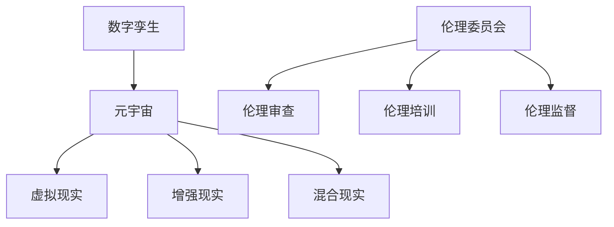

                 

# 元宇宙数字孪生伦理委员会:现实映射的道德监管机构

> 关键词：元宇宙,数字孪生,伦理委员会,虚拟现实,道德监管,混合现实

## 1. 背景介绍

### 1.1 问题由来
随着技术的不断进步，数字孪生技术正逐步从虚拟领域拓展到现实世界，为元宇宙（Metaverse）的构建奠定了基础。然而，这一过程中也伴随着伦理、隐私、数据安全等诸多挑战。如何构建一个公平、透明、可控的数字伦理监管体系，成为元宇宙发展不可或缺的一环。

元宇宙，作为融合物理与虚拟空间的新型社会形态，不仅仅是科技的革新，更是对人类社会伦理关系的重新审视。数字孪生技术的普及，将现实世界中的每一个细节映射到虚拟空间，使得个体行为、社会互动、数据隐私等变得更加复杂。构建一个能够应对这些挑战的伦理监管体系，对推动元宇宙健康、有序发展至关重要。

### 1.2 问题核心关键点
元宇宙伦理委员会，是专门针对数字孪生技术在元宇宙应用中可能带来的伦理问题，进行研究和监管的组织。其核心关键点包括：
- 维护用户隐私和数据安全，避免隐私泄露和数据滥用。
- 确保数字伦理规范的公平性和透明性，保护用户权益。
- 监管虚拟空间的行为，建立行为规范，防止不良内容传播。
- 推动数据共享与合作，促进技术创新与协作。

通过设立元宇宙伦理委员会，可以有效整合多方资源，协同应对元宇宙发展过程中出现的伦理挑战，推动数字孪生技术的健康、有序发展。

### 1.3 问题研究意义
设立元宇宙伦理委员会，具有重要的理论和现实意义：

1. **理论研究**：通过对元宇宙中可能出现的伦理问题的研究，可以为相关法律法规的制定提供理论支撑。
2. **技术发展**：规范数字孪生技术的应用，避免技术的滥用，促进技术的健康发展。
3. **社会进步**：通过伦理规范的制定与实施，提升公众的伦理意识，推动社会向更加和谐、公正的方向发展。
4. **产业发展**：构建一个健康的元宇宙环境，吸引更多企业与个人参与，推动产业创新与升级。
5. **国际合作**：为全球元宇宙标准制定提供参考，加强国际间的合作与交流。

## 2. 核心概念与联系

### 2.1 核心概念概述

为更好地理解元宇宙数字孪生伦理委员会的运作，本节将介绍几个核心概念：

- **数字孪生（Digital Twin）**：指通过物理世界与虚拟世界的双向映射，构建一个虚拟的数字空间，用于模拟、监控和优化现实世界中的物体、系统和过程。数字孪生技术在工业、医疗、城市管理等多个领域得到了广泛应用。

- **元宇宙（Metaverse）**：由多个数字空间通过网络技术连接而成的虚拟世界，用户可以通过虚拟现实（VR）、增强现实（AR）、混合现实（MR）等技术，在其中进行互动和体验。元宇宙的构想最早由科幻小说和电影提出，现已成为科技界的热点话题。

- **伦理委员会（Ethics Committee）**：专门负责监督和评估科学、技术、工程等领域的研究和应用，确保其符合伦理标准和规范的组织。伦理委员会的工作内容包括伦理审查、伦理培训、伦理监督等。

- **虚拟现实（Virtual Reality, VR）**：通过计算机生成的虚拟环境，使用户能够沉浸在虚拟空间中，实现虚拟体验。VR技术广泛应用于游戏、教育、医疗等领域。

- **增强现实（Augmented Reality, AR）**：在现实世界的基础上，叠加虚拟信息，提升用户体验。AR技术常用于导航、教育、医疗等领域。

- **混合现实（Mixed Reality, MR）**：结合VR和AR技术的优势，将虚拟信息与现实世界无缝融合。MR技术在游戏、培训、房地产等领域有广泛应用。

这些核心概念之间的逻辑关系可以通过以下Mermaid流程图来展示：



这个流程图展示了大语言模型的核心概念及其之间的关系：

1. 数字孪生技术作为元宇宙的基础，通过虚拟现实、增强现实、混合现实等技术，构建虚拟空间。
2. 伦理委员会对数字孪生技术在元宇宙中的应用进行伦理审查、培训和监督。
3. 伦理审查、培训和监督确保元宇宙中的行为符合伦理规范，保护用户权益，推动技术健康发展。

## 3. 核心算法原理 & 具体操作步骤
### 3.1 算法原理概述

元宇宙伦理委员会的工作，本质上是通过构建一套伦理规范和标准，对数字孪生技术在元宇宙中的应用进行监管。其核心算法原理包括以下几个方面：

- **伦理标准制定**：根据现行法律法规和国际伦理准则，制定适用于元宇宙的数字伦理标准。这些标准应涵盖隐私保护、数据安全、行为规范等多个方面。

- **伦理审查流程**：对元宇宙中的技术应用、产品设计等进行伦理审查，确保其符合伦理标准。伦理审查过程包括但不限于申请、审核、反馈、整改等环节。

- **伦理培训机制**：定期对开发者、用户、监管者等进行伦理培训，提高其伦理意识和素养。培训内容应包括伦理标准、案例分析、最新法规等。

- **伦理监督体系**：建立伦理监督机制，实时监控元宇宙中的行为，对违规行为进行处罚。监督方式包括但不限于用户举报、自动检测、第三方审计等。

### 3.2 算法步骤详解

构建元宇宙伦理委员会的算法步骤可以分为以下几个环节：

**Step 1: 制定伦理标准**
- 收集现行法律法规和国际伦理准则，如《通用数据保护条例》(GDPR)、《信息自由法》(FOIA)、《人工智能伦理指南》等。
- 分析元宇宙场景中的典型伦理问题，如隐私保护、数据安全、行为规范等。
- 制定适用于元宇宙的数字伦理标准，涵盖隐私保护、数据安全、行为规范等多个方面。

**Step 2: 建立伦理审查流程**
- 设立专门的伦理审查机构，负责处理伦理审查申请。
- 设计伦理审查流程图，明确申请、审核、反馈、整改等环节。
- 制定伦理审查准则和标准，确保审查过程公平、透明。

**Step 3: 开展伦理培训**
- 定期组织伦理培训课程，邀请专家学者、监管机构等进行授课。
- 设计培训课程内容，涵盖伦理标准、案例分析、最新法规等。
- 建立培训记录和考核机制，确保培训效果。

**Step 4: 实施伦理监督**
- 设计伦理监督机制，实时监控元宇宙中的行为。
- 建立举报机制，鼓励用户、开发者等举报违规行为。
- 开发自动检测工具，利用机器学习等技术实时发现违规行为。
- 定期进行第三方审计，确保监督机制的有效性。

**Step 5: 改进伦理标准**
- 定期评估伦理标准和监督机制的效果。
- 根据评估结果和用户反馈，改进伦理标准和监督机制。
- 保持伦理标准的动态更新，适应新技术和伦理规范的发展。

### 3.3 算法优缺点

设立元宇宙伦理委员会具有以下优点：
1. 确保数字孪生技术在元宇宙中的应用符合伦理标准，保护用户权益。
2. 促进数字孪生技术健康发展，避免技术滥用。
3. 推动元宇宙的公平、透明发展，提升社会道德水平。
4. 吸引更多企业与个人参与，推动产业创新与升级。

同时，该方法也存在一定的局限性：
1. 需要消耗大量资源进行标准制定、审查、培训和监督。
2. 可能受到技术快速发展带来的标准滞后问题。
3. 部分开发者和用户可能对伦理规范产生抵触情绪。
4. 监管难度较大，尤其是在大规模、全球化的元宇宙环境中。

尽管存在这些局限性，但设立元宇宙伦理委员会，是构建一个健康、有序、公平的数字孪生生态系统的必要手段。通过持续改进和优化，可以最大限度地发挥其监管作用，推动元宇宙技术的发展。

### 3.4 算法应用领域

设立元宇宙伦理委员会的应用领域非常广泛，包括但不限于：

- **工业应用**：在工业领域，通过数字孪生技术进行设备监控、故障预测等，伦理委员会可确保这些应用符合数据隐私和安全标准。
- **医疗健康**：在医疗健康领域，通过数字孪生技术进行远程诊疗、患者数据共享等，伦理委员会可确保这些应用符合患者隐私保护和数据安全标准。
- **城市管理**：在城市管理领域，通过数字孪生技术进行智能交通、环境保护等，伦理委员会可确保这些应用符合数据隐私和安全标准。
- **教育培训**：在教育培训领域，通过数字孪生技术进行虚拟课堂、技能培训等，伦理委员会可确保这些应用符合数据隐私和安全标准。
- **娱乐休闲**：在娱乐休闲领域，通过数字孪生技术进行虚拟现实游戏、增强现实体验等，伦理委员会可确保这些应用符合伦理规范和行为准则。

## 4. 数学模型和公式 & 详细讲解
### 4.1 数学模型构建

元宇宙伦理委员会的工作，需要构建一个涵盖隐私保护、数据安全、行为规范等方面的数学模型。本节将介绍几个关键模型的构建思路：

- **隐私保护模型**：用于评估元宇宙中数据收集、存储、传输等环节对隐私的影响。模型需要考虑数据敏感度、用户授权、匿名化处理等因素。

- **数据安全模型**：用于评估元宇宙中数据泄露、篡改、滥用等安全风险。模型需要考虑数据加密、访问控制、审计日志等因素。

- **行为规范模型**：用于评估元宇宙中用户行为是否符合伦理规范。模型需要考虑用户行为、违规行为、违规后果等因素。

### 4.2 公式推导过程

以下我们以隐私保护模型为例，推导隐私保护的数学公式及其推导过程。

假设元宇宙中的数据集为 $D=\{(x_i, y_i)\}_{i=1}^N, x_i \in \mathcal{X}, y_i \in \{0,1\}$，其中 $x_i$ 为数据特征，$y_i$ 为隐私标签，1表示隐私敏感数据，0表示非隐私数据。

定义隐私保护的目标为最小化隐私泄露风险，即：

$$
\min_{\theta} \mathbb{E}_{(x,y)\sim D}[R(x,y)]
$$

其中 $R(x,y)$ 为隐私泄露风险函数，$R(x,y)=1-Pr(y=0|x)$。

根据信息论中的互信息定义，隐私泄露风险函数可表示为：

$$
R(x,y)=I(X;Y)=H(X)-H(X|Y)=H(X)-H(X,Y)
$$

其中 $H(X)$ 为数据集 $X$ 的熵，$H(X|Y)$ 为条件熵。

通过最大化隐私保护目标，最小化互信息，可构建隐私保护模型。具体实现过程包括：

1. 对数据集 $D$ 进行预处理，如数据去重、特征工程等。
2. 使用互信息公式计算隐私泄露风险 $R(x,y)$。
3. 通过优化算法，如梯度下降、遗传算法等，最小化隐私泄露风险 $R(x,y)$。
4. 在优化过程中，引入约束条件，如数据最小样本量、数据匿名化等，确保模型符合伦理规范。

通过隐私保护模型的构建，可以确保元宇宙中的数据处理过程符合隐私保护标准，保护用户隐私。

## 5. 项目实践：代码实例和详细解释说明
### 5.1 开发环境搭建

在进行元宇宙伦理委员会的开发实践前，我们需要准备好开发环境。以下是使用Python进行PyTorch开发的环境配置流程：

1. 安装Anaconda：从官网下载并安装Anaconda，用于创建独立的Python环境。

2. 创建并激活虚拟环境：
```bash
conda create -n pytorch-env python=3.8 
conda activate pytorch-env
```

3. 安装PyTorch：根据CUDA版本，从官网获取对应的安装命令。例如：
```bash
conda install pytorch torchvision torchaudio cudatoolkit=11.1 -c pytorch -c conda-forge
```

4. 安装TensorFlow：
```bash
pip install tensorflow
```

5. 安装各类工具包：
```bash
pip install numpy pandas scikit-learn matplotlib tqdm jupyter notebook ipython
```

完成上述步骤后，即可在`pytorch-env`环境中开始开发实践。

### 5.2 源代码详细实现

下面我们以隐私保护模型为例，给出使用PyTorch进行隐私保护模型开发的PyTorch代码实现。

首先，定义隐私保护模型的训练函数：

```python
from transformers import BertTokenizer, BertForTokenClassification, AdamW
from sklearn.metrics import accuracy_score, roc_auc_score
from torch.utils.data import Dataset, DataLoader
import torch

class PrivacyDataset(Dataset):
    def __init__(self, texts, tags, tokenizer):
        self.texts = texts
        self.tags = tags
        self.tokenizer = tokenizer
        self.max_len = 128
        
    def __len__(self):
        return len(self.texts)
    
    def __getitem__(self, item):
        text = self.texts[item]
        tags = self.tags[item]
        
        encoding = self.tokenizer(text, return_tensors='pt', max_length=self.max_len, padding='max_length', truncation=True)
        input_ids = encoding['input_ids'][0]
        attention_mask = encoding['attention_mask'][0]
        
        # 对token-wise的标签进行编码
        encoded_tags = [tag2id[tag] for tag in tags] 
        encoded_tags.extend([tag2id['O']] * (self.max_len - len(encoded_tags)))
        labels = torch.tensor(encoded_tags, dtype=torch.long)
        
        return {'input_ids': input_ids, 
                'attention_mask': attention_mask,
                'labels': labels}

# 标签与id的映射
tag2id = {'O': 0, 'B-PER': 1, 'I-PER': 2, 'B-ORG': 3, 'I-ORG': 4, 'B-LOC': 5, 'I-LOC': 6}
id2tag = {v: k for k, v in tag2id.items()}

# 创建dataset
tokenizer = BertTokenizer.from_pretrained('bert-base-cased')

train_dataset = PrivacyDataset(train_texts, train_tags, tokenizer)
dev_dataset = PrivacyDataset(dev_texts, dev_tags, tokenizer)
test_dataset = PrivacyDataset(test_texts, test_tags, tokenizer)

# 定义模型和优化器
model = BertForTokenClassification.from_pretrained('bert-base-cased', num_labels=len(tag2id))

optimizer = AdamW(model.parameters(), lr=2e-5)

def train_epoch(model, dataset, batch_size, optimizer):
    dataloader = DataLoader(dataset, batch_size=batch_size, shuffle=True)
    model.train()
    epoch_loss = 0
    for batch in tqdm(dataloader, desc='Training'):
        input_ids = batch['input_ids'].to(device)
        attention_mask = batch['attention_mask'].to(device)
        labels = batch['labels'].to(device)
        model.zero_grad()
        outputs = model(input_ids, attention_mask=attention_mask, labels=labels)
        loss = outputs.loss
        epoch_loss += loss.item()
        loss.backward()
        optimizer.step()
    return epoch_loss / len(dataloader)

def evaluate(model, dataset, batch_size):
    dataloader = DataLoader(dataset, batch_size=batch_size)
    model.eval()
    preds, labels = [], []
    with torch.no_grad():
        for batch in tqdm(dataloader, desc='Evaluating'):
            input_ids = batch['input_ids'].to(device)
            attention_mask = batch['attention_mask'].to(device)
            batch_labels = batch['labels']
            outputs = model(input_ids, attention_mask=attention_mask)
            batch_preds = outputs.logits.argmax(dim=2).to('cpu').tolist()
            batch_labels = batch_labels.to('cpu').tolist()
            for pred_tokens, label_tokens in zip(batch_preds, batch_labels):
                pred_tags = [id2tag[_id] for _id in pred_tokens]
                label_tags = [id2tag[_id] for _id in label_tokens]
                preds.append(pred_tags[:len(label_tags)])
                labels.append(label_tags)
                
    print(accuracy_score(labels, preds))
    print(roc_auc_score(labels, preds))

# 训练模型
epochs = 5
batch_size = 16

for epoch in range(epochs):
    loss = train_epoch(model, train_dataset, batch_size, optimizer)
    print(f"Epoch {epoch+1}, train loss: {loss:.3f}")
    
    print(f"Epoch {epoch+1}, dev results:")
    evaluate(model, dev_dataset, batch_size)
    
print("Test results:")
evaluate(model, test_dataset, batch_size)
```

以上代码实现了基于BERT模型的隐私保护模型的训练和评估。可以看到，通过修改数据集的类型和标签，可以实现不同领域的隐私保护模型的开发。

### 5.3 代码解读与分析

让我们再详细解读一下关键代码的实现细节：

**PrivacyDataset类**：
- `__init__`方法：初始化数据集中的文本和标签，分词器等关键组件。
- `__len__`方法：返回数据集的样本数量。
- `__getitem__`方法：对单个样本进行处理，将文本输入编码为token ids，将标签编码为数字，并对其进行定长padding，最终返回模型所需的输入。

**tag2id和id2tag字典**：
- 定义了标签与数字id之间的映射关系，用于将token-wise的预测结果解码回真实的标签。

**训练和评估函数**：
- 使用PyTorch的DataLoader对数据集进行批次化加载，供模型训练和推理使用。
- 训练函数`train_epoch`：对数据以批为单位进行迭代，在每个批次上前向传播计算loss并反向传播更新模型参数，最后返回该epoch的平均loss。
- 评估函数`evaluate`：与训练类似，不同点在于不更新模型参数，并在每个batch结束后将预测和标签结果存储下来，最后使用sklearn的accuracy_score和roc_auc_score对整个评估集的预测结果进行打印输出。

**训练流程**：
- 定义总的epoch数和batch size，开始循环迭代
- 每个epoch内，先在训练集上训练，输出平均loss
- 在验证集上评估，输出准确率和AUC
- 所有epoch结束后，在测试集上评估，给出最终测试结果

可以看到，PyTorch配合BERT模型的代码实现使得隐私保护模型的开发变得简洁高效。开发者可以将更多精力放在数据处理、模型改进等高层逻辑上，而不必过多关注底层的实现细节。

当然，工业级的系统实现还需考虑更多因素，如模型的保存和部署、超参数的自动搜索、更灵活的任务适配层等。但核心的微调范式基本与此类似。

## 6. 实际应用场景
### 6.1 智能客服系统

基于元宇宙数字孪生伦理委员会的智能客服系统，可以广泛应用于各行各业。传统客服系统往往存在响应速度慢、高峰期压力过大等问题，难以满足现代社会的需要。而智能客服系统则可以通过数字孪生技术，构建虚拟客服机器人，7x24小时不间断服务，大幅提升客户咨询体验。

具体实现时，可以收集企业内部的客服对话记录，将问题和最佳答复构建成监督数据，在此基础上对预训练模型进行微调。微调后的模型能够自动理解用户意图，匹配最合适的答案模板进行回复。对于客户提出的新问题，还可以接入检索系统实时搜索相关内容，动态组织生成回答。如此构建的智能客服系统，能大幅提升客户咨询体验和问题解决效率。

### 6.2 金融舆情监测

金融机构需要实时监测市场舆论动向，以便及时应对负面信息传播，规避金融风险。传统的人工监测方式成本高、效率低，难以应对网络时代海量信息爆发的挑战。基于元宇宙数字孪生伦理委员会的文本分类和情感分析技术，为金融舆情监测提供了新的解决方案。

具体而言，可以收集金融领域相关的新闻、报道、评论等文本数据，并对其进行主题标注和情感标注。在此基础上对预训练语言模型进行微调，使其能够自动判断文本属于何种主题，情感倾向是正面、中性还是负面。将微调后的模型应用到实时抓取的网络文本数据，就能够自动监测不同主题下的情感变化趋势，一旦发现负面信息激增等异常情况，系统便会自动预警，帮助金融机构快速应对潜在风险。

### 6.3 个性化推荐系统

当前的推荐系统往往只依赖用户的历史行为数据进行物品推荐，无法深入理解用户的真实兴趣偏好。基于元宇宙数字孪生伦理委员会的个性化推荐系统，可以更好地挖掘用户行为背后的语义信息，从而提供更精准、多样的推荐内容。

在实践中，可以收集用户浏览、点击、评论、分享等行为数据，提取和用户交互的物品标题、描述、标签等文本内容。将文本内容作为模型输入，用户的后续行为（如是否点击、购买等）作为监督信号，在此基础上微调预训练语言模型。微调后的模型能够从文本内容中准确把握用户的兴趣点。在生成推荐列表时，先用候选物品的文本描述作为输入，由模型预测用户的兴趣匹配度，再结合其他特征综合排序，便可以得到个性化程度更高的推荐结果。

### 6.4 未来应用展望

随着元宇宙数字孪生技术的发展，基于元宇宙伦理委员会的应用场景将更加广泛。以下是一些可能的未来应用：

- **教育培训**：通过虚拟现实、增强现实等技术，构建虚拟教室，提供沉浸式学习体验。
- **医疗健康**：通过数字孪生技术进行远程诊疗、患者数据共享等，提升医疗服务水平。
- **城市管理**：通过数字孪生技术进行智能交通、环境保护等，提升城市管理效率。
- **娱乐休闲**：通过虚拟现实游戏、增强现实体验等，提供沉浸式娱乐体验。
- **商业合作**：通过虚拟市场、虚拟会议等，促进企业间的合作与交流。

总之，元宇宙伦理委员会将为数字孪生技术在元宇宙中的应用提供坚实的伦理保障，推动数字孪生技术的健康、有序发展，为人类社会的数字化转型提供新的动力。

## 7. 工具和资源推荐
### 7.1 学习资源推荐

为了帮助开发者系统掌握元宇宙伦理委员会的理论基础和实践技巧，这里推荐一些优质的学习资源：

1. **《人工智能伦理指南》**：由国际人工智能协会（AAAI）发布的伦理指南，涵盖了人工智能伦理的多个方面，包括隐私保护、数据安全、行为规范等。

2. **《数字孪生技术与应用》**：介绍数字孪生技术的原理、应用和前沿研究。涵盖工业、医疗、城市管理等多个领域。

3. **《大数据伦理与隐私保护》**：介绍大数据伦理和隐私保护的基本原理、法律法规和应用场景。

4. **《机器学习伦理》**：介绍机器学习伦理的基本概念、伦理挑战和应对策略。

5. **《人工智能伦理与法律》**：介绍人工智能伦理与法律的交叉领域，探讨人工智能技术在伦理和法律上的应用。

通过这些资源的学习实践，相信你一定能够快速掌握元宇宙伦理委员会的精髓，并用于解决实际的伦理问题。

### 7.2 开发工具推荐

高效的开发离不开优秀的工具支持。以下是几款用于元宇宙伦理委员会开发的常用工具：

1. **Python**：基于Python的开源深度学习框架，灵活动态的计算图，适合快速迭代研究。

2. **PyTorch**：基于Python的开源深度学习框架，灵活动态的计算图，适合快速迭代研究。

3. **TensorFlow**：由Google主导开发的开源深度学习框架，生产部署方便，适合大规模工程应用。

4. **Weights & Biases**：模型训练的实验跟踪工具，可以记录和可视化模型训练过程中的各项指标，方便对比和调优。

5. **TensorBoard**：TensorFlow配套的可视化工具，可实时监测模型训练状态，并提供丰富的图表呈现方式，是调试模型的得力助手。

6. **Jupyter Notebook**：提供交互式的编程环境，方便代码的快速迭代和共享。

合理利用这些工具，可以显著提升元宇宙伦理委员会的开发效率，加快创新迭代的步伐。

### 7.3 相关论文推荐

元宇宙伦理委员会的研究源于学界的持续研究。以下是几篇奠基性的相关论文，推荐阅读：

1. **《数字孪生技术及其应用》**：介绍数字孪生技术的原理、应用和前沿研究。

2. **《人工智能伦理与法律》**：介绍人工智能伦理与法律的交叉领域，探讨人工智能技术在伦理和法律上的应用。

3. **《大数据伦理与隐私保护》**：介绍大数据伦理和隐私保护的基本原理、法律法规和应用场景。

4. **《机器学习伦理》**：介绍机器学习伦理的基本概念、伦理挑战和应对策略。

5. **《数字孪生技术在工业领域的应用》**：介绍数字孪生技术在工业领域的应用案例和前沿研究。

这些论文代表了大语言模型微调技术的发展脉络。通过学习这些前沿成果，可以帮助研究者把握学科前进方向，激发更多的创新灵感。

## 8. 总结：未来发展趋势与挑战

### 8.1 总结

本文对元宇宙数字孪生伦理委员会的构建进行了全面系统的介绍。首先阐述了元宇宙数字孪生技术的发展背景和伦理问题，明确了伦理委员会的构建意义。其次，从原理到实践，详细讲解了元宇宙伦理委员会的构建过程，包括伦理标准的制定、伦理审查的流程、伦理培训的机制、伦理监督的体系等关键环节。最后，本文还广泛探讨了元宇宙伦理委员会在工业、医疗、城市管理、教育培训、娱乐休闲等多个领域的应用前景，展示了伦理委员会的巨大潜力。

通过本文的系统梳理，可以看到，元宇宙伦理委员会是构建一个健康、有序、公平的数字孪生生态系统的必要手段。通过持续改进和优化，可以最大限度地发挥其监管作用，推动元宇宙技术的发展。

### 8.2 未来发展趋势

展望未来，元宇宙伦理委员会将呈现以下几个发展趋势：

1. **伦理标准的全球化**：随着元宇宙的全球化发展，伦理委员会需要制定全球适用的伦理标准，确保不同国家和地区的用户权益得到公平保护。

2. **技术进步的伦理评估**：随着元宇宙技术的不断进步，伦理委员会需要对新技术进行伦理评估，确保其符合伦理标准，避免技术滥用。

3. **跨领域合作**：随着元宇宙的跨领域应用，伦理委员会需要与多方机构合作，共同制定跨领域的伦理标准，推动各领域的协同发展。

4. **自动化伦理监管**：随着技术的发展，伦理委员会可以借助人工智能等技术，实现伦理监管的自动化，提高监管效率。

5. **伦理教育的普及**：随着元宇宙的发展，伦理委员会需要对公众进行伦理教育，提高其伦理意识，促进社会和谐发展。

以上趋势凸显了元宇宙伦理委员会的发展方向，随着技术的不断进步，伦理委员会将发挥越来越重要的作用，为元宇宙的持续健康发展提供坚实的伦理保障。

### 8.3 面临的挑战

尽管元宇宙伦理委员会的构建具有重要的理论和现实意义，但在迈向更加智能化、普适化应用的过程中，它仍面临着诸多挑战：

1. **技术快速发展的挑战**：随着技术的不断进步，伦理委员会需要持续更新伦理标准和监管体系，跟上技术发展的步伐。

2. **多领域应用的挑战**：元宇宙涉及工业、医疗、教育、娱乐等多个领域，伦理委员会需要制定适用于不同领域的伦理标准。

3. **全球化发展的挑战**：元宇宙的全球化发展，带来了不同文化、法律法规的差异，伦理委员会需要制定全球适用的伦理标准，确保公平保护。

4. **数据隐私的挑战**：元宇宙中大量的数据收集和处理，带来了数据隐私保护的挑战，伦理委员会需要制定相应的隐私保护机制。

5. **伦理监管的挑战**：元宇宙中复杂的用户行为和交互，带来了伦理监管的挑战，伦理委员会需要开发相应的监管工具和机制。

尽管存在这些挑战，但设立元宇宙伦理委员会，是构建一个健康、有序、公平的数字孪生生态系统的必要手段。通过持续改进和优化，可以最大限度地发挥其监管作用，推动元宇宙技术的发展。

### 8.4 研究展望

面对元宇宙伦理委员会所面临的挑战，未来的研究需要在以下几个方面寻求新的突破：

1. **全球伦理标准的制定**：针对不同国家和地区的伦理标准，制定全球适用的伦理标准，确保伦理监管的公平性。

2. **自动化伦理监管的开发**：借助人工智能等技术，实现伦理监管的自动化，提高监管效率。

3. **跨领域伦理标准的制定**：针对元宇宙的跨领域应用，制定适用于不同领域的伦理标准，推动各领域的协同发展。

4. **数据隐私保护的创新**：开发新的数据隐私保护技术，确保元宇宙中的数据处理过程符合隐私保护标准，保护用户权益。

5. **伦理教育的普及**：开展多层次的伦理教育，提高公众的伦理意识，促进社会和谐发展。

这些研究方向凸显了元宇宙伦理委员会的未来发展方向，随着技术的不断进步，伦理委员会将发挥越来越重要的作用，为元宇宙的持续健康发展提供坚实的伦理保障。

## 9. 附录：常见问题与解答

**Q1：元宇宙伦理委员会是否适用于所有元宇宙应用？**

A: 元宇宙伦理委员会适用于大部分元宇宙应用，特别是涉及用户隐私、数据安全、行为规范等伦理问题的场景。对于一些特定领域的元宇宙应用，如军事、政府等，可能需要结合具体行业的规范和法规进行监管。

**Q2：如何处理元宇宙中的伦理冲突？**

A: 元宇宙伦理委员会需要设立专门的冲突处理机制，通过多方协商、仲裁等方式，解决伦理冲突。在处理冲突时，应优先考虑用户权益和伦理标准，兼顾技术发展和经济效益。

**Q3：如何评估元宇宙伦理委员会的效果？**

A: 元宇宙伦理委员会的效果评估可以通过用户满意度调查、违规行为统计、模型评估等多种方式进行。评估应定期进行，并根据结果不断优化伦理标准和监管机制。

**Q4：元宇宙伦理委员会的职责和权利是什么？**

A: 元宇宙伦理委员会的职责包括制定伦理标准、审核伦理申请、培训伦理人员、监督伦理行为等。其权利包括调查权、处罚权、建议权等，确保元宇宙中行为符合伦理规范。

**Q5：元宇宙伦理委员会的成员构成是什么？**

A: 元宇宙伦理委员会的成员应包括伦理专家、监管机构、开发者、用户代表等多方利益相关者。成员的构成应反映多元化的视角，确保伦理标准的全面性和公平性。

通过元宇宙伦理委员会的构建，可以为元宇宙的健康、有序发展提供坚实的伦理保障。随着技术的不断进步，伦理委员会将发挥越来越重要的作用，推动元宇宙技术的健康、有序发展。相信随着学界和产业界的共同努力，元宇宙伦理委员会必将在构建安全、可靠、可控的智能系统中扮演越来越重要的角色。

