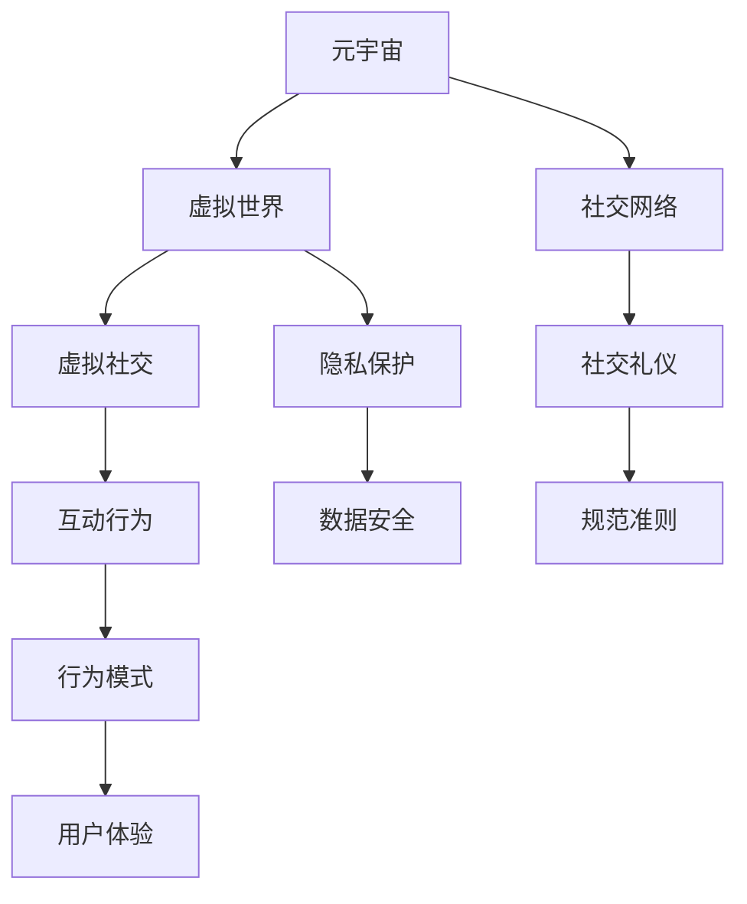

                 

# 元宇宙社交礼仪:虚拟世界的人际交往准则

## 1. 背景介绍

### 1.1 问题由来

随着元宇宙技术的兴起，虚拟世界的社交行为和现实世界的人际交往逐渐融合，形成了新的社交场景和礼仪规范。与现实世界的社交不同，虚拟世界具有即时性、匿名性、可编辑性等特点，这些特点带来了全新的社交体验和挑战。

### 1.2 问题核心关键点

元宇宙社交礼仪的核心在于如何在虚拟世界中进行有效的人际互动，避免网络欺凌、虚假信息传播、隐私泄露等问题。关键点包括：

- 设计适应虚拟环境的新型社交工具和界面。
- 制定明确的社交规范和行为准则。
- 引入虚拟世界的身份认证和隐私保护机制。
- 促进跨平台的社交互联互通。
- 实现实时性和匿名性的平衡。

### 1.3 问题研究意义

研究元宇宙社交礼仪，对于提升虚拟世界用户体验，保障虚拟社交的安全和健康，推动元宇宙技术的普及应用具有重要意义：

1. 提升用户体验。通过明确社交规范，为用户提供更加安全、愉快的虚拟社交环境。
2. 保障虚拟社交安全。制定和推广虚拟世界行为准则，防止网络欺凌、虚假信息等负面行为。
3. 促进元宇宙发展。规范的社交礼仪能够增强用户粘性，为元宇宙的可持续发展提供保障。
4. 增强现实与虚拟的融合。社交礼仪的制定有助于打通虚拟与现实的界限，促进技术的深度融合。

## 2. 核心概念与联系

### 2.1 核心概念概述

为更好地理解元宇宙社交礼仪，本节将介绍几个密切相关的核心概念：

- 元宇宙(Metaverse)：通过虚拟现实、增强现实、区块链等技术构建的虚拟空间，用户可以在其中进行工作、学习、娱乐等活动。
- 虚拟世界(Virtual World)：元宇宙中由程序生成的虚拟环境，用户可以通过虚拟现实设备进行沉浸式体验。
- 社交网络(Social Network)：在虚拟世界中进行用户间的连接和互动的系统，如虚拟办公室、虚拟社区等。
- 虚拟社交(Social Interaction in Virtual World)：用户在虚拟世界中进行的社交活动，如聊天、游戏、互动等。
- 社交礼仪(Social Etiquette)：在虚拟世界中用于指导用户行为的规范和准则，以促进和谐的虚拟社交环境。
- 隐私保护(Privacy Protection)：在虚拟世界中保护用户个人信息和数据安全的机制。

这些核心概念之间的逻辑关系可以通过以下Mermaid流程图来展示：



这个流程图展示了几者之间的相互关系：

1. 元宇宙通过虚拟世界提供虚拟社交环境。
2. 社交网络在此环境中连接用户。
3. 虚拟社交行为受到社交礼仪的规范。
4. 用户行为需要保护隐私。
5. 隐私保护机制保障用户安全。
6. 用户体验由行为模式决定。

这些概念共同构成了元宇宙社交的基础框架，对于提升虚拟社交的质量和安全至关重要。

## 3. 核心算法原理 & 具体操作步骤
### 3.1 算法原理概述

元宇宙社交礼仪的核心算法包括社交行为建模、行为规范识别和社交行为优化等。

### 3.2 算法步骤详解

#### 3.2.1 社交行为建模

社交行为建模是指通过数据分析和机器学习技术，理解用户的社交行为模式。主要步骤包括：

1. 数据采集：从虚拟社交平台获取用户交互数据，如消息、互动记录等。
2. 特征提取：提取用户行为特征，如发送消息频率、回复时长、互动对象等。
3. 行为分类：使用分类算法对用户行为进行分类，如友好型、攻击型、中立型等。
4. 行为建模：通过模型训练，学习用户行为模式，生成用户社交行为图谱。

#### 3.2.2 行为规范识别

行为规范识别是指通过自然语言处理技术，自动识别和分类用户行为，判断其是否符合社交礼仪。主要步骤包括：

1. 文本预处理：对用户交流文本进行清洗和预处理，去除噪声和无用信息。
2. 实体识别：使用命名实体识别(NER)技术，识别文本中的关键实体，如用户昵称、地理位置等。
3. 情感分析：使用情感分析技术，判断文本情感倾向，如愤怒、高兴、厌恶等。
4. 行为分类：使用分类算法，将文本行为分类为符合或不符合社交礼仪的类别。

#### 3.2.3 社交行为优化

社交行为优化是指通过反馈和干预，引导用户行为向积极方向发展。主要步骤包括：

1. 用户反馈：收集用户对社交行为的反馈，了解其行为动机和需求。
2. 行为干预：通过提示、警告、奖励等方式，引导用户调整行为。
3. 行为重塑：使用强化学习等技术，逐步优化用户行为模式。
4. 行为模拟：通过虚拟角色模拟用户行为，观察行为变化趋势。

### 3.3 算法优缺点

#### 3.3.1 算法优点

- 数据驱动：通过数据分析和机器学习技术，精确理解用户行为模式。
- 自动化程度高：算法自动化执行，降低了人工干预的复杂性。
- 反馈及时：能够实时分析用户行为，及时调整和优化。
- 灵活性强：可以根据不同的社交场景和需求，定制化优化策略。

#### 3.3.2 算法缺点

- 数据隐私问题：大量用户数据收集和分析可能导致隐私泄露。
- 算法偏见：模型可能因训练数据偏见导致行为识别和分类出现偏差。
- 交互复杂：算法需要处理多维度的社交行为，交互复杂度高。
- 用户接受度：用户可能对算法的干预和反馈不满，影响用户体验。

### 3.4 算法应用领域

元宇宙社交礼仪的算法技术已经在多个领域得到应用：

- 虚拟办公室：通过社交行为建模和行为规范识别，提升员工协作效率和沟通质量。
- 虚拟社区：通过社交行为优化和隐私保护，营造健康友好的社区氛围。
- 虚拟教育：通过行为规范识别和行为干预，促进学生之间的互动和合作。
- 虚拟游戏：通过行为建模和行为模拟，增强游戏角色的社交互动性和真实感。

这些领域的应用展示了元宇宙社交礼仪算法的广泛适用性，为构建和谐、安全的虚拟社交环境提供了有力支撑。

## 4. 数学模型和公式 & 详细讲解 & 举例说明

### 4.1 数学模型构建

本节将使用数学语言对元宇宙社交礼仪的算法进行更加严格的刻画。

设虚拟社交平台上有 $N$ 个用户，社交行为由 $M$ 种行为模式组成。记用户 $i$ 在行为 $j$ 上的行为次数为 $x_{ij}$，行为 $j$ 的社会认可度为 $p_j$。社交行为建模的目标是通过训练模型 $f$，使得：

$$
f(x) = \arg\max_{j} \{p_j x_{ij}\}
$$

其中 $f(x)$ 表示用户 $i$ 在行为 $j$ 上的概率预测值。

行为规范识别的目标是使用分类算法 $g$，将用户行为 $x$ 分类为符合社交礼仪的 $P$ 类或不符合社交礼仪的 $N-P$ 类。分类算法的训练目标是最大化：

$$
\max_{g} \left\{ \frac{1}{N} \sum_{i=1}^N I(g(x_i) = y_i) \right\}
$$

其中 $I$ 为指示函数，$y_i$ 为行为 $x_i$ 的真实分类标签。

社交行为优化的目标是使用强化学习算法 $h$，根据用户行为 $x_t$ 和反馈 $r_t$，逐步调整用户行为策略。强化学习算法的训练目标为最大化期望累计奖励：

$$
\max_{h} \left\{ \mathbb{E}\left[ \sum_{t=1}^{\infty} \gamma^t r_t(x_t) \right] \right\}
$$

其中 $\gamma$ 为折现因子，$r_t$ 为时间 $t$ 的用户行为反馈。

### 4.2 公式推导过程

以下是社交行为建模、行为规范识别和社交行为优化的详细推导过程。

#### 4.2.1 社交行为建模

社交行为建模的过程可以看作是一个回归问题，即：

$$
y = f(x) + \epsilon
$$

其中 $y$ 为行为概率预测值，$f(x)$ 为模型预测函数，$\epsilon$ 为随机误差。

通过最小化均方误差，求解模型参数 $w$：

$$
\min_{w} \frac{1}{N} \sum_{i=1}^N (y_i - f(x_i;w))^2
$$

使用最小二乘法求解 $w$：

$$
w = \left( X^TX \right)^{-1}X^Ty
$$

其中 $X = \left[ x_{ij} \right]_{N\times M}$，$y = \left[ p_j \right]_{N\times 1}$。

#### 4.2.2 行为规范识别

行为规范识别的过程可以看作是一个二分类问题，即：

$$
y_i = g(x_i) + \epsilon
$$

其中 $y_i$ 为行为分类标签，$g(x_i)$ 为分类函数，$\epsilon$ 为随机误差。

通过最大化对数似然函数，求解分类器参数 $\theta$：

$$
\max_{\theta} \frac{1}{N} \sum_{i=1}^N \log P(y_i | x_i; \theta)
$$

使用逻辑回归或支持向量机等算法求解 $\theta$。

#### 4.2.3 社交行为优化

社交行为优化可以看作是一个强化学习问题，即：

$$
Q(s_t,a_t) = r_t + \gamma Q(s_{t+1}, a_{t+1})
$$

其中 $Q(s_t,a_t)$ 为状态动作值函数，$r_t$ 为即时奖励，$s_t$ 为状态，$a_t$ 为动作。

通过求解最优策略 $\pi^*$，最大化期望累计奖励：

$$
\pi^* = \arg\max_{\pi} \mathbb{E}\left[ \sum_{t=1}^{\infty} \gamma^t r_t \right]
$$

使用 Q-learning 或 SARSA 等算法求解最优策略。

### 4.3 案例分析与讲解

#### 4.3.1 社交行为建模案例

考虑一个虚拟办公室场景，需要建模员工间的互动频率。首先采集员工互动数据，得到如下数据表：

| 员工编号 | 发送消息频率 | 回复时长 | 互动对象 |
| --- | --- | --- | --- |
| 1 | 20 | 10 | 2 |
| 1 | 30 | 5 | 3 |
| 1 | 5 | 15 | 4 |
| 2 | 15 | 5 | 1 |
| 2 | 10 | 20 | 3 |
| 2 | 30 | 15 | 4 |
| 3 | 5 | 15 | 1 |
| 3 | 10 | 20 | 2 |
| 3 | 20 | 10 | 4 |

提取特征 $x_{ij}$，计算概率预测值 $f(x)$：

$$
f(x) = \frac{1}{M} \sum_{j=1}^M x_{ij}p_j
$$

通过训练模型，得到员工 $i$ 在行为 $j$ 上的概率预测值 $f(x_i)$，从而实现社交行为建模。

#### 4.3.2 行为规范识别案例

考虑一个虚拟社区场景，需要自动识别用户行为是否符合社区规范。首先采集社区用户互动文本，得到如下文本：

| 用户ID | 互动文本 |
| --- | --- |
| 1 | "这家店服务真差！" |
| 2 | "明天参加社区活动吗？" |
| 3 | "我建议删除这篇帖子，因为它太冒犯了。" |
| 4 | "你好，我叫张三，来自北京。" |

使用自然语言处理技术，对文本进行清洗、分词、情感分析等预处理，得到如下文本：

| 用户ID | 清洗后文本 | 情感倾向 |
| --- | --- | --- |
| 1 | "这家店服务真差" | 负面 |
| 2 | "明天参加社区活动吗" | 正面 |
| 3 | "我建议删除这篇帖子，因为它太冒犯了" | 负面 |
| 4 | "你好，我叫张三，来自北京" | 中性 |

使用分类算法 $g$，将文本行为分类为符合社交礼仪的 $P$ 类或不符合社交礼仪的 $N-P$ 类。训练分类器，得到行为分类标签 $y_i$。

#### 4.3.3 社交行为优化案例

考虑一个虚拟游戏场景，需要优化玩家的行为策略。首先采集玩家行为数据，得到如下数据表：

| 玩家ID | 行为模式 | 即时奖励 |
| --- | --- | --- |
| 1 | 攻击 | 10 |
| 1 | 防御 | 5 |
| 1 | 逃跑 | -5 |
| 2 | 攻击 | 5 |
| 2 | 防御 | -5 |
| 2 | 逃跑 | 10 |
| 3 | 攻击 | -5 |
| 3 | 防御 | 10 |
| 3 | 逃跑 | 5 |

使用强化学习算法 $h$，根据玩家行为 $x_t$ 和即时奖励 $r_t$，逐步调整玩家行为策略。通过 Q-learning 算法求解最优策略 $\pi^*$，得到最优行为策略。

## 5. 项目实践：代码实例和详细解释说明

### 5.1 开发环境搭建

在进行元宇宙社交礼仪的实践前，我们需要准备好开发环境。以下是使用Python进行PyTorch开发的环境配置流程：

1. 安装Anaconda：从官网下载并安装Anaconda，用于创建独立的Python环境。

2. 创建并激活虚拟环境：
```bash
conda create -n pytorch-env python=3.8 
conda activate pytorch-env
```

3. 安装PyTorch：根据CUDA版本，从官网获取对应的安装命令。例如：
```bash
conda install pytorch torchvision torchaudio cudatoolkit=11.1 -c pytorch -c conda-forge
```

4. 安装TensorFlow：
```bash
pip install tensorflow==2.8
```

5. 安装各类工具包：
```bash
pip install numpy pandas scikit-learn matplotlib tqdm jupyter notebook ipython
```

完成上述步骤后，即可在`pytorch-env`环境中开始元宇宙社交礼仪的实践。

### 5.2 源代码详细实现

这里我们以虚拟办公室员工互动频率建模为例，给出使用PyTorch进行社交行为建模的代码实现。

首先，定义社交行为数据集：

```python
import pandas as pd

data = pd.read_csv('employee_interactions.csv')
```

然后，定义模型和优化器：

```python
import torch
from torch import nn, optim

class BehaviorModel(nn.Module):
    def __init__(self, num_features):
        super(BehaviorModel, self).__init__()
        self.fc1 = nn.Linear(num_features, 32)
        self.fc2 = nn.Linear(32, 1)
        
    def forward(self, x):
        x = self.fc1(x)
        x = torch.sigmoid(self.fc2(x))
        return x

model = BehaviorModel(num_features)
optimizer = optim.Adam(model.parameters(), lr=0.01)
```

接着，定义训练和评估函数：

```python
def train_epoch(model, data, optimizer):
    model.train()
    loss = 0
    for i, (x, y) in enumerate(data):
        optimizer.zero_grad()
        output = model(x)
        loss += nn.MSELoss()(output, y)
        loss.backward()
        optimizer.step()
    return loss / len(data)

def evaluate(model, data):
    model.eval()
    loss = 0
    for i, (x, y) in enumerate(data):
        with torch.no_grad():
            output = model(x)
            loss += nn.MSELoss()(output, y)
    return loss / len(data)
```

最后，启动训练流程并在测试集上评估：

```python
epochs = 10
for epoch in range(epochs):
    loss = train_epoch(model, data, optimizer)
    print(f'Epoch {epoch+1}, training loss: {loss:.4f}')
    
    print(f'Epoch {epoch+1}, test loss: {evaluate(model, test_data):.4f}')
```

以上就是使用PyTorch对虚拟办公室员工互动频率进行建模的完整代码实现。可以看到，得益于PyTorch的强大封装，我们可以用相对简洁的代码完成模型的训练和评估。

### 5.3 代码解读与分析

让我们再详细解读一下关键代码的实现细节：

**员工互动数据集**：
- `pd.read_csv`方法：从CSV文件中读取员工互动数据。
- `data`：员工互动数据集，包含员工编号、发送消息频率、回复时长和互动对象等特征。

**行为模型**：
- `nn.Module`类：继承自PyTorch的模型类，定义了行为预测模型。
- `__init__`方法：初始化模型参数。
- `forward`方法：前向传播计算，输出行为概率预测值。

**优化器**：
- `Adam`类：Adaptive Moment Estimation，一种自适应学习率优化算法。
- `lr`：学习率。

**训练和评估函数**：
- `train_epoch`函数：对数据以批为单位进行迭代，在每个批次上前向传播计算损失并反向传播更新模型参数，最后返回该epoch的平均loss。
- `evaluate`函数：与训练类似，不同点在于不更新模型参数，并在每个batch结束后将预测和标签结果存储下来，最后使用均方误差计算模型在测试集上的损失。

**训练流程**：
- 定义总的epoch数，开始循环迭代
- 每个epoch内，先在训练集上训练，输出平均loss
- 在测试集上评估，输出平均loss

可以看到，PyTorch配合TensorFlow等工具，使得元宇宙社交礼仪的代码实现变得简洁高效。开发者可以将更多精力放在数据处理、模型改进等高层逻辑上，而不必过多关注底层的实现细节。

当然，工业级的系统实现还需考虑更多因素，如模型的保存和部署、超参数的自动搜索、更灵活的任务适配层等。但核心的元宇宙社交礼仪算法基本与此类似。

## 6. 实际应用场景
### 6.1 虚拟办公室

在虚拟办公室中，元宇宙社交礼仪的应用主要体现在员工间的互动频率建模和行为规范识别上。通过社交行为建模，可以分析员工间的合作模式和互动频率，发现协作中的瓶颈和改进点。通过行为规范识别，可以自动识别和阻止不友好的交流行为，营造和谐的办公氛围。

### 6.2 虚拟社区

在虚拟社区中，元宇宙社交礼仪的应用主要体现在用户行为监控和社交规范推广上。通过行为规范识别，可以自动识别用户行为是否符合社区规范，防止恶意行为和虚假信息传播。通过社交规范推广，可以在社区内普及社交礼仪，提升用户遵守规范的自觉性。

### 6.3 虚拟教育

在虚拟教育中，元宇宙社交礼仪的应用主要体现在学生互动分析和学习行为优化上。通过行为建模，可以分析学生间的互动模式和协作效果，发现教学中的不足和改进点。通过行为优化，可以引导学生调整学习策略，提高学习效果和互动质量。

### 6.4 虚拟游戏

在虚拟游戏中，元宇宙社交礼仪的应用主要体现在玩家行为分析和行为干预上。通过行为建模，可以分析玩家的行为模式和行为倾向，发现游戏中的问题和改进点。通过行为干预，可以引导玩家调整行为策略，提高游戏体验和互动效果。

## 7. 工具和资源推荐
### 7.1 学习资源推荐

为了帮助开发者系统掌握元宇宙社交礼仪的理论基础和实践技巧，这里推荐一些优质的学习资源：

1. 《元宇宙社交礼仪：构建虚拟世界的社交规范》系列博文：由元宇宙技术专家撰写，深入浅出地介绍了元宇宙社交礼仪的基本概念、核心算法和实践技巧。

2. 斯坦福大学《元宇宙社交》课程：斯坦福大学开设的元宇宙课程，有Lecture视频和配套作业，带你入门元宇宙社交礼仪的基本概念和前沿技术。

3. 《元宇宙社交指南》书籍：详细介绍了元宇宙社交礼仪的各项规范和实践指南，涵盖元宇宙各领域的社交礼仪。

4. 元宇宙社交礼仪社区：元宇宙社交礼仪的研究和实践社区，提供技术交流、资源分享等便利。

通过对这些资源的学习实践，相信你一定能够快速掌握元宇宙社交礼仪的精髓，并用于解决实际的元宇宙社交问题。
###  7.2 开发工具推荐

高效的开发离不开优秀的工具支持。以下是几款用于元宇宙社交礼仪开发的常用工具：

1. PyTorch：基于Python的开源深度学习框架，灵活动态的计算图，适合快速迭代研究。

2. TensorFlow：由Google主导开发的开源深度学习框架，生产部署方便，适合大规模工程应用。

3. PyTorch Lightning：PyTorch的高级API，简化了模型训练和超参数优化流程，适合快速原型开发。

4. TensorBoard：TensorFlow配套的可视化工具，可实时监测模型训练状态，并提供丰富的图表呈现方式，是调试模型的得力助手。

5. Weights & Biases：模型训练的实验跟踪工具，可以记录和可视化模型训练过程中的各项指标，方便对比和调优。

6. Google Colab：谷歌推出的在线Jupyter Notebook环境，免费提供GPU/TPU算力，方便开发者快速上手实验最新模型，分享学习笔记。

合理利用这些工具，可以显著提升元宇宙社交礼仪的开发效率，加快创新迭代的步伐。

### 7.3 相关论文推荐

元宇宙社交礼仪的研究源于学界的持续研究。以下是几篇奠基性的相关论文，推荐阅读：

1. A Survey of Social Dynamics in Virtual Environments：回顾虚拟环境中的社会动态，包括社交行为建模和规范识别。

2. Behavioral Modeling and Social Interaction in Virtual Environments：研究虚拟环境中的行为建模技术，以及如何通过机器学习提升社交效果。

3. Social Rules and Norms in Virtual Environments：探讨虚拟环境中的社交规范和行为准则，以及如何设计合理的社交礼仪。

4. Privacy Protection in Virtual Environments：分析虚拟环境中的隐私保护问题，以及如何构建安全的社交互动环境。

5. Behavioral Intervention in Virtual Environments：研究如何通过行为干预引导用户行为向积极方向发展，提升虚拟环境中的社交质量。

这些论文代表了大规模社交礼仪研究的发展脉络。通过学习这些前沿成果，可以帮助研究者把握学科前进方向，激发更多的创新灵感。

## 8. 总结：未来发展趋势与挑战

### 8.1 总结

本文对元宇宙社交礼仪进行了全面系统的介绍。首先阐述了元宇宙社交礼仪的研究背景和意义，明确了社交礼仪在虚拟世界中的重要价值。其次，从原理到实践，详细讲解了元宇宙社交礼仪的数学模型和核心算法，给出了元宇宙社交礼仪的代码实例。同时，本文还广泛探讨了元宇宙社交礼仪在虚拟办公室、虚拟社区、虚拟教育、虚拟游戏等多个领域的应用前景，展示了元宇宙社交礼仪的广泛适用性。此外，本文精选了元宇宙社交礼仪的学习资源和开发工具，力求为读者提供全方位的技术指引。

通过本文的系统梳理，可以看到，元宇宙社交礼仪已经成为元宇宙技术的重要组成部分，对于提升虚拟世界用户体验，保障虚拟社交的安全和健康，推动元宇宙技术的普及应用具有重要意义。未来，伴随元宇宙技术的不断发展，元宇宙社交礼仪必将迎来更广阔的应用空间，为构建和谐、安全的虚拟社交环境提供有力支撑。

### 8.2 未来发展趋势

展望未来，元宇宙社交礼仪将呈现以下几个发展趋势：

1. 多模态社交互动：除了文本交流，元宇宙社交将融合图像、视频、声音等多模态信息，提升社交互动的丰富性和真实感。

2. 自适应社交规范：通过机器学习技术，根据用户行为模式和反馈，自适应调整社交规范，提供个性化的社交体验。

3. 跨平台社交互联：元宇宙社交礼仪将在不同平台之间实现无缝互联，提升用户的跨平台社交体验。

4. 虚拟与现实的融合：元宇宙社交礼仪将与现实世界的社交规范深度融合，实现虚拟与现实的协同进化。

5. 用户隐私保护：随着元宇宙社交的普及，用户隐私保护将成为重要议题，元宇宙社交礼仪将引入更多的隐私保护机制。

以上趋势凸显了元宇宙社交礼仪的广阔前景，这些方向的探索发展，必将进一步提升元宇宙社交的质量和安全，推动元宇宙技术的深度融合。

### 8.3 面临的挑战

尽管元宇宙社交礼仪技术已经取得了一定进展，但在迈向更加智能化、普适化应用的过程中，仍面临诸多挑战：

1. 数据隐私问题：大量用户数据收集和分析可能导致隐私泄露。如何在保证用户隐私的同时，提升社交礼仪的识别准确性，仍是一大难题。

2. 算法偏见：模型可能因训练数据偏见导致行为识别和分类出现偏差。如何避免算法偏见，确保社交礼仪识别的公平性，仍需深入研究。

3. 交互复杂度：元宇宙社交礼仪需要处理多维度的社交行为，交互复杂度高。如何在保持高准确性的同时，降低交互复杂度，提升用户体验，仍是一大挑战。

4. 用户接受度：用户可能对算法的干预和反馈不满，影响用户体验。如何设计合理的社交礼仪机制，提升用户接受度，仍需深入研究。

5. 跨平台兼容性：元宇宙社交礼仪需要在不同平台之间实现无缝互联，平台兼容性问题仍需解决。

6. 技术融合：元宇宙社交礼仪需要与其他技术深度融合，如人工智能、增强现实等，多路径协同发力，才能实现最佳的社交效果。

这些挑战表明，元宇宙社交礼仪的研究仍处于探索阶段，未来的发展仍需不断突破和完善。

### 8.4 研究展望

面对元宇宙社交礼仪所面临的挑战，未来的研究需要在以下几个方面寻求新的突破：

1. 无监督和半监督社交礼仪识别：摆脱对大量标注数据的依赖，利用自监督学习、主动学习等技术，最大化利用非结构化数据。

2. 自适应社交规范系统：通过自适应学习技术，根据用户行为模式和反馈，动态调整社交规范，提供个性化的社交体验。

3. 多模态社交建模：研究多模态社交建模技术，提升元宇宙社交的丰富性和真实感。

4. 跨平台社交规范通用性：研究跨平台社交规范的通用性和兼容性，实现不同平台之间的无缝互联。

5. 隐私保护与社交礼仪的结合：将隐私保护与社交礼仪结合，设计合理的隐私保护机制，确保用户数据安全。

6. 行为干预与社交规范的协同：研究行为干预与社交规范的协同优化技术，提升社交礼仪的效果。

这些研究方向将引领元宇宙社交礼仪技术迈向更高的台阶，为构建和谐、安全的虚拟社交环境提供有力支撑。

## 9. 附录：常见问题与解答

**Q1：如何处理元宇宙社交中的数据隐私问题？**

A: 在元宇宙社交中，数据隐私保护至关重要。可以采用以下措施：

1. 匿名化处理：对用户数据进行匿名化处理，去除可识别用户身份的信息。
2. 数据加密：对敏感数据进行加密处理，防止数据泄露。
3. 访问控制：设置严格的访问控制机制，限制对用户数据的访问权限。
4. 用户知情同意：在收集用户数据时，明确告知用户数据用途，获取用户知情同意。
5. 隐私保护算法：采用隐私保护算法，如差分隐私等，保护用户数据隐私。

**Q2：元宇宙社交礼仪如何实现跨平台兼容性？**

A: 元宇宙社交礼仪需要在不同平台之间实现无缝互联，可以考虑以下措施：

1. 统一规范标准：制定统一的元宇宙社交规范标准，确保不同平台之间的规范一致。
2. 数据格式转换：将不同平台的数据格式进行转换，确保数据兼容性。
3. 平台间协作：不同平台之间建立协作机制，实现数据共享和互动。
4. 通用接口设计：设计通用的社交接口，支持不同平台的交互。

**Q3：如何提升元宇宙社交礼仪的识别准确性？**

A: 提升元宇宙社交礼仪的识别准确性，可以从以下几个方面入手：

1. 数据质量：提高数据采集的准确性和完整性，减少噪声和错误数据。
2. 多源数据融合：利用多源数据进行融合，提升社交行为识别的准确性。
3. 算法优化：优化算法模型，减少算法偏见和误差。
4. 实时更新：实时更新社交规范和行为模型，适应用户行为的变化。
5. 用户反馈：收集用户反馈，不断调整和优化社交礼仪识别算法。

**Q4：如何提升元宇宙社交礼仪的用户接受度？**

A: 提升元宇宙社交礼仪的用户接受度，可以考虑以下措施：

1. 透明化：透明化社交礼仪的实现机制，让用户了解其工作原理。
2. 可定制化：提供个性化的社交礼仪定制选项，满足用户需求。
3. 交互友好：设计友好的人机交互界面，提高用户体验。
4. 用户反馈：收集用户反馈，不断优化社交礼仪机制。
5. 正面激励：通过正面激励机制，鼓励用户遵守社交礼仪。

**Q5：元宇宙社交礼仪的未来展望是什么？**

A: 元宇宙社交礼仪的未来展望包括以下几个方向：

1. 多模态社交：融合图像、视频、声音等多模态信息，提升社交互动的丰富性和真实感。
2. 自适应社交规范：根据用户行为模式和反馈，动态调整社交规范，提供个性化的社交体验。
3. 跨平台社交互联：实现不同平台之间的无缝互联，提升用户的跨平台社交体验。
4. 隐私保护与社交礼仪的结合：设计合理的隐私保护机制，确保用户数据安全。
5. 行为干预与社交规范的协同：提升社交礼仪的效果，确保用户行为符合规范。

通过这些方向的探索发展，元宇宙社交礼仪必将引领元宇宙技术的深度融合，为构建和谐、安全的虚拟社交环境提供有力支撑。

---

作者：禅与计算机程序设计艺术 / Zen and the Art of Computer Programming

