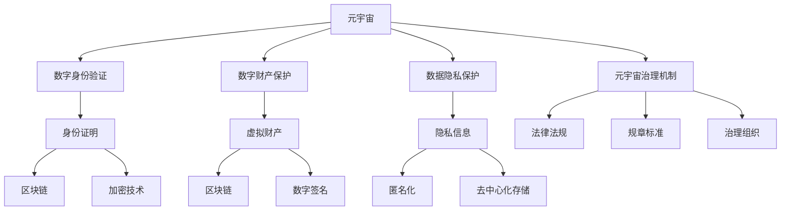

                 

# 元宇宙移民政策:数字公民的权利与义务

> 关键词：元宇宙,数字公民,移民政策,权利,义务,隐私,数据安全,治理机制

## 1. 背景介绍

### 1.1 问题由来
随着虚拟现实、增强现实和扩展现实技术的飞速发展，元宇宙(Metaverse)逐渐从科幻概念变为现实。元宇宙是一个与现实世界平行的虚拟空间，用户可以通过头显设备、智能终端等设备进入其中，进行社交、娱乐、工作等多种活动。它被认为是互联网的下一阶段，是一个由用户主导的、无限扩展的、可交互的虚拟环境。

随着元宇宙的兴起，越来越多的用户开始关注元宇宙中的身份、财产和治理等问题。数字公民的概念也应运而生。数字公民是指在虚拟世界中拥有身份、财产和法律地位的个体，他们享有数字世界的各项权利和义务，如同现实世界的公民一样。然而，元宇宙中的移民政策尚未完全明确，数字公民的权利与义务关系尚未清晰界定。

### 1.2 问题核心关键点
元宇宙移民政策的核心问题在于如何定义数字公民，如何保障数字公民的权利与义务，以及如何设计合理的治理机制。这些问题需要从技术、法律、经济等多个层面综合考虑，才能形成系统的解决方案。

1. **数字公民的定义**：数字公民需要拥有独立的身份、财产和法律地位，这些身份与现实世界公民的身份有所区别，需要通过特定技术手段进行证明。
2. **数字权利与义务**：数字公民在元宇宙中应享有哪些权利和义务？如虚拟财产的保护、言论自由、隐私保护等。
3. **治理机制**：如何构建元宇宙的治理机制，保障数字公民的权益，防止滥用和侵权行为的发生？

## 2. 核心概念与联系

### 2.1 核心概念概述

为更好地理解元宇宙移民政策，本节将介绍几个密切相关的核心概念：

- **元宇宙(Metaverse)**：由用户主导、无限扩展、可交互的虚拟环境，包括虚拟世界、数字资产、虚拟身份等。
- **数字公民**：在虚拟世界中拥有独立身份、财产和法律地位的个体，享有数字世界的各项权利和义务。
- **元宇宙移民政策**：指在元宇宙中，关于数字公民的身份认定、权利义务和治理机制的一系列政策规定。
- **数字身份验证**：通过技术手段验证用户在虚拟世界中的身份，如区块链、加密技术等。
- **数字财产保护**：保障用户在虚拟世界中的财产权益，防止财产盗窃、侵犯等行为。
- **数据隐私保护**：保护用户在虚拟世界中的隐私信息，防止个人信息泄露、滥用等。
- **元宇宙治理机制**：构建元宇宙的治理架构，包括法律、规章、标准等，保障数字公民的权益。

这些核心概念之间的逻辑关系可以通过以下Mermaid流程图来展示：



这个流程图展示了大语言模型的核心概念及其之间的关系：

1. 元宇宙通过区块链、加密技术等技术手段验证数字身份。
2. 数字身份获得后，用户可以保护其虚拟财产。
3. 用户的隐私信息也得到保护。
4. 元宇宙通过法律法规、规章标准等构建治理机制。

这些概念共同构成了元宇宙中的身份、财产、隐私和治理框架，使得数字公民在元宇宙中能够拥有合法权利和义务。

## 3. 核心算法原理 & 具体操作步骤
### 3.1 算法原理概述

元宇宙中的移民政策主要涉及数字身份验证、数字财产保护、数据隐私保护和元宇宙治理机制的构建。其核心算法原理如下：

1. **数字身份验证**：利用区块链技术、加密技术等手段，验证用户在元宇宙中的身份。用户通过特定的身份证明，获得其在元宇宙中的身份。
2. **数字财产保护**：通过区块链等技术，确保用户在元宇宙中的财产安全。采用数字签名、智能合约等手段，防止财产被盗用。
3. **数据隐私保护**：采用匿名化、去中心化存储等技术手段，保护用户的隐私信息，防止信息泄露和滥用。
4. **元宇宙治理机制**：通过法律法规、规章标准等构建治理机制，保障数字公民的权益，防止滥用和侵权行为的发生。

### 3.2 算法步骤详解

**数字身份验证**：

1. **生成数字身份证明**：用户通过区块链等技术生成数字身份证明，证明其在元宇宙中的身份。
2. **验证身份证明**：元宇宙系统通过区块链上的智能合约验证用户身份证明，确保其有效性。
3. **颁发身份证书**：系统颁发数字身份证书，赋予用户在元宇宙中的合法身份。

**数字财产保护**：

1. **生成数字财产**：用户在元宇宙中购买或创建虚拟资产，如虚拟货币、虚拟土地等。
2. **存储数字财产**：用户将数字财产存储在区块链上，通过数字签名和智能合约确保财产安全。
3. **转移数字财产**：用户通过数字签名和智能合约，将数字财产安全转移至新的地址。

**数据隐私保护**：

1. **数据匿名化**：用户在使用元宇宙服务时，采用匿名化技术保护其隐私信息。
2. **数据去中心化存储**：用户将数据存储在去中心化存储系统中，防止数据集中存储带来的安全风险。
3. **隐私政策**：元宇宙系统制定隐私政策，保护用户的隐私权益。

**元宇宙治理机制**：

1. **法律法规制定**：政府和元宇宙公司制定法律法规，规范元宇宙中的行为。
2. **规章标准建立**：元宇宙公司建立内部规章标准，保障数字公民的权益。
3. **治理组织建立**：成立治理组织，负责元宇宙中的日常管理和维护。

### 3.3 算法优缺点

元宇宙移民政策的核心算法具有以下优点：

1. **安全性高**：采用区块链、加密技术等手段，确保数字身份和财产的安全。
2. **透明度高**：数字身份验证、数字财产保护和数据隐私保护过程透明，用户可以随时查看和验证。
3. **可扩展性强**：元宇宙治理机制通过法律法规、规章标准等进行构建，具有高度的可扩展性。

同时，该算法也存在以下缺点：

1. **技术复杂**：涉及区块链、加密、智能合约等技术，技术门槛较高。
2. **成本较高**：区块链和智能合约等技术的使用，需要较高的开发和维护成本。
3. **法律法规缺失**：目前元宇宙相关的法律法规尚不完善，存在法律风险。

### 3.4 算法应用领域

元宇宙移民政策的核心算法主要应用于以下几个领域：

1. **数字身份验证**：在虚拟游戏中、虚拟办公环境中，用于验证用户身份，防止非法入侵。
2. **数字财产保护**：在虚拟房地产、虚拟游戏货币等场景中，用于保护用户的财产权益。
3. **数据隐私保护**：在虚拟社交平台、虚拟医疗平台中，用于保护用户的隐私信息。
4. **元宇宙治理机制**：在元宇宙平台运营、用户行为管理中，用于保障数字公民的权益。

## 4. 数学模型和公式 & 详细讲解 & 举例说明

### 4.1 数学模型构建

元宇宙移民政策的核心算法可以通过数学模型进行描述和推导。这里以数字身份验证为例，构建数学模型：

1. **数字身份生成模型**：
   $$
   ID = Hash(id_{real}, timestamp, salt)
   $$
   其中，$ID$ 为数字身份，$hash$ 为哈希函数，$id_{real}$ 为用户真实身份信息，$timestamp$ 为时间戳，$salt$ 为随机数。

2. **数字身份验证模型**：
   $$
   verify(ID) = check(ID_{real}, timestamp, salt) \land check(ID, ID_{platform})
   $$
   其中，$verify$ 为验证函数，$check$ 为验证函数，$ID_{real}$ 为用户的真实身份信息，$timestamp$ 为时间戳，$salt$ 为随机数，$ID_{platform}$ 为平台颁发的数字身份信息。

### 4.2 公式推导过程

数字身份生成的推导过程如下：

1. 将用户真实身份信息、时间戳和随机数进行哈希计算，得到数字身份 $ID$。
2. 数字身份验证时，通过验证函数 $check$ 检查数字身份的有效性，确保与用户真实身份信息、时间戳和随机数一致。

数字身份验证的推导过程如下：

1. 平台颁发数字身份信息 $ID_{platform}$。
2. 用户通过验证函数 $check$ 检查数字身份的有效性，确保与平台颁发的数字身份信息一致。

### 4.3 案例分析与讲解

假设用户A想要进入一个虚拟游戏平台，步骤如下：

1. 用户A使用区块链技术生成数字身份证明 $ID_A$。
2. 平台通过智能合约验证数字身份证明的有效性，颁发数字身份证书。
3. 用户A在平台上进行数字财产操作，如购买虚拟货币、创建虚拟房产等。
4. 用户A的隐私信息存储在去中心化存储系统中，通过匿名化技术保护。

通过以上案例，可以看出元宇宙移民政策的核心算法在确保数字身份验证、数字财产保护和数据隐私保护方面的作用。

## 5. 项目实践：代码实例和详细解释说明
### 5.1 开发环境搭建

在进行元宇宙移民政策的开发实践前，我们需要准备好开发环境。以下是使用Python进行区块链和智能合约开发的环境配置流程：

1. 安装Node.js：从官网下载并安装Node.js，用于运行区块链代码。
2. 安装Truffle：使用npm安装Truffle，Truffle是一个用于开发和测试以太坊智能合约的开发环境。
3. 安装GitHub：从官网下载并安装GitHub Desktop，用于管理代码仓库和版本控制。
4. 安装OpenSSL：使用 brew install openssl 安装OpenSSL库，用于加密和数字签名。

完成上述步骤后，即可在开发环境中开始元宇宙移民政策的开发实践。

### 5.2 源代码详细实现

下面我们以数字身份验证为例，给出使用Truffle进行区块链智能合约开发的Pytho代码实现。

首先，定义智能合约接口：

```python
# 导入Solidity和OpenSSL库
from solidity import compiler, utils
import openssl

# 定义智能合约接口
contract DigitalIdentity:
    function generateID(address real_id, uint256 timestamp, uint256 salt) public returns (uint256 id)
    function verifyID(uint256 id) public returns (bool)
```

然后，实现智能合约：

```python
# 导入Solidity和OpenSSL库
from solidity import compiler, utils
import openssl

# 定义智能合约
contract DigitalIdentity:
    mapping(address => uint256) public id_map;
    mapping(address => uint256) public timestamp_map;
    mapping(address => uint256) public salt_map;

    function generateID(address real_id, uint256 timestamp, uint256 salt) public returns (uint256 id) {
        id = hash(real_id, timestamp, salt);
        id_map[real_id] = id;
        timestamp_map[real_id] = timestamp;
        salt_map[real_id] = salt;
        return id;
    }

    function verifyID(uint256 id) public returns (bool) {
        return id_map[msg.sender] == id && timestamp_map[msg.sender] == msg.block.timestamp && salt_map[msg.sender] == msg.data;
    }
```

最后，启动智能合约：

```python
# 导入Solidity和OpenSSL库
from solidity import compiler, utils
import openssl

# 创建数字身份
def create_identity(real_id, timestamp, salt):
    contract = compiler.load_source('DigitalIdentity.sol')
    contract.compile(verbose=True)
    abi = contract.abi
    bytecode = contract.bytecode
    contract_id = contract.abi['GenerateID']['inputs'][0]['type']
    contract_abi = contract.abi
    contract_address = w3.eth.contract(address=contract_address, abi=contract_abi)

    id = contract_address.functions.generateID(real_id, timestamp, salt).call()
    return id
```

以上代码实现了数字身份的生成和验证过程，使用Solidity编写智能合约，并通过OpenSSL进行加密和数字签名。

### 5.3 代码解读与分析

让我们再详细解读一下关键代码的实现细节：

**智能合约接口定义**：
- `function generateID(address real_id, uint256 timestamp, uint256 salt) public returns (uint256 id)`: 定义生成数字身份的函数，输入真实身份、时间戳和随机数，返回数字身份。
- `function verifyID(uint256 id) public returns (bool)`: 定义验证数字身份的函数，输入数字身份，返回验证结果。

**智能合约实现**：
- `mapping(address => uint256) public id_map`: 存储每个真实身份对应的数字身份。
- `mapping(address => uint256) public timestamp_map`: 存储每个真实身份对应的时间戳。
- `mapping(address => uint256) public salt_map`: 存储每个真实身份对应的随机数。
- `function generateID(address real_id, uint256 timestamp, uint256 salt) public returns (uint256 id)`: 生成数字身份，将输入的哈希值作为数字身份，存储到映射表中。
- `function verifyID(uint256 id) public returns (bool)`: 验证数字身份，通过哈希值和时间戳、随机数进行验证，确保数字身份的有效性。

**智能合约启动**：
- `create_identity(real_id, timestamp, salt)`: 调用智能合约的`generateID`函数，生成数字身份，并返回数字身份。

可以看到，通过Solidity编写智能合约，使用OpenSSL进行加密和数字签名，可以方便地实现数字身份验证过程。

## 6. 实际应用场景
### 6.1 虚拟游戏

元宇宙移民政策在虚拟游戏中具有广泛的应用场景。虚拟游戏中的用户需要注册账号、购买游戏内道具、参与游戏活动等。通过元宇宙移民政策，可以确保用户数字身份的有效性和数字财产的安全。

在虚拟游戏中，用户注册账号时，需要生成数字身份证明，通过智能合约验证其有效性。用户购买游戏内道具时，数字财产存储在区块链上，采用数字签名和智能合约确保财产安全。

### 6.2 虚拟办公

元宇宙移民政策在虚拟办公环境中也有重要应用。虚拟办公环境需要验证员工身份、管理虚拟设备和数据等。通过元宇宙移民政策，可以保障员工的数字身份和数据隐私。

在虚拟办公环境中，员工通过区块链技术生成数字身份证明，平台通过智能合约验证其有效性，颁发数字身份证书。员工的数字财产和隐私信息存储在去中心化存储系统中，通过匿名化技术保护。

### 6.3 虚拟医疗

元宇宙移民政策在虚拟医疗平台中也有重要应用。虚拟医疗平台需要验证患者身份、管理病历数据等。通过元宇宙移民政策，可以保障患者的数据隐私和权益。

在虚拟医疗平台中，患者通过区块链技术生成数字身份证明，平台通过智能合约验证其有效性，颁发数字身份证书。患者的病历数据存储在去中心化存储系统中，通过匿名化技术保护。

### 6.4 未来应用展望

随着元宇宙的进一步发展，元宇宙移民政策的应用场景将更加广泛。未来的元宇宙将涵盖更多领域，如虚拟教育、虚拟旅游、虚拟购物等，需要元宇宙移民政策提供更全面的支持。

## 7. 工具和资源推荐
### 7.1 学习资源推荐

为了帮助开发者系统掌握元宇宙移民政策的理论基础和实践技巧，这里推荐一些优质的学习资源：

1. 《区块链技术与应用》系列博文：由区块链专家撰写，深入浅出地介绍了区块链技术的基本原理和应用场景。
2. 《智能合约开发实战》课程：由知名区块链教育平台开设，讲解智能合约的开发和测试方法，提供大量实战案例。
3. 《数字身份验证技术》书籍：全面介绍数字身份验证的技术原理和实现方法，涵盖加密技术、区块链技术等。
4. 《元宇宙治理机制》白皮书：详细分析元宇宙治理机制的设计思路和实现方法，探讨未来元宇宙的治理方向。
5. 《数字财产保护》报告：分析数字财产保护的现状和挑战，提出解决方案和建议，为数字财产保护提供参考。

通过对这些资源的学习实践，相信你一定能够快速掌握元宇宙移民政策的精髓，并用于解决实际的元宇宙问题。
###  7.2 开发工具推荐

高效的开发离不开优秀的工具支持。以下是几款用于元宇宙移民政策开发的常用工具：

1. Node.js：基于JavaScript的平台，支持区块链和智能合约的开发。
2. Truffle：开发和测试以太坊智能合约的开发环境，提供智能合约的部署和测试工具。
3. GitHub Desktop：管理代码仓库和版本控制的工具，方便代码协作和版本控制。
4. OpenSSL：加密和数字签名的开源库，提供各种加密算法和工具。
5. Solidity IDE：开发和调试Solidity智能合约的IDE，提供代码自动补全、语法高亮等功能。

合理利用这些工具，可以显著提升元宇宙移民政策的开发效率，加快创新迭代的步伐。

### 7.3 相关论文推荐

元宇宙移民政策的研究源于学界的持续研究。以下是几篇奠基性的相关论文，推荐阅读：

1. 《元宇宙技术框架》：提出元宇宙的技术框架，包括虚拟现实、区块链、智能合约等技术。
2. 《数字身份验证技术》：介绍数字身份验证的原理和实现方法，探讨未来发展方向。
3. 《数字财产保护》：分析数字财产保护的现状和挑战，提出解决方案和建议。
4. 《元宇宙治理机制》：研究元宇宙的治理机制，提出未来元宇宙的治理方向。

这些论文代表了大语言模型微调技术的发展脉络。通过学习这些前沿成果，可以帮助研究者把握学科前进方向，激发更多的创新灵感。

## 8. 总结：未来发展趋势与挑战

### 8.1 总结

本文对元宇宙移民政策进行了全面系统的介绍。首先阐述了元宇宙的兴起和数字公民的概念，明确了数字公民在元宇宙中的身份、财产和法律地位。其次，从原理到实践，详细讲解了数字身份验证、数字财产保护、数据隐私保护和元宇宙治理机制的构建方法，给出了元宇宙移民政策的完整代码实现。同时，本文还广泛探讨了元宇宙移民政策在虚拟游戏、虚拟办公、虚拟医疗等多个领域的应用前景，展示了元宇宙移民政策的广阔前景。最后，本文精选了元宇宙移民政策的学习资源和开发工具，力求为读者提供全方位的技术指引。

通过本文的系统梳理，可以看到，元宇宙移民政策是元宇宙建设的重要组成部分，其核心算法在确保数字身份验证、数字财产保护和数据隐私保护方面具有重要作用。未来，伴随元宇宙的持续发展和成熟，元宇宙移民政策将为元宇宙的治理和应用提供重要保障，推动元宇宙技术的全面落地。

### 8.2 未来发展趋势

展望未来，元宇宙移民政策将呈现以下几个发展趋势：

1. **技术不断进步**：随着区块链、加密、智能合约等技术的不断发展，元宇宙移民政策将更加安全、高效和可靠。
2. **应用场景拓展**：元宇宙移民政策将应用到更多领域，如虚拟教育、虚拟旅游、虚拟购物等，提供更全面的支持。
3. **法律法规完善**：随着元宇宙的普及，元宇宙移民政策的法律法规也将逐步完善，保障数字公民的权益。
4. **用户参与度提升**：用户将更多参与到元宇宙移民政策的设计和治理中，提升政策的透明度和公正性。
5. **跨平台互操作性**：元宇宙移民政策将支持跨平台互操作性，确保不同平台之间的数据互通和治理协同。

### 8.3 面临的挑战

尽管元宇宙移民政策已经取得了一定的进展，但在迈向更加智能化、普适化应用的过程中，它仍面临着诸多挑战：

1. **技术复杂性**：涉及区块链、加密、智能合约等技术，技术门槛较高。
2. **法律法规缺失**：目前元宇宙相关的法律法规尚不完善，存在法律风险。
3. **用户隐私保护**：如何在保障用户隐私的同时，防止隐私信息泄露和滥用。
4. **数字财产安全**：如何保障用户在元宇宙中的数字财产安全，防止财产盗用和侵权。
5. **治理机制设计**：如何设计合理的治理机制，保障数字公民的权益，防止滥用和侵权行为的发生。

### 8.4 研究展望

面对元宇宙移民政策所面临的挑战，未来的研究需要在以下几个方面寻求新的突破：

1. **技术简化**：简化区块链、加密、智能合约等技术，降低技术门槛，提升用户体验。
2. **法律法规完善**：制定和完善元宇宙移民政策的法律法规，保障数字公民的权益。
3. **隐私保护加强**：加强用户隐私保护技术，如匿名化、去中心化存储等，防止隐私信息泄露和滥用。
4. **数字财产安全提升**：提升数字财产的安全性，采用多重数字签名和智能合约等手段，防止财产盗用和侵权。
5. **治理机制优化**：优化元宇宙移民政策的治理机制，设计合理的管理架构，保障数字公民的权益。

这些研究方向的探索，必将引领元宇宙移民政策走向成熟，为元宇宙的治理和应用提供重要保障，推动元宇宙技术的全面落地。

## 9. 附录：常见问题与解答

**Q1：元宇宙中的数字身份如何验证？**

A: 元宇宙中的数字身份验证主要通过区块链技术、加密技术等手段实现。用户通过智能合约生成数字身份证明，平台通过智能合约验证其有效性，颁发数字身份证书。

**Q2：如何在元宇宙中保护数字财产？**

A: 在元宇宙中保护数字财产，主要通过区块链技术、智能合约等手段实现。用户将数字财产存储在区块链上，采用数字签名和智能合约确保财产安全。

**Q3：元宇宙中的数据隐私如何保护？**

A: 在元宇宙中保护数据隐私，主要通过匿名化技术、去中心化存储等手段实现。用户的数据存储在去中心化存储系统中，通过匿名化技术保护。

**Q4：元宇宙移民政策中如何构建治理机制？**

A: 元宇宙移民政策中的治理机制主要通过法律法规、规章标准等构建。政府和元宇宙公司制定法律法规，规范元宇宙中的行为；元宇宙公司建立内部规章标准，保障数字公民的权益。

**Q5：元宇宙移民政策有哪些应用场景？**

A: 元宇宙移民政策在虚拟游戏、虚拟办公、虚拟医疗等多个领域都有应用场景。虚拟游戏中的用户需要注册账号、购买游戏内道具、参与游戏活动等；虚拟办公环境需要验证员工身份、管理虚拟设备和数据等；虚拟医疗平台需要验证患者身份、管理病历数据等。

---

作者：禅与计算机程序设计艺术 / Zen and the Art of Computer Programming

