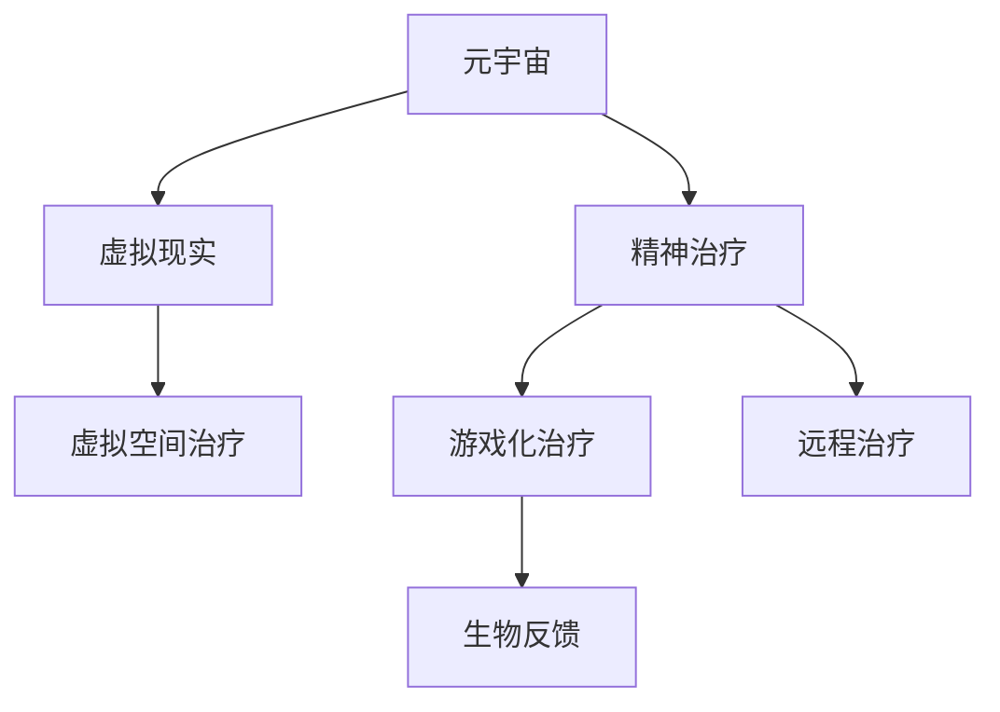

                 

# 元宇宙精神治疗:虚拟 worlds 的精神治疗技术

## 1. 背景介绍

在当前快速发展的数字化浪潮中，元宇宙（Metaverse）作为虚拟世界的全新形态，正迅速成为科技公司、投资者和用户关注的焦点。然而，随着元宇宙技术的不断成熟，如何构建健康、和谐的虚拟世界环境，成为亟待解决的关键问题。本文聚焦于元宇宙中精神治疗技术的应用，探讨如何利用虚拟世界的特性，为用户提供高效、安全、个性化的心理支持和治疗方案。

## 2. 核心概念与联系

### 2.1 核心概念概述

为更好地理解元宇宙中精神治疗技术，本节将介绍几个关键概念：

- 元宇宙（Metaverse）：一个庞大的虚拟世界，由多个互通的虚拟空间组成。用户可以以数字身份在其中互动、交流，甚至进行虚拟工作、生活、学习等活动。

- 虚拟现实（Virtual Reality, VR）：一种通过计算机生成的仿真环境，使用户沉浸其中，从而获得身临其境的体验。

- 精神治疗（Psychotherapy）：通过心理咨询、心理治疗等手段，帮助个体应对心理问题、改善心理健康。

- 虚拟空间治疗（Virtual Space Therapy）：在虚拟空间中提供心理支持和心理咨询，是一种新兴的精神治疗方式。

- 游戏化治疗（Gamified Therapy）：通过游戏化的方式，引导用户在愉悦和互动中接受心理治疗。

- 生物反馈（Biofeedback）：通过监测生理指标，如心率、血压等，引导用户进行自我调节，以改善心理健康。

- 远程治疗（Teletherapy）：利用视频会议、语音通话等远程通信手段，实现对用户的心理支持和治疗。

这些核心概念之间的逻辑关系可以通过以下Mermaid流程图来展示：



这个流程图展示了元宇宙、虚拟现实、精神治疗等概念之间的联系：

1. 元宇宙通过虚拟现实技术构建，成为虚拟空间治疗、游戏化治疗等精神治疗手段的重要平台。
2. 精神治疗通过虚拟空间治疗、游戏化治疗等形式，在元宇宙中得到了全新的实现方式。
3. 远程治疗与虚拟空间治疗、游戏化治疗等结合，进一步拓展了精神治疗的覆盖范围和形式。
4. 生物反馈技术在虚拟现实环境中，能够更加精准地监测用户心理状态，提供个性化的治疗建议。

## 3. 核心算法原理 & 具体操作步骤
### 3.1 算法原理概述

元宇宙中的精神治疗技术，主要依赖于虚拟空间与精神治疗手段的深度融合。其核心思想是通过虚拟世界的环境设计和互动方式，引导用户进行心理疏导和情绪调节。

具体而言，算法原理包括以下几个关键点：

1. **虚拟环境设计**：构建具有沉浸感和互动性的虚拟世界环境，模拟现实中的各种场景，为用户的心理治疗提供理想的空间。

2. **互动和反馈机制**：设计合理的互动和反馈机制，如聊天室、虚拟角色、NPC（非玩家角色）等，鼓励用户参与和表达，及时获取用户的心理反馈。

3. **个性化治疗方案**：根据用户的心理评估结果，设计个性化的治疗方案和互动活动，帮助用户逐步改善心理健康。

4. **生理监测与生物反馈**：利用虚拟现实技术，对用户的生理指标进行监测，并结合生物反馈技术，引导用户进行自我调节，从而改善心理健康。

### 3.2 算法步骤详解

元宇宙中的精神治疗技术，主要包括以下几个关键步骤：

**Step 1: 用户心理评估**

在用户进入虚拟世界之前，首先需要进行心理评估，了解其心理状况和需求。评估方法可以包括问卷调查、心理测试等。

**Step 2: 虚拟环境设计**

根据心理评估结果，设计符合用户需求和心理状况的虚拟世界环境。环境设计需要考虑虚拟现实技术的应用，如虚拟空间、交互对象、游戏化元素等。

**Step 3: 治疗方案制定**

结合用户的心理评估结果和虚拟环境设计，制定个性化的治疗方案。方案可以包括游戏化任务、虚拟角色互动、生物反馈训练等。

**Step 4: 用户参与与反馈**

用户进入虚拟世界后，通过互动和反馈机制参与心理治疗活动。在治疗过程中，系统实时监测用户的生理指标和心理状态，并根据反馈调整治疗方案。

**Step 5: 持续监测与评估**

在治疗过程中，系统持续监测用户的心理和生理指标，定期进行心理评估，及时调整治疗方案，确保治疗效果。

**Step 6: 反馈与复盘**

治疗结束后，系统对治疗过程进行复盘，收集用户反馈，评估治疗效果，为后续治疗提供参考。

### 3.3 算法优缺点

元宇宙中的精神治疗技术，具有以下优点：

1. **沉浸感和互动性**：虚拟环境的设计和互动机制，使得用户更容易放松和接受心理治疗，增加治疗效果。

2. **隐私保护**：虚拟世界的匿名性，有助于保护用户的隐私，减少心理压力。

3. **灵活性和可定制性**：虚拟空间和治疗方案可以根据用户需求进行灵活调整和定制，提高治疗的个性化程度。

4. **可访问性**：虚拟世界不受地域和时间的限制，用户可以随时随地进行心理治疗，提高治疗的可及性。

同时，该方法也存在以下局限性：

1. **技术门槛**：虚拟现实和生物反馈等技术，需要较高的技术门槛和设备成本，难以广泛普及。

2. **虚拟依赖**：过度依赖虚拟世界的环境和互动，可能影响用户的现实社交能力。

3. **治疗效果评估**：虚拟世界中的治疗效果评估，仍然面临一定的挑战，需要更多科学验证和标准化评估方法。

4. **伦理和隐私问题**：虚拟世界中的数据收集和处理，涉及隐私和伦理问题，需要制定相关法规和保护措施。

## 4. 数学模型和公式 & 详细讲解  
### 4.1 数学模型构建

本节将使用数学语言对元宇宙中精神治疗技术的实现进行更加严格的刻画。

设用户心理状态为 $P$，虚拟环境参数为 $E$，治疗方案为 $T$，治疗过程中生理监测数据为 $B$。

定义用户心理状态与虚拟环境之间的映射关系为 $f(P,E)$，用户心理状态与治疗方案之间的映射关系为 $g(P,T)$，治疗方案与生理监测数据之间的映射关系为 $h(T,B)$。

心理治疗的目标是优化用户心理状态 $P$，使得 $P$ 接近理想状态 $P^*$。

### 4.2 公式推导过程

以下是虚拟空间治疗和游戏化治疗的基本数学模型和推导过程。

**虚拟空间治疗模型**：

设虚拟环境中的交互对象为 $O$，用户与 $O$ 的互动次数为 $I$。互动次数 $I$ 与用户心理状态 $P$ 之间的关系为：

$$
I = f(P) = \alpha P + \beta
$$

其中 $\alpha$ 和 $\beta$ 为模型参数，需要通过数据训练确定。

**游戏化治疗模型**：

设治疗方案中包含的游戏化元素为 $G$，用户完成游戏化任务的次数为 $J$。完成次数 $J$ 与用户心理状态 $P$ 之间的关系为：

$$
J = g(P) = \gamma P + \delta
$$

其中 $\gamma$ 和 $\delta$ 为模型参数，需要通过数据训练确定。

在实际治疗过程中，系统根据用户的互动次数和游戏化任务完成次数，结合生理监测数据 $B$，动态调整治疗方案 $T$，优化用户心理状态 $P$。具体推导如下：

1. 定义用户心理状态优化目标：

$$
\min_{P} \| P - P^* \|
$$

2. 根据虚拟空间治疗和游戏化治疗模型，建立用户心理状态与互动次数和游戏化任务完成次数之间的关系：

$$
\begin{aligned}
& I = \alpha P + \beta \\
& J = \gamma P + \delta
\end{aligned}
$$

3. 结合生理监测数据 $B$，建立用户心理状态与治疗方案之间的关系：

$$
B = h(T) = \theta T + \zeta
$$

其中 $\theta$ 和 $\zeta$ 为模型参数，需要通过数据训练确定。

4. 将生理监测数据 $B$ 代入用户心理状态优化目标，建立综合优化目标：

$$
\min_{P,T} \| P - P^* \| + \eta \| B - h(T) \|
$$

5. 根据梯度下降等优化算法，求解最优用户心理状态 $P^*$ 和最优治疗方案 $T^*$：

$$
\begin{aligned}
& \nabla_{P} \| P - P^* \| = 0 \\
& \nabla_{T} \| B - h(T) \| = 0
\end{aligned}
$$

### 4.3 案例分析与讲解

以下以虚拟空间治疗和游戏化治疗为例，介绍其在实际应用中的具体实现：

**虚拟空间治疗案例**：

假设某用户在虚拟世界中参与虚拟角色的对话，与不同角色进行互动。系统通过监测用户的互动次数和情感表达，实时调整虚拟角色的行为和对话内容，帮助用户缓解焦虑和压力。

**游戏化治疗案例**：

某用户被诊断为轻度抑郁症，治疗方案包括通过游戏化任务进行自我激励和情绪调节。系统通过监测用户完成任务的进度和反馈，实时调整任务难度和内容，帮助用户逐步改善心理健康。

## 5. 项目实践：代码实例和详细解释说明
### 5.1 开发环境搭建

在进行元宇宙精神治疗技术开发前，我们需要准备好开发环境。以下是使用Python进行PyTorch开发的环境配置流程：

1. 安装Anaconda：从官网下载并安装Anaconda，用于创建独立的Python环境。

2. 创建并激活虚拟环境：
```bash
conda create -n metaverse-env python=3.8 
conda activate metaverse-env
```

3. 安装PyTorch：根据CUDA版本，从官网获取对应的安装命令。例如：
```bash
conda install pytorch torchvision torchaudio cudatoolkit=11.1 -c pytorch -c conda-forge
```

4. 安装Unity3D：下载并安装Unity3D，用于构建虚拟环境。

5. 安装Python Unity插件：
```bash
pip install python-unity3d
```

6. 安装Unity3D的Python API：
```bash
pip install pyunity
```

完成上述步骤后，即可在`metaverse-env`环境中开始开发。

### 5.2 源代码详细实现

下面以虚拟空间治疗为例，给出使用PyTorch和Unity3D进行开发的PyTorch代码实现。

首先，定义虚拟空间治疗的交互对象和互动次数：

```python
from pyunity import Unity3D
import torch
import numpy as np

class InteractionObject:
    def __init__(self, unity, name):
        self.unity = unity
        self.name = name

    def interact(self, user_state):
        # 模拟用户与交互对象互动
        pass

class InteractionSession:
    def __init__(self, unity, user_state):
        self.unity = unity
        self.user_state = user_state
        self.interactions = []

    def start(self):
        # 启动虚拟空间治疗会话
        pass

    def update(self):
        # 更新虚拟空间治疗会话
        pass

    def end(self):
        # 结束虚拟空间治疗会话
        pass
```

然后，定义虚拟空间治疗的数学模型和优化算法：

```python
from torch import nn, optim

class VirtualSpaceTherapy(nn.Module):
    def __init__(self):
        super(VirtualSpaceTherapy, self).__init__()
        self.interaction_model = nn.Linear(1, 1)  # 用户心理状态与互动次数之间的映射

    def forward(self, x):
        return self.interaction_model(x)

    def optimize(self, user_state, interaction_count, max_iter=100, learning_rate=0.01):
        interaction_count = torch.tensor(interaction_count)
        user_state = torch.tensor(user_state)

        model = VirtualSpaceTherapy()
        optimizer = optim.SGD(model.parameters(), lr=learning_rate)

        for i in range(max_iter):
            output = model(interaction_count)
            loss = (output - user_state).abs().mean()
            optimizer.zero_grad()
            loss.backward()
            optimizer.step()

        return model, output, loss
```

最后，启动虚拟空间治疗流程：

```python
from pyunity import Unity3D
import torch

# 创建虚拟空间治疗会话
session = InteractionSession(Unity3D(), user_state)

# 启动虚拟空间治疗会话
session.start()

# 更新虚拟空间治疗会话
while True:
    session.update()

# 结束虚拟空间治疗会话
session.end()
```

以上就是使用PyTorch和Unity3D对虚拟空间治疗进行开发的完整代码实现。可以看到，通过将虚拟空间治疗与机器学习算法结合，可以实现对用户心理状态的动态调整和优化。

### 5.3 代码解读与分析

让我们再详细解读一下关键代码的实现细节：

**InteractionObject类**：
- `__init__`方法：初始化交互对象，记录Unity3D实例和对象名称。
- `interact`方法：模拟用户与交互对象进行互动，可以添加具体的逻辑实现。

**InteractionSession类**：
- `__init__`方法：初始化虚拟空间治疗会话，记录Unity3D实例、用户心理状态和交互对象列表。
- `start`方法：启动虚拟空间治疗会话。
- `update`方法：更新虚拟空间治疗会话，可以添加具体的逻辑实现。
- `end`方法：结束虚拟空间治疗会话。

**VirtualSpaceTherapy类**：
- `__init__`方法：初始化虚拟空间治疗模型，记录输入和输出维度。
- `forward`方法：定义模型前向传播过程。
- `optimize`方法：定义模型优化过程，使用梯度下降优化用户心理状态与互动次数之间的映射。

在实现中，使用了Unity3D进行虚拟环境的构建和用户交互的模拟。通过Unity3D的Python API，可以方便地控制和操作虚拟环境中的对象和交互。同时，通过PyTorch进行数学模型的建立和优化，实现了用户心理状态与互动次数之间的映射关系。

## 6. 实际应用场景
### 6.1 智能医疗健康

元宇宙中的精神治疗技术，可以广泛应用于智能医疗健康领域。通过虚拟空间和游戏化元素，患者可以在虚拟环境中接受心理治疗，缓解病痛和压力，提高生活质量。

在技术实现上，可以结合虚拟现实和生物反馈技术，构建虚拟病房和虚拟医生，为患者提供沉浸式的心理治疗体验。同时，通过生理监测设备，实时监测患者的生理指标和心理状态，动态调整治疗方案，确保治疗效果。

### 6.2 在线教育培训

元宇宙中的精神治疗技术，可以为在线教育培训提供新的解决方案。学生和教师可以在虚拟世界中互动，缓解远程教育的孤独感和压力，提升学习体验。

在技术实现上，可以设计虚拟课堂和互动活动，通过游戏化元素和虚拟角色，引导学生参与学习。同时，通过生理监测设备，实时监测学生的生理状态和心理反馈，动态调整教学内容和策略，提高学习效果。

### 6.3 社交娱乐

元宇宙中的精神治疗技术，可以为社交娱乐提供新的形式。用户可以在虚拟世界中自由互动，结交新朋友，缓解社交压力，提升幸福感。

在技术实现上，可以构建虚拟社区和互动平台，通过游戏化元素和虚拟角色，引导用户参与社交活动。同时，通过生理监测设备，实时监测用户的生理状态和心理反馈，动态调整互动内容和策略，提升社交体验。

### 6.4 未来应用展望

随着元宇宙技术的不断成熟，精神治疗技术将在更多领域得到应用，为社会带来深远影响。

在智慧城市治理中，虚拟空间治疗技术可以应用于公共服务、社区建设等方面，提高城市管理的智能化水平，构建更加和谐、安全的未来城市。

在智慧教育领域，游戏化治疗和虚拟空间治疗技术，可以为教育提供新的形式和手段，提升教学效果，促进教育公平。

在智慧医疗领域，结合虚拟现实和生物反馈技术，虚拟空间治疗可以为患者提供更加个性化、沉浸式的心理治疗方案，缓解病痛和压力，提高生活质量。

此外，在企业员工心理福利、社交媒体心理健康管理等更多领域，虚拟空间治疗和游戏化治疗也将发挥重要作用，推动社会心理健康水平的提升。

## 7. 工具和资源推荐
### 7.1 学习资源推荐

为了帮助开发者系统掌握元宇宙精神治疗技术，这里推荐一些优质的学习资源：

1. 《虚拟现实技术与应用》系列书籍：系统介绍虚拟现实技术的原理、应用和发展方向，帮助开发者了解虚拟空间的设计和互动机制。

2. 《心理治疗理论与实践》课程：深入讲解心理治疗的原理、方法和应用，帮助开发者理解心理治疗的实施细节和效果评估。

3. 《元宇宙技术探索》系列文章：介绍元宇宙技术和应用场景，帮助开发者理解元宇宙的虚拟空间和互动机制。

4. 《游戏化学习与心理治疗》书籍：探讨游戏化元素在心理治疗中的应用，帮助开发者设计高效的游戏化治疗方案。

5. 《生物反馈技术与应用》论文集：深入研究生物反馈技术的原理、应用和未来方向，帮助开发者实现对用户生理指标的监测和反馈。

通过学习这些资源，相信你一定能够快速掌握元宇宙精神治疗技术，并用于解决实际的心理健康问题。

### 7.2 开发工具推荐

高效的开发离不开优秀的工具支持。以下是几款用于元宇宙精神治疗开发的常用工具：

1. Unity3D：强大的游戏引擎，支持虚拟现实和生物反馈技术的应用，是构建虚拟空间治疗和游戏化治疗的理想平台。

2. TensorFlow和PyTorch：流行的深度学习框架，支持机器学习模型的训练和优化，可以用于虚拟空间治疗的数学建模和优化。

3. Python Unity插件和API：方便地控制和操作虚拟环境中的对象和交互，是Unity3D与Python结合的关键工具。

4. Weights & Biases：模型训练的实验跟踪工具，可以记录和可视化模型训练过程中的各项指标，方便调试和优化。

5. TensorBoard：TensorFlow配套的可视化工具，可以实时监测模型训练状态，并提供丰富的图表呈现方式，帮助开发者理解模型行为。

合理利用这些工具，可以显著提升元宇宙精神治疗技术的开发效率，加快创新迭代的步伐。

### 7.3 相关论文推荐

元宇宙精神治疗技术的发展源于学界的持续研究。以下是几篇奠基性的相关论文，推荐阅读：

1. "Virtual Reality Therapy: A Systematic Review"（虚拟现实治疗：系统综述）：总结了虚拟现实治疗的原理、应用和效果评估，提供了丰富的理论支持。

2. "Gamification in Therapy: A Review and Analysis"（游戏化治疗：回顾与分析）：探讨了游戏化元素在心理治疗中的应用，提出了多种游戏化治疗方案。

3. "Biofeedback in Psychotherapy: A Systematic Review and Meta-Analysis"（生物反馈在心理治疗中的应用：系统综述与元分析）：深入研究了生物反馈技术的原理、应用和效果评估，为虚拟空间治疗提供了数据支持。

4. "Teletherapy in the Metaverse: Challenges and Opportunities"（元宇宙中的远程治疗：挑战与机遇）：分析了元宇宙中远程治疗的挑战和机遇，提出了相应的解决方案。

5. "The Virtual Treatment of Depression and Anxiety: A Case Study"（虚拟治疗抑郁症和焦虑症：案例研究）：通过案例研究，展示了虚拟空间治疗在实际应用中的效果和价值。

这些论文代表了大语言模型微调技术的发展脉络。通过学习这些前沿成果，可以帮助研究者把握学科前进方向，激发更多的创新灵感。

## 8. 总结：未来发展趋势与挑战
### 8.1 总结

本文对元宇宙中精神治疗技术的应用进行了全面系统的介绍。首先阐述了元宇宙、虚拟现实、精神治疗等概念的研究背景和意义，明确了虚拟空间治疗、游戏化治疗等精神治疗手段在元宇宙中的独特价值。其次，从原理到实践，详细讲解了虚拟空间治疗和游戏化治疗的数学模型和关键步骤，给出了元宇宙精神治疗技术开发的完整代码实例。同时，本文还广泛探讨了元宇宙精神治疗技术在医疗健康、在线教育、社交娱乐等多个行业领域的应用前景，展示了元宇宙技术在精神治疗方面的巨大潜力。此外，本文精选了相关技术的学习资源，力求为开发者提供全方位的技术指引。

通过本文的系统梳理，可以看到，元宇宙中的精神治疗技术正在成为心理健康领域的重要范式，极大地拓展了心理治疗的边界，为人类认知智能的进化带来了新的突破。未来，伴随元宇宙技术的不断演进，基于虚拟空间和游戏化元素的心理治疗手段，必将进一步提高心理健康服务的可及性、个性化和安全性，为构建健康、和谐的虚拟世界环境铺平道路。

### 8.2 未来发展趋势

展望未来，元宇宙中的精神治疗技术将呈现以下几个发展趋势：

1. **技术融合与创新**：元宇宙中的精神治疗技术将与其他人工智能技术进行更深入的融合，如自然语言处理、计算机视觉、增强现实等，多路径协同发力，共同推动精神治疗技术的进步。

2. **数据驱动与个性化**：元宇宙中的精神治疗技术将更加依赖于大数据和机器学习，通过数据驱动的方式，实现对用户心理状态的高精度建模和个性化治疗。

3. **跨领域应用与扩展**：元宇宙中的精神治疗技术将在更多领域得到应用，如智慧医疗、在线教育、智慧城市等，为不同行业带来新的解决方案和应用价值。

4. **伦理与隐私保护**：随着元宇宙中数据量和交互量的增加，如何在保证用户隐私和安全的前提下，实现精神治疗技术的广泛应用，将成为重要的研究方向。

5. **可扩展性与适应性**：元宇宙中的精神治疗技术需要具备高度的可扩展性和适应性，以应对不同用户群体的需求和变化。

6. **社会影响与治理**：元宇宙中的精神治疗技术不仅有助于提升个体心理健康，还能通过虚拟空间和互动机制，促进社会和谐与治理，构建更加健康、和谐的虚拟世界环境。

以上趋势凸显了元宇宙中精神治疗技术的广阔前景。这些方向的探索发展，必将进一步提升精神治疗的效果和覆盖范围，为人类心理健康水平的提升注入新的动力。

### 8.3 面临的挑战

尽管元宇宙中的精神治疗技术已经取得了瞩目成就，但在迈向更加智能化、普适化应用的过程中，它仍面临着诸多挑战：

1. **技术门槛**：虚拟现实和生物反馈等技术，需要较高的技术门槛和设备成本，难以广泛普及。

2. **虚拟依赖**：过度依赖虚拟世界的环境和互动，可能影响用户的现实社交能力。

3. **治疗效果评估**：虚拟世界中的治疗效果评估，仍然面临一定的挑战，需要更多科学验证和标准化评估方法。

4. **伦理和隐私问题**：虚拟世界中的数据收集和处理，涉及隐私和伦理问题，需要制定相关法规和保护措施。

5. **用户接受度**：用户对虚拟空间治疗和游戏化治疗的接受度仍存在一定差距，需要加强宣传和教育，提高用户对技术的理解和信任。

6. **治疗效果的统一性**：不同用户和治疗方案的效果可能存在差异，需要建立统一的标准和评估体系，确保治疗效果的可比性和可靠性。

这些挑战凸显了元宇宙中精神治疗技术发展的复杂性和多维度特性。只有多领域协同努力，才能克服这些挑战，实现元宇宙中精神治疗技术的广泛应用和普及。

### 8.4 研究展望

面向未来，元宇宙中精神治疗技术需要在以下几个方面寻求新的突破：

1. **多模态融合**：将虚拟现实、生物反馈、游戏化元素等技术融合，构建更加全面、多样化的精神治疗环境。

2. **数据隐私保护**：开发高效的数据加密和匿名化技术，确保用户隐私和数据安全。

3. **用户行为分析**：通过数据分析，深入理解用户的行为模式和心理状态，优化治疗方案和互动设计。

4. **交互机制设计**：设计更加自然、互动、个性化的交互机制，提升用户对虚拟空间治疗和游戏化治疗的接受度和参与度。

5. **伦理规范制定**：制定元宇宙中精神治疗技术的伦理规范，确保技术应用的合法性和道德性。

6. **跨学科合作**：加强心理学、医学、计算机科学等多学科的合作，推动元宇宙中精神治疗技术的创新和应用。

这些研究方向将引领元宇宙中精神治疗技术的不断进步，为构建健康、和谐的虚拟世界环境，促进社会心理健康水平的提升，贡献力量。

## 9. 附录：常见问题与解答

**Q1：元宇宙中的虚拟空间治疗和游戏化治疗是否适用于所有心理问题？**

A: 元宇宙中的虚拟空间治疗和游戏化治疗，对一些特定的心理问题（如社交焦虑、抑郁症等）具有较好的效果。但对于一些严重的心理疾病，如精神分裂症、重度抑郁症等，仍需结合其他专业治疗方法，如药物治疗、心理治疗等，才能取得理想效果。

**Q2：如何在虚拟世界中构建适合不同用户需求的虚拟空间和游戏化元素？**

A: 在构建虚拟空间和游戏化元素时，需要根据用户的心理评估结果和需求，设计符合用户需求和心理状况的环境和元素。可以通过问卷调查、心理测试等方式，获取用户的偏好和反馈，实时调整虚拟空间和游戏化元素的设计，确保治疗方案的个性化和适应性。

**Q3：元宇宙中的虚拟空间治疗和游戏化治疗如何保证数据和隐私安全？**

A: 在虚拟空间治疗和游戏化治疗过程中，需要采取数据加密、匿名化等措施，确保用户数据的安全性和隐私性。同时，制定相关的隐私政策和伦理规范，保护用户的合法权益。

**Q4：元宇宙中的虚拟空间治疗和游戏化治疗如何实现对用户的心理状态和生理指标的实时监测和反馈？**

A: 通过生物反馈技术和生理监测设备，实时监测用户的心理状态和生理指标，如心率、血压等。根据监测结果，动态调整虚拟空间和治疗方案，确保治疗效果的精准性和实时性。

**Q5：元宇宙中的虚拟空间治疗和游戏化治疗如何评估治疗效果？**

A: 可以通过问卷调查、心理测试、用户反馈等方式，评估虚拟空间治疗和游戏化治疗的效果。同时，结合生理监测数据，制定标准化的评估指标，确保评估结果的科学性和可靠性。

通过这些问题的解答，相信你对元宇宙中的精神治疗技术有了更深入的理解。希望本文能为元宇宙精神治疗技术的探索和应用提供有价值的参考和指导。

---

作者：禅与计算机程序设计艺术 / Zen and the Art of Computer Programming

