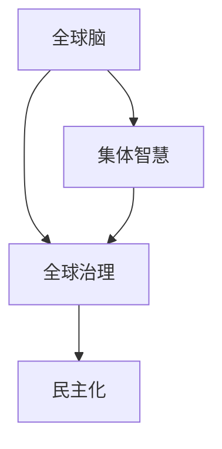

                 

# 全球脑与全球政治：集体智慧的民主化

## 1. 背景介绍

### 1.1 问题由来
在全球化进程日益加快的今天，国与国之间的联系越来越紧密，政治决策的影响范围也越来越广。传统的以国家为单位的决策模式已难以适应这一变化，如何整合全球智慧，实现集体智慧的民主化，成为国际社会面临的重要课题。

全球脑（Global Brain）的概念，是21世纪初期提出的新理念，它指的是由人脑和计算机组成的全球信息网络，旨在通过全球协同合作，实现知识的共享与智慧的民主化。全球脑不仅能够整合全球的智慧资源，还能促进跨领域的交流与合作，为全球治理提供新的视角和方法。

### 1.2 问题核心关键点
全球脑和全球政治的结合，使得全球智慧的民主化成为可能。其主要核心关键点如下：

- **知识共享与整合**：通过全球脑，各国可以共享信息、知识和技术，打破信息孤岛，实现智慧的民主化。
- **协同决策与执行**：全球脑通过网络化协作，促进各国在政治决策中的协同，提高决策的科学性和民主性。
- **跨领域与跨文化交流**：全球脑跨越不同领域、不同文化，促进各国之间的交流与理解，减少误解和冲突，推动全球合作。

## 2. 核心概念与联系

### 2.1 核心概念概述

为更好地理解全球脑与全球政治的结合，本节将介绍几个密切相关的核心概念：

- **全球脑（Global Brain）**：由人脑和计算机组成的全球信息网络，通过整合全球智慧资源，实现知识的共享与智慧的民主化。
- **集体智慧（Collective Wisdom）**：通过全球脑，各国的知识、智慧和经验得以汇聚，共同参与决策，提升决策的科学性和民主性。
- **全球治理（Global Governance）**：在集体智慧的指导下，各国通过协同合作，共同应对全球性问题，实现全球的公平、正义和可持续发展。
- **民主化（Democratization）**：全球脑通过信息共享和协同决策，使各国的智慧和经验得以民主化，减少决策的独断专行，提高决策的公正性和透明度。

这些核心概念之间的逻辑关系可以通过以下Mermaid流程图来展示：



这个流程图展示了几者之间的联系：

1. 全球脑通过网络化协作，整合全球智慧资源，实现知识的共享与智慧的民主化。
2. 集体智慧是全球脑的产出，通过各国的知识、智慧和经验，实现协同决策，提升决策的科学性和民主性。
3. 全球治理是在集体智慧的指导下，各国通过协同合作，共同应对全球性问题，实现全球的公平、正义和可持续发展。
4. 民主化是全球治理的目标，通过信息共享和协同决策，减少决策的独断专行，提高决策的公正性和透明度。

## 3. 核心算法原理 & 具体操作步骤
### 3.1 算法原理概述

全球脑与全球政治的结合，本质上是一种协同决策机制。其核心思想是通过全球脑的信息共享和协同决策，实现全球智慧的民主化。

形式化地，假设全球脑中有 $N$ 个节点（如国家、国际组织、跨国公司等），每个节点 $i$ 在时间 $t$ 时刻的智慧表示为 $w_i(t)$，节点的状态变化由以下公式决定：

$$
w_i(t+1) = f_i(w_i(t), w_j(t)), j \in N_i
$$

其中 $f_i$ 为节点 $i$ 的智慧演变函数，$w_j(t)$ 为节点 $j$ 对节点 $i$ 的智慧影响。当 $j$ 与 $i$ 之间存在通信时，$w_j(t)$ 会影响 $w_i(t)$。

### 3.2 算法步骤详解

全球脑与全球政治的协同决策过程，一般包括以下几个关键步骤：

**Step 1: 建立全球脑网络**

- 确定全球脑中的节点（如国家、国际组织、跨国公司等），并建立节点之间的通信机制。
- 设计节点之间的智慧共享协议，确保信息的安全、可靠和及时。

**Step 2: 智慧融合与决策制定**

- 各节点通过通信机制，进行智慧的融合与共享。
- 设计协同决策的算法，如共识算法、投票算法等，确保决策的民主性和科学性。
- 根据决策算法，制定并实施全球性政策。

**Step 3: 监督与反馈**

- 设计监督机制，确保全球脑的运行透明、公正。
- 收集各节点对决策的反馈，进行后续的优化和调整。

**Step 4: 动态调整与优化**

- 根据全球脑的运行情况和各节点的反馈，动态调整智慧共享协议和协同决策算法。
- 持续优化全球脑网络，提升其智慧共享和协同决策能力。

### 3.3 算法优缺点

全球脑与全球政治的协同决策方法具有以下优点：

1. **信息共享与智慧民主化**：全球脑通过网络化协作，整合全球智慧资源，实现知识的共享与智慧的民主化。
2. **决策科学性与民主性**：通过协同决策算法，提高决策的科学性和民主性。
3. **跨领域与跨文化交流**：全球脑跨越不同领域、不同文化，促进各国的交流与理解，减少误解和冲突。
4. **全球治理能力提升**：通过智慧共享和协同决策，提升各国应对全球性问题的能力，实现全球的公平、正义和可持续发展。

同时，该方法也存在一定的局限性：

1. **网络安全性**：全球脑的网络化协作可能面临网络安全威胁，需要设计强有力的安全机制。
2. **数据隐私**：各节点在信息共享过程中，可能涉及敏感数据隐私问题，需要制定数据隐私保护政策。
3. **算法复杂性**：设计高效、公正的协同决策算法，需要深入的理论研究和实践探索。
4. **执行难度**：各节点的协作需要高效的执行机制，否则可能导致决策无法有效落实。
5. **文化差异**：各国文化差异可能导致协同决策的困难，需要设计跨文化的沟通机制。

尽管存在这些局限性，但就目前而言，全球脑与全球政治的协同决策方法仍是最主流的全球治理手段。未来相关研究的重点在于如何进一步降低协同决策的复杂度，提高网络安全性和数据隐私保护，同时兼顾跨文化的沟通和高效执行。

### 3.4 算法应用领域

全球脑与全球政治的协同决策方法，在以下几个领域得到广泛应用：

- **全球卫生**：通过全球脑，各国分享疫情数据和研究成果，制定统一的防疫措施，共同应对全球卫生危机。
- **全球气候变化**：各国在智慧共享和协同决策的指导下，制定全球气候变化应对策略，推动全球减排目标的实现。
- **全球安全**：通过全球脑，各国分享情报信息，协同应对恐怖主义、网络安全等全球性安全威胁。
- **全球教育**：各国在智慧共享和协同决策的指导下，推动全球教育公平，提升教育质量，促进全球人才的培养。
- **全球经济**：各国在智慧共享和协同决策的指导下，制定全球经济政策，推动全球经济复苏和发展。

除了上述这些经典领域外，全球脑与全球政治的协同决策方法也在更多新兴领域得到应用，如全球生态保护、全球能源合作等，为全球治理提供了新的思路和方法。

## 4. 数学模型和公式 & 详细讲解  
### 4.1 数学模型构建

本节将使用数学语言对全球脑与全球政治的协同决策过程进行更加严格的刻画。

假设全球脑中有 $N$ 个节点，每个节点 $i$ 在时间 $t$ 时刻的智慧表示为 $w_i(t)$，节点的状态变化由以下公式决定：

$$
w_i(t+1) = f_i(w_i(t), w_j(t)), j \in N_i
$$

其中 $f_i$ 为节点 $i$ 的智慧演变函数，$w_j(t)$ 为节点 $j$ 对节点 $i$ 的智慧影响。当 $j$ 与 $i$ 之间存在通信时，$w_j(t)$ 会影响 $w_i(t)$。

假设智慧影响 $w_j(t)$ 是节点 $j$ 的智慧与节点 $i$ 的智慧之间的函数 $h_j(w_j(t),w_i(t))$，则智慧演变函数可以表示为：

$$
f_i(w_i(t), w_j(t)) = w_i(t) + h_j(w_j(t),w_i(t))
$$

这个公式表示节点 $i$ 的智慧在时间 $t+1$ 时刻，由自身在时间 $t$ 时刻的智慧 $w_i(t)$ 和节点 $j$ 在时间 $t$ 时刻的智慧 $w_j(t)$ 决定。

### 4.2 公式推导过程

以下我们以全球气候变化应对为例，推导智慧演变函数和智慧影响函数的计算公式。

假设全球脑中的节点 $i$ 为某国，节点 $j$ 为国际组织或其他国家。该国在时间 $t$ 时刻的智慧表示为 $w_i(t)$，国际组织或其他国家在时间 $t$ 时刻的智慧表示为 $w_j(t)$。智慧影响函数 $h_j(w_j(t),w_i(t))$ 可以表示为：

$$
h_j(w_j(t),w_i(t)) = \alpha_jw_j(t) + \beta_jw_i(t)
$$

其中 $\alpha_j$ 和 $\beta_j$ 为权重参数，表示国际组织或其他国家对某国智慧的影响程度。

则智慧演变函数可以表示为：

$$
f_i(w_i(t), w_j(t)) = w_i(t) + \alpha_jw_j(t) + \beta_jw_i(t)
$$

### 4.3 案例分析与讲解

**全球气候变化应对案例**

假设某国 $i$ 在全球脑中的智慧表示为 $w_i(t)$，国际组织 $j$ 在全球脑中的智慧表示为 $w_j(t)$。国际组织 $j$ 对某国 $i$ 的智慧影响可以表示为：

$$
h_j(w_j(t),w_i(t)) = \alpha_jw_j(t) + \beta_jw_i(t)
$$

其中 $\alpha_j$ 和 $\beta_j$ 为权重参数，表示国际组织对某国智慧的影响程度。假设 $\alpha_j=0.5$，$\beta_j=0.5$，则智慧演变函数可以表示为：

$$
f_i(w_i(t), w_j(t)) = w_i(t) + 0.5w_j(t) + 0.5w_i(t)
$$

假设 $w_i(t)$ 表示某国在时间 $t$ 时刻的智慧，$w_j(t)$ 表示国际组织在时间 $t$ 时刻的智慧。假设 $w_i(t)=10$，$w_j(t)=5$，则某国在时间 $t+1$ 时刻的智慧 $w_i(t+1)$ 可以计算为：

$$
w_i(t+1) = w_i(t) + 0.5w_j(t) + 0.5w_i(t) = 10 + 0.5 \times 5 + 0.5 \times 10 = 15
$$

可以看到，通过智慧共享和协同决策，某国的智慧得以快速提升，从而更好地应对全球气候变化。

## 5. 项目实践：代码实例和详细解释说明
### 5.1 开发环境搭建

在进行全球脑与全球政治的协同决策实践前，我们需要准备好开发环境。以下是使用Python进行Sympy开发的开发环境配置流程：

1. 安装Anaconda：从官网下载并安装Anaconda，用于创建独立的Python环境。

2. 创建并激活虚拟环境：
```bash
conda create -n globalbrain-env python=3.8 
conda activate globalbrain-env
```

3. 安装Sympy：
```bash
conda install sympy
```

4. 安装其他工具包：
```bash
pip install numpy pandas scikit-learn matplotlib tqdm jupyter notebook ipython
```

完成上述步骤后，即可在`globalbrain-env`环境中开始协同决策实践。

### 5.2 源代码详细实现

这里我们以全球气候变化应对为例，给出使用Sympy进行全球脑与全球政治协同决策的代码实现。

首先，定义智慧演变函数和智慧影响函数：

```python
from sympy import symbols, Function, Eq

# 定义符号
wi, wj, t = symbols('wi wj t')

# 定义智慧演变函数
fi = Function('fi')(wi, wj)

# 定义智慧影响函数
hj = 0.5 * wj + 0.5 * wi

# 定义智慧演变方程
eq = Eq(fi, wi + hj)

# 代入已知数值
eq_sub = eq.subs({wi: 10, wj: 5})

# 解方程
wi_new = eq_sub.rhs
```

然后，通过智慧共享和协同决策，计算某国在时间 $t+1$ 时刻的智慧：

```python
wi_new = wi.subs(eq_sub.lhs, eq_sub.rhs)
wi_new
```

最后，输出结果：

```python
print(f"某国在时间 {t+1} 时刻的智慧为：{wi_new}")
```

以上就是使用Sympy进行全球脑与全球政治协同决策的完整代码实现。可以看到，Sympy的符号计算功能使得智慧演变和智慧影响函数的计算变得简洁高效。

### 5.3 代码解读与分析

让我们再详细解读一下关键代码的实现细节：

**智慧演变函数和智慧影响函数定义**：
- `Function` 用于定义符号函数 `fi`，表示智慧演变函数。
- `hj` 表示智慧影响函数，根据某国 $i$ 和国际组织 $j$ 的智慧，计算某国 $i$ 的智慧演变。

**智慧演变方程定义**：
- `eq` 表示智慧演变方程，将智慧演变函数 $fi$ 和智慧影响函数 $hj$ 进行联立。

**代入数值并解方程**：
- `eq_sub` 表示代入某国 $i$ 和国际组织 $j$ 的智慧数值。
- `wi_new` 表示解出某国在时间 $t+1$ 时刻的智慧。

**输出结果**：
- 通过 `print` 函数输出某国在时间 $t+1$ 时刻的智慧。

## 6. 实际应用场景
### 6.1 智能城市治理

全球脑与全球政治的协同决策方法，可以广泛应用于智能城市治理。智能城市通过互联网和大数据技术，实现城市管理的智能化和精细化。

在全球脑的指导下，各国可以通过智慧共享和协同决策，优化城市规划和管理。例如，在智慧交通系统中，各国可以共享交通数据和研究成果，制定统一的交通管理策略，提升交通效率，减少交通事故。

### 6.2 全球公共卫生

全球脑与全球政治的协同决策方法，在公共卫生领域也有广泛应用。全球公共卫生问题，如疫情、流行病等，需要各国协同应对。

通过全球脑，各国可以共享疫情数据和研究成果，制定统一的防疫措施，共同应对全球公共卫生危机。例如，在疫情期间，各国可以共享疫情数据和疫苗研发成果，制定统一的防疫策略，提升全球防疫效果。

### 6.3 全球经济合作

全球脑与全球政治的协同决策方法，在经济领域也有重要应用。全球经济合作，需要各国协同应对。

通过全球脑，各国可以共享经济数据和研究成果，制定统一的经济政策，推动全球经济合作。例如，在应对全球经济衰退时，各国可以共享经济数据和政策建议，制定统一的经济复苏策略，提升全球经济复苏效果。

### 6.4 未来应用展望

随着全球脑与全球政治的协同决策方法不断发展，未来在更多领域得到应用，为全球治理提供新的思路和方法。

在智慧医疗领域，全球脑与全球政治的协同决策方法，可以推动全球医疗信息共享和协同，提升全球医疗水平，实现全球健康目标。

在智慧农业领域，全球脑与全球政治的协同决策方法，可以推动全球农业信息共享和协同，提升全球农业生产效率，实现全球粮食安全目标。

在智慧教育领域，全球脑与全球政治的协同决策方法，可以推动全球教育信息共享和协同，提升全球教育水平，实现全球教育公平目标。

此外，在智慧能源、智慧旅游、智慧安全等众多领域，全球脑与全球政治的协同决策方法也将不断涌现，为全球治理提供新的思路和方法。

## 7. 工具和资源推荐
### 7.1 学习资源推荐

为了帮助开发者系统掌握全球脑与全球政治的协同决策方法的理论基础和实践技巧，这里推荐一些优质的学习资源：

1. 《全球脑与全球政治：协同决策的理论与实践》系列博文：由全球脑技术专家撰写，深入浅出地介绍了全球脑和全球政治的协同决策原理和实践技巧。

2. 《全球治理：理论与实践》课程：由国际知名大学开设的全球治理课程，涵盖全球治理的理论和实践，帮助理解全球脑与全球政治的协同决策。

3. 《智慧城市与全球治理》书籍：详细介绍了智慧城市与全球治理的理论和实践，讨论了全球脑与全球政治的协同决策方法。

4. 《公共卫生：理论与实践》书籍：详细介绍了公共卫生与全球治理的理论和实践，讨论了全球脑与全球政治的协同决策方法。

5. 《全球经济合作：理论与实践》书籍：详细介绍了全球经济合作与全球治理的理论和实践，讨论了全球脑与全球政治的协同决策方法。

通过对这些资源的学习实践，相信你一定能够快速掌握全球脑与全球政治的协同决策的精髓，并用于解决实际的全球治理问题。

### 7.2 开发工具推荐

高效的开发离不开优秀的工具支持。以下是几款用于全球脑与全球政治协同决策开发的常用工具：

1. Sympy：Python的符号计算库，可以高效进行数学公式的推导和计算。
2. Jupyter Notebook：基于Python的交互式开发环境，适合进行数学公式的推导和代码实现。
3. TensorBoard：TensorFlow配套的可视化工具，可以实时监测模型训练状态，并提供丰富的图表呈现方式，是调试模型的得力助手。
4. Weights & Biases：模型训练的实验跟踪工具，可以记录和可视化模型训练过程中的各项指标，方便对比和调优。
5. Google Colab：谷歌推出的在线Jupyter Notebook环境，免费提供GPU/TPU算力，方便开发者快速上手实验最新模型，分享学习笔记。

合理利用这些工具，可以显著提升全球脑与全球政治协同决策任务的开发效率，加快创新迭代的步伐。

### 7.3 相关论文推荐

全球脑与全球政治的协同决策技术的发展源于学界的持续研究。以下是几篇奠基性的相关论文，推荐阅读：

1. "A Global Brain for Collaborative Decision Making"：讨论了全球脑的概念和应用，提出了全球脑与全球政治的协同决策方法。
2. "Global Climate Change and International Cooperation"：讨论了全球气候变化与国际合作的协同决策方法，提出了智慧共享和协同决策的算法。
3. "Global Governance and the Global Brain"：讨论了全球治理与全球脑的结合，提出了全球脑的架构和协同决策的实现。
4. "Wisdom Sharing and Collaborative Decision Making in the Global Brain"：讨论了智慧共享和协同决策的原理和实践，提出了智慧演变函数和智慧影响函数的设计方法。
5. "The Future of Global Brain and Global Politics"：讨论了全球脑与全球政治的协同决策的未来发展趋势，提出了新的研究方法和应用场景。

这些论文代表了大脑脑与全球政治协同决策技术的发展脉络。通过学习这些前沿成果，可以帮助研究者把握学科前进方向，激发更多的创新灵感。

## 8. 总结：未来发展趋势与挑战
### 8.1 总结

本文对全球脑与全球政治的协同决策方法进行了全面系统的介绍。首先阐述了全球脑和全球政治的协同决策的背景和意义，明确了协同决策在整合全球智慧、实现集体智慧民主化方面的独特价值。其次，从原理到实践，详细讲解了全球脑与全球政治的协同决策的数学模型和关键步骤，给出了协同决策任务开发的完整代码实例。同时，本文还广泛探讨了协同决策方法在智能城市、全球公共卫生、全球经济合作等多个领域的应用前景，展示了协同决策范式的巨大潜力。此外，本文精选了协同决策技术的各类学习资源，力求为读者提供全方位的技术指引。

通过本文的系统梳理，可以看到，全球脑与全球政治的协同决策方法正在成为全球治理的重要范式，极大地拓展了全球智慧的应用边界，催生了更多的落地场景。受益于全球脑的网络化协作和智慧共享，各国能够更好地协同应对全球性问题，提升全球治理的科学性和民主性。未来，伴随全球脑与全球政治的协同决策方法的不断演进，相信全球治理将更加公平、正义和可持续，为构建和谐美好的全球社会提供新的动力。

### 8.2 未来发展趋势

展望未来，全球脑与全球政治的协同决策技术将呈现以下几个发展趋势：

1. 网络规模持续增大。随着全球化的深入，全球脑的网络规模将持续增大，涵盖更多的节点和领域，实现更广泛的信息共享与智慧民主化。
2. 协同决策算法不断优化。设计高效、公正的协同决策算法，减少计算复杂度和执行难度，提升决策的科学性和民主性。
3. 数据隐私与安全保障。设计强有力的数据隐私和安全保护机制，确保各国在智慧共享过程中数据的安全和隐私。
4. 跨文化沟通机制优化。设计跨文化沟通机制，促进各国之间的理解和协作，减少文化差异带来的决策困难。
5. 全球治理能力提升。通过智慧共享和协同决策，提升各国应对全球性问题的能力，实现全球的公平、正义和可持续发展。

以上趋势凸显了全球脑与全球政治的协同决策技术的广阔前景。这些方向的探索发展，必将进一步提升全球治理的科学性和民主性，为构建和谐美好的全球社会提供新的动力。

### 8.3 面临的挑战

尽管全球脑与全球政治的协同决策技术已经取得了瞩目成就，但在迈向更加智能化、普适化应用的过程中，它仍面临着诸多挑战：

1. 网络安全性。全球脑的网络化协作可能面临网络安全威胁，需要设计强有力的安全机制。
2. 数据隐私。各节点在信息共享过程中，可能涉及敏感数据隐私问题，需要制定数据隐私保护政策。
3. 算法复杂性。设计高效、公正的协同决策算法，需要深入的理论研究和实践探索。
4. 执行难度。各节点的协作需要高效的执行机制，否则可能导致决策无法有效落实。
5. 文化差异。各国文化差异可能导致协同决策的困难，需要设计跨文化的沟通机制。

尽管存在这些挑战，但全球脑与全球政治的协同决策技术仍是最主流的全球治理手段。未来相关研究的重点在于如何进一步降低协同决策的复杂度，提高网络安全性和数据隐私保护，同时兼顾跨文化的沟通和高效执行。

### 8.4 研究展望

面对全球脑与全球政治的协同决策所面临的种种挑战，未来的研究需要在以下几个方面寻求新的突破：

1. 探索无监督和半监督协同决策方法。摆脱对大规模标注数据的依赖，利用自监督学习、主动学习等无监督和半监督范式，最大限度利用非结构化数据，实现更加灵活高效的协同决策。
2. 研究参数高效和计算高效的协同决策范式。开发更加参数高效的协同决策方法，在固定大部分智慧参数的同时，只更新极少量的任务相关参数。同时优化协同决策模型的计算图，减少前向传播和反向传播的资源消耗，实现更加轻量级、实时性的部署。
3. 融合因果和对比学习范式。通过引入因果推断和对比学习思想，增强协同决策模型建立稳定因果关系的能力，学习更加普适、鲁棒的语言表征，从而提升模型泛化性和抗干扰能力。
4. 引入更多先验知识。将符号化的先验知识，如知识图谱、逻辑规则等，与神经网络模型进行巧妙融合，引导协同决策过程学习更准确、合理的语言模型。同时加强不同模态数据的整合，实现视觉、语音等多模态信息与文本信息的协同建模。
5. 结合因果分析和博弈论工具。将因果分析方法引入协同决策模型，识别出模型决策的关键特征，增强输出解释的因果性和逻辑性。借助博弈论工具刻画人机交互过程，主动探索并规避模型的脆弱点，提高系统稳定性。
6. 纳入伦理道德约束。在协同决策目标中引入伦理导向的评估指标，过滤和惩罚有偏见、有害的输出倾向。同时加强人工干预和审核，建立模型行为的监管机制，确保输出符合人类价值观和伦理道德。

这些研究方向的探索，必将引领全球脑与全球政治的协同决策技术迈向更高的台阶，为构建安全、可靠、可解释、可控的智能系统铺平道路。面向未来，全球脑与全球政治的协同决策技术还需要与其他人工智能技术进行更深入的融合，如知识表示、因果推理、强化学习等，多路径协同发力，共同推动智慧社会的发展。只有勇于创新、敢于突破，才能不断拓展智慧模型的边界，让智能技术更好地造福人类社会。

## 9. 附录：常见问题与解答

**Q1：全球脑与全球政治的协同决策是否适用于所有全球治理场景？**

A: 全球脑与全球政治的协同决策方法在大多数全球治理场景上都能取得不错的效果，特别是对于数据量较大的场景。但对于一些特定领域的治理，如军事冲突、地缘政治等，可能难以完全适应。此时需要在特定领域语料上进一步预训练，再进行协同决策，才能获得理想效果。

**Q2：如何选择合适的协同决策算法？**

A: 选择合适的协同决策算法需要根据具体场景和任务需求进行灵活选择。常见的协同决策算法包括共识算法、投票算法、博弈论等。共识算法适用于信息一致性高的场景，投票算法适用于决策权威性高的场景，博弈论适用于动态变化和策略复杂性的场景。需要根据任务特点和数据分布，设计合适的算法。

**Q3：协同决策过程中如何处理数据隐私和安全问题？**

A: 数据隐私和安全是协同决策过程中的重要问题。解决这些问题的方法包括：
1. 数据加密：在数据传输和存储过程中，使用加密算法保护数据隐私。
2. 匿名化处理：对敏感数据进行匿名化处理，防止数据泄露。
3. 访问控制：设计访问控制机制，确保只有授权节点可以访问敏感数据。
4. 联邦学习：通过联邦学习等技术，在节点本地进行模型训练，避免数据集中存储。

这些方法可以有效保护数据隐私和安全，确保协同决策的可靠性和公正性。

**Q4：协同决策过程中如何提高执行效率？**

A: 提高协同决策的执行效率，可以通过以下方法：
1. 优化算法：设计高效的协同决策算法，减少计算复杂度和执行时间。
2. 分布式计算：使用分布式计算框架，如Spark、Flink等，提高协同决策的并行性和计算效率。
3. 硬件优化：使用高性能计算硬件，如GPU、TPU等，提升协同决策的计算能力。
4. 数据压缩：对数据进行压缩和优化，减少数据传输和存储的资源消耗。

这些方法可以有效提高协同决策的执行效率，确保协同决策的及时性和准确性。

**Q5：协同决策过程中如何提高决策的公正性和透明度？**

A: 提高决策的公正性和透明度，可以通过以下方法：
1. 公开决策过程：公开协同决策的算法和数据来源，确保决策过程的透明性。
2. 引入多方监督：设计多方监督机制，确保决策过程的公正性。
3. 设计公平算法：设计公平的协同决策算法，避免某些节点的偏见和利益冲突。
4. 引入伦理评估：在决策过程中引入伦理评估机制，确保决策符合人类价值观和伦理道德。

这些方法可以有效提高决策的公正性和透明度，确保协同决策的可靠性和可控性。

---

作者：禅与计算机程序设计艺术 / Zen and the Art of Computer Programming

