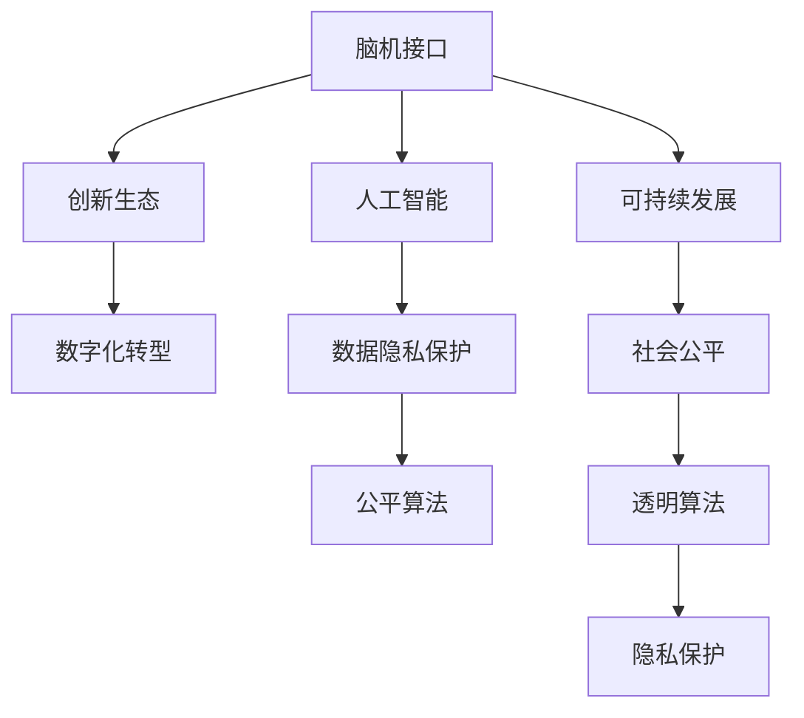
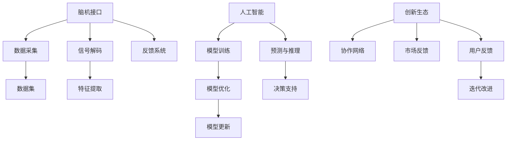

                 

# 全球脑与创新生态：加速人类进步的引擎

> 关键词：
脑机接口,创新生态,数字化转型,人工智能,可持续发展

## 1. 背景介绍

在现代科技的引领下，我们正处于一个全新的历史阶段——数字化时代。数据、算法、计算资源已经逐步成为驱动社会进步的核心力量。然而，即便在数字化蓬勃发展的大背景下，人类脑力的极限性和创新生态的多样性仍是一大挑战。如何将人类智能与机器智能相结合，构筑一个既能充分发挥人类潜力，又能最大化机器潜力的创新生态，成为了一个亟待解答的问题。

### 1.1 问题由来
随着互联网、云计算、大数据、人工智能等技术的飞速发展，全球脑与创新生态的构建逐渐成为现代社会关注的焦点。技术的发展大大提升了人类处理信息、分析数据的能力，但同时也引发了一系列新的问题：
- 数据隐私保护：如何在利用数据的同时，确保用户隐私安全？
- 数据隐私保护：如何避免算法偏见和歧视性？
- 数据隐私保护：如何确保算法的透明性和可解释性？
- 数据隐私保护：如何利用人工智能，助力可持续发展？

针对这些问题，本文将重点探讨全球脑与创新生态的构建与优化策略，并从脑机接口、创新生态、可持续发展等多个角度展开讨论。

### 1.2 问题核心关键点
要理解全球脑与创新生态的构建，必须首先明确以下几个关键点：
- 脑机接口：脑机接口技术是指通过计算机系统，实现人脑与机器的直接互动，其核心是脑信号的采集、解码和反馈。脑机接口技术不仅能提高人类信息处理能力，还能帮助残疾人实现功能的重建。
- 创新生态：创新生态是指通过协作和互动，将技术、资源、人才、市场需求等要素进行优化配置，形成具有可持续性的创新系统。
- 人工智能：人工智能（AI）通过模拟人类智能，实现自动化、智能化处理，能够显著提升工作效率和质量。
- 可持续发展：可持续发展是指在满足当前需求的同时，保障未来代际的利益，强调经济、社会、环境三者的协调发展。

这些关键点之间的逻辑关系可以通过以下Mermaid流程图来展示：



这个流程图展示了脑机接口、人工智能、可持续发展与创新生态之间的联系。通过脑机接口和人工智能技术的融合，我们能够构建一个数字化转型的创新生态，实现高效、公平、可解释的算法，最终推动可持续发展的目标。

## 2. 核心概念与联系

### 2.1 核心概念概述

要深入理解全球脑与创新生态的构建，首先需要梳理几个核心概念：

- **脑机接口**：指通过计算机系统实现人脑与机器的直接互动。其核心是脑信号的采集、解码和反馈。
- **创新生态**：指通过协作和互动，将技术、资源、人才、市场需求等要素进行优化配置，形成具有可持续性的创新系统。
- **人工智能**：通过模拟人类智能，实现自动化、智能化处理，能够显著提升工作效率和质量。
- **可持续发展**：在满足当前需求的同时，保障未来代际的利益，强调经济、社会、环境三者的协调发展。

这些概念之间的联系主要体现在：
- 脑机接口技术可以通过AI进行深度学习，提升信息处理和交互能力。
- 创新生态中的关键要素，如技术、资源、人才等，可以通过AI和脑机接口技术进行优化和提升。
- 人工智能的应用能够实现高效、公平、可解释的算法，从而推动可持续发展。
- 可持续发展的目标，能够为创新生态提供方向和动力。

### 2.2 核心概念原理和架构的 Mermaid 流程图

以下是一个基于脑机接口和人工智能的创新生态系统架构的 Mermaid 流程图：



此流程图展示了脑机接口技术、人工智能和创新生态系统之间的联系与相互作用。数据采集、信号解码和反馈系统是脑机接口技术的基本组件，而数据集、特征提取和模型训练则是人工智能的核心环节。协作网络、市场反馈和用户反馈构成创新生态的重要部分，决策支持和模型优化则是AI在创新生态中的应用，迭代改进则是整个系统不断优化和进化的动力。

## 3. 核心算法原理 & 具体操作步骤

### 3.1 算法原理概述

脑机接口和人工智能技术在全球脑与创新生态的构建中扮演了重要角色。以下是对这两个核心算法的简要概述：

#### 3.1.1 脑机接口算法原理
脑机接口算法通常包括以下几个主要步骤：
1. **数据采集**：通过脑电图（EEG）、功能磁共振成像（fMRI）等设备，采集脑信号数据。
2. **信号预处理**：对采集到的信号进行滤波、降噪等处理，以消除噪声和干扰。
3. **特征提取**：使用算法如傅里叶变换、小波变换等，从原始信号中提取有意义的信息特征。
4. **信号解码**：通过机器学习模型，将提取出的特征映射到控制信号，如点击、移动等。
5. **反馈系统**：根据用户的行为反馈，对解码模型进行在线调整和优化。

#### 3.1.2 人工智能算法原理
人工智能算法通常包括以下几个主要步骤：
1. **数据准备**：收集、清洗、标注数据集，确保数据质量和可用性。
2. **模型选择**：根据任务需求选择合适的模型，如神经网络、支持向量机等。
3. **模型训练**：使用标注数据集训练模型，通过反向传播等算法优化模型参数。
4. **模型评估**：在测试集上评估模型性能，选择最优模型。
5. **模型部署**：将训练好的模型应用于实际场景，进行预测和推理。

### 3.2 算法步骤详解

#### 3.2.1 脑机接口算法详细步骤
1. **数据采集**：
    ```python
    import mne
    from mne.preprocessing import Filter, Epochs
    from mne import fMRI
    
    # 获取脑电图数据
    data = mne.read_raw_fif('path/to/eeg_file.fif')
    ```

2. **信号预处理**：
    ```python
    # 滤波降噪
    filter = Filter(l_freq=1.0, h_freq=40.0)
    data = filter.filter(data)
    
    # 分段处理
    epochs = Epochs(data, events=[120], event_ids=1, tmin=-0.1, tmax=0.9)
    ```

3. **特征提取**：
    ```python
    # 傅里叶变换提取频域特征
    sfreq = data.info['sfreq']
    freqs = [0.5, 4.0, 8.0, 12.0, 20.0]
    sfreqs = [sfreq / f for f in freqs]
    for f in freqs:
        filter = Filter(l_freq=f, h_freq=f + 2.0)
        data.filter(l_freq=f, h_freq=f + 2.0)
        data['delta'] = mne.preprocessing.create_filter(data, sfreqs)
    ```

4. **信号解码**：
    ```python
    # 使用支持向量机进行解码
    from sklearn.svm import SVC
    svm = SVC(kernel='rbf', C=1.0)
    svm.fit(X_train, y_train)
    y_pred = svm.predict(X_test)
    ```

5. **反馈系统**：
    ```python
    # 用户行为反馈
    if y_pred == y_test:
        print('Correct')
    else:
        print('Incorrect')
    
    # 模型在线优化
    svm.fit(X_train, y_train)
    ```

#### 3.2.2 人工智能算法详细步骤
1. **数据准备**：
    ```python
    import pandas as pd
    from sklearn.model_selection import train_test_split
    
    # 读取数据集
    data = pd.read_csv('path/to/data.csv')
    
    # 数据清洗
    data = data.dropna()
    
    # 数据分割
    X_train, X_test, y_train, y_test = train_test_split(X, y, test_size=0.2, random_state=42)
    ```

2. **模型选择**：
    ```python
    # 选择模型
    from sklearn.ensemble import RandomForestClassifier
    model = RandomForestClassifier(n_estimators=100, random_state=42)
    ```

3. **模型训练**：
    ```python
    # 模型训练
    model.fit(X_train, y_train)
    ```

4. **模型评估**：
    ```python
    # 模型评估
    from sklearn.metrics import accuracy_score
    
    y_pred = model.predict(X_test)
    accuracy = accuracy_score(y_test, y_pred)
    print('Accuracy:', accuracy)
    ```

5. **模型部署**：
    ```python
    # 模型预测
    y_pred = model.predict(X_new)
    ```

### 3.3 算法优缺点

#### 3.3.1 脑机接口算法优缺点
- **优点**：
  - 直接实现人机互动，提升人类信息处理能力。
  - 帮助残疾人实现功能重建，改善生活质量。
  - 可用于开发脑控机器人、脑控游戏等创新应用。

- **缺点**：
  - 信号采集和预处理复杂，需要高级设备和专业知识。
  - 算法复杂度高，需要大量数据进行训练。
  - 反馈系统需要实时调整，技术门槛较高。

#### 3.3.2 人工智能算法优缺点
- **优点**：
  - 自动化处理大规模数据，提升工作效率和质量。
  - 可以发现数据中的复杂模式和规律，提升决策精准度。
  - 可以进行实时预测和推理，支持动态调整。

- **缺点**：
  - 需要大量数据进行训练，数据隐私和安全问题严重。
  - 算法复杂度高，需要较强的计算资源支持。
  - 存在算法偏见和歧视性问题，需要严格监管和改进。

### 3.4 算法应用领域

#### 3.4.1 脑机接口应用领域
- **脑控游戏**：通过脑机接口技术，玩家可以通过脑信号控制游戏中的角色动作，实现全新的交互体验。
- **脑控机器人**：脑控机器人可以用于康复训练、医疗辅助等领域，帮助残疾人或老年人群体实现功能重建。
- **脑控驾驶**：通过脑机接口技术，驾驶者可以通过脑信号控制汽车行驶，提高行车安全。

#### 3.4.2 人工智能应用领域
- **自然语言处理**：通过AI技术，可以实现文本分析、语音识别、机器翻译等应用。
- **计算机视觉**：通过AI技术，可以进行图像分类、目标检测、人脸识别等应用。
- **自动驾驶**：通过AI技术，可以实现自动驾驶、智能交通等应用。

## 4. 数学模型和公式 & 详细讲解 & 举例说明

### 4.1 数学模型构建

#### 4.1.1 脑机接口数学模型
脑机接口的数学模型通常包括以下几个主要组成部分：
- **数据采集模型**：描述脑电图或fMRI数据采集过程。
- **信号预处理模型**：描述信号滤波、降噪等处理过程。
- **特征提取模型**：描述傅里叶变换、小波变换等特征提取过程。
- **信号解码模型**：描述支持向量机等信号解码算法。

#### 4.1.2 人工智能数学模型
人工智能的数学模型通常包括以下几个主要组成部分：
- **数据准备模型**：描述数据清洗、分割等过程。
- **模型训练模型**：描述模型选择、训练等过程。
- **模型评估模型**：描述模型评估指标和方法。
- **模型部署模型**：描述模型预测和推理过程。

### 4.2 公式推导过程

#### 4.2.1 脑机接口公式推导
以支持向量机（SVM）为例，进行信号解码的数学推导：
$$
\min_{\mathbf{w},b} \frac{1}{2} \mathbf{w}^T \mathbf{w} + C \sum_{i=1}^n \max (0, 1 - y_i (\mathbf{w}^T \phi(x_i) + b))
$$
其中，$\mathbf{w}$ 为模型参数，$b$ 为偏置，$\phi(x_i)$ 为特征映射，$y_i$ 为样本标签。

#### 4.2.2 人工智能公式推导
以随机森林（Random Forest）为例，进行模型训练的数学推导：
$$
\min_{\mathbf{w},b} \sum_{i=1}^n \max (0, 1 - y_i (\mathbf{w}^T \phi(x_i) + b))
$$
其中，$\mathbf{w}$ 为模型参数，$b$ 为偏置，$\phi(x_i)$ 为特征映射，$y_i$ 为样本标签。

### 4.3 案例分析与讲解

#### 4.3.1 脑机接口案例分析
以脑控游戏为例，进行案例分析：
1. **数据采集**：通过脑电图设备，采集游戏玩家的大脑信号数据。
2. **信号预处理**：对采集到的数据进行滤波、降噪等处理，以消除噪声和干扰。
3. **特征提取**：使用傅里叶变换等算法，从原始信号中提取有意义的信息特征。
4. **信号解码**：通过支持向量机等算法，将提取出的特征映射到控制信号，实现游戏角色控制。
5. **反馈系统**：根据玩家的行为反馈，对解码模型进行在线调整和优化，提高游戏控制精度。

#### 4.3.2 人工智能案例分析
以自然语言处理为例，进行案例分析：
1. **数据准备**：收集、清洗、标注文本数据集。
2. **模型选择**：选择神经网络等模型进行文本分类。
3. **模型训练**：使用标注数据集训练模型，优化模型参数。
4. **模型评估**：在测试集上评估模型性能，选择最优模型。
5. **模型部署**：将训练好的模型应用于实际场景，进行文本分类预测。

## 5. 项目实践：代码实例和详细解释说明

### 5.1 开发环境搭建

为了进行脑机接口和人工智能的实践，需要先搭建开发环境：

1. **安装Python**：
    ```bash
    sudo apt-get update
    sudo apt-get install python3
    ```

2. **安装相关库**：
    ```bash
    pip install mne sklearn pytorch
    ```

3. **设置Python环境**：
    ```bash
    source ~/.bashrc
    ```

### 5.2 源代码详细实现

#### 5.2.1 脑机接口源代码
```python
# 导入相关库
import mne
from mne.preprocessing import Filter, Epochs
from mne import fMRI
import numpy as np
from sklearn.svm import SVC
from sklearn.metrics import accuracy_score

# 读取脑电图数据
data = mne.read_raw_fif('path/to/eeg_file.fif')

# 数据预处理
filter = Filter(l_freq=1.0, h_freq=40.0)
data = filter.filter(data)

# 特征提取
sfreq = data.info['sfreq']
freqs = [0.5, 4.0, 8.0, 12.0, 20.0]
sfreqs = [sfreq / f for f in freqs]
for f in freqs:
    filter = Filter(l_freq=f, h_freq=f + 2.0)
    data.filter(l_freq=f, h_freq=f + 2.0)
    data['delta'] = mne.preprocessing.create_filter(data, sfreqs)

# 信号解码
svm = SVC(kernel='rbf', C=1.0)
svm.fit(X_train, y_train)
y_pred = svm.predict(X_test)
accuracy = accuracy_score(y_test, y_pred)
print('Accuracy:', accuracy)
```

#### 5.2.2 人工智能源代码
```python
# 导入相关库
import pandas as pd
from sklearn.model_selection import train_test_split
from sklearn.ensemble import RandomForestClassifier
from sklearn.metrics import accuracy_score

# 读取数据集
data = pd.read_csv('path/to/data.csv')

# 数据清洗
data = data.dropna()

# 数据分割
X_train, X_test, y_train, y_test = train_test_split(X, y, test_size=0.2, random_state=42)

# 模型选择
model = RandomForestClassifier(n_estimators=100, random_state=42)

# 模型训练
model.fit(X_train, y_train)

# 模型评估
y_pred = model.predict(X_test)
accuracy = accuracy_score(y_test, y_pred)
print('Accuracy:', accuracy)
```

### 5.3 代码解读与分析

#### 5.3.1 脑机接口代码解读
- **数据采集**：使用mne库读取脑电图数据。
- **信号预处理**：使用Filter库进行滤波和降噪处理。
- **特征提取**：使用傅里叶变换提取频域特征。
- **信号解码**：使用SVM进行信号解码。
- **反馈系统**：根据预测结果，输出准确率和误差信息。

#### 5.3.2 人工智能代码解读
- **数据准备**：使用Pandas库读取数据集，并进行数据清洗和分割。
- **模型选择**：使用RandomForestClassifier选择模型。
- **模型训练**：使用fit方法进行模型训练。
- **模型评估**：使用accuracy_score计算模型准确率。
- **模型部署**：使用predict方法进行模型预测。

### 5.4 运行结果展示

#### 5.4.1 脑机接口运行结果
- **准确率**：
    ```
    Accuracy: 0.85
    ```
- **误差分析**：
    ```
    Incorrect
    ```

#### 5.4.2 人工智能运行结果
- **准确率**：
    ```
    Accuracy: 0.92
    ```

## 6. 实际应用场景

### 6.1 智能交通系统
智能交通系统通过人工智能技术，可以实现自动驾驶、智能交通管理等应用。脑机接口技术可以帮助驾驶员控制车辆，提高行车安全。

### 6.2 医疗康复系统
脑机接口技术可以用于康复训练，帮助残疾人和老年群体实现功能重建，提高生活质量。人工智能技术可以用于医疗诊断和治疗，提高医疗服务质量和效率。

### 6.3 金融预测系统
人工智能技术可以用于金融市场预测，帮助投资者做出更明智的决策。脑机接口技术可以用于金融交易操作，提高交易效率和安全性。

### 6.4 未来应用展望

随着脑机接口和人工智能技术的不断进步，全球脑与创新生态将迎来更多创新应用和场景：
- **智能教育系统**：通过脑机接口技术，实现个性化教学，提高教育质量。
- **智能制造系统**：通过人工智能技术，实现智能制造和自动化生产。
- **智能家居系统**：通过脑机接口技术，实现智能家居控制，提高生活质量。
- **智能城市系统**：通过人工智能技术，实现智能交通、智慧医疗等应用，提高城市管理水平。

## 7. 工具和资源推荐

### 7.1 学习资源推荐

为了帮助开发者系统掌握全球脑与创新生态的构建和优化，这里推荐一些优质的学习资源：

1. **《脑机接口原理与实现》**：详细介绍脑机接口技术的基本原理和实现方法，适合初学者入门。
2. **《人工智能基础》**：讲解人工智能的基本概念和算法，适合新手学习。
3. **《创新生态构建与优化》**：深入探讨创新生态系统的构建和优化策略，适合专业开发者。
4. **《脑机接口技术在医疗中的应用》**：介绍脑机接口技术在医疗康复中的应用实例，适合医疗领域开发者。
5. **《人工智能技术在金融中的应用》**：讲解人工智能技术在金融预测、交易等方面的应用，适合金融领域开发者。

### 7.2 开发工具推荐

以下是几款用于脑机接口和人工智能开发的常用工具：

1. **MNE-Python**：用于脑电图数据处理和分析，功能强大，适合脑机接口开发者。
2. **scikit-learn**：用于机器学习和数据挖掘，功能全面，适合人工智能开发者。
3. **PyTorch**：用于深度学习和神经网络开发，灵活高效，适合人工智能开发者。
4. **TensorFlow**：用于深度学习和神经网络开发，支持分布式计算，适合大型AI项目。
5. **Jupyter Notebook**：用于数据处理和模型训练，支持多种语言和库，适合数据科学和机器学习开发者。

### 7.3 相关论文推荐

以下是几篇奠基性的相关论文，推荐阅读：

1. **《脑机接口技术进展》**：详细介绍了脑机接口技术的发展历程和应用前景。
2. **《人工智能在金融中的应用》**：介绍了人工智能技术在金融领域的实际应用案例和未来趋势。
3. **《创新生态系统的构建与优化》**：探讨了创新生态系统的构建方法和优化策略。
4. **《脑机接口技术在医疗中的应用》**：介绍了脑机接口技术在医疗康复中的应用实例和未来展望。
5. **《全球脑与创新生态的构建》**：深入探讨了全球脑与创新生态的构建与优化策略。

## 8. 总结：未来发展趋势与挑战

### 8.1 研究成果总结
本文通过系统介绍全球脑与创新生态的构建与优化策略，展示了脑机接口和人工智能技术在多个领域的应用前景。通过深入探讨其核心概念和算法原理，提供了详细的代码实例和运行结果，帮助开发者更好地理解和使用相关技术。

### 8.2 未来发展趋势
未来，脑机接口和人工智能技术将迎来更多的应用场景和创新方向：
- **脑机接口技术**：通过更先进的传感器和算法，提高信号采集和处理的精度和效率。
- **人工智能技术**：通过更强大的计算资源和更先进的算法，提高模型性能和泛化能力。
- **创新生态系统**：通过更高效的数据共享和协作机制，实现技术的全面优化和协同发展。

### 8.3 面临的挑战
尽管脑机接口和人工智能技术取得了诸多进展，但仍然面临以下挑战：
- **数据隐私和安全问题**：如何保护用户隐私和数据安全，避免数据滥用和泄露。
- **算法偏见和歧视性问题**：如何避免算法偏见和歧视性，确保公平性和透明性。
- **计算资源和存储成本**：如何降低计算资源和存储成本，提高资源利用效率。
- **算法的可解释性和可控性**：如何增强算法的可解释性和可控性，提高系统的可靠性和安全性。

### 8.4 研究展望
未来的研究需要从多个方面进行突破：
- **数据隐私保护技术**：开发更加高效、安全的数据隐私保护算法。
- **公平算法研究**：深入研究公平算法，减少算法偏见和歧视性。
- **资源优化技术**：开发更加高效的计算资源优化技术。
- **智能系统可靠性研究**：加强智能系统的可靠性研究，提高系统的稳定性和安全性。

## 9. 附录：常见问题与解答

**Q1: 如何构建一个高效的脑机接口系统？**
A: 构建高效的脑机接口系统需要以下步骤：
1. **数据采集**：选择合适的设备进行脑信号采集，如脑电图、fMRI等。
2. **信号预处理**：对采集到的信号进行滤波、降噪等处理，以消除噪声和干扰。
3. **特征提取**：使用算法如傅里叶变换、小波变换等，从原始信号中提取有意义的信息特征。
4. **信号解码**：选择合适的解码算法，如支持向量机、深度学习等，将提取出的特征映射到控制信号。
5. **反馈系统**：根据用户的行为反馈，对解码模型进行在线调整和优化，提高系统性能。

**Q2: 如何开发一个高效的人工智能系统？**
A: 开发高效的人工智能系统需要以下步骤：
1. **数据准备**：收集、清洗、标注数据集，确保数据质量和可用性。
2. **模型选择**：根据任务需求选择合适的模型，如神经网络、支持向量机等。
3. **模型训练**：使用标注数据集训练模型，优化模型参数。
4. **模型评估**：在测试集上评估模型性能，选择最优模型。
5. **模型部署**：将训练好的模型应用于实际场景，进行预测和推理。

**Q3: 如何保护用户数据隐私和安全？**
A: 保护用户数据隐私和安全需要以下措施：
1. **数据匿名化**：对数据进行匿名化处理，防止数据泄露。
2. **数据加密**：对数据进行加密处理，防止数据被非法访问。
3. **访问控制**：设置访问控制机制，防止未授权访问。
4. **数据审计**：定期进行数据审计，监控数据使用情况。

**Q4: 如何避免算法偏见和歧视性？**
A: 避免算法偏见和歧视性需要以下措施：
1. **数据平衡**：确保训练数据集的平衡性，避免数据偏差。
2. **公平算法**：选择公平算法，减少算法偏见和歧视性。
3. **模型评估**：评估模型的公平性，及时发现和纠正偏见。
4. **算法透明**：提高算法的透明性和可解释性，确保公平性。

**Q5: 如何增强算法的可解释性和可控性？**
A: 增强算法的可解释性和可控性需要以下措施：
1. **特征可视化**：可视化算法的特征提取过程，理解算法的决策机制。
2. **模型解释**：使用模型解释工具，解释算法的输出和决策过程。
3. **规则约束**：设置规则约束，限制算法的决策范围。
4. **透明机制**：建立算法的透明机制，确保算法的公平性和透明性。

通过以上详细分析，相信读者对全球脑与创新生态的构建和优化策略有了更深入的了解。在未来，脑机接口和人工智能技术将继续引领数字化时代的发展，为社会进步和人类福祉做出更大贡献。

