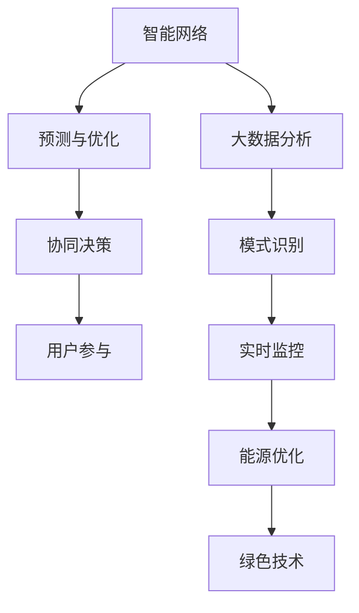

                 

# 全球脑与可持续能源:集体智慧驱动的绿色革命

## 1. 背景介绍

随着全球气候变化日益严峻，可持续能源的开发和利用变得至关重要。在人工智能（AI）和大数据技术的助力下，人类正迈向一场由集体智慧驱动的绿色革命，旨在通过更高效、更环保的方式，实现能源的可持续供应。本文将深入探讨“全球脑”在可持续能源领域的应用，阐述其核心概念、算法原理和具体操作步骤，并展望其未来发展趋势与面临的挑战。

## 2. 核心概念与联系

### 2.1 核心概念概述

“全球脑”是一个由全球互联的智能系统构成的虚拟大脑，通过分布式计算和数据协同处理，实现大规模问题的解决。在可持续能源领域，全球脑可以通过数据分析、模式识别、预测与优化，提升能源的利用效率和可再生性。

- **智能网络**：通过互联网、物联网等技术，将能源生产和消费节点连接起来，形成一个智能化的能源网络。
- **大数据分析**：收集和处理海量能源数据，如气温、风速、太阳能辐射等，用于优化能源生产和消费。
- **预测与优化**：利用机器学习算法，预测能源需求和供应，优化资源分配，提高能源利用率。
- **协同决策**：在全球范围内，各智能体通过数据共享和协同决策，实现能源供需的平衡。
- **用户参与**：鼓励用户参与能源管理和消费，通过智能设备提高能源使用效率。

### 2.2 核心概念原理和架构的 Mermaid 流程图



## 3. 核心算法原理 & 具体操作步骤

### 3.1 算法原理概述

全球脑在可持续能源领域的应用主要基于以下算法原理：

- **数据驱动决策**：通过收集和分析能源数据，识别能源使用的规律和趋势，指导决策。
- **机器学习与优化**：利用机器学习算法，如回归、分类、聚类等，预测能源需求，优化资源配置。
- **模型预测与仿真**：构建能源系统的数学模型，进行仿真和预测，评估不同策略的效果。
- **分布式优化**：利用分布式算法，如共识算法、联邦学习等，在多个智能体间协同优化能源系统。
- **用户行为分析**：通过数据分析，了解用户能源消费习惯，提高用户参与度。

### 3.2 算法步骤详解

全球脑在可持续能源领域的具体操作步骤如下：

1. **数据采集**：部署传感器和智能设备，收集能源生产、消费和环境数据。
2. **数据处理与清洗**：对收集到的数据进行预处理和清洗，包括去噪、标准化、异常值处理等。
3. **数据分析与建模**：利用大数据分析技术，对处理后的数据进行特征提取、模式识别和建模。
4. **模型训练与验证**：使用历史数据训练机器学习模型，并在验证集上评估模型性能，进行调参优化。
5. **实时预测与决策**：将训练好的模型应用于实时数据，进行能源需求预测和资源优化决策。
6. **协同决策与用户参与**：在多个智能体间进行数据共享和协同决策，鼓励用户通过智能设备参与能源管理。

### 3.3 算法优缺点

全球脑在可持续能源领域的算法具有以下优点：

- **数据利用率高**：通过大数据分析，最大化利用能源数据，提高决策的准确性。
- **预测能力强**：利用机器学习算法，进行精确的能源需求预测，优化资源配置。
- **协同高效**：多个智能体协同决策，提高能源系统效率。
- **用户参与度提高**：通过智能设备，提升用户能源管理意识和参与度。

同时，也存在以下缺点：

- **数据隐私与安全问题**：大规模数据收集和共享可能引发隐私和安全问题。
- **模型复杂度较高**：需要构建复杂的数学模型，计算量大，对计算资源要求高。
- **用户接受度不确定**：部分用户可能对智能设备和数据共享存在抵触情绪。
- **政策与法规挑战**：需要跨国的政策协调和法规支持，以确保数据安全与公平性。

### 3.4 算法应用领域

全球脑在可持续能源领域的应用范围广泛，涵盖以下领域：

- **智能电网**：通过大数据分析和机器学习，优化电力供需，提升电网稳定性。
- **可再生能源**：预测风能、太阳能等可再生能源的产出，优化能源配置。
- **能效管理**：通过智能设备监控和优化建筑能源使用，降低能耗。
- **交通能源**：分析交通流量与能源消耗，优化交通系统的能源使用。
- **区域能源合作**：通过国际合作，共享能源数据和经验，提升区域能源管理水平。

## 4. 数学模型和公式 & 详细讲解 & 举例说明

### 4.1 数学模型构建

全球脑在可持续能源领域的应用涉及多个数学模型，包括回归模型、分类模型、聚类模型等。以风能预测为例，构建的数学模型如下：

- **输入数据**：时间序列的气象数据，如气温、湿度、风速等。
- **输出数据**：风能产出，以千瓦时为单位。
- **目标**：最小化预测误差，即风能产出的实际值与预测值之差。

### 4.2 公式推导过程

以线性回归模型为例，预测风能产出的公式如下：

$$
y = \hat{\theta} \cdot x + b
$$

其中，$y$ 为风能产出，$x$ 为气象数据，$\hat{\theta}$ 为模型参数，$b$ 为截距。利用最小二乘法，求得模型参数 $\hat{\theta}$ 和 $b$，使得预测误差最小化：

$$
\hat{\theta} = (X^T \cdot X)^{-1} \cdot X^T \cdot y
$$

$$
b = y - \hat{\theta} \cdot X
$$

### 4.3 案例分析与讲解

假设某地风能输出与气象数据的关系如下：

| 气象数据 | 风能输出（千瓦时） |
|---------|-------------------|
| 12, 10 | 5                 |
| 14, 11 | 6                 |
| 13, 10 | 5.5               |

利用上述公式，我们可以构建风能预测模型，并使用模型对未来风能输出进行预测。

## 5. 项目实践：代码实例和详细解释说明

### 5.1 开发环境搭建

1. **环境准备**：安装Python 3.8以上版本，配置好依赖库，如NumPy、Pandas、scikit-learn等。
2. **数据准备**：收集和整理气象数据，进行预处理和清洗。
3. **模型构建**：使用scikit-learn库构建线性回归模型。

### 5.2 源代码详细实现

```python
import numpy as np
from sklearn.linear_model import LinearRegression

# 准备数据
X = np.array([[12, 10], [14, 11], [13, 10]])
y = np.array([5, 6, 5.5])

# 构建模型
model = LinearRegression()
model.fit(X, y)

# 预测新数据
X_new = np.array([[15, 12]])
y_new = model.predict(X_new)

print(y_new)
```

### 5.3 代码解读与分析

1. **数据准备**：使用NumPy库创建输入数据 `X` 和输出数据 `y`。
2. **模型构建**：使用scikit-learn库的 `LinearRegression` 类构建线性回归模型，并使用 `fit` 方法进行模型训练。
3. **预测新数据**：使用 `predict` 方法对新数据进行预测。

### 5.4 运行结果展示

运行上述代码，输出新数据的预测结果。

## 6. 实际应用场景

### 6.1 智能电网

智能电网通过全球脑技术，可以实现电力供需的实时监控和优化。例如，利用大数据分析预测电力需求，通过智能设备调整电力输出，提高电网稳定性。

### 6.2 可再生能源

全球脑可以预测风能、太阳能等可再生能源的产出，优化能源配置。例如，利用机器学习算法，预测未来太阳能输出，调整光伏发电系统的运行策略。

### 6.3 能效管理

通过智能设备监控和优化建筑能源使用，降低能耗。例如，利用物联网技术，监测室内温度、湿度等参数，自动调整空调和暖气设备运行状态。

### 6.4 交通能源

分析交通流量与能源消耗，优化交通系统的能源使用。例如，利用大数据分析，优化城市交通信号灯的运行策略，减少交通拥堵，降低能源消耗。

### 6.5 区域能源合作

通过国际合作，共享能源数据和经验，提升区域能源管理水平。例如，建立跨国的能源数据共享平台，实现能源供需的协同优化。

## 7. 工具和资源推荐

### 7.1 学习资源推荐

1. **《Python数据分析基础》**：适合初学者学习Python和数据分析的基本知识。
2. **《机器学习实战》**：涵盖机器学习算法和实际应用案例，适合进阶学习。
3. **《深度学习入门》**：介绍深度学习的基本概念和实现方法，适合深入学习。
4. **Kaggle平台**：提供丰富的数据集和竞赛，实践机器学习项目，提升实战能力。

### 7.2 开发工具推荐

1. **Python编程环境**：如Jupyter Notebook、PyCharm等，适合数据分析和模型构建。
2. **数据可视化工具**：如Matplotlib、Seaborn等，适合数据展示和分析。
3. **机器学习库**：如scikit-learn、TensorFlow等，适合构建和训练机器学习模型。
4. **分布式计算框架**：如Spark、Hadoop等，适合处理大规模数据集。

### 7.3 相关论文推荐

1. **《全球脑与可持续能源：大数据驱动的绿色革命》**：探讨全球脑在可持续能源领域的应用，提供前沿思路。
2. **《智能电网：未来能源系统的解决方案》**：介绍智能电网的构建和应用，提供实际案例。
3. **《机器学习在能效管理中的应用》**：讨论机器学习在能效管理中的具体应用，提供技术细节。
4. **《可再生能源的预测与优化》**：研究可再生能源的预测方法和优化策略，提供理论支持。

## 8. 总结：未来发展趋势与挑战

### 8.1 研究成果总结

全球脑在可持续能源领域的应用，通过大数据分析和机器学习技术，实现了能源供需的实时监控和优化。未来，全球脑将继续在智能电网、可再生能源、能效管理等领域发挥重要作用。

### 8.2 未来发展趋势

1. **智能化水平提升**：随着技术的进步，全球脑的智能化水平将进一步提升，实现更高效、更精确的能源管理。
2. **跨界融合发展**：全球脑将与其他技术，如物联网、区块链等，进行更深入的融合，拓展应用场景。
3. **用户参与度提高**：通过智能设备和技术手段，提升用户参与度，实现能源管理的用户共治。
4. **国际合作深化**：通过跨国合作，共享数据和经验，提升全球能源管理的整体水平。
5. **政策与法规完善**：建立健全的政策和法规体系，保障全球脑技术的应用与发展。

### 8.3 面临的挑战

1. **数据隐私与安全**：大规模数据收集和共享可能引发隐私和安全问题，需要加强保护。
2. **计算资源需求**：构建和训练复杂模型需要大量计算资源，需提升计算效率。
3. **用户接受度**：部分用户对智能设备和数据共享存在抵触情绪，需提高用户接受度。
4. **政策与法规**：需要跨国的政策协调和法规支持，以确保数据安全与公平性。
5. **技术标准化**：缺乏统一的技术标准，可能影响全球脑技术的广泛应用。

### 8.4 研究展望

未来，全球脑技术将在可持续能源领域发挥更大作用，推动能源系统的绿色转型。研究重点包括：

1. **数据隐私保护**：研究数据隐私保护技术，确保数据安全。
2. **计算资源优化**：开发高效计算资源利用技术，提升模型训练和推理效率。
3. **用户接受度提升**：探索用户友好技术，提高用户参与度和接受度。
4. **跨界融合创新**：推动技术与跨界融合，拓展应用场景。
5. **标准化建设**：建立统一的技术标准，促进全球脑技术的广泛应用。

## 9. 附录：常见问题与解答

### Q1：全球脑在可持续能源领域有哪些具体应用？

A：全球脑在可持续能源领域的应用包括智能电网、可再生能源、能效管理、交通能源和区域能源合作等方面。通过大数据分析和机器学习技术，实现能源供需的实时监控和优化。

### Q2：全球脑的算法优缺点是什么？

A：全球脑的算法优点包括数据利用率高、预测能力强、协同高效和用户参与度提高。缺点包括数据隐私与安全问题、模型复杂度较高、用户接受度不确定和政策与法规挑战。

### Q3：如何提高全球脑在可持续能源领域的应用效果？

A：提高全球脑在可持续能源领域的应用效果，需要加强数据隐私保护、优化计算资源、提升用户接受度、加强国际合作和建立统一的技术标准。

### Q4：全球脑的算法步骤详解是什么？

A：全球脑在可持续能源领域的具体操作步骤包括数据采集、数据处理与清洗、数据分析与建模、模型训练与验证、实时预测与决策和协同决策与用户参与。

### Q5：全球脑的未来发展趋势是什么？

A：全球脑的未来发展趋势包括智能化水平提升、跨界融合发展、用户参与度提高、国际合作深化和政策与法规完善。

---

作者：禅与计算机程序设计艺术 / Zen and the Art of Computer Programming

