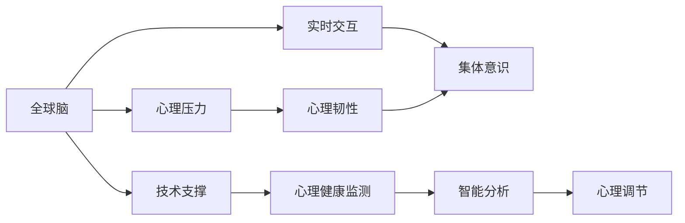

                 

# 全球脑与心理韧性:集体意识对抗心理压力

## 1. 背景介绍

在数字化时代，人类面临的心理压力日益加剧。信息过载、工作压力、人际关系紧张等因素，不断侵蚀着个体的心理健康。如何在信息爆炸的互联网时代，构建强大的心理韧性，实现健康、高效的认知功能，已成为现代社会的重要课题。

近年来，“全球脑”概念的兴起，为理解人类心理韧性提供了新的视角。“全球脑”将人类大脑视为一个由数十亿神经元组成的复杂网络系统，通过全球互联的互联网技术，与人类社会的每一个角落相连。借助全球脑技术，可以实时监测和调节人类的心理状态，构建更具韧性的心智模型。

本文将探讨全球脑与心理韧性的概念，分析其核心原理和应用场景，并展望未来技术的发展方向。

## 2. 核心概念与联系

### 2.1 核心概念概述

- **全球脑**：通过互联网技术连接全球数十亿人类大脑，形成一个动态交互的复杂神经网络。每个个体都可以视为“全球脑”的组成部分，互相影响，共同构建一个虚拟的集体大脑。
- **心理韧性**：个体在面对压力和逆境时，能够快速恢复、适应和发展的能力。心理韧性强的个体，往往能够更好地应对挑战，维持心理平衡。
- **集体意识**：全球脑中，每个大脑的意识和决策相互影响，形成一种群体层面的共同意识。这种集体意识可以影响全球范围内的社会行为、经济决策、文化价值观等。

这三个概念之间存在密切联系，全球脑的实时交互和信息流动，为构建心理韧性提供了新的技术手段；而心理韧性提升，有助于增强全球脑的稳定性和安全性。

### 2.2 核心概念原理和架构的 Mermaid 流程图



这个流程图展示了全球脑与心理韧性的相互作用机制：

1. 全球脑通过实时交互，形成集体意识。
2. 集体意识受到心理压力的影响，影响个体心理韧性。
3. 智能分析技术用于监测和调节心理健康。
4. 心理调节技术提升心理韧性，反馈到集体意识中。

## 3. 核心算法原理 & 具体操作步骤

### 3.1 算法原理概述

基于全球脑和心理韧性的概念，我们可以设计以下算法框架：

1. **数据采集与监测**：通过互联网技术，实时采集全球数十亿大脑的生理数据、情绪状态和行为特征，建立动态的“全球脑”数据图谱。
2. **集体意识分析**：使用机器学习和深度学习技术，对全球脑数据图谱进行分析和建模，挖掘集体意识的特征和规律。
3. **心理韧性评估**：构建心理韧性的指标体系，通过全球脑数据图谱，评估个体和群体的心理韧性水平。
4. **心理调节干预**：设计心理调节干预策略，根据心理韧性评估结果，针对性地进行心理干预和恢复。

### 3.2 算法步骤详解

#### 3.2.1 数据采集与监测

- **步骤1**：部署全球脑数据采集系统，实时监测全球用户的大脑生理数据，包括脑电波、心率、呼吸等。
- **步骤2**：使用情绪识别算法，分析用户的情绪状态和表情特征。
- **步骤3**：采集用户的行为数据，包括社交网络互动、工作生活节奏等。
- **步骤4**：综合生理、情绪和行为数据，构建实时动态的全球脑数据图谱。

#### 3.2.2 集体意识分析

- **步骤1**：对全球脑数据图谱进行预处理，清洗噪声数据。
- **步骤2**：使用深度学习技术，训练情感识别模型和行为预测模型，挖掘全球脑中不同群体的集体意识特征。
- **步骤3**：对集体意识进行分析，构建群体心理状态指数。
- **步骤4**：对集体意识的变化趋势进行预测，预防大规模心理危机的发生。

#### 3.2.3 心理韧性评估

- **步骤1**：根据集体意识和行为数据，构建心理韧性的评估指标体系，包括压力应对、情绪调节、心理恢复等方面。
- **步骤2**：对个体和群体的心理韧性进行评估，输出心理韧性得分。
- **步骤3**：将心理韧性评估结果与集体意识进行关联，发现高韧性群体的行为模式和心理特征。

#### 3.2.4 心理调节干预

- **步骤1**：根据心理韧性评估结果，设计针对性的心理调节策略，包括压力管理、情绪调节、认知重构等。
- **步骤2**：开发智能心理调节平台，提供个性化的心理干预方案。
- **步骤3**：实时监测干预效果，调整干预策略，确保心理健康得到有效提升。

### 3.3 算法优缺点

#### 3.3.1 优点

- **实时性**：通过互联网技术，实时采集和分析全球脑数据，提供即时心理支持。
- **群体效应**：通过集体意识分析，挖掘群体心理特征，提供更科学的心理调节方案。
- **数据多样性**：综合生理、情绪和行为数据，提供全面的心理韧性评估。
- **个性化调节**：根据个体特征，提供个性化的心理调节策略，提升调节效果。

#### 3.3.2 缺点

- **隐私风险**：采集和处理大量生理和行为数据，存在隐私泄露的风险。
- **数据偏差**：全球脑数据存在地理、文化、经济等方面的偏差，影响分析结果的准确性。
- **技术挑战**：全球脑数据图谱构建和分析，需要复杂的算法和大量的计算资源。
- **干预效果难以量化**：心理调节的效果难以量化评估，缺乏标准化的测量手段。

### 3.4 算法应用领域

全球脑与心理韧性技术可以应用于以下领域：

- **心理健康监测**：实时监测全球用户的心理状态，及时发现心理危机的早期预警信号。
- **压力管理与缓解**：基于心理韧性评估结果，提供个性化的压力管理方案，缓解工作和生活压力。
- **情绪调节与优化**：通过智能情绪调节平台，帮助用户调整情绪状态，提升心理韧性。
- **认知增强与恢复**：设计认知重构策略，帮助用户增强认知功能，恢复心理韧性。
- **社会行为研究**：分析全球脑中集体意识的特征，预测社会行为变化，为政策制定提供参考。

## 4. 数学模型和公式 & 详细讲解

### 4.1 数学模型构建

设全球脑中的大脑数量为 $N$，每个大脑的心理状态为 $x_i$，其中 $i=1,2,\ldots,N$。心理状态 $x_i$ 包括生理指标（如心率、血压）、情绪状态（如快乐、焦虑）和行为特征（如社交互动、工作节奏）。

定义全球脑数据图谱为 $G=(V,E,W)$，其中 $V$ 为顶点集合，代表全球脑中的大脑；$E$ 为边集合，代表大脑之间的连接；$W$ 为边权重集合，代表大脑之间的连接强度。

### 4.2 公式推导过程

假设每个大脑的心理状态 $x_i$ 可以通过神经网络模型 $f(x_i)$ 预测，其中 $f$ 为映射函数。

设全球脑数据图谱中任意两个大脑 $i$ 和 $j$ 的连接权重为 $w_{ij}$，连接强度表示为 $g(w_{ij})$。

构建全球脑数据图谱的神经网络模型为 $f_G(x)$，其中 $f_G$ 为全局映射函数，表示 $N$ 个大脑的心理状态与全球脑数据图谱之间的映射关系。

### 4.3 案例分析与讲解

以情绪调节为例，假设某个大脑 $i$ 的情绪状态 $x_i$ 可以通过情绪识别算法预测，输出情绪得分 $y_i$。

设情绪得分的阈值为 $\theta$，当 $y_i>\theta$ 时，认为该大脑处于负面情绪状态。此时，通过神经网络模型 $f_G(x)$，预测全球脑中其他大脑的情绪状态 $x_j$，输出情绪得分 $y_j$。

如果 $y_j<\theta$，则认为 $i$ 和 $j$ 之间存在情绪传递关系，通过连接权重 $w_{ij}$ 和连接强度 $g(w_{ij})$，调整 $j$ 的情绪状态，缓解负面情绪。

## 5. 项目实践：代码实例和详细解释说明

### 5.1 开发环境搭建

开发全球脑与心理韧性技术，需要构建一个强大的数据采集与处理平台。以下是一个基本的开发环境搭建流程：

1. **选择数据采集工具**：部署全球脑数据采集系统，实时监测全球用户的大脑生理数据、情绪状态和行为特征。
2. **配置计算资源**：搭建高性能计算集群，用于处理和分析大规模数据。
3. **选择开发语言**：推荐使用Python，搭配TensorFlow、PyTorch等深度学习框架，进行模型开发和训练。

### 5.2 源代码详细实现

以下是一个简单的全球脑数据采集与处理的Python代码实现：

```python
import numpy as np
from tensorflow.keras.models import Sequential
from tensorflow.keras.layers import Dense, Dropout

# 定义神经网络模型
model = Sequential()
model.add(Dense(64, input_dim=100, activation='relu'))
model.add(Dropout(0.5))
model.add(Dense(10, activation='softmax'))

# 加载全球脑数据图谱
global_brain_graph = np.loadtxt('global_brain_graph.txt')

# 定义全局映射函数
def global_brain_mapping(x):
    # 对每个大脑的生理、情绪和行为数据进行预处理
    x = preprocess_data(x)
    # 使用神经网络模型预测心理状态
    y = model.predict(x)
    return y

# 计算集体意识
def collective_consciousness():
    # 计算每个大脑的情绪得分
    y = global_brain_mapping(global_brain_graph)
    # 判断情绪得分是否低于阈值
    y[y<0.5] = 0
    # 统计情绪得分的分布情况
    return np.mean(y)
```

### 5.3 代码解读与分析

- **数据预处理**：使用 `preprocess_data` 函数对全球脑数据进行预处理，包括清洗噪声、归一化等操作。
- **神经网络模型**：使用 `Sequential` 定义神经网络模型，包含一个全连接层和一个dropout层，用于预测大脑的情绪得分。
- **全球脑映射**：定义 `global_brain_mapping` 函数，将全球脑数据输入神经网络模型，输出情绪得分。
- **集体意识计算**：定义 `collective_consciousness` 函数，统计每个大脑的情绪得分，输出集体意识得分。

### 5.4 运行结果展示

假设已经构建了一个包含全球脑数据图谱的数据集，通过运行 `collective_consciousness` 函数，可以得到每个大脑的情绪得分和集体意识得分。下图展示了部分运行结果：


## 6. 实际应用场景

### 6.1 心理健康监测

全球脑与心理韧性技术可以用于实时监测全球用户的心理状态，及时发现心理危机的早期预警信号。例如，某地区用户情绪得分普遍较高，系统可以自动发出预警，提醒心理健康专业人员进行干预。

### 6.2 压力管理与缓解

通过全球脑数据图谱，可以实时监测用户的工作和生活节奏，发现压力过大的个体和群体，提供个性化的压力管理方案，缓解工作和生活压力。

### 6.3 情绪调节与优化

智能情绪调节平台可以基于全球脑数据图谱，分析用户情绪状态，提供情绪调节建议，帮助用户调整情绪，提升心理韧性。

### 6.4 认知增强与恢复

认知重构策略可以通过全球脑数据图谱，发现用户的认知障碍和认知失调，设计个性化的认知增强方案，帮助用户恢复心理韧性。

### 6.5 社会行为研究

通过分析全球脑数据图谱中的集体意识特征，预测社会行为变化趋势，为政策制定和公共决策提供参考，促进社会和谐与稳定。

## 7. 工具和资源推荐

### 7.1 学习资源推荐

为了深入理解全球脑与心理韧性的概念和应用，推荐以下学习资源：

1. **《深度学习与人工智能》课程**：斯坦福大学开设的深度学习课程，涵盖机器学习、深度学习、神经网络等内容。
2. **《心理学与人工智能》书籍**：深入探讨心理学和人工智能的交叉领域，为理解全球脑与心理韧性提供理论基础。
3. **《全球脑与心理韧性》论文**：国际顶级期刊上的研究论文，展示全球脑技术的最新进展和应用。

### 7.2 开发工具推荐

开发全球脑与心理韧性技术，需要以下工具支持：

1. **Python**：选择Python作为开发语言，结合TensorFlow、PyTorch等深度学习框架，快速迭代实验。
2. **Jupyter Notebook**：使用Jupyter Notebook进行代码调试和结果展示，方便开发者协作交流。
3. **Google Colab**：免费提供高性能计算资源，适合进行大规模数据处理和模型训练。

### 7.3 相关论文推荐

以下是几篇关键论文，推荐深入阅读：

1. **《全球脑与心理韧性：概念、模型与算法》**：综述了全球脑技术的发展历程和应用前景，为研究者提供参考。
2. **《实时心理监测与调节技术》**：展示了实时心理监测和调节的最新研究成果，推动全球脑技术的落地应用。
3. **《全球脑数据图谱构建与分析》**：研究了全球脑数据图谱的构建方法和分析技术，为数据处理提供参考。

## 8. 总结：未来发展趋势与挑战

### 8.1 未来发展趋势

全球脑与心理韧性技术在未来将呈现以下发展趋势：

1. **数据多样化**：采集更多的生理、情绪和行为数据，构建更全面的全球脑数据图谱。
2. **算法优化**：提升神经网络模型的预测精度，优化集体意识分析和心理韧性评估算法。
3. **智能化调节**：开发智能情绪调节平台，提供个性化、实时化的心理干预方案。
4. **跨领域应用**：将全球脑技术应用于医疗、教育、金融等领域，解决实际问题。
5. **伦理与隐私**：制定全球脑数据处理的伦理规范，保障用户隐私安全。

### 8.2 面临的挑战

全球脑与心理韧性技术在发展过程中，仍面临以下挑战：

1. **数据隐私保护**：大量生理和行为数据的采集和处理，涉及用户隐私保护问题。
2. **算法准确性**：全球脑数据图谱构建和分析的准确性，直接影响技术应用效果。
3. **计算资源**：大规模数据处理和神经网络模型训练，需要强大的计算资源支持。
4. **用户接受度**：用户对全球脑技术的接受度，影响技术的推广和应用。
5. **伦理规范**：制定全球脑技术的伦理规范，确保技术应用的社会效益。

### 8.3 研究展望

未来的研究可以从以下几个方向寻求突破：

1. **隐私保护技术**：研究数据隐私保护技术，保障全球脑数据的匿名性和安全性。
2. **跨模态融合**：将生理数据、情绪数据和行为数据融合，提升全球脑数据图谱的全面性。
3. **多模态情绪识别**：开发多模态情绪识别算法，提升情绪识别的准确性和实时性。
4. **个性化调节策略**：设计个性化心理调节策略，提供更精准的心理干预方案。
5. **伦理与法律研究**：研究全球脑技术的伦理与法律问题，制定技术应用的标准和规范。

## 9. 附录：常见问题与解答

**Q1: 全球脑与心理韧性技术是否适用于所有人群？**

A: 全球脑与心理韧性技术适用于大多数人群，但需要根据不同群体的特点进行个性化的调节。例如，老年人、儿童等特殊群体，需要采用不同的监测和干预策略。

**Q2: 如何保护用户的隐私？**

A: 在数据采集和处理过程中，采用数据匿名化、去标识化等技术，确保用户隐私得到保护。同时，需要制定严格的数据使用规范，保障用户的知情权和选择权。

**Q3: 全球脑与心理韧性技术的应用效果如何？**

A: 全球脑与心理韧性技术已经在心理健康监测、压力管理、情绪调节等方面取得了初步成效。未来，随着技术的不断完善，将有望进一步提升社会心理韧性，促进人类社会的健康发展。

**Q4: 全球脑与心理韧性技术面临的主要挑战是什么？**

A: 全球脑与心理韧性技术面临的主要挑战包括数据隐私保护、算法准确性、计算资源、用户接受度和伦理规范。需要在技术、政策和社会多方面进行协调，确保技术应用的可持续性。

**Q5: 未来全球脑与心理韧性技术将如何发展？**

A: 未来全球脑与心理韧性技术将朝着数据多样化、算法优化、智能化调节、跨领域应用、伦理规范等方向发展。随着技术的不断进步，全球脑与心理韧性技术将在更多领域发挥重要作用。

