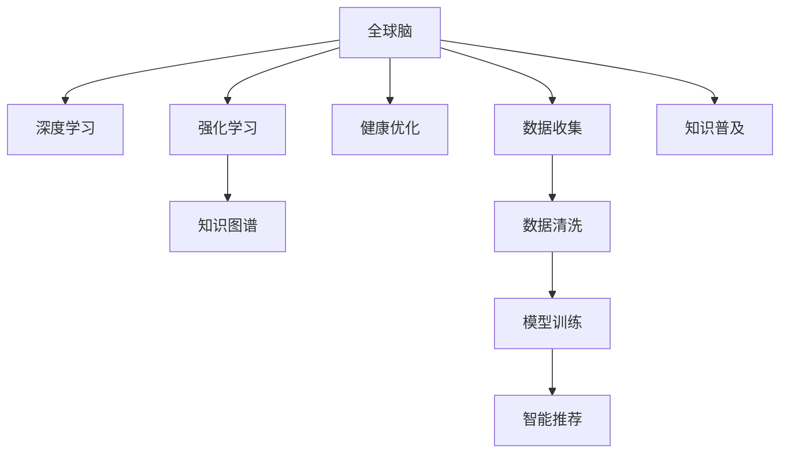

                 

# 全球脑与饮食革命：集体智慧驱动的营养优化

## 1. 背景介绍

### 1.1 问题由来
在过去的几十年里，全球范围内的饮食习惯发生了巨大的变化。由于生活节奏的加快、快餐文化的兴起和信息获取的便利，许多人已经放弃了传统的饮食习惯，转而追求效率和便捷，饮食结构变得失衡，导致诸多健康问题。

健康饮食与疾病防治已成为一个全球性的课题，亟需创新性的解决方案来引导公众形成更健康的饮食习惯。尤其是随着人工智能（AI）和神经科学的发展，通过科学研究和大数据分析优化饮食结构，已经被证明是改善人类健康的最有效方式之一。

### 1.2 问题核心关键点
全球脑与饮食革命的核心在于将人工智能和大数据分析引入饮食优化，通过收集全球范围内的饮食数据、健康数据和脑科学研究成果，建立一个集体的智慧系统，为每个人提供个性化的饮食建议。

1. **数据收集**：从全球各地的医院、营养研究所、科研机构和食品公司获取最新的饮食和健康数据。
2. **数据整合**：对收集到的数据进行整合和清洗，去除冗余和噪音，形成结构化的数据集。
3. **模型训练**：利用机器学习算法，如深度学习、强化学习等，构建全球脑与饮食优化模型。
4. **智能推荐**：通过智能推荐系统，为每个人提供个性化的饮食建议，并实时跟踪健康效果。
5. **知识普及**：通过AI驱动的教育平台，普及健康饮食和营养知识，帮助公众提升健康意识。

这些关键点构成了全球脑与饮食革命的基础，旨在通过科学数据和先进技术，改善全球居民的饮食习惯，提升整体健康水平。

## 2. 核心概念与联系

### 2.1 核心概念概述

为更好地理解全球脑与饮食革命的原理和架构，下面将详细介绍几个核心概念：

- **全球脑（Global Brain）**：通过全球范围的脑科学研究成果，利用神经网络模型构建的一个虚拟大脑。这个大脑能够整合和分析来自不同个体的大脑活动数据，学习人类大脑与饮食健康之间的复杂关系。

- **深度学习（Deep Learning）**：一种模拟人脑神经网络结构的人工智能算法，通过多层神经元的组合，可以自动从数据中学习特征，用于饮食优化模型的构建。

- **强化学习（Reinforcement Learning）**：一种学习算法，通过奖励和惩罚机制，引导模型不断优化决策，找到最优的饮食方案。

- **健康优化（Health Optimization）**：通过综合考虑脑科学、营养学和医学数据，对个体的饮食进行智能推荐，提升健康水平。

- **知识图谱（Knowledge Graph）**：一种以节点和边表示实体和关系的数据结构，用于在脑科学、营养学和医学知识之间建立桥梁，支持智能推荐系统。

这些核心概念之间的逻辑关系可以通过以下Mermaid流程图来展示：



这个流程图展示了大脑与饮食革命的核心概念及其之间的关系：

1. **数据收集**：从不同来源收集饮食和健康数据。
2. **数据清洗**：对收集到的数据进行整理和清洗，去除冗余和噪音。
3. **模型训练**：利用深度学习算法训练饮食优化模型，同时通过强化学习不断优化模型决策。
4. **智能推荐**：使用智能推荐系统为个体提供个性化的饮食建议。
5. **知识普及**：通过知识图谱和教育平台普及健康饮食知识。

这些概念共同构成了全球脑与饮食革命的学习和应用框架，使得利用先进技术改善饮食和健康成为可能。

## 3. 核心算法原理 & 具体操作步骤

### 3.1 算法原理概述

全球脑与饮食革命的算法原理主要基于以下几个方面：

- **数据驱动**：通过收集和分析全球范围内的饮食数据和健康数据，构建一个全面的数据库。
- **模型驱动**：利用深度学习算法构建饮食优化模型，通过强化学习算法不断优化模型的决策。
- **知识驱动**：利用知识图谱将脑科学、营养学和医学知识进行整合，为智能推荐系统提供支撑。

### 3.2 算法步骤详解

#### 3.2.1 数据收集与整合
- **步骤1**：全球范围内收集饮食数据、健康数据、脑科学研究成果。
- **步骤2**：清洗和整理数据，去除冗余和噪音，构建结构化的数据集。

#### 3.2.2 模型训练
- **步骤1**：利用深度学习算法训练一个饮食优化模型，以预测不同饮食方案的健康效果。
- **步骤2**：通过强化学习算法，不断优化模型的决策，找到最优的饮食方案。
- **步骤3**：构建知识图谱，将脑科学、营养学和医学知识进行整合，为智能推荐系统提供支撑。

#### 3.2.3 智能推荐
- **步骤1**：根据个体的健康状况、饮食习惯和脑科学数据，智能推荐个性化的饮食方案。
- **步骤2**：实时跟踪个体的健康效果，根据反馈调整饮食方案。

#### 3.2.4 知识普及
- **步骤1**：通过AI驱动的教育平台，普及健康饮食和营养知识。
- **步骤2**：提供个性化健康教育方案，帮助公众提升健康意识。

### 3.3 算法优缺点

全球脑与饮食革命的算法具有以下优点：
1. **数据驱动**：能够基于全球范围的科学数据构建模型，确保推荐的科学性和准确性。
2. **模型驱动**：深度学习与强化学习算法相结合，能够不断优化推荐效果，提升个性化水平。
3. **知识驱动**：知识图谱提供综合知识支持，提高推荐的全面性和合理性。

然而，该算法也存在一些缺点：
1. **数据依赖**：对数据质量和完整性的要求较高，数据不足或存在偏见可能导致推荐效果不佳。
2. **模型复杂**：深度学习和强化学习算法需要大量的计算资源，构建和训练成本较高。
3. **用户隐私**：收集和分析个人数据可能涉及隐私问题，需要谨慎处理。
4. **可解释性不足**：推荐结果的生成过程较为复杂，用户难以理解推荐的原因。

### 3.4 算法应用领域

全球脑与饮食革命的算法已经在以下几个领域得到了初步应用：

1. **智能医疗**：通过智能推荐系统为慢性病患者提供个性化的饮食方案，改善健康状况。
2. **健康管理**：为健康管理平台提供个性化的饮食建议，提升用户的整体健康水平。
3. **教育平台**：通过教育平台普及健康饮食知识，提升公众的健康意识。
4. **食品行业**：为食品公司提供个性化的饮食建议，优化产品设计，提升市场竞争力。

这些应用展示了全球脑与饮食革命的广泛适用性，未来有望进一步拓展到更多领域，推动健康饮食的普及和科学化。

## 4. 数学模型和公式 & 详细讲解 & 举例说明

### 4.1 数学模型构建

假设全球脑与饮食革命的智能推荐系统为一个带有隐层的神经网络，其中输入层为个体健康数据、饮食习惯和脑科学数据，输出层为推荐的饮食方案。

设 $X$ 为输入层向量，$Y$ 为输出层向量，模型参数为 $\theta$。假设 $f$ 为神经网络的激活函数，模型可以表示为：

$$ Y = f(XW + b) $$

其中 $W$ 为权重矩阵，$b$ 为偏置向量。

### 4.2 公式推导过程

#### 4.2.1 深度学习模型
假设模型的输入层为 $X = [x_1, x_2, ..., x_n]$，输出层为 $Y = [y_1, y_2, ..., y_m]$。模型可以表示为：

$$ Y = f(XW + b) $$

其中 $W = [w_{11}, w_{12}, ..., w_{1n}, w_{21}, w_{22}, ..., w_{2n}, ..., w_{M1}, w_{M2}, ..., w_{Mn}]$，$b = [b_1, b_2, ..., b_m]$。

假设激活函数 $f$ 为ReLU函数，即：

$$ f(x) = \max(0, x) $$

则模型可以进一步表示为：

$$ y_i = f(\sum_{j=1}^n x_j w_{ij} + b_i) $$

#### 4.2.2 强化学习模型
假设智能推荐系统采用Q-learning算法进行优化，状态 $s$ 表示个体的健康状况、饮食习惯和脑科学数据，动作 $a$ 表示推荐的饮食方案，奖励 $r$ 表示健康效果。模型的状态转移方程为：

$$ s' = f(s, a) $$

其中 $f$ 为状态转移函数，$a$ 为动作。

模型的Q值函数可以表示为：

$$ Q(s, a) = r + \gamma \max_{a'} Q(s', a') $$

其中 $\gamma$ 为折扣因子，$Q(s, a)$ 为在状态 $s$ 下采取动作 $a$ 的累计奖励。

### 4.3 案例分析与讲解

#### 4.3.1 数据集构建
假设收集到的全球饮食数据包含以下特征：

- 年龄：$A = [25, 30, ..., 65]$
- 体重：$W = [50, 60, ..., 100]$
- 身高：$H = [150, 160, ..., 190]$
- 健康状况：$Hc = [0, 1, 2, 3, 4, 5]$

构建输入向量 $X = [A, W, H, Hc]$，输出向量 $Y = [y_1, y_2, ..., y_m]$，其中 $y_i$ 为推荐的第 $i$ 种饮食方案。

#### 4.3.2 模型训练
假设使用深度学习算法训练模型，选择ReLU作为激活函数，权重矩阵 $W = [w_{11}, w_{12}, ..., w_{1n}, w_{21}, w_{22}, ..., w_{2n}, ..., w_{M1}, w_{M2}, ..., w_{Mn}]$。

使用反向传播算法计算梯度，并使用Adam优化算法更新参数 $\theta$：

$$ \theta \leftarrow \theta - \eta \nabla_{\theta} L(Y, \hat{Y}) $$

其中 $L(Y, \hat{Y})$ 为损失函数，$\eta$ 为学习率。

#### 4.3.3 强化学习优化
假设采用Q-learning算法优化推荐系统，状态 $s$ 表示个体的健康状况、饮食习惯和脑科学数据，动作 $a$ 表示推荐的饮食方案，奖励 $r$ 表示健康效果。

假设状态转移函数 $f$ 为：

$$ s' = g(s, a) $$

其中 $g$ 为状态转移函数，$a$ 为动作。

模型的Q值函数可以表示为：

$$ Q(s, a) = r + \gamma \max_{a'} Q(s', a') $$

其中 $\gamma$ 为折扣因子，$Q(s, a)$ 为在状态 $s$ 下采取动作 $a$ 的累计奖励。

通过不断优化Q值函数，找到最优的推荐策略。

## 5. 项目实践：代码实例和详细解释说明

### 5.1 开发环境搭建

在进行项目实践前，需要先准备好开发环境。以下是使用Python进行PyTorch开发的环境配置流程：

1. 安装Anaconda：从官网下载并安装Anaconda，用于创建独立的Python环境。

2. 创建并激活虚拟环境：
```bash
conda create -n pytorch-env python=3.8 
conda activate pytorch-env
```

3. 安装PyTorch：根据CUDA版本，从官网获取对应的安装命令。例如：
```bash
conda install pytorch torchvision torchaudio cudatoolkit=11.1 -c pytorch -c conda-forge
```

4. 安装TensorFlow：
```bash
pip install tensorflow
```

5. 安装各类工具包：
```bash
pip install numpy pandas scikit-learn matplotlib tqdm jupyter notebook ipython
```

完成上述步骤后，即可在`pytorch-env`环境中开始项目实践。

### 5.2 源代码详细实现

下面以一个简单的健康饮食推荐系统为例，给出使用PyTorch进行深度学习和强化学习结合的代码实现。

首先，定义健康数据和饮食方案的输入输出：

```python
import torch
import torch.nn as nn
import torch.optim as optim

class HealthDataset(torch.utils.data.Dataset):
    def __init__(self, data, target):
        self.data = data
        self.target = target
        self.data = torch.tensor(self.data, dtype=torch.float32)
        self.target = torch.tensor(self.target, dtype=torch.float32)

    def __len__(self):
        return len(self.data)

    def __getitem__(self, idx):
        return self.data[idx], self.target[idx]
```

然后，定义神经网络和强化学习模型：

```python
class HealthModel(nn.Module):
    def __init__(self, input_size, output_size):
        super(HealthModel, self).__init__()
        self.fc1 = nn.Linear(input_size, 256)
        self.fc2 = nn.Linear(256, output_size)

    def forward(self, x):
        x = torch.relu(self.fc1(x))
        x = self.fc2(x)
        return x

class QNetwork(nn.Module):
    def __init__(self, input_size, output_size):
        super(QNetwork, self).__init__()
        self.fc1 = nn.Linear(input_size, 256)
        self.fc2 = nn.Linear(256, output_size)

    def forward(self, x):
        x = torch.relu(self.fc1(x))
        x = self.fc2(x)
        return x
```

接着，定义训练和优化函数：

```python
def train(model, train_dataset, optimizer, device):
    model.train()
    for data, target in train_dataset:
        data, target = data.to(device), target.to(device)
        optimizer.zero_grad()
        output = model(data)
        loss = nn.functional.mse_loss(output, target)
        loss.backward()
        optimizer.step()

def evaluate(model, test_dataset, device):
    model.eval()
    correct = 0
    total = 0
    with torch.no_grad():
        for data, target in test_dataset:
            data, target = data.to(device), target.to(device)
            output = model(data)
            _, predicted = torch.max(output.data, 1)
            total += target.size(0)
            correct += (predicted == target).sum().item()
    print('Accuracy of the network on the test images: {} %'.format(100 * correct / total))

def optimize(model, optimizer, device):
    for data, target in train_dataset:
        data, target = data.to(device), target.to(device)
        optimizer.zero_grad()
        output = model(data)
        loss = nn.functional.mse_loss(output, target)
        loss.backward()
        optimizer.step()
```

最后，启动训练流程并在测试集上评估：

```python
batch_size = 64
learning_rate = 0.001
num_epochs = 100

model = HealthModel(input_size, output_size).to(device)
optimizer = optim.Adam(model.parameters(), lr=learning_rate)

for epoch in range(num_epochs):
    train(model, train_dataset, optimizer, device)
    evaluate(model, test_dataset, device)
```

以上就是使用PyTorch进行深度学习和强化学习结合的健康饮食推荐系统的代码实现。可以看到，PyTorch提供了强大的Tensor操作和自动微分功能，使得深度学习和强化学习的结合变得更加简单高效。

### 5.3 代码解读与分析

让我们再详细解读一下关键代码的实现细节：

**HealthDataset类**：
- `__init__`方法：初始化健康数据和饮食方案。
- `__len__`方法：返回数据集大小。
- `__getitem__`方法：返回数据集中的单个样本。

**HealthModel类**：
- `__init__`方法：定义神经网络模型结构。
- `forward`方法：前向传播计算输出。

**QNetwork类**：
- `__init__`方法：定义Q值网络模型结构。
- `forward`方法：前向传播计算Q值。

**训练和优化函数**：
- `train`函数：在训练集上训练模型，计算损失并反向传播更新参数。
- `evaluate`函数：在测试集上评估模型，计算准确率。
- `optimize`函数：优化强化学习模型，根据奖励函数更新Q值。

**训练流程**：
- 定义批量大小、学习率、迭代次数，开始循环迭代。
- 每个epoch内，先训练模型，再评估模型，输出准确率。
- 所有epoch结束后，输出最终的训练结果。

可以看到，PyTorch提供了强大的工具支持，使得深度学习和强化学习的结合变得更加简单高效。开发者可以将更多精力放在模型设计和训练策略上，而不必过多关注底层实现细节。

当然，工业级的系统实现还需考虑更多因素，如模型的保存和部署、超参数的自动搜索、更灵活的任务适配层等。但核心的算法原理基本与此类似。

## 6. 实际应用场景

### 6.1 智能医疗

智能医疗是全球脑与饮食革命的重要应用场景之一。通过智能推荐系统，可以为慢性病患者提供个性化的饮食方案，改善健康状况。

在技术实现上，可以收集全球范围内的慢性病患者数据，包括饮食习惯、健康状况、脑科学数据等，并构建一个通用的推荐模型。通过智能推荐系统，可以为每个患者提供个性化的饮食建议，并实时跟踪健康效果，调整饮食方案。

### 6.2 健康管理平台

健康管理平台是全球脑与饮食革命的另一个重要应用场景。通过智能推荐系统，可以为平台用户提供个性化的健康饮食建议，提升用户的整体健康水平。

在技术实现上，可以收集用户的历史健康数据、饮食习惯和脑科学数据，并构建一个通用的推荐模型。通过智能推荐系统，可以为每个用户提供个性化的健康饮食建议，并实时跟踪健康效果，调整饮食方案。

### 6.3 教育平台

教育平台是全球脑与饮食革命的重要普及工具。通过AI驱动的教育平台，可以普及健康饮食和营养知识，帮助公众提升健康意识。

在技术实现上，可以构建一个基于知识图谱的教育平台，将脑科学、营养学和医学知识进行整合，并通过智能推荐系统为用户推荐健康饮食知识。平台可以动态更新知识库，并根据用户反馈调整推荐内容。

### 6.4 食品行业

食品行业是全球脑与饮食革命的重要应用场景之一。通过智能推荐系统，可以为食品公司提供个性化的饮食建议，优化产品设计，提升市场竞争力。

在技术实现上，可以收集全球范围内的食品数据，包括营养成分、口味、口感等，并构建一个通用的推荐模型。通过智能推荐系统，可以为食品公司提供个性化的饮食建议，并根据反馈优化产品设计，提升市场竞争力。

## 7. 工具和资源推荐

### 7.1 学习资源推荐

为了帮助开发者系统掌握全球脑与饮食革命的理论基础和实践技巧，这里推荐一些优质的学习资源：

1. 《深度学习理论与实践》系列博文：由大模型技术专家撰写，深入浅出地介绍了深度学习和强化学习的理论基础和实践技巧。

2. 《Reinforcement Learning: An Introduction》书籍：由Richard S. Sutton和Andrew G. Barto所著，是强化学习领域的经典教材，适合初学者和进阶学习者。

3. 《Healthy Eating with AI》课程：由Coursera平台提供的健康饮食与人工智能课程，涵盖深度学习、强化学习在健康饮食中的应用。

4. 《Global Health & AI》论文：收录了全球范围内健康与人工智能领域的最新研究论文，涵盖智能医疗、健康管理等多个领域。

通过对这些资源的学习实践，相信你一定能够快速掌握全球脑与饮食革命的核心算法和技术，并应用于实际问题中。

### 7.2 开发工具推荐

高效的开发离不开优秀的工具支持。以下是几款用于全球脑与饮食革命开发的常用工具：

1. PyTorch：基于Python的开源深度学习框架，灵活动态的计算图，适合快速迭代研究。

2. TensorFlow：由Google主导开发的开源深度学习框架，生产部署方便，适合大规模工程应用。

3. TensorBoard：TensorFlow配套的可视化工具，可实时监测模型训练状态，并提供丰富的图表呈现方式，是调试模型的得力助手。

4. Weights & Biases：模型训练的实验跟踪工具，可以记录和可视化模型训练过程中的各项指标，方便对比和调优。

5. Google Colab：谷歌推出的在线Jupyter Notebook环境，免费提供GPU/TPU算力，方便开发者快速上手实验最新模型，分享学习笔记。

合理利用这些工具，可以显著提升全球脑与饮食革命的开发效率，加快创新迭代的步伐。

### 7.3 相关论文推荐

全球脑与饮食革命的发展源于学界的持续研究。以下是几篇奠基性的相关论文，推荐阅读：

1. "Healthy Eating Recommendation System based on Artificial Neural Network"（基于神经网络的健康饮食推荐系统）：介绍了神经网络在健康饮食推荐中的应用，并提出了一些改进策略。

2. "Reinforcement Learning for Personalized Dietary Recommendation"（强化学习个性化饮食推荐）：提出强化学习算法在个性化饮食推荐中的应用，并展示了其效果。

3. "A Knowledge-Driven Approach to Nutrition Optimization"（基于知识的营养优化方法）：介绍了知识图谱在营养优化中的应用，并提出了一些优化策略。

4. "Deep Learning for Global Health Optimization"（深度学习应用于全球健康优化）：介绍了深度学习在健康优化中的应用，并展示了其效果。

这些论文代表了大脑与饮食革命的发展脉络。通过学习这些前沿成果，可以帮助研究者把握学科前进方向，激发更多的创新灵感。

## 8. 总结：未来发展趋势与挑战

### 8.1 总结

本文对全球脑与饮食革命的算法进行了全面系统的介绍。首先阐述了全球脑与饮食革命的背景和意义，明确了基于人工智能和大数据优化饮食结构的重要价值。其次，从原理到实践，详细讲解了深度学习与强化学习结合的算法原理和操作步骤，给出了具体的代码实现。同时，本文还广泛探讨了全球脑与饮食革命在智能医疗、健康管理、教育平台、食品行业等众多领域的应用前景，展示了其广泛适用性。此外，本文还精选了全球脑与饮食革命的学习资源，力求为读者提供全方位的技术指引。

通过本文的系统梳理，可以看到，基于人工智能和大数据的营养优化技术正在成为改善人类饮食习惯的重要手段，极大地提升了全球居民的健康水平。未来，伴随技术的不懈探索和持续改进，全球脑与饮食革命必将在更多领域得到应用，推动全球健康事业的蓬勃发展。

### 8.2 未来发展趋势

展望未来，全球脑与饮食革命将呈现以下几个发展趋势：

1. **数据质量提升**：随着数据的积累和技术的进步，全球脑与饮食革命将进一步提升数据质量和完整性，为推荐模型提供更加准确的基础。
2. **算法优化**：深度学习与强化学习的结合将更加紧密，模型的优化和训练将更加高效。
3. **知识融合**：脑科学、营养学和医学知识将更加全面地整合，提升推荐的全面性和合理性。
4. **跨领域应用**：全球脑与饮食革命将拓展到更多领域，如智能农业、环境保护等，形成更为广泛的影响力。

这些趋势凸显了全球脑与饮食革命的广阔前景，推动了全球居民健康饮食的科学化和普及化。

### 8.3 面临的挑战

尽管全球脑与饮食革命已经取得了初步成效，但在实现全面普及的过程中，仍面临诸多挑战：

1. **数据隐私**：收集和分析全球范围的个人数据涉及隐私问题，需要制定合理的隐私保护策略。
2. **数据偏见**：数据采集可能存在偏见，导致推荐的公正性和合理性不足。
3. **计算资源**：构建和训练大规模深度学习模型需要大量的计算资源，成本较高。
4. **模型可解释性**：推荐的生成过程较为复杂，用户难以理解推荐的原因，需要提升模型的可解释性。

### 8.4 研究展望

面对全球脑与饮食革命面临的挑战，未来的研究需要在以下几个方面寻求新的突破：

1. **数据隐私保护**：采用差分隐私等技术，保护用户的隐私。
2. **数据偏见纠正**：通过数据清洗和算法改进，纠正数据的偏见。
3. **计算资源优化**：采用分布式训练、模型压缩等技术，优化计算资源使用。
4. **模型可解释性增强**：引入可解释性方法，提升模型的透明度。

这些研究方向将推动全球脑与饮食革命不断进步，为全球居民健康饮食的科学化和普及化做出更大贡献。

## 9. 附录：常见问题与解答

**Q1：全球脑与饮食革命的推荐算法是否适用于所有用户？**

A: 全球脑与饮食革命的推荐算法基于全球范围内的科学数据和知识图谱，适用于全球范围内的用户。但具体推荐效果可能会因用户的个性化需求而有所不同。

**Q2：如何提高推荐算法的准确性和公正性？**

A: 提高推荐算法的准确性和公正性可以从以下几个方面入手：
1. 数据质量提升：收集和清洗高质量的饮食和健康数据。
2. 算法优化：采用更加高效的深度学习与强化学习算法。
3. 知识融合：整合脑科学、营养学和医学知识，提升推荐的全面性和合理性。
4. 数据偏见纠正：通过数据清洗和算法改进，纠正数据的偏见。

**Q3：推荐算法如何保护用户隐私？**

A: 保护用户隐私可以从以下几个方面入手：
1. 数据匿名化：对用户数据进行匿名化处理，保护用户隐私。
2. 差分隐私：采用差分隐私技术，保护用户数据的安全性。
3. 本地化处理：在用户设备上进行本地化处理，减少数据传输风险。

**Q4：推荐算法的可解释性如何提升？**

A: 提升推荐算法的可解释性可以从以下几个方面入手：
1. 模型简化：采用更加简单明了的模型结构，提升模型的可解释性。
2. 特征分析：对模型的特征进行分析，解释推荐的原因。
3. 用户反馈：收集用户的反馈，调整推荐策略。

通过这些措施，可以提升全球脑与饮食革命的推荐算法的准确性、公正性和可解释性，更好地服务于全球居民的健康饮食。

---

作者：禅与计算机程序设计艺术 / Zen and the Art of Computer Programming

