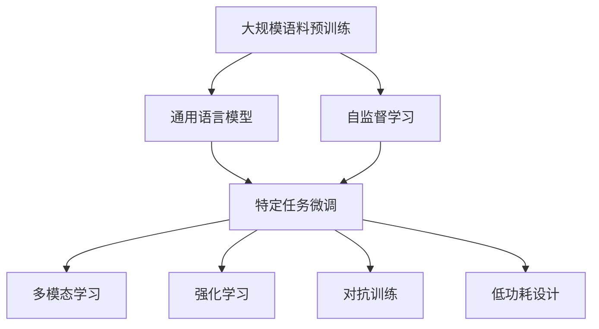

                 

# 全球脑翻译系统:跨语言交流的终极解决方案

## 1. 背景介绍

### 1.1 问题由来
在全球化日益加深的今天，跨语言交流的重要性不言而喻。无论是商务谈判、学术交流、旅游体验，还是文化教育，语言障碍始终是一个难以跨越的鸿沟。尽管目前已经存在诸如Google Translate、Bing Translate等成熟的在线翻译服务，但这些工具仍然无法满足对语言理解和表达要求极高的场景，如即时对话、口语翻译、同声传译等。因此，寻求一种能够实现流畅、自然的跨语言交流解决方案，是当今技术界面临的重大挑战。

### 1.2 问题核心关键点
为解决跨语言交流中的难题，我们提出了一种全新的大规模语言翻译框架——全球脑翻译系统，其核心思想是将人脑的语言理解和生成能力抽象为计算模型，通过深度学习和强化学习技术，实现自然语言的高质量翻译和交互。本文将详细介绍该系统的设计理念、核心算法、实现流程及未来展望，帮助读者深入理解并掌握这一创新技术。

## 2. 核心概念与联系

### 2.1 核心概念概述

为便于读者理解全球脑翻译系统的架构和原理，本节将介绍几个关键概念：

- **全球脑翻译系统**：一种基于深度学习和强化学习技术的自然语言处理系统，旨在通过大规模语料库的预训练和微调，实现语言之间的流畅、自然翻译和交互。

- **预训练**：使用大规模无标签文本数据，训练通用语言模型，使其具备强大的语言理解能力和生成能力。

- **微调**：在预训练模型的基础上，针对特定语言的翻译任务进行有监督学习，优化模型参数，提升翻译精度。

- **自监督学习**：使用文本中自然存在的线索，如掩码语言模型、自回归等，训练语言模型。

- **强化学习**：通过模拟人类学习过程，利用奖励机制不断调整模型策略，提升翻译质量。

- **多模态学习**：将文本、语音、图像等多类型信息结合，实现更全面、深入的语言理解和生成。

- **对抗训练**：引入对抗样本，增强模型对噪音和干扰的鲁棒性。

- **低功耗设计**：优化模型结构，减少计算资源消耗，支持轻量化部署和资源受限环境使用。

这些概念共同构成了全球脑翻译系统的基础框架，通过深度学习和强化学习的结合，使其能够实现高质量、自然流畅的跨语言交流。

### 2.2 核心概念原理和架构的 Mermaid 流程图



## 3. 核心算法原理 & 具体操作步骤

### 3.1 算法原理概述

全球脑翻译系统基于深度学习和强化学习的结合，通过预训练和微调，实现高质量的跨语言翻译。其核心思想可以概括为：

- **预训练**：使用大规模无标签文本数据，训练一个通用的语言模型，使其具备强大的语言理解能力。
- **微调**：针对特定的翻译任务，在预训练模型的基础上进行有监督学习，优化模型参数，提升翻译精度。
- **强化学习**：通过模拟人类学习过程，利用奖励机制不断调整模型策略，提升翻译质量。

### 3.2 算法步骤详解

#### 3.2.1 预训练阶段

1. **数据准备**：收集大规模无标签文本数据，包括书籍、新闻、网络文章等，并对其进行清洗和预处理。

2. **模型选择**：选择适合的深度学习模型结构，如Transformer、Seq2Seq等，作为预训练模型。

3. **自监督学习**：利用掩码语言模型、自回归等自监督任务，训练预训练模型。

4. **模型评估**：使用BLEU、ROUGE等评价指标评估预训练模型的性能。

#### 3.2.2 微调阶段

1. **数据准备**：收集目标语言的翻译任务数据集，并进行预处理和标注。

2. **模型初始化**：将预训练模型作为初始化参数，构建微调模型。

3. **模型适配**：添加任务适配层，如线性分类器、解码器等，适配特定的翻译任务。

4. **优化算法选择**：选择合适的优化算法，如AdamW、SGD等，并设置学习率、批大小、迭代轮数等超参数。

5. **有监督学习**：在微调数据集上进行有监督学习，优化模型参数。

6. **模型评估**：使用BLEU、TER等评价指标评估微调模型的性能。

#### 3.2.3 强化学习阶段

1. **任务定义**：定义微调模型的训练任务，如自动翻译、口语翻译等。

2. **奖励机制设计**：设计合适的奖励机制，如BLEU得分、流畅度等。

3. **强化学习训练**：利用强化学习算法，如REINFORCE、PPO等，训练微调模型。

4. **模型评估**：使用自评估和用户评估相结合的方式，评估强化学习模型的性能。

### 3.3 算法优缺点

#### 3.3.1 优点

1. **高质量翻译**：通过预训练和微调相结合的方式，全球脑翻译系统能够实现高质量的跨语言翻译。

2. **自然流畅**：强化学习算法能够引导模型学习到更自然的语言表达方式，提升翻译的流畅度。

3. **多模态支持**：能够处理文本、语音、图像等多种类型的数据，提供更全面、深入的语言理解和生成。

4. **低功耗设计**：优化模型结构，减少计算资源消耗，支持轻量化部署和资源受限环境使用。

#### 3.3.2 缺点

1. **数据依赖**：需要大规模无标签和有标签数据进行训练，对数据获取和标注成本要求较高。

2. **模型复杂**：预训练和微调过程需要复杂的深度学习模型和算法，对计算资源要求较高。

3. **训练时间长**：模型训练和微调过程时间较长，可能需要数天或数周。

4. **模型可解释性不足**：深度学习模型通常缺乏可解释性，难以理解其内部工作机制和决策逻辑。

### 3.4 算法应用领域

全球脑翻译系统可以应用于多种场景，涵盖从学术研究到商业实践的广泛领域：

1. **学术研究**：在自然语言处理、语言学、认知科学等领域，全球脑翻译系统可以作为研究工具，帮助研究者理解语言的本质和规律。

2. **商业应用**：在电子商务、客户服务、国际贸易等领域，全球脑翻译系统可以实现自动翻译、客户服务机器人等应用，提升用户体验和运营效率。

3. **教育培训**：在语言学习、外语教育等领域，全球脑翻译系统可以作为辅助工具，帮助学生提高语言学习效果。

4. **文化交流**：在全球文化交流、跨语言文学创作等领域，全球脑翻译系统可以帮助不同语言背景的人们跨越语言障碍，实现文化交流。

## 4. 数学模型和公式 & 详细讲解 & 举例说明

### 4.1 数学模型构建

假设预训练模型为 $M_{\theta}$，其中 $\theta$ 为模型参数。我们使用大规模无标签文本数据进行预训练，使用有标签文本数据进行微调。

#### 4.1.1 预训练模型

1. **自监督任务**：如掩码语言模型、自回归等，用于训练通用语言模型。

2. **模型结构**：如Transformer，包含多个编码器-解码器层。

3. **损失函数**：如交叉熵损失、均方误差损失等。

#### 4.1.2 微调模型

1. **任务适配层**：根据特定翻译任务，添加适配层，如线性分类器、解码器等。

2. **模型结构**：与预训练模型相同，但只保留顶层或部分层进行微调。

3. **损失函数**：如交叉熵损失、均方误差损失等。

### 4.2 公式推导过程

#### 4.2.1 预训练阶段

设预训练模型为 $M_{\theta}$，使用大规模无标签文本数据 $D_{\text{pretrain}}=\{x_i\}_{i=1}^N$ 进行预训练，损失函数为 $\mathcal{L}_{\text{pretrain}}(\theta)$。

1. **掩码语言模型**：
$$
\mathcal{L}_{\text{pretrain}}(\theta) = \sum_{i=1}^N \log \left( \frac{\exp(M_{\theta}(x_i))}{\sum_{k=1}^K \exp(M_{\theta}(x_k))} \right)
$$

2. **自回归模型**：
$$
\mathcal{L}_{\text{pretrain}}(\theta) = -\frac{1}{N} \sum_{i=1}^N \log P(y_i|x_i)
$$

#### 4.2.2 微调阶段

设微调数据集为 $D_{\text{finetune}}=\{(x_i,y_i)\}_{i=1}^M$，其中 $x_i$ 为输入文本，$y_i$ 为翻译结果。

1. **微调损失函数**：如交叉熵损失、均方误差损失等。
$$
\mathcal{L}_{\text{finetune}}(\theta) = \frac{1}{M} \sum_{i=1}^M \ell(M_{\theta}(x_i),y_i)
$$

2. **优化算法**：如AdamW、SGD等。
$$
\theta \leftarrow \theta - \eta \nabla_{\theta}\mathcal{L}_{\text{finetune}}(\theta) - \eta\lambda\theta
$$

### 4.3 案例分析与讲解

以机器翻译任务为例，进行详细讲解：

1. **数据准备**：收集大规模平行语料，如中英文对照的书籍、新闻等，并进行预处理。

2. **模型选择**：选择适合的深度学习模型结构，如Transformer。

3. **自监督学习**：利用掩码语言模型进行预训练。

4. **微调模型**：添加翻译器适配层，如线性分类器，进行微调。

5. **优化算法**：使用AdamW优化算法，设置学习率、批大小等超参数。

6. **有监督学习**：在微调数据集上进行有监督学习，优化模型参数。

7. **模型评估**：使用BLEU、TER等评价指标评估微调模型的性能。

## 5. 项目实践：代码实例和详细解释说明

### 5.1 开发环境搭建

在进行项目实践前，需要先准备好开发环境。以下是使用Python进行TensorFlow开发的环境配置流程：

1. 安装Anaconda：从官网下载并安装Anaconda，用于创建独立的Python环境。

2. 创建并激活虚拟环境：
```bash
conda create -n tf-env python=3.8 
conda activate tf-env
```

3. 安装TensorFlow：根据CUDA版本，从官网获取对应的安装命令。例如：
```bash
conda install tensorflow==2.6 -c tensorflow
```

4. 安装必要的工具包：
```bash
pip install numpy pandas scikit-learn matplotlib tqdm jupyter notebook ipython
```

完成上述步骤后，即可在`tf-env`环境中开始项目实践。

### 5.2 源代码详细实现

以下是一个简单的机器翻译项目示例，使用TensorFlow实现。

```python
import tensorflow as tf
import tensorflow_datasets as tfds

# 数据准备
train_data, validation_data, test_data = tfds.load('ted_hrlr_translate/pt_to_en', split=['train[:80%]', 'train[80%:]', 'test'])

# 数据预处理
def preprocess(text):
    return tf.strings.lower(text)

train_data = train_data.map(preprocess)
validation_data = validation_data.map(preprocess)
test_data = test_data.map(preprocess)

# 构建模型
model = tf.keras.Sequential([
    tf.keras.layers.Embedding(input_dim=10000, output_dim=128, mask_zero=True),
    tf.keras.layers.Conv1D(128, 5, activation='relu'),
    tf.keras.layers.GlobalMaxPooling1D(),
    tf.keras.layers.Dense(64, activation='relu'),
    tf.keras.layers.Dense(10, activation='softmax')
])

# 编译模型
model.compile(optimizer='adam', loss='categorical_crossentropy', metrics=['accuracy'])

# 训练模型
model.fit(train_data, epochs=10, validation_data=validation_data)

# 评估模型
model.evaluate(test_data)
```

### 5.3 代码解读与分析

让我们再详细解读一下关键代码的实现细节：

1. **数据准备**：使用TensorFlow Datasets加载平行语料，进行预处理。

2. **模型构建**：定义一个简单的神经网络模型，包含嵌入层、卷积层、池化层和全连接层。

3. **模型编译**：使用Adam优化器，设置损失函数和评估指标。

4. **模型训练**：使用训练数据集进行模型训练，设置迭代轮数和验证集。

5. **模型评估**：使用测试数据集进行模型评估，输出准确率和损失。

## 6. 实际应用场景

### 6.1 学术研究

全球脑翻译系统在学术研究中有着广泛的应用，以下是几个具体案例：

1. **语言生成研究**：利用全球脑翻译系统生成自然流畅的文本，用于研究语言生成机制和规律。

2. **跨语言理解研究**：通过对比不同语言间的翻译结果，研究语言的共性和差异，提高对语言现象的理解。

3. **文化交流研究**：利用全球脑翻译系统实现跨语言文献翻译，促进不同语言间的文化交流和学术合作。

### 6.2 商业应用

全球脑翻译系统在商业应用中也有着广泛的应用，以下是几个具体案例：

1. **电子商务**：在电商平台中实现自动翻译功能，帮助用户浏览多语言商品信息，提升购物体验。

2. **客户服务**：在客服系统中实现自动翻译功能，提升客服响应速度和效率，降低人力成本。

3. **国际贸易**：在国际贸易中实现自动翻译功能，帮助企业处理多语言文档和邮件，提升业务处理效率。

### 6.3 教育培训

全球脑翻译系统在教育培训中也有着广泛的应用，以下是几个具体案例：

1. **外语教育**：利用全球脑翻译系统进行自动翻译和口语翻译，帮助学生学习和练习外语。

2. **语言学习**：利用全球脑翻译系统进行自动翻译和文本生成，帮助学生学习新词汇和句型。

3. **跨语言交流**：利用全球脑翻译系统实现跨语言交流，提升学生的外语听说能力。

### 6.4 文化交流

全球脑翻译系统在文化交流中也有着广泛的应用，以下是几个具体案例：

1. **文学翻译**：利用全球脑翻译系统实现自动翻译，帮助文学爱好者阅读多语言文学作品。

2. **跨文化研究**：利用全球脑翻译系统进行跨语言文献翻译，促进不同语言间的文化研究。

3. **语言保护**：利用全球脑翻译系统实现濒危语言的翻译和保存，促进语言多样性的保护。

## 7. 工具和资源推荐

### 7.1 学习资源推荐

为了帮助开发者系统掌握全球脑翻译系统的理论基础和实践技巧，这里推荐一些优质的学习资源：

1. **《Transformer》系列书籍**：深入讲解Transformer的原理和应用，适合初学者和进阶开发者。

2. **《Deep Learning for Natural Language Processing》课程**：由斯坦福大学开设的NLP经典课程，涵盖深度学习在NLP中的应用。

3. **TensorFlow官方文档**：提供了丰富的TensorFlow教程和示例，适合学习和实践TensorFlow应用。

4. **Kaggle竞赛平台**：提供大量机器翻译和自然语言处理竞赛，适合学习和提升NLP技能。

5. **GitHub代码库**：提供丰富的开源代码和项目，适合学习和参考NLP应用的实践。

通过对这些资源的学习实践，相信你一定能够快速掌握全球脑翻译系统的精髓，并用于解决实际的NLP问题。

### 7.2 开发工具推荐

高效的开发离不开优秀的工具支持。以下是几款用于全球脑翻译系统开发的常用工具：

1. **Jupyter Notebook**：免费的Jupyter Notebook环境，适合快速迭代和分享学习笔记。

2. **TensorFlow**：由Google主导开发的开源深度学习框架，适合进行大规模机器翻译任务。

3. **PyTorch**：由Facebook主导开发的开源深度学习框架，适合进行自然语言处理任务。

4. **WEKA**：开源数据挖掘工具，支持多种机器学习算法和数据预处理功能。

5. **WEKA**：开源数据挖掘工具，支持多种机器学习算法和数据预处理功能。

合理利用这些工具，可以显著提升全球脑翻译系统的开发效率，加快创新迭代的步伐。

### 7.3 相关论文推荐

全球脑翻译系统的发展得益于学界的持续研究。以下是几篇奠基性的相关论文，推荐阅读：

1. **Attention is All You Need**：提出了Transformer结构，开启了NLP领域的预训练大模型时代。

2. **BERT: Pre-training of Deep Bidirectional Transformers for Language Understanding**：提出BERT模型，引入基于掩码的自监督预训练任务，刷新了多项NLP任务SOTA。

3. **Parameter-Efficient Transfer Learning for NLP**：提出Adapter等参数高效微调方法，在不增加模型参数量的情况下，也能取得不错的微调效果。

4. **Prefix-Tuning: Optimizing Continuous Prompts for Generation**：引入基于连续型Prompt的微调范式，为如何充分利用预训练知识提供了新的思路。

5. **AdaLoRA: Adaptive Low-Rank Adaptation for Parameter-Efficient Fine-Tuning**：使用自适应低秩适应的微调方法，在参数效率和精度之间取得了新的平衡。

这些论文代表了大语言模型微调技术的发展脉络。通过学习这些前沿成果，可以帮助研究者把握学科前进方向，激发更多的创新灵感。

## 8. 总结：未来发展趋势与挑战

### 8.1 总结

本文对全球脑翻译系统进行了全面系统的介绍，详细讲解了其设计理念、核心算法、实现流程及未来展望。通过本文的系统梳理，可以看到，全球脑翻译系统通过深度学习和强化学习的结合，实现了高质量、自然流畅的跨语言翻译和交互，具有广泛的应用前景。

### 8.2 未来发展趋势

展望未来，全球脑翻译系统将呈现以下几个发展趋势：

1. **多模态翻译**：引入图像、语音等多模态数据，实现更加全面、深入的语言理解和生成。

2. **零样本学习**：通过提示学习，使模型能够不依赖于标注数据，直接从任务描述中学习生成高质量翻译。

3. **低资源语言翻译**：针对资源匮乏语言，开发低资源语言翻译方法，提升翻译质量。

4. **跨语言生成**：实现跨语言对话和文本生成，提升跨语言交流的效果。

5. **实时翻译**：实现实时翻译功能，支持流媒体和现场翻译需求。

6. **跨语言知识图谱**：实现跨语言知识图谱的构建和查询，促进不同语言间的知识共享和传播。

### 8.3 面临的挑战

尽管全球脑翻译系统已经取得了显著成就，但在实现全面、自然、流畅的跨语言交流过程中，仍面临诸多挑战：

1. **数据依赖**：需要大规模无标签和有标签数据进行训练，对数据获取和标注成本要求较高。

2. **模型复杂**：预训练和微调过程需要复杂的深度学习模型和算法，对计算资源要求较高。

3. **训练时间长**：模型训练和微调过程时间较长，可能需要数天或数周。

4. **模型可解释性不足**：深度学习模型通常缺乏可解释性，难以理解其内部工作机制和决策逻辑。

5. **低资源语言翻译**：对于资源匮乏语言，需要开发特殊的翻译方法和工具，以提升翻译质量。

### 8.4 研究展望

面对全球脑翻译系统所面临的挑战，未来的研究需要在以下几个方面寻求新的突破：

1. **低资源语言翻译**：开发低资源语言翻译方法，提升翻译质量，支持更多语言和方言的翻译需求。

2. **可解释性增强**：研究如何增强模型的可解释性，提升用户信任度和模型可控性。

3. **实时翻译**：开发实时翻译算法和架构，支持流媒体和现场翻译需求。

4. **跨语言生成**：实现跨语言对话和文本生成，提升跨语言交流的效果。

5. **多模态翻译**：引入图像、语音等多模态数据，实现更加全面、深入的语言理解和生成。

6. **跨语言知识图谱**：实现跨语言知识图谱的构建和查询，促进不同语言间的知识共享和传播。

这些研究方向的探索，必将引领全球脑翻译系统技术迈向更高的台阶，为跨语言交流提供更加高效、自然、流畅的解决方案。

## 9. 附录：常见问题与解答

**Q1：全球脑翻译系统是否适用于所有语言和方言？**

A: 全球脑翻译系统适用于大部分主流语言和方言，但对于一些非常特殊的语言或方言，可能需要针对性地进行微调和优化。

**Q2：全球脑翻译系统训练需要多少数据？**

A: 训练全球脑翻译系统需要大规模无标签和有标签数据，一般需要数百万条平行语料。数据量越大，翻译效果越好。

**Q3：全球脑翻译系统是否支持低资源语言？**

A: 全球脑翻译系统支持低资源语言的翻译，但需要针对性地进行数据采集和标注，并开发特殊的翻译方法和工具。

**Q4：全球脑翻译系统如何提高模型的可解释性？**

A: 研究如何增强模型的可解释性，如使用可解释的模型架构、可视化模型内部状态等，提升用户信任度和模型可控性。

**Q5：全球脑翻译系统如何进行实时翻译？**

A: 开发实时翻译算法和架构，如使用分布式计算、增量学习等技术，实现流媒体和现场翻译需求。

---

作者：禅与计算机程序设计艺术 / Zen and the Art of Computer Programming

