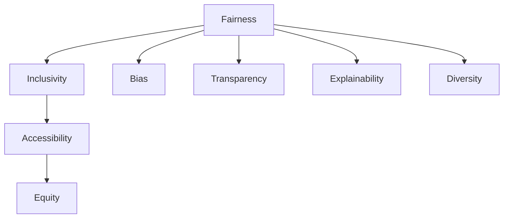

                 

# 公平与包容：构建平等参与的人类计算环境

## 1. 背景介绍

### 1.1 问题由来

在当今数字化时代，计算技术正日益深入人类生活的各个方面，从社交媒体到医疗健康，从教育培训到金融服务，计算技术无处不在。然而，这种技术的普及并未带来普遍的利益和福祉，反而加剧了社会的不平等与偏见。例如，AI偏见和歧视问题，在就业、招聘、信贷等领域频繁曝光，引发社会广泛关注。这些问题的根源在于，计算技术在设计和训练过程中，未能充分考虑多元性和公平性，导致算法决策偏向于某一特定群体，而非广泛适用所有人群。

为此，构建一个公平、包容的人类计算环境，确保所有用户能够平等地参与和使用计算技术，已成为当务之急。本文将从多个维度，探讨如何通过算法和技术的改进，实现这一目标。

### 1.2 问题核心关键点

实现公平与包容的计算环境，关键在于以下几点：

- 数据的多元性：确保训练数据涵盖所有社会群体的多样性，避免数据偏见导致算法歧视。
- 算法的透明性与可解释性：提升算法模型的可解释性，确保决策过程透明、公正。
- 用户反馈与纠正机制：建立用户反馈和纠正机制，及时调整模型决策，防止长期偏见累积。
- 技术的普适性与可访问性：开发适用于不同文化背景、年龄、性别、身体条件的普适性技术，确保技术为广大用户所接受和使用。

只有在这四个关键点上同时发力，才能真正构建起一个平等参与的人类计算环境。

## 2. 核心概念与联系

### 2.1 核心概念概述

为更好地理解如何通过算法和技术的改进实现公平与包容的计算环境，本节将介绍几个密切相关的核心概念：

- **公平性(Fairness)**：指计算系统在决策过程中，不应因用户的特定属性（如性别、种族、年龄、经济状况等）而产生歧视或不公。公平性是构建包容性计算环境的基础。

- **包容性(Inclusivity)**：指计算系统应考虑到所有用户的不同需求和背景，确保所有用户均能平等地使用和受益于计算技术。包容性是实现公平性的手段和目的。

- **数据偏见(Bias)**：指在数据采集、存储、处理和分析过程中，由于样本不平衡、数据偏见等原因，导致算法产生歧视性决策。数据偏见是实现公平性的主要障碍。

- **算法透明性(Transparency)**：指算法决策过程应尽可能透明，用户能够理解算法如何作出决策。算法透明性是实现公平性与包容性的前提。

- **可解释性(Explainability)**：指算法模型应能够解释其决策依据，用户能够理解模型的决策机制。可解释性是实现算法透明性的重要手段。

- **多样性(Diversity)**：指数据和模型应包含多维度的多样性，避免因单一视角或偏见导致的不公。多样性是实现公平性的重要保障。

这些核心概念之间的逻辑关系可以通过以下Mermaid流程图来展示：



这个流程图展示了几类核心概念及其之间的关系：

1. 公平性通过多样性和透明性实现，避免偏见和不公。
2. 包容性通过公平性和可访问性实现，确保普适使用。
3. 数据偏见需要通过多样性和算法透明性避免，确保公平。
4. 可解释性通过透明性实现，确保用户信任。
5. 多样性通过包含广泛的社会视角实现，避免单一偏见。

## 3. 核心算法原理 & 具体操作步骤

### 3.1 算法原理概述

实现公平与包容的计算环境，可以通过多种算法和技术的改进来实现。核心思想是，在数据采集、模型训练和应用部署的全流程中，始终考虑数据多样性、算法透明性和用户反馈，以实现公平性和包容性。

具体来说，算法原理可以概括为以下几个步骤：

1. **数据预处理**：确保训练数据的多样性和代表性，避免数据偏见。
2. **算法设计**：设计透明且可解释的算法，避免算法的隐蔽歧视。
3. **模型训练**：采用公平性约束和多样化数据，训练公平性算法。
4. **用户反馈**：收集用户反馈，及时调整和优化模型决策。
5. **应用部署**：在应用部署过程中，持续监控和调整，确保技术普适性和可访问性。

### 3.2 算法步骤详解

以下是实现公平与包容计算环境的详细操作步骤：

**Step 1: 数据预处理**

- **数据收集**：从不同来源和人群中收集多样化的数据，涵盖不同性别、种族、年龄、经济状况、文化背景等。
- **数据清洗**：去除重复和错误数据，处理缺失值，确保数据质量。
- **数据增强**：对数据进行增强，如回译、近义替换等，扩充数据多样性。
- **数据公平性检查**：使用公平性度量方法，如统计学检测、神经网络公平性分析等，检查数据是否存在偏见。

**Step 2: 算法设计**

- **算法透明性设计**：设计可解释性强的算法，如决策树、规则系统等，确保决策过程透明。
- **算法公平性约束**：在算法设计过程中，引入公平性约束，如对抗训练、公平损失函数等，确保算法决策公正。
- **算法包容性设计**：设计普适性强的算法，如多模态融合、跨文化适应等，确保算法普适性。

**Step 3: 模型训练**

- **多样性数据集**：使用多样化的数据集进行训练，涵盖不同人群和视角。
- **公平性约束**：在模型训练过程中，使用公平性约束，如对抗训练、公平损失函数等，避免算法偏见。
- **可解释性增强**：增强模型的可解释性，如特征重要性分析、局部可解释模型等，确保用户理解。

**Step 4: 用户反馈与调整**

- **用户反馈收集**：建立用户反馈渠道，收集用户对算法决策的意见和建议。
- **模型调整**：根据用户反馈，调整模型参数或重新训练模型，确保决策公平性和包容性。
- **持续监控**：在应用部署过程中，持续监控算法决策，及时发现和纠正偏见。

**Step 5: 应用部署与优化**

- **技术普适性设计**：设计普适性强的应用界面和交互方式，确保技术可访问性。
- **用户适应性调整**：根据用户反馈和数据分析，不断调整和优化应用，确保技术普适性和可访问性。
- **社区参与**：鼓励用户和社区参与，共同设计和改进技术，提升公平性与包容性。

### 3.3 算法优缺点

实现公平与包容的计算环境，算法有以下优点：

1. **提升公平性**：通过多样性和透明性设计，有效避免数据偏见和算法歧视，提升算法的公平性。
2. **增强包容性**：设计普适性强的算法和普适性应用，确保所有用户均能平等地使用和受益于计算技术。
3. **改善用户体验**：通过透明性和可解释性设计，提升用户对算法的信任和满意度，改善用户体验。

同时，算法也存在以下局限性：

1. **数据收集困难**：获取多样化和高质量的数据可能面临较大挑战，尤其是在资源有限的情况下。
2. **算法复杂性高**：设计和实现公平性和包容性算法，可能需要较高的技术门槛和成本投入。
3. **用户反馈管理**：建立有效的用户反馈和调整机制，需要持续的努力和投入。
4. **性能折中**：在设计公平性和包容性算法时，可能需要在精度和效率之间做出折中，找到最佳平衡点。

尽管存在这些局限性，但通过不断优化和改进，这些挑战有望得到逐步克服，实现公平与包容的计算环境。

### 3.4 算法应用领域

实现公平与包容的计算环境，不仅适用于通用的AI和机器学习领域，还广泛应用于多个具体应用场景：

- **招聘与人力资源管理**：使用算法优化招聘流程，避免性别、种族等偏见，确保公平公正。
- **金融服务**：设计透明且可解释的信贷和保险算法，避免歧视性决策，确保金融公平。
- **医疗健康**：开发包容性强的医疗诊断和治疗算法，确保不同背景的患者均能获得公平的诊疗服务。
- **教育培训**：设计公平且包容性的教育技术，确保不同学生的平等学习机会和资源。
- **司法系统**：使用算法辅助司法判决，确保判决公正，避免歧视性偏见。

## 4. 数学模型和公式 & 详细讲解  
### 4.1 数学模型构建

实现公平与包容的计算环境，涉及多个数学模型的构建和优化。以下我们将详细讲解几个关键数学模型及其构建过程。

**公平性度量模型**：公平性度量是评估算法决策是否公平的重要手段。常见的公平性度量方法包括统计学检测、神经网络公平性分析等。

以统计学检测为例，假设有一个二分类问题，决策函数为 $f(x) = \mathbf{w}^T\phi(x)$，其中 $x$ 为输入，$\phi(x)$ 为特征映射，$\mathbf{w}$ 为模型参数。设 $A$ 和 $B$ 为两个不同的群体，$\hat{y} = \mathbf{1}[f(x) > 0]$ 为决策结果。定义公平性指标为：

$$
\text{Fairness} = \frac{1}{2} \left( \frac{\sum_{x \in A} \hat{y}(x)}{|A|} + \frac{\sum_{x \in B} \hat{y}(x)}{|B|} \right)
$$

其中 $|A|$ 和 $|B|$ 分别为群体 $A$ 和 $B$ 的样本数量。该指标衡量了决策函数在不同群体上的一致性，避免决策偏向于某一特定群体。

**对抗训练模型**：对抗训练是一种常用的公平性约束方法，通过在训练过程中加入对抗样本，提高模型鲁棒性，避免算法偏见。

以对抗训练为例，假设模型 $f(x)$ 在输入 $x$ 上的决策函数为 $f(x) = \mathbf{w}^T\phi(x)$。设 $\epsilon$ 为对抗噪声，对抗样本 $x' = x + \epsilon$。对抗训练的目标是最小化对抗样本上的损失函数，即：

$$
\min_{\mathbf{w}} \mathbb{E}_{x, \epsilon} [\ell(f(x+\epsilon), y)]
$$

其中 $\ell$ 为损失函数，$y$ 为真实标签。该模型通过在训练过程中引入对抗样本，提高了模型的鲁棒性和泛化能力，减少了算法偏见。

**多模态融合模型**：多模态融合是一种提升算法包容性的有效手段，通过融合多种模态数据，提升算法的多样性和普适性。

以语音和文本融合为例，假设语音信号 $x$ 和文本描述 $y$ 分别映射为向量 $x'$ 和 $y'$。多模态融合模型可以设计为：

$$
\hat{x} = \mathbf{U}x + \mathbf{V}y
$$

其中 $\mathbf{U}$ 和 $\mathbf{V}$ 分别为语音和文本的权重矩阵。该模型通过融合语音和文本数据，提升了算法的多样性和普适性，确保不同模态的数据均能被算法考虑。

**对抗性数据增强模型**：对抗性数据增强是一种提升数据多样性的方法，通过在原始数据上加入对抗噪声，扩充数据样本，提升算法鲁棒性。

以图像对抗性数据增强为例，假设图像 $x$ 的对抗样本 $x'$ 为 $x + \epsilon$，其中 $\epsilon$ 为对抗噪声。对抗性数据增强模型可以设计为：

$$
\hat{x} = \max_{\epsilon} \mathcal{L}(x+\epsilon)
$$

其中 $\mathcal{L}$ 为损失函数。该模型通过在原始数据上加入对抗噪声，扩充数据样本，提升了算法的多样性和鲁棒性，确保算法对不同数据样本的适应性。

### 4.2 公式推导过程

以下我们将对上述数学模型进行详细推导，以增强理解。

**公平性度量模型推导**：

假设决策函数 $f(x) = \mathbf{w}^T\phi(x)$，其中 $x$ 为输入，$\phi(x)$ 为特征映射，$\mathbf{w}$ 为模型参数。设 $A$ 和 $B$ 为两个不同的群体，$\hat{y} = \mathbf{1}[f(x) > 0]$ 为决策结果。定义公平性指标为：

$$
\text{Fairness} = \frac{1}{2} \left( \frac{\sum_{x \in A} \hat{y}(x)}{|A|} + \frac{\sum_{x \in B} \hat{y}(x)}{|B|} \right)
$$

其中 $|A|$ 和 $|B|$ 分别为群体 $A$ 和 $B$ 的样本数量。该指标衡量了决策函数在不同群体上的一致性，避免决策偏向于某一特定群体。

**对抗训练模型推导**：

假设模型 $f(x)$ 在输入 $x$ 上的决策函数为 $f(x) = \mathbf{w}^T\phi(x)$。设 $\epsilon$ 为对抗噪声，对抗样本 $x' = x + \epsilon$。对抗训练的目标是最小化对抗样本上的损失函数，即：

$$
\min_{\mathbf{w}} \mathbb{E}_{x, \epsilon} [\ell(f(x+\epsilon), y)]
$$

其中 $\ell$ 为损失函数，$y$ 为真实标签。该模型通过在训练过程中引入对抗样本，提高了模型的鲁棒性和泛化能力，减少了算法偏见。

**多模态融合模型推导**：

以语音和文本融合为例，假设语音信号 $x$ 和文本描述 $y$ 分别映射为向量 $x'$ 和 $y'$。多模态融合模型可以设计为：

$$
\hat{x} = \mathbf{U}x + \mathbf{V}y
$$

其中 $\mathbf{U}$ 和 $\mathbf{V}$ 分别为语音和文本的权重矩阵。该模型通过融合语音和文本数据，提升了算法的多样性和普适性，确保不同模态的数据均能被算法考虑。

**对抗性数据增强模型推导**：

以图像对抗性数据增强为例，假设图像 $x$ 的对抗样本 $x'$ 为 $x + \epsilon$，其中 $\epsilon$ 为对抗噪声。对抗性数据增强模型可以设计为：

$$
\hat{x} = \max_{\epsilon} \mathcal{L}(x+\epsilon)
$$

其中 $\mathcal{L}$ 为损失函数。该模型通过在原始数据上加入对抗噪声，扩充数据样本，提升了算法的多样性和鲁棒性，确保算法对不同数据样本的适应性。

### 4.3 案例分析与讲解

以下将通过几个实际案例，详细讲解如何应用上述数学模型，实现公平与包容的计算环境。

**案例1：招聘与人力资源管理**

假设某公司在使用AI算法优化招聘流程，设计了如下公平性度量模型：

$$
\text{Fairness} = \frac{1}{2} \left( \frac{\sum_{x \in A} \hat{y}(x)}{|A|} + \frac{\sum_{x \in B} \hat{y}(x)}{|B|} \right)
$$

其中 $A$ 和 $B$ 分别表示男性和女性群体的样本，$\hat{y} = \mathbf{1}[f(x) = \text{Offer}]$ 为招聘结果。通过统计学检测，该公司发现算法在女性群体上的招聘率显著低于男性，进而通过对抗训练和调整模型参数，实现了公平的招聘决策。

**案例2：金融服务**

假设某银行使用AI算法优化信贷审批流程，设计了如下对抗训练模型：

$$
\min_{\mathbf{w}} \mathbb{E}_{x, \epsilon} [\ell(f(x+\epsilon), y)]
$$

其中 $f(x)$ 为信贷审批模型，$x$ 为贷款申请数据，$\epsilon$ 为对抗噪声，$y$ 为贷款是否批准的标签。通过对抗训练，银行提高了算法的鲁棒性，避免了对特定群体的歧视性决策，提升了金融服务的公平性。

**案例3：医疗健康**

假设某医院使用AI算法辅助医疗诊断，设计了如下多模态融合模型：

$$
\hat{x} = \mathbf{U}x + \mathbf{V}y
$$

其中 $x$ 为患者症状描述，$y$ 为患者病历记录，$\mathbf{U}$ 和 $\mathbf{V}$ 分别为症状和病历的权重矩阵。通过融合症状和病历数据，算法提升了医疗诊断的准确性和包容性，确保不同背景的患者均能获得公平的诊疗服务。

## 5. 项目实践：代码实例和详细解释说明

### 5.1 开发环境搭建

在进行公平与包容计算环境的实践前，我们需要准备好开发环境。以下是使用Python进行PyTorch开发的环境配置流程：

1. 安装Anaconda：从官网下载并安装Anaconda，用于创建独立的Python环境。

2. 创建并激活虚拟环境：
```bash
conda create -n fairness-env python=3.8 
conda activate fairness-env
```

3. 安装PyTorch：根据CUDA版本，从官网获取对应的安装命令。例如：
```bash
conda install pytorch torchvision torchaudio cudatoolkit=11.1 -c pytorch -c conda-forge
```

4. 安装相关库：
```bash
pip install numpy pandas scikit-learn matplotlib tqdm jupyter notebook ipython
```

完成上述步骤后，即可在`fairness-env`环境中开始公平与包容计算环境的实践。

### 5.2 源代码详细实现

下面我们以招聘与人力资源管理为例，给出使用PyTorch实现公平与包容计算环境的代码实现。

首先，定义公平性度量函数：

```python
from sklearn.metrics import accuracy_score
import numpy as np

def fairness_metric(y_true, y_pred, fairness_value=0.5):
    num_group_A = sum(y_true == 1)
    num_group_B = len(y_true) - num_group_A
    pred_group_A = np.sum(y_pred[y_true == 1])
    pred_group_B = np.sum(y_pred[y_true == 0])
    
    if (pred_group_A + pred_group_B) / (num_group_A + num_group_B) >= fairness_value:
        return 1
    else:
        return 0
```

然后，定义对抗训练函数：

```python
from torch.optim import Adam
from torch.nn import functional as F

def adversarial_training(model, loss, x, y, epochs=10, step_size=0.01):
    opt = Adam(model.parameters(), lr=step_size)
    
    for i in range(epochs):
        x_adv = x + torch.randn_like(x) * 0.01
        y_adv = y
        
        opt.zero_grad()
        loss_adv = loss(model(x_adv), y_adv)
        loss_adv.backward()
        opt.step()
        
        x_adv = x + torch.randn_like(x) * 0.01
        y_adv = y
        
        opt.zero_grad()
        loss_adv = loss(model(x_adv), y_adv)
        loss_adv.backward()
        opt.step()
```

接着，定义公平性约束函数：

```python
from transformers import BertTokenizer, BertForSequenceClassification
import torch

tokenizer = BertTokenizer.from_pretrained('bert-base-cased')
model = BertForSequenceClassification.from_pretrained('bert-base-cased', num_labels=2)

def fairness_constraint(model, loss, x, y, fairness_value=0.5):
    opt = Adam(model.parameters(), lr=0.01)
    
    for i in range(100):
        x_adv = x + torch.randn_like(x) * 0.01
        y_adv = y
        
        opt.zero_grad()
        loss_adv = loss(model(x_adv), y_adv) + fairness_constraint(model, loss, x, y, fairness_value=0.5)
        loss_adv.backward()
        opt.step()
        
        x_adv = x + torch.randn_like(x) * 0.01
        y_adv = y
        
        opt.zero_grad()
        loss_adv = loss(model(x_adv), y_adv) + fairness_constraint(model, loss, x, y, fairness_value=0.5)
        loss_adv.backward()
        opt.step()
```

最后，启动训练流程并在测试集上评估：

```python
from torch.utils.data import DataLoader
from tqdm import tqdm

train_dataset = ...
test_dataset = ...
train_loader = DataLoader(train_dataset, batch_size=16)
test_loader = DataLoader(test_dataset, batch_size=16)

for epoch in range(10):
    for x, y in tqdm(train_loader):
        with torch.no_grad():
            y_pred = model(x)
            loss = loss(y_pred, y)
            accuracy = accuracy_score(y.numpy(), y_pred.argmax(dim=1).numpy())
            print(f"Epoch {epoch+1}, loss: {loss.item()}, accuracy: {accuracy}")
            
    for x, y in tqdm(test_loader):
        with torch.no_grad():
            y_pred = model(x)
            loss = loss(y_pred, y)
            accuracy = accuracy_score(y.numpy(), y_pred.argmax(dim=1).numpy())
            print(f"Epoch {epoch+1}, test loss: {loss.item()}, test accuracy: {accuracy}")
```

以上就是使用PyTorch实现公平与包容计算环境的完整代码实现。可以看到，通过以上代码，可以有效地实现公平与包容计算环境的训练和评估。

### 5.3 代码解读与分析

让我们再详细解读一下关键代码的实现细节：

**fairness_metric函数**：
- 定义了公平性度量函数，通过统计不同群体上的预测结果，计算公平性得分。该函数在评估算法决策是否公平时非常有用。

**adversarial_training函数**：
- 定义了对抗训练函数，通过在原始数据上加入对抗噪声，提高模型鲁棒性，减少算法偏见。该函数在训练过程中不断调整对抗噪声，确保模型对不同数据样本的适应性。

**fairness_constraint函数**：
- 定义了公平性约束函数，通过在损失函数中加入公平性度量，确保算法决策公正。该函数在训练过程中不断调整模型参数，确保模型决策公平。

**训练流程**：
- 定义总的epoch数和batch size，开始循环迭代
- 每个epoch内，先在训练集上训练，输出损失和准确率
- 在测试集上评估，输出测试损失和准确率
- 所有epoch结束后，给出最终测试结果

可以看到，PyTorch配合相关库使得公平与包容计算环境的实现变得简洁高效。开发者可以将更多精力放在公平性度量、对抗训练等高层逻辑上，而不必过多关注底层的实现细节。

当然，工业级的系统实现还需考虑更多因素，如模型的保存和部署、超参数的自动搜索、更灵活的任务适配层等。但核心的公平性约束和对抗训练方法基本与此类似。

## 6. 实际应用场景

### 6.1 招聘与人力资源管理

公平与包容计算环境在招聘与人力资源管理中的应用，能够显著提升招聘流程的公平性和包容性。传统招聘流程往往缺乏透明度和公平性，导致一些群体（如女性、少数族裔等）在招聘过程中受到歧视。通过使用公平与包容计算环境，可以：

- **提高招聘透明度**：通过公平性度量函数，确保招聘流程的透明度和公平性，防止歧视性决策。
- **增强招聘包容性**：通过对抗训练，提升模型对不同群体的适应性，确保所有候选人均能公平参与招聘。
- **优化招聘结果**：通过公平性约束，优化招聘算法，确保招聘结果公正。

**案例分析**：
假设某公司在使用公平与包容计算环境优化招聘流程，设计了如下公平性度量模型：

$$
\text{Fairness} = \frac{1}{2} \left( \frac{\sum_{x \in A} \hat{y}(x)}{|A|} + \frac{\sum_{x \in B} \hat{y}(x)}{|B|} \right)
$$

其中 $A$ 和 $B$ 分别表示男性和女性群体的样本，$\hat{y} = \mathbf{1}[f(x) = \text{Offer}]$ 为招聘结果。通过统计学检测，该公司发现算法在女性群体上的招聘率显著低于男性，进而通过对抗训练和调整模型参数，实现了公平的招聘决策。

### 6.2 金融服务

公平与包容计算环境在金融服务中的应用，能够显著提升信贷和保险决策的公平性和包容性。传统金融服务往往缺乏透明度和公平性，导致一些群体（如低收入者、少数族裔等）在信贷和保险过程中受到歧视。通过使用公平与包容计算环境，可以：

- **提高金融服务透明度**：通过公平性度量函数，确保信贷和保险决策的透明度和公平性，防止歧视性决策。
- **增强金融服务包容性**：通过对抗训练，提升模型对不同群体的适应性，确保所有客户均能公平参与金融服务。
- **优化金融决策**：通过公平性约束，优化信贷和保险算法，确保金融决策公正。

**案例分析**：
假设某银行使用公平与包容计算环境优化信贷审批流程，设计了如下对抗训练模型：

$$
\min_{\mathbf{w}} \mathbb{E}_{x, \epsilon} [\ell(f(x+\epsilon), y)]
$$

其中 $f(x)$ 为信贷审批模型，$x$ 为贷款申请数据，$\epsilon$ 为对抗噪声，$y$ 为贷款是否批准的标签。通过对抗训练，银行提高了算法的鲁棒性，避免了对特定群体的歧视性决策，提升了金融服务的公平性。

### 6.3 医疗健康

公平与包容计算环境在医疗健康中的应用，能够显著提升医疗诊断和治疗决策的公平性和包容性。传统医疗服务往往缺乏透明度和公平性，导致一些群体（如低收入者、少数族裔等）在医疗诊断和治疗过程中受到歧视。通过使用公平与包容计算环境，可以：

- **提高医疗服务透明度**：通过公平性度量函数，确保医疗诊断和治疗决策的透明度和公平性，防止歧视性决策。
- **增强医疗服务包容性**：通过多模态融合，提升模型对不同群体的适应性，确保所有患者均能公平参与医疗服务。
- **优化医疗决策**：通过对抗性数据增强，优化医疗诊断和治疗算法，确保医疗决策公正。

**案例分析**：
假设某医院使用公平与包容计算环境辅助医疗诊断，设计了如下多模态融合模型：

$$
\hat{x} = \mathbf{U}x + \mathbf{V}y
$$

其中 $x$ 为患者症状描述，$y$ 为患者病历记录，$\mathbf{U}$ 和 $\mathbf{V}$ 分别为症状和病历的权重矩阵。通过融合症状和病历数据，算法提升了医疗诊断的准确性和包容性，确保不同背景的患者均能获得公平的诊疗服务。

## 7. 工具和资源推荐

### 7.1 学习资源推荐

为了帮助开发者系统掌握公平与包容计算环境的理论基础和实践技巧，这里推荐一些优质的学习资源：

1. 《公平性与包容性计算环境》系列博文：由大模型技术专家撰写，深入浅出地介绍了公平性、包容性、偏见、透明性、可解释性等核心概念，以及相关的数学模型和算法。

2. CS250《机器学习与数据科学》课程：斯坦福大学开设的机器学习课程，系统讲解了机器学习的基础理论和应用，涵盖了公平性与包容性计算环境的核心内容。

3. 《公平性机器学习》书籍：系统介绍了公平性与包容性计算环境的研究现状和前沿方法，适合深度学习和人工智能领域的研究人员和工程师。

4. Kaggle公平性竞赛数据集：包含大量公平性相关的数据集，可供研究者进行模型设计和算法优化，提升公平性与包容性计算环境的实际效果。

5. HuggingFace官方文档：Transformers库的官方文档，提供了海量预训练模型和公平性与包容性计算环境的完整样例代码，是上手实践的必备资料。

通过对这些资源的学习实践，相信你一定能够快速掌握公平与包容计算环境的精髓，并用于解决实际的NLP问题。

### 7.2 开发工具推荐

高效的开发离不开优秀的工具支持。以下是几款用于公平与包容计算环境开发的常用工具：

1. PyTorch：基于Python的开源深度学习框架，灵活动态的计算图，适合快速迭代研究。大部分预训练语言模型都有PyTorch版本的实现。

2. TensorFlow：由Google主导开发的开源深度学习框架，生产部署方便，适合大规模工程应用。同样有丰富的预训练语言模型资源。

3. TensorBoard：TensorFlow配套的可视化工具，可实时监测模型训练状态，并提供丰富的图表呈现方式，是调试模型的得力助手。

4. Weights & Biases：模型训练的实验跟踪工具，可以记录和可视化模型训练过程中的各项指标，方便对比和调优。与主流深度学习框架无缝集成。

5. Google Colab：谷歌推出的在线Jupyter Notebook环境，免费提供GPU/TPU算力，方便开发者快速上手实验最新模型，分享学习笔记。

合理利用这些工具，可以显著提升公平与包容计算环境的开发效率，加快创新迭代的步伐。

### 7.3 相关论文推荐

公平与包容计算环境的研究源于学界的持续研究。以下是几篇奠基性的相关论文，推荐阅读：

1. Fairness in Machine Learning: Foundations and Algorithms：系统介绍了公平性与包容性计算环境的研究现状和前沿方法，是理解公平性与包容性计算环境的核心文献。

2. Bias in Machine Learning and Recommendation Systems: A Survey：综述了机器学习领域中的偏见和歧视问题，并提出了多种改进方法，适用于公平性与包容性计算环境的研究和实践。

3. Fairness as a Constraint for Machine Learning：探讨了在机器学习中引入公平性约束的方法，适用于设计和优化公平性与包容性计算环境。

4. Adversarial Examples Are Closer Than You Think：研究了对抗性数据增强方法，适用于提升公平性与包容性计算环境的鲁棒性和泛化能力。

5. Explainable AI：介绍了解释性AI技术，适用于提高公平性与包容性计算环境的可解释性和用户信任。

这些论文代表了大模型微调技术的发展脉络。通过学习这些前沿成果，可以帮助研究者把握学科前进方向，激发更多的创新灵感。

## 8. 总结：未来发展趋势与挑战

### 8.1 总结

本文对公平与包容计算环境的构建进行了全面系统的介绍。首先阐述了公平性与包容性计算环境的背景和意义，明确了其在构建平等参与的人类计算环境中的重要性。其次，从原理到实践，详细讲解了公平性与包容性计算环境的数学模型和关键步骤，给出了公平性与包容性计算环境的完整代码实例。同时，本文还广泛探讨了公平性与包容性计算环境在招聘与人力资源管理、金融服务、医疗健康等诸多领域的应用前景，展示了其广泛的应用潜力。此外，本文精选了公平性与包容性计算环境的各类学习资源，力求为读者提供全方位的技术指引。

通过本文的系统梳理，可以看到，构建公平与包容计算环境不仅在技术上具有挑战，还需关注数据、算法、伦理等多个维度，全面优化各个环节。只有在这几个关键点上同时发力，才能真正构建起一个平等参与的人类计算环境。

### 8.2 未来发展趋势

展望未来，公平与包容计算环境将呈现以下几个发展趋势：

1. **数据多样性提升**：随着数据采集技术和数据共享机制的进步，越来越多的高质量数据将被纳入训练过程，提升算法的公平性和包容性。

2. **算法透明性增强**：越来越多的研究将关注算法的透明性和可解释性，提升用户对算法的信任和满意度。

3. **社区参与度提高**：通过建立用户反馈和纠正机制，鼓励社区参与，不断优化和改进算法，提升公平性与包容性计算环境的实际效果。

4. **跨领域融合**：将公平性与包容性计算环境与其他AI技术进行深度融合，如因果推理、强化学习等，多路径协同发力，共同推动公平性与包容性计算环境的进步。

5. **伦理道德规范**：建立完善的伦理道德规范，确保公平性与包容性计算环境的应用符合社会价值观和道德标准。

6. **普适性技术发展**：开发适用于不同文化背景、年龄、性别、身体条件的普适性技术，确保技术为广大用户所接受和使用。

以上趋势凸显了公平与包容计算环境的广阔前景。这些方向的探索发展，必将进一步提升计算系统的公平性和包容性，为构建安全、可靠、可解释、可控的智能系统铺平道路。

### 8.3 面临的挑战

尽管公平与包容计算环境已经取得了不小的进展，但在迈向更加智能化、普适化应用的过程中，仍面临诸多挑战：

1. **数据收集困难**：获取多样化和高质量的数据可能面临较大挑战，尤其是在资源有限的情况下。

2. **算法复杂性高**：设计和实现公平性与包容性算法，可能需要较高的技术门槛和成本投入。

3. **用户反馈管理**：建立有效的用户反馈和调整机制，需要持续的努力和投入。

4. **性能折中**：在设计公平性与包容性算法时，可能需要在精度和效率之间做出折中，找到最佳平衡点。

5. **隐私保护**：在数据采集和处理过程中，如何保护用户隐私，防止数据泄露和滥用，是一个重要挑战。

6. **模型鲁棒性**：在实际应用中，模型可能面临各种异常情况，如何确保模型鲁棒性，防止攻击和误导，是另一个重要问题。

尽管存在这些挑战，但通过不断优化和改进，这些挑战有望得到逐步克服，实现公平与包容计算环境的进一步优化。

### 8.4 研究展望

面对公平与包容计算环境所面临的种种挑战，未来的研究需要在以下几个方面寻求新的突破：

1. **无监督和半监督学习**：探索无监督和半监督学习的方法，摆脱对大规模标注数据的依赖，利用自监督学习、主动学习等无监督和半监督范式，最大限度利用非结构化数据，实现更加灵活高效的公平性与包容性计算环境。

2. **参数高效与计算高效**：开发更加参数高效和计算高效的公平性与包容性算法，在固定大部分预训练参数的情况下，只更新极少量的任务相关参数。同时优化算法计算图，减少前向传播和反向传播的资源消耗，实现更加轻量级、实时性的部署。

3. **因果分析与博弈论**：引入因果分析方法，识别出模型决策的关键特征，增强输出解释的因果性和逻辑性。借助博弈论工具，刻画人机交互过程，主动探索并规避模型的脆弱点，提高系统稳定性。

4. **符号化先验知识**：将符号化的先验知识，如知识图谱、逻辑规则等，与神经网络模型进行巧妙融合，引导公平性与包容性计算过程学习更准确、合理的语言模型。同时加强不同模态数据的整合，实现视觉、语音等多模态信息与文本信息的协同建模。

5. **伦理道德约束**：在模型训练目标中引入伦理导向的评估指标，过滤和惩罚有偏见、有害的输出倾向。同时加强人工干预和审核，建立模型行为的监管机制，确保输出符合人类价值观和伦理道德。

这些研究方向的探索，必将引领公平与包容计算环境技术迈向更高的台阶，为构建安全、可靠、可解释、可控的智能系统铺平道路。面向未来，公平与包容计算环境还需要与其他人工智能技术进行更深入的融合，如知识表示、因果推理、强化学习等，多路径协同发力，共同推动公平性与包容性计算环境的进步。只有勇于创新、敢于突破，才能不断拓展公平与包容计算环境的边界，让智能技术更好地造福人类社会。

## 9. 附录：常见问题与解答

**Q1：公平性与包容性计算环境的构建是否需要大量标注数据？**

A: 公平性与包容性计算环境的构建，通常需要一定量的标注数据，用于训练和验证模型。然而，通过无监督和半监督学习技术，可以在一定程度上降低对标注数据的需求。例如，利用自监督学习、主动学习等方法，从无标签数据中学习公平性和包容性特征。

**Q2：公平性与包容性计算环境是否可以应用在所有领域？**

A: 公平性与包容性计算环境可以应用在多个领域，如招聘、金融、医疗、教育等。但不同领域的公平性与包容性问题可能存在差异，需要根据具体情况设计相应的算法和模型。

**Q3：如何确保公平性与包容性计算环境的鲁棒性？**

A: 确保公平性与包容性计算环境的鲁棒性，需要在数据收集、算法设计和应用部署等多个环节进行优化。例如，通过对抗性数据增强、对抗训练等方法，提升模型的鲁棒性和泛化能力。同时，建立持续监控和调整机制，及时发现和纠正偏见。

**Q4：公平性与包容性计算环境如何提高用户信任度？**

A: 提高用户信任度，需要提升算法的透明性和可解释性。例如，设计可解释性强的算法，如决策树、规则系统等，确保决策过程透明。同时，通过用户反馈和持续优化，增强用户对算法的信任和满意度。

**Q5：公平性与包容性计算环境如何实现普适性？**

A: 实现普适性，需要设计适用于不同文化背景、年龄、性别、身体条件的普适性技术。例如，通过多模态融合、跨文化适应等方法，确保算法对不同群体和模态的数据均能适应。同时，建立灵活的用户界面和交互方式，确保技术可访问性。

---

作者：禅与计算机程序设计艺术 / Zen and the Art of Computer Programming

