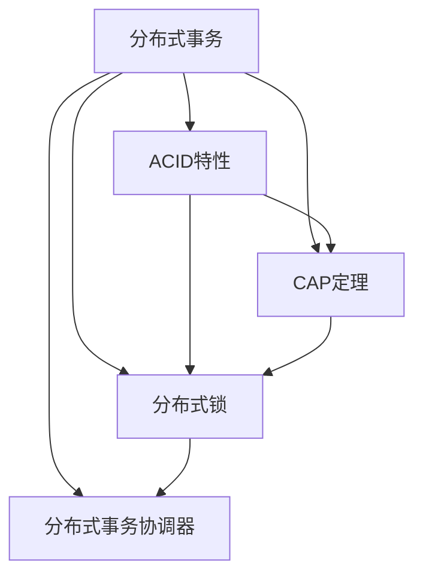

                 

# 分布式事务：保证数据一致性的挑战与方案

> 关键词：分布式事务, 数据一致性, ACID, CAP定理, 分布式锁, 分布式事务协调器

## 1. 背景介绍

### 1.1 问题由来

在现代互联网应用中，分布式系统无处不在。无论是微服务架构、云服务、还是高可用性需求，分布式系统都成为不可或缺的一部分。然而，分布式系统的核心挑战之一是数据一致性问题。在一个多节点、多租户、高并发的分布式环境中，如何确保事务的原子性、一致性、隔离性和持久性（ACID特性），是一个复杂而重要的技术难题。

数据一致性问题，不仅影响到系统的正确性、可靠性，还对用户体验和业务逻辑产生了重要影响。例如，当用户在多节点之间进行跨库事务操作时，如果数据在不同节点间无法保持一致，就可能导致系统故障、业务损失甚至数据丢失。因此，如何有效地解决分布式事务中的数据一致性问题，是构建可靠分布式系统的前提。

### 1.2 问题核心关键点

分布式事务的数据一致性问题主要体现在以下几个方面：

- **跨库操作**：不同数据库之间的数据操作如何协同进行？
- **异步通信**：消息传递过程中的时间延迟如何处理？
- **分布式锁**：避免分布式环境下锁竞争，确保事务的串行性。
- **事务隔离**：不同事务之间的隔离级别如何确定？
- **分布式协调**：事务协调机制如何设计，确保所有参与节点的一致性？

本文将围绕上述核心问题，深入探讨分布式事务的原理与实现，并结合实际案例，提出解决方案。

## 2. 核心概念与联系

### 2.1 核心概念概述

为更好地理解分布式事务的原理与实现，本节将介绍几个密切相关的核心概念：

- **分布式事务**：在分布式系统中，跨多个节点的操作被视为一组事务。分布式事务需要保证所有节点上的操作要么全部成功，要么全部失败。
- **ACID特性**：原子性（Atomicity）、一致性（Consistency）、隔离性（Isolation）、持久性（Durability）是事务处理的四个基本属性。
- **CAP定理**：在分布式系统中，一致性（C）、可用性（A）和分区容忍性（P）三个目标不可能同时完全满足。需在A和C之间进行权衡。
- **分布式锁**：在分布式环境中，通过锁机制确保同一时间只有一个事务能够修改共享资源。
- **分布式事务协调器**：协调多个分布式事务，确保它们按照预定顺序和一致性要求执行。

这些核心概念之间的逻辑关系可以通过以下Mermaid流程图来展示：



这个流程图展示了分布式事务的基本概念及其相互之间的关系：

1. 分布式事务通过ACID特性来保证数据一致性。
2. CAP定理揭示了分布式系统中一致性和可用性的权衡。
3. 分布式锁用于保证事务的串行性和避免竞争。
4. 分布式事务协调器用于管理分布式事务，确保其一致性。

这些概念共同构成了分布式事务的理论基础，为我们提供了解决数据一致性问题的方法论。

## 3. 核心算法原理 & 具体操作步骤

### 3.1 算法原理概述

分布式事务的实现涉及跨多个节点的数据操作，这些操作的原子性和一致性需要保证。常见的分布式事务实现方式有XA协议和TCC。

- **XA协议**：通过XA事务管理器协调，确保所有节点上的操作要么全部提交，要么全部回滚。
- **TCC**：通过提交、确认和取消三个操作，实现事务的分段提交。

### 3.2 算法步骤详解

#### 3.2.1 XA协议

1. **准备阶段**：事务管理器（TM）向资源管理器（RM）请求资源分配。资源管理器返回是否可以分配资源的状态。
2. **提交阶段**：如果资源分配成功，事务管理器向资源管理器提交事务。如果所有资源管理器都提交事务，事务成功；如果有任意资源管理器回滚事务，事务回滚。
3. **回滚阶段**：如果事务执行失败，事务管理器向资源管理器请求回滚事务。如果有任意资源管理器无法回滚事务，事务回滚。


#### 3.2.2 TCC

1. **预处理阶段**：事务发起方调用资源管理器提供的事务预处理方法，进行资源分配。
2. **提交阶段**：如果资源分配成功，事务发起方调用资源管理器提供的提交方法，将事务提交。如果所有资源管理器都提交事务，事务成功；如果有任意资源管理器回滚事务，事务回滚。
3. **取消阶段**：如果事务执行失败，事务发起方调用资源管理器提供的取消方法，将事务取消。如果有任意资源管理器无法取消事务，事务回滚。


### 3.3 算法优缺点

#### 3.3.1 XA协议的优缺点

**优点**：
- 支持多节点分布式事务，确保所有节点上的操作要么全部提交，要么全部回滚。
- 提供了严格的ACID特性。

**缺点**：
- 性能开销大，需要频繁的网络通信和资源锁定。
- 对资源管理器的依赖性较高，系统复杂度高。

#### 3.3.2 TCC的优缺点

**优点**：
- 性能开销较低，适合高并发场景。
- 灵活度高，可以根据业务需求进行定制。

**缺点**：
- 事务的提交、确认和取消操作需要与业务逻辑紧密耦合，增加了系统的复杂性。
- 如果确认操作失败，需要重新进行提交操作，增加了系统的开销。

### 3.4 算法应用领域

分布式事务广泛应用于金融、电商、物流等高可用性要求的业务场景中。例如：

- **金融行业**：跨银行转账、信用卡支付等业务场景需要严格的事务一致性。
- **电商行业**：订单下单、库存扣减等业务场景需要确保事务的原子性和一致性。
- **物流行业**：货物运输、订单处理等业务场景需要跨系统的协调一致。

## 4. 数学模型和公式 & 详细讲解 & 举例说明

### 4.1 数学模型构建

在分布式事务中，数学模型构建需要考虑跨节点操作的同步和协调。假设分布式事务涉及n个节点，每个节点的状态用变量$s_i$表示，初始状态为$s_i^0$。事务执行过程中，每个节点需要对变量进行一系列操作，最终状态为$s_i^n$。

事务的一致性可以通过以下数学模型来表示：

$$
s_i^n = f(s_i^{n-1}, f_{i-1}(s_{i-1}^{n-1})), \quad i=1,...,n
$$

其中$f$为每个节点对变量进行操作的函数，$f_{i-1}$为前一个节点的函数。

### 4.2 公式推导过程

假设每个节点的初始状态为$s_i^0$，事务执行过程中每个节点执行的操作为$f$，则有：

$$
s_i^1 = f(s_i^0)
$$
$$
s_i^2 = f(s_i^1)
$$
$$
\cdots
$$
$$
s_i^n = f(s_i^{n-1})
$$

根据上述模型，事务的一致性可以表示为：

$$
s_1^n = f_1(f_0(s_0^n))
$$
$$
s_2^n = f_2(f_1(s_1^n))
$$
$$
\cdots
$$
$$
s_n^n = f_n(f_{n-1}(s_{n-1}^n))
$$

在实际应用中，事务的协调可以通过以下步骤来实现：

1. **事务准备**：所有节点同时准备，分配资源。
2. **事务执行**：每个节点依次执行操作，更新变量。
3. **事务提交**：所有节点同时提交事务。
4. **事务回滚**：所有节点同时回滚事务。

### 4.3 案例分析与讲解

假设有一个分布式事务，涉及两个节点A和B，每个节点都有一个变量$s$，初始值分别为$s_A^0 = 100$和$s_B^0 = 200$。事务执行过程中，每个节点对变量进行操作，具体过程如下：

1. **准备阶段**：所有节点同时准备，分配资源。
2. **执行阶段**：
   - A节点对$s_A$进行操作：$s_A = s_A - 50$
   - B节点对$s_B$进行操作：$s_B = s_B + 50$
3. **提交阶段**：所有节点同时提交事务。
4. **回滚阶段**：如果有任意节点无法提交事务，则回滚所有操作。

事务完成后，节点A和B的状态分别为：

- A节点：$s_A = 100 - 50 = 50$
- B节点：$s_B = 200 + 50 = 250$

如果所有节点都成功提交事务，则事务成功。否则，所有节点回滚事务，恢复初始状态。

## 5. 项目实践：代码实例和详细解释说明

### 5.1 开发环境搭建

在进行分布式事务的开发和实践前，我们需要准备好开发环境。以下是使用Java和Spring Boot进行开发的示例：

1. **安装JDK**：从官网下载并安装JDK 8或以上版本。
2. **安装Maven**：从官网下载并安装Maven。
3. **安装Spring Boot**：从官网下载并安装Spring Boot。
4. **创建项目**：使用Spring Boot的Web应用程序模板，创建分布式事务项目。
5. **添加依赖**：在Maven的pom.xml文件中添加分布式事务依赖，如Atomikos、XA事务管理器等。

完成上述步骤后，即可在开发环境中进行分布式事务的开发和实践。

### 5.2 源代码详细实现

以下是一个使用Atomikos实现XA事务的Java代码示例：

```java
import org.atomikos.jdbc.AtomikosDataSourceBean;

import javax.sql.DataSource;
import java.sql.Connection;
import java.sql.SQLException;

public classXAEventHandler {
    private static final String DATASOURCE = "datasource";

    public void handleXAEvent(XAEvent event) {
        Connection connection = null;
        try {
            AtomikosDataSourceBean atomikosDataSourceBean = (AtomikosDataSourceBean) getBean(DATASOURCE);
            DataSource dataSource = atomikosDataSourceBean.getDataSource();
            connection = dataSource.getConnection();
            // 执行分布式事务
            connection.setAutoCommit(false);
            connection.setXAResource(event.getResource());
            connection.commit();
        } catch (Exception e) {
            try {
                if (connection != null) {
                    connection.rollback();
                }
            } catch (SQLException ex) {
                // handle exception
            }
        } finally {
            if (connection != null) {
                try {
                    connection.close();
                } catch (SQLException ex) {
                    // handle exception
                }
            }
        }
    }

    private Object getBean(String name) {
        return getApplicationContext().getBean(name);
    }

    private SpringApplicationContext getApplicationContext() {
        // load application context
        return new ClassPathXmlApplicationContext("applicationContext.xml");
    }
}
```

### 5.3 代码解读与分析

上述代码实现了一个XAEvent事件处理器，用于处理分布式事务中的XA事件。具体实现步骤如下：

1. **获取数据源**：通过Spring容器获取数据源。
2. **创建连接**：使用数据源创建数据库连接。
3. **设置XA资源**：将XA事件资源设置到连接上。
4. **执行事务**：执行分布式事务操作，提交事务。
5. **处理异常**：在发生异常时，回滚事务。
6. **关闭连接**：在finally块中关闭数据库连接。

该代码使用了Atomikos库，该库提供了XA事务的实现和XA资源的协调。在实际应用中，需要根据具体情况进行配置和优化，以确保事务的可靠性和性能。

### 5.4 运行结果展示

在运行上述代码后，可以在Spring Boot的应用程序中看到分布式事务的执行结果。如果所有节点都成功提交事务，则事务成功。否则，所有节点回滚事务，恢复初始状态。

## 6. 实际应用场景

### 6.1 银行业务场景

在银行业务中，跨银行转账和信用卡支付等业务场景需要严格的事务一致性。通过分布式事务，可以确保在多个银行之间转账时，要么全部转账成功，要么全部失败，避免资金损失和业务异常。

### 6.2 电商业务场景

在电商业务中，订单下单和库存扣减等业务场景需要确保事务的原子性和一致性。通过分布式事务，可以确保在订单下单时，库存同时被扣减，避免重复下单和库存异常。

### 6.3 物流业务场景

在物流业务中，货物运输和订单处理等业务场景需要跨系统的协调一致。通过分布式事务，可以确保在多个物流节点之间运输货物时，要么全部运输成功，要么全部失败，避免货物丢失和业务异常。

## 7. 工具和资源推荐

### 7.1 学习资源推荐

为了帮助开发者系统掌握分布式事务的原理与实践，这里推荐一些优质的学习资源：

1. **《分布式系统实战》**：介绍分布式系统的基础架构和设计原则，涵盖分布式事务、高可用性等内容。
2. **《Spring Cloud微服务架构》**：介绍Spring Cloud的分布式事务支持，涵盖XA协议和TCC等实现方式。
3. **《Atomikos官方文档》**：提供Atomikos的详细配置和使用指南，涵盖XA协议和分布式事务的实现。
4. **《分布式事务基础》**：介绍分布式事务的基础概念和实现方式，涵盖XA协议和TCC等技术。
5. **《Apache Kafka分布式事务》**：介绍Kafka的分布式事务支持，涵盖XA协议和Kafka的事务协调器。

通过对这些资源的学习实践，相信你一定能够快速掌握分布式事务的精髓，并用于解决实际的分布式系统问题。

### 7.2 开发工具推荐

高效的开发离不开优秀的工具支持。以下是几款用于分布式事务开发的常用工具：

1. **Spring Boot**：基于Spring框架的微服务开发框架，提供丰富的分布式事务支持。
2. **Atomikos**：提供XA事务的实现和XA资源的协调，支持分布式事务的开发和部署。
3. **Apache Kafka**：提供分布式事务的支持，适用于高并发、高可用的场景。
4. **Redis**：提供分布式锁的支持，确保事务的串行性和一致性。
5. **MySQLXADataSource**：提供MySQL数据库的事务支持，支持XA协议的分布式事务实现。

合理利用这些工具，可以显著提升分布式事务的开发效率，加快创新迭代的步伐。

### 7.3 相关论文推荐

分布式事务的研究源于学界的持续探索。以下是几篇奠基性的相关论文，推荐阅读：

1. **《ACID: A Conceptual Framework for Reliable Computation》**：提出ACID特性的基本概念，阐述事务处理的四个基本属性。
2. **《CAP定理》**：阐述一致性、可用性和分区容忍性之间的权衡，揭示分布式系统的本质。
3. **《XA事务协议》**：介绍XA协议的实现和协调机制，涵盖分布式事务的常见实现方式。
4. **《分布式事务在Kubernetes上的实现》**：介绍分布式事务在Kubernetes上的实现方式，涵盖XA协议和TCC等技术。
5. **《分布式锁在多节点环境下的实现》**：介绍分布式锁在多节点环境下的实现方式，涵盖Redis和Zookeeper等技术。

这些论文代表了大规模分布式事务技术的发展脉络。通过学习这些前沿成果，可以帮助研究者把握学科前进方向，激发更多的创新灵感。

## 8. 总结：未来发展趋势与挑战

### 8.1 总结

本文对分布式事务的原理与实现进行了全面系统的介绍。首先阐述了分布式事务的挑战和重要性，明确了在分布式系统中保证数据一致性的必要性。其次，从原理到实践，详细讲解了分布式事务的数学模型和实现方法，给出了分布式事务任务开发的完整代码实例。同时，本文还探讨了分布式事务在多个实际场景中的应用，展示了分布式事务技术的广泛价值。

通过本文的系统梳理，可以看到，分布式事务技术在构建高可用性、高可扩展性的分布式系统中发挥着至关重要的作用。它通过ACID特性和CAP定理等理论基础，确保了分布式系统的一致性和可靠性，为系统的高效运作提供了坚实的保障。未来，伴随分布式系统技术的不断演进，分布式事务技术也将不断进步，为构建更加高效、可靠、安全的软件系统提供强大的技术支撑。

### 8.2 未来发展趋势

展望未来，分布式事务技术将呈现以下几个发展趋势：

1. **自动化部署和运维**：通过自动化工具和平台，简化分布式事务的部署和运维过程，提升系统的可靠性和稳定性。
2. **跨云平台支持**：支持在多个云平台之间进行分布式事务的协调和管理，提高系统的可扩展性和兼容性。
3. **支持微服务架构**：分布式事务技术在微服务架构中的应用将更加广泛，支持高并发的微服务系统。
4. **异步事务支持**：支持异步事务，提高系统的并发能力和响应速度。
5. **分布式锁优化**：优化分布式锁的实现方式，提高锁的性能和可靠性。

这些趋势将进一步提升分布式事务技术的成熟度和应用范围，为构建更加高效、可靠、安全的软件系统提供有力的技术支持。

### 8.3 面临的挑战

尽管分布式事务技术已经取得了显著进展，但在迈向更加智能化、普适化应用的过程中，它仍面临诸多挑战：

1. **跨云平台一致性**：不同云平台之间的分布式事务一致性难以保证，需要设计统一的跨云平台协调机制。
2. **异步事务的可靠性**：异步事务的可靠性问题仍然存在，如何在保证性能的同时，确保事务的可靠性，是一个需要解决的问题。
3. **分布式锁的竞争**：在高并发环境下，分布式锁的竞争可能导致系统性能下降，如何优化分布式锁的实现，提高系统的并发能力，是一个重要挑战。
4. **数据一致性的保障**：在分布式环境下，如何确保数据的一致性和可靠性，是一个复杂的技术问题。
5. **系统复杂度的提升**：分布式事务技术的实现和运维复杂度较高，需要系统架构师具备较高的技术水平和经验。

这些挑战需要我们在实际应用中不断探索和优化，才能真正实现分布式事务技术的广泛应用。

### 8.4 研究展望

面对分布式事务技术面临的挑战，未来的研究需要在以下几个方面寻求新的突破：

1. **自动化事务管理**：通过自动化工具和平台，简化分布式事务的部署和运维过程，提升系统的可靠性和稳定性。
2. **跨云平台一致性**：设计统一的跨云平台分布式事务协调机制，确保不同云平台之间的事务一致性。
3. **异步事务可靠性**：研究异步事务的实现和可靠性保障机制，提高系统的并发能力和响应速度。
4. **分布式锁优化**：优化分布式锁的实现方式，提高锁的性能和可靠性。
5. **数据一致性保障**：研究如何在分布式环境下确保数据的一致性和可靠性，提升系统的可靠性。
6. **系统复杂度优化**：设计简单、易维护的分布式事务系统架构，提高系统的可扩展性和可维护性。

这些研究方向将进一步推动分布式事务技术的成熟，为构建高效、可靠、安全的软件系统提供新的技术路径。

## 9. 附录：常见问题与解答

**Q1：分布式事务和本地事务有什么区别？**

A: 分布式事务涉及多个节点和数据库，而本地事务只涉及单个节点和数据库。本地事务通常使用ACID特性，确保事务的原子性、一致性、隔离性和持久性。而分布式事务需要跨多个节点和数据库进行协调，确保所有节点上的操作要么全部成功，要么全部失败。

**Q2：如何设计分布式事务的架构？**

A: 设计分布式事务的架构需要考虑以下几个方面：
1. 选择合适的分布式事务协调器，如XA协议、TCC等。
2. 设计事务的分段操作，确保每个操作都有提交、确认和取消三个操作。
3. 考虑系统的负载均衡和容错机制，确保系统的稳定性和可靠性。
4. 采用分布式锁机制，避免分布式环境下锁竞争。

**Q3：如何优化分布式锁的实现？**

A: 优化分布式锁的实现需要考虑以下几个方面：
1. 选择合适的分布式锁实现方式，如Redis、Zookeeper等。
2. 设计合理的锁粒度和锁超时机制，避免锁竞争和死锁。
3. 考虑锁的性能和可靠性，采用分布式锁缓存机制，减少锁的竞争。

**Q4：如何处理分布式事务中的异步通信问题？**

A: 处理分布式事务中的异步通信问题需要考虑以下几个方面：
1. 采用异步通信机制，减少事务的通信延迟。
2. 设计合理的超时机制，避免事务的长时间等待。
3. 考虑网络延迟和故障恢复，确保事务的可靠性。

**Q5：如何在微服务架构中实现分布式事务？**

A: 在微服务架构中实现分布式事务需要考虑以下几个方面：
1. 采用微服务事务管理器，如Spring Cloud中的Saga模式。
2. 设计微服务之间的通信机制，确保事务的串行性和一致性。
3. 考虑微服务架构的分布式特性，设计合理的分布式事务协调机制。

这些研究方向的探索，将推动分布式事务技术的不断进步，为构建高效、可靠、安全的软件系统提供新的技术路径。

---

作者：禅与计算机程序设计艺术 / Zen and the Art of Computer Programming

