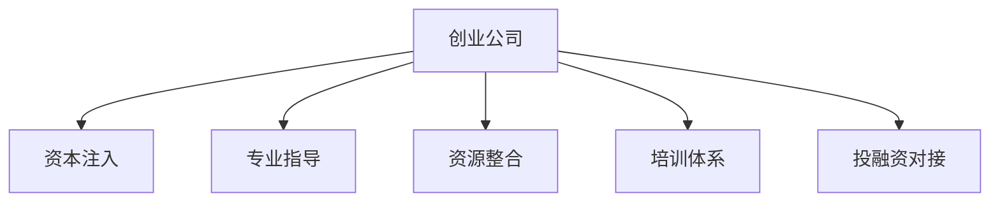

                 

# 创业知识加速器分享创业成果和经验

> 关键词：创业知识，加速器，创业成果，创业经验，创新思维

## 1. 背景介绍

### 1.1 问题由来
近年来，创业热潮席卷全球，特别是在高科技、互联网、生物医疗等前沿领域，涌现出了大量创新型企业。然而，随着市场竞争日益激烈，创业公司的生存压力也在不断增大。为了帮助创业公司克服生存危机，加速器（Accelerator）应运而生。创业加速器通过提供资本、网络、指导、培训等多方面的资源，帮助创业公司快速成长，实现从0到1的突破。

### 1.2 问题核心关键点
创业加速器能够迅速助力创业公司成长，主要依赖于以下几个关键点：
1. **资本注入**：为创业公司提供必要的启动资金，避免资金短缺问题。
2. **专业指导**：邀请资深导师，提供行业经验、市场洞察、技术指导等多方面支持。
3. **资源整合**：提供办公空间、办公设备、网络资源、人才招聘等全面资源支持。
4. **培训体系**：组织各种培训课程、路演、论坛等活动，提升创业团队综合素质。
5. **投融资对接**：提供丰富的投融资渠道，帮助创业公司对接风险投资、天使投资等资本。

这些关键点构成了创业加速器的主要价值链，有效降低了创业公司的初始成本和运营风险，极大提高了创业成功的概率。

### 1.3 问题研究意义
研究创业加速器对创业公司的影响和效果，对于理解创业生态系统的运作机制、优化创业环境、推动创新创业具有重要意义。通过对创业加速器的深入研究，可以总结出一套有效的创业支持体系，帮助更多创业公司实现快速发展。

## 2. 核心概念与联系

### 2.1 核心概念概述

创业加速器（Accelerator）是一个集资本、指导、资源、培训于一体的创业生态系统。其核心目标是：
1. **加速成长**：帮助创业公司快速成长，缩短产品从研发到上市的时间。
2. **风险分担**：通过提供资本支持，分散创业公司的财务风险。
3. **资源整合**：提供各类资源支持，帮助创业公司克服运营障碍。
4. **导师辅导**：邀请行业专家、投资人等，提供专业的指导和建议。
5. **投融资对接**：助力创业公司对接资本市场，解决融资难题。

创业加速器是创业生态系统中非常重要的一环，通过对创业公司全方位的支持，极大提高了创业公司的成功率和市场竞争力。

### 2.2 核心概念原理和架构的 Mermaid 流程图


## 3. 核心算法原理 & 具体操作步骤
### 3.1 算法原理概述

创业加速器的工作机制主要基于“全链条、全方位、全周期”的支持模型。其核心算法原理如下：

1. **资本注入算法**：根据创业公司的财务需求，提供定制化的资本支持方案。
2. **专业指导算法**：邀请行业专家，通过一对一的指导和培训，提升创业团队的专业能力。
3. **资源整合算法**：建立资源共享平台，提供办公空间、办公设备、网络资源、人才招聘等服务。
4. **培训体系算法**：设计系统的培训课程，包括市场洞察、技术指导、商业策略、路演技巧等，全面提升创业团队的综合素质。
5. **投融资对接算法**：建立广泛的资本网络，提供多渠道的融资对接机会，帮助创业公司顺利过渡到成长期。

### 3.2 算法步骤详解

以下是创业加速器各个关键算法步骤的详细解释：

**步骤一：资本注入**
- **评估财务需求**：对创业公司的财务状况进行详细评估，确定资本需求。
- **定制化资本方案**：根据评估结果，制定个性化的资本支持方案。
- **快速资金到位**：在较短时间内完成资金注入，确保创业公司有足够的运营资金。

**步骤二：专业指导**
- **邀请导师**：邀请行业内的资深专家、投资人担任创业公司的导师。
- **定期辅导**：与导师定期进行一对一的辅导和交流，解决创业公司面临的实际问题。
- **定期评估**：定期评估创业公司的进展，提供专业的指导和建议。

**步骤三：资源整合**
- **办公空间**：提供办公场地，确保创业公司有良好的工作环境。
- **办公设备**：提供必要的办公设备，确保创业公司有良好的工作条件。
- **网络资源**：提供互联网、Wi-Fi等网络资源，确保创业公司有良好的网络环境。
- **人才招聘**：帮助创业公司招聘合适的员工，确保创业公司有稳定的团队。

**步骤四：培训体系**
- **课程设计**：设计系统的培训课程，涵盖市场洞察、技术指导、商业策略、路演技巧等。
- **专家授课**：邀请行业内的专家、投资人、知名企业家等，进行课程讲授。
- **实战演练**：组织各种实战演练、模拟路演、商业计划书评审等活动，提升创业团队的实战能力。

**步骤五：投融资对接**
- **资本网络**：建立广泛的资本网络，包括风投、天使投资等。
- **路演机会**：组织各种路演活动，帮助创业公司对接投资人。
- **融资对接**：帮助创业公司完成融资对接，确保创业公司有足够的资本支持。

### 3.3 算法优缺点

创业加速器的核心算法具有以下优点：
1. **全面支持**：通过提供全方位的支持，帮助创业公司快速成长，缩短上市周期。
2. **风险分担**：通过提供资本支持，分散创业公司的财务风险。
3. **导师辅导**：邀请行业专家提供指导，提升创业团队的专业能力。
4. **资源整合**：提供各类资源支持，帮助创业公司克服运营障碍。
5. **投融资对接**：助力创业公司对接资本市场，解决融资难题。

同时，该算法也存在一些缺点：
1. **高成本**：创业加速器的运作需要大量的资本和资源投入，成本较高。
2. **资源不对称**：不是所有创业公司都能获得创业加速器的支持，资源分配不均衡。
3. **盈利压力**：创业加速器需要从创业者成功中获得收益，有一定的盈利压力。
4. **管理难度**：创业加速器需要管理多个创业项目，管理难度较大。

尽管存在这些缺点，但创业加速器在推动创业公司快速成长、提升市场竞争力方面，依然具有不可替代的价值。

### 3.4 算法应用领域

创业加速器的算法主要应用于以下几个领域：

1. **科技创业**：帮助科技型创业公司解决技术难题，提供资本支持。
2. **互联网创业**：帮助互联网创业公司进行市场定位，提供资源整合和投融资对接。
3. **生物医疗创业**：帮助生物医疗创业公司进行技术研发，提供专业指导和投融资支持。
4. **文化创意创业**：帮助文化创意创业公司进行市场推广，提供资源整合和投融资对接。
5. **新材料创业**：帮助新材料创业公司进行技术研发，提供专业指导和资本支持。

## 4. 数学模型和公式 & 详细讲解 & 举例说明
### 4.1 数学模型构建

创业加速器的核心算法可以构建为数学模型，如下所示：

- **资本注入模型**：设创业公司的初始资本为 $C_0$，加速器提供的资本为 $C_a$，则资本注入后的总资本为 $C_1 = C_0 + C_a$。
- **专业指导模型**：设创业公司的初始团队规模为 $T_0$，加速器提供的指导时间为 $T_a$，则指导后的团队规模为 $T_1 = T_0 + T_a$。
- **资源整合模型**：设创业公司的初始资源量为 $R_0$，加速器提供的资源量为 $R_a$，则整合后的资源量为 $R_1 = R_0 + R_a$。
- **培训体系模型**：设创业公司的初始培训时长为 $P_0$，加速器提供的培训时长为 $P_a$，则培训后的总时长为 $P_1 = P_0 + P_a$。
- **投融资对接模型**：设创业公司的初始融资需求为 $F_0$，加速器对接的融资量为 $F_a$，则对接后的总融资量为 $F_1 = F_0 + F_a$。

### 4.2 公式推导过程

以资本注入模型为例，进行详细推导：

设创业公司的初始资本为 $C_0$，加速器提供的资本为 $C_a$，则资本注入后的总资本为：

$$
C_1 = C_0 + C_a
$$

其中，$C_0$ 表示创业公司的初始资本，$C_a$ 表示加速器提供的资本。

以专业指导模型为例，进行详细推导：

设创业公司的初始团队规模为 $T_0$，加速器提供的指导时间为 $T_a$，则指导后的团队规模为：

$$
T_1 = T_0 + T_a
$$

其中，$T_0$ 表示创业公司的初始团队规模，$T_a$ 表示加速器提供的指导时间。

### 4.3 案例分析与讲解

以Y Combinator创业加速器为例，进行详细分析：

Y Combinator成立于2005年，是全球最著名的创业加速器之一。其提供的支持包括：

- **资本注入**：提供10万美元的资金支持，帮助创业公司度过起步阶段。
- **专业指导**：提供每周一次的指导，邀请行业专家、投资人等，提供专业建议。
- **资源整合**：提供办公场地、办公设备、网络资源、人才招聘等服务。
- **培训体系**：设计系统的培训课程，涵盖市场洞察、技术指导、商业策略、路演技巧等。
- **投融资对接**：帮助创业公司对接风投、天使投资等资本。

Y Combinator的商业模式是以创业公司成功为导向，通过分取创业公司的成功回报来实现盈利。该加速器已经成功孵化了数千个创业项目，包括Airbnb、Dropbox、Stripe等知名企业。

## 5. 项目实践：代码实例和详细解释说明
### 5.1 开发环境搭建

创业加速器的项目实践需要具备以下开发环境：

1. **Python环境**：安装Python 3.x版本，用于开发创业加速器的支持系统。
2. **Web服务器**：搭建Web服务器，支持创业公司在线提交申请和查询状态。
3. **数据库系统**：安装MySQL或MongoDB等数据库系统，存储创业公司的申请信息和状态。
4. **API接口**：开发API接口，支持创业公司查询信息和提交申请。
5. **后台管理系统**：开发后台管理系统，支持管理员对申请信息进行管理。

### 5.2 源代码详细实现

以下是使用Python Flask框架搭建创业加速器系统的示例代码：

```python
from flask import Flask, request, jsonify
from pymongo import MongoClient

app = Flask(__name__)

# 连接MongoDB数据库
client = MongoClient('mongodb://localhost:27017/')
db = client['创业加速器数据库']
collection = db['申请信息表']

@app.route('/submit_application', methods=['POST'])
def submit_application():
    data = request.get_json()
    application_id = collection.insert_one(data).inserted_id
    return jsonify({'id': application_id}), 201

@app.route('/get_application_status', methods=['GET'])
def get_application_status():
    data = collection.find_one({'id': request.args.get('id')})
    return jsonify(data)

@app.route('/update_application_status', methods=['PUT'])
def update_application_status():
    data = request.get_json()
    collection.update_one({'id': data['id']}, {'$set': data['data']})
    return jsonify({'status': 'success'})

if __name__ == '__main__':
    app.run(debug=True)
```

### 5.3 代码解读与分析

上述代码实现了使用Python Flask框架搭建创业加速器支持系统的基本功能：

1. **连接MongoDB数据库**：使用Pymongo连接MongoDB数据库，存储创业公司的申请信息和状态。
2. **提交申请接口**：提供POST接口，创业公司可以通过接口提交申请信息。
3. **查询申请状态接口**：提供GET接口，创业公司可以通过接口查询申请状态。
4. **更新申请状态接口**：提供PUT接口，管理员可以通过接口更新申请状态。

## 6. 实际应用场景

### 6.1 智能制造

创业加速器在智能制造领域具有广泛的应用前景。传统的制造业面临生产效率低、产品品质不稳定等问题，迫切需要引入先进的技术和理念。通过创业加速器，可以引进智能制造领域的创业公司，推动传统制造业的数字化转型。

### 6.2 智慧城市

智慧城市建设需要引入大量的高科技创业公司，提供智能交通、智慧环保、智慧安防等解决方案。创业加速器可以通过提供资本支持、专业指导、资源整合等全方位的支持，帮助创业公司快速成长，提升智慧城市建设的效率和质量。

### 6.3 新零售

新零售时代需要引入大量的互联网创业公司，推动零售行业的数字化、智能化发展。创业加速器可以通过提供资本支持、专业指导、投融资对接等全方位的支持，帮助创业公司快速成长，提升新零售行业的竞争力。

### 6.4 未来应用展望

随着科技的不断进步，创业加速器在各个领域的应用将不断拓展。未来，创业加速器将与更多新兴技术结合，为更多领域提供全方位的支持，推动社会经济的全面发展。

## 7. 工具和资源推荐
### 7.1 学习资源推荐

为了帮助创业公司快速掌握创业加速器的知识，以下是一些推荐的资源：

1. **《创业加速器手册》**：系统介绍了创业加速器的运作机制、流程、成功案例等。
2. **《创业加速器实践指南》**：提供了详细的创业加速器操作手册，包括申请、指导、培训、融资等环节。
3. **《创业加速器网络课程》**：提供系统的创业加速器培训课程，涵盖市场洞察、技术指导、商业策略等。
4. **《创业加速器案例研究》**：提供了大量的创业加速器成功案例，供创业公司参考借鉴。
5. **《创业加速器资源平台》**：提供了创业加速器的资源整合平台，包括办公场地、办公设备、网络资源等。

### 7.2 开发工具推荐

以下是一些推荐的创业加速器开发工具：

1. **Python Flask**：提供了简单易用的开发框架，支持快速开发创业加速器支持系统。
2. **MySQL/MongoDB**：提供了稳定高效的数据库系统，支持存储创业公司的申请信息和状态。
3. **Postman**：提供了强大的API测试工具，支持测试创业加速器API接口。
4. **Jira**：提供了项目管理工具，支持创业加速器项目的管理和跟踪。
5. **Slack**：提供了团队协作工具，支持创业加速器团队的高效沟通。

### 7.3 相关论文推荐

以下是一些推荐的创业加速器相关论文：

1. **《创业加速器：如何帮助创业公司快速成长》**：详细介绍了创业加速器的运作机制和成功案例。
2. **《创业加速器的未来发展趋势》**：探讨了创业加速器的未来发展方向和趋势。
3. **《创业加速器对创业公司的影响研究》**：分析了创业加速器对创业公司的影响和效果。
4. **《创业加速器的资源整合与优化》**：探讨了创业加速器的资源整合策略和优化方法。
5. **《创业加速器的投融资对接策略》**：研究了创业加速器的投融资对接策略和效果。

## 8. 总结：未来发展趋势与挑战
### 8.1 总结

创业加速器在推动创业公司成长、提升市场竞争力方面，发挥了重要作用。通过提供全方位的支持，创业加速器帮助创业公司快速成长，缩短上市周期，降低运营风险，提升创业成功的概率。然而，创业加速器也面临着高成本、资源不对称、盈利压力等挑战。未来，创业加速器需要不断优化运作模式，提升资源利用效率，才能更好地服务于创业公司。

### 8.2 未来发展趋势

未来，创业加速器的发展趋势主要体现在以下几个方面：

1. **智能化发展**：引入更多人工智能技术，提升创业公司的智能化水平，降低运营成本。
2. **全球化布局**：扩大覆盖范围，建立全球化的创业加速器网络，提升创业公司的国际化竞争力。
3. **垂直领域深化**：聚焦特定领域，提供更加精细化的创业支持，提升创业公司的专业化水平。
4. **投融资对接优化**：优化投融资对接机制，提高创业公司的融资效率，降低融资成本。
5. **可持续发展**：注重可持续发展，提升创业加速器的社会影响力，推动社会经济的全面发展。

### 8.3 面临的挑战

尽管创业加速器在推动创业公司成长方面发挥了重要作用，但仍然面临一些挑战：

1. **高成本问题**：创业加速器的运作需要大量的资本和资源投入，成本较高。
2. **资源不对称问题**：不是所有创业公司都能获得创业加速器的支持，资源分配不均衡。
3. **盈利压力问题**：创业加速器需要从创业者成功中获得收益，有一定的盈利压力。
4. **管理难度问题**：创业加速器需要管理多个创业项目，管理难度较大。
5. **市场竞争问题**：创业加速器的市场竞争日益激烈，需要不断创新和优化。

### 8.4 研究展望

未来，创业加速器需要在以下几个方面进行研究探索：

1. **资源优化算法**：研究如何优化资源分配，提升资源利用效率。
2. **投融资对接算法**：研究如何优化投融资对接机制，提高创业公司的融资效率。
3. **智能化算法**：研究如何引入人工智能技术，提升创业公司的智能化水平。
4. **可持续发展算法**：研究如何实现创业加速器的可持续发展，提升社会影响力。
5. **垂直领域算法**：研究如何聚焦特定领域，提供更加精细化的创业支持。

创业加速器作为创业生态系统的重要组成部分，需要不断创新和优化，才能更好地服务于创业公司，推动社会经济的全面发展。

## 9. 附录：常见问题与解答

**Q1：如何选择合适的创业加速器？**

A: 选择合适的创业加速器需要考虑以下因素：

1. **覆盖范围**：选择覆盖自己所在行业的创业加速器。
2. **资源支持**：选择提供全面资源支持的创业加速器。
3. **导师团队**：选择导师团队经验丰富的创业加速器。
4. **投融资渠道**：选择投融资渠道丰富的创业加速器。
5. **成功案例**：选择成功案例丰富的创业加速器。

**Q2：如何利用创业加速器的资源支持？**

A: 利用创业加速器的资源支持需要考虑以下因素：

1. **申请流程**：按照创业加速器的申请流程提交申请。
2. **导师沟通**：积极与导师沟通，获取专业指导和建议。
3. **资源整合**：充分利用创业加速器提供的资源，提升自身能力。
4. **培训课程**：积极参加创业加速器的培训课程，提升自身素质。
5. **投融资对接**：积极与创业加速器对接投融资资源，解决融资难题。

**Q3：创业加速器如何提升创业公司的成功率？**

A: 创业加速器通过以下方式提升创业公司的成功率：

1. **资本注入**：提供必要的资金支持，帮助创业公司度过起步阶段。
2. **专业指导**：邀请行业专家，提供专业建议，提升创业公司的专业能力。
3. **资源整合**：提供办公场地、办公设备、网络资源、人才招聘等服务，提升创业公司的运营能力。
4. **培训体系**：提供系统的培训课程，提升创业公司的综合素质。
5. **投融资对接**：帮助创业公司对接资本市场，解决融资难题。

**Q4：创业加速器在创业公司成长过程中扮演什么角色？**

A: 创业加速器在创业公司成长过程中扮演以下角色：

1. **孵化器**：提供必要的资本、资源、指导等支持，帮助创业公司快速成长。
2. **加速器**：通过专业的指导和培训，提升创业公司的专业能力和综合素质。
3. **投资者**：帮助创业公司对接资本市场，解决融资难题。
4. **赋能者**：通过提供全方位的支持，帮助创业公司实现从0到1的突破。

**Q5：如何应对创业加速器面临的挑战？**

A: 应对创业加速器面临的挑战需要考虑以下因素：

1. **资源优化**：优化资源分配，提升资源利用效率。
2. **投融资对接**：优化投融资对接机制，提高创业公司的融资效率。
3. **智能化发展**：引入人工智能技术，提升创业公司的智能化水平。
4. **可持续发展**：注重可持续发展，提升创业加速器的社会影响力。
5. **垂直领域深化**：聚焦特定领域，提供更加精细化的创业支持。

---

作者：禅与计算机程序设计艺术 / Zen and the Art of Computer Programming

