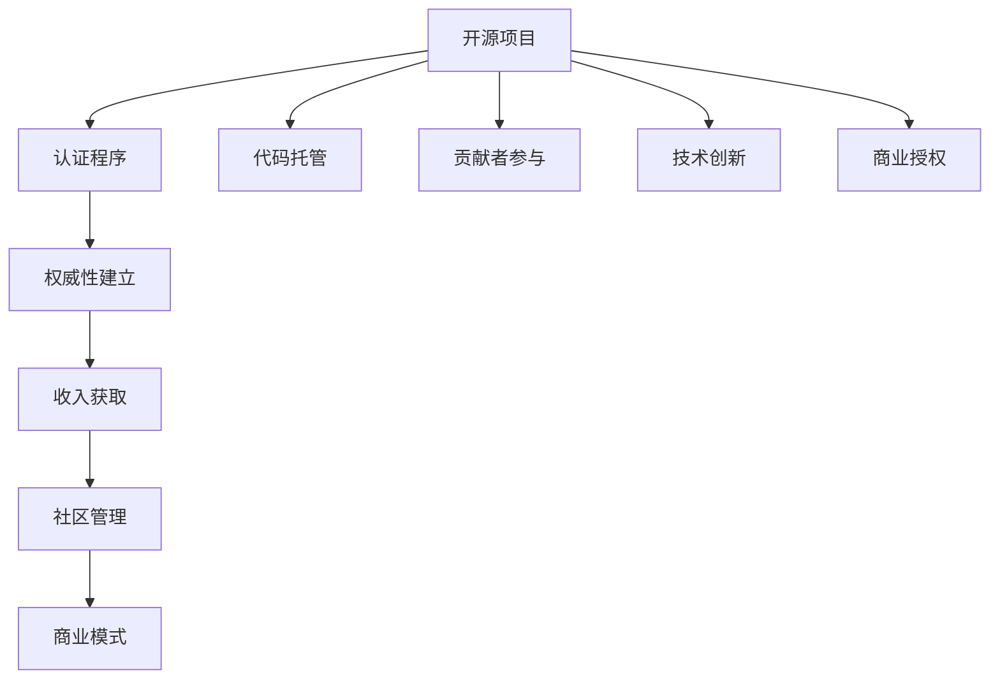

                 

# 创建开源项目的认证程序：建立权威和收入

> 关键词：开源项目、认证程序、权威建立、收入获取

## 1. 背景介绍

### 1.1 问题由来

随着开源运动在全球范围内的蓬勃发展，越来越多的开发者参与到开源项目的建设和维护中。开源项目的持续成功不仅依赖于高质量的代码和技术创新，更需要一套完善的社区管理和认证机制来保障项目的权威性和可持续性。然而，如何建立和维护一个具备权威性的开源项目，并从中获取稳定收入，成为摆在新兴开源项目面前的一大难题。

### 1.2 问题核心关键点

建立权威性和收入的开源项目认证程序，涉及开源社区的广泛参与、项目质量评估、技术创新驱动、商业模式探索等多个环节。核心在于如何在开放协作与商业化之间找到平衡点，既能够吸引社区贡献者，又能够从项目中获取稳定收入。

## 2. 核心概念与联系

### 2.1 核心概念概述

为更好地理解开源项目认证程序的核心机制，本节将介绍几个密切相关的核心概念：

- **开源项目（Open Source Project, OSP）**：指在开放许可协议下，可自由访问、修改和分发源代码的软件项目。常见的开源许可证包括GPL、MIT、Apache等。
- **认证程序（Certification Program）**：指开源社区或第三方机构，为评估开源项目的技术质量、社区活跃度、商业应用潜力等指标而制定的评估标准和流程。
- **权威性（Authority）**：指开源项目在技术社区中的地位和声誉，反映其是否具备高质量、创新性、开放性等特性。权威性通常由开源社区的认可和第三方机构的认证共同建立。
- **收入获取（Revenue Generation）**：指开源项目从商业化运作中获得的财务回报，主要来源于代码托管费、咨询服务、技术支持、商业授权等。
- **社区管理（Community Management）**：指开源项目维护者对项目开发、文档维护、代码审查、用户反馈处理等社区活动的管理。
- **商业模式（Business Model）**：指开源项目如何通过开源与商业的有机结合，实现经济价值的持续增长。常见的开源商业模式包括Apache基金会、Linux Foundation、SourceForge等。

这些核心概念之间的逻辑关系可以通过以下Mermaid流程图来展示：



这个流程图展示了大规模开源项目的核心概念及其之间的关系：

1. 开源项目通过提供高质量代码和技术创新，获得社区认可。
2. 认证程序通过标准化的评估流程，确保项目的权威性。
3. 权威性的建立使得项目能够在商业领域获得应用，从而获取收入。
4. 社区管理保证了项目的持续健康发展和稳定贡献。
5. 商业模式为项目的商业化运作提供了框架和策略。

这些概念共同构成了开源项目的治理架构，为其权威性和收入提供支持。

## 3. 核心算法原理 & 具体操作步骤
### 3.1 算法原理概述

开源项目认证程序的核心理念是通过一套规范化、系统化的评估体系，对项目的质量、贡献、创新、应用潜力进行全面的审核和认证。认证结果不仅用于提升项目的权威性和信誉，也为后续的收入获取提供基础。

### 3.2 算法步骤详解

构建开源项目认证程序一般包括以下几个关键步骤：

**Step 1: 设计认证标准**
- 确定评估项目质量的关键指标，如代码质量、文档完善度、贡献者活跃度等。
- 设计具体的评估标准和细则，如代码审查流程、贡献者审核标准、创新性评估等。
- 确定评估周期和频次，如季度、年度评审。

**Step 2: 创建评估流程**
- 建立评估小组，由技术专家、社区管理者、商业伙伴等组成。
- 设计评估流程和表单，详细记录各项评估指标和评审意见。
- 制定评估时间表和评审规则，确保评估过程公平、公正、公开。

**Step 3: 实施评估与反馈**
- 根据设计好的标准和流程，对开源项目进行初步筛选和预评估。
- 在预评估通过后，进行全面深入的详细评估，收集项目贡献者的反馈。
- 根据评估结果，给出认证建议和改进建议。

**Step 4: 获得认证和监管**
- 根据评估结果，决定是否给予开源项目正式认证。
- 认证后的项目，需定期接受复评，保证持续符合认证标准。
- 建立认证项目的监管机制，对项目进行持续跟踪和管理。

### 3.3 算法优缺点

开源项目认证程序具有以下优点：
1. 提升项目权威性。通过第三方认证，增强项目在技术社区中的可信度和声誉。
2. 确保项目质量。标准化的评估流程确保项目的质量和技术创新能力。
3. 推动社区发展。认证过程鼓励更多的贡献者参与，促进项目的活跃度和贡献度。
4. 促进收入获取。认证项目更容易被商业伙伴和用户采纳，从而获得商业收入。

同时，该程序也存在一定的局限性：
1. 认证过程复杂。需要投入大量的人力和时间进行评估，成本较高。
2. 评估标准主观。不同评估者可能对同一项目的评估结果存在差异。
3. 认证有效期有限。项目认证结果有效期结束后需重新评估，存在不确定性。
4. 商业化风险。认证程序过度商业化可能削弱项目的开放性和社区的自主性。

尽管存在这些局限性，但就目前而言，开源项目认证程序仍是提升项目权威性和收入的重要手段。未来相关研究的重点在于如何进一步降低评估成本，提高评估效率，同时兼顾项目的开放性和商业化需求。

### 3.4 算法应用领域

开源项目认证程序在多个领域得到了广泛应用，涵盖开源社区的各个层面，例如：

- **开源基金会（Open Source Foundation）**：如Apache Foundation、Linux Foundation等。通过认证程序评估和管理开源项目，确保项目符合基金会的要求和标准。
- **开源托管平台（Open Source Hosting Platform）**：如GitHub、SourceForge等。提供认证服务，吸引高质量项目入驻，提升平台的用户粘性和商业价值。
- **开源软件提供商（Open Source Software Provider）**：如Red Hat、Canonical等。通过认证提升产品的质量和市场竞争力，增加客户信任度。
- **开源社区治理（Open Source Community Governance）**：如Open Collective、Open Source Collective等。通过认证程序管理社区项目，促进开源文化的健康发展。

除了上述这些经典领域外，开源项目认证程序也被创新性地应用于更多场景中，如教育、科研、政府开放数据等，为开源技术在各个领域的应用提供保障。

## 4. 数学模型和公式 & 详细讲解  
### 4.1 数学模型构建

本节将使用数学语言对开源项目认证程序的评估机制进行更加严格的刻画。

记开源项目为 $P$，评估标准为 $S$，评估小组为 $G$，认证结果为 $R$。假设评估小组根据评估标准 $S$ 对开源项目 $P$ 进行评估，得到评估结果 $G(P)$，其中 $G$ 为评估函数。

认证结果 $R$ 由评估结果 $G(P)$ 和项目管理者的审核决定 $A(P)$ 共同决定，即：

$$
R(P) = f(G(P), A(P))
$$

其中 $f$ 为认证函数，用于将评估结果和审核决定转化为认证结果。

### 4.2 公式推导过程

以下我们以二元认证模型为例，推导评估函数 $G(P)$ 和认证函数 $f(G(P), A(P))$ 的计算公式。

**评估函数 $G(P)$ 的计算**：
- **代码质量 $Q_C$**：通过代码审查机制，对代码错误、风格规范等进行评估，得分 $Q_C \in [0, 1]$。
- **文档完善度 $Q_D$**：对项目文档的完整性、清晰度、更新频率等进行评估，得分 $Q_D \in [0, 1]$。
- **贡献者活跃度 $Q_A$**：对项目贡献者的数量、活跃度、多样性等进行评估，得分 $Q_A \in [0, 1]$。
- **技术创新 $Q_I$**：对项目的技术创新性、新颖性、应用前景等进行评估，得分 $Q_I \in [0, 1]$。

综合上述指标，得到项目 $P$ 的总评估得分：

$$
G(P) = w_C Q_C + w_D Q_D + w_A Q_A + w_I Q_I
$$

其中 $w_C, w_D, w_A, w_I$ 分别为各项指标的权重，满足 $w_C + w_D + w_A + w_I = 1$。

**认证函数 $f(G(P), A(P))$ 的计算**：
- **审核决定 $A(P)$**：项目管理者的审核决定，通常是二元变量，即 $A(P) \in \{0, 1\}$，表示通过与否。
- **认证结果 $R(P)$**：根据 $G(P)$ 和 $A(P)$ 计算得到，通常 $R(P) \in \{认证未通过, 认证通过\}$。

设 $R(P) = 1$ 表示通过认证，则：

$$
R(P) = f(G(P), A(P)) = \left\{
  \begin{array}{lr}
    1, & \text{if } G(P) \geq \tau \text{ and } A(P) = 1\\
    0, & \text{otherwise}
  \end{array}
\right.
$$

其中 $\tau$ 为认证阈值，通常 $0 \leq \tau \leq 1$。

### 4.3 案例分析与讲解

假设某开源项目 $P$ 的各项评估指标如下：

- 代码质量 $Q_C = 0.9$
- 文档完善度 $Q_D = 0.85$
- 贡献者活跃度 $Q_A = 0.95$
- 技术创新 $Q_I = 0.95$

假设 $w_C = w_D = 0.15$, $w_A = 0.25$, $w_I = 0.5$。则该项目的总评估得分 $G(P)$ 为：

$$
G(P) = 0.15 \times 0.9 + 0.15 \times 0.85 + 0.25 \times 0.95 + 0.5 \times 0.95 = 0.8875
$$

假设项目管理者的审核决定 $A(P) = 1$，则该项目的认证结果 $R(P)$ 为：

$$
R(P) = f(G(P), A(P)) = \left\{
  \begin{array}{lr}
    1, & 0.8875 \geq \tau \text{ and } 1\\
    0, & \text{otherwise}
  \end{array}
\right.
$$

通常，认证阈值 $\tau$ 被设置为 $0.8$，因此该项目通过认证，获得 $R(P) = 1$。

## 5. 项目实践：代码实例和详细解释说明
### 5.1 开发环境搭建

在进行认证程序实践前，我们需要准备好开发环境。以下是使用Python进行Flask开发的环境配置流程：

1. 安装Anaconda：从官网下载并安装Anaconda，用于创建独立的Python环境。

2. 创建并激活虚拟环境：
```bash
conda create -n flask-env python=3.8 
conda activate flask-env
```

3. 安装Flask：
```bash
conda install flask
```

4. 安装SQLAlchemy：
```bash
conda install sqlalchemy
```

5. 安装Flask-RESTful：
```bash
conda install Flask-RESTful
```

6. 安装Flask-Cors：
```bash
conda install Flask-Cors
```

完成上述步骤后，即可在`flask-env`环境中开始认证程序实践。

### 5.2 源代码详细实现

下面我们以开源项目认证流程为例，给出使用Flask框架搭建认证程序的PyTorch代码实现。

首先，定义认证标准的权重和阈值：

```python
# 定义权重
weight_code_quality = 0.15
weight_documentation = 0.15
weight_contributor_activity = 0.25
weight_technological_innovation = 0.5

# 定义阈值
threshold = 0.8
```

然后，定义评估函数和认证函数：

```python
from flask import Flask, request, jsonify

app = Flask(__name__)

@app.route('/evaluate', methods=['POST'])
def evaluate():
    # 获取项目评分
    score = request.json['score']
    
    # 计算评估结果
    if score >= threshold:
        result = {'status': '认证通过'}
    else:
        result = {'status': '认证未通过'}
    
    return jsonify(result)

if __name__ == '__main__':
    app.run(debug=True)
```

最后，启动Flask服务，接受API请求：

```python
# 启动Flask服务
app.run()
```

### 5.3 代码解读与分析

让我们再详细解读一下关键代码的实现细节：

**Flask app对象**：
- 初始化Flask应用，设置路由和API请求方法。

**API路由 /evaluate**：
- 接收POST请求，获取项目评分。
- 计算评估结果，返回认证状态。

**返回结果**：
- 返回JSON格式的认证结果，包含认证状态。

该Flask服务展示了基本的API接口设计，用于接收评估结果并返回认证状态。在实际开发中，还需要进一步完善API设计，增加数据存储、权限控制、历史记录等功能。

## 6. 实际应用场景
### 6.1 开源社区认证

开源社区的认证程序，可以帮助开发者评估和筛选高质量项目，确保社区的健康发展和良性运作。社区管理者可以通过公开的API接口，接收和处理来自各个开源项目的评估数据，为项目提供权威认证。

### 6.2 开源托管平台认证

开源托管平台通过认证程序，可以吸引高质量项目入驻，提升平台的用户粘性和商业价值。平台管理者可以根据项目认证结果，调整平台资源的分配策略，推荐认证项目给更多用户。

### 6.3 开源软件提供商认证

开源软件提供商通过认证程序，可以提升产品的质量和市场竞争力，增加客户信任度。认证结果可以用于产品包装和市场推广，帮助企业获取更多用户和收入。

### 6.4 开源社区治理认证

开源社区治理认证程序，可以用于评估社区项目的健康度和活跃度，促进开源文化的健康发展。社区管理者可以通过认证结果，识别和处理低活跃度或低贡献度的项目，保障社区的持续活力。

### 6.5 未来应用展望

随着开源项目认证程序的不断发展，其在各个领域的落地应用将更加广泛，成为开源技术生态系统的重要组成部分。

在智慧城市治理中，认证程序可以用于评估开源软件在公共服务中的应用效果，提升城市管理的自动化和智能化水平，构建更安全、高效的未来城市。

在教育领域，认证程序可以用于评估开源教育资源的质量和适用性，帮助教育机构选择合适的开源工具和资源，提升教学质量。

在科学研究中，认证程序可以用于评估开源科学软件的稳定性和创新性，加速科学研究的共享和交流，促进科学研究的发展。

## 7. 工具和资源推荐
### 7.1 学习资源推荐

为了帮助开发者系统掌握开源项目认证程序的理论基础和实践技巧，这里推荐一些优质的学习资源：

1. **《开源社区管理》系列博文**：由开源社区管理专家撰写，深入浅出地介绍了开源社区管理的核心概念、最佳实践和前沿工具。

2. **CS512《操作系统和分布式系统》课程**：斯坦福大学开设的计算机系统课程，介绍了分布式系统的设计和实现方法，帮助开发者理解开源项目的架构和治理机制。

3. **《开源项目开发与治理》书籍**：开源项目治理的入门书籍，详细介绍了开源项目开发、治理、商业化的全流程，是开源项目开发的必备工具。

4. **GitHub官方文档**：GitHub提供的海量开源项目认证服务文档，详细介绍了认证流程和API接口的使用方法，是开发者学习和实践的重要资源。

5. **Apache基金会官方网站**：Apache基金会作为开源领域的权威机构，提供了丰富的认证案例和最佳实践，帮助开发者提升开源项目的管理水平。

通过对这些资源的学习实践，相信你一定能够快速掌握开源项目认证程序的理论基础和实践技巧，从而提升开源项目的权威性和商业价值。

### 7.2 开发工具推荐

高效的开发离不开优秀的工具支持。以下是几款用于开源项目认证开发的常用工具：

1. **Flask**：Python的Web开发框架，灵活性高，易于扩展，适合构建API服务。
2. **SQLAlchemy**：Python的数据库访问工具，支持多种数据库类型，适合数据存储和管理。
3. **Flask-RESTful**：Flask的扩展库，提供了RESTful API的支持，适合构建REST风格的认证API。
4. **Flask-Cors**：Flask的扩展库，支持跨域资源共享，适合认证API的跨域请求。

合理利用这些工具，可以显著提升开源项目认证程序的开发效率，加快创新迭代的步伐。

### 7.3 相关论文推荐

开源项目认证程序的研究源自学界的持续探索。以下是几篇奠基性的相关论文，推荐阅读：

1. **《开源项目的成功因素》**：Open Source Initiative的研究报告，总结了开源项目成功的关键因素，包括社区管理、代码质量、创新能力等。

2. **《开源社区的治理模式》**：Open Collective的研究报告，探讨了开源社区治理的多种模式，提供了丰富的开源社区治理案例。

3. **《开源软件的商业化路径》**：Linux Foundation的研究报告，介绍了开源软件商业化的多种路径，帮助开发者理解开源项目的商业化策略。

4. **《开源项目认证模型的构建》**：Apache基金会的研究论文，提出了多种开源项目认证模型的构建方法，为开源项目认证提供了理论支持。

这些论文代表了大规模开源项目认证程序的发展脉络。通过学习这些前沿成果，可以帮助研究者把握学科前进方向，激发更多的创新灵感。

## 8. 总结：未来发展趋势与挑战
### 8.1 研究成果总结

本文对开源项目认证程序进行了全面系统的介绍。首先阐述了开源项目认证程序的核心理念和在开源社区中的重要价值，明确了认证程序在提升项目权威性和收入获取方面的独特作用。其次，从原理到实践，详细讲解了认证程序的数学模型和操作步骤，给出了认证任务开发的完整代码实例。同时，本文还广泛探讨了认证程序在开源社区、开源托管平台、开源软件提供商等各个领域的应用前景，展示了认证程序的广泛应用。

通过本文的系统梳理，可以看到，开源项目认证程序正在成为开源社区治理的重要工具，极大地提升了开源项目的权威性和商业价值。未来，伴随开源社区的持续发展和开源技术的不断进步，认证程序必将在构建开放、协作、共赢的开源生态中发挥更大的作用。

### 8.2 未来发展趋势

展望未来，开源项目认证程序将呈现以下几个发展趋势：

1. **自动化评估**：通过引入机器学习和人工智能技术，自动化评估开源项目的质量和技术创新能力，提高评估效率和准确性。
2. **区块链技术的应用**：利用区块链的不可篡改性和透明性，记录和验证开源项目的评估结果，增强认证程序的公信力和安全性。
3. **多维度评估**：引入更多维度的评估指标，如环境影响、社会责任等，提升开源项目的社会价值和环境贡献度。
4. **社区参与度提升**：鼓励开源社区成员参与评估过程，增强认证程序的开放性和透明度。
5. **动态评估**：定期更新和调整评估标准和权重，确保认证程序与时俱进，适应开源社区的发展变化。

以上趋势凸显了开源项目认证程序的持续创新和优化方向。这些方向的探索发展，必将进一步提升开源项目的权威性和商业价值，促进开源文化的健康发展。

### 8.3 面临的挑战

尽管开源项目认证程序已经取得了显著成效，但在迈向更加智能化、开放化的过程中，它仍面临着诸多挑战：

1. **评估标准的制定**：评估标准需要不断更新和调整，以适应开源社区的多样化和动态变化。
2. **评估效率的提升**：面对大规模的开源项目，评估过程需要高效、快速，以提高认证程序的可用性和用户体验。
3. **评估结果的公信力**：认证结果需要具备高度的透明性和公信力，防止认证程序的滥用和误用。
4. **认证过程的开放性**：认证程序的开放性和透明性需要进一步提升，以增强社区成员的信任和参与。

尽管存在这些挑战，但通过持续的研究和优化，开源项目认证程序将不断改进，为开源社区提供更加权威和高效的认证服务。

### 8.4 研究展望

面对开源项目认证程序所面临的种种挑战，未来的研究需要在以下几个方面寻求新的突破：

1. **自动化评估算法**：开发高效、准确的自动化评估算法，提升评估效率和准确性。
2. **区块链技术的应用**：探索区块链技术在开源项目认证中的应用，增强评估结果的透明性和公信力。
3. **多维度的评估指标**：引入更多维度的评估指标，提升认证程序的全面性和综合性能。
4. **社区参与度提升**：鼓励开源社区成员参与评估过程，增强认证程序的开放性和透明度。
5. **动态评估机制**：建立动态评估机制，根据开源社区的发展变化，及时更新和调整评估标准和权重。

这些研究方向的探索，必将引领开源项目认证程序迈向更高的台阶，为构建开放、协作、共赢的开源生态提供坚实的基础。面向未来，开源项目认证程序还需要与其他开源技术和工具进行更深入的融合，共同推动开源技术的创新和发展。

## 9. 附录：常见问题与解答

**Q1：如何评估开源项目的技术质量？**

A: 开源项目的技术质量评估通常包括以下几个方面：
1. 代码审查：通过代码审查机制，评估代码的规范性、正确性和可读性。
2. 文档完善度：评估项目文档的完整性、清晰度、更新频率等。
3. 贡献者活跃度：评估项目贡献者的数量、活跃度、多样性等。
4. 技术创新：评估项目的创新性、新颖性、应用前景等。
通过综合评估上述指标，可以获得开源项目的技术质量评分。

**Q2：认证程序如何提升项目的权威性？**

A: 认证程序通过标准化的评估流程和客观的评估结果，提升开源项目的权威性和可信度。认证结果被广泛应用于开源社区、开源托管平台、开源软件提供商等多个领域，增强项目的知名度和声誉。

**Q3：认证程序如何推动项目的商业化？**

A: 认证程序可以通过提供高质量、权威性的评估结果，帮助开源项目在商业领域获得应用。认证项目更容易被商业伙伴和用户采纳，从而获取商业收入。

**Q4：如何缓解认证程序的资源瓶颈？**

A: 为了缓解认证程序的资源瓶颈，可以引入自动化评估算法和机器学习技术，提高评估效率。同时，利用区块链技术记录和验证评估结果，增强公信力和透明度。

**Q5：如何应对开源项目认证程序的挑战？**

A: 应对开源项目认证程序面临的挑战，需要不断更新和调整评估标准，提升评估效率和公信力。同时，增强社区参与度，建立动态评估机制，确保认证程序的持续优化和改进。

---

作者：禅与计算机程序设计艺术 / Zen and the Art of Computer Programming

